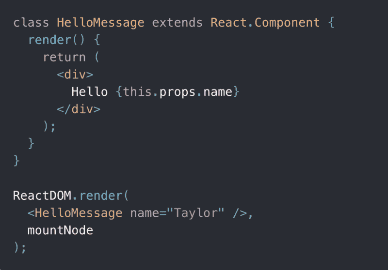

# React 面试问题:浏览器中呈现的是什么，组件还是元素？

> 原文：<https://www.freecodecamp.org/news/react-interview-question-what-gets-rendered-in-the-browser-a-component-or-an-element-1b3eac777c85/>

#### **技巧问题**

你可能不喜欢这个答案，因为不幸的是，它有点复杂。

> 无论如何，**元素**这个词不是和**成分**这个词同义吗？？



Form reactjs.org

> **更新:**这篇文章现在是我的书《React.js Beyond The Basics》的一部分。

> 阅读此内容的更新版本以及更多关于在[**【jscomplete.com/react-beyond-basics】**](https://jscomplete.com/g/component-or-element)*做出反应。*

从技术上讲，ReactDOM 不在 DOM 中呈现 React 组件或 React 元素。它呈现由组件实例支持的 **DOM 元素。对于类组件来说也是如此。对于函数组件，ReactDOM 只呈现 DOM 元素。函数组件没有实例(可以用`this`访问),所以当使用函数组件时，ReactDOM 呈现一个从函数返回的元素生成的 DOM 元素。**

这里需要理解的是，React 元素不同于 DOM 元素。React 元素只是 HTML 元素、React 组件或它们的组合的一个描述。

好吧，一个更好的面试问题可能是:**当你在 JSX 使用类似`<MyComponent` / >的东西时，那是一个成分、一个元素还是一个内在的**实体？

这是一个**元素**，但不是一个 DOM 元素。这是一个反应元素。这里的线索是任何 JSX 标签都被翻译成一个`React.createElement`呼叫。记住这一点。创造。**元素**。

然而，为了让 React 继续使用这个 React 元素，它必须调用一个函数或者从一个类中创建一个实例。

你可能会在 React 指南和教程中发现**组件**、**元素**和**实例**这些词混淆在一起。我很抱歉自己混淆了这些词，但我认为初学者需要理解重要的区别。React 博客有一篇关于这个话题的文章，但是我认为对于初学者来说有点太专业了。

以下是我如何向初学者提供这些单词的简单定义:

*   React **组件**是一个模板。一份蓝图。全球定义。这可以是一个**函数**或者一个**类**(带有渲染函数)。
*   一个 React **元素**就是从组件中获取**返回的**。它是一个虚拟描述组件所代表的 DOM 节点的对象。对于函数组件，该元素是函数返回的对象。对于类组件，元素是组件的呈现函数返回的对象。React 元素不是我们在浏览器中看到的。它们只是内存中的对象，我们无法改变它们。
*   React 在内部创建、更新和销毁**实例**，以确定需要呈现给浏览器的 DOM 元素树。使用类组件时，通常将浏览器呈现的 DOM 元素称为组件实例。您可以渲染同一组件的多个实例。实例是在基于类的组件中使用的关键字“`this`”。您不需要手动从类创建实例。你只需要记住它在 React 的内存中的某个地方。
*   基于函数的 React 元素没有实例。一个函数组件仍然可以被多次渲染，但是 React 只是不将一个本地实例与每次渲染相关联。它只是使用函数的调用来确定为函数呈现什么 DOM 元素。

底线是 ReactDOM 不在浏览器中渲染组件，也不渲染元素(从保留 term element 来表示`React.createElement`的结果的意义上来说)。它也不渲染实例。**它渲染 DOM 元素。**

不幸的是，使用术语组件来表示模板和通过模板使用的任何实例或调用似乎是一种常见的做法。在这里我不怪任何人迷茫。这有点痛苦。

#### 这里有什么故事？

每个 React 应用程序都以一个使用 **React 元素**的`render`调用开始。让我们用来自 reactjs.org[的`HelloMessage`例子](https://reactjs.org/)稍微修改一下，也有一个函数组件:

```
const Today = () => (  <div>Today is {new Date().toDateString()}</div>);
```

```
class HelloMessage extends React.Component {  render() {    return (      <React.Fragment>        <div>Hello {this.props.name}</div>        <Today />      </React.Fragment>    );  }}
```

```
ReactDOM.render(  <HelloMessage name="Taylor" />,  mountNode);
```

第一个 React 元素是我们在`ReactDOM.render`调用中开始的元素:

```
<HelloMessage name="Taylor" /> // This is a React element
```

这个 React 元素描述了要呈现的 DOM 树应该以`HelloMessage`组件和一个等于`Taylor`的`name`属性值开始。

**React now 需要回答的问题:什么是`HelloMessage`？**

每当一个 React 元素描述一个 React 组件时(就像我们上面的 React 元素)，React 使用该组件用该组件返回的内容替换该描述。此时，它会为基于类的组件创建一个实例，并在内存中保存一个对该实例的引用。它不会为基于功能的组件创建任何东西；它只是调用它们。

从`HelloMessage`组件返回的是一个描述`React.Fragment`组件的 React 元素。

**React now 需要回答的问题:什么是`React.Fragment`？**

React 将不断减少这些未知的组件描述，直到只剩下有效的 DOM 节点。对`React.Fragment`的描述被翻译成两个 React 元素，一个描述一个`div`，另一个描述一个`Today`组件。

**React now 需要回答的问题:什么是`Today`？**

它调用`Today`函数来解决最后一个问题。`Today`函数返回一个描述`div`的 React 元素。

至此，虚拟树已经包含了描述 DOM 节点的所有 React 元素。React 使用其协调算法来确定浏览器中要更新的内容。与组件实例一起翻译的节点保留修改该实例的权力。

这是把事情弄清楚了一点，还是我把术语搞混了一点？请在下面的回复中告诉我。

感谢阅读。

学习 React 还是 Node？签出我的图书:

*   [通过构建游戏学习 react . js](http://amzn.to/2peYJZj)
*   [Node.js 超越基础](http://amzn.to/2FYfYru)