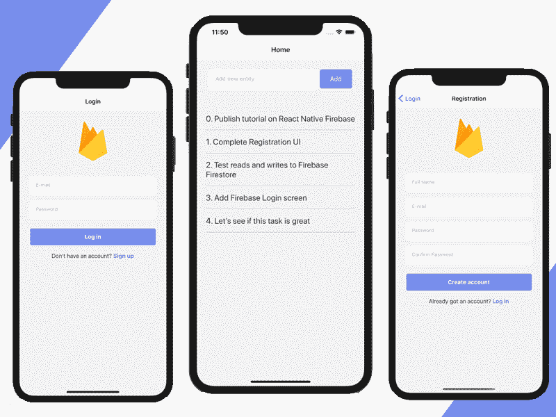
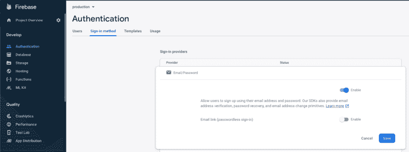
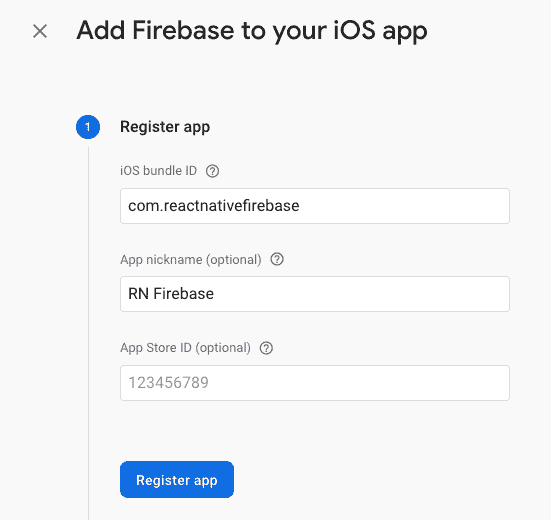

# 如何构建 React 原生 App 并与 Firebase 集成

> 原文：<https://www.freecodecamp.org/news/react-native-firebase-tutorial/>

在本教程中，我们将构建一个与 Firebase 后端集成的 React 本机应用程序。该应用程序将支持 React 本机 CLI 和 Expo CLI。

本 **React Native Firebase** 教程将涵盖认证、注册和数据库(Firestore) CRUD 操作等主要特性。

如果你想直接进入代码，你也可以从 Github 下载完整的源代码。

本教程将带您了解以下部分的详细信息:

1.  **创建 Firebase 项目**
2.  **创建&配置新的 React 原生应用**
3.  **设置文件夹结构、路线和导航**
4.  **实现登录、注册和主屏幕的用户界面**
5.  **向 Firebase Auth 注册**
6.  **使用 Firebase Auth 登录**
7.  **持久登录凭证**
8.  **从 Firebase Firestore 写入和读取数据**

事不宜迟，让我们开始构建 React Native Firebase 项目。最终的移动应用程序将如下所示:



## 1.创建一个 Firebase 项目

前往[Firebase.com](https://firebase.google.com/)创建一个新账户。一旦登录，你就可以在 [Firebase 控制台](https://console.firebase.google.com/u/0/)中创建一个新项目。

*   在[Firebase.com](https://firebase.google.com/)上创建一个新账户
*   在 [Firebase 控制台](https://console.firebase.google.com/)中创建一个新项目
*   在 *Firebase 控制台*->-*认证*->-*登录方式*中启用邮件和密码认证方式



*   创建一个新的 iOS 应用程序，应用程序 ID 为 *com.reactnativefirebase*



*   (可选)创建一个新的 Android 应用程序，包名为 *com.reactnativefirebase*
*   将下一步生成的配置文件下载到您的计算机上(iOS 版为 *GoogleService-Info.plist* ，Android 版为 *google-services.json* )

Firebase 允许你构建 *backendless* 应用。这是一个运行在谷歌云之上的产品，允许开发者构建网络和移动应用，而不需要他们自己的服务器。

这节省了大量时间，因为您不需要编写任何后端代码。它也是高度可扩展的，由 Google 基础设施支持。

在 Firebase 中，您将能够存储应用程序所需的一切——用户、数据、文件、推送通知令牌等。所有这些信息都通过 Firebase SDKs 提供给移动客户端，这些 SDK 与 React Native 兼容。这意味着与后端的所有交互都被抽象出来并封装在 SDK 中，因此移动开发人员不需要担心 API 调用、数据解析、套接字管理等等。

## **2。创建并配置一个新的 React 原生应用**

我们将使 React Native Firebase 应用程序兼容 Expo CLI 和 React Native CLI。

我们现在将使用 Expo，因为它可以让新用户轻松预览他们的应用程序。但是我们不会使用任何 Expo 特定的库，所以 *src* 代码可以简单地用在任何 React 本地应用中，而不管它的脚手架。

我们将使用 [Firebase Web SDK](https://firebase.google.com/docs/reference/js) ，它同时兼容 Expo 和 React Native CLI，并由 Google 直接支持。

如果您想使用 [react-native-firebase](https://rnfirebase.io/) 来代替，请随意安装和配置它(代码仍然是相同的)。但是请记住，我们不建议这样做，原因如下:

*   谷歌并不直接支持它，所以维护它会更加困难，因为它是一个额外的层，可能会导致错误
*   它也不适用于 Expo，Expo 可能会成为许多开发人员的交易破坏者。

以下步骤也包含在关于如何设置开发环境的官方 React 原生文档中。

*   安装 Expo CLI

在您的终端中，只需运行

```
npm install -g expo-cli
```

*   通过运行以下命令创建一个新的 React 本机应用程序

```
expo init react-native-firebase 
```

对于模板，选择*管理的工作流* — *空白*

*   通过运行以下命令启动应用程序

```
yarn ios
// or
yarn android 
```

这也将为您提供一个二维码，您可以使用 iOS 上的相机应用程序或 Android 上的 Expo 应用程序进行扫描。

这太棒了。我们现在有了一个新的 React 原生应用，可以在 iOS 和 Android 上运行。让我们开始将它连接到您的 Firebase 后端。

*   将 Firebase SDK 添加到 React 本地项目中

```
yarn add firebase 
```

*   通过运行以下命令添加 React 本机导航库

```
yarn add @react-navigation/native && yarn add @react-navigation/stack && expo install react-native-gesture-handler react-native-reanimated react-native-screens react-native-safe-area-context @react-native-community/masked-view
```

*   添加要在项目中使用的各种 UI 组件和包

```
yarn add react-native-keyboard-aware-scroll-view base-64 
```

创建 Firebase 配置文件

```
mkdir src src/firebase && touch src/firebase/config.js
```

将您的 firebase 配置添加到 *src/firebase/config.js:*