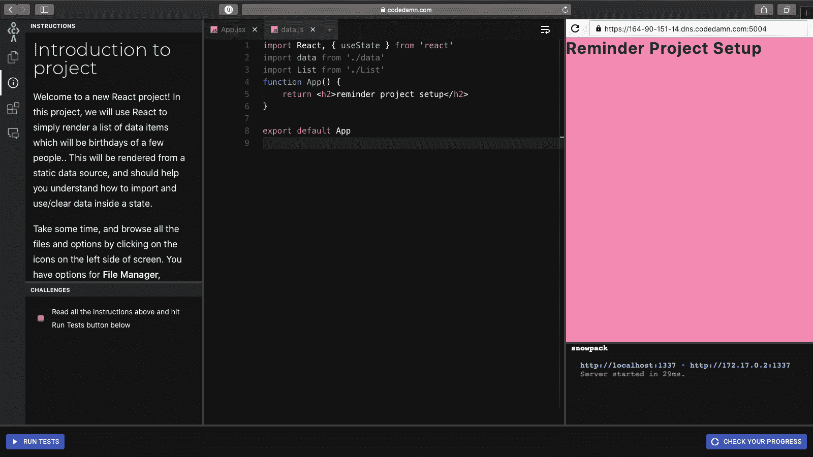
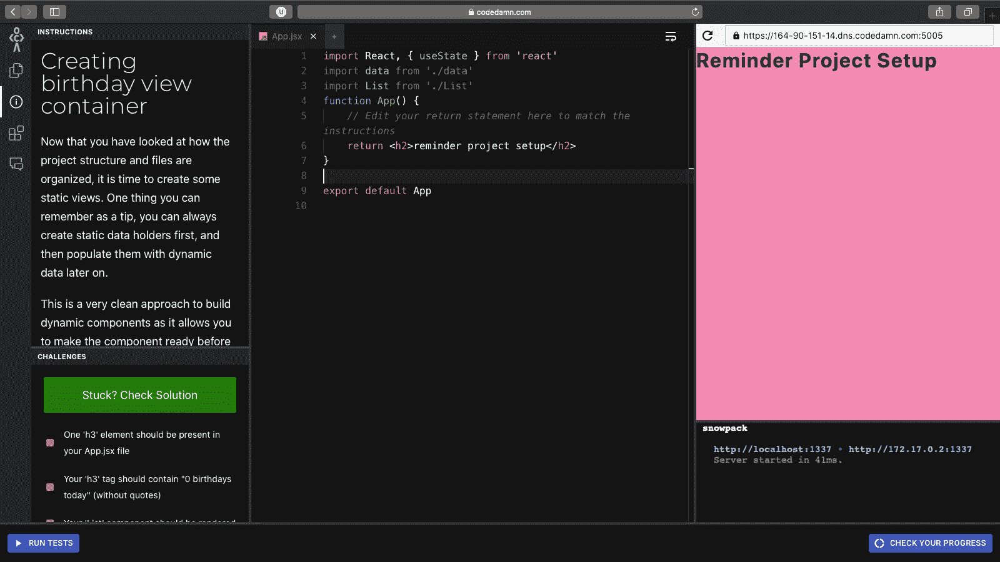
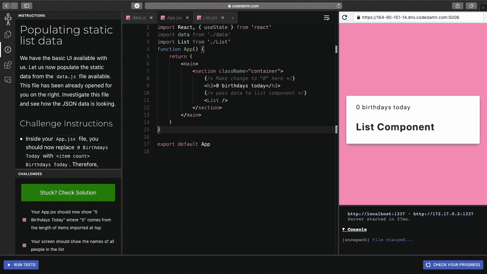
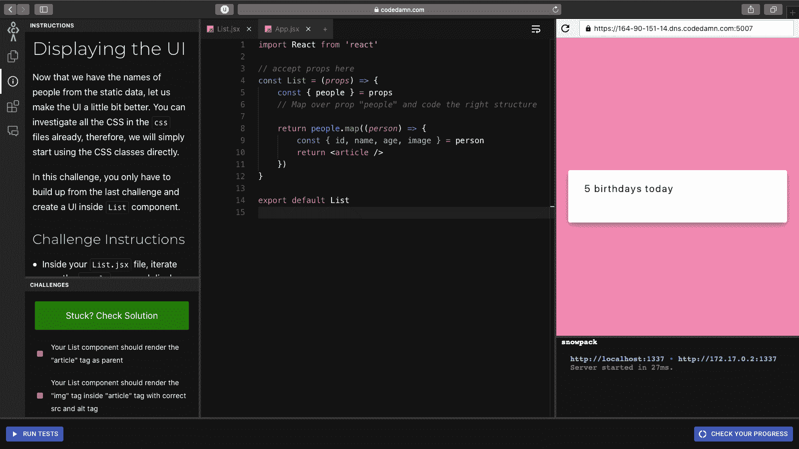
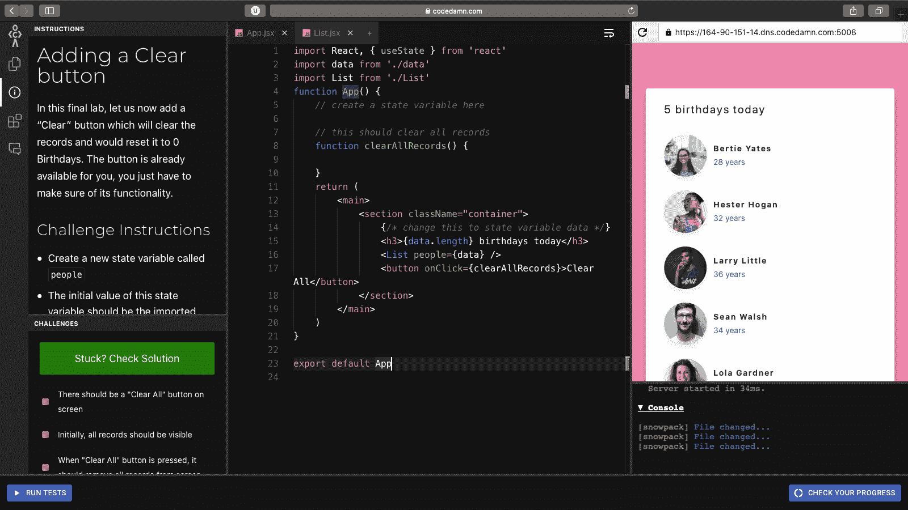

# 通过构建项目学习 react . js–创建生日提醒应用程序

> 原文：<https://www.freecodecamp.org/news/react-practice-project-birthday-reminder-app/>

当你学习一项新技能时，视频教程只能带你到此为止。许多人都同意，通过建立一个项目来弄脏自己的手是一条出路。

因此，在这一系列实践文章中，我们将构建不是一两个，而是五个小型 React 应用程序。

这些应用程序从小型到中型不等，需要你自己构建。就像你真的会编写应用程序，通过测试用例，并确保你学会了每一项技能。

准备好开始了吗？

## 这将如何工作

这篇文章的灵感主要来自 freeCodeCamp 的[自己的视频。但是，除了观看视频，你还必须亲手完成这些项目。](https://www.youtube.com/watch?v=a_7Z7C_JCyo)

在这个迷你博客系列的整个过程中，您将构建五个小项目。对于每个项目，都有一些基本规则:

1.  您必须对某个特性的某些(或所有)方面进行编码
2.  你必须通过既定的挑战测试
3.  你可以寻求外部帮助。但是我建议先花些时间在界面和说明上。这是因为界面的设计是基于你作为一名开发人员在基于开发人员的工具中实际花费的时间。

注意:codedamn 为每个用户建立了一个服务器实例，所以为了使用教室，你需要注册/登录。

如果您只是想检查代码并独自完成项目，而不是在课堂上，您可以在 GitHub 上查看。我在下面的每一节都链接了 GitHub，所以你可以跳到代码中的相关部分。

让我们开始第一个项目。如果我收到好的反馈，我会继续写文章和项目。

## 如何构建生日提醒应用程序(项目#1)

因为这是我们的第一个项目，我会把复杂性保持得很低。在这个项目中，我们将使用 React 来呈现一个数据项列表，即一些人的生日。

这些数据将从静态数据源呈现，应该有助于您理解如何在状态中导入和使用/清除数据。我们将在我用我的项目 Codedamn 创建的教室里工作。你可以从这里开始这个教室。

我强烈建议您尽可能自己完成本课程和其他课程。你可以(也应该)以这篇博文为指导。

以下是您将在课堂上学到的内容:

1.  基本 React 项目的外观
2.  如何从静态 JS 文件加载数据
3.  如何使用 useState 存储数据
4.  如何清除状态变量并看到它在用户界面中的反映

### 实验 1 -项目介绍



Preview of the lab where you complete this task

这里是这个实验室的链接。

第一个挑战是向你介绍这个项目及其结构。花些时间找出这个问题中所有相关的部分，一旦你完成了，只需点击“运行测试”来通过这个挑战。这里没什么花哨的:)

### 实验 2 -如何创建生日视图容器



Preview of the lab where you complete this task

[这是本练习实验室](https://codedamn.com/practice/react-birthday-reminder/b96e0967-f575-4f01-ab4d-31df229bf161)的链接。

你也可以在 GitHub [这里](https://github.com/codedamn-classrooms/react-birthday-project/tree/lab2)找到实验室的设置文件。

既然您已经看到了项目结构和文件是如何组织的，那么是时候创建一些静态视图了。

请记住，您总是可以先创建静态数据容器，然后再用动态数据填充它们。

这是一种非常简洁的构建动态组件的方法，因为它允许您在动态填充数据之前准备好组件。

在本实验中，您需要完成以下挑战:

*   在 App.jsx 文件中，创建以下 HTML 层次结构:

```
main > section.container > h3 + List
```

*   提示:上述缩写意味着您的结构应该如下所示:

```
<main>
	<section class="container">
    	<h3></h3>
        <List />
    </section>
</main>
```

*   您的`h3`应该包含文本:

```
0 birthdays today
```

*   您的`<List />`组件应该是顶部导入的`List.jsx`组件。

要通过所有测试，请确保执行以下操作:

*   App.jsx 文件中应该有一个“h3”元素
*   您的“h3”标签应包含“今天 0 个生日”(不带引号)
*   应该呈现您的“列表”组件

以下是应对这一挑战的解决方案:

```
import React, { useState } from 'react'
import data from './data'
import List from './List'
function App() {
	// Edit your return statement here to match the instructions
	return (
		<main>
			<section className="container">
				<h3>0 birthdays today</h3>
				<List />
			</section>
		</main>
	)
}

export default App 
```

### 实验 3 -如何填充静态列表数据



Preview of the lab where you complete this task

这里是这个实验室的链接。

你也可以在 GitHub [这里](https://github.com/codedamn-classrooms/react-birthday-project/tree/lab3)找到实验室的设置文件。

我们已经有了基本的用户界面。现在让我们填充来自`data.js`文件的静态数据。

该文件已经在编辑器的右侧为您打开。签出这个文件，看看 JSON 数据是什么样子的。

在本实验中，您必须完成以下工作:

*   在您的`App.jsx`文件中，您现在应该用`<item count> Birthdays Today`替换`0 Birthdays Today`。因此，最初，它应该显示`5 Birthdays Today`。记住，`<item count>`来自于顶部导入的`data`变量中的元素数量。
*   提示:您可以使用`data.length`
*   将导入的`data`变量作为道具传递给`List`组件。这个道具应该叫`people`
*   提示:T0
*   在`List`组件中，使用这个传递的数据暂时只呈现人名。您可以将这些人放在上面并显示他们的名字。

这里有三个你必须通过的测试:

*   您的 App.jsx 现在应该显示“今天 5 个生日”,其中“5”来自顶部导入的项目的长度
*   你的屏幕应该显示名单中所有人的名字
*   您应该使用列表组件中的“people”属性来传递数据，它应该显示姓名

这是挑战的解决方案。

App.jsx 文件:

```
import React, { useState } from 'react'
import data from './data'
import List from './List'
function App() {
	return (
		<main>
			<section className="container">
				{/* Make change to "0" here */}
				<h3>{data.length} birthdays today</h3>
				{/* pass data to list component */}
				<List people={data} />
			</section>
		</main>
	)
}

export default App 
```

List.jsx 文件:

```
import React from 'react'

// accept props here
const List = (props) => {
	const { people } = props
	// Map over prop "people" and display only the names in any way you like
	return people.map((item) => {
		return <p key={item.id}>{item.name}</p>
	})
}

export default List 
```

### 实验 4 -如何显示新用户界面



[这是这个实验室的链接](https://codedamn.com/practice/react-birthday-reminder/b8513131-b3e6-422c-a4bb-304e3fbc8f74)

你也可以在 GitHub [这里](https://github.com/codedamn-classrooms/react-birthday-project/tree/lab4)找到实验室的设置文件。

现在我们已经从静态数据中获得了人名，让我们把 UI 做得更好一点。您可以先浏览一下`css`文件中的所有 CSS，然后我们将直接开始使用 CSS 类。

在这个挑战中，你只需要从上一个挑战开始，在`List`组件中创建一个 UI。

在本实验中，您必须完成以下工作:

*   在您的`List.jsx`文件中，迭代`people`属性并显示以下 HTML 结构:

```
<article class="person">
	" alt="<name of user>" />
	<div>
		<h4>NAME_OF_USER</h4>
		<p>AGE_OF_USER years</p>
	</div>
</article>
```

*   确保您适当地替换了占位符。另外，React JSX 中的 CSS 类被命名为`className`，只是提醒一下！

这里有 4 个你必须通过的测试:

*   您的列表组件应该将“article”标签呈现为父标签
*   您的列表组件应该使用正确的 src 和 alt 标记呈现“article”标记内的“img”标记
*   您的列表组件应该在“article”标签中呈现“div > h4”和人名
*   您的列表组件应该在“article”标记内呈现“div > p ”,并显示该人的年龄

下面是解决方案(List.jsx 文件):

```
import React from 'react'

// accept props here
const List = (props) => {
	const { people } = props
	// Map over prop "people" and code the right structure

	return people.map((person) => {
		const { id, name, age, image } = person
		return (
			<article key={id} className="person">
				
				<div>
					<h4>{name}</h4>
					<p>{age} years</p>
				</div>
			</article>
		)
	})
}

export default List 
```

### 实验 5 -如何添加“全部清除”按钮



[这是这个实验室的链接](https://codedamn.com/practice/react-birthday-reminder/c17707a4-a56e-43ec-ba71-5408a6ccd937)

你也可以在 GitHub [这里](https://github.com/codedamn-classrooms/react-birthday-project/tree/lab5)找到实验室的设置文件。

在最后一个实验中，我们现在添加一个“清除”按钮，该按钮将清除记录并将其重置为 0 生日。这个按钮已经为你准备好了，你只需要确保它能正常工作。

在本实验中，您必须完成以下工作:

*   创建一个名为`people`的新状态变量
*   这个状态变量的初始值应该是从顶层导入的数据。
*   现在在`List`组件中传递这个状态变量。
*   当按下`Clear`按钮时，清空状态变量，以便不显示任何记录(提示:将其设置为空数组)

这些是你必须通过的测试:

*   屏幕上应该有一个“全部清除”按钮(已经为你做了)
*   最初，所有记录都应该是可见的
*   当“清除所有”按钮被按下，它应该从屏幕上删除所有记录

以下是本实验的`App.jsx`解决方案文件:

```
import React, { useState } from 'react'
import data from './data'
import List from './List'
function App() {
	// create a state variable here
	const [people, setPeople] = useState(data)

	// this should clear all records
	function clearAllRecords() {
		setPeople([])
	}
	return (
		<main>
			<section className="container">
				<h3>{people.length} birthdays today</h3>
				<List people={people} />
				<button onClick={clearAllRecords}>Clear All</button>
			</section>
		</main>
	)
}

export default App
```

你完了！恭喜你在 React 中完成了一个小项目。要走的路:)

## 结论

我希望你喜欢这个该死的教室。你可以在 codedamn 上的 [React Mastery](https://codedamn.com/learning-paths/react-mastery) 学习路径中找到许多其他人。

虽然还有很多空白需要填补，但是如果你是新手的话，这很有可能会让你非常顺利地开始。

请务必在我的 [Twitter 账号](https://twitter.com/mehulmpt)上告诉我您的体验，因为这将有助于我设计接下来的实践课堂。