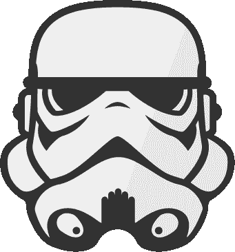
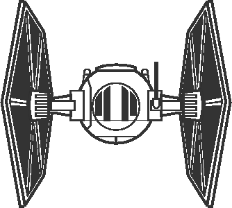
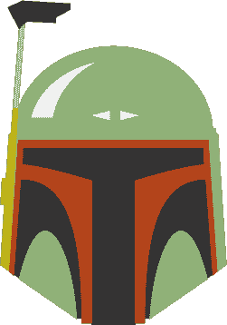
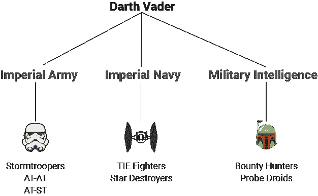
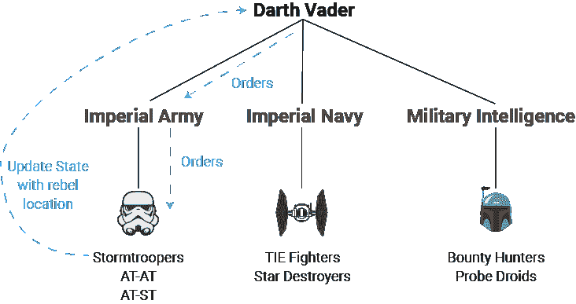
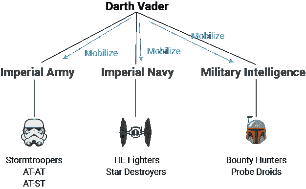

# 反应道具/状态通过达斯·维德追捕叛军来解释

> 原文：<https://www.freecodecamp.org/news/react-props-state-explained-through-darth-vaders-hunt-for-the-rebels-8ee486576492/>

凯文·科诺年科

# 反应道具/状态通过达斯·维德追捕叛军来解释

#### 如果你看过星球大战，那么你就能理解道具和状态。

属性和状态对于编写可读的 React 代码至关重要。但是它们是很难理解的概念，因为它们基于与 Angular 或 jQuery 完全不同的范式(如果你使用过这两者的话)。

但是不要担心——我将用一个星球大战的类比来澄清一切。

没错。如果你看过原版的星球大战系列，就能理解道具和状态。

这里有一个不剧透的第 4-6 集的基本前提复习:

1.  达斯·维德无情地追捕叛军，因为他们是对抗银河帝国的最后抵抗力量。
2.  由莱娅公主和卢克·天行者领导的起义军必须反击，利用帝国内部的弱点。
3.  达斯·维德使用各种战术试图发现叛军的动向，包括一支帝国冲锋队军队、一支星际舰队和各种侦察兵。

帝国资源的整个计划取决于维德的领导。

如果您习惯使用 jQuery，您可能会考虑创建一个事件处理程序(比如 click()处理程序)，然后逐行显式地更改用户界面的不同部分。

但是在 React 中，想法是当**状态**被修改时，这些变化将**通过**道具**自动渗透到所有子组件。因此，您只需要编写代码来更改一件事——状态** — ,并观察您的 UI 更新。

这类似于达斯·维德指挥他的三支部队的方式。一旦叛军位置的消息传回给他，他的资源就会自动动员起来发动攻击。

让我们开始吧。本教程将要求对 JSX 有一个基本的了解，你可以在这里了解更多关于[的知识。](https://facebook.github.io/react/docs/thinking-in-react.html)

### 银河帝国概述

这里是银河帝国的三翼。

**帝国军**由帝国冲锋队、AT-ATs、AT-STs 等组成。

**帝国海军**由歼星舰、TIE 战斗机等组成。

军事情报由波巴·费特这样的赏金猎人、探测机器人和其他专业侦察兵组成。

这里有一个快速的组织结构图，它将为我们如何编写组件提供一些指导。

提醒一下:维德的第一个目标是找到叛军的位置。那些在组织结构图底部的是能够完成这一任务的实际功能单元。如果他们中的一个发现了叛军基地，他们的指令将是回到维德身边，这样他就可以执行他的作战计划。

React 是关于动态用户界面的。当用户完成一个特定动作时，**状态**如何变化？在这种情况下，达斯·维德会有一个被称为*重新分配*的**状态**。由于这是关键的动态变量，帝国的三个翼会因*重新分配*状态**状态**的变化而动员起来。

冲锋队遭遇叛军基地→返回达斯·维达并告知位置

用户单击某个元素→更新某个父组件的状态

下面是代码中的基本内容，遵循上面的组织结构图:

### 国家解释

**State** 允许你基于一个变量一次动态改变多个元素。**状态**包含了用户界面中根据用户输入而改变的关键部分。

随着状态中需要跟踪的东西越来越少，您将能够更清晰地编写组件，出现错误的机会也越来越少。当状态改变时，许多组件可能基于一个变量而改变。

jQuery 通过要求您为每个必须更改的元素写一行来解决这个问题。它不像**状态**那样明确基于父子关系。

假设帝国冲锋队遭遇了叛军。维德命令他们尽快向他报告。一旦他们带着起义军的位置回来，维德就可以执行他剩下的命令，这些命令取决于起义军的位置。下面是一个经过修改的图表，它描绘了上面列出的组件的路径。

订单已经传递给图表底部的每个成员。一旦他们遇到叛军，他们知道要回到维德勋爵身边。*reb allocation*状态将随行星更新，无论它是“恩多”、“霍斯”还是其他什么地方。

这与接收用户输入然后更新父组件中的状态是同一个概念。许多 React 实践者选择编写具有单一功能的组件，因此实际监听用户输入的组件几乎总是不同于保存状态的组件。

帝国内部的冲锋队嵌套在帝国内部

**在真实的应用程序中:**嵌套在父 div 中的用户输入嵌套在父 div 中

#### 当状态改变时会发生什么？

这就是 React 的妙处。与编写复杂的事件处理程序(如 jQuery)不同，一切都取决于状态的变化。您可以清楚地跟踪 UI 中的变化到这些状态变化。

在这种情况下，一旦*重新分配*被发现，**状态**就会改变到那个星球。但这只是故事的一半。达斯·维德心里会有计划，根据这种状态变化调动不同的资产。他可以提前为这种可能性做好准备。比如，“当我们找到他们的星球时，立即前往那里，准备进攻！”

一旦国家发生变化，这些变化会自动与帝国的 3 个分支共享。类似地，当父组件的状态改变时，子组件自动继承新的状态。

每个组件也可以有自己的状态。例如， *ImperialArmy* 组件可能有一个*士兵计数*状态，用于统计军队成员。我们不会在这个例子中修改它，但是你可以想象一场战斗可能会影响*部队人数*。

注意这种状态是如何不依赖于*重新分配*的。如果是的话，我们不会想要明确地声明另一个状态。我们希望它根据*重新分配*状态的变化自动更新。

因为它是独立的，所以下面是代码的样子:

等等，那么这种状态是如何在不同组件之间传递的呢？这就把我们带到了…道具！

### 道具说明

在我们的达斯·维德案例中，当指挥帝国冲锋队和图表底部的其他单位时，我们实际上需要两套指令。

问题 1: 如果帝国冲锋队人遇到叛军，他们该怎么办？

**回答:**向达斯·维德回报。

问题 2: 帝国冲锋队应该去哪里旅行？

**答案:** *如果* 叛军没有被发现，随机搜索星系。*否则*，去叛军所在地攻击他们。

道具允许我们持续监控*重新分配*的状态，如果状态改变，就命令部队移动。*reb allocation*是一个字符串。但是，当他们最初发现叛军时，必须执行的命令是什么呢？

我们实际上也可以传递一个函数作为**道具**！这意味着我们可以将回调传递给每个冲锋队员，如果他们发现了目标，就会执行回调。在下图中，你可以沿着“命令”勾勒出的路径追踪**道具**。

在一个典型的用户界面中，假设用户点击了一个按钮，而你想要更新一个父组件的状态。您还必须从该父组件传递一个回调，该回调将在用户单击时触发。该回调然后可以更新状态**，因为它源自设置状态**的同一个父。

这很重要，所以让我们一行一行地研究这段代码:

**第 8 行:**我们为帝国冲锋队创建了一个命令，要求他们在找到叛军的位置后立即返回。

**第 19 行**:我们通过更新地点**道具**将命令传递给全军。

第 32 行:帝国军用相同的更新地点**道具**将这个命令传递给每个冲锋队。

**Line 42** :我们创建了一个 discoverLocation 函数，这样当它被触发时，我们可以将输入的值传递给 updateLocation()回调函数。

当冲锋队找到位置时，它触发 discoverLocation()函数，这样我们就可以通过 updateLocation()返回位置。这将更新 *vadersArmy* 父组件中的**状态**。

其他注意事项:我们将重新分配的任务一路下达到每个冲锋队员。在本教程中，我们不会对这些信息做任何事情，但在未来，你可以想象这些信息可能会被用来将所有士兵的位置转移到叛军基地。

### 最后的总结

1.  达斯·维德给银河帝国的每个成员下了一道命令:如果你们发现了叛军，立即向我汇报。在代码中，这是父组件*中的一个函数，然后通过**道具**传递给每个子组件。*
2.  陆军、海军和军事情报局(帝国的三个部门)再次通过**道具**将这一指令传递给每一个部队。
3.  帝国的每个成员都有指令。当他们遇到叛军时，他们将使用回叫功能将位置一路传回达斯·维德，他将同时向整个帝国发布最新消息，并为战斗做准备。这模拟了一个动态的用户输入，它改变了父组件的状态。

如果你喜欢这篇文章，你可能也会喜欢我对挑战 CSS 和 JavaScript 主题的其他解释，比如定位、模型-视图-控制器和回调。

如果你认为这可能会帮助和你处境相同的人，那就给它一颗“心”吧！