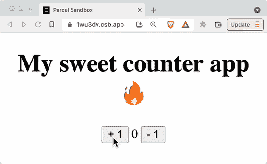

# 绝对初学者的反应状态

> 原文：<https://www.freecodecamp.org/news/react-state/>

任何现代 JavaScript 开发人员都需要理解的一个最基本的概念是**状态**。

如果你不理解状态，你就不能充分利用 React 等强大的库来构建你的应用程序。

让我们来看看状态到底是什么，它现在是如何存在于您的 JavaScript 应用程序中的，以及 React 如何允许我们使用像`useState`这样的内置钩子来更容易地管理它。

> 想要一个学习 React 的好资源吗？每天使用 **[React 训练营](https://reactbootcamp.com)** 在 30 分钟内成为 React pro。

## 什么是状态？

可能会让您感到惊讶的是，您用普通 JavaScript 构建的任何网站或应用程序都已经包含了状态。只是不太清楚它住在哪里。

下面是一个基本的例子:

假设我们正在用 JavaScript 构建一个计数器应用程序。我们希望这个应用程序能够显示当前的计数，以及增加和减少一个计数。

它将只包含当前计数，以及一个增加计数的按钮和一个减少计数的按钮。

这是我们应用程序的最终版本:



The final counter app

下面是我们应用程序的起始标记:

```
<!DOCTYPE html>
<html>
  <head>
    <title>Counter App</title>
    <meta charset="UTF-8" />
  </head>

  <body>
    <div>
      <button>+ 1</button>
      <span>0</span>
      <button>- 1</button>
    </div>
  </body>
</html>
```

简单地说，**状态是我们需要在应用程序中随时间管理的数据。**

状态经常通过用户输入改变，在我们的应用程序中就是这种情况。

我们柜台 app 里是什么状态？这是计数。

我们的用户可以通过点击适当的按钮来增加或减少状态值。重要的是，我们希望向用户显示这些变化。

## 普通 JavaScript 中的状态问题

虽然状态看起来是一个简单的概念，但是当您单独使用普通的 JavaScript 时，管理它有两个问题:

1.  国家是什么或它住在哪里并不明显。
2.  当使用像`document`这样的本地浏览器 API 时，读取和更新状态是一个不自然且经常重复的过程。

当用户点击任一按钮时，我们如何更新计数状态？

我们首先需要获得对每个元素的引用。要在普通 JavaScript 中做到这一点，通常的做法是为每个元素添加一个惟一的`id`属性，用`document.querySelector`方法在 JavaScript 中选择每个元素，并将引用存储在一个局部变量中:

```
<!DOCTYPE html>
<html>
  <head>
    <title>Counter App</title>
    <meta charset="UTF-8" />
  </head>

  <body>
    <div>
      <button id="increment">+ 1</button>
      <span id="count">0</span>
      <button id="decrement">- 1</button>
    </div>

    <script>
      const increment = document.querySelector("#increment");
      const count = document.querySelector("#count");
      const decrement = document.querySelector("#decrement");
    </script>
  </body>
</html>
```

现在我们有了对每个 HTML 元素的引用，我们如何让增量按钮工作呢？

我们首先需要监听增量按钮上的点击事件。然后，当按钮被点击时，我们需要从带有“count”的`id`的元素中获取当前计数值。

为此，我们使用`document` API 深入 HTML 文档，并使用`count.innerText`获取该值。`innerText`值是一个字符串，所以我们把它转换成一个数字，加 1，然后把那个值*写回*到`count.innerText`。

为了使减量按钮工作，我们再次做同样的步骤。唯一的区别是我们使用了表达式`Number(count.innerText - 1)`。

```
<!DOCTYPE html>
<html>
  <head>
    <title>Counter App</title>
    <meta charset="UTF-8" />
  </head>

  <body>
    <div>
      <button id="increment">+ 1</button>
      <span id="count">0</span>
      <button id="decrement">- 1</button>
    </div>

    <script>
      const increment = document.querySelector("#increment");
      const count = document.querySelector("#count");
      const decrement = document.querySelector("#decrement");

      increment.addEventListener("click", () => {
        count.innerText = Number(count.innerText) + 1;
      });

      decrement.addEventListener("click", () => {
        count.innerText = Number(count.innerText) - 1;
      });
    </script>
  </body>
</html>
```

这不是太多的代码，但是您可以看到这里有许多步骤不是非常直观和重复的:

*   向 HTML 元素添加任意 id
*   使用 JavaScript 查询元素
*   在变量中存储元素引用
*   监听元素上的适当事件
*   使用`document` API 获取当前状态值
*   用`.innerText`将新的状态值写回页面

这些是我们的程序运行所需的大量低级指令，但它们并不能帮助我们思考底层状态。

正如我们所见，状态存在于浏览器中。这意味着我们必须首先“找到”状态，然后**强制**(以计算机比我们更理解的方式)更新那个值。

幸运的是，React 为我们提供了一种更简单的方式来更新状态和思考状态。

## React 如何帮助我们管理状态？

使用 React 的一个重要好处，以及为什么在开发 JavaScript 应用程序时使用 React 是您感兴趣的原因，是它为您提供了更新状态的更简单的模式。

与普通的 JavaScript 不同，React 负责更新用户看到的内容这一困难的工作。我们所要做的就是告诉它我们正在管理的状态以及新的值应该是什么。

我们可以简单地将状态放入变量中，然后更新该变量的值，而不是将状态放在浏览器中，每次需要读取或更新时都必须找到它。在我们这样做之后，更新和新的值将显示给我们的用户。

这是 React 中管理状态的整个概念。

我们可以在 React 组件中编写所有的标记，而不是使用 HTML 文档。

它的编写方式与常规的 JavaScript 函数相同，并且使用一种称为 JSX 的相同语法显示相同的 HTML 元素。

```
export default function Counter() {
  return (
    <div>
      <button>+ 1</button>
      <span>0</span>
      <button>- 1</button>
    </div>
  );
}
```

我们如何用 React 创建相同的计数器应用程序？

在我们的 React 应用程序中，一旦我们确定了我们的状态，我们就使用 JavaScript 变量来控制它。

这个变量可以用多种方式声明。管理组件状态最流行的方式是使用 **`useState`钩子**。

React 中的一个**钩子**的工作方式非常类似于普通的 JavaScript 函数。这意味着我们可以在组件的顶部调用它，并将默认值作为计数器应用程序的初始值传递给它。

因为我们的计数值的起始值是零，所以我们只需要调用我们的钩子并把值`0`传递给它，这个值就被放入我们的状态变量中。

```
import { useState } from 'react';

export default function Counter() {
  // the count value lives and is managed up here!
  const [count] = useState(0);  

  return (
    <div>
      <button>+ 1</button>
      <span>{count}</span> {/* use curly braces to output the count value: 0 */}
      <button>- 1</button>
    </div>
  );
}
```

再也不用用`count.innerText`了。我们可以通过使用`count`来输出和读取我们状态的值。

就像任何 JavaScript 变量一样，我们可以随意命名它。不一定要叫`count`。只要它是一个有效的 JavaScript 名称，您就可以把它命名为任何其他名称。

从`useState`返回的值是一个数组。当我们析构它时，第一个析构的值是状态变量。第二个是更新状态的函数。

```
import { useState } from 'react';

export default function Counter() {
  const [count, setCount] = useState(0);  

  return (
    <div>
      <button>+ 1</button>
      <span>{count}</span>
      <button>- 1</button>
    </div>
  );
}
```

我们如何让增量按钮工作？

以下是我们*不需要*做的事情:

*   我们不需要给 HTML 元素添加一个`id`
*   我们不需要深入 DOM 并找出哪个按钮是哪个按钮
*   我们不需要监听带有`document.addEventListener`的点击事件

要在单击按钮时更新状态，请为每个按钮添加`onClick`道具。这允许您在用户按下按钮时调用一个函数。

对于增量按钮，我们将通过将`count + 1`传递给`setCount`来更新状态，对于减量按钮，我们将把`count - 1`传递给`setCount`。

```
import { useState } from 'react';

export default function Counter() {
  const [count, setCount] = useState(0);  

  function incrementCount() {
    setCount(count + 1);
  }

  function decrementCount() {
    setCount(count - 1);   
  }

  return (
    <div>
      <button onClick={incrementCount}>+ 1</button>
      <span>{count}</span>
      <button onClick={decrementCount}>- 1</button>
    </div>
  );
}
```

这是我们用 React 创建一个工作计数器应用程序所需的所有代码。

当每个按钮被按下并且状态被更新时，React 将完成更新页面的所有工作，以便用户可以看到新的状态。

这是使用 React 与普通 JavaScript 相比的巨大优势:当使用像`useState`这样的钩子管理状态，React 负责有效地更新用户看到的内容时，我们可以创建更简单、更可靠的应用程序，其中状态易于查看、读取和更新。

## 想从我这里学到更多的反应吗？

如果你喜欢这个 React 教程，看看我的 [**React 训练营**](https://reactbootcamp.com/) 。

它将为您提供所需的所有培训:

*   每天只需 30 分钟，就能从完全的初学者变成专业的反应者
*   从零开始到部署，构建 4 个全栈 React 项目
*   了解构建您喜欢的任何应用程序的强大技术堆栈

[](https://reactbootcamp.com) 
*点击加入 React 训练营*