# 2021 年完整的 React 教程——通过构建项目学习 React 的主要概念

> 原文：<https://www.freecodecamp.org/news/react-tutorial-build-a-project/>

欢迎学习 2021 年完整的 React 教程。本指南将帮助您在构建完整的应用程序的过程中尽快有效地使用 React。

与你以前学过的很多教程相比，这本书从头到尾都非常实用。

您将学习如何在大约 100 行代码内创建一个完整的 React 应用程序，它利用了 React 的许多核心概念:钩子、状态管理、表单、JSX 元素、组件、道具、样式和条件。

最重要的是，你将在亲自动手编写代码的过程中学习所有这些概念。我们开始吧！

> 寻找成为 React 雇佣开发人员的完整指南？查看 [**反应训练营**](https://reactbootcamp.com) 。

## 如何启动我们的 React 项目

我们将通过访问网站 [react.new](https://react.new) 来创建 React 应用程序。

这将为我们创建一个新的代码沙箱。我们可以使用代码沙箱来创建和开发完整的 React 应用程序，而无需在我们的计算机上安装任何东西。

一旦您访问 react.new，您将看到您的代码编辑器，并且在右侧，我们会看到我们的应用程序的一个活动版本，我们可以对其进行更改:

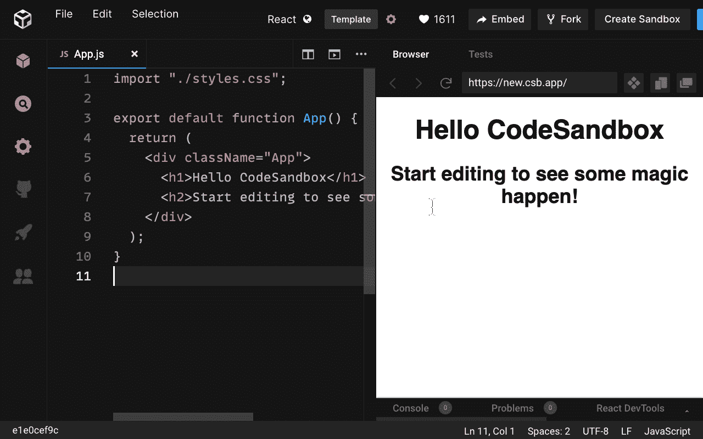

> 快速提示:确保点击 command/ctrl S。这样做将分叉我们的沙箱，并创建一个特殊的 URL，我们可以在未来重新访问。

现在，我们正在查看我们的应用程序组件，这是我们的应用程序中显示的唯一组件。如果我们看一下左边的文件浏览器，我们会看到 app 正在这个 index.js 文件中导入和呈现。

```
// src/index.js
import { StrictMode } from "react";
import ReactDOM from "react-dom";

import App from "./App";

const rootElement = document.getElementById("root");
ReactDOM.render(
  <StrictMode>
    <App />
  </StrictMode>,
  rootElement
);
```

所有这些代码是做什么的？

它只是“渲染”或显示我们的应用程序，将它注入到一个 index.html 文件中，这就是我们在页面右侧看到的。

代码还会找到我们的应用程序，并将其放入所谓的根元素(id 为“root”的 div)。如果你想知道那个元素在哪里，你可以在我们的公共文件夹中找到它，特别是在 index.html 文件中。

## 如何使用 JSX

现在我们有了一个工作的 React 应用程序，让我们开始构建它并改变我们所看到的。

让我们从 div 开始，删除 h2 元素，在 h1 中，调用我们的应用程序“Todo List”:

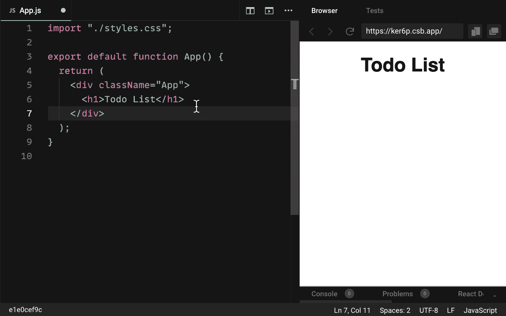

我们在这里工作的东西叫做 JSX。它看起来很像 HTML，但实际上是 JavaScript。我们用它来构建应用程序的结构，就像我们使用 HTML 一样。

> 我们可以在 JSX 中使用任何标准的 HTML 元素:div、任何标题元素、段落、跨度、按钮等等。

需要注意的是，JSX 和 HTML 之间有一些细微的区别。

我们在 JSX 上使用的属性与普通的 HTML 元素略有不同。它们以 camelcase 风格编写，这是用 JavaScript 编写变量或属性的标准方式。

例如，要在 JSX 元素上应用一个类，我们使用一个名为`className`的属性。对于普通的 HTML 来说，它就叫做`class`。

```
// src/App.js
import "./styles.css";

export default function App() {
  return (
    <div className="App">
      <h1>Todo List</h1>
    </div>
  );
}
```

如果我们对 JSX 使用`class`而不是`className`，我们将得到一个警告，说 class 是一个无效的 DOM 属性:

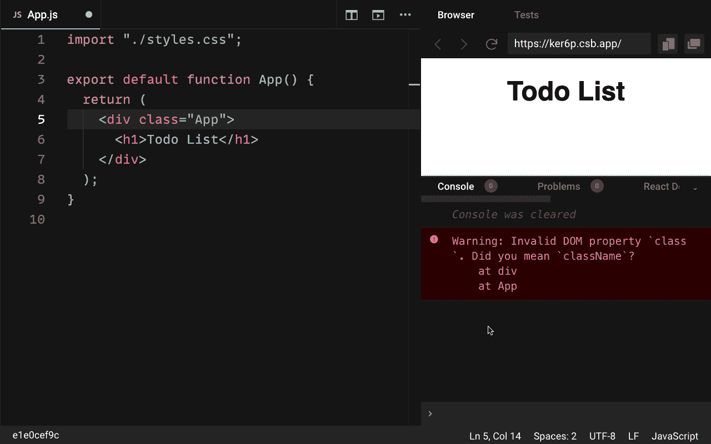

## 如何创建 Todo 元素列表

因为我们正在创建一个 todo 应用程序，所以让我们在 h1 标题下创建我们的 todo 列表。

我们可以从制作一个无序列表开始，用一些列表项作为子元素。每个 todo 都将在一个`li`元素中列出:

```
// src/App.js
import "./styles.css";

export default function App() {
  return (
    <div className="App">
      <h1>Todo List</h1>

      <ul>
      	<li>Todo Item</li>
      </ul>
    </div>
  );
}
```

然而，作为 React 开发人员，我们可以做得更好。相反，让我们创建一个专用组件来显示我们的待办事项。

## 如何创建新的 React 组件

组件是任何 React 应用程序的支柱。

我们使用组件来分离用户界面的不同部分。这使得它们可以在我们应用程序中的任何需要的地方重用，更好地组织我们的代码，更容易理解我们的项目。

> 组件实现了编程中的一个重要概念，叫做“关注点分离”这意味着我们的组件的每个部分最好都有自己明确定义的角色和职责，与任何其他组件分开。

正如我们有一个应用程序组件一样，我们可以创建一个在应用程序中显示的组件。既然是 todos 的列表，就姑且称之为“TodoList”吧:

```
// src/App.js
import "./styles.css";

export default function App() {
  return (
    <div className="App">
      <h1>Todo List</h1>

      <TodoList /> {/* component with single tag */}
    </div>
  );
}
```

## 反应组件规则

每个组件都必须以大写字母开头。一旦组件被声明，它就可以像 HTML 元素一样被编写和使用。

一个组件可以只包含一个标签或两个标签。如果在两个标签之间没有任何东西，这两个标签被称为**子标签**，那么它应该只有一个标签，如上面的代码所示:`<TodoList />`。

此外，如果组件或元素只包含一个标记，它必须是自结束的。也就是说，它必须以正斜杠结尾(像`<TodoList />`而不是`<TodoList>`)。

我们正试图显示我们的 TodoList 组件，但我们还没有创建它。为此，我们可以创建另一个类似 App 的函数组件，名为 TodoList。

在这一点上，我们将得到这个错误，说渲染没有返回任何东西:

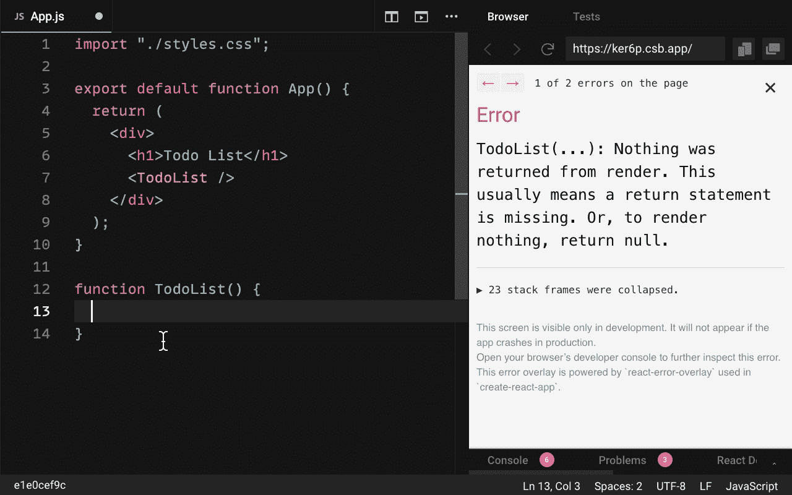

我们需要归还一些东西，特别是一些 JSX。我们制造的每个组件都必须返回 JSX 元素和组件(最终也必须由 JSX 组成)。

在我们的例子中，我们想要返回待办事项列表。让我们把无序列表和我们想要显示的所有列表项放在一起。我们还没有真正的数据，所以让我们创建一些。

特别是，让我们创建一组 todo 数据，我们可以将它们包含在一个数组中。让我们将它添加到应用程序组件中:

```
// src/App.js
import "./styles.css";

export default function App() {
  const todos = [
    { id: 1, text: "Wash dishes", done: false },
    { id: 2, text: "Do laundry", done: false },
    { id: 3, text: "Take shower", done: false }
  ];

  return (
    <div>
      <h1>Todo List</h1>
      <TodoList />
    </div>
  );
}

function TodoList() {}
```

## 如何用 Props 向组件传递数据

现在的问题是——我们如何将所有这些数据传递给并显示在我们的待办事项列表中？

使用 React 组件，我们可以通过添加到名为 props 的组件的特殊属性来实现这一点。

道具是我们可以添加到 React 组件中的自定义属性，用来将数据传递给我们的组件。它们相当于 JavaScript 中的参数。

既然我们的数据叫做 todos，那我们就把我们的道具命名为同样的名字:“todos”。我们使用等号运算符来设置一个属性的值以及一组花括号。这是因为我们的 todos 数组是一个变量(动态值):

```
// src/App.js
import "./styles.css";

export default function App() {
  const todos = [
    { id: 1, text: "Wash dishes", done: false },
    { id: 2, text: "Do laundry", done: false },
    { id: 3, text: "Take shower", done: false }
  ];

  return (
    <div>
      <h1>Todo List</h1>
      <TodoList todos={todos} />
    </div>
  );
}

function TodoList() {}
```

> 例如，如果我们想把它变成一个字符串，我们可以用引号把它括起来。但是由于这是一个可以改变的动态值，我们希望总是将它包含在花括号中。

在 TodoList 组件中，我们的道具将在哪里被接收，以最终显示我们的 todos 数据？它们会在任何函数接收参数的地方被接收。

我们在一个我们通常称之为“道具”对象上接收我们的道具数据，但是我们可以给它起任何我们喜欢的名字。

我们可以看到，我们正在通过使用`console.log(props)`传递这些数据。如果我们查看控制台选项卡，我们的 props 对象上有一个名为“todos”的属性。

正如我们所料，它有一个包含三个项目的数组:

```
// src/App.js
import "./styles.css";

export default function App() {
  const todos = [
    { id: 1, text: "Wash dishes", done: false },
    { id: 2, text: "Do laundry", done: false },
    { id: 3, text: "Take shower", done: false }
  ];

  return (
    <div>
      <h1>Todo List</h1>
      <TodoList todos={todos} />
    </div>
  );
}

function TodoList(props) {
  console.log(props) // {todos: Array(3)}
}
```

## 如何使用映射函数映射数组项目

为了显示每个列表项，我们可以使用位于`props.todos`的数组。

特别是，我们可以在 todos 数组上使用 React 提供的一个特殊函数，名为 **map** 。

因为我们想在 TodoList 中显示它，我们再次需要使用一组花括号在我们的 JSX 中显示它。使用`props.todo.map`，我们将映射这个数组，就像映射一个普通的 JavaScript 数组一样。

> React map 函数与普通的 JavaScript map 函数略有不同，因为它用于返回和呈现 JSX 元素。

接受一个内部函数，在这个函数中，我们可以访问每个 todo。使用箭头函数，我们可以返回每个 todo 在其自己的 JSX。

最后，我们可以通过将 JSX 括在一组括号中来立即返回它:

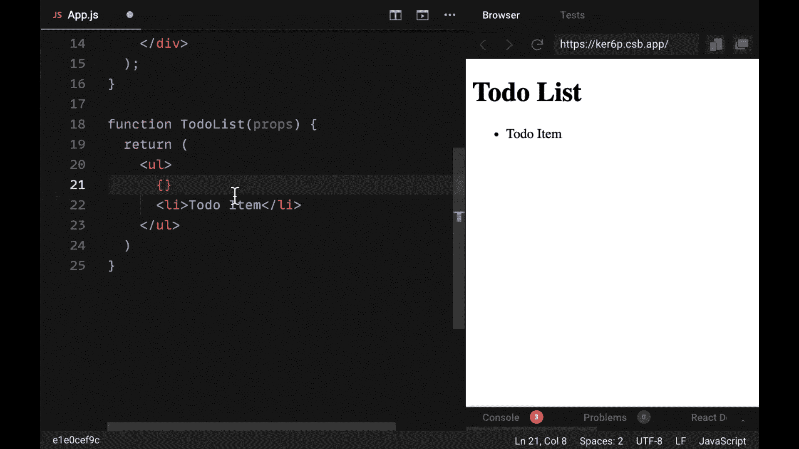

在我们的内部函数中，我们可以访问每个 todo 的数据。为了显示这些数据，我们可以获取每个已知为对象的 todo。我们可以使用一组花括号来输出`todo.text`上任何内容的动态值。

当我们这样做时，我们可以看到我们的三个待办事项:

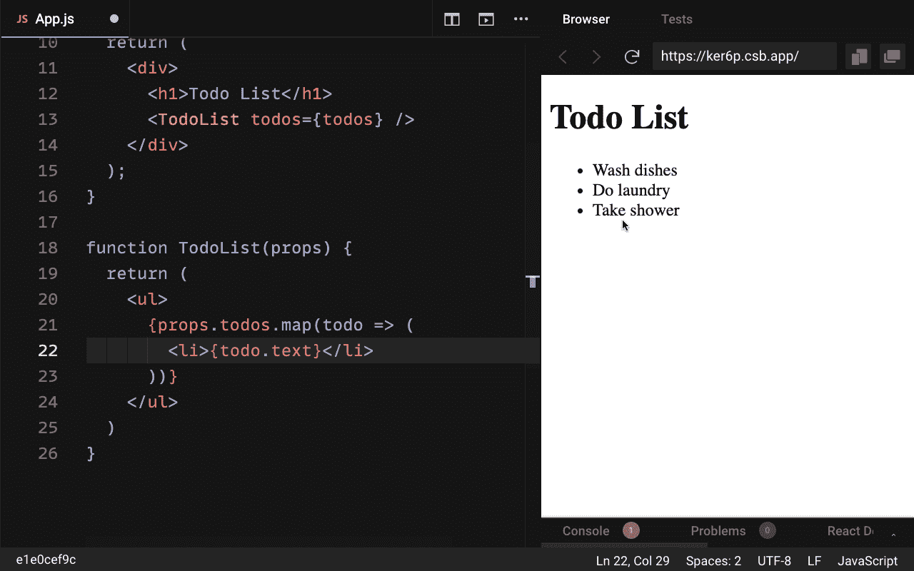

## 什么是反应键(为什么它们很重要)？

如果我们看看底部的控制台选项卡，我们会看到一个警告，说列表中的每个孩子都应该有一个“唯一的关键道具”

这样做的原因是 React 需要跟踪列表中每个条目的顺序。它是在一个叫做**键**的特殊反应道具的帮助下完成的。

> 对于键，通常希望使用唯一标识符，即只与一条数据相关联的唯一值。在我们的例子中，为了识别每个待办事项的数据，我们将使用`todo.id`上提供的唯一编号。

那么为什么钥匙很重要呢？对于 React 来说，弄清楚它应该如何适当地更新我们的用户界面是很重要的。如果我们要更新 todo 的文本或 done 值，关键是告诉 React 哪个 todo 项需要更新。

一旦我们将 key prop 添加到我们正在循环的元素或组件中，我们就不再收到该警告:

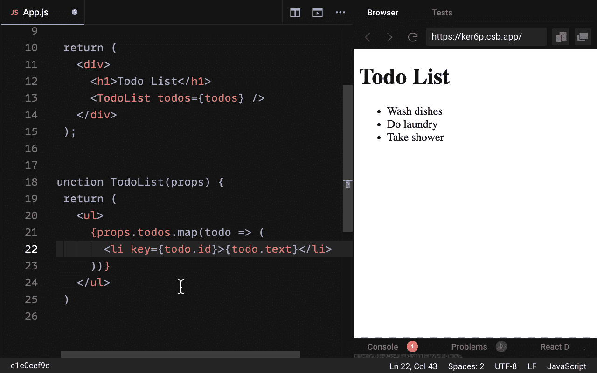

## 如何用析构获得个人道具

注意，一个额外的简写是，我们可以引用那个对象上的单个属性，而不是引用 TodoList 中的整个对象，通过使用对象析构来使我们的代码稍微短一点。

> 对象析构不是一个 React 概念，而是一个标准的 JavaScript 特性，通过直接将对象属性声明为单独的变量，使得访问对象属性变得更加容易。

到目前为止，我们只有一个道具被传递给 TodoList，所以让我们分别析构这个道具，`todos`。

为此，我们在函数参数中添加一组花括号，并从 props 对象中获取我们需要的属性。这意味着我们可以将`props.todos`改为`todos`:

```
// src/App.js
import "./styles.css";

export default function App() {
  const todos = [
    { id: 1, text: "Wash dishes", done: false },
    { id: 2, text: "Do laundry", done: false },
    { id: 3, text: "Take shower", done: false }
  ];

  return (
    <div>
      <h1>Todo List</h1>
      <TodoList todos={todos} />
    </div>
  );
}

// using object destructuring on the props object
function TodoList({ todos }) {
  return (
    <ul>
      {todos.map((todo) => (
        <li key={todo.id}>{todo.text}</li>
      ))}
    </ul>
  );
}
```

## 如何添加新的待办事项

现在给我们的列表添加一些新的待办事项怎么样？

在我们的 TodoList 组件下面，让我们添加一个负责添加新 todos 的新组件。对此的逻辑名称应该是“AddTodo”。

我们可以在待办事项列表组件下创建它。让 AddTodo 返回一个包含基本文本输入和提交按钮的表单元素。

```
// src/App.js
import "./styles.css";

export default function App() {
  const todos = [
    { id: 1, text: "Wash dishes", done: false },
    { id: 2, text: "Do laundry", done: false },
    { id: 3, text: "Take shower", done: false }
  ];

  return (
    <div>
      <h1>Todo List</h1>
      <TodoList todos={todos} />
      <AddTodo />
    </div>
  );
}

function TodoList({ todos }) {
  return (
    <ul>
      {todos.map((todo) => (
        <li key={todo.id}>{todo.text}</li>
      ))}
    </ul>
  );
}

function AddTodo() {
  return (
    <form>
      <input placeholder="Add todo" />
      <button type="submit">Submit</button>
    </form>
  );
}
```

> 注意，任何只包含一个标签的 JSX 元素(比如我们的输入)必须以正斜杠结束。如果我们不包括它，我们将得到一个编译器错误，说“未终止的 JSX 内容”

现在的问题是:我们如何输入我们的输入，提交我们的表单，并有一个新的 todo 添加到我们的 todos 数组？

## 如何在 React 中处理表单提交

为了提交表单，我们需要开始处理 React 中的事件。

在我们的例子中，当用户提交表单时，我们希望使用“submit”事件，React 通过添加新的 todo 来处理表单提交。

React 为表单元素添加了一个名为`onSubmit`的特殊道具。onSubmit 接受一组花括号内的函数。让我们创建一个新函数，我们称之为`handleAddTodo`。

> 注意，React 中处理事件的大多数函数都带有前缀“handle”。如何命名函数最终取决于您，但这是一个有用的约定。

需要注意的是，这个函数应该在组件本身(AddTodo)中创建，而不是在组件之外。当`handleAddTodo`被传递给`onSubmit` prop 时，它将在我们提交表单时被调用:

```
// src/App.js
import "./styles.css";

// ...

function AddTodo() {
  function handleAddTodo() {}

  return (
    <form onSubmit={handleAddTodo}>
      <input placeholder="Add todo" />
      <button type="submit">Submit</button>
    </form>
  );
}
```

## 如何防止默认表单行为

当我们单击 submit 按钮或按 return 键时，来自 submit 事件的数据会自动传递给与 onSubmit 连接的函数。我们在参数`handleAddTodo`中接收事件数据。

我们想对这个事件做的第一件事是调用一个名为`.preventDefault()`的方法。每当我们提交表单时，此方法会阻止默认操作:

```
// src/App.js
import "./styles.css";

// ...

function AddTodo() {
  function handleAddTodo(event) {
    event.preventDefault();
  }

  return (
    <form onSubmit={handleAddTodo}>
      <input placeholder="Add todo" />
      <button type="submit">Submit</button>
    </form>
  );
}
```

默认情况下，每当我们提交表单时，页面都会刷新。我们不希望 React 出现这种行为——我们希望 JavaScript 控制接下来发生的任何事情。

在阻止刷新之后，我们想要访问输入到输入中的内容，以便用它创建一个新的 todo。我们如何做到这一点？

## 如何在提交时访问表单数据

我们访问表单中所有元素的方法是借助属性`event.target.elements`。

首先，这会给我们事件目标，也就是表单本身。`elements`是一个属性，它将为我们提供表单中的所有元素，包括我们的输入和提交按钮。

如果我们现在打开 console.log `event.target.elements`，提交我们的表单，查看我们的控制台，我们看到的只是一个具有两个属性的对象，一个名为“0 ”,另一个名为“1”。

这对我们没有太大帮助，尽管我们确实看到这是我们的输入和按钮:

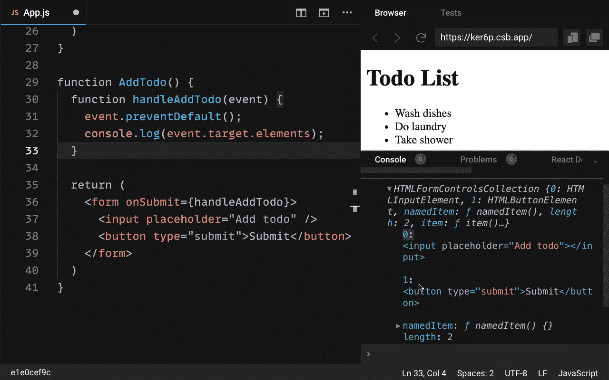

相反，我们希望得到输入到输入中的内容。

为此，我们可以在输入中添加“id”或“name”属性。让我们添加一个值为“addTodo”的 name 属性。当我们再次点击 submit 时，这将为我们提供 elements 对象的一个新属性，也称为`addTodo`。从这个引用中，我们可以很容易地得到输入的内容。

这允许我们使用`event.target.elements.addTodo.value`来获取输入的文本。当我们这样做时，当我们在输入中键入文本，并点击 submit，我们会看到它被记录到控制台:

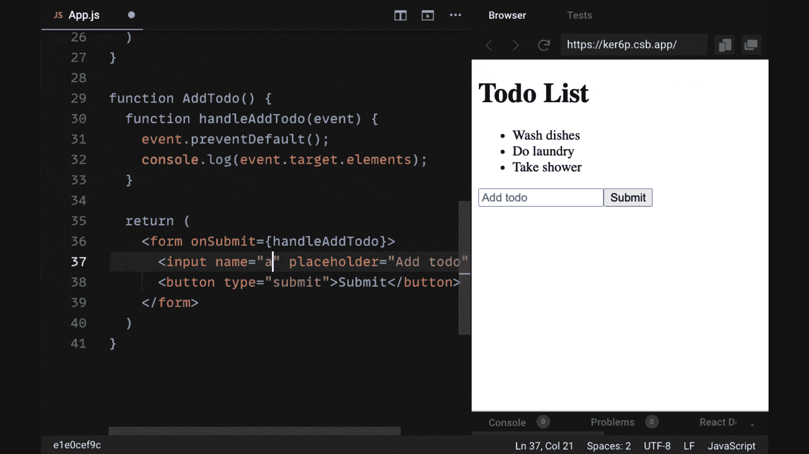

现在我们有了文本，我们将把它放在一个名为“text”的变量中。使用它，我们想要创建一个新的 todo。

我们知道每个 todo 都是一个对象，它必须由属性 id、text 和 done 组成。让我们创建一个变量`todo`，它将等于一个 id 为 4 的新对象，文本将等于我们从 elements 对象获取的文本，我们可以将 done 设置为 false。

默认情况下，不会完成添加的新待办事项:

```
// src/App.js
import "./styles.css";

//...

function AddTodo() {
  function handleAddTodo(event) {
    event.preventDefault();
    const text = event.target.elements.addTodo.value;
    const todo = {
      id: 4,
      text,
      done: false
    };
  }

  return (
    <form onSubmit={handleAddTodo}>
      <input name="addTodo" placeholder="Add todo" />
      <button type="submit">Submit</button>
    </form>
  );
}
```

最后，最大的问题是，我们如何将这个 todo 添加到我们的数组中，`todos`？

## React 中的状态介绍

这就是国家概念的由来。

现在我们处理的是静态数据，没有真正的方法来更新这个 todos 数组。需要说明的是，*有*一种使用 JavaScript 的方法，但是我们目前不能做的是告诉 React，即使我们要更新它，它也需要**重新呈现**这个列表。

换句话说，对我们的数据进行更新，然后在视图中显示更新后的数据。因此，虽然我们可以更新数据，但我们也需要向用户显示更新后的数据。

需要状态来解决我们的问题。

> 状态是管理我们的应用程序数据的一种方式，也允许 React 更新我们的 UI(用户界面)以响应数据变化。

## 如何用 useState 钩子管理 React 中的状态

我们可以使用`useState`钩子在 React 中管理状态。要使用 useState 钩子，我们需要做的第一件事是在顶部导入 React，因为 useState 来自核心 React 库。

之后，我们可以简单地调用应用程序组件顶部的 useState 挂钩。一旦我们像普通函数一样调用 useState，我们将把整个 todos 数组作为初始数据传入。我们的应用程序将中断一会儿，因为我们不再显示我们的 todos。

useState 返回一个包含两个元素的数组:

1.  我们用(我们的 todos 数组)调用了 useState 的初始值，这成为了我们的状态变量
2.  一个特殊的函数，允许我们更新存储在状态变量中的内容

我们可以通过添加一组数组括号来立即获取从 useState 返回的值，从而析构从 useState 返回的值。首先是状态，其次是更新状态的函数:

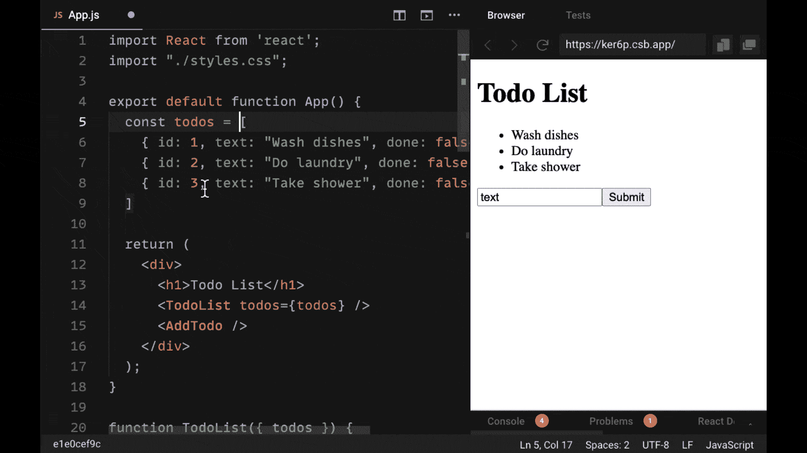

我们将调用我们的状态变量`todos`和 setter 来管理我们的状态`setTodos`。

要更新我们的状态，我们所要做的就是通过它，不管我们希望新的状态是什么。这个`setTodos`函数将被传递给我们的 AddTodo 组件，所以让我们将它添加为同名的 prop。我们还将在 AddTodo 中从 props 对象中析构`setTodos`。

最后，我们可以在`handleAddTodo`的底部调用`setTodos`。这个函数的伟大之处在于，它不需要传递 todos 数组，而是可以在一个函数的帮助下给出以前的状态，我们可以在这个函数内部接收这个状态:

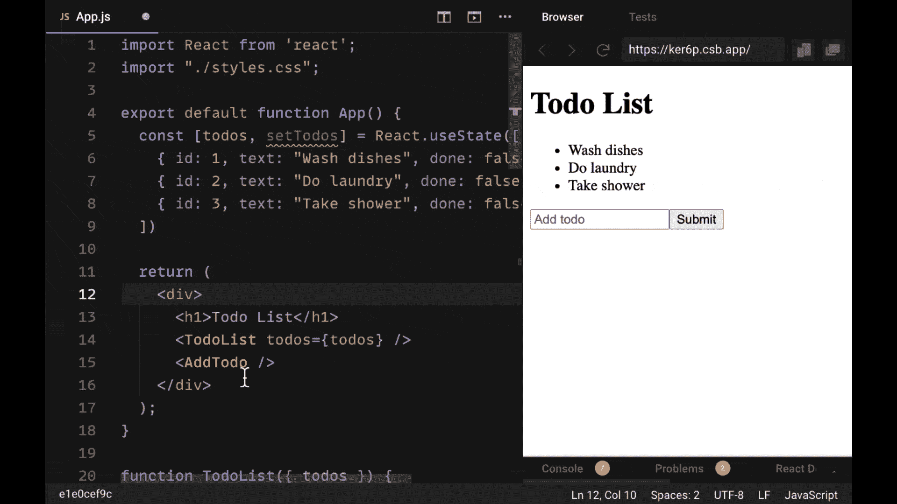

乍一看这似乎很奇怪，但是在`setTodos`中，我们可以访问之前的 todo 数据。如果我们写一个箭头函数或任何函数，我们可以简单地提供我们想要的新状态。

> 能够在 setter 函数中直接访问前一个状态变量的值的好处是，它使我们不必将整个 todos 状态变量作为一个额外的道具传递给我们想要更新其值的每个组件。

如果我们想清空我们的 todos 状态，我们可以在这里返回一个空数组。如果我们提交表单，我们会看到所有的待办事项都被删除了。

一旦我们提交了表单，状态就会更新，我们的应用程序也会重新呈现。

## 在 React 中重新渲染

请注意，父组件中的任何重新渲染都会导致任何子组件重新渲染。这意味着每当我们的 todo 数据被更新时，TodoList 组件(App 组件的子组件)就用新数据进行更新。

如果我们回到`handleAddTodo`，我们可以使用之前的 todo 并使用`.concat()`方法将这个新的 todo 添加到我们的数组中。我们要做的就是返回这个表达式。

让我们添加一个新的 todo，比如“平衡支票簿”一旦我们点击提交，我们会看到立即添加到我们的列表:

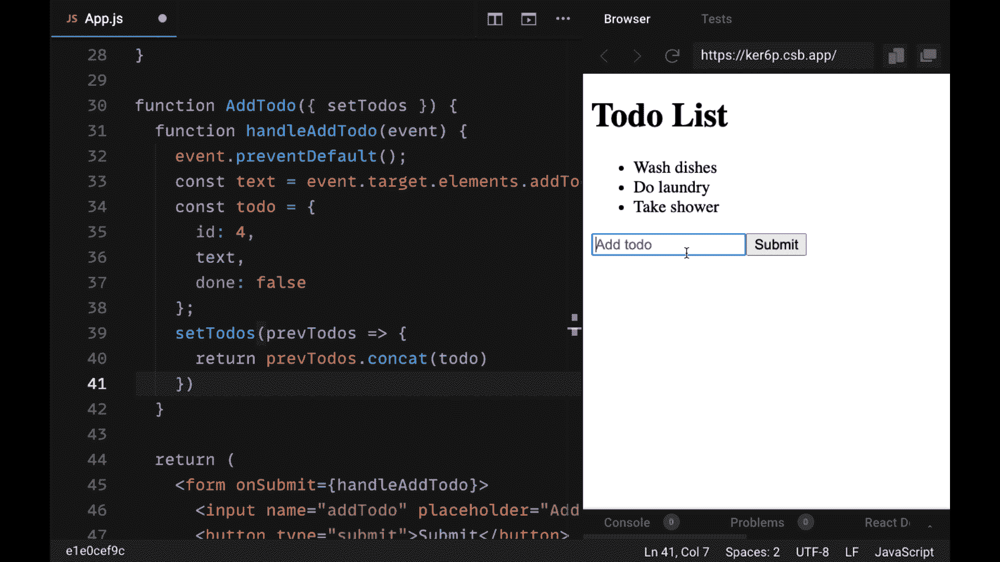

现在这里有一个问题:我们没有在表单提交后清除我们的输入。

这意味着如果我们想添加另一个待办事项，我们必须手动清除它。我们如何获取这个输入的值并清除它？

## React refs 和 useRef

为了执行常见的操作，比如清除输入的值或者聚焦我们的输入，我们可以使用所谓的 **ref** 。

> ref 是 React 提供的引用给定 DOM 元素的特性。

在这种情况下，我们需要一个名为“addTodo”的 input 元素的引用

就像我们的状态一样，我们可以通过调用适当的 React 钩子来处理 refs。要创建一个 ref，我们只需要调用 AddTodo 顶部的`React.useRef()`。我们不必给它传递一个初始值，但是如果需要的话，我们可以给它一个默认值。

我们称这个创建的引用为`inputRef`。使用 inputRef，我们可以创建一个对 input 元素的引用，我们可以通过设置`ref={inputRef}`使用内置的 ref prop 在任何地方访问它:

```
// src/App.js
import React from "react";
import "./styles.css";

//...

function AddTodo({ setTodos }) {
  const inputRef = React.useRef();

  function handleAddTodo(event) {
    event.preventDefault();
    const text = event.target.elements.addTodo.value;
    const todo = {
      id: 4,
      text,
      done: false
    };
    setTodos((prevTodos) => {
      return prevTodos.concat(todo);
    });
  }

  return (
    <form onSubmit={handleAddTodo}>
      <input name="addTodo" placeholder="Add todo" ref={inputRef} />
      <button type="submit">Submit</button>
    </form>
  );
}
```

这是做什么的？它允许我们在`handleAddTodo`中使用属性`inputRef.current`，该属性包含输入元素本身。如果我们登录`input.ref.current`，我们会看到我们的输入元素。

我们有一个对输入的直接引用，这意味着我们可以访问任何我们喜欢的属性。在我们的例子中，我们希望获取 value 属性的输入值。要清除输入中的值，我们可以通过将 value 设置为空字符串来直接改变 inputRef:

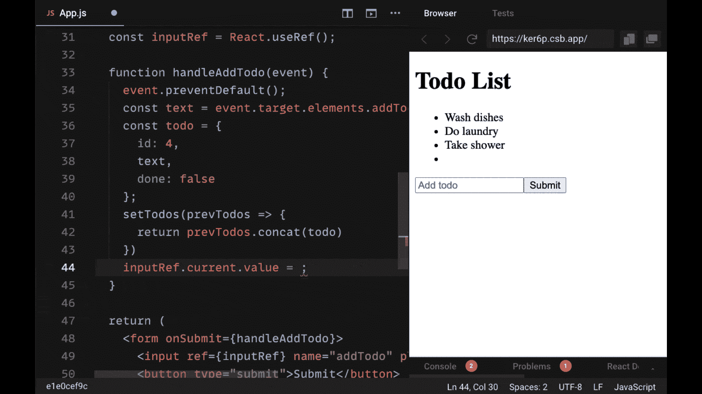

每当我们点击 submit，我们的输入就会被清除，而不需要我们自己手动清除。

## 反应钩的基本规则

由于 useRef 是另一个 React 挂钩，我们开始看到 React 挂钩之间的一些共同特征。它们通常以“使用”一词为前缀。事实上，大多数 React 钩子都有这个前缀，表示它们是钩子，应该这样使用。

此外，React 钩子在函数组件的最顶层被调用。钩子不能在类组件中使用。最后，钩子不能是有条件的(即在 if 语句中使用)。

但是正如你所看到的，React 钩子没有什么特别的。它们的操作非常像普通的 JavaScript 函数。

## 如何用 onClick 将 Todos 标记为已完成

创建待办事项后，我们希望将它们切换为完成——如果我们已经完成了给定的待办事项，则删除它们。我们如何添加这个功能？

如果我们回到我们的列表项，在 TodoList 中，我们可以通过应用一些内联样式来看看它会是什么样子。我们看到了如何通过类添加样式。对于我们希望内联应用于任何给定元素的样式，我们不能使用与普通 HTML 相同的语法。

如果我们尝试使用 HTML 语法，我们将得到一个错误，告诉我们“style prop 期望 style 属性在一个对象中，而不是在一个字符串中”:

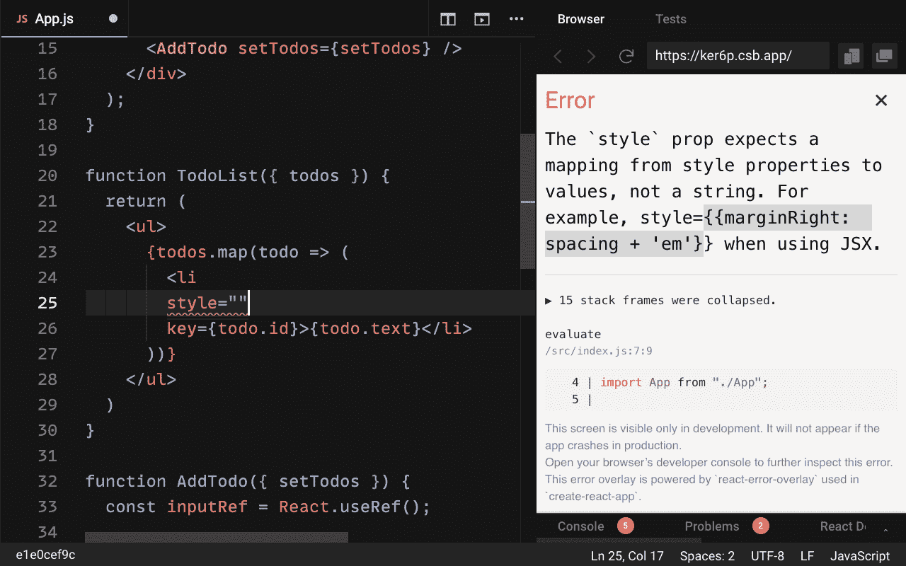

为了解决这个问题，我们将提供一个对象。我们需要在另一组花括号中提供这个对象。然后，我们将像在普通 JavaScript 对象中一样提供任何属性来应用这种删除样式。

对于我们的每个列表项，我们可以将属性`textDecoration`设置为“line-through”:

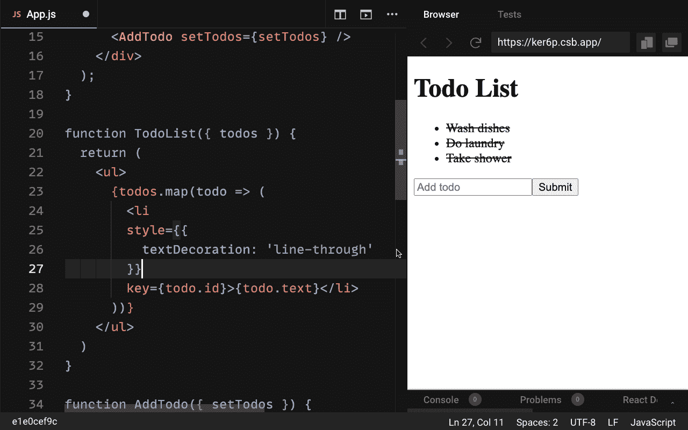

我们不希望每个项目都被删除，我们只希望这是适用于如果一个给定的待办事项完成。我们如何做到这一点？

我们可以使用一个普通的 JavaScript 条件，特别是一个三元组，来说明如果一个给定的 todo 的属性 done 为真，那么我们希望对文本修饰应用删除线值，否则不应用。

如果我们将其中一个 todos 数组更改为 done 值`true`，我们会看到应用了样式规则:

```
// src/App.js

//...

function TodoList({ todos }) {
  return (
    <ul>
      {todos.map((todo) => (
        <li
          style={{
            textDecoration: todo.done ? "line-through" : ""
          }}
          key={todo.id}
        >
          {todo.text}
        </li>
      ))}
    </ul>
  );
}

//...
```

我们实际上如何切换 todo？

我们可能希望用户点击或双击我们的 todo 来删除它。这意味着我们想看看如何注册和处理一种新类型的事件——点击事件。

为了用 React 处理一个点击事件，我们为一个给定的元素提供了`onClick`属性，我们希望为该元素注册事件。在本例中，它是`li`元素。

我们再次需要将它连接到一个函数来处理我们的点击事件。我们将把它称为`handleToggleTodo`，并在我们的 TodoList 组件中创建它。在这种情况下，我们用来处理事件的函数不需要接收任何事件数据。这个函数将处理更新我们的 todo 的状态。

我们希望`handleToggleTodo`遍历`todos`数组，看看用户点击的那个是否存在于我们的数组中。如果是这样，它的 done 值可以切换到相反的布尔值。

为了接收被点击的适当列表项的适当 todo 数据，我们可以调用`handleToggleTodo`作为内联箭头函数，并将 todo 数据作为参数传递:

```
// src/App.js

//...

function TodoList({ todos }) {
  function handleToggleTodo(todo) {}

  return (
    <ul>
      {todos.map((todo) => (
        <li
          onClick={() => handleToggleTodo(todo)}
          style={{
            textDecoration: todo.done ? "line-through" : ""
          }}
          key={todo.id}
        >
          {todo.text}
        </li>
      ))}
    </ul>
  );
}

//...
```

为了更新我们的 todos 状态，我们将把`setTodos`传递给我们的 TodoList 组件。我们将把`setTodos`作为道具传递给 TodoList，并从 props 对象中析构它。

同样，我们可以调用`setTodos`并通过包含一个内部函数来访问之前的 todos。首先，我们可以做的是使用整个 todos 数组并用`.map()`数组函数映射它。

在传递给 map 的内部函数中，我们将检查我们映射的 todos id 是否等于我们单击的 todo。如果是这样的话，我们返回一个新对象，它具有所有以前的 todo 属性，但是将`done`切换到它的相反布尔值:

```
// src/App.js

//...

function TodoList({ todos, setTodos }) {
  function handleToggleTodo(todo) {
    // confused by this code? Here's what it says:

    // if a todo's id is equal to the one we clicked on,
    // just update that todo's done value to its opposite,
    // otherwise, do nothing (return it)

    const updatedTodos = todos.map((t) =>
      t.id === todo.id
        ? {
            ...t,
            done: !t.done
          }
        : t
    );
  }

  return (
    <ul>
      {todos.map((todo) => (
        <li
          onDoubleClick={() => handleToggleTodo(todo)}
          style={{
            textDecoration: todo.done ? "line-through" : ""
          }}
          key={todo.id}
        >
          {todo.text}
          <DeleteTodo todo={todo} setTodos={setTodos} />
        </li>
      ))}
    </ul>
  );
}

//...
```

否则，如果我们迭代的 todo 不是我们点击的那个，我们只想返回它(不改变它)。这个更新后的数组就是我们要传递给`setTodos`来更新状态的数组。

如果我们点击一个待办事项，我们切换它完成。如果我们再次单击它，它会切换回撤消状态:

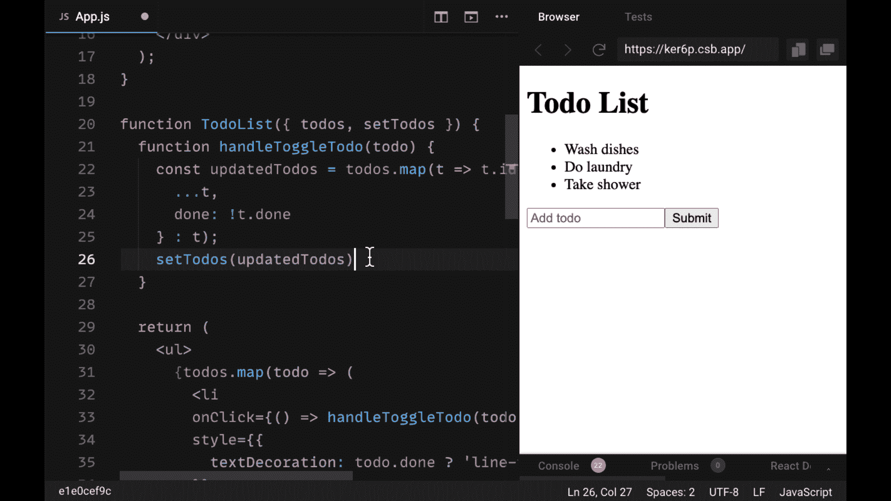

为了正常工作，为了查看过去的待办事项的 id 是否等于我们正在点击的待办事项，我们需要确保每个待办事项的 id 是唯一的。

我们可以不用将每个新的 todo 设置为 id 4，而是使用`Math.random()`来生成一个半随机值，并确保没有相同 id 的列表项。

最后，作为对`onClick`的替代，我们可以使用另一个事件道具`onDoubleClick`，以防用户意外点击给定的 todo。现在，如果用户双击一个列表项，只有这样我们才能切换它完成。

## 如何处理删除待办事项

我们寻求的最后一点功能是能够删除给定的 todo。

我们可以通过添加另一个嵌套组件在 TodoList 中添加该功能。在 todo 文本下面，我们将添加一个新组件:DeleteTodo。让我们在声明 AddTodo 的地方声明这个新组件。

这个组件由什么组成？在其中，我们将返回一个 span，它对我们来说就像一个按钮。用户可以点击它并删除给定的待办事项。

> 如果你想让一个非按钮元素像按钮一样操作，我们需要把它的“role”属性设置为“button”。

对于我们的 span，让我们添加一些样式规则——我们可以给它一个红色，加粗，并通过设置`marginLeft: 10`将其与 todo 文本分开。样式对象的巧妙之处在于，我们不必将 10 个像素表示为一个字符串——我们可以使用值 10 或包含任何我们喜欢的整数。

以下是到目前为止我们的 DeleteTodo 组件的代码:

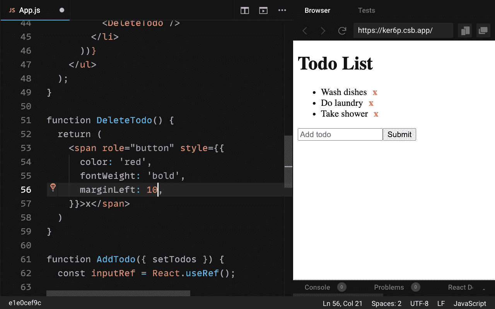

要删除一个待办事项，我们希望能够点击它并显示一个确认对话框。如果用户确认他们想要删除它，只有在那时 todo 才会被删除。

因为我们映射了每个 Todo 项，包括 DeleteTodo，所以我们可以传递一个名为 just `todo`的 prop，上面有每个 todo 的数据。

在 DeleteTodo 中，在我们的 span 元素上，我们想要添加一个`onClick`来处理删除我们的 Todo。为了处理这个问题，我们将调用一个新函数:`handleDeleteTodo`。

使用这个函数，我们首先要显示一个确认对话框。我们可以通过对消息说`window.confirm()`来做到这一点，“您想要删除它吗”？`window.confirm`将根据用户是否确认了对话框而返回值 true 或 false。我们将把这个动作的结果放在一个名为`confirmed`的变量中:

```
// src/App.js
// ...

function TodoList({ todos, setTodos }) {
  // ...

  return (
    <ul>
      {todos.map((todo) => (
        <li
          onDoubleClick={() => handleToggleTodo(todo)}
          style={{
            textDecoration: todo.done ? "line-through" : ""
          }}
          key={todo.id}
        >
          {todo.text}
          {/* pass todo data down as a prop to DeleteTodo */}
          <DeleteTodo todo={todo} />
        </li>
      ))}
    </ul>
  );
}

function DeleteTodo({ todo, setTodos }) {
  function handleDeleteTodo() {
    const confirmed = window.confirm("Do you want to delete this?");
    if (confirmed) {
      // take care of deleting the todo
    }
  }

  return (
    <span
      onClick={handleDeleteTodo}
      role="button"
      style={{
        color: "red",
        fontWeight: "bold",
        marginLeft: 10,
        cursor: "pointer"
      }}
    >
      x
    </span>
  );
}

//...
```

如果`confirmed`为真，那么我们才要删除 todo。

为此，我们需要再次使用`setTodos`。我们将把它从 TodoList 向下传递到 DeleteTodo 组件，并从 props 对象中析构它。

然后在`handleDeleteTodo`内部，我们可以调用它，使用内部函数来获取之前的 todos。要删除用户点击的 todo，我们可以过滤这个数组以确保我们删除的是用户选择的那个。

为此，我们确保阵列中所有 To do 的 id 都不等于我们要删除的 id:

```
// src/App.js

// ...

function DeleteTodo({ todo, setTodos }) {
  function handleDeleteTodo() {
    const confirmed = window.confirm("Do you want to delete this?");
    if (confirmed) {
      setTodos((prevTodos) => {
        return prevTodos.filter((t) => t.id !== todo.id);
      });
    }
  }

  return (
    <span
      onClick={handleDeleteTodo}
      role="button"
      style={{
        color: "red",
        fontWeight: "bold",
        marginLeft: 10,
        cursor: "pointer"
      }}
    >
      x
    </span>
  );
}

// ...
```

现在，如果我们试图删除我们的待办事项，我们会看到我们的确认对话框，我们点击“确定”，它会立即从我们的列表中删除。

如果我们删除了所有待办事项，我们就什么也看不见了。如果我们想告诉用户，当数组为空时，列表中没有 todos，让我们直接进入 TodoList 组件。

如果我们有一个空的 todos 数组，我们可以在我们的返回上面添加一个条件，并检查数组的长度是否等于 0。如果是这样，我们将显示一个带有文本“没有待办事项”的段落元素:

```
// ...

function TodoList({ todos, setTodos }) {
  function handleToggleTodo(todo) {
    const updatedTodos = todos.map((t) =>
      t.id === todo.id
        ? {
            ...t,
            done: !t.done
          }
        : t
    );
    setTodos(updatedTodos);
  }

  if (!todos.length) {
    return <p>No todos left!</p>;
  }

  return (
    <ul>
      {todos.map((todo) => (
        <li
          onDoubleClick={() => handleToggleTodo(todo)}
          style={{
            textDecoration: todo.done ? "line-through" : ""
          }}
          key={todo.id}
        >
          {todo.text}
          <DeleteTodo todo={todo} setTodos={setTodos} />
        </li>
      ))}
    </ul>
  );
}

// ...
```

## 恭喜你！

您现在有了一个工作的 todo 应用程序，它具有完整的 CRUD 功能，可以创建、读取、更新和删除 todo。

您已经看到了许多主要的 React 概念的第一手工作情况，并且您现在已经准备好开始构建自己的 React 应用程序。

如果你想看看我们最终的应用代码，你可以在这里看到它。

## 准备好下一步了吗？加入 React 训练营

**[React 训练营](http://bit.ly/join-react-bootcamp)** 将你应该知道的关于学习 React 的一切打包成一个全面的包，包括视频、备忘单，外加特殊奖励。

获得数百名开发人员已经使用的内部信息，以掌握 React、找到他们梦想的工作并掌控他们的未来:

[](http://bit.ly/join-react-bootcamp) 
*打开时点击此处通知*