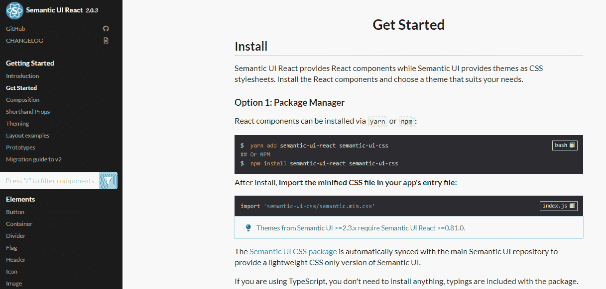
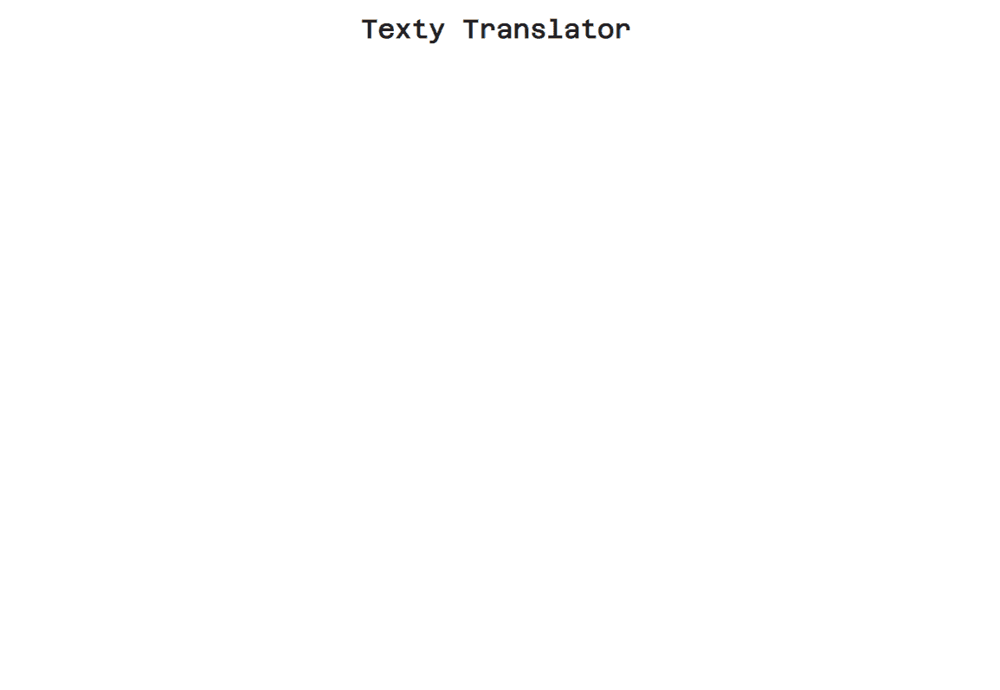
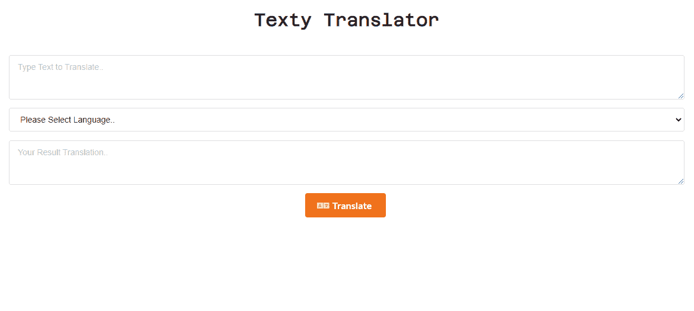
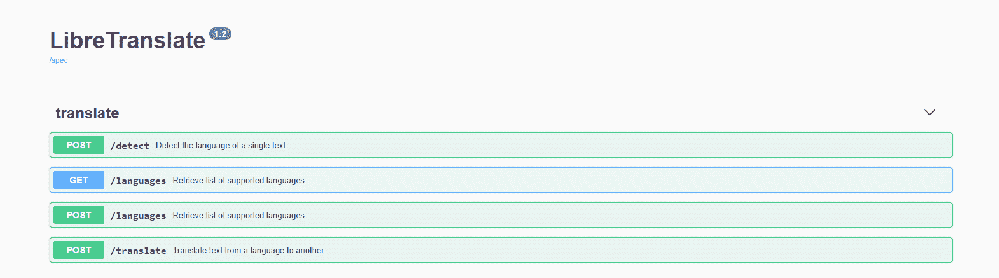
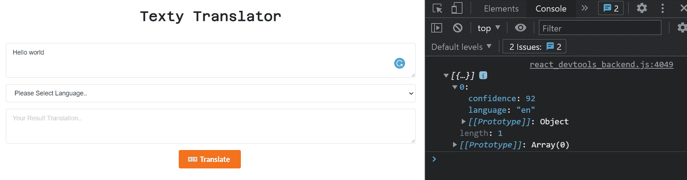
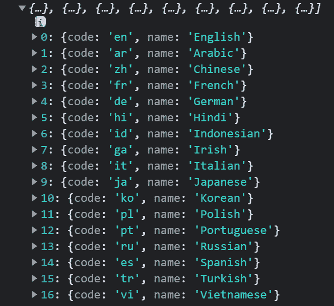
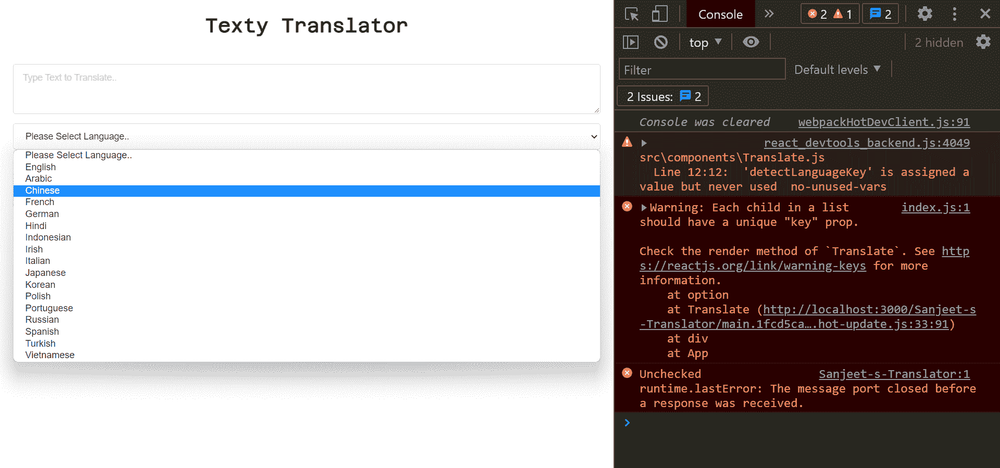
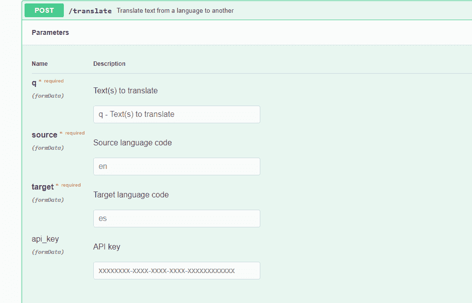
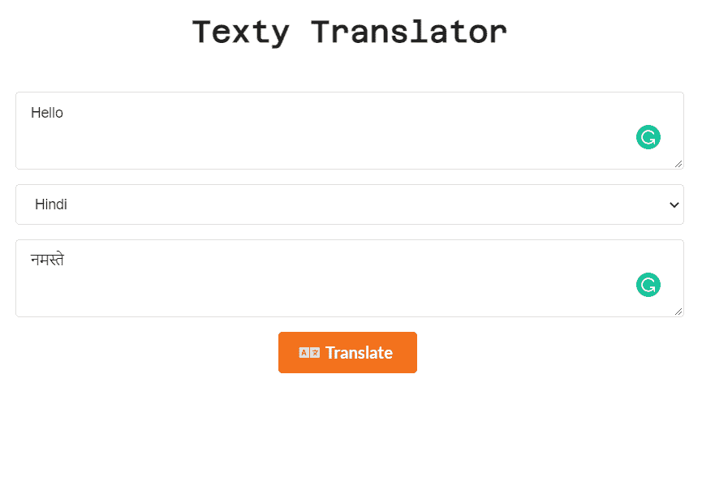

# React 教程–如何构建文本翻译 PWA

> 原文：<https://www.freecodecamp.org/news/react-tutorial-build-a-text-translation-pwa/>

在本文中，我将向您展示如何使用 React 构建一个文本翻译应用程序。它将支持 17 种语言，你也可以做交叉翻译。

以下是我们将创建的内容:


这就是我们的应用程序在构建完成后的样子。它有两个文本区域输入——一个包含我们的源文本，另一个包含我们的结果文本。我们也有一个选择领域，用户可以选择他们想要的语言。

所以，让我们开始吧。

## 如何构建用户界面

为了毫不费力地创建界面，我们将使用一个称为语义 UI 的 UI 库。

因此，在[https://react.semantic-ui.com/](https://react.semantic-ui.com/)导航到 Semantic UI 的网站。

然后，从边栏菜单中选择“开始”:



使用以下命令之一安装它。您可以使用纱线添加或 npm 安装。

```
$  yarn add semantic-ui-react semantic-ui-css
## Or
$  npm install semantic-ui-react semantic-ui-css
```

安装完成后，我们需要将包导入到 index.js 文件中，如下所示:

```
import 'semantic-ui-css/semantic.min.css'
```

现在，我们可以使用语义 UI。

### 如何创建应用程序的组件

让我们创建一个名为 **Translate** 的组件。这将包含我们需要的所有元素。

首先，我们需要一个应用程序标题。因此，在 Translate 组件中，创建一个标题，如下所示:

```
import React from 'react';

export default function Translate() {
    return (
        <div>
            <div className="app-header">
                <h2 className="header">Texty Translator</h2>
            </div>
        </div>
    )
} 
```

Translate.js

现在让我们用 CSS 给它添加一点样式:

```
@import url('https://fonts.googleapis.com/css2?family=Azeret+Mono&display=swap');

.app-header{
  text-align: center;
  padding: 20px;
}

.header{
  font-family: 'Azeret Mono', monospace;
  font-size: 30px;
}
```

App.css Styling

这里，我们使用了 Google Fonts 中的一种叫做 Azeret Mono 的字体，我们已经对齐了标题并给了它一些填充。

这就是我们的标题在这一点上的样子:



我们还需要其他四个要素。第一个是我们的输入文本区，第二个是选择语言的选择下拉菜单，第三个是反映我们翻译文本的输出文本区，最后一个是翻译我们文本的按钮。

我们可以直接从语义 UI 导入表单、文本区、按钮和图标元素，如下所示:

```
import {
    Form,
    TextArea,
    Button,
    Icon
} from 'semantic-ui-react';
```

接下来，我们将使用以下代码在`app-header`之后创建另一个名为`app-body`的 div :

```
import React from 'react';
import {
    Form,
    TextArea,
    Button,
    Icon
} from 'semantic-ui-react';

export default function Translate() {
    return (
        <div>
            <div className="app-header">
                <h2 className="header">Texty Translator</h2>
            </div>

            <div className='app-body'>
                <div>
                    <Form>
                        <Form.Field
                            control={TextArea}
                            placeholder='Type Text to Translate..'
                        />

                        <select className="language-select">
                            <option>Please Select Language..</option>
                        </select>

                        <Form.Field
                            control={TextArea}
                            placeholder='Your Result Translation..'
                        />

                        <Button
                            color="orange"
                            size="large"
                        >
                            <Icon name='translate' />
                            Translate</Button>
                    </Form>
                </div>
            </div>
        </div>
    )
} 
```

Translate.js

我们将用下面的 CSS 给它添加一些样式:

```
@import url('https://fonts.googleapis.com/css2?family=Azeret+Mono&display=swap');

.app-header{
  text-align: center;
  padding: 20px;
}

.header{
  font-family: 'Azeret Mono', monospace;
  font-size: 30px;
}

.app-body{
  padding: 20px;
  text-align: center;
}

.language-select{
  height: 40px !important;
  margin-bottom: 15px;
  outline: none !important;
}
```

App.css

这就是我们的应用程序现在的样子。你可以看到我们有文本区，选择选项，和一个翻译按钮。



### 如何设置 API

为了支持翻译，我们将使用 [LibreTranslate](https://libretranslate.de/docs) API。所以，去他们的网站选择你的 API 吧。



如上图所示，它有四个 API。

首先，我们需要使用/detect POST API 来检测我们的输入语言。

### 如何安装 Axios

但是首先，让我们安装 Axios，因为我们需要用它来发出 API 请求。

要安装 Axios，只需键入以下命令:

```
yarn add axios

##OR

npm i axios
```

Installing Axios

我们可以使用 yarn add axios 或 npm i axios，这取决于您安装的软件包管理器。

现在，让我们将它导入我们的翻译组件。

```
import axios from 'axios';
```

我们还需要 useState 和 useEffect 挂钩。

```
import React, { useState, useEffect } from 'react';
```

然后，创建一个名为 inputText 的状态。

```
const [inputText, setInputText] = useState('');
```

并在输入文本区域字段中，将其绑定到 onChange 事件处理程序。

```
<Form.Field
 control={TextArea}
 placeholder='Type Text to Translate..'
 onChange={(e) => setInputText(e.target.value)}
/>
```

如果我们输入任何文本，它将以 inputText 状态存储。

### 如何调用语言检测 API

现在，让我们调用检测语言 API 来检测我们的输入语言。

像这样创建一个名为`getLanguageSource()`的函数:

```
const getLanguageSource = () => {
        axios.post(`https://libretranslate.de/detect`, {
            q: inputText
        })
        .then((response) => {
            console.log(response.data[0].language)
        })
    }
```

在这里，我们调用检测 API，并将输入作为主体传递。

我们使用 axios.post 将输入文本作为正文发送，并使用 q 作为头参数。

此外，我们希望在单击“翻译”按钮时调用该函数，因此将该函数绑定到“翻译”按钮，如下所示:

```
<Button
                            color="orange"
                            size="large"
                            onClick={getLanguageSource}
                        >
                            <Icon name='translate' />
                            Translate</Button>
```

在第一个输入框中键入一些内容，然后按翻译按钮。您将在控制台中看到检测到的语言对象键，这是我们需要的。



现在，我们需要将这个语言键存储在一个状态中。因此，创建一个名为`detectLanguageKey`的状态。

然后，从响应中设置状态，如下所示:

```
const getLanguageSource = () => {
        axios.post(`https://libretranslate.de/detect`, {
            q: inputText
        })
            .then((response) => {
                setdetectedLanguageKey(response.data[0].language)
            })
    }
```

我们从响应数据中设置第零个索引，因为这是我们的数据开始的地方。

以下是到目前为止的全部代码:

```
import React, { useState, useEffect } from 'react';
import {
    Form,
    TextArea,
    Button,
    Icon
} from 'semantic-ui-react';
import axios from 'axios';

export default function Translate() {
    const [inputText, setInputText] = useState('');
    const [detectLanguageKey, setdetectedLanguageKey] = useState('')
    const getLanguageSource = () => {
        axios.post(`https://libretranslate.de/detect`, {
            q: inputText
        })
            .then((response) => {
                setdetectedLanguageKey(response.data[0].language)
            })
    }

    return (
        <div>
            <div className="app-header">
                <h2 className="header">Texty Translator</h2>
            </div>

            <div className='app-body'>
                <div>
                    <Form>
                        <Form.Field
                            control={TextArea}
                            placeholder='Type Text to Translate..'
                            onChange={(e) => setInputText(e.target.value)}
                        />

                        <select className="language-select">
                            <option>Please Select Language..</option>
                        </select>

                        <Form.Field
                            control={TextArea}
                            placeholder='Your Result Translation..'
                        />

                        <Button
                            color="orange"
                            size="large"
                            onClick={getLanguageSource}
                        >
                            <Icon name='translate' />
                            Translate</Button>
                    </Form>
                </div>
            </div>
        </div>
    )
} 
```

### 如何为选择下拉菜单调用支持的语言 API

现在，第二个 API 获得了支持的语言。我们将使用选择下拉列表中的列表。

创建一个 useEffect 钩子来调用我们支持的语言 API。useEffect 是一个函数，每次组件渲染或加载时都会运行。

```
useEffect(() => {
        axios.get(`https://libretranslate.de/languages`)
            .then((response) => {
                console.log(response.data)
            })
    }, [])
```

这里我们使用 axios.get 方法调用支持语言的 API。然后我们在控制台中安慰响应。

打开控制台检查语言列表。您应该会看到类似这样的内容:



让我们将这些数据设置成一种状态。因此，创建一个名为 languagesList 的状态。它将是一个空数组。

```
const [languagesList, setLanguagesList] = useState([])
```

```
useEffect(() => {
        axios.get(`https://libretranslate.de/languages`)
            .then((response) => {
                setLanguagesList(response.data)
            })
    }, [])
```

然后，在 useEffect 钩子中，我们需要使用`setLanguagesList`设置语言列表。

我们需要在选择选项中显示这个语言列表。因此，让我们使用`languagesList`状态映射选择下拉列表，如下所示:

```
<select className="language-select">
                            <option>Please Select Language..</option>
                            {languagesList.map((language) => {
                                return (
                                    <option value={language.code}>
                                        {language.name}
                                    </option>
                                )
                            })}
                        </select>
```



现在，我们可以从选择下拉列表中选择我们的语言。

### 如何获取所选的语言代码

现在，如果我们选择一种语言——比如说西班牙语——我们需要获取语言代码，因为我们需要在最终的翻译 API 中使用该语言代码。

像这样创建一个名为`languageKey()`的函数:

```
const languageKey = () => {

}
```

在 select 选项上，使用 onChange 绑定这个函数:

```
<select className="language-select" onChange={languageKey}>
                            <option>Please Select Language..</option>
                            {languagesList.map((language) => {
                                return (
                                    <option value={language.code}>
                                        {language.name}
                                    </option>
                                )
                            })}
                        </select>
```

此外，我们需要将语言代码存储在一个状态中，所以让我们创建它。

创建一个名为`selectedLanguageKey`的状态，它将包含我们从选择输入中选择的语言键。

```
const [selectedLanguageKey, setLanguageKey] = useState('')
```

这个 languageKey 函数将接受一个名为`selectedLanguage`的参数。我们将把这些数据存储在`selectedLanguageKey`状态中，这是从 select 选项中获得的。

```
const languageKey = (selectedLanguage) => {
        setLanguageKey(selectedLanguage.target.value)
}
```

现在，如果您查看 LibreTranslate 文档，我们需要三个数据输入:

1.  要翻译的文本。
2.  源语言代码。
3.  目标语言代码。



我们不需要 API 密匙，因为这项服务是免费的。

我们需要在正文中发送的所有三个输入包含在以下这些状态中:

```
const [inputText, setInputText] = useState('');
const [detectLanguageKey, setdetectedLanguageKey] = useState('');
const [selectedLanguageKey, setLanguageKey] = useState('')
```

现在，让我们调用我们最后的 API，也就是/translate。

### 如何调用翻译 API 来翻译我们的文本

创建一个名为 resultText 的最终状态。这个状态将包含我们输出的翻译文本。

```
const [resultText, setResultText] = useState('');
```

创建一个调用翻译 API 的函数:

```
const translateText = () => {
       getLanguageSource();

        let data = {
            q : inputText,
            source: detectLanguageKey,
            target: selectedLanguageKey
        }
        axios.post(`https://libretranslate.de/translate`, data)
        .then((response) => {
            setResultText(response.data.translatedText)
        })
    }
```

可以看到，我们在 resultText 状态下设置 inputText，在 translateText 函数内部调用 getLanguageSource 函数。所以，无论这个函数什么时候运行，getLanguageSource 都会自动触发它们来获取语言源。

换句话说，通过翻译按钮点击这个函数，它将通过 getLanguageSource()设置语言源，然后调用翻译 API。

所以，在翻译按钮上，绑定这个函数:

```
<Button
                            color="orange"
                            size="large"
                            onClick={translateText}
                        >
                            <Icon name='translate' />
                            Translate</Button>
```

接下来让我们创建一个名为 data 的对象。在它里面，我们将发送之前得到的所有数据，比如 inputText、detectLanguageKey 和 selectedLanguage key，分别作为 q、source 和 target。

```
let data = {
            q : inputText,
            source: detectLanguageKey,
            target: selectedLanguageKey
        }
```

然后，我们使用 axios.post 调用 translate API，并将数据对象作为主体参数发送。

```
let data = {
            q : inputText,
            source: detectLanguageKey,
            target: selectedLanguageKey
        }
        axios.post(`https://libretranslate.de/translate`, data)
```

最后，我们将传入的响应数据设置为 resultText 状态。

```
.then((response) => {
            setResultText(response.data.translatedText)
        })
```

所以，现在在输入框中输入一些东西，选择语言，然后点击翻译。你会得到你的翻译文本。

以下是到目前为止的全部代码，供您参考:

```
import React, { useState, useEffect } from 'react';
import {
    Form,
    TextArea,
    Button,
    Icon
} from 'semantic-ui-react';
import axios from 'axios';

export default function Translate() {
    const [inputText, setInputText] = useState('');
    const [detectLanguageKey, setdetectedLanguageKey] = useState('');
    const [selectedLanguageKey, setLanguageKey] = useState('')
    const [languagesList, setLanguagesList] = useState([])
    const [resultText, setResultText] = useState('');
    const getLanguageSource = () => {
        axios.post(`https://libretranslate.de/detect`, {
            q: inputText
        })
            .then((response) => {
                setdetectedLanguageKey(response.data[0].language)
            })
    }
    useEffect(() => {
        axios.get(`https://libretranslate.de/languages`)
            .then((response) => {
                setLanguagesList(response.data)
            })
    }, [])

    const languageKey = (selectedLanguage) => {
        setLanguageKey(selectedLanguage.target.value)
    }

    const translateText = () => {
        getLanguageSource();

        let data = {
            q : inputText,
            source: detectLanguageKey,
            target: selectedLanguageKey
        }
        axios.post(`https://libretranslate.de/translate`, data)
        .then((response) => {
            setResultText(response.data.translatedText)
        })
    }

    return (
        <div>
            <div className="app-header">
                <h2 className="header">Texty Translator</h2>
            </div>

            <div className='app-body'>
                <div>
                    <Form>
                        <Form.Field
                            control={TextArea}
                            placeholder='Type Text to Translate..'
                            onChange={(e) => setInputText(e.target.value)}
                        />

                        <select className="language-select" onChange={languageKey}>
                            <option>Please Select Language..</option>
                            {languagesList.map((language) => {
                                return (
                                    <option value={language.code}>
                                        {language.name}
                                    </option>
                                )
                            })}
                        </select>

                        <Form.Field
                            control={TextArea}
                            placeholder='Your Result Translation..'
                            value={resultText}
                        />

                        <Button
                            color="orange"
                            size="large"
                            onClick={translateText}
                        >
                            <Icon name='translate' />
                            Translate</Button>
                    </Form>
                </div>
            </div>
        </div>
    )
} 
```

现在，最后一步。在 useEffect 钩子中，调用`getLanguageSource()`函数，在依赖数组中设置 inputText。这意味着每当我们的 inputText 文本发生变化，或者这个状态得到更新时，useEffect 函数就会运行，并且它每次运行时都会调用`getLanguageSource()`。

```
useEffect(() => {
       axios.get(`https://libretranslate.de/languages`)
       .then((response) => {
        setLanguagesList(response.data)
       })

       getLanguageSource()
    }, [inputText])
```

现在，让我们检查我们的输出:



键入一些文本作为输入，并选择语言。按 Translate，您将在输出中看到您翻译的数据。

## 结论

现在您知道如何使用 React 构建文本翻译器了。如果愿意，您可以创建自己的 UI。

所以继续吧，构建并尝试一下。你可以做很多事情。

你可以看看我在[上的视频，让我们用 React](https://www.youtube.com/watch?v=R_I5t8r5qsA&t=5s&ab_channel=Cybernatico) 构建一个文本翻译应用程序，它在我的 YouTube 频道上。

随意在这里下载代码:[https://github.com/nishant-666/Sanjeet-s-Translator](https://github.com/nishant-666/Sanjeet-s-Translator)。请不要介意这个名字。

> 快乐学习。