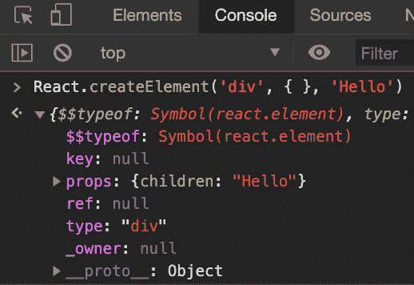
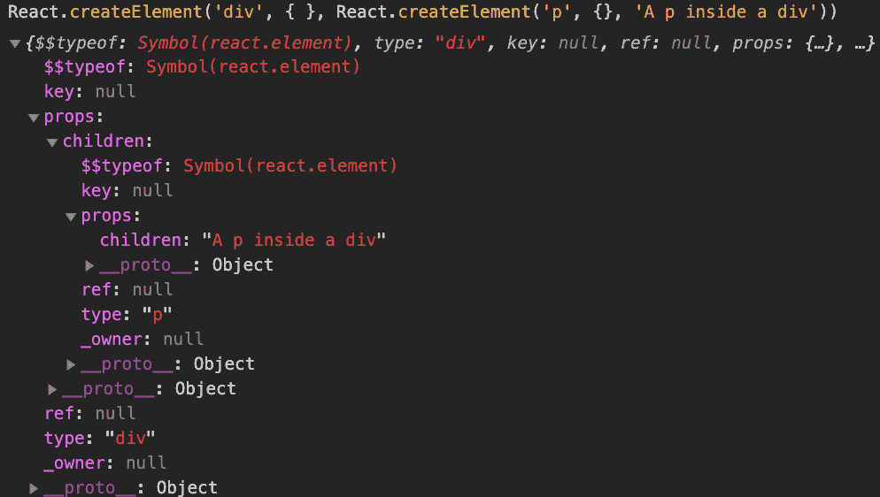

# React 是如何工作的

> 原文：<https://www.freecodecamp.org/news/react-under-the-hood/>

React 是一个非常流行的 JavaScript 库。凭借超过 550 万的周下载量，React 广受欢迎。但是没有多少 React 开发人员知道 React 是如何工作的。

在这篇文章中，我将尝试揭示一些关于 React 的有趣的事情，作为 React 开发人员，你可能会对此感兴趣。让我们从头开始。

但是在我们开始之前，如果您是 React 开发人员，我有一些激动人心的消息要告诉您！一旦你完成这篇文章，你就可以用 React 开发一些很酷的东西，并在途中赢得奖品:)

## React 是做什么的？

React 的核心基本上是为你维护一棵树。该树能够在节点上进行有效的差异计算。

把你的 HTML 代码想象成一棵树。事实上，这正是浏览器对待您的 DOM(您在浏览器上呈现的 HTML)的方式。React 允许您用 JavaScript 有效地重构 DOM，并且只将那些已经发生的更改推送到 DOM。

## JSX 是句法糖

没有什么比 JSX 更好的了——对 JavaScript 和浏览器都是如此。JSX 只是用于创建非常特殊的 JavaScript 对象的语法糖。

当你写下这样的话:

```
const tag = <h1>Hello</h1>
```

你实际上是这样做的:

```
const tag = React.createElement("h1", {}, "Hello")
```

你看，当你开始写嵌套的东西时，不仅这很难编码，而且维护这样的代码库也变得很不方便。因此，JSX 帮助你将 HTML 的简洁带到 JavaScript 的强大。

但是 React.createElement 本身做什么呢？它创建了一个普通的旧 JavaScript 对象。其实可以手动调用，自己看！



你看，我们有一个这样的物体:

```
{
    $typeof: Symbol(react.element),
    key: null,
    props: {children: "Hello"},
    ref: null,
    type: "div"
}
```

如果我们开始像这样嵌套元素:

```
React.createElement('div', { }, 
React.createElement('p', {}, 'A p inside a div')
) 
```

我们会开始得到嵌套的对象:



现在你知道了，一旦所有的 JSX 都被解析了，所有的 React.createElement 调用都被解析了，我们就有了一个巨大的嵌套对象，如上图所示。

## 反应渲染器

现在，如果您回到我们开始应用程序的地方，您会看到在您的 index.js 文件中，您会发现下面一行:

```
// .. prev code

ReactDOM.render(<App />, container)
```

从上面我们知道，当`<App />`已经完成解析时，这只是 React 元素的一个巨大对象。那么 React 是如何从中构造出真正的 div 和 p 标签的呢？遇见 ReactDOM。

反过来，ReactDOM 根据节点的“type”属性递归地创建节点，并最终将它们附加到 DOM 中。

在这一点上，应该清楚为什么从渲染器解耦 React 实际上是一个伟大的举动！React 所做的是，简单地构建一个 UI 树，它不仅可以在 web 上使用，也可以在移动环境中使用，假设有一个渲染器可以与主机操作系统通信。这里，React Native 来玩了。你看，React Native 使用 React 库，而不是 ReactDOM 作为渲染。相反，包 react-native 本身是一个渲染器。

我们在 react 本机应用程序中这样做来启动应用程序:

```
const { AppRegistry } = require('react-native')
AppRegistry.registerComponent('app', () => MainComponent)
```

看啊！没有反应。为什么不呢？因为我们没有类似 appendChild 的方法，也没有类似 DOM 的环境。相反，对于移动设备，我们需要直接从操作系统支持 UI。但是 React 库不需要知道这些，渲染器(React Native)会处理这些。

## 反应和解

当我们说 React 使用 JavaScript 中虚拟 DOM 维护 DOM 的副本，并使用它来区分任何更改并将其应用于真实的 DOM 时，我们不希望 React 以自己的方式强行使用。反应过来，其实做的很懒和解。React 将使尽可能少的改变成为可能，也就是说，如果可能的话，它将尝试重用元素、属性，甚至样式！

考虑这个例子:

```

```

假设您使用某种条件或状态将这个 JSX 表达式更改为下面的表达式:

```

```

现在，在区分时，React 会看到，img 标签在新旧树中都使用了相同的类名，所以为什么要修改它呢？它会修改你的 alt 属性并继续前进。

然而，有一个问题。因为我们不希望 React 在不同的部分做大量的计算，React 会假设如果一个父节点改变了，它包含的子树也一定改变了。例如:

```
<div className="class-1">
	<p>I did not change</p>
</div>
```

如果使用条件/状态将此 JSX 更改为以下值:

```
<p className="class-1">
	<p>I did not change</p>
</p>
```

虽然您可以看到我们不需要重新创建内部 p 标记，但是 React 在从顶部遍历树时无法知道这一点(当然，除非您执行重树区分，这是比启发式 O(n) react 遵循的区分算法昂贵得多的算法)。因此，React 决定销毁所有子组件(即在 useEffect 中调用它们的清理函数，或者在基于类的组件中调用 componentWillUnmount ),并从头开始重新创建子组件。

## 反应键

当添加/删除节点中的元素时，React 将简单地遍历旧树中的子节点和节点的新树中的子节点，并标记需要执行任何添加/删除的位置。但是如果没有开发人员额外帮助，这是一个缺点。考虑这个例子:

```
<ul>
    <li>A</li>
    <li>B</li>
</ul>
```

考虑将条件/状态更改为以下内容:

```
<ul>
    <li>Z</li>
    <li>A</li>
    <li>B</li>
<ul>
```

现在，当 React 开始比较两个列表的差异时，它会在子节点 1 找到差异，将旧的 A 突变为新的 Z，然后在子节点 2，将旧的 B 突变为新的 A，最后追加新的 B 节点。

然而，更好的方法是保留现有的 A 和 B 节点，只在 Z 节点前面添加。但是 React 怎么会知道呢？反应键会有帮助。

键只是提供了一种很好的反应方式，可以知道哪些元素在不同的时候发生了变化或者没有发生变化。现在，React 不是比较整个元素，而是比较子元素的键，以查看需要添加/删除哪个元素。下面的方法是做同样事情的有效方法:

```
<ul>
    <li key="A">A</li>
    <li key="B">B</li>
</ul>
```

现在，如果它变成:

```
<ul>
    <li key="Z">Z</li>
    <li key="A">A</li>
    <li key="B">B</li>
</ul>
```

React 现在知道键“A”和“B”已经存在，所以我们只需要添加带有键“Z”的新元素。

你是 React 的开发者吗？通过在 React 中开发一个 3 分钟的互动游戏来炫耀您的 **React 技能**，并**赢得帽衫、衬衫和咖啡杯**！在这里 加入 codedamn 的 discord 服务器 **[参加 **codecomp**](http://bit.ly/codedamn-discord)**

因此，这些是一些重要的概念，我相信对于作为 React 开发人员的你来说，开始理解 React 的核心和它实际上是如何工作的会非常有帮助。请随意传递您的任何建议或问题。

你可以[在 twitter](https://twitter.com/mehulmpt) 上关注我，获取更多 JS/编码推文和其他信息。和平！