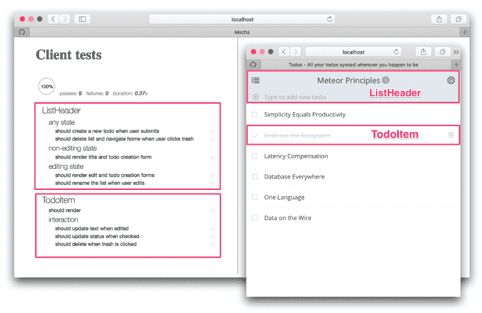
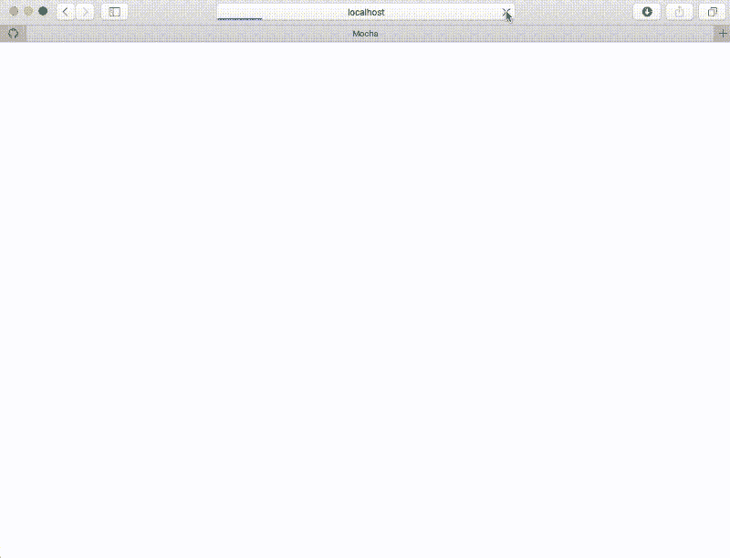
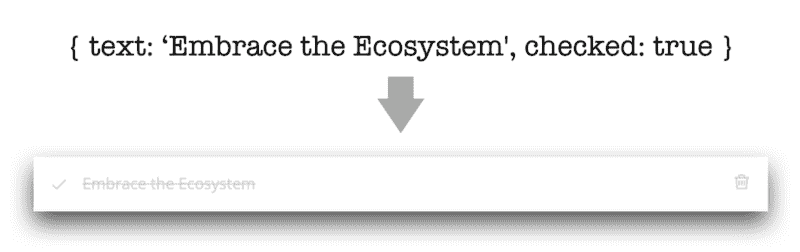
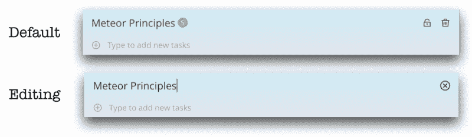
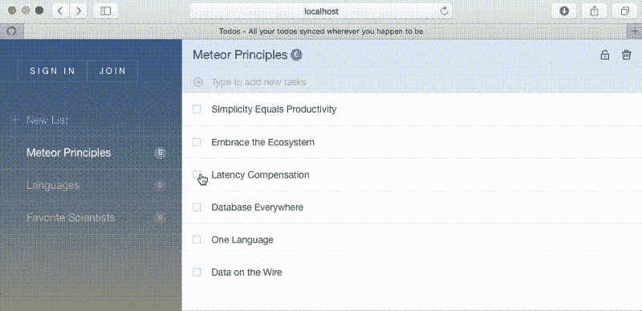

# 用摩卡和酶进行反应单元测试

> 原文：<https://www.freecodecamp.org/news/react-unit-testing-with-mocha-and-enzyme-77d18b6875cb/>

迈克尔·舒尔曼


Image credit: [Simon Liu](https://www.flickr.com/photos/si-mocs/6301271936/)

# 用摩卡和酶进行反应单元测试

#### Meteor 中 UI 测试的分步教程。

这是一个简短的教程，帮助你测试你的 React UI 组件。它展示了一个简单的 UI 测试模式，这是我为流星[指南](http://guide.meteor.com/) ( [？)](https://github.com/meteor/guide/pull/466)和 T [odos](https://github.com/meteor/todos/tree/react) 样本 app(？[)。](https://github.com/meteor/todos/pull/141)

如果您有以下情况，您应该阅读本书:

1.  正在使用 [React](https://facebook.github.io/react/) 开发您的应用程序
2.  想要一个简单的方法来自动测试你的用户界面
3.  正在使用[流星](https://www.meteor.com/) … **或不使用**——这大部分将在任何反应设置中工作！

左边是我们将要编写的测试，右边是我们将要测试的 UI 组件:



随着我们逐步完成几个测试的细节，您将了解 React UI 测试的构建模块以及如何构建测试套件的最佳实践。您可以将这些模式应用到您自己的应用程序中，以捕捉错误、更快地编写代码、记录代码行为，并确保在您向应用程序添加新功能时不会出错。

教程假设对 React 和 [ES6](https://github.com/lukehoban/es6features) 有基本的熟悉，但不需要太多流星知识。所有的源代码都可以在 Meteor 的 [Todos](https://github.com/meteor/todos/tree/react) 示例应用程序中获得，所以你可以在你自己的机器上运行它，并对代码进行测试。

### UI 单元测试

有很多方法可以测试你的软件，但是 UI 单元测试是对单个 UI 组件的小的孤立测试，而不是对系统的全面测试。它们(相对)容易设置，执行起来也很快。

这是当前 Todos 单元测试套件的屏幕截图，包括客户端(UI)和服务器端测试。整个套件在我的笔记本电脑上运行只需一秒多一点:



因为测试运行得如此之快，你可以在每次[签入代码](https://en.wikipedia.org/wiki/Continuous_integration)或者甚至每次[编辑文件](https://wallabyjs.com/)时运行它们。

> 拥有一个完整的测试套件让你放心，你的代码总是如你所期望的那样工作。

### 技术

在我们开始之前，先简单介绍一下各种开源技术:


[Meteor](https://www.meteor.com/) 是一个面向现代 web 和移动应用的全栈 Javascript 平台。它运行节点。后端的 JS 和前端的几个 UI 框架中的任何一个包括 React。测试在最近的 [1.3 版本](http://info.meteor.com/blog/announcing-meteor-1.3)中得到了巨大的提升，所以我们今天就带着它转一圈！

[React](https://facebook.github.io/react/) 是脸书的用户界面 Javascript 库。这是开发现代网络界面的一种流行方式，随着[的出现，React Native](https://facebook.github.io/react-native/) 也在原生移动和桌面应用方面取得进展。

Mocha 是最流行的 Javascript 单元测试运行程序。就像我们不会涵盖测试的所有内容一样，我们也不会涵盖 Mocha 中单元测试的所有内容。但是这里应该足够给你一个坚实的开始。

[Enzyme](https://github.com/airbnb/enzyme) 是 AirBnB 的库，用于单元测试 React 组件。它很棒，因为它使模拟 React 组件的上下文变得很容易，而不必实际启动浏览器，并且您仍然可以执行 CSS 选择和模拟用户事件。

除了具有反应特异性的酶之外，所有这些文库都是彼此独立运行的。它们一起构成了构建实时应用程序的一种非常好的方式。

> ***？:*** *O* k .我们可以开始测试了吗？

如果您的机器上安装了 Todos 应用程序，或者不关心实际运行测试，您可以跳到下一部分。否则，让我们来设置您的机器。？

### 机器设置

如果您想在本地机器上运行测试，这里有 Linux/Mac 的快速设置。对于更详细的演练，Meteor 网站提供了 Todos 应用程序的完整教程:

注意:目前[有一个问题](https://github.com/meteor/todos/issues/144)，当运行测试时，它在命令行上给出以下警告:

```
Unable to resolve some modules:"react/addons" in /path/to/react-compat.js"react/lib/ReactContext" in /path/to/react-compat.js"react/lib/ExecutionEnvironment" in /path/to/react-compat.js
```

忽略这一点是安全的，您应该能够在浏览器中的 [http://localhost:3000 处看到测试运行的结果。](http://localhost:3000.)

测试结果来自源代码树中任何带有后缀 **.tests.js** 的文件，当我们编辑任何文件或添加带有该命名方案的新文件时，测试套件将自动重新执行并更新浏览器窗口。

注意:令人困惑的是，在源代码树的顶层还有一个 **tests/** 目录。这包含端到端测试，在本教程中您应该忽略这一点。有关[的更多信息，请参见指南](http://guide.meteor.com/testing.html)。

### 组件渲染

最简单的 UI 测试是组件是否根据传递给它的数据正确呈现。例如，如果您呈现一个 todo 项，您会期望看到该项的名称显示在标签中，并且它的选中状态会正确地反映在页面上。



这是酵素和摩卡咖啡的外观:

这里发生了一些事情。

**结构。**在 Mocha 中，*描述*启动一个测试套件， *it* 启动一个测试用例。对于我们的第一个测试，我们使用最简单的结构。注意,*的内容描述了*和 *it* 只是函数，所以我们可以做类似提前退出的事情来强制测试只在客户端运行。

在每个测试中，我们遵循一个 ***设置→练习→验证→拆卸*** 的模式，这个模式有不同的名称，但却是单元测试中[常见的最佳实践](http://www.agile-code.com/blog/the-anatomy-of-a-unit-test/):

**设置。**首先我们创建要呈现的数据，在本例中是一个 Javascript 对象。很简单。

**运动。**接下来使用*浅层*函数将数据渲染到一个组件中。这个渲染是我们实际测试的，所以这就是为什么它是*练习*阶段的一部分，而不是*设置*。调用*shallow* 返回一个包含渲染组件实例的酶*包装器*对象，以及一堆模拟用户事件(如鼠标点击)和查询 UI 状态的实用函数。

**验证。**接下来，我们使用 *hasClass* 、 *find、*和 *prop* 来查询 UI 状态，以验证组件已经正确呈现。所有的 *TodoItem* 实例都应该有*列表项*类，选中的项应该有*选中的*类。最后，我们确保输入的默认值是我们所期望的“拥抱生态系统”。

**拆卸。在许多测试中，也有一些清理工作要做，但是在这种情况下，没有什么需要清理的，因为所有的变量都是临时的。**

要将这个测试添加到 Todos 应用程序中，只需将代码片段复制到 *todos* 目录下的文件**imports/ui/components/todo item-render . tests . js**中(实际上是任何带有 **.tests.js** 后缀的文件，但我们按照惯例将其放在与组件相同的目录中)。这个测试对于已经在 **TodoItem.tests.js** 中的测试来说是多余的，但是现在你知道如何添加你自己的测试了。

### 用状态渲染

让我们再做一个稍微复杂一点的例子。列表头实际上有两种状态:正常状态和编辑状态，它根据内部组件状态显示两种不同的 UI。



这是测试的样子:

**结构。**注意，我们已经将代码分成了两个*描述*块，给了它更多的结构。当我们开始添加更多的测试时，这将会有所帮助，因为除了呈现不同之外，组件的交互也会根据状态而改变。我们将在下面详细讨论这一点。

**设置/练习。**一切如常，除了我们用了酵素的*挂载*功能来渲染，而不是我们上面用的*浅*。我们使用*挂载*来模拟完整的组件上下文。不同的是 *shallow* 只渲染传递的组件，而 *mount* 要求我们在浏览器上下文(browser 或 headless browser)中运行，还渲染子组件。

**测试。**我们已经使用了 Enzyme 的 *setState* 实用程序来操纵组件状态。这就像模拟鼠标点击，除了不是直接模拟用户，而是模拟应用程序另一部分的变化。

**验证/拆卸。**没什么特别的:查询 DOM，这个简单的测试不需要清理。

### 用户交互

渲染只是等式的一半，当我们想要测试用户交互时，事情变得更加有趣。首先，让我们对用户单击 todo 项目上的复选框进行建模:



这是测试的样子:

**结构。**这段代码遵循与上面相同的*设置→练习→验证→拆卸*结构，但是在这种情况下，我们实际上在每一步都做了一些有意义的事情。

**设置。**这个很有趣，因为当你点击复选框时，组件实际上调用了一个 [Meteor 方法](http://guide.meteor.com/methods.html)，它要求服务器更新数据库。然而，当我们运行单元测试时，没有服务器，即使有，我们也不想修改任何数据。所以我们使用 [Sinon](http://sinonjs.org/) 库(通常与 Mocha 一起使用)来根除这个方法。它将 *setCheckedStatus* 方法的 *call* 函数替换为一个看起来像原来的 dummy，但只是记录用户的行为，实际上并不做任何事情。

注意:你可能会挠头，因为到目前为止，*浅/安装*渲染一直是*练习*阶段的一部分，但这一次是在*设置*中。这是一个微妙的点，但由于这个测试的重点是用户交互动作，所以渲染只是设置的一部分。

**运动。**接下来，我们使用*模拟*函数进行点击。非常简单。我们还可以模拟键盘事件、表单提交等等，但是我们不需要这个测试。

**验证。现在我们可以看到存根是如何发挥作用的。我们断言用我们期望的参数调用了 *setCheckedStatus* 方法。这不仅测试了行为，还提供了关于交互如何工作的很好的文档。**

**拆卸。设置存根实际上全局地修改了 *setCheckedStatus* 方法，所以在测试结束时我们应该清理它。restore 用原始函数替换存根。**

我们所有的其他交互测试都遵循相同的基本结构，你可以在 [Todos repo](https://github.com/meteor/todos/tree/react) 中看到它们。

### 测试套件结构

使用上面这些基本模式来测试*渲染*和*交互*，你应该能够测试 Todos 示例中的任何 React 组件，并轻松地将模式应用到你自己的应用中。但是如果你开始随意地添加测试，没有某种结构化代码的方法，事情将很快失去控制。所以我将通过描述一个更高层次的测试结构来结束本教程。

我在上面提到了如何使用 Mocha 的 *describe* 来描述逻辑结构并节省代码，我们将在添加更多测试时利用这一点。让我们看看它是如何工作的。

回想一下我们上面的 *ListHeader* 例子，其中我们区分了默认状态和编辑状态。该测试具有以下结构:

现在让我们使用 Mocha 的 beforeEach 构造来重构代码，该构造在 *describe* 套件中的每个测试之前执行:

乍一看，这种变化似乎是净损失:代码变得更长、更复杂。然而，我们添加的测试越多，我们得到的重用就越多，这种结构就越有意义。以下是 Todos 应用程序中的测试结构，这只是标题功能的部分测试:

在你这样做之前，你应该注意到，因为在每个嵌套块中的每个测试之前，每个测试都要执行*，所以用这种方式很容易写出低效的测试。例如，在上面的代码中，一个新的 React 路由器存根被创建了五次，每一个 *it* 测试都创建一次，尽管它实际上只在其中一个测试中需要。在这种情况下，我没意见。然而，在每个*之前把所有的测试设置都放到*中是很诱人的，但是你通常应该只把你需要的放在那里。*

### 结论和下一步措施

在本教程中，我们已经学习了 UI 组件测试的基础知识，并通过大量的例子说明了如何测试渲染和交互。这些是测试 UI 的基本构件，使用它们，您应该能够对您开发的任何 React UI 的大多数方面进行单元测试。

以下是了解更多信息的一些后续步骤:

1.  **你的作业**。查看 [Todos 应用](https://github.com/meteor/todos)，并添加一个不同行为的单元测试。例如，该应用程序区分公共和私人待办事项，但目前的测试没有涵盖这一点。为此添加一个测试！*额外积分:提交拉取请求！*
2.  **更多的 React UI 测试。**陨石怪[阿鲁诺达](https://www.freecodecamp.org/news/react-unit-testing-with-mocha-and-enzyme-77d18b6875cb/undefined)的[在 React](https://voice.kadira.io/ui-testing-in-react-74fd90a5d58b#.tek2zwsvq) 中的 UI 测试覆盖了很多相同的领域，但角度不同。如果你愿意的话， [Ken Wheeler](https://www.freecodecamp.org/news/react-unit-testing-with-mocha-and-enzyme-77d18b6875cb/undefined) 为[单元测试 React Native](https://blog.formidable.com/unit-testing-react-native-with-mocha-and-enzyme-51518f13ba73) 解释了一个类似的设置。
3.  **一般测试。UI 单元测试只是拼图的一部分。  在每个单元测试中给出五个问题来回答。《流星指南》的[测试部分](http://guide.meteor.com/testing.html)是对《流星》中其他类型测试以及一般测试的一个很好的概述。**

请在下面提出问题或建议。点击这里关注我，或者在 Twitter 上关注*更多精彩文章。*

**最后，如果这有用，请点击？下面的按钮。谢谢！**

*非常感谢[汤姆·科尔曼](https://www.freecodecamp.org/news/react-unit-testing-with-mocha-and-enzyme-77d18b6875cb/undefined)的流星/公关指导；[肖恩·穆恩](https://www.freecodecamp.org/news/react-unit-testing-with-mocha-and-enzyme-77d18b6875cb/undefined)向我介绍测试；[基元](https://www.freecodecamp.org/news/react-unit-testing-with-mocha-and-enzyme-77d18b6875cb/undefined)，[罗斯·吉斯曼](https://www.freecodecamp.org/news/react-unit-testing-with-mocha-and-enzyme-77d18b6875cb/undefined)，[约什·欧文斯](https://www.freecodecamp.org/news/react-unit-testing-with-mocha-and-enzyme-77d18b6875cb/undefined)，[萨姆·哈图姆](https://www.freecodecamp.org/news/react-unit-testing-with-mocha-and-enzyme-77d18b6875cb/undefined)对选秀的优秀反馈。*