# React + WebSockets 项目–构建一个实时订单簿应用程序

> 原文：<https://www.freecodecamp.org/news/react-websockets-project-build-real-time-order-book-app/>

在本教程中，我们将看到如何构建一个订单簿 web 应用程序，我们将使用它来显示实时加密货币信息。

我们将使用 [React with Typescript](https://create-react-app.dev/docs/adding-typescript/) 来创建 UI，使用 [Redux](https://redux.js.org/) 来管理应用程序状态，使用 [styled-components](https://styled-components.com/) 来应用样式。最后，同样重要的是，我们将使用 [WebSockets](https://developer.mozilla.org/en-US/docs/Web/API/WebSocket) 获取数据馈送。

### GitHub 回购

💡如果你想跳过阅读，[这里](https://github.com/mihailgaberov/orderbook)💁是 GitHub 仓库里有详细的[自述](https://github.com/mihailgaberov/orderbook/blob/main/README.md)🙌，而[在这里](https://orderbook-mihailgaberov.vercel.app/)你可以看到现场演示。

## 什么是订单簿？

一个[订单簿](https://www.coindesk.com/crypto-trading-101-how-to-read-an-exchange-order-book)是一个应用程序，通常显示一些与买卖相关的信息。

💡最常见的用例是显示各种资产的数据，比如股票、债券、货币，甚至加密货币。

## 我为什么需要订单簿？

实际上，交易者使用指令簿来观察某些产品——货币、股票等——的出价和要价的波动。

这是实时发生的，所以变化可能非常迅速。这就是 WebSockets 派上用场的地方，稍后您将会看到。

在过去，人们在纸上做类似的事情，但是“实时”的部分当然是不可能的。

常规的订单簿通常有两面:左边是绿色的买入(或出价)，右边是红色的卖出(或询价)。

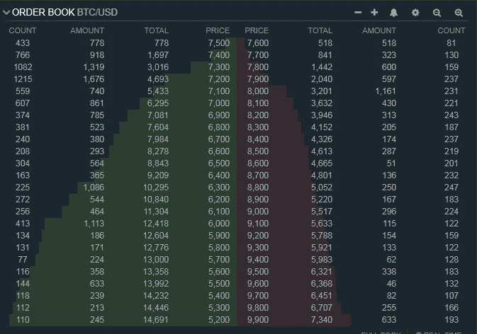

Classic Order book

## 我们订单簿应用程序的计划

我们的订单簿应用程序将由五部分组成:

*   订单簿主视图
*   分组选择框
*   切换馈送按钮
*   切断进料按钮
*   状态消息。

应用程序设计将如下所示。请注意，您将在 my implementation 中看到的状态消息组件在这些屏幕截图中缺失:

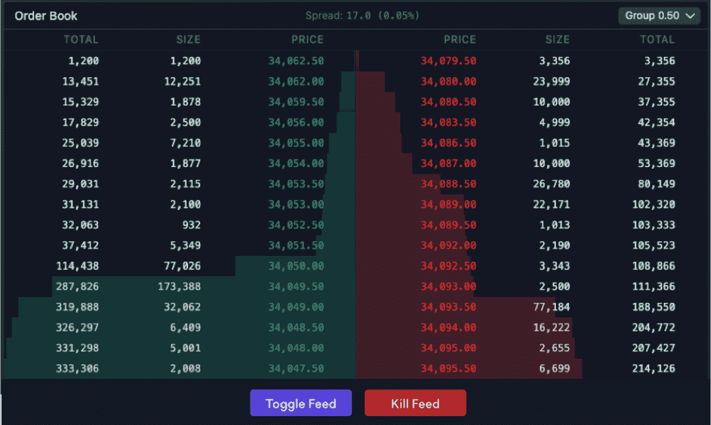

Desktop layout

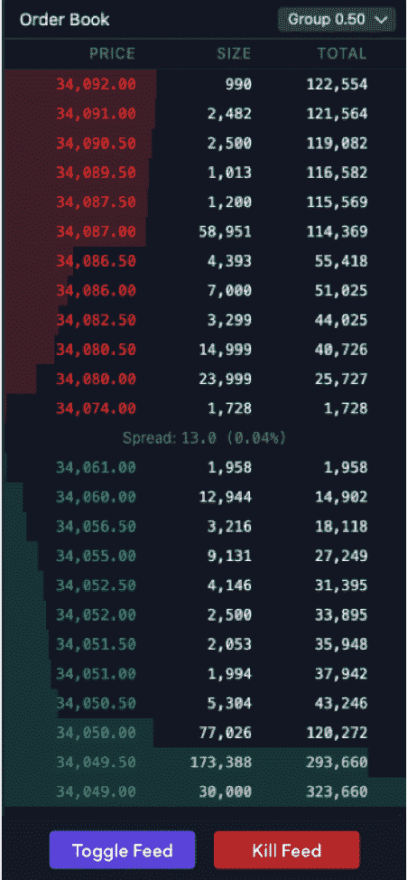

Mobile layout

## **应用功能**

### 定货簿

订单有两个方面:买方和卖方。

两边都包含每个价位的开仓订单数量的信息。

每个级别显示:

*   **价格**:这就是定义等级的东西。由于订单的价格必须是所选市场报价单位的倍数(0.5)，因此每个级别的增量为 0.5(只要在该级别有未结订单)。
*   **大小**:该级别下的未平仓订单衍生的合约总量。
*   **Total** :本级及以上级别账簿中未结订单衍生的合同总金额。为了计算给定级别的总数，我们采用当前级别的大小，并对订单簿中导致该价格级别的大小求和。总数也用于计算深度可视化工具(色阶后面的彩色条)。每个级别的深度是通过将该级别的总数作为书中最高总数的百分比来计算的。

### 分组选择框

默认情况下，订单按所选市场的票大小(0.5)分组。

XBTUSD 市场的分组可能在 0.5、1、2.5 和 ETHUSD 市场的 0.05、0.1 和 0.25 之间切换。

为了对级别进行分组，我们将向下舍入到最接近的组大小的级别进行组合，例如，如果我们将分组从 0.5 更改为 1，那么我们将组合价格 1000 和 1000.5 的数据，并将其显示在订单簿中价格为 1000 的单个级别下。

### 切换馈送按钮

此按钮在 PI_XBTUSD 和 PI_ETHUSD 之间切换所选市场。这是我们将支持的两个市场->比特币/美元和以太坊/美元。

它支持动态分组逻辑，并处理 XBT (0.5，1，2.5)的分组和 ETH (0.05，0.1，0.25)的分组。

### 切断进料按钮

点击此按钮停止馈送。

然后第二次点击这个按钮更新提要。

### 状态消息

该消息将显示当前选择的市场。它还会显示一条消息，提示提要已被终止。

## 我们应用的技术堆栈

以下是我们将使用的主要技术列表:

*   [使用 TypeScript](https://create-react-app.dev/docs/adding-typescript/)(`yarn create react-app my-app --template typescript`)——一个 UI 库，我们将使用它来构建我们的应用程序的用户界面。
*   一个状态管理库，我们将使用它来管理我们的应用程序的状态。
*   [web sockets](https://developer.mozilla.org/en-US/docs/Web/API/WebSockets_API)—`WebSocket`对象提供 API 来创建和管理与服务器的 [WebSocket](https://developer.mozilla.org/en-US/docs/Web/API/WebSockets_API) 连接，以及在连接上发送和接收数据。我们将使用它来实现消费实时提要的逻辑，并能够停止和更新。
*   [styled-components](https://www.styled-components.com/docs) —一个 CSS-in-JS 库，允许您使用 ES6 模板文字定义组件的 CSS 样式。我们将使用它来添加我们的应用程序的风格，使外观和感觉很美。它利用带标签的模板文本来设计组件的样式，并删除组件和样式之间的映射。这意味着当您定义您的样式时，您实际上是在创建一个普通的 React 组件，它将您的样式附加到它上面。
*   [react-testing-library](https://github.com/testing-library/react-testing-library)—`React Testing Library`是一个非常轻量级的 React 组件测试解决方案。我们将使用它来测试我们的应用程序的 UI 组件。
*   Jest -一个 JavaScript 测试框架，当我们谈论测试 React 应用程序时，它已经成为事实上的标准。我们将使用它来编写一些单元测试，涵盖我们应用程序中的 reducer 函数。

## 如何构建应用程序

从这一点开始，我将试着引导你完成我构建这个的过程。

💡我必须说，我在这里向你展示的只是创建这样一个应用程序的**一种方式**——但无论如何都不是**的方式**。也许有更多加密经验的人会做得更好。

### 项目结构

项目结构非常简单。我们使用 React 和 styled-components，这使得这种构造方式非常方便。

让我们先看看它看起来像什么，然后我会解释什么和为什么。

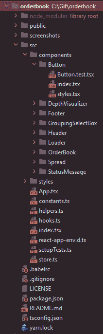

Project structure

正如你在上面的图片中看到的，我已经将大部分组件组织在文件夹中。每个文件夹包含一个`index.tsx`文件、一个`styles.tsx`文件和一个`.test.tsx`文件。

**index . tsx**–包含负责组件逻辑的代码。

**styles . tsx**–包含负责样式化组件的代码。这就是样式化组件的亮点。

这些包含了组件单元测试。

让我给你简单总结一下`components`文件夹中每个组件背后的想法。从上到下开始:

[按钮](https://github.com/mihailgaberov/orderbook/tree/main/src/components/Button)用给定的背景颜色和标题呈现一个按钮。它用于页脚的两个按钮，`Toggle Feed`和`Kill Feed / Renew Feed`。

深度可视化工具是负责绘制数字背后的红色和绿色背景的组件。它通过呈现一个给定宽度的行(一个 HTML `div`元素)来实现，位置是左(Bids)或右(Asks)。

[Footer](https://github.com/mihailgaberov/orderbook/tree/main/src/components/Footer)–好了，这里不多说了，它包含了应用中使用的两个按钮。

[GroupingSelectBox](https://github.com/mihailgaberov/orderbook/tree/main/src/components/GroupingSelectBox) 呈现我们用来改变分组值的选择框，使用 setGrouping reducer 在分组被改变时修改应用状态。

[Header](https://github.com/mihailgaberov/orderbook/tree/main/src/components/Header) 呈现应用程序的标题以及 GroupingSelectBox 组件。

[加载器](https://github.com/mihailgaberov/orderbook/tree/main/src/components/Loader)渲染利用 [SVG](https://developer.mozilla.org/en-US/docs/Web/SVG) 实现的加载动画。

[订单本](https://github.com/mihailgaberov/orderbook/tree/main/src/components/OrderBook)包含了 app 的核心逻辑。分离的组件位于子文件夹中，Redux 状态管理逻辑也在这里。

[Spread](https://github.com/mihailgaberov/orderbook/tree/main/src/components/Spread) 渲染扩散值，显示在页眉的中间(在桌面视图中)。组件本身包含计算金额本身和百分比值的简短方法。

[状态消息](https://github.com/mihailgaberov/orderbook/tree/main/src/components/StatusMessage)是一个小组件，用于显示*状态消息。*基本显示当前显示的是哪个市场，饲料是否被杀。

### **渲染性能**

这里是一个很好的时机来谈论一下*渲染性能*和*内嵌样式*。

**渲染**是 React 要求你的组件根据当前道具和状态的组合来描述他们想要的 UI 部分的样子的过程。

此过程由组件中状态的变化触发。这种变化可能是由于一些属性被改变或者组件的一些内部逻辑引起的。

这里的要点是，当不必要的重新渲染发生时，它会降低我们的应用程序的性能。这正是我在介绍 *DepthVisualizer* 组件的初始实现时遇到的情况。它对绘图部分使用了样式化组件，即 JavaScript。

为了解决这个问题，我改变了组件来使用内联样式，也就是纯 CSS，而不是 JS 中的 CSS 方法。换句话说，我的瓶颈是使用 JavaScript 动画，这是性能下降的一个著名原因。

现在看起来是这样的:

```
const DepthVisualizer: FunctionComponent<DepthVisualizerProps> = ({windowWidth, depth, orderType }) => {
  return <div style={{
    backgroundColor: `${orderType === OrderType.BIDS ? DepthVisualizerColors.BIDS : DepthVisualizerColors.ASKS}`,
    height: "1.250em",
    width: `${depth}%`,
    position: "relative",
    top: 21,
    left: `${orderType === OrderType.BIDS && windowWidth > MOBILE_WIDTH ? `${100 - depth}%` : 0}`,
    marginTop: -24,
    zIndex: 1,
  }} />;
};

export default DepthVisualizer; 
```

*内联样式*是当你写你的 CSS 和你的标记时，作为`style`属性的值。这不是一个好的实践，但是正如你在这里看到的，在一些情况下有必要使用它。

💡通常你会将你的 CSS 代码提取到一个单独的文件中。

[Footer](https://github.com/mihailgaberov/orderbook/tree/main/src/components/Footer) 一个简单的虚拟组件，用于在应用程序的页脚显示两个按钮。

虚拟组件，也称为无状态组件或表示性组件，是不保存状态的组件，通常只用于以某种方式可视化数据。这些数据是通过 props 传递的。例如上面组件中的`isFeedKilled`标志。

如果这样的组件需要执行某种交互，它通常通过接受(再次通过 props，例如`toggleFeedCallback`)在交互发生时可以执行的回调函数来完成。例如点击一个按钮。

另一方面，我们可以拥有智能或全状态组件。他们是连接到应用程序状态并能直接操作它的人。通常是它们从状态中读取数据，并通过它们的 props 将数据传递给无状态组件。

[分组选择框](https://github.com/mihailgaberov/orderbook/tree/main/src/components/GroupingSelectBox)包含可以用来在分组之间切换的选择元素。

[Header](https://github.com/mihailgaberov/orderbook/blob/main/src/components/Header/index.tsx) 是 app 的头部部分。它负责正确设置由左边的标题“订单簿”和右边的选择框组成的布局。

[加载器](https://github.com/mihailgaberov/orderbook/tree/main/src/components/Loader)用于指示数据何时尚未加载。它利用了我在网上找到的一个 SVG 动画。

订单簿是真实发生的地方。这个由几个较小的组件组成:

*   [table container](https://github.com/mihailgaberov/orderbook/blob/d8db0239763dce32fbcae499a6b7deefed9f684f/src/components/OrderBook/styles.tsx#L21)–用于设计赔率和赌注双方的视图。
*   标题行(TitleRow)–这是负责显示列标题的组件:分别是奖金、大小和总数。

### 如何用 React 和样式化组件构建 UI

当我们谈到基于组件的结构时，比如说 [React](https://reactjs.org/) 提供给我们的结构，那么[风格组件库](https://styled-components.com/)很可能是你在需要设计风格时的第一选择。

就像乔希·科莫在他的详细的[文章](https://www.joshwcomeau.com/css/styled-components/)中所说的:

> 💡这是一个很棒的工具。在许多方面，它改变了我对 CSS 架构的看法，并帮助我保持代码库的整洁和模块化，就像 React 一样！

正如库名所暗示的，我们可以通过使用 [CSS-in-JS 模式](https://reactjs.org/docs/faq-styling.html#what-is-css-in-js)来轻松地设计我们的组件。下面是我如何使用它为我的`Button`组件编写样式的一个例子:

```
import styled from "styled-components";

interface ContainerProps {
  backgroundColor: string;
}

export const Container = styled.button<ContainerProps>`
  padding: .3em .7em;
  margin: 1em;
  border-radius: 4px;
  border: none;
  color: white;
  background: ${props => props.backgroundColor};
  font-family: "Calibri", sans-serif;
  font-size: 1.2em;

  &:hover {
    cursor: pointer;
    opacity: .8;
  }
` 
```

注意我是如何在我的样式文件中使用一个`interface`的，以及通过`props`作为参数传递的`background`属性。这是 CSS-in-JS 故事的一部分。

在 JavaScript 中使用 CSS 代码或者(有人可能会说)反之亦然的可能性非常方便。例如，当我们需要一个组件根据某件事有不同的外观时，我们可以通过它的 props 传递一个参数来定义它。

由于每个样式实际上都是一个组件，这种编写样式的方式感觉很像编写 React 组件。我是说，最后，所有东西都是组件，对吧？

### 响应和页面可见性检测

在开发这个应用程序时，我在几个地方读到，对于支持快速更新的应用程序来说，实现某种机制以便在用户不使用时暂停整个程序是一个好的做法。例如当用户最小化浏览器窗口或者只是打开另一个标签时。

因为我们的订单簿通过 WSS 每秒钟消耗大量新的数据块，所以我决定也实现这样一个机制。

它的作用是:

*   当数据还不存在时，它显示一个加载器
*   它改变了元标题，表示应用程序处于`paused`模式
*   一旦应用程序窗口获得焦点，它就会取消暂停工作


Active mode

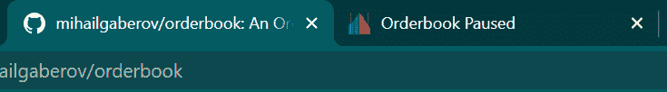

Paused mode

你可以在这里看到整个实现[。](https://github.com/mihailgaberov/orderbook/blob/main/src/App.tsx)

重要的部分在 useEffect 钩子中，当应用程序第一次渲染时，它只被触发一次。

在这里，我们通过附加必要的侦听器来利用页面可见性 API。然后，在[处理程序](https://github.com/mihailgaberov/orderbook/blob/e74dfad48990ff1a1f12ac45f5a065cc5044ee75/src/App.tsx#L61)中，我们简单地执行我们想要的逻辑。

### 窗口大小检测

几乎每个应用程序都有一定程度的响应，你需要一些逻辑来检测窗口大小的变化并采取相应的行动。

换句话说，你需要知道你的应用程序何时在特定的屏幕尺寸下被查看，这样你就可以安排你的组件，调整你的风格，让一切看起来都很好，都在适当的位置。

这对于移动友好的应用程序尤其有效，在这些应用程序中，响应是必不可少的。

我们实现的窗口大小变化检测是基于[浏览器窗口对象](https://developer.mozilla.org/en-US/docs/Web/API/Window/innerWidth)的`innerWidtgh`属性和当它被调整大小时被触发的`onresize`事件。

我在 [App.tsx 文件](https://github.com/mihailgaberov/orderbook/blob/bd24e610e9fc4e271a6820a297b78decf4950fd9/src/App.tsx#L32)的`useEffect`钩子中附加了一个事件监听器。然后，每次窗口大小改变时，我通过`setWindowWidth`钩子将新的宽度设置为一个状态变量。

```
const [windowWidth, setWindowWidth] = useState(0);
...
...

// Window width detection
useEffect(() => {
  window.onresize = () => {
    setWindowWidth(window.innerWidth);
  }
  setWindowWidth(() => window.innerWidth);
}, []); 
```

然后将这个变量向下传播到所有感兴趣的组件，并相应地使用它。例如，下面是我如何在 [Order Book/index.tsx](https://github.com/mihailgaberov/orderbook/blob/main/src/components/OrderBook/index.tsx) 中使用它，以便知道何时何地呈现 TitleRow 组件。

```
{windowWidth > MOBILE_WIDTH && <TitleRow windowWidth={windowWidth} reversedFieldsOrder={false} />} 
```

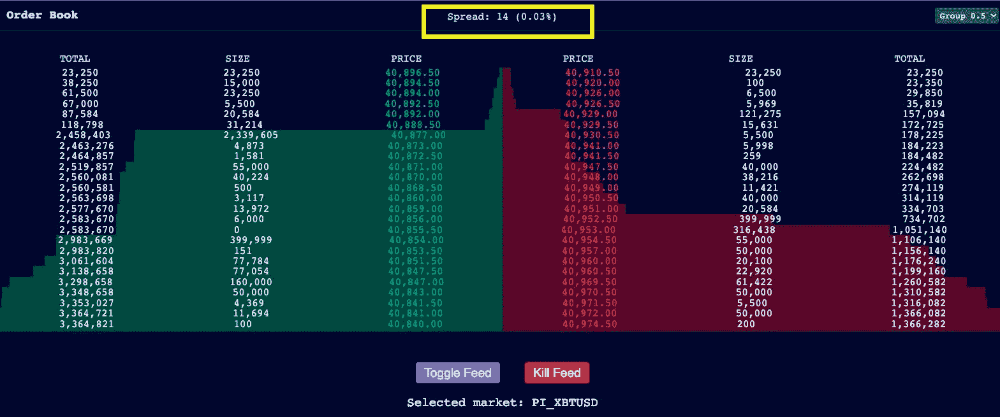

TitleRow component - desktop view

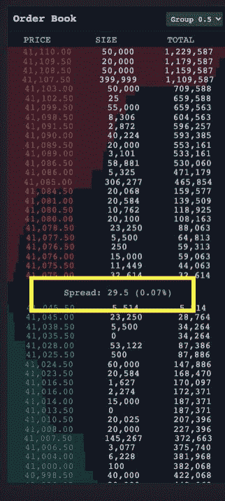

TitleRow component - mobile view

请注意，它会出现在不同的位置，这取决于您是在桌面上还是在移动设备上看到该应用程序。

你可以看一下[组件](https://github.com/mihailgaberov/orderbook/blob/main/src/components/OrderBook/TitleRow/index.tsx)本身，并在那里看到使用窗口宽度的类似方法。

### 使用 Redux 进行状态管理

你可能已经猜到了，我使用了 [Redux](https://redux.js.org/) 来管理应用程序的状态。

背后的主要逻辑集中在 [orderbookSlice](https://github.com/mihailgaberov/orderbook/blob/main/src/components/OrderBook/orderbookSlice.ts) 缩减器中。在接下来的几行中，我将带您浏览它，看看我是如何以及为什么这样构建它的。

首先，我们定义接口和订单簿数据的初始状态。初始状态包含启动应用程序时我们需要的默认值。

```
export interface OrderbookState {
  market: string;
  rawBids: number[][];
  bids: number[][];
  maxTotalBids: number;
  rawAsks: number[][];
  asks: number[][];
  maxTotalAsks: number;
  groupingSize: number;
}

const initialState: OrderbookState = {
  market: 'PI_XBTUSD', // PI_ETHUSD
  rawBids: [],
  bids: [],
  maxTotalBids: 0,
  rawAsks: [],
  asks: [],
  maxTotalAsks: 0,
  groupingSize: 0.5
}; 
```

接下来有几个简单明了的方法可以帮助处理级别数据:

```
const removePriceLevel = (price: number, levels: number[][]): number[][] => levels.filter(level => level[0] !== price);

const updatePriceLevel = (updatedLevel: number[], levels: number[][]): number[][] => {
  return levels.map(level => {
    if (level[0] === updatedLevel[0]) {
      level = updatedLevel;
    }
    return level;
  });
};

const levelExists = (deltaLevelPrice: number, currentLevels: number[][]): boolean => currentLevels.some(level => level[0] === deltaLevelPrice);

const addPriceLevel = (deltaLevel: number[], levels: number[][]): number[][] => {
  return [ ...levels, deltaLevel ];
}; 
```

那么真正的奇迹正在发生。如果 delta 返回的大小为 0，那么应该从订单簿中删除该价格级别。否则，您可以用 delta 返回的新数据安全地覆盖该价格水平的状态。

```
/** The orders returned by the feed are in the format
 of [price, size][].
 * @param currentLevels Existing price levels - `bids` or `asks`
 * @param orders Update of a price level
 */
const applyDeltas = (currentLevels: number[][], orders: number[][]): number[][] => {
  let updatedLevels: number[][] = currentLevels;

  orders.forEach((deltaLevel) => {
    const deltaLevelPrice = deltaLevel[0];
    const deltaLevelSize = deltaLevel[1];

    // If new size is zero - delete the price level
    if (deltaLevelSize === 0 && updatedLevels.length > ORDERBOOK_LEVELS) {
      updatedLevels = removePriceLevel(deltaLevelPrice, updatedLevels);
    } else {
      // If the price level exists and the size is not zero, update it
      if (levelExists(deltaLevelPrice, currentLevels)) {
        updatedLevels = updatePriceLevel(deltaLevel, updatedLevels);
      } else {
        // If the price level doesn't exist in the orderbook and there are less than 25 levels, add it
        if (updatedLevels.length < ORDERBOOK_LEVELS) {
          updatedLevels = addPriceLevel(deltaLevel, updatedLevels);
        }
      }
    }
  });

  return updatedLevels;
} 
```

接下来是几个辅助方法。现在让我就其中的每一个说几句话:

*   [add total sums](https://github.com/mihailgaberov/orderbook/blob/e74dfad48990ff1a1f12ac45f5a065cc5044ee75/src/components/OrderBook/orderbookSlice.ts#L82)–在这个方法的帮助下，我们遍历订单数据、出价或要价，并计算它们的总和。总和值然后被用于制作背景可视化。
*   [add depth](https://github.com/mihailgaberov/orderbook/blob/e74dfad48990ff1a1f12ac45f5a065cc5044ee75/src/components/OrderBook/orderbookSlice.ts#L99)–我们使用这种方法计算每个订单的所谓的*深度*。深度计组件稍后将使用这些值在背景中显示红色和绿色行。
*   getMaxTotalSum–返回所有总和的最大值。

下面的一切都是我们用来创建应用程序状态的。根据 [Redux Toolkit 文档](https://redux-toolkit.js.org/rtk-query/overview#create-an-api-slice)，它正在使用`createSlice` API 创建*切片*。

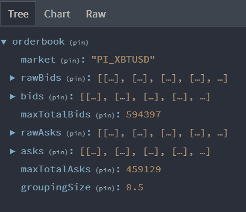

Redux state

创建切片需要一个字符串名称来标识切片、一个初始状态值和一个或多个 reducer 函数来定义如何更新状态。

一旦创建了切片，我们就可以导出生成的 Redux 动作创建器和整个切片的 reducer 函数。

最后几行由正在讨论的导出组成——动作创建器、状态片选择器和主缩减器。

```
export const { addBids, addAsks, addExistingState, setGrouping, clearOrdersState } = orderbookSlice.actions; 
```

```
export const selectBids = (state: RootState): number[][] => state.orderbook.bids;
export const selectAsks = (state: RootState): number[][] => state.orderbook.asks;
export const selectGrouping = (state: RootState): number => state.orderbook.groupingSize;
export const selectMarket = (state: RootState): string => state.orderbook.market; 
```

```
export default orderbookSlice.reducer; 
```

至此，我们的状态操作逻辑就完成了。🎉

现在是时候看看我们在应用程序中使用的协议，以利用我们消费的数据中的所有这些快速变化。

### Websocket 协议(WSS)

正如您可能已经注意到的，我们使用 [Web Socket](https://developer.mozilla.org/en-US/docs/Web/API/WebSocket) 通信协议将数据提取到我们的应用程序中。我们还使用它的特性来完成其他事情(如切换提要和订阅/取消订阅数据频道)，稍后您将会看到这一点。

[这里](https://github.com/mihailgaberov/orderbook/blob/main/src/components/OrderBook/index.tsx)是我怎么用的。

我没有试图依赖手工实现，而是使用了 [react-use-websocket](https://www.npmjs.com/package/react-use-websocket) 包。当你想在 React 应用程序中利用 WSS 时，它给你所有你需要的。如果你想了解更多细节，你可以看看他们的[文件](https://github.com/robtaussig/react-use-websocket#readme)。

### 关于我的实现说几句话

我们首先需要的是数据源的端点 URL。我确信，当我们谈论加密货币时，有多种选择。在我们的应用程序中，我使用了由[www.cryptofacilities.com/](http://www.cryptofacilities.com/)提供的那个。

```
const WSS_FEED_URL: string = 'wss://www.cryptofacilities.com/ws/v1'; 
```

那么我们开始消费数据所需要做的唯一一件事就是让`useWebSocket`钩子工作。你可能已经猜到了，这个钩子是由上面提到的包提供的。

```
import useWebSocket from ["react-use-websocket"](<https://github.com/robtaussig/react-use-websocket>);

...
...
...

const { sendJsonMessage, getWebSocket } = useWebSocket(WSS_FEED_URL, {
    onOpen: () => console.log('WebSocket connection opened.'),
    onClose: () => console.log('WebSocket connection closed.'),
    shouldReconnect: (closeEvent) => true,
    onMessage: (event: WebSocketEventMap['message']) =>  processMessages(event)
  }); 
```

我们将端点作为第一个参数传递，之后传递一些回调函数。这些帮助我们在发生以下情况时执行某些操作:

*   `onOpen`–web socket 连接建立后做什么。
*   `onClose`–web socket 连接终止时该怎么办。
*   这只是一个标志，表示当连接由于某种原因断开时，我们是否希望自动重新连接。
*   `onMessage`–这是给我们带来数据块的主事件(每次发生这种情况时，我都调用`processMessage`方法。这意味着每当接收到一个新的数据块时，我们分别对其进行处理和显示)。

下面是正在讨论的方法。它只做两件事:

*   要么调用一个名为`process`的方法(没有双关的意思😄)–每次收到新的投标或询价数据时都会调用此方法，并对其进行相应的处理。
*   分派一个事件，这个事件使用了我们之前见过的[缩减器函数](https://github.com/mihailgaberov/orderbook/blob/e74dfad48990ff1a1f12ac45f5a065cc5044ee75/src/components/OrderBook/orderbookSlice.ts#L148)中的一个。这个函数实际上创建了应用程序的初始状态。

为了决定我们是向当前状态添加数据还是应该初始化它，我们检查一个名为`numLevels`的属性。这是我们第一次建立 WebSocket 连接时，从 API 中得到的东西。

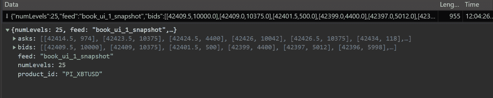

Initial payload

您在这个[文件](https://github.com/mihailgaberov/orderbook/blob/main/src/components/OrderBook/index.tsx)中看到的其余代码主要用于准备和在屏幕上呈现结果。

最有趣的部分应该是双方都使用的方法`buildPriceLevels`——出价和要价。它对数据进行排序，进行必要的计算，并将其传递给相关组件进行可视化。这些是我在本文前面提到的`DepthVisualizer`和`PriceLevelRow`。

## 分组

分组是订单簿工作方式的一个重要部分，因为它定义了订单按何种票据大小分组。

在我们的应用程序中，我为每个市场实现了一个切换功能，允许按如下方式分组:

*   XBTUSD 市场介于 0.5、1 和 2.5 之间。


XBTUSD market grouping

*   ETHUSD 市场介于 0.05、0.1 和 0.25 之间。

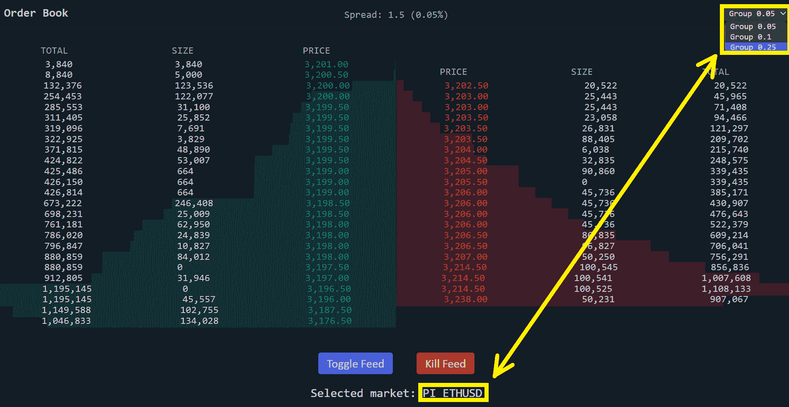

ETHUSD market grouping

在试图弄清楚如何实现分组逻辑时，我创建了一个简短的要点。你可以在这里找到它。

此外，除了这个要点之外，在开发这个项目的时候，我已经在项目本身之外做了很多实验。正因为这些只是我电脑上的本地文件，我会把它们发布在这里给那些更好奇的人。

这是一个小型的 npm 项目，只有一个依赖项。以下是 package.json 文件:

```
{
  "name": "grouping",
  "version": "1.0.0",
  "main": "index.js",
  "license": "MIT",
  "dependencies": {
    "lodash.groupby": "^4.6.0"
  }
} 
```

这是代码本身:

```
const bids = [
    [
        50163,
        110
    ],
    [
        50162,
        13140
    ],
    [
        50158,
        3763
    ],
    [
        50156,
        1570
    ],
    [
        50155,
        21997
    ],
    [
        50152.5,
        450
    ],
    [
        50151,
        4669
    ],
    [
        50150.5,
        10329
    ],
    [
        50150,
        2500
    ],
    [
        50149.5,
        450
    ],
    [
        50149,
        4022
    ],
    [
        50148,
        20000
    ],
    [
        50147,
        5166
    ],
    [
        50146.5,
        5274
    ],
    [
        50145,
        174609
    ],
    [
        50143,
        20000
    ],
    [
        50141,
        28000
    ],
    [
        50140.5,
        5000
    ],
    [
        50138,
        6000
    ],
    [
        50132.5,
        4529
    ],
    [
        50132,
        4755
    ],
    [
        50131,
        12483
    ],
    [
        50128.5,
        61115
    ],
    [
        50128,
        23064
    ],
    [
        50125.5,
        181363
    ]
]

/* function roundDownNearest(num, acc) {
    if (acc < 0) {
        return Math.floor(num * acc) / acc;
    } else {
        return Math.floor(num / acc) * acc;
    }
} */

/* function groupByTicketSize(ticketSize, levels) {
    const result = levels.map((element, idx) => {
        const nextLevel = levels[idx + 1];

        if (nextLevel) {
            const currentPrice = element[0];
            const currentSize = element[1];
            const nextPrice = nextLevel[0];
            const nextSize = nextLevel[1];
            console.log("current level: ", element)
            console.log("next level: ", nextLevel)

            element[0] = roundDownNearest(currentPrice, ticketSize);

            if (currentPrice - nextPrice < ticketSize) {
                element[1] = currentSize + nextSize;
            }
            console.log("==================================> Result: ", element)

            return element;
        }

    }).filter(Boolean); 

    console.log("============================================================");
    console.log(result)
} */

const test = [
    [1004.5, 1],
    [1001.5, 1],
    [1001,   1],
    [1000.5, 1],
    [1000,   1],
    [999.5,  1],
    [999,    1],
    [990,    1],
    [988,    1]
]

function groupByTicketSize(ticketSize, levels) {
    const result = [];

    for (let i = 0; i < levels.length; i++) {
        console.log(levels[i])
        const prevLevel = levels[i-1]
        const level1 = levels[i]
        const level2 = levels[i+1]

        if (prevLevel && level1 && level1[0] - ticketSize === prevLevel) return

        if (level2 && level1[0] - level2[0] < ticketSize) {
            const newLevel = [level2[0], level1[1] + level2[1]];
            console.log("newLevel", newLevel)
            result.push(newLevel);
        } else {
            result.push(level1)
        }
    }

    console.log("============================================================");
    console.log(result)
}

// groupByTicketSize(1, bids);
groupByTicketSize(1, test); 
```

## 如何在应用程序上执行单元测试

为了执行单元测试，我使用了[反应测试库](https://testing-library.com/docs/react-testing-library/intro/)。

它背后的主要思想是，开发人员应该只为用户将要看到和交互的内容编写测试。测试实现细节没有多大意义。

💡举个例子，假设您实现了一个列表组件，它只显示文本数据行。比如说待办事项清单。

然后假设这些数据来自一个数组形式的 API 调用。一种可以通过各种方法轻松迭代的数据结构——某种循环，例如 for()或 while()。或者你可以使用另一种更实用的方法，比如说。map()方法。

现在问问你自己——对于最终用户，那个只会看到列出的文本数据的人，你的实现重要吗？只要一切都如预期的那样工作，并且以一种良好的、高性能的方式工作，答案就是“不，它不工作”。

这是你的测试应该反映的。

在我们的订单簿应用程序的上下文中，每个测试文件都位于与实现文件相同的目录中。大多数测试都很简短，不言自明，因为这些测试主要是渲染逻辑，只有[快乐路径](https://en.wikipedia.org/wiki/Happy_path)。

例如，让我们看看下面的按钮组件测试:

```
import React from 'react';
import { render, screen } from '@testing-library/react';
import Button from './index';

test('renders button with title', () => {
  render(<Button backgroundColor={'red'} callback={jest.fn} title={'Toggle'} />);
  const btnElement = screen.getByText(/Toggle/i);
  expect(btnElement).toBeInTheDocument();
}); 
```

它只是验证组件是否正确呈现，并显示我们希望用户看到的内容。这种情况下是标题*切换*。

为了测试[减速器](https://github.com/mihailgaberov/orderbook/blob/main/src/components/OrderBook/orderbookSlice.test.ts)，我使用了 [Jest](https://jestjs.io/) ，因为这是我们将涉及的唯一不可见的部分。这些测试也非常简单，一目了然。我使用它们来测试初始应用程序状态是否已经就绪，并查看向该状态添加价格级别是否正常工作。

## 如何将应用程序部署到 Vercel

最后—部署时间。🎉

在完成开发和测试我们的应用程序后，让我们将它投入使用。

为此我使用了 [Vercel](https://vercel.com/) 平台。它们提供了一个非常丰富且易于使用的接口，以及对所有著名源代码控制平台的集成——当然，包括 GitHub(我们的应用程序 repo 所在的地方)。

假设你有一个 GitHub 帐户，如果你想自己部署它，你需要做的是用它登录[这里](https://vercel.com/login)。

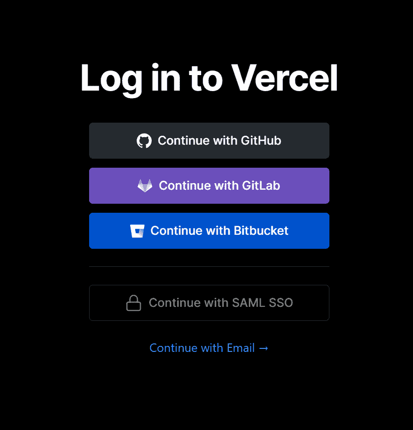

Vercel login screen

点击右上角的*+新建项目*按钮。然后使用打开的屏幕中提供的选项导入 Git 存储库。这是我的样子:

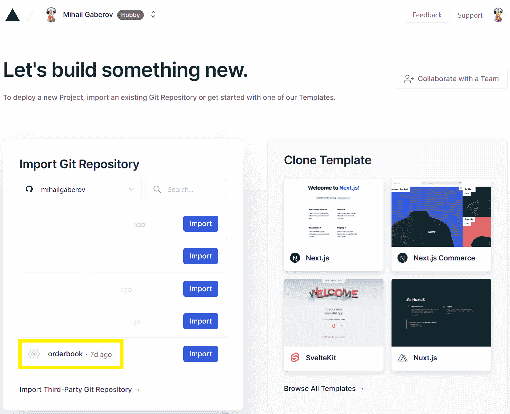

Vercel Import Git Repository screen

导入项目后，您将能够进行实际的部署。完成后，Vercel 将为您生成访问新部署的应用程序的 URL。

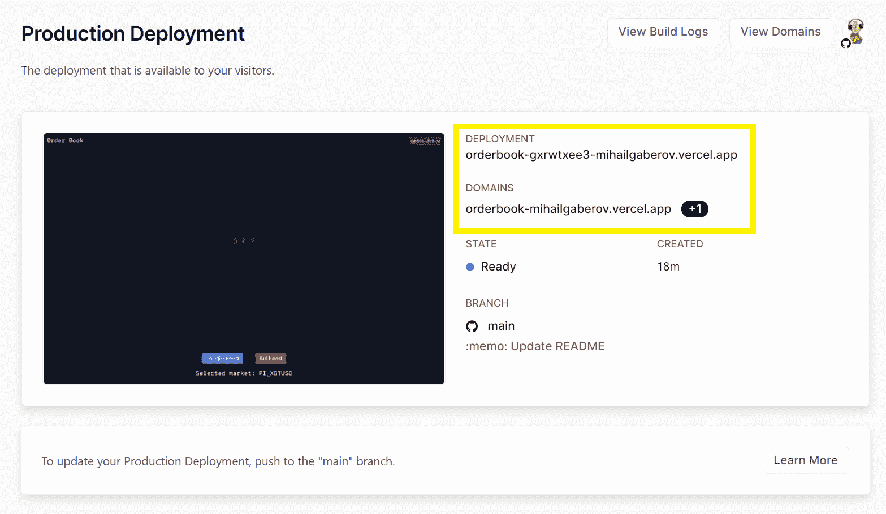

Vercel production deployment screen

我想您会收到一封电子邮件，告知您部署是否成功。那封邮件也包含这些网址。

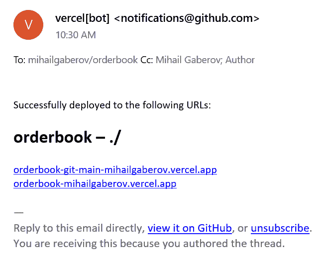

Vercel successful deployment email

恭喜你！👏🏻

你现在有了自己的[订单簿应用程序](https://orderbook-mihailgaberov.vercel.app/)并在线运行。

## 如何在 GitHub 上添加构建徽章

这与订单无关，但我还是决定在这里与你分享。正是这些小细节让大局变得更加完整和有吸引力。

也许你们中的一些人想知道怎样才能得到这些所谓的*徽章*？


答案如下:[https://shields.io/](https://shields.io/)。

您可以转到[其他部分](https://shields.io/category/other)并找到 GitHub 部署选项。

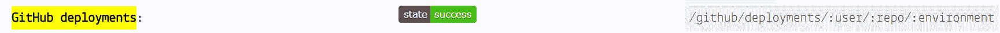

然后点击它，并按照指示。

为了让它充分发挥作用，你还需要做一件事。你进入 GitHub 库→ [Actions](https://github.com/mihailgaberov/orderbook/actions) 选项卡，创建新的工作流文件。你可以直接从这里复制[矿的内容](https://github.com/mihailgaberov/orderbook/actions/runs/2143399541/workflow)。命名为 *main.yml* 。

这将运行该文件中定义的作业。在我们的例子中，这只是构建工作，基本上是构建一个新的构建并运行测试。

完成后，您只需将以下几行添加到您的[自述文件](https://github.com/mihailgaberov/orderbook/blob/main/README.md)中:

```
<!-- prettier-ignore-start -->
[](<https://github.com/mihailgaberov/orderbook/actions/workflows/main.yml>)
[![Build Status][build-badge]][build]

[build-badge]: <https://img.shields.io/github/deployments/mihailgaberov/orderbook/production?label=vercel&logoColor=vercel>
[build]: <https://github.com/mihailgaberov/orderbook/deployments>
<!-- prettier-ignore-end --> 
```

💡不要忘记在 URL 中输入你自己的详细信息，即你的 GitHub 用户名和你的库名。

完成这些更改后，您应该会看到在您的自述文件:🥳.上显示的徽章

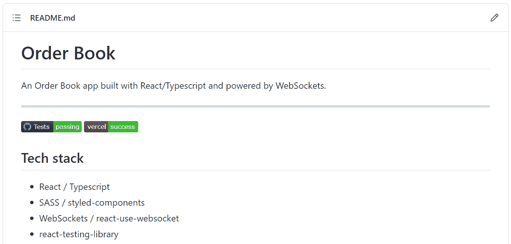

GitHub badges

## 包扎

如果你从头开始读这篇文章，我会给你一个冠军。🍾

这是一次漫长的旅行，但希望和我一起走会很有趣！

现在是时候总结我们在这里所做的事情，并尝试提取一些有用的见解，这些见解将有助于我们应对未来的发展挑战。

我将在下面列出我对构建这个应用程序最大挑战的看法。我会更渴望找到你的东西。

### 渲染性能

当我构建 UI 并试图实现价格水平行的绘制时，这在开始时真的让我很难受。

我早些时候提到了我是如何设法解决这个问题的，我想这将是我肯定会记住的事情。

### 分组功能

实现这一点也很有挑战性，因为我必须考虑几个因素。因为我们所处的市场和我必须计算的范围。

我花了一段时间来润色它(还记得我在前面几节分享的 side mini 项目和要点)，我仍然认为它可以改进得更多。尝试多次在市场和分组值之间切换，并观察结果。

### 改进的空间

已经提到的一件事肯定是分组。这也应该改善红色和绿色部分的可视化——它们(几乎)总是应该形成一个不理想的三角形。

如果我们试着从更大的角度来看，这个订单簿应用程序可以是一个仪表板屏幕的一部分，上面也有其他小部件，它们之间可以进行交互。

例如，更改订单簿的分组，以反映其他小部件中视图的更改——比如显示如下所示的市场图表:

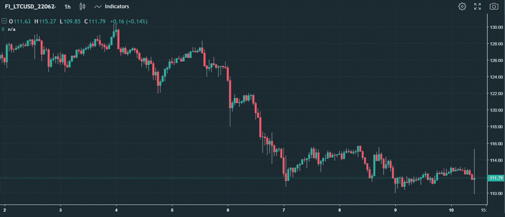

我甚至没有提到增加新市场是一种改进，因为这很明显。但是在为当前市场构建功能时，应该考虑到这一点，以便以一种易于扩展的方式来完成。因此，向订单簿中添加新市场是一项简单而快速的任务。

我想这都是我造成的。

感谢阅读！🙏

## 参考

这里有几个链接，你可能会觉得有用:

[风格化组件快乐路径](https://www.joshwcomeau.com/css/styled-components/)

[博客回答:反应渲染行为的(大部分)完整指南](https://blog.isquaredsoftware.com/2020/05/blogged-answers-a-mostly-complete-guide-to-react-rendering-behavior/#what-is-rendering)