# 如何设计一个使用 RxJx、Node 和 WebSockets 控制对象动画的分布式系统

> 原文：<https://www.freecodecamp.org/news/reactive-thinking-how-to-design-a-distributed-system-with-rxjs-websockets-and-node-57d772f89260/>

在我的上一篇文章[如何使用 RxJs](https://medium.freecodecamp.org/thinking-reactively-how-to-animate-with-movement-objects-using-rxjs-692518b6f2ac) 反应式思考和动画移动对象中，我描述了如何构建一个 **MobileObject** 类来模拟一个对象在外部控制器施加的加速度下的移动。

现在我想向你们展示一个简单的分布式系统，它允许一个**控制器**应用程序远程控制一个**移动物体的移动。**第二个远程应用程序是**监视器**，它在二维平面上显示物体的运动。在系统的中心有一个**移动对象服务器**，这是**移动对象**所在的地方。

这篇文章的目标是解释反应式思维是如何逐步产生一个设计的，这个设计非常自然地映射需求并产生一个简洁的解决方案。我们将最终解决只订阅一个可观察的的问题。

我们将关注服务器部分，从这个角度来看，这是最有趣的部分。

对于实现，我们将使用 RxJs 和 TypeScript。服务器在节点上运行。所有组件都使用网络套接字进行通信。

完整的代码库，包括服务器控制器和监视器，可以在[这里](https://github.com/EnricoPicci/mobile-object-observables)找到。

### 分布式系统的模式

分布式系统的逻辑模式如下图所示:

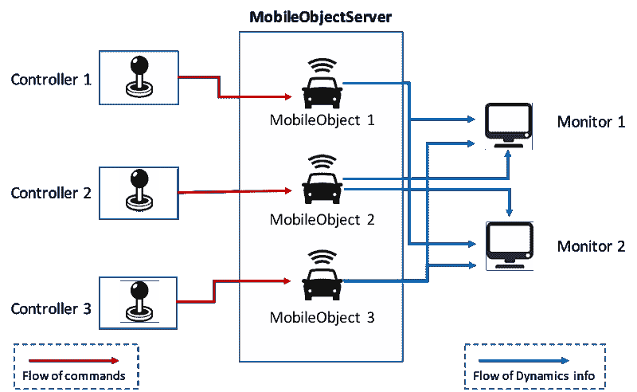

Schema of the distributed system

在中心放置了**移动对象服务器**，在那里运行**移动对象**的实例。每个**移动物体**都由其**控制器**控制，这是一个网络应用程序，通过它我们可以向**移动物体**发出命令(如加速、刹车)。所有**移动物体**的移动可以在一个或多个**监视器**上看到。每个**显示器**也是一个网络应用程序。

下图显示了一个**控制器**、一个**监视器**和**移动对象服务器**之间的示例交互流程。

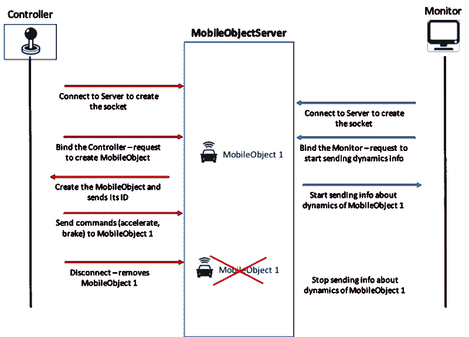

Sample interaction flow

### 事件方面的服务器要求

我们可以用事件来表达分布式系统的服务器部分的需求:

*   **事件 1** —当一个**控制器**连接= >产生**一个移动对象**等
*   **event 2**—**控制器**收到命令= >将命令转发给**控制器**控制的移动物体**控制** ler
*   **事件 3** —当一个**控制器**断开时= >删除 t **他移动受 t **控制的对象** ct 他控制** ler
*   **事件 4** —当**监控器**连接= >时，开始向新连接的 **ed Moni** tor 发送所有 runni **ng MobileObje** cts 的动态数据
*   **Event5** —当一个**移动对象**被添加时= >开始将其动态数据发送给所有被他监控的**RS**
*   **事件 6** —当**监视器**断开时= >停止向位于监视器的 **ll 移动对象**发送动态数据流

反应式思维会产生一个自然地映射以这种方式表达的需求的设计。

### 组成服务器的元素

分布式应用程序的服务器组件由两个主要元素组成:

*   **MobileObject** 类，它使用 RxJs 可观察对象实现动态移动逻辑——这已经在[这里详细描述过了](https://medium.freecodecamp.org/thinking-reactively-how-to-animate-with-movement-objects-using-rxjs-692518b6f2ac)
*   **MobileObjectServer** 类**，**管理 web-socket 协议，接收来自**控制器**的命令，并向**监视器**发送关于 **MobileObject 动态的所有信息。**这种实现方式受到了路易斯·阿比莱斯[的](https://www.freecodecamp.org/news/reactive-thinking-how-to-design-a-distributed-system-with-rxjs-websockets-and-node-57d772f89260/undefined)[这篇文章](https://medium.com/dailyjs/real-time-apps-with-typescript-integrating-web-sockets-node-angular-e2b57cbd1ec1?t=1&cn=ZmxleGlibGVfcmVjcw%3D%3D&refsrc=email&iid=9b197a27b4a14948b1d2fd4ad999e0a1&uid=39235406&nid=244%20276893704)的启发。

#### 移动对象 API

让我们来简单概述一下 **MobileObject** 类——所有细节可以在[这里](https://medium.freecodecamp.org/thinking-reactively-how-to-animate-with-movement-objects-using-rxjs-692518b6f2ac)找到，而代码可以在[这个资源库](https://github.com/EnricoPicci/mobile-object-observables)找到。

**MobileObject** 提供了两类 API。

第一个是一组方法，通过这些方法，外部**控制器**可以发出影响对象动态的命令(例如，加速、制动)。

第二个是与外部客户端通信的只读数据流，**监控**，即关于对象动态行为的相关数据(即，其位置和速度随时间的变化)。

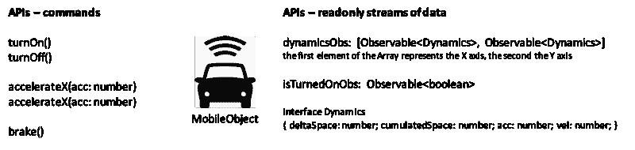

APIs of MobileObject

为了移动一个**移动对象**的实例，一个**控制器**必须打开它(用`turnOn()`方法)，应用想要的加速度(用`accelerateX(acc: number)`和`accelerateY(acc: number)`方法)，然后可能刹车(用`brake()`方法)。

当**监视器**连接到**移动对象服务器**时，**移动对象服务器**订阅`dynamicsObs`和运行在服务器上的**移动对象**的可观察对象。然后，它开始向连接的**监视器**发送与它们的运动相关的数据。

出于本文的目的，这是您需要了解的关于 **MobileObject** 的所有信息。

### 作为可观察对象的插座

当一个客户端，或者是一个**控制器**或者是一个**监视器**打开一个 websocket 连接时， **MobileObjectServer** 开始做一些事情。随着时间的推移， **MobileObjectServer** 可以从许多客户端接收许多打开连接的请求。

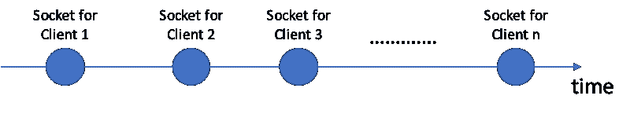

Sequence of sockets opened over time

这看起来像一个可观察的插座。这是如何使用`socket.io`库获得它:

```
import { Server } from 'http';

import { Observable } from 'rxjs';
import { Observer } from 'rxjs';

import * as socketIoServer from 'socket.io';

import {SocketObs} from './socket-obs';

export function sockets(httpServer: Server, port) {
    httpServer.listen(port, () => {
        console.log('Running server on port %s', port);
    });
    return new Observable<SocketObs>(
        (subscriber: Observer<SocketObs>) => {
            socketIoServer(httpServer).on('connect', 
                socket => {
                    console.log('client connected');
                    subscriber.next(new SocketObs(socket));
                }
            );
        }
    );
}
```

通过函数`sockets`，我们创建了一个`SocketObs`的可观察对象(我们将在后面看到这个类的实现)。每当 websocket 服务器接收到一个*连接*请求并创建一个新的*套接字*时，这个函数返回的 Observable 就会发出一个`SocketObs`实例，该实例包装了刚刚创建的*套接字*。

#### 套接字上的消息是可观察的

套接字可用于从客户端向服务器发送消息，反之亦然。有了`socket.io`库，我们可以使用`emit`方法发送消息。

`SocketIO.Socket.emit(event: string, …args: any[]): SocketIO.Socket`

参数`event`可以被视为我们想要发送的消息类型的标识符。`…args`参数可用于发送特定于单个消息的数据。

任何对某种类型的消息(或者事件，用`socket.io`术语来说)感兴趣的人都可以使用方法`on`开始监听套接字。

`SocketIO.Emitter.on(event: string, fn: Function): SocketIO.Emitter`

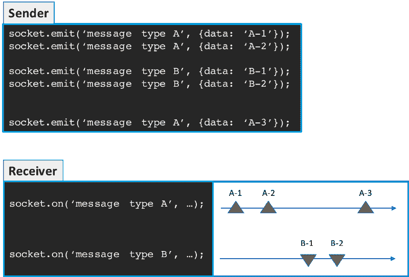

Sequence of messages received over time

同样，接收者收到的消息序列看起来像是可观察的。这就是我们如何创建可观察对象的方法，只要接收到某种类型的消息，这些可观察对象就会实际发出。

`onMessageType`方法是一个成功的方法。它返回一个 Observable，每当收到类型为`messageType`的消息时就会发出这个 Observable。

```
import { Observable, Observer } from 'rxjs';

export class SocketObs {
    constructor(private socket: SocketIO.Socket) {}

    onMessageType(messageType): Observable<any> {
        return new Observable<any>((observer: Observer<any>) => {
            this.socket.on(messageType, data => observer.next(data));
        });
    }
}
```

通过这种方式，套接字事件，或者我们在这里称之为消息，已经被转化为可观察的。这些将是我们设计的基础。

### 确定客户的性质

有两种类型的客户端可以与 **MobileObjectServer 连接。**一个是**控制器**，一个是**监控器**。 **MobileObjectServer** 首先需要确定它将在特定的套接字上处理哪种类型的客户端。

我们选择实现这种逻辑的方式是让**控制器**和**监视器**发送不同的消息类型作为它们的第一条消息。

*   **控制器**发送 BIND_CONTROLLER 类型的消息
*   **Monitor** 发送 BIND_MONITOR 类型的消息

根据套接字上接收到的第一条消息的类型， **MobileObjectServer** 能够识别它是否正在与**控制器**或**监视器**通信。

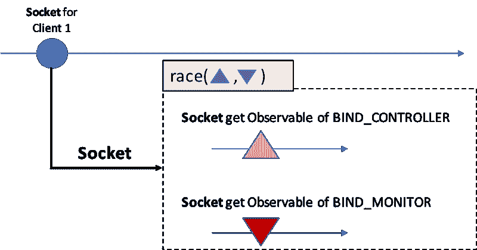

How to determine the nature of the client on a socket

一旦创建了套接字， **MobileObjectServer** 就必须开始监听两种类型的消息，BIND_CONTROLLER 和 BIND_MONITOR。最先出现的将获胜。这是映射两种不同类型消息的两个可观察值之间的一个`race`。

每当创建一个新的套接字时，即每当函数`[sockets](https://gist.github.com/EnricoPicci/35f3c3a2a2a3f96cfdf7b89d46a5d499)`返回的可观察对象发出时，都必须重复这样的逻辑。因此，我们需要合并所有赢得比赛的事件。我们需要使用`mergeMap`操作符，它合并所有由相关的可观察对象引发的事件，并将结果展平成一个新的可观察对象(`mergeMap`以前被称为`flatMap`)。

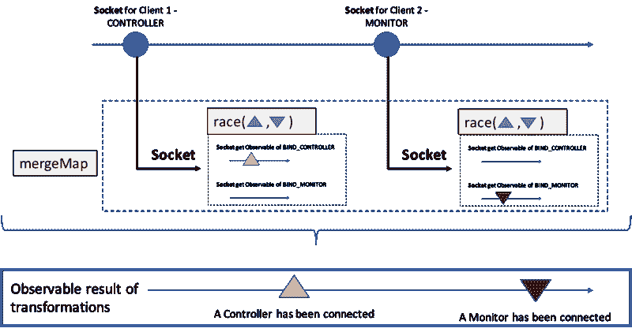

Observable that emits specific events depending on the nature of the Client

获得此结果的代码如下:

```
startSocketServer(httpServer: Server) {
    sockets(httpServer, this.port).pipe(
        mergeMap(socket =>
            race(
                socket.onMessageType(MessageType.BIND_MONITOR),
                socket.onMessageType(MessageType.BIND_CONTROLLER)
            )
        )
    )
    .subscribe();
}
```

既然我们知道了如何区分**控制器**和**监视器**，我们可以专注于在这两种情况下做什么。

### 与监视器相关的事件

一个**监视器**显示正在**移动对象服务器**上运行的所有**移动对象**的移动。因此 **MobileObjectServer** 必须在正确的时间向监视器发送正确的信息。让我们先看看这些时间是什么，也就是说 **MobileObjectServer** 为了完成它的工作必须知道哪些相关事件。

#### 添加和删除移动对象

第一个相关事件是:

*   添加了一个**移动对象**=>移动对象显示在**监视器**上
*   一个**移动对象**已被删除= >移动对象已从**监控对象**中删除

**移动对象**随着时间的推移被添加或删除，因此这种事件可以用两个可观察值来建模:

*   添加**移动对象**时发出的可观察值
*   移除**移动对象**时发出的可观察信号

一旦**监视器**被连接，**移动对象服务器**开始对这两个可观察对象感兴趣，所以它必须`merge`它们:

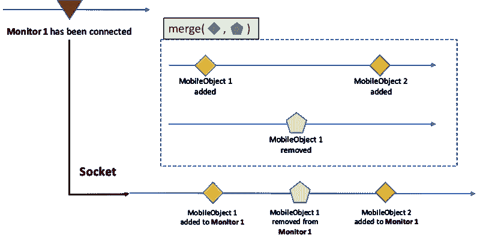

Merging MobileObject added and removed events for a Monitor

与我们之前看到的类似，每当添加一个**监视器**时，我们都需要重复这样的逻辑。因此我们需要`mergeMap`所有的可观测值，这些可观测值是*‘移动物体添加’*可观测值与【T6’‘移动物体移除’可观测值的`merge`的结果。

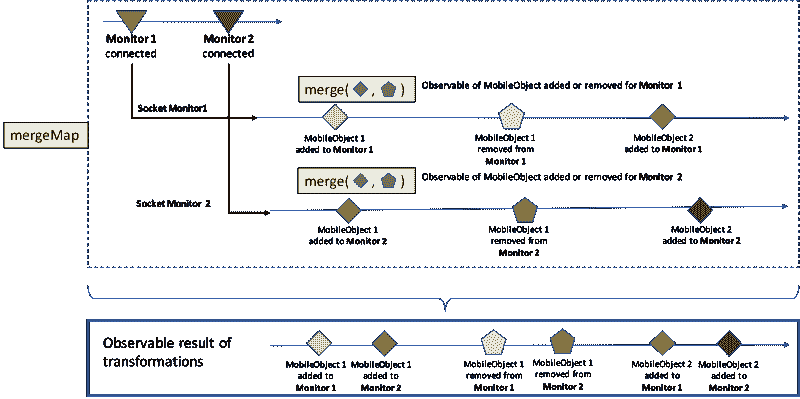

Events for MobileObject added and removed for all Monitors

这是获得一个可观察对象的代码，该可观察对象在**移动对象**被添加到每个**监视器**或从其中删除时发出

```
import {sockets} from './socket-io-observable';
import {SocketObs} from './socket-obs';

class MobileObjectServer {
    private mobileObjectAdded = new Subject<{mobObj: MobileObject, mobObjId: string}>();
    private mobileObjectRemoved = new Subject<string>();

    startSocketServer(httpServer: Server) {
        sockets(httpServer, this.port).pipe(
            mergeMap(socket =>
                race(
                    socket.onMessageType(MessageType.BIND_MONITOR)
                    .pipe(
                        map(() => (socketObs: SocketObs) => this.handleMonitorObs(socketObs))
                    ),
                    socket.onMessageType(MessageType.BIND_CONTROLLER)
                    // something will be added here soon to make this logic work
                )
                .pipe(
                    mergeMap(handler => handler(socket))
                )
            )
        )
        .subscribe();
    }

    handleMonitorObs(socket: SocketObs) {
        const mobObjAdded = this.mobileObjectAdded;
        const mobObjRemoved = this.mobileObjectRemoved;
        return merge(mobObjAdded, mobObjRemoved);
    }
} 
```

我们在这段代码中引入了一些值得在这里评论的东西。

我们已经创建了`MobileObjectServer`类，从现在开始，我们将在这里编写所有的服务器逻辑。

我们将在后面充实的方法`handleMonitorsObs`简单地返回两个可观察对象的`merge`,`mobileObjectAdded`和`mobileObjectRemoved`，它们是主体。这就是上图所示的`merge`的“内在”。

主题是可观察的，因此可以像我们在这里做的那样合并。但是主体也是观察者，所以我们可以通过它们发射事件。正如我们将在后面的代码中看到的，有时我们将使用这些主题来发出它们的名字所暗示的事件。

最后一点与我们在 startSocketServer 方法中添加的代码有关:

```
race(
   socket.onMessageType(MessageType.BIND_MONITOR)
   .pipe(
      map(() => (sObs: SocketObs) => this.handleMonitorObs(sObs))
   ),
   socket.onMessageType(MessageType.BIND_CONTROLLER)
   // something will be added here soon to make this logic work
)
.pipe(
   mergeMap(handler => handler(socket))
)
```

这基本上是这样说的:每当收到 BIND_MONITOR 消息时，返回函数

```
(socketObs: SocketObs) => this.handleMonitorObs(socketObs)
```

这将在通过管道传递到`race`函数结果的`mergeMap`操作符中执行。这个`mergeMap`操作器就是上图中显示的外部`mergeMap`。

阅读代码的另一种方式如下:与 BIND_MONITOR 类型的消息相对应的任何事件都被

```
mergeMap(() => this.handleMonitorObs(socket))
```

其中`socket`是由`race`函数发出的`SocketsObs`类型的实例。

很快我们将为 BIND_CONTROLLER 添加一些类似的东西，以使整个逻辑工作。

#### 处理移动对象动态观察值

让我们考虑一个**监视器**，它连接到**移动对象服务器**。连接之后，几个移动对象被添加到**移动对象服务器**。

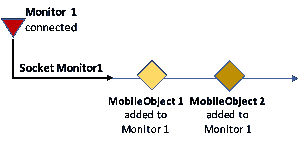

MobileObjects added for one Monitor

现在对于每个**移动对象，**我们必须开始考虑它们作为 API 的一部分提供的动态观察。这些可观测到的物体以固定的时间间隔发出关于**移动物体**的动态(位置和速度)数据。如果`mobileObject`存储了一个对 **MobileObject** 的引用，我们可以通过`mobileObject.dynamicsObs`获得它的动态观察(参见 MobileObject APIs)。

首先，我们必须转换每个事件，表示一个**移动对象**已经被添加到由它的`dynamicsObs`发出的一系列事件中。然后我们`mergeMap`将所有这些系列整合成一个新的单个可观察对象，它为所有添加的移动对象发出所有动态事件。

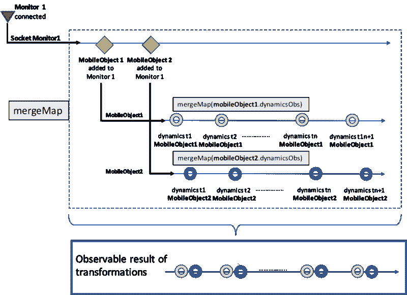

Dynamics events for a single Monitor

然后我们将所有这些 jazz 应用到所有连接到 **MobileObjectServer 的**监视器**。**因此我们最终得到一个新的可观察对象，它发出所有**监视器**和所有**移动对象**的动态数据(加上与一个**移动对象**被移除的事实相关的所有事件)。

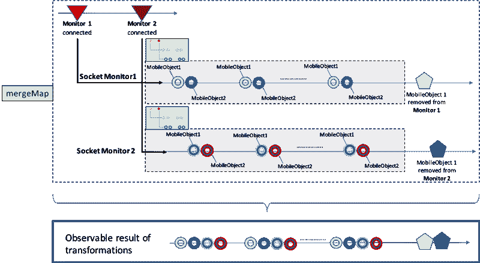

Relevant events for all Monitors

在每个时间间隔，我们有四个事件组，这些事件与我们的**移动对象**的动态数据发射相关。为什么？如果我们认为我们有两个**监视器**和两个**移动对象**，这是有意义的。每个**移动对象**必须在每个时间间隔向每个**监视器**发送其动态数据。因此，每个时间间隔看到四个事件是正确的。

一旦清楚了这一点，代码就非常简单了:

```
import {sockets} from './socket-io-observable';
import {SocketObs} from './socket-obs';

class MobileObjectServer {
    private mobileObjectAdded = new Subject<{mobObj: MobileObject, mobObjId: string}>();
    private mobileObjectRemoved = new Subject<string>();

    startSocketServer(httpServer: Server) {
        sockets(httpServer, this.port).pipe(
            mergeMap(socket =>
                race(
                    socket.onMessageType(MessageType.BIND_MONITOR)
                    .pipe(
                        map(() => (socketObs: SocketObs) => this.handleMonitorObs(socketObs))
                    ),
                    socket.onMessageType(MessageType.BIND_CONTROLLER)
                    // something will be added here soon to make this logic work
                )
                .pipe(
                    mergeMap(handler => handler(socket))
                )
            )
        )
        .subscribe();
    }

    handleMonitorObs(socket: SocketObs) {
        const mobObjAdded = this.mobileObjectAdded
                              .pipe(
                                mergeMap(data => data.mobileObject.dynamicsObs)
                              );
        const mobObjRemoved = this.mobileObjectRemoved;
        return merge(mobObjAdded, mobObjRemoved);
    }

} 
```

我们刚刚介绍了一个简单的变化。我们更改了`handleMonitorObs`方法，添加了`mergeMap`操作符。这转换了`mobileObjectAdded`可观测值，因此新的可观测值发出我们正在寻找的动态数据。

其余的都没动过。

### 到目前为止的总结

到目前为止我们做了什么？我们刚刚转换了 observable 以获得新的 observable，当它必须处理一个**监视器**时，这些 observable 发出所有 **MobileObjectServer** 感兴趣的事件。没别的了。

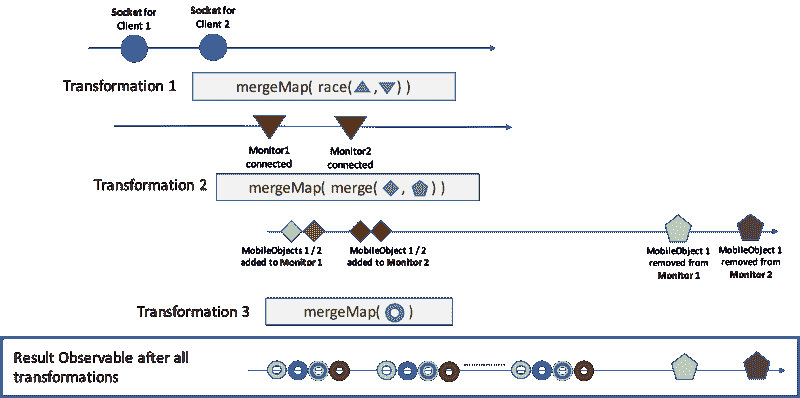

Transformations of Observables relevant for Monitors

您可以在下图中看到这些转换是如何反映在代码中的:

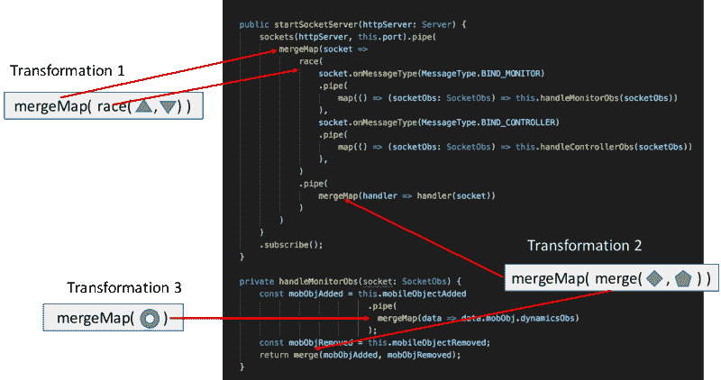

我们现在唯一需要做的就是将期望的*副作用*添加到相关事件中。这将最终让我们实现我们想要的，即在正确的时间向监视器传达正确的信息。

但是在讨论*副作用*之前，让我们先了解一下**移动对象服务器**在与**控制器**交互时需要做什么，控制器是我们分布式系统中的另一个客户端。

### 与控制器相关的事件

当**控制器**连接到**移动对象服务器**时，服务器需要关心的事情就少了。至少嵌套的相关事件发生的比较少。

**MobileObjectServer** 需要关心的事情有:

*   一个**控制器**已经连接，这在我们简单的逻辑中意味着我们必须创建一个全新的**移动对象**
*   **控制器**已经为其**移动对象**发送了命令
*   **控制器**已经断开。在我们的实现中，这意味着我们必须删除由**控制器**控制的**移动对象**(我们在**移动对象**和它的**控制器**之间有 1 对 1 的关系)

我们已经知道了第一个事件:它是由`socket.onMessageType(BIND_CONTROLLER)`返回的可观测物发出的事件。

命令由**控制器**以消息的形式发送给**移动对象服务器**。因为每个控制器都有自己的*套接字，所以我们可以创建一个通过某个*套接字接收的命令的可观察对象(从某个控制器接收的*)。*我们通过简单地使用`SocketObs`的`onMessageType`方法来做到这一点

```
socket.onMessageType(CONTROLLER_COMMAND)
```

`SocketObs`还提供了一个方法`onDisconnect`，当*套接字*断开时，该方法返回一个发出的可观察值。这是我们处理第三个事件所需要的。

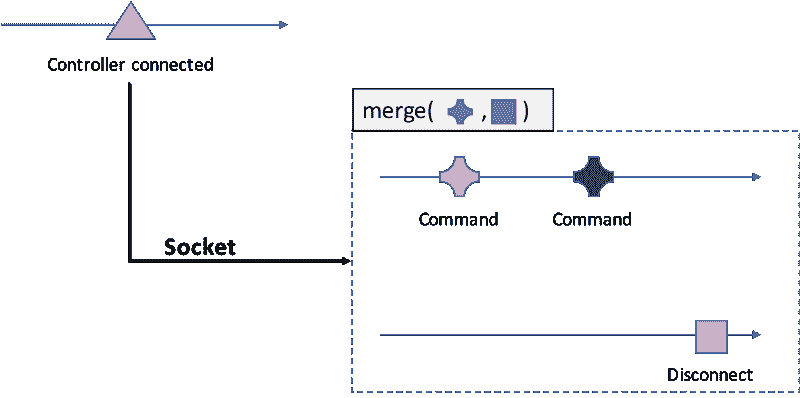

Events relevant when a Controller connects to MobileObjectServer

由于我们处理的不止一个**控制器**可能连接到 **MobileObjectServer** ，所以我们需要`merge`的结果`mergeMap`并不奇怪。这是我们已经做过几次的相同类型的转换。

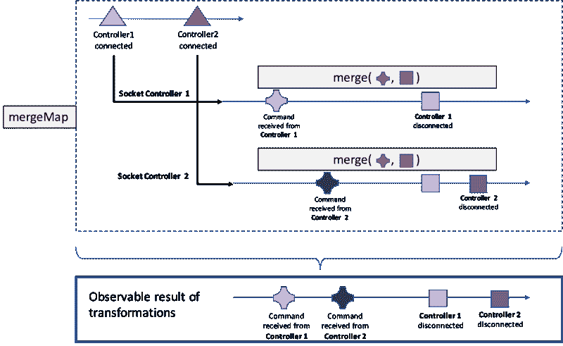

代码应该也不令人惊讶。

```
startSocketServer(httpServer: Server) {
        sockets(httpServer, this.port).pipe(
            mergeMap(socket =>
                race(
                    socket.onMessageType(MessageType.BIND_MONITOR)
                    .pipe(
                        map(() => (socketObs: SocketObs) => this.handleMonitorObs(socketObs))
                    ),
                    socket.onMessageType(MessageType.BIND_CONTROLLER)
                    .pipe(
                        map(() => (socketObs: SocketObs) => this.handleControllerObs(socketObs))
                    ),
                )
                .pipe(
                    mergeMap(handler => handler(socket))
                )
            )
        )
        .subscribe();
}

handleMonitorObs(socket: SocketObs) {
        const mobObjAdded = this.mobileObjectAdded
                              .pipe(
                                mergeMap(data => data.mobileObject.dynamicsObs)
                              );
        const mobObjRemoved = this.mobileObjectRemoved;
        return merge(mobObjAdded, mobObjRemoved);
}

handleControllerObs(socket: SocketObs) {
        const commands = socket.onMessageType(MessageType.CONTROLLER_COMMAND);
        const disconnect = socket.onDisconnect();

        return merge(commands, disconnect);
}
```

我们简单地添加了一个`handleControllerObs`方法来处理接收到的的*命令和控制器的*断开*。我们对其应用 mergeMap 转换，就像我们已经对`handleMonitorObs`所做的那样。*

#### **应用于控制器的变换概要**

下图说明了我们从**控制器**连接时发出的可观察信号开始应用的所有转换。


Transformations of event streams (Observables) relevant for Controllers

### 最终可观察到的

如果我们把对**监控器**和**控制器**所做的变换放在一起，我们得到的是下面的最终可观测值。

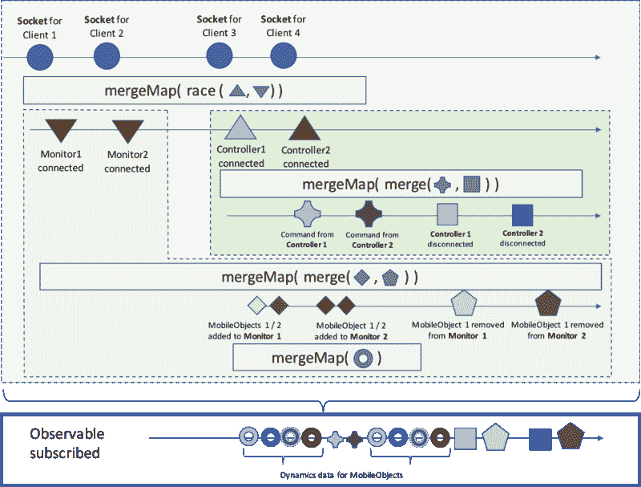

The tree of events produced subscribing the Final Observable

仅仅通过订阅这最后一个可观察的，整个事件树就展开了。

### 副作用

我们通过订阅最终可观测值而创造的美丽的事件树并没有做任何事情。但是它很好地映射了我们在本文开始描述服务器需求时确定的 ***事件*** 。

基本上，它清楚地告诉我们何时必须做某事。

这个*东西*就是我们所说的*副作用*。

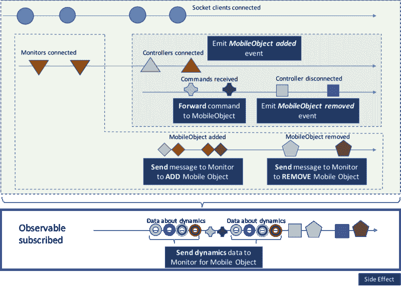

Side effects

当一个控制器连接和断开时，我们分别创建或删除一个**移动对象**。由于*这些动作的副作用*是我们使用`mobileObjectAdded`和`mobileObjectRemoved`主题引发了" *MobileObject added"* 和 *"MobileObject deleted"* 事件，我们在前面几段介绍过。

#### 如何实现*副作用*

在 RxJs 中，有不同的方法来实现*副作用*。

观察者是其中之一。我们可以在使用`tap`操作符`subscribe`的同时添加观察者(以前称为`do`)。

另一种方法是在我们传递给任何 RxJs 操作符的任何函数中注入它们。

我们主要使用`tap`，因为它允许我们在整个事件树中放置副作用。但是我们也将副作用直接放在传递给 RxJs 操作符的函数中。

我们唯一不放副作用的地方是`subscribe`。原因是，考虑到我们是如何构建的，最终观察者会发出许多不同类型的事件。因此，对所有事件都一样的`subscribe`并不是放置依赖于特定类型事件的行为的合适位置。

希望此时代码已经说明了一切。

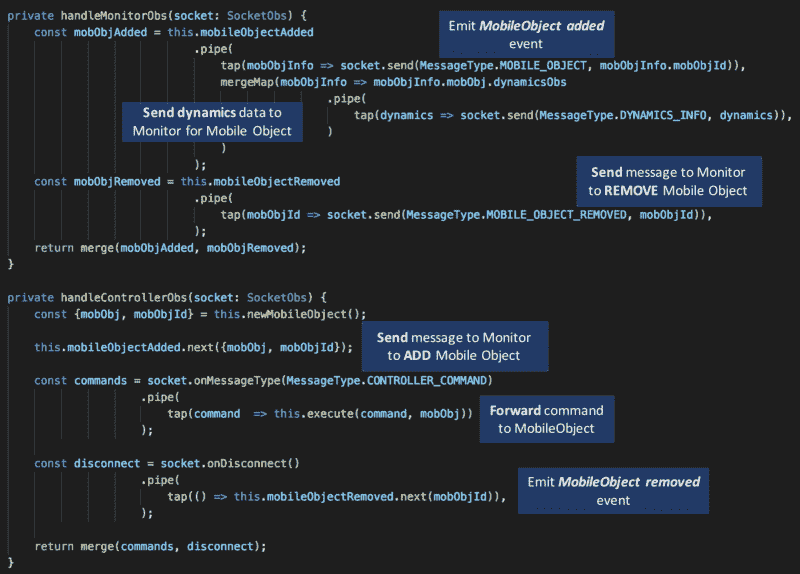

Implementation of Side Effects in the code

### 最后但同样重要的是:完成可观测量

为了完成我们的设计，我们还需要做一件事:当一个**控制器**或一个**监视器**断开连接时，停止事件流，或者完成可观察事件。

#### 当控制器断开时

当控制器断开连接时，我们删除它控制的**移动对象**。作为删除的一部分，确保**移动对象服务器**停止向连接的监视器发送与此**移动对象**相关的动态数据是很重要的。这意味着我们必须完成以下可观测量:

```
mobObjInfo.mobObj.dynamicsObs
.pipe(
  tap(dynamics => socket.send(MessageType.DYNAMICS_INFO, dynamics)),
)
```

我们可以很容易地实现这一点，只需使用`takeUntil`运算符和我们已知的`mobileObjectRemoved`可观测值:

```
mobObjInfo.mobObj.dynamicsObs
.pipe(
  tap(dynamics => socket.send(MessageType.DYNAMICS_INFO, dynamics)),
  takeUntil(this.mobileObjectRemoved.pipe(
    filter(id => id === mobObjInfo.mobObjId)
  ))
)
```

`takeUntil`确保当作为参数传递给`takeUntil`的可观察对象发出时，可观察对象完成。

每次移除一个**移动对象**时`mobileObjectRemoved`发出。然而，我们想要的是，当一个特定的**移动对象**(由其 id 标识)被移除时，停止发送动态信息。所以我们添加了`filter`逻辑。

#### 当显示器断开连接时

在这种情况下，我们也可以使用 **takeUntil** 。

我们知道监视器何时断开连接，因为与之关联的`SocketObs`类型的`socket`通过可观测的`socket.onDisconnect()`发出信号。所以我们需要做的是在`socket.onDisconnect()`发射时停止发送动态信息。

所以控制可观测性完成的最终逻辑是

```
mobObjInfo.mobObj.dynamicsObs
.pipe(
  tap(dynamics => socket.send(MessageType.DYNAMICS_INFO, dynamics)),
  takeUntil(this.stopSendDynamics(socket, mobObjInfo.mobObjId))
)
```

在哪里

```
private stopSendDynamics(socket: SocketObs, mobObjId: string){
  return merge(
            this.mobileObjectRemoved.pipe(
                                       filter(id => id === mobObjId)
                                     ),
            socket.onDisconnect()
  );
}
```

这就是实现我们逻辑的核心代码的样子:

```
import {sockets} from './socket-io-observable';
import {SocketObs} from './socket-obs';

class MobileObjectServer {
    private mobileObjectAdded = new Subject<{mobObj: MobileObject, mobObjId: string}>();
    private mobileObjectRemoved = new Subject<string>();

        public startSocketServer(httpServer: Server) {
        sockets(httpServer, this.port).pipe(
            mergeMap(socket =>
                race(
                    socket.onMessageType(MessageType.BIND_MONITOR)
                    .pipe(
                        map(() => (socketObs: SocketObs) => this.handleMonitorObs(socketObs))
                    ),
                    socket.onMessageType(MessageType.BIND_CONTROLLER)
                    .pipe(
                        map(() => (socketObs: SocketObs) => this.handleControllerObs(socketObs))
                    ),
                )
                .pipe(
                    mergeMap(handler => handler(socket)) 
                )
            )
        )
        .subscribe();
    }

    private handleMonitorObs(socket: SocketObs) {
        const mobObjAdded = this.mobileObjectAdded
                                .pipe(
                                    tap(mobObjInfo => socket.send(MessageType.MOBILE_OBJECT, mobObjInfo.mobObjId)),
                                    mergeMap(mobObjInfo => mobObjInfo.mobObj.dynamicsObs
                                                    .pipe(
                                                        tap(dynamics => socket.send(MessageType.DYNAMICS_INFO, dynamics)),
                                                        takeUntil(this.stopSendDynamicsInfo(socket, mobObjInfo.mobObjId))
                                                    )
                                    )
                                );
        const mobObjRemoved = this.mobileObjectRemoved
                                .pipe(
                                    tap(mobObjId => socket.send(MessageType.MOBILE_OBJECT_REMOVED, mobObjId)),
                                );
        return merge(mobObjAdded, mobObjRemoved);
    }

    private handleControllerObs(socket: SocketObs) {
        const {mobObj, mobObjId} = this.newMobileObject();

        this.mobileObjectAdded.next({mobObj, mobObjId});

        const commands = socket.onMessageType(MessageType.CONTROLLER_COMMAND)
                        .pipe(
                            tap(command  => this.execute(command, mobObj))
                        );

        const disconnect = socket.onDisconnect()
                        .pipe(
                            tap(() => this.mobileObjectRemoved.next(mobObjId)),
                        );

        return merge(commands, disconnect);
    }

    private stopSendDynamicsInfo(socket: SocketObs, mobObjId: string) {
        return merge(this.mobileObjectRemoved.pipe(filter(id => id === mobObjId)), socket.onDisconnect());
    }

} 
```

### 结论

这是一段相当长的旅程。我们已经看到了一些由反应性思维驱动的推理以及这种推理的一些实现。

我们开始将 WebSockets 事件转化为可观察的事件。然后，应用增量转换，我们最终创建了一个单一的可观察对象，一旦订阅，就会展开我们感兴趣的所有事件。

此时，添加允许我们实现目标的副作用已经很简单了。

这种设计的心理过程本身就是递增的，这就是我赋予“反应式思维”的含义。

完整的代码库，包括服务器控制器和监视器，可以在[这里](https://github.com/EnricoPicci/mobile-object-observables)找到。