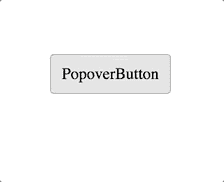

# React 的新上下文 API:在本地和全局状态之间切换

> 原文：<https://www.freecodecamp.org/news/reacts-new-context-api-how-to-toggle-between-local-and-global-state-c6ace81443d0/>

作者迭戈·哈兹

# React 的新上下文 API:在本地和全局状态之间切换


考虑一个组件，它处理一个可见性状态，并通过[渲染属性](https://reactjs.org/docs/render-props.html)将其传递给其子组件:

```
const PopoverContainer = () => (  <VisibilityContainer>    {({ toggle, hidden }) => (      <div>        <button onClick={toggle}>PopoverButton</button&gt;        <div hidden={hidden}>PopoverContent</div>      </div>    )}  </VisibilityContainer>);
```



如果仅仅通过改变组件的属性`context`就能使状态**成为全局的**，你会怎么想？

```
const PopoverButton = () => (  <VisibilityContainer context="popover1">    {({ toggle }) => (      <button onClick={toggle}>PopoverButton</button>    )}  </VisibilityContainer>);
```

```
const PopoverContent = () => (  <VisibilityContainer context="popover1">    {({ hidden }) => (      &lt;div hidden={hidden}>PopoverContent</div>    )}  </VisibilityContainer>);
```

这就是我们在这篇文章中要达到的目的。

### 上下文和状态

先在说 React 里的**上下文**和**状态**之前，我先给大家讲一些关于本题**状态**的**上下文**(!).

几个月前，我发布了 [reas](https://github.com/diegohaz/reas) ，一个由 React 和[风格组件](https://www.styled-components.com)支持的实验性 UI 工具包。

除了组件本身，我还想提供助手来处理它们的状态。我当时采取的做法是导出一些[高阶组件](https://reactjs.org/docs/higher-order-components.html) (HOCs)，比如`withPopoverContainer`，从而控制一个`Popover`组件的可见状态。看一下这个例子:

```
import { Popover, withPopoverContainer } from "reas";
```

```
const MyComponent = ({ toggle, visible }) => (  <div>    <button onClick={toggle}>Toggle</button>    <Popover visible={visible}>Popover</Popover>  </div>);
```

```
export default withPopoverContainer(MyComponent);
```

但是 HOCs 也有一些问题，比如名称冲突。如果另一个 HOC 或父组件将自己的`toggle`属性传递给`MyComponent`会怎样？东西肯定会坏掉。

甚至在那之前，受迈克尔杰克逊和他的 T2 演讲的启发，React 社区已经开始采用 T4 的渲染道具而不是 HOCs。

还有，React v16.3.0 引入了新的[上下文 API](https://reactjs.org/docs/context.html) ，取代了[旧的不稳定的那个](https://reactjs.org/docs/legacy-context.html)，使用渲染道具。

我已经学会用批判的眼光看待所有被炒作的东西，尤其是 JavaScript 社区提出的东西。这让我保持头脑清醒，避免我不得不每天用很酷的新库重构代码。

最后，我发了一条推特询问人们他们更喜欢哪个:渲染道具还是特技。所有的评论都对渲染道具有利，这最终让我把 [reas](https://github.com/diegohaz/reas) 里的所有 hoc 都变成了带渲染道具的组件:

```
import { Popover } from "reas";
```

```
const MyComponent = () => (  <Popover.Container>    {({ toggle, visible }) => (      <div>        <button onClick={toggle}>Toggle&lt;/button&gt;        <Popover visible={visible}>Popover</Popover>      </div>    )}  </Popover.Container>);
```

```
export default MyComponent;
```

`Popover.Container`是一个常规的 React 组件类，有一个`toggle`方法，使用`this.setState`来改变`this.state.visible`。就这么简单。

这很好，而且效果相当好。然而，在我的一个项目中，我有一个`button`，它应该控制放置在 React 树中完全不同的路径中的`Popover`组件。

我要么需要某种像 [Redux](https://redux.js.org/) 那样的全局状态管理器，要么需要在一个公共父节点中将`Popover.Container`向上移动，并向下传递道具，直到它们同时触及`button`和`Popover`。但这听起来是个糟糕的主意。

此外，设置 Redux 并将我与`this.setState`已经有的所有逻辑重写到动作和 reducers 中，仅仅是为了拥有那个功能，这将是一个可怕的工作。

我认为这种对共享状态的迫切需求是人们过早优化应用程序的原因之一。也就是说，预先建立他们**可能**需要的所有库，包括一个全球状态管理库。

React 的新上下文 API 在解决这个问题上派上了用场。我想继续使用常规的 React 局部状态，只在需要时扩展到全局状态，而不需要重写我的状态逻辑。这也是我建 [constate](https://github.com/diegohaz/constate) 的原因。

### 注意到


让我们看看`PopoverContainer`和[康斯泰特](https://github.com/diegohaz/constate)在一起会是什么样子:

```
import React from "react";import { Container } from "constate";
```

```
const PopoverContainer = props => (  <Container    initialState={{ visible: false }}    actions={{      toggle: () => state =>; ({ visible: !state.visible })    }}    {...props}  />);
```

```
export default PopoverContainer;
```

现在我们可以用`PopoverContainer`包装我们的组件，以便访问已经由`Container`传递给`children`函数作为参数的`visible`和`toggle`成员。

另外，请注意，我们正在将从`PopoverContainer`收到的所有道具传递给`Container`。这意味着我们可以组合它来创建一个新的派生状态组件，比如带有新的`initialState`和`actions`的`AdvancedPopoverContainer`。

#### 在后台

如果你像我一样，想知道事情是如何实现的，你可能会想`Container`是如何实现的。因此，让我们重新创建一个简单的`Container`组件:

```
import React from "react";
```

```
class Container extends React.Component {  state = this.props.initialState;
```

```
 render() {    return this.props.children({      ...this.state,      ...mapStateToActions(...)    });  }}
```

```
export default Container;
```

`[mapStateToActions](https://github.com/diegohaz/constate/blob/93b7b5b469be4521784b51380f49e6589c3e56b9/src/utils.js#L1-L8)`是一个实用函数，它将状态传递给`actions`的每个成员。这使得我们可以这样定义我们的`toggle`函数:

```
const actions = {  toggle: () =&gt; state => ({ visible: !state.visible})};
```

然而，我们的目标是能够使用相同的`PopoverContainer`作为全局状态。有了 [constate](https://github.com/diegohaz/constate) ，我们只需要把一个`context`道具传给`Container`:

```
<PopoverContainer context="popover1">  {({ toggle }) => (    <button onClick={toggle}>PopoverToggle</button>  )}</PopoverContainer>
```

现在，每个带有`context="popover1"`的`Container`将共享相同的状态。

当然，你很好奇`Container`是如何操作那个`context`道具的。所以给你:

```
import React from "react";import Consumer from "./Consumer";
```

```
class Container extends React.Component {  state = this.props.initialState;
```

```
 render() {    if (this.props.context) {      return <Consumer {...this.props} />;    }
```

```
 return this.props.children({      ...this.state,      ...mapStateToActions(...)    });  }}
```

```
export default Container;
```

好吧，对不起。那四行添加的代码并没有告诉你太多。为了创建`Consumer`，我们需要理解如何处理新的 React 上下文 API。

#### 反应上下文

我们可以将新的 React 上下文 API 分成三个部分:`Context`、`Provider`和`Consumer`。

让我们创建上下文:

```
import React from "react";
```

```
const Context = React.createContext();
```

```
export default Context;
```

然后，我们创建我们的`Provider`，它使用`Context.Provider`并向下传递`state`和`setState`:

```
import React from "react";import Context from "./Context";
```

```
class Provider extends React.Component {  handleSetState = fn => {    this.setState(state => ({      state: fn(state.state)    }));  };
```

```
 state = {    state: this.props.initialState,    setState: this.handleSetState  };
```

```
 render() {    return (      <Context.Provider value={this.state}>        {this.props.children}      </Context.Provider>    );  }}
```

```
export default Provider;
```

这可能有点棘手。我们不能简单地将`{ state, setState }`作为文字对象传递给`Context.Provider`的`value`，因为它会在每次渲染时重新创建那个对象。点击了解更多[。](https://github.com/diegohaz/constate/issues/2)

最后，我们的`Consumer`需要使用`Context.Consumer`访问`Provider`经过的`state`和`setState`:

```
import React from "react";import Context from "./Context";
```

```
const Consumer = ({ context, children, actions }) => (  <Context.Consumer>    {({ state, setState }) =&gt; children({      ...state[context],      ...mapContextToActions(...)    })}  </Context.Consumer>);
```

```
export default Consumer;
```

`[mapContextToActions](https://github.com/diegohaz/constate/blob/93b7b5b469be4521784b51380f49e6589c3e56b9/src/Consumer.js#L27-L35)`类似于`mapStateToActions`。不同的是，前者映射的是`state[context]`，而不仅仅是`state`。

最后一步是用`Provider`包装我们的应用程序:

```
import React from "react";import ReactDOM from "react-dom";import Provider from "./Provider";
```

```
const App = () => (  <Provider>    ...  &lt;/Provider>);
```

```
ReactDOM.render(<App />, document.getElementById("root"));
```

最后，我们重写了[康斯泰特](https://github.com/diegohaz/constate)。现在您可以使用`Container`组件轻松地在局部和全局状态之间切换。

### 结论

你可能会想，用像 [constate](https://github.com/diegohaz/constate) 这样的东西开始一个项目也可能是一个不成熟的优化。你可能是对的。你应该尽可能地坚持没有抽象的`this.setState`。

然而，并不是所有的*过早优化都是万恶之源*。您应该在简单性和可伸缩性之间找到一个很好的平衡。也就是说，您应该追求简单的实现，尤其是在构建小型应用程序时。但是，如果您计划增长，您应该寻找易于扩展的简单实现。

### 感谢您阅读本文！

如果你喜欢它，并且觉得它很有用，你可以做以下事情来表达你的支持:

*   鼓掌吗？此条上的按钮几次(最多 50 次)
*   给一颗星在 GitHub 上:[https://github . com/Diego HAZ/发现](https://github.com/diegohaz/constate)
*   在 GitHub 上关注我:[https://github.com/diegohaz](https://github.com/diegohaz)
*   在推特上关注我:[https://twitter.com/diegohaz](https://twitter.com/diegohaz)