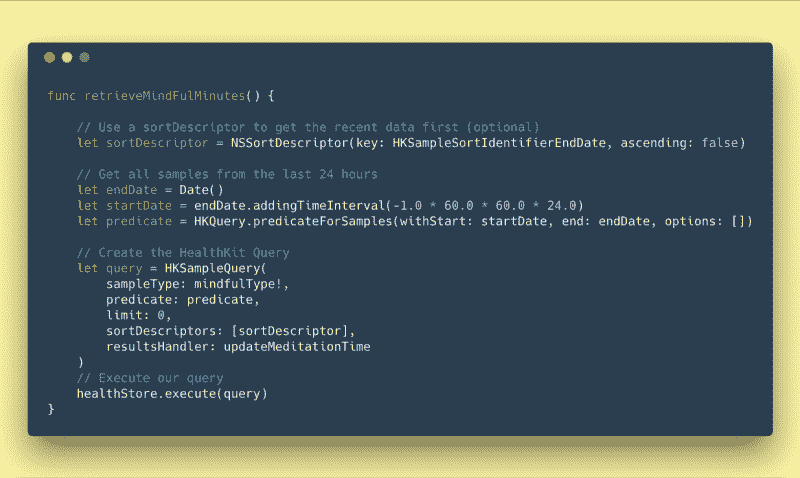
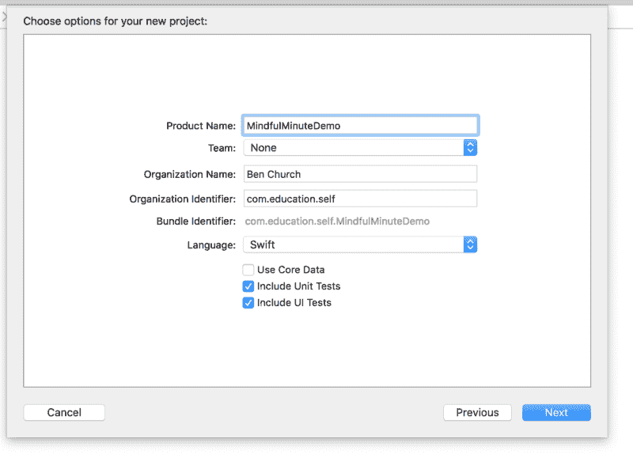
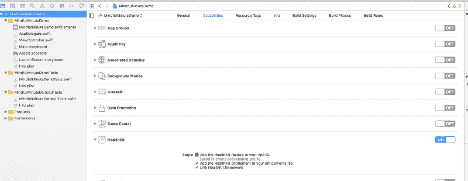
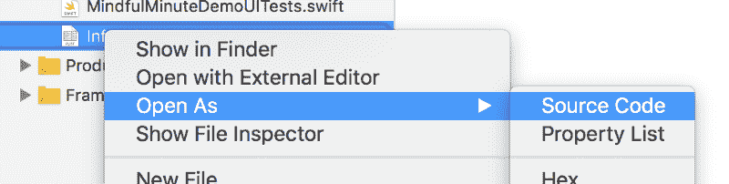
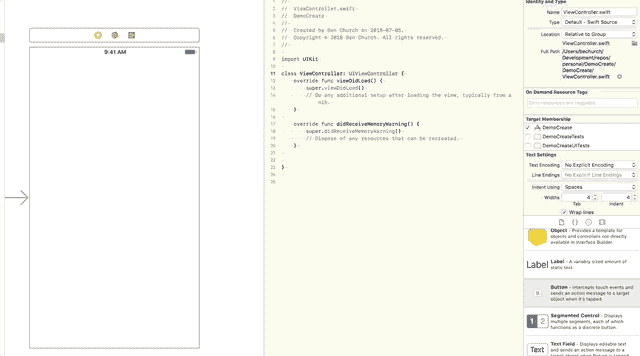
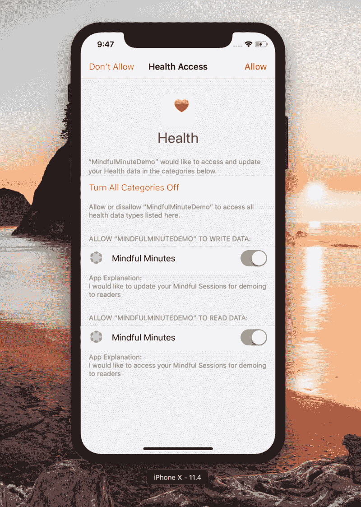
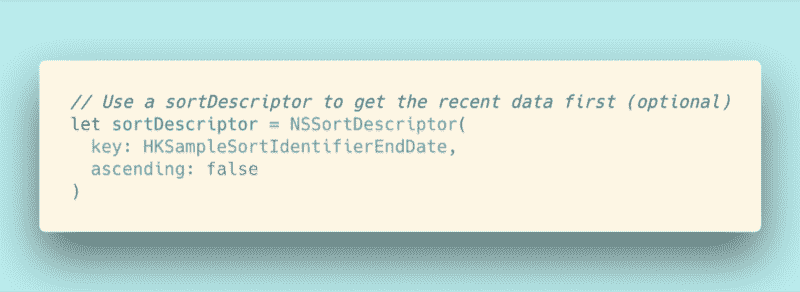
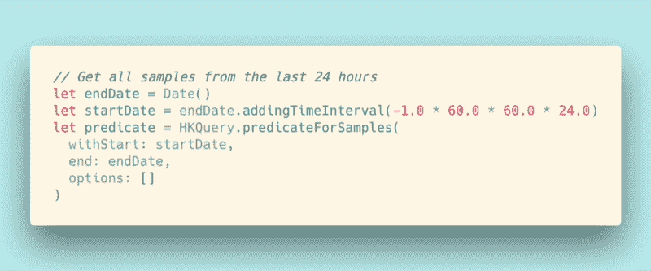
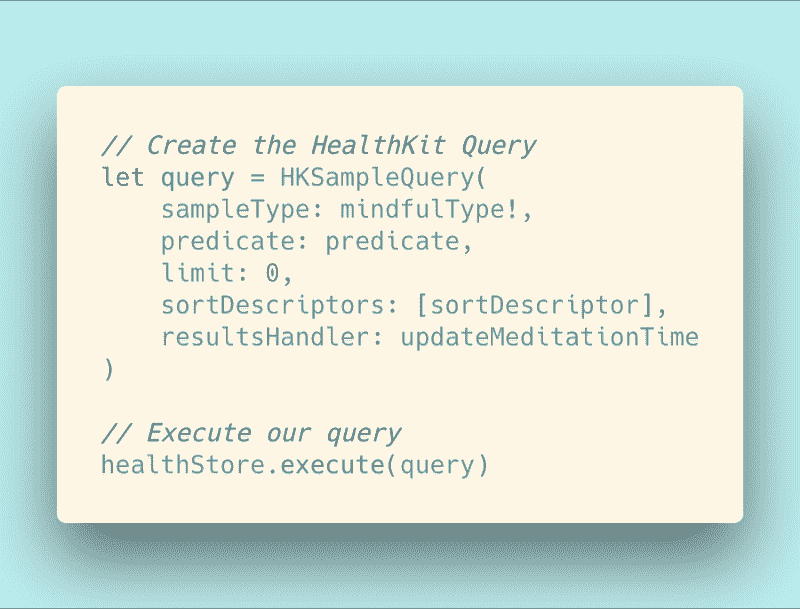

# 如何使用 Swift 从 iOS 的 HealthKit 中读取和写入注意事项

> 原文：<https://www.freecodecamp.org/news/read-write-mindful-minutes-from-healthkit-with-swift-232b65118fe2/>

本·丘奇

# 如何使用 Swift 从 iOS 的 HealthKit 中读取和写入注意事项

我花了时间来弄清楚如何从 HealthKit 中读取和写入，这样您就不必这么做了！



Let me show you what Apple makes hard to find ?

我绝对喜欢苹果的 iOS SDK 所走的路线。([他们的硬件没那么多](https://twitter.com/bnchrch/status/995519114318725120))。苹果公司[对安全的关注](https://www.theguardian.com/technology/2016/jun/15/apple-fbi-file-encryption-wwdc)使其成为一家可以信赖你的敏感信息的可靠公司。这使得 iPhones 作为最适合存储医疗数据的设备取得了进展。因此，它们也是制作与用户敏感个人信息交互的软件的最佳设备。

考虑到这一点，我认为了解如何读写苹果的 HealthKit 是至关重要的，这样我们作为开发者就可以利用苹果给自己设置的位置。所以今天的教程将集中在从苹果健康工具包中读取和写入正念时间**。**

本教程结束时，您将学会如何:

*   设置基本的 iOS 应用程序
*   请求从 HealthKit 读取和写入数据的权限
*   从 HealthKit 中读取和查询数据
*   将数据写回 HealthKit

好了，让我们开始设置 XCode 项目。？

### 设置骨架

每个伟大的项目都从同一个屏幕开始(如果你只是在寻找代码，那么你可以跳过这一部分)。

#### 1.创建新项目

让我们通过在 XCode 中创建一个新的**单视图应用**项目来开始。


Start by going to File > New `> P`roject



You should be able to leave this all the same with the exception of my name.

#### 2.包括健康工具包

一旦我们创建了项目，我们需要将`HealthKit`与我们的应用程序捆绑在一起:



Include HealthKit into our App

并更新`info.plist`文件，以包含当我们请求用户允许访问他们的数据时，用户将会看到的内容。



You need to edit the source code of this file.

将以下`xml`添加到`info.plist`文件中:

#### 3.创建基本用户界面

为了完成设置，我们需要创建一个简单的 UI，允许我们查看从`HealthKit`中读取的数据，并提供一个动作，允许我们触发对`HealthKit`的写操作。

通过打开`storyboard`开始:

1.  添加一个标签，并将其连接到名为`mindfulMinuteLabel`的`ViewController.swift`文件
2.  添加一个按钮并将其连接到名为`addMinuteAct`的`ViewController.swift`文件中的`Action`



Creating our UI

### 给它注入一些生命…

现在我们已经把基础设施放好了，是时候写逻辑了，它将完成我们一直在谈论的所有与`HealthKit`的接口。

#### 1.请求许可

每一个`HealthKit`应用程序都需要明确地请求用户允许它需要做的每一种读写操作。为了实现这一点，我们想在`viewDidLoad`上请求读取正念会话的许可和写入正念会话的许可。

现在，当应用程序运行时，您应该会看到下面的屏幕提示。

> *如果你现在正在运行这个，你会想要注释掉`self.retrieveMindfulMinutes()`*



Our Permission Screen

#### 2.阅读注意事项

到目前为止，这非常简单:创建 UI，请求许可。接下来我们将开始阅读 HealthKit。虽然苹果给了我们一个强大的用户界面，但它不一定是直观的。所以我会先向你们展示代码，然后再解释。

我们执行来检索我们的正念会话的查询可以分成四个部分:

**1。按结束日期排序**



Get the most recent Sessions

这段代码的第一部分是可选的，但是了解它很有用。我们所做的是让查询给我们一个按结束时间排序的注意会话列表，最近的会话排在最前面。

**2。使用谓词来定义查询**



Look for all sessions in the last 24 hours

我们代码的下一部分处理“查询”的实际细节:我们在寻找什么样的数据子集。在我们的案例中，我们需要过去 24 小时的所有样本。

**3。撰写并运行您的查询**



Run it!

最后，我们希望将 HealthKit 中的`sortDescriptor`、`predicate`和`sampleType`与处理查询返回的任何内容的函数(`resultsHandler`)组合在一起。在这一切组成一个`HKSampleQuery`之后，剩下的唯一步骤就是执行它！

**4。汇总会话数据并更新 UI**

在上一节定义为`resultsHandler`的函数中，我们希望:

1.  获得每次正念会话的总时间
2.  将所有的总时间相加，得到过去 24 小时内注意的分钟总数。
3.  用总数更新我们的标签。

如果您理解 map 和 reduce 的概念，这应该是相对简单的。如果这些对你来说是新的，我建议你花时间去学习它们。它们存在于大多数编程语言中，是对函数式编程奇妙世界的一个很好的介绍。

唯一不清楚的是我们为什么要包装

```
self.meditationMinutesLabel.text = labelText
```

在`DispatchQueue.main.async`里。我们这样做的原因是，我们可以在不阻塞应用程序主线程的情况下更新 UI。这是编译器自身强制执行的约定！

#### 写入数据

在上面，我们讨论了如何从 HealthKit 中读取数据。但是我们如何向它写入数据呢？谢天谢地，这个过程简单多了。下面的代码将:

1.  完成我们在设置过程中添加的`addMinuteAct`功能，从而完成应用程序的其余部分。
2.  从现在开始创建一个 1 分钟的`MindfulSession`
3.  将这个新的`MindfulSession`保存到健康工具包中
4.  更新标签以反映新的总注意分钟数

### 启动它！

完成所有这些并编写代码后，你应该能够在模拟器中启动这个应用程序，接受从你的健康工具包中读取和写入的请求，并开始查看你在过去 24 小时内冥想的频率！


Amazing!

### 包裹

在这个项目开始的时候，我非常兴奋地跳入 HealthKit。我确实看到它被定位为改变我们和其他人与敏感个人信息交互的方式。

然而，我认为，与其他平台相比，苹果使得他们的 API 有点太难通过文档和 XCode 来发现。希望他们将改善这种体验，但在他们这样做之前，学习如何使用 HealthKit 可能是一种拔牙练习。

我希望这篇文章能让你免于磕磕绊绊，并能让你更快地运送你的产品！

> ？‍这是开源的！你可以在 Github 上找到它

> ❤️:我只写编程和远程工作。如果你在推特上关注我，我不会浪费你的时间。