# 如何使用带有 AWS API 网关和 Lambda 的 WebSockets 构建实时应用程序

> 原文：<https://www.freecodecamp.org/news/real-time-applications-using-websockets-with-aws-api-gateway-and-lambda-a5bb493e9452/>

作者:詹妮莎·坦纳库恩

# 如何使用带有 AWS API 网关和 Lambda 的 WebSockets 构建实时应用程序

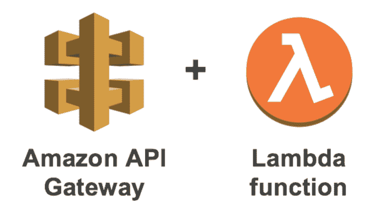

最近，AWS 宣布推出一个广受欢迎的功能:用于 Amazon API Gateway 的 WebSockets。有了 WebSockets，我们能够创建一条双向通信线路，它可以用在许多场景中，比如实时应用程序。这就带来了一个问题:什么是实时应用？所以我们先来回答这个问题。

目前运行的大多数应用程序都使用客户机-服务器体系结构。在客户端-服务器架构中，客户端使用网络通信通过互联网发送请求，然后服务器处理该请求并将响应发送回客户端。

在这里，您可以看到是客户端开始了与服务器的通信。因此，首先，客户端发起通信，服务器响应服务器发送的请求。那么，如果服务器想在客户机没有首先请求响应的情况下就开始通信并推送响应，该怎么办呢？这就是实时应用发挥作用的地方。

实时应用程序是这样的应用程序，其中服务器能够将数据推送到客户端，而无需客户端先请求数据。假设我们有一个聊天应用程序，其中两个聊天客户端可以通过一个服务器进行通信。在这种情况下，如果所有的聊天客户端每秒钟都向服务器请求数据，这是一种浪费。更有效的是，当接收到聊天时，服务器向客户端聊天应用程序发送数据。这种功能可以通过实时应用程序来实现。

亚马逊宣布他们将在 AWS re:Invent 2018 上支持 API Gateway 中的 WebSockets。12 月晚些时候，他们在 API Gateway 中发布了它。因此，现在使用 AWS 基础设施，我们能够使用 API 网关创建实时应用程序。

在这篇文章中，我们将使用 API Gateway WebSockets 创建一个简单的聊天应用程序。在我们开始实现我们的聊天应用程序之前，我们需要理解一些关于实时应用程序和 API 网关的概念。

### WebSocket API 概念

WebSocket API 由一个或多个路由组成。一个*路由选择表达式*用于确定一个特定的入站请求应该使用哪条路由，这将在入站请求中提供。根据入站请求对该表达式进行评估，以产生一个与您的某个路由的 *routeKey* 值相对应的值。例如，如果我们的 JSON 消息包含一个属性调用动作，并且您想要基于这个属性执行不同的动作，那么您的路由选择表达式可能是`${request.body.action}`。

例如:如果您的 JSON 消息看起来像{"action" : "onMessage "，" message" : "Hello everyone"}，那么这个请求将选择 ON message 路由。

默认情况下，WebSocket API 中已经定义了三个路由。除了下面提到的路线，我们可以根据需要添加自定义路线。

*   **$default** —当路由选择表达式产生的值与 API 路由中的任何其他路由关键字都不匹配时使用。例如，这可以用于实现通用的错误处理机制。
*   **$connect** —当客户端第一次连接到您的 WebSocket API 时，使用关联的路由。
*   **$disconnect** —当客户端从您的 API 断开连接时，使用关联的路由。

一旦设备通过 WebSocket API 成功连接，该设备将被分配一个唯一的连接 id。如果连接存在，此连接 id 将在整个生命周期内保持不变。要将消息发送回设备，我们需要使用下面的 POST 请求和连接 id。

```
POST https://{api-id}.execute-api.us-east 1.amazonaws.com/{stage}/@connections/{connection_id}
```

### 实现聊天应用程序

在学习了 WebSocket API 的基本概念之后，让我们看看如何使用 WebSocket API 创建一个实时应用程序。在这篇文章中，我们将使用 WebSocket API、AWS LAmbda 和 DynamoDB 实现一个简单的聊天应用程序。下图显示了我们的实时应用程序的架构。

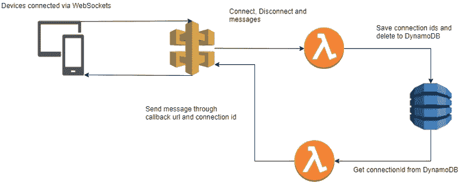

在我们的应用程序中，设备将连接到 API 网关。当设备连接时，lambda 函数会将连接 id 保存在 DynamoDB 表中。在我们希望将消息发送回设备的情况下，另一个 lambda 函数将检索连接 id，并使用回调 URL 将数据发送回设备。

#### 正在创建 WebSocket API

为了创建 WebSocket API，我们需要首先使用控制台转到 Amazon API 网关服务。在那里选择创建新的 API。点击 WebSocket 创建一个 WebSocket API，给出一个 API 名称和我们的路由选择表达式。在我们的例子中，添加$request.body.action 作为我们的选择表达式，并点击 Create API。

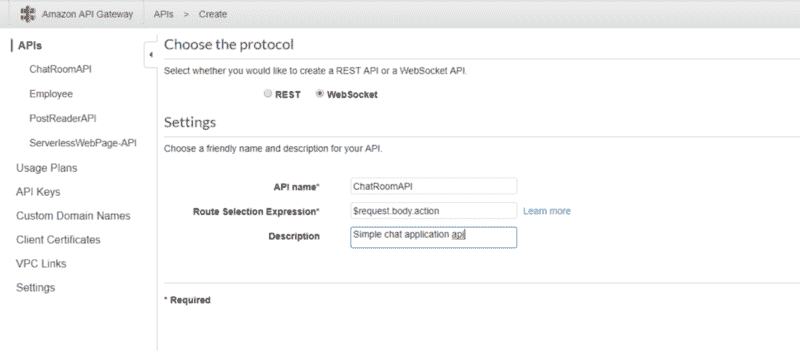

创建 API 后，我们将被重定向到 routes 页面。这里我们可以看到已经预定义的三个路由:$connect、$disconnect 和$default。我们还将创建一个自定义的 route $onMessage。在我们的架构中，$connect 和$disconnect 路由实现以下任务:

*   $connect —当调用此路由时，Lambda 函数会将所连接设备的连接 id 添加到 DynamoDB。
*   $disconnect —当调用此路由时，Lambda 函数将从 DynamoDB 中删除已断开设备的连接 id。
*   onMessage —当调用此路由时，消息正文将被发送到当时连接的所有设备。

在根据上述内容添加路线之前，我们需要完成四项任务:

*   创建一个 DynamoDB 表
*   创建连接 lambda 函数
*   创建断开 lambda 函数
*   创建 onMessage lambda 函数

首先，让我们创建 DynamoDB 表。转到 DynamoDB 服务并创建一个名为 Chat 的新表。将主键添加为“connectionid”。

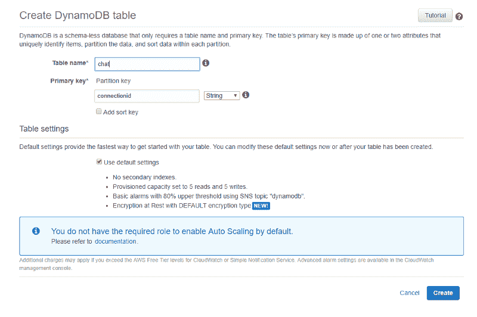

接下来，让我们创建连接 Lambda 函数。要创建 Lambda 函数，请转到 Lambda 服务并单击创建函数。从头开始选择 Author，并将名称命名为“ChatRoomConnectFunction”和一个具有必要权限的角色。(角色应该有权限从 DynamoDB 中获取、放置和删除项目，在 API gateway 中调用 API 调用。)

在 lambda 函数的代码中添加以下代码。这段代码将把连接设备的连接 id 添加到我们创建的 DynamoDB 表中。

```
exports.handler = (event, context, callback) => {    const connectionId = event.requestContext.connectionId;    addConnectionId(connectionId).then(() => {    callback(null, {        statusCode: 200,        })    });}
```

```
function addConnectionId(connectionId) {    return ddb.put({        TableName: 'Chat',        Item: {            connectionid : connectionId        },    }).promise();}
```

接下来，让我们也创建断开 lambda 函数。使用相同的步骤创建一个新的 lambda 函数，名为
‘chattroomdonnectfunction’。将以下代码添加到函数中。当设备断开连接时，这段代码将从 DynamoDB 表中删除连接 id。

```
const AWS = require('aws-sdk');const ddb = new AWS.DynamoDB.DocumentClient();
```

```
exports.handler = (event, context, callback) => {    const connectionId = event.requestContext.connectionId;    addConnectionId(connectionId).then(() => {    callback(null, {        statusCode: 200,        })    });}
```

```
function addConnectionId(connectionId) {    return ddb.delete({        TableName: 'Chat',        Key: {            connectionid : connectionId,        },    }).promise();}
```

现在我们已经创建了 DynamoDB 表和两个 lambda 函数。在创建第三个 lambda 函数之前，让我们再次回到 API Gateway，并使用我们创建的 lambda 函数配置路由。首先，点击$connect route。作为集成类型，选择 Lambda 函数，然后选择 ChatRoomConnectionFunction。

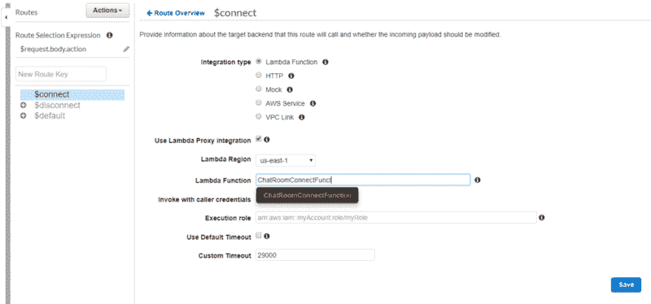

我们也可以在$disconnect route 上做同样的事情，其中 lambda 函数将是 ChatRoomDisconnectionFunction:

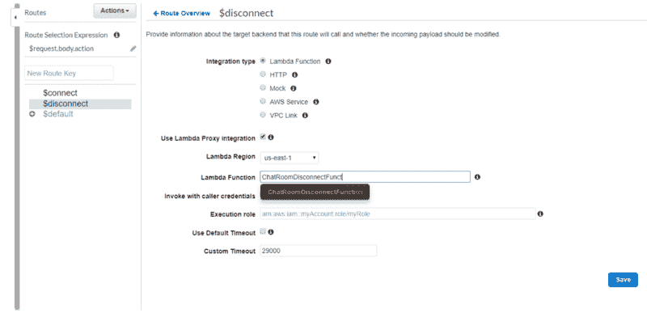

现在我们已经配置了$connect 和$disconnect 路由，我们可以实际测试我们的 WebSocket API 是否工作。为此，我们必须首先部署 API。在 Actions 按钮中，单击 Deploy API 进行部署。给出一个阶段名，比如 Test，因为我们只是为了测试而部署 API。

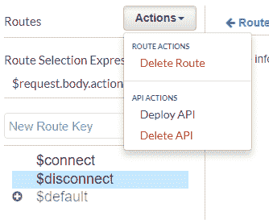

部署之后，我们将看到两个 URL。第一个 URL 称为 WebSocket URL，第二个称为连接 URL。

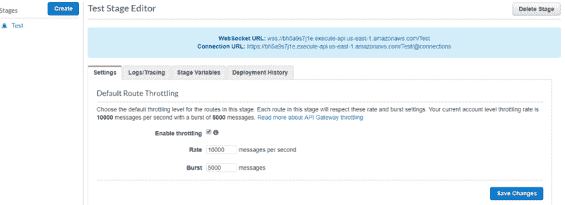

WebSocket URL 是设备通过 WebSockets 连接到我们的 API 所使用的 URL。第二个 URL 是连接 URL，我们将使用它回叫所连接的设备。因为我们还没有配置回调到设备，所以让我们首先只测试$connect 和$disconnect 路由。

要通过 WebSockets 调用，我们可以使用 wscat 工具。要安装它，我们只需要在命令行中发出`npm install -g wscat`命令。安装后，我们可以使用 wscat 命令来使用该工具。要连接到我们的 WebSocket API，发出以下命令。确保用提供给您的正确 URL 替换 WebSocket URL。

```
wscat -c wss://bh5a9s7j1e.execute-api.us-east-1.amazonaws.com/Test
```

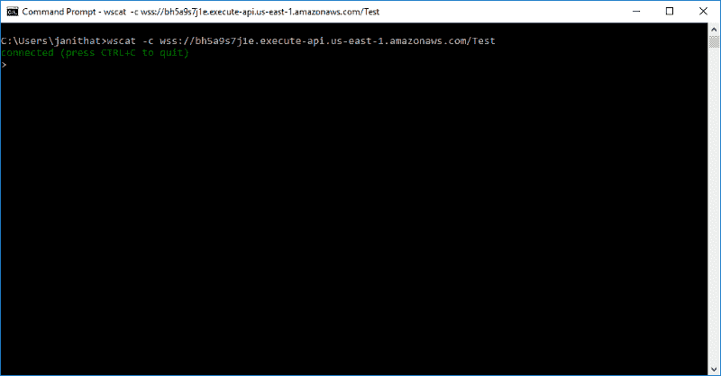

当连接成功时，终端上将显示一条已连接的消息。为了检查我们的 lambda 函数是否工作，我们可以转到 DynamoDB 并在表中查找所连接终端的连接 id。

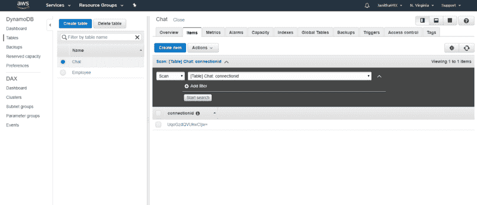

如上所述，我们也可以通过按 CTRL + C 来测试断开，这将模拟一个断开。

现在我们已经测试了两条路由，让我们来看看 Message 上的自定义路由。这个自定义路由将从设备获取一条消息，并将该消息发送给所有连接到 WebSocket API 的设备。为了实现这一点，我们需要另一个 lambda 函数来查询我们的 DynamoDB 表，获取所有的连接 id，并向它们发送消息。

让我们首先以创建其他两个 lambda 函数的相同方式创建 lambda 函数。将 lambda 函数命名为 ChatRoomOnMessageFunction，并将以下代码复制到函数代码中。

```
const AWS = require('aws-sdk');const ddb = new AWS.DynamoDB.DocumentClient();require('./patch.js');
```

```
let send = undefined;function init(event) {  console.log(event)    const apigwManagementApi = new AWS.ApiGatewayManagementApi({    apiVersion: '2018-11-29',    endpoint: event.requestContext.domainName + '/' + event.requestContext.stage  });        send = async (connectionId, data) => {  await apigwManagementApi.postToConnection({ ConnectionId: connectionId, Data: `Echo: ${data}` }).promise();  }}
```

```
exports.handler =  (event, context, callback) => {  init(event);  let message = JSON.parse(event.body).message    getConnections().then((data) => {        console.log(data.Items);        data.Items.forEach(function(connection) {           console.log("Connection " +connection.connectionid)           send(connection.connectionid, message);        });    });        return {}};
```

```
function getConnections(){    return ddb.scan({        TableName: 'Chat',    }).promise();}
```

上面的代码将扫描 DynamoDB 以获取表中所有可用的记录。对于每条记录，它将使用 API 中提供给我们的连接 URL 发布一条消息。在代码中，我们期望设备将在名为“message”的属性中发送消息，lambda 函数将解析该属性并发送给其他设备。

由于 WebSockets API 仍然是新的，有些事情我们需要手动完成。创建一个名为 patch.js 的新文件，并在其中添加以下代码。

```
require('aws-sdk/lib/node_loader');var AWS = require('aws-sdk/lib/core');var Service = AWS.Service;var apiLoader = AWS.apiLoader;
```

```
apiLoader.services['apigatewaymanagementapi'] = {};AWS.ApiGatewayManagementApi = Service.defineService('apigatewaymanagementapi', ['2018-11-29']);Object.defineProperty(apiLoader.services['apigatewaymanagementapi'], '2018-11-29', {  get: function get() {    var model = {      "metadata": {        "apiVersion": "2018-11-29",        "endpointPrefix": "execute-api",        "signingName": "execute-api",        "serviceFullName": "AmazonApiGatewayManagementApi",        "serviceId": "ApiGatewayManagementApi",        "protocol": "rest-json",        "jsonVersion": "1.1",        "uid": "apigatewaymanagementapi-2018-11-29",        "signatureVersion": "v4"      },      "operations": {        "PostToConnection": {          "http": {            "requestUri": "/@connections/{connectionId}",            "responseCode": 200          },          "input": {            "type": "structure",            "members": {              "Data": {                "type": "blob"              },              "ConnectionId": {                "location": "uri",                "locationName": "connectionId"              }            },            "required": [              "ConnectionId",              "Data"            ],            "payload": "Data"          }        }      },      "shapes": {}    }    model.paginators = {      "pagination": {}    }    return model;  },  enumerable: true,  configurable: true});
```

```
module.exports = AWS.ApiGatewayManagementApi;
```

以上代码是我从这篇[文章](https://hackernoon.com/websockets-api-gateway-9d4aca493d39)里摘出来的。这段代码的功能是为我们的 API 自动创建回调 URL 并发送 POST 请求。

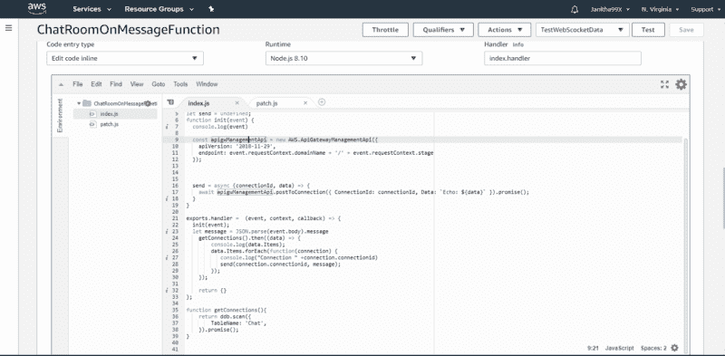

现在我们已经创建了 lambda 函数，我们可以继续在 API Gateway 中创建自定义路由。在新的路由关键字中，添加“OnMessage”作为路由，并添加自定义路由。由于已经为其他路由完成了配置，所以将我们的 lambda 函数添加到这个自定义路由中，并部署 API。

现在我们已经完成了我们的 WebSocket API，我们可以全面测试应用程序了。为了测试发送消息是否适用于多种设备，我们可以使用多个终端打开并连接。

连接后，发出以下 JSON 来发送消息:

```
{"action" : "onMessage" , "message" : "Hello everyone"}
```

这里，动作是我们定义的自定义路由，消息是需要发送到其他设备的数据。

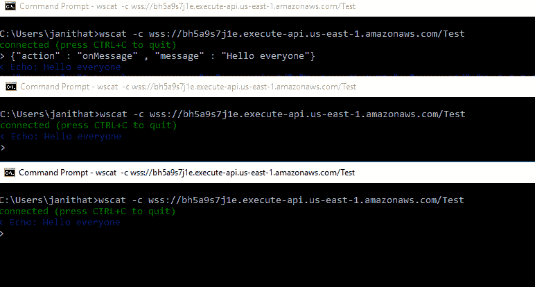

这就是我们使用 AWS WebSocket API 的简单聊天应用程序。我们实际上并没有配置$defalut 路由，该路由在每次找不到路由的情况下都会被调用。我将把这条路线的实施留给你。谢谢你，下次见。:)