# 如何在虚幻引擎 4 中构建实时动态封面系统

> 原文：<https://www.freecodecamp.org/news/real-time-dynamic-cover-system-in-unreal-engine-4-eddb554eaefb/>

大卫·纳萨德基

# 如何在虚幻引擎 4 中构建实时动态封面系统

### 介绍

掩护系统使人工智能单位避免直接开火，躲在地图上的各种物体后面。使用掩护系统可以提高游戏的真实性，并为任何类型的游戏引入重要的战术元素。这种系统由两个不同的模块组成:覆盖生成和覆盖发现。掩护生成通常是静态的，在游戏开始前完成，而寻找掩护在游戏过程中实时发生。

在本文中，我通过描述如何在 Unreal Engine 4 中从头开始构建完全动态的实时封面生成模块，并提供封面查找模块的实现，来挑战封面系统的静态特性。

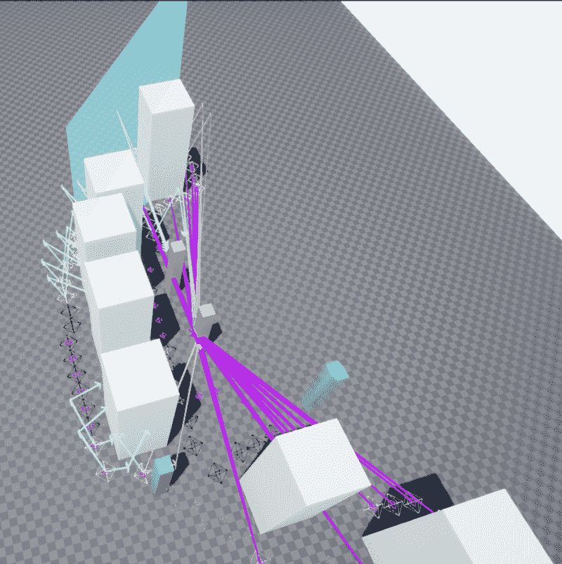

创建一个强大的封面系统一开始可能会令人望而生畏，但是一旦你意识到这只是一套简单的技术粘在一起，手头的任务就不会那么令人生畏了。

无论您是在制作下一代即时战略(RTS)游戏，还是想在第一人称射击游戏(FPS)中使用它，我希望本文中的信息对您有所帮助。我建议下载演示项目，并检查它是如何工作的。

该项目包括上面讨论的所有技术的全功能实现，并附有注释良好的源代码。

[**下载演示项目和源代码。**](https://horugame.com/real-time-dynamic-cover-system-for-unreal-engine-4/)

### 工具和先决条件

本教程使用虚幻引擎 4 (UE4)版本 4.18，但是它也应该与引擎的旧版本一起工作。示例项目和源代码是用 C++编写的。要理解示例项目和源代码，您需要对 UE4、C++和 UE4 的蓝图有一个基本的了解。

### 设计

设计覆盖系统时，您将面临以下三个最重要的挑战:

*   数据生成
*   数据持久性
*   数据使用

由于本文的重点是创建一个实时的动态 cover 系统，在这个系统中，cover 可能在运行时变得可用或完全消失，所以对这三者应用一种优化的方法是非常重要的。

我介绍了两种数据生成方法: **navmesh 边缘行走**和 **3D 物体扫描**。

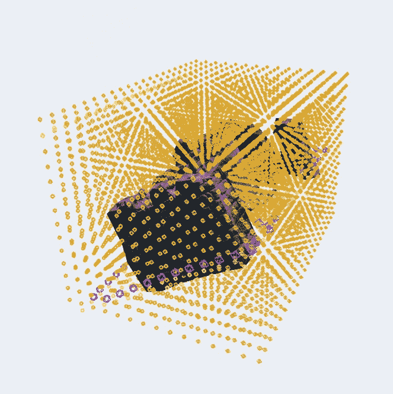

3D object scanning

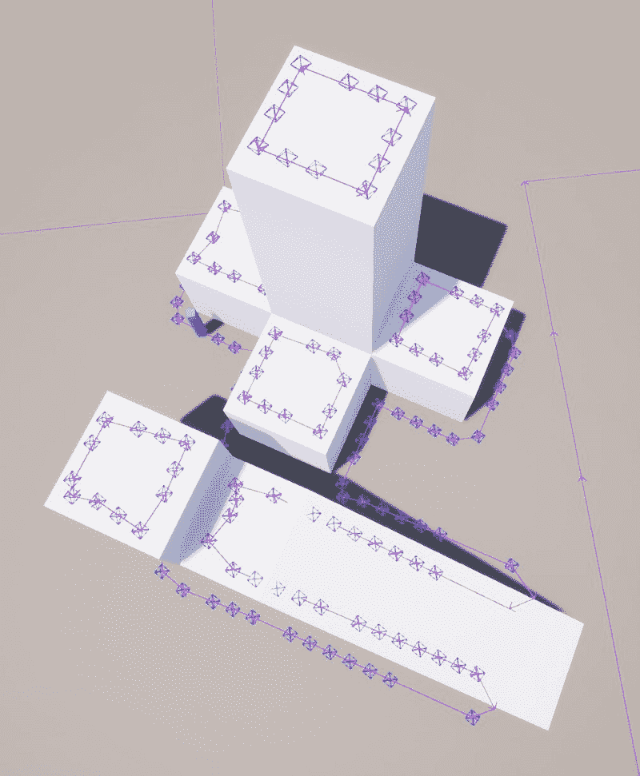

Navmesh edge-walking

如果你的封面数据是同步生成的，它会对你的游戏性能造成明显的阻碍，导致游戏延迟。我演示了如何利用虚幻引擎出色的**多线程 API**来并行生成封面数据，充分利用现代游戏硬件中常见的多核处理。

同样，如果对封面数据的访问太慢，你的游戏速度会大大降低，在封面查询上消耗大量的 CPU 和/或 GPU 周期。为了避免这种情况，最好使用一种用于实时并发查找空间数据的数据结构:**八叉树**。适当地使用八叉树还允许**存储定制的封面数据**，例如封面材料(石头对干草)、高度、健康等等，并且可以快速有效地访问。

数据使用优化-当您的单位主动决定实时使用哪个覆盖点时-最大限度地减少光线投射的数量，并确保空间查找工具(八叉树)的可用性以及对直接提取请求(数组或地图)的支持。

为了预测一个单位如何走出掩体开火，有必要绘制出它的**窥视或倾斜能力。**坦克无法从隐蔽处偷看——步兵可以。我发现在不使用太多光线投射的情况下，最好的方法是在单位上定义“倾斜偏移”。这些只是简单的浮动，在 cover 的点击测试中被添加到单元的位置。

最后一个功能是**实时动态更新**——每当游戏中产生一个新对象，我们都会通过代理使用虚幻的事件系统在其周围(和内部)生成覆盖点。这确保了我们不会在 Tick 上浪费资源，如果不小心的话，Tick 会大大降低游戏速度。我们**挂钩到 Recast 的 navmesh 瓦片更新事件**，只在必要时更新相应瓦片中的覆盖点。

尽管有这么多技术术语，它实际上非常简单:几个琐碎的 for 循环和 UE4 文档中缺失的几页。所以让我们开始吧！

### 生成数据——两种途径

生成封面数据有多种策略，我将介绍两种最重要的策略:首先，一种类似于 3D 扫描的技术，然后是 navmesh 边缘行走方法。

3D 对象扫描依赖于在对象周围创建的 3D 网格。通常有 3 个主要的 for 循环来完成大部分工作，每个轴一个。你迭代网格上相距恒定距离的点，并检查你是否用光线投射击中任何东西。

**三维物体扫描:**

*   比边缘行走更均匀地分布覆盖点
*   支持与 navmesh 不兼容的对象，但提供覆盖，例如“力场”
*   出错的可能性极小
*   较慢(因为网格点的数量太多)
*   不擅长处理风景

基于 navmesh 的方法主要依赖于 navmesh 数据，并不处理对象本身:如果地图上的一个点没有被任何 navmesh 多边形覆盖，那么这意味着它被足够大的东西占据以提供覆盖。

**Navmesh 边缘行走:**

*   要快得多
*   轻松应对崎岖的地形
*   无法处理力场之类的东西
*   更容易出错:图块边界、不匹配的点
*   没有均匀地分布覆盖点

随着我们的继续，我会更详细地介绍这些，所以让我们深入 3D 对象扫描的本质吧！

### 基于对象的覆盖点生成

我们不是扫描 navmesh 来寻找漏洞，而是扫描对象本身。把它想象成在 3D 中扫描一个物体:你沿着 X、Y、Z 轴将其切片，将切片分成网格，并使用光线投射来确定物体的周长(或 3D 周长)与地面的交点。这也适用于不规则形状的物体，如 C 形、环形、城堡——你能想到的。

3D 扫描网格如下所示:

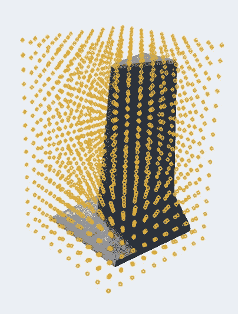

*Orange markers represent 3D grid points in and around an object.*

这基本上是通过 3 个非常简单的 for 循环来完成的，这些 for 循环只是将演员的边界框划分为一个 3D 网格。但是网格上有很多点，其中一些甚至不靠近我们的对象，所以我们必须把它们过滤掉。

你可能会问，为什么不使用 2D 网格呢？因为两件事:

1.  多层物体(想想有多层的房子)
2.  倾斜地面上的旋转对象

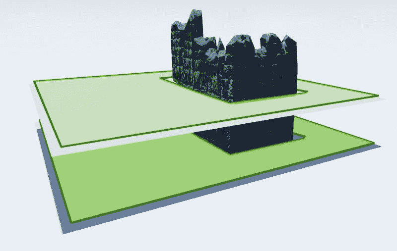

A multi-story navmesh.

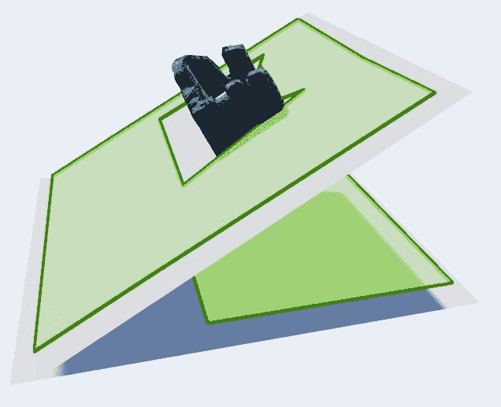

*Rotated object on slanted ground.*

为了过滤掉无效的网格点，我们从每个点向下沿-Z 方向投射一条射线，以确定它是否足够接近最近的地平面。如果是，那么我们将它标记为有效，并继续下一个，最终从每个点投射光线。

幸运的是，光线投射非常便宜，所以我们不必担心单个对象——只有当我们在运行时有大量对象时，我们才可能开始出现问题，但当我们到达那里时，我们会越过那座桥。

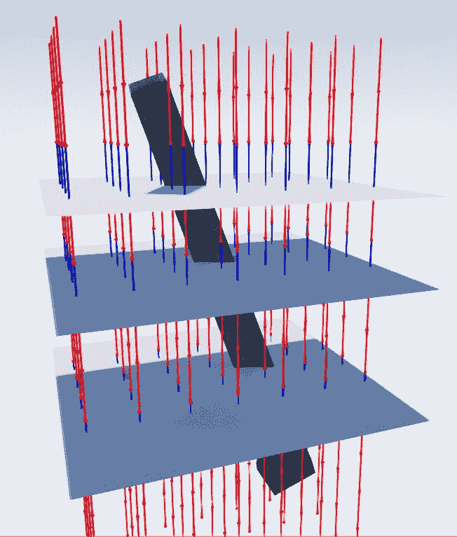

*Finding ground planes with raycasts.*

*蓝色:比下方网格点*
更接近地面*红色:比下方网格点*更远离地面

因为我们只保留蓝色的，所以我们在下一步中要担心的点要少得多:检查最小地面间隙和最小覆盖高度。

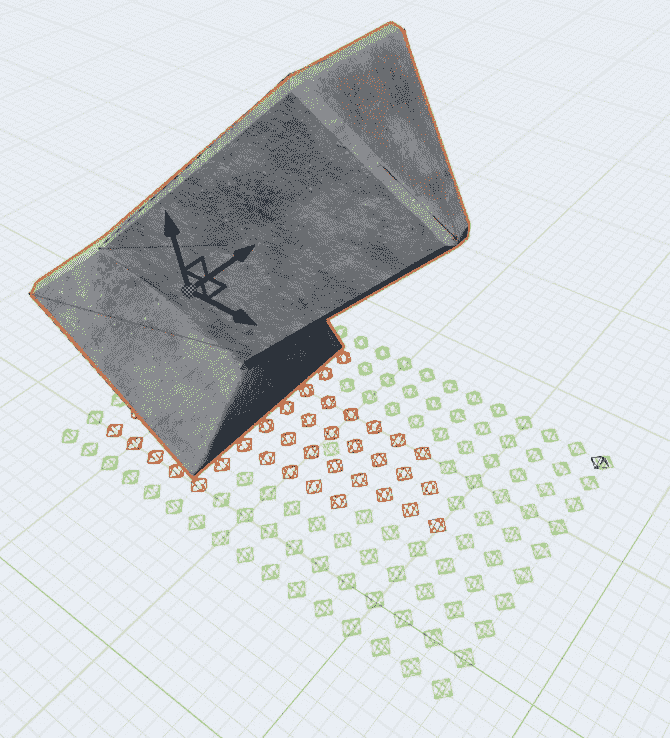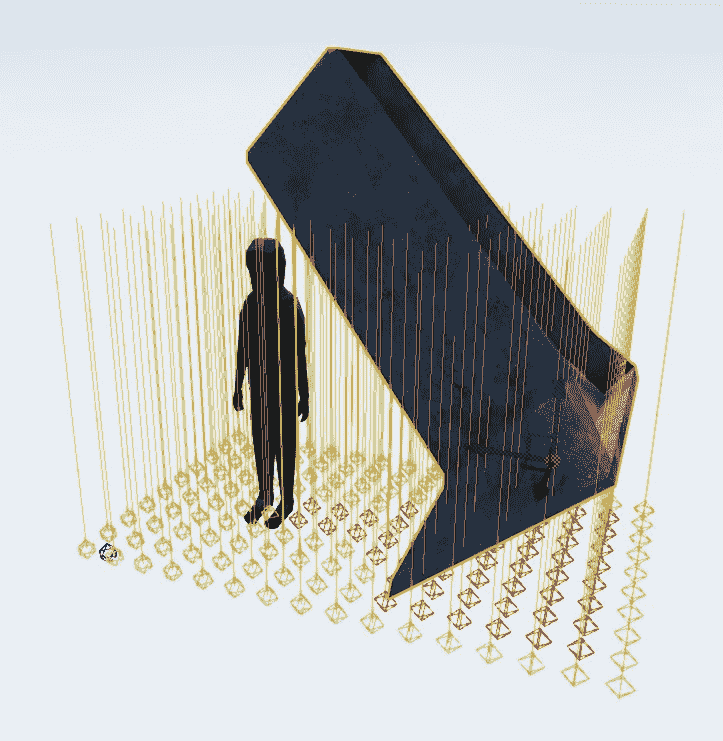

*Checking for minimum ground gap.*

*红色:太靠近物体*
*绿色:离物体足够远，最小单位适合放在*下

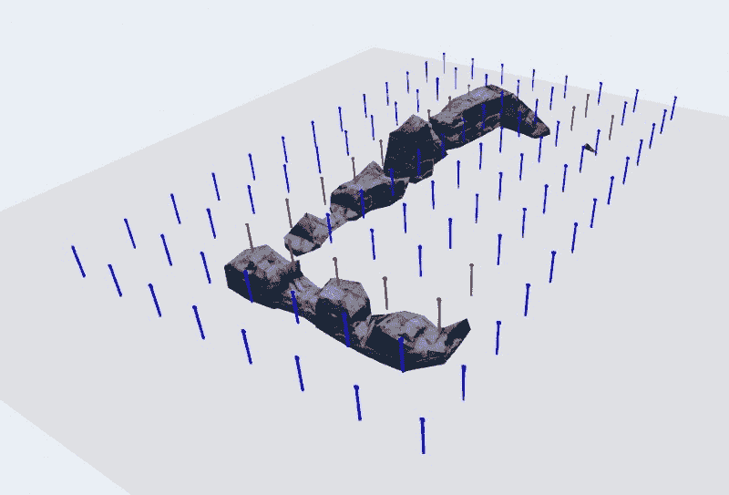

*Checking for minimum cover height.*

*红色:太矮*
*蓝色:够高或空着*

这是从顶部正交视图看起来的样子:

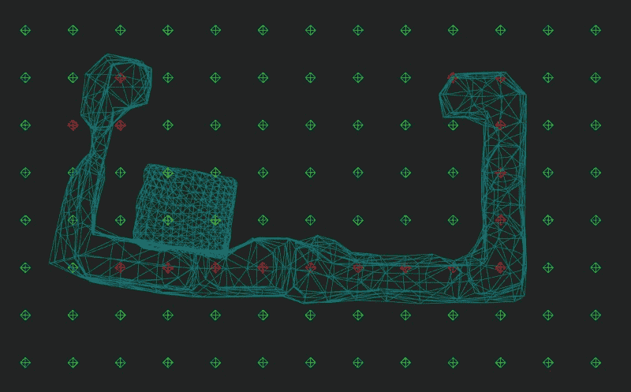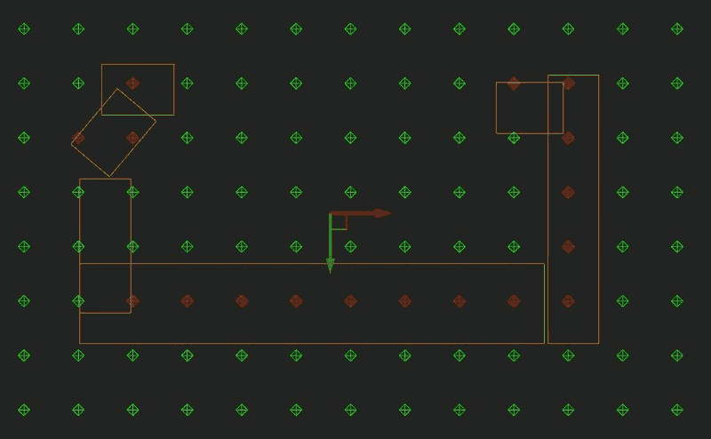

*Red: blocking grid points; Green: free grid points*

我们最终要寻找的是离导航网格上的红色标记最近的点。这些由下面白色标记的子集表示:

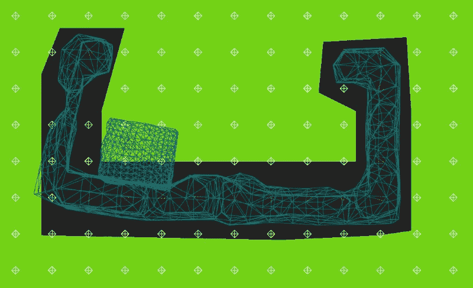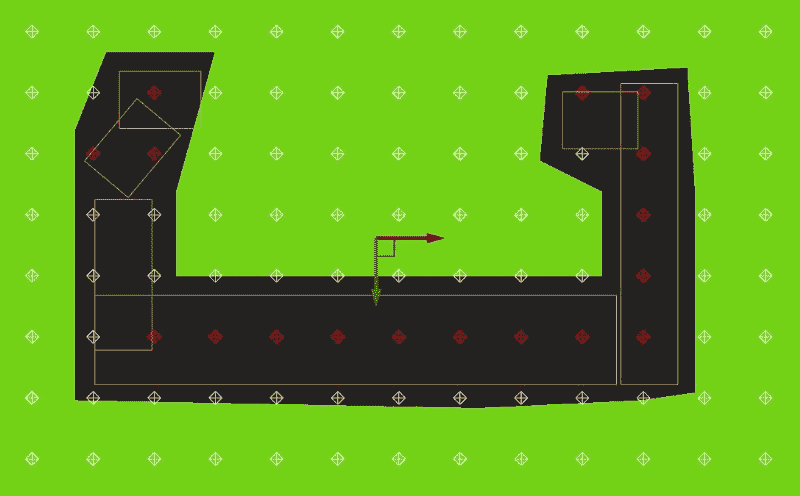

*With the navmesh overlaid on top.*

最终的覆盖点由下面的紫色标记表示。我们迭代红色标记(见上图),选择那些最接近 navmesh 上红色标记的白色标记:

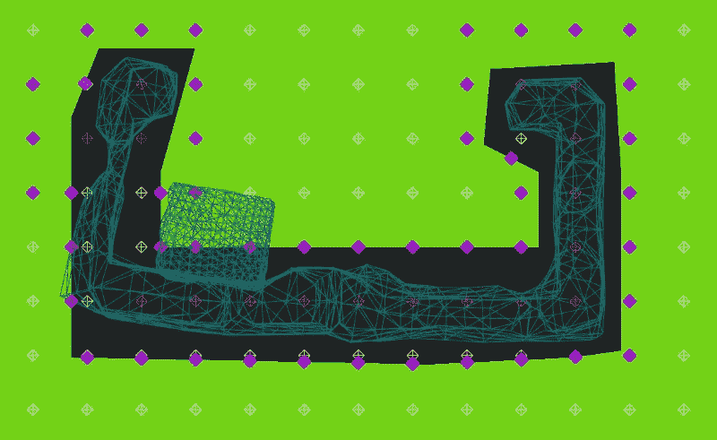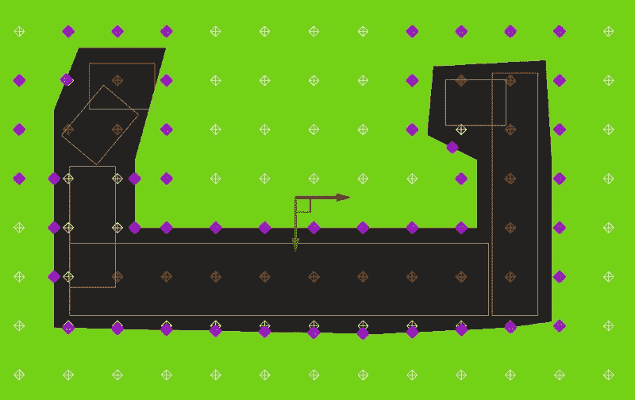

*Purple: final cover points*

我们的最终结果看起来像这样:

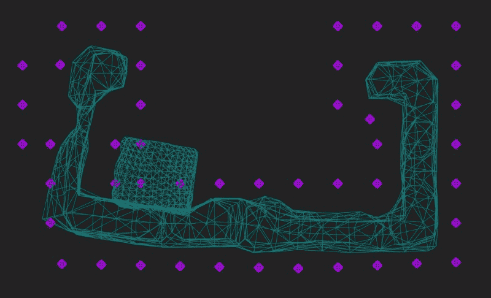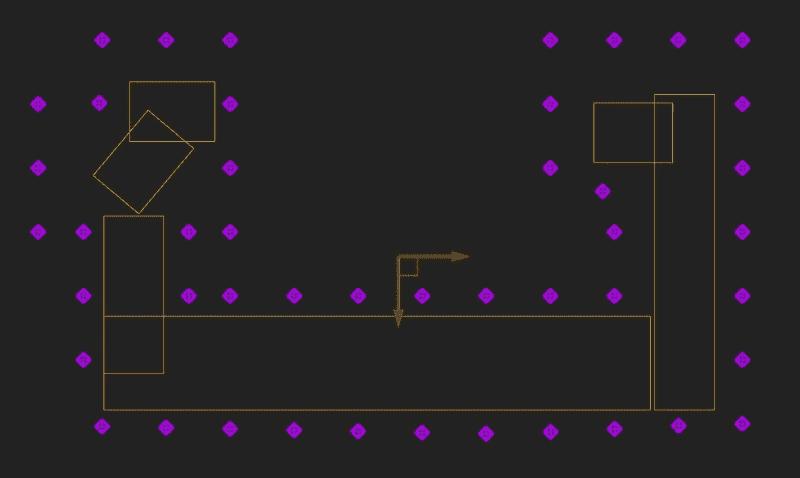

*Purple: final cover points*

这是倾斜的 navmesh 上的缩放、旋转、多故事演员的样子:

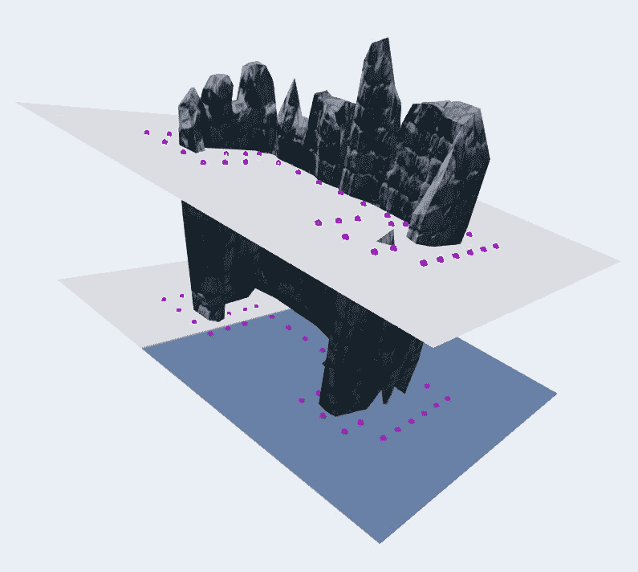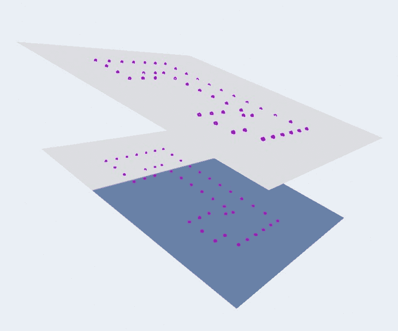

*Note the level of conformance to the collision boxes — the navmesh approach is less conformant*

正如您从上面的图像中看到的，这种技术同时支持封面对象和地平面上的旋转和缩放。它适用于任何类型的几何图形，你不必再让关卡设计师手动在场景中放置一个标记。

由于这种自动点生成非常适合多线程执行，我们将把异步任务中的所有逻辑放到线程池中，并指示 UE4 将这些逻辑放到线程池中。最棒的是，这一切都是由引擎支持的！

为了让它与任何类型的 actor 一起工作，我们创建了一个定制的 *UActorComponent* ，并从那里产生我们的 3D 扫描任务。姑且称之为 *UCoverGeneratorComponent* 。**添加这个组件到任何力场类型的演员**。不要将它用于常规对象——我接下来概述的基于 navmesh 的生成器是我们完美的通用解决方案。

### Navmesh 边缘行走

该是重型武器的时候了，发电机能满足你的掩护系统 90%的需求。所以事不宜迟，让我们开始走边吧！

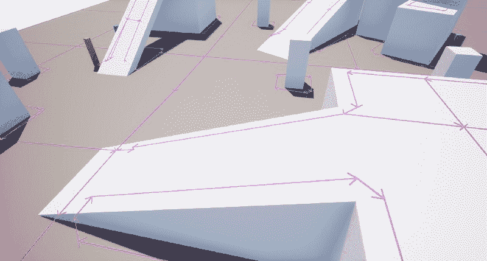

通过边走生成覆盖实际上是一个非常简单的过程:取两个顶点，在两个方向上投射一条垂直于结果边的射线，看看射线是否碰到了什么东西，如果是，那么我们就找到了覆盖。

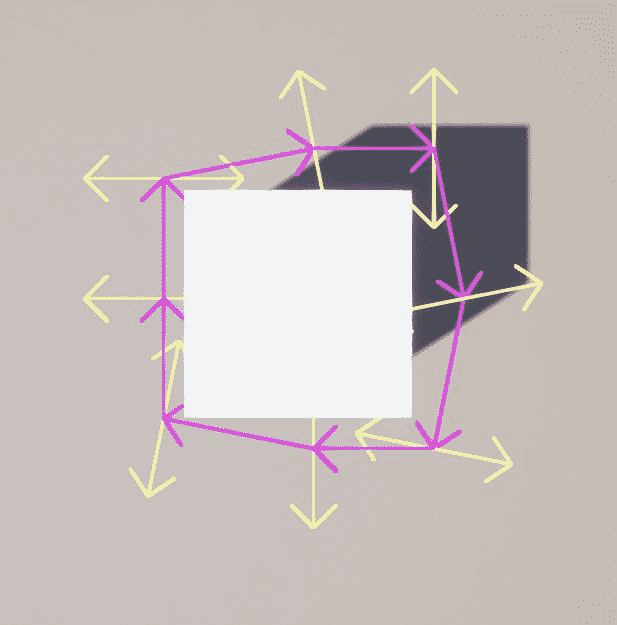

*Perpendicular rays (yellow)*

通过引入壁架或悬崖壁检测，我们可以在射线计数方面进一步复杂化事情:

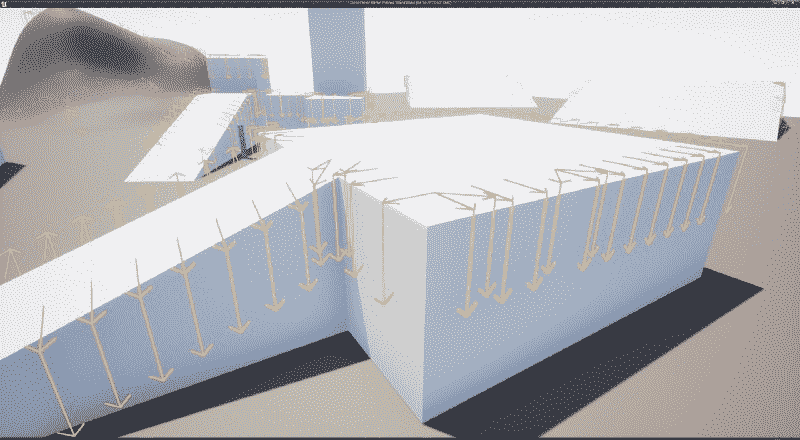

*Ledge detection*

然而，这至少为每个 navmesh 顶点增加了 4 条光线，所以现在我们总共有 6 条:2 条用于垂直地面光线，4 条用于边缘检测。我们甚至可以更进一步，对这些漂亮的悬崖壁实施坡度容差，以便正确扫描地形等崎岖地形:

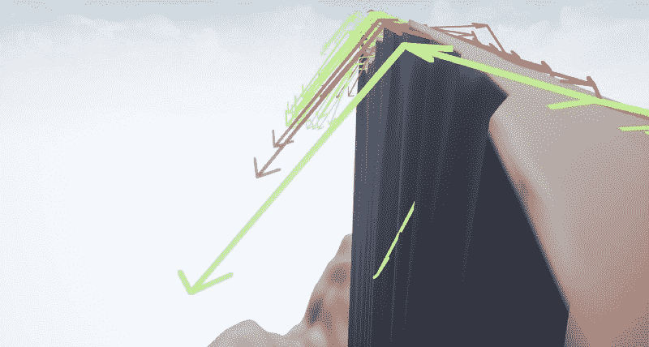

*Ledge tolerance in action.*

但是每边至少多了一条射线，在最坏的情况下总共有 8 条射线。您可以决定这个功能是否值得您的项目付出性能成本——我倾向于让它开着，因为大多数生成都是完全异步发生的，即使在 cover 系统忙于检查我放下的所有花哨的壁架时，游戏也可以开始。

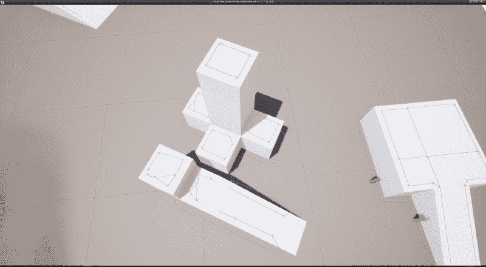

*Step 1 — Edge detection*

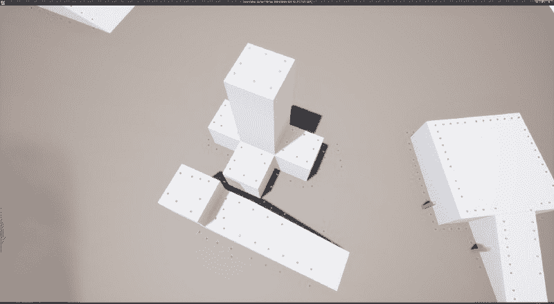

*Step 2 — Point generation*

### 速度

走几条边比将一个相对较小的对象分割成网格点要便宜得多。想象一下，大部分网格点至少花费你一次光线投射，仅仅在一个简单的网格上就可能有成千上万个网格点。边界框越大，3D 扫描的成本就越高。

另一方面，即使一个复杂的对象上的 navmesh 多边形的数量也不会超过几百个，所以对象可以是你想要的那么大。其边界框对其 navmesh 多边形计数没有任何影响。如果你的物体上有很多可行走的空间，它很可能会合并成几个多边形。如果你在表面上有很多微小的细节，它甚至可能根本没有 navmesh。即使你设法建造了一个庞然大物，它的 navmesh 多边形数很可能与扫描它所需的 3D 网格点数相比相形见绌。

### 崎岖的地形拓扑

navmeshes 和集成到 UE4 中的开源寻路实现(extension Recast)大放异彩。

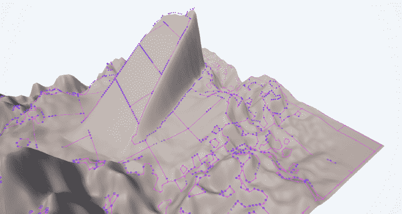

*Landscape topology.*

风景和 3D 对象扫描方法的问题是，很多时候，它会将覆盖点误认为属于风景，而不是它们想要的覆盖对象。在使用基于 navmesh 的生成技术时，这不是问题，这也是除了性能提升之外，我们尽可能使用这种技术的主要原因。

### 力场(防护罩)

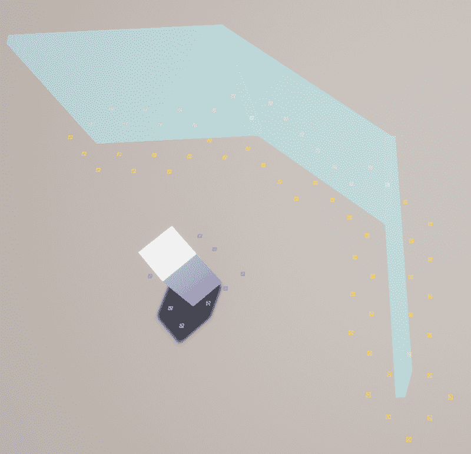

*A force field.*

力场是重铸无法穿越的，因此是 3D 物体扫描仪的唯一优势。因为它们是完全不影响 navmesh 的动态对象，所以我在 cover point 数据结构中创建了一个布尔标志来指示一个点是否属于其中的一个。在演示项目中，它们由黄色标记表示。想象一下莱因哈特在《守望先锋》中的盾牌，但它不会移动。这使得单位可以射穿它们，同时避免敌人开火。

### 错误

基于 navmesh 的方法并不是没有缺点，在大多数情况下，这表现为在重铸的瓦片边界上出现不必要的边缘。我们对它们无能为力，只能在封面生成过程中剔除它们。

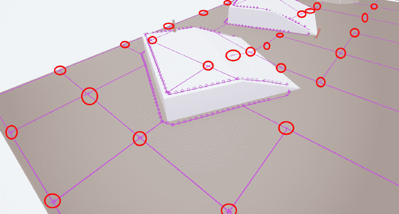

*Excess vertices on the navmesh.*

正如您所看到的，这里有几个多余的顶点，但是在覆盖点生成过程中，大多数顶点都被丢弃了。处理它们的主要方法是在垂直于它们边的 XY 轴的两个方向上投射光线，并从固定的高度进行投射。如果没有击中任何东西，那么我们的点只是一个瓷砖边界顶点，可以安全地丢弃。这些也会爬上你的物体，但是同样的剔除技术也适用。

另一种类型的错误来自于这样一个事实，即重新转换不区分封闭空间和开放空间，这意味着它也会在实体对象内部生成 navmesh:

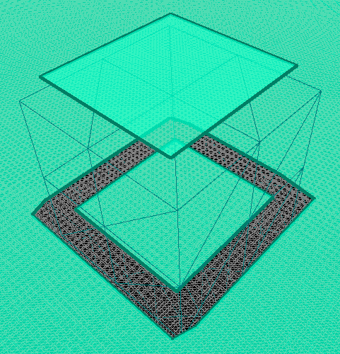

*Navmesh inside a solid object.*

这显然是不好的，唯一的解决方法是在你的地图中有较大的实体网格的地方放置导航修改器体积。


这在很大程度上导致了正确的 navmesh 生成。但是请注意，在某些情况下，您无法完全隐藏这些内部导航网格。不过没关系，因为我们的覆盖系统会自动过滤掉无法到达的覆盖点，所以这只会导致一些微小的性能损失。但是，与我们的 cover finding 代码的其余部分相比，Navmesh 寻路查询往往相对昂贵，所以您仍然应该以最小化不可到达的 navmesh 岛的数量为目标。

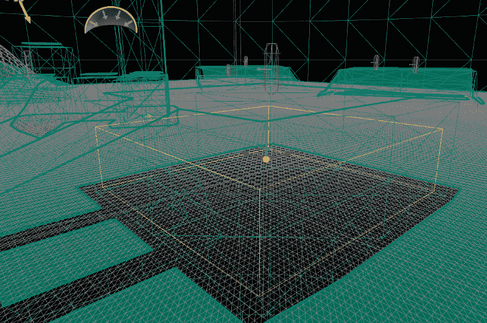

*Nav modifier volume in action.*

接下来，我们看看如何在一个数据结构中存储我们的覆盖点，该数据结构提供了对空间数据的快速和优化的访问:八叉树。

### 数据持久性——八叉树

这就像一只章鱼和一棵树杂交:很容易想象，但很难攀爬。八叉树只不过是“将立方体分成 8 个更小的立方体，清洗并重复”的一种奇特说法。同样，四叉树就是这样——一个正方形分成四个更小的正方形，四个更小的正方形又分成四个更小的正方形，以此类推。通过将覆盖点的整个地图存储在八叉树中，我们可以确保我们的空间查询总是尽可能高效。

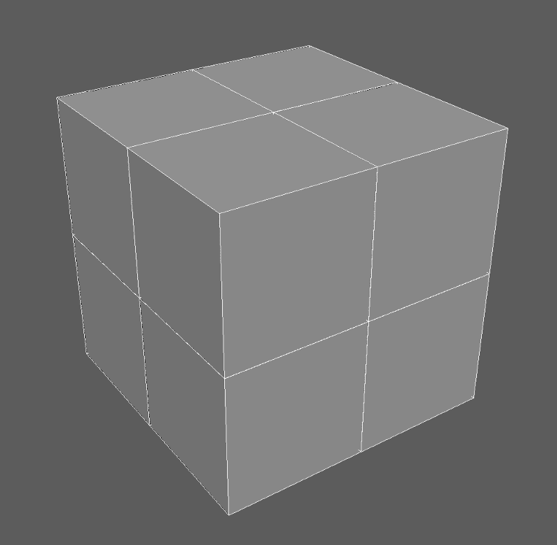

*A cube, subdivided into 8 smaller cubes*

好消息是，Epic 已经为我们完成了大部分工作，因为 UE4 具有全功能的八叉树实现。坏消息是:几乎没有文档。不过不用担心，它不会变得太复杂，我们可以随时查看*fnavigationctree*来了解 Epic 如何使用他们的怪物。

八叉树的一个特点是，每当你想删除其中的现有数据时，你必须传递一个元素 id。但是这些 id 并不存储在八叉树中——我们必须为它们建立自己的存储设施。

通过遵循*fnavigationctree’*的步骤，我们使用一个简单的 *TMap < const FVector，FOctreeElementId>Eleme*ntToID，其中*e FV*ector 是 cover point*t 的位置，FOctreeElementId 是 Epic 的内置类，它包含对元素所在节点的引用及其索引。我们还将所有对 map 的访问调用封装在线程安全的包装方法中。很标准的东西。*

我们的八叉树的半径(大小)应该模仿我们的 navmesh 的。但是为了简单起见，我们只是将其设置为 64000，这也是默认情况下 *UNavigationSystem* 在内部为 navmesh 使用的值。

### 实时动态更新

我们的 cover 系统的一个关键特性是能够在运行时响应环境的变化，并且能够在运行中处理新的几何图形。

这是通过挂钩到 Recast 的 tile update 事件来完成的，我们通过子类化 *ARecastNavMesh* 并覆盖它的*onnavmeshitileupdated*方法来完成。overridden 方法中的功能非常基本，但也是必不可少的:每当 tile 更新时通知一个定制的动态多播委托。然后，我们从我们的主覆盖系统类 *UCoverSystem* (单例)中订阅委托，并相应地生成覆盖点生成器任务。

我们调用我们的子类*AChangeNotifyingRecastNavMesh*,并通过自定义的游戏模式将它连接到游戏中。游戏模式覆盖了在 *AActor* 中声明的 *PostActorCreated()* 方法，并使用 *SpawnActor()* 实例化我们的*AChangeNotifyingRecastNavMesh*，如下所示:

```
void ACoverDemoGameModeBase::PostActorCreated(){ Super::PostActorCreated();  GetWorld()->SpawnActor<AChangeNotifyingRecastNavMesh>(AChangeNotifyingRecastNavMesh::StaticClass());}
```

由于在单个事件中可能有多个瓦片被更新，并且一些瓦片也将在相对短的时间跨度内接收多个更新，所以我们对我们的任务生成逻辑进行时间切片，以便我们不会快速连续地更新同一个瓦片两次。

您还必须转到*项目设置== >导航系统== >代理== >支持* d 代理，并添加一个新条目 *re，其导航 D* 数据 C *类和首选*导航数据都应设置为 ChangeNotifyingRecastNavMesh，如下所示:

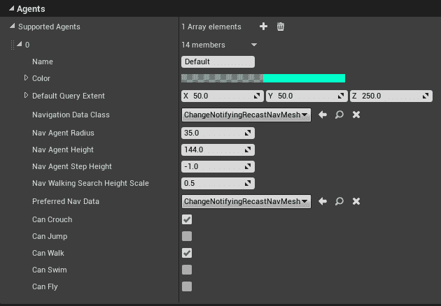

*Supported agents.*

您还需要取消选中*导航系统*下的*自动创建导航数据*:

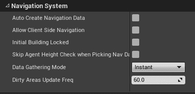

*Auto create navigation data.*

您可能需要重新启动编辑器才能看到新设置的应用。

### 碰撞配置

掩护不应该在像兵和车辆这样的单位周围生成，所以让我们通过定义一个自定义的追踪通道来排除它们。我们可以在 C++中引用为 *ECC_GameTraceChannel1* 。

转到*项目设置… == >引擎== >列*列并点击 o *n 新跟踪通道*通道…按钮。
名称:否单位
默认响应 *onse:* 忽略

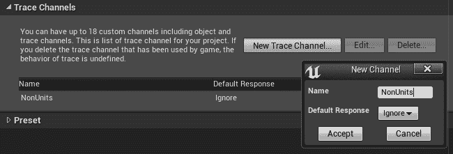

*Creating a new trace channel*

现在展开*追踪通道*下的*预设*部分，双击以下每个预设，根据我们新创建的*非单位*追踪通道设置它们的响应。保留下面没有列出的选项——它们已经默认设置为*忽略*,这就是我们想要的。

勾选以下所有预设中*非单位*行的*块*上的复选框:

*   全部阻止
*   BlockAllDynamic
*   可破坏的
*   无形的墙
*   不可见墙壁动态

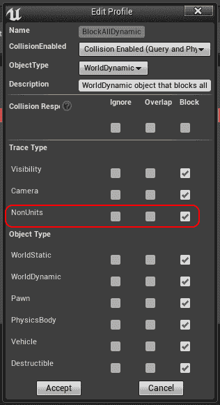

*Blocking collision setup*

接下来，在以下所有预设中，勾选*非重叠*行中的*重叠*复选框:

*   覆盖层
*   动态重叠


*Overlapping collision setup*

接下来，定义一个名为“*盾*或“*力场*的新物体通道:

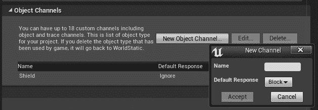

*Custom collision object channel*

最后，创建一个自定义碰撞预设，命名为“ *NonBlockingShield* 或“ *NonBlockingForceField* ”:

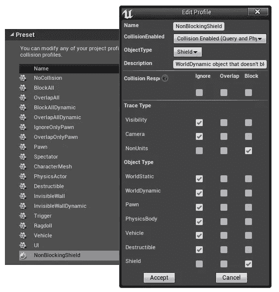

*Custom collision preset*

### 在运行时寻找掩护

所以现在你已经在你的小八叉树中得到你的覆盖点，一切都是高效的和多线程的，你的自定义 navmesh 传入所有的图块更新…一切都很好，所以现在是时候开始利用这些数据了！

你的单位想要寻找掩护，如果你正在制作一个 RTS——更好的是，一个重战术的 RTS(技术上是一个 RTT)——可能一次要找几十个单位，那么他们应该如何最好地接近呢？这很简单:只需查询八叉树，选择一个适合他们需要的点，保留选择的点，并移动到那里。

我建议创建一个 *CoverFinder* 服务或任务，父类可以是 *UBTService* 或 *UBTTaskNode* 。如果你去执行一个任务，那么你可以给它添加一个冷却装饰，这样它每隔 x 秒就被调用一次，并且不会给你的八叉树和 navmesh 带来太多的查询，或者给 PhysX 带来太多的光线投射。

也可以创建一个 *UBTService，*的 *UCoverFinder* 服务来代替。我已经在演示项目中为您创建了这两个类，但是您应该注意到，我确实用封面查询向系统发送了垃圾邮件，所以您需要在您的行为树中调整 *UCoverFinder* 的节拍间隔，以便它在您的游戏中消耗更少的资源。

### 封面评价

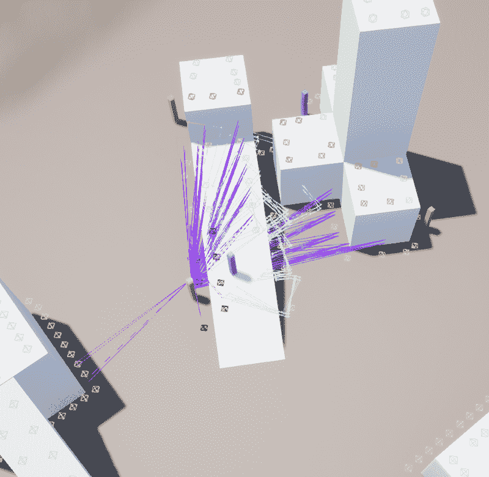

*Real-time cover evaluation.*

掩护寻找器评估距离目标敌人单位设定距离内的掩护点。在 cover demo 项目中，我将这些分别称为它们的最小和最大攻击范围。探测器在八叉树中查询其范围是最大攻击范围的边界框内的点，然后过滤掉比最小攻击范围更靠近敌人的任何点。姑且称之为我们单位的*最佳射程*。

然后，它在其最佳范围内迭代覆盖点，直到找到满足以下条件的第一个覆盖点:

*   这支部队不能从隐蔽的地方直接攻击敌人
*   这个单位可以通过窥视或探身出掩体来打击敌人
*   敌人的视线没有被其他单位挡住
*   该单元可以通过导航网格上的寻路到达覆盖点

为了检查我们的单位是否可以通过窥视或探身出掩体击中敌人，我们使用了两个由单位的倾斜(或窥视)能力参数驱动的光线投射。这只是一个简单的浮动偏移量，在垂直于它所面对的方向上添加到单元的位置。


*Hit testing by leaning out of cover. Yellow trying to hit blue.*

*淡蓝色箭头:探出不能命中敌人*
*橙色箭头:探出可以命中敌人*

在上面的截图中，一个黄色单位已经确定了一个可以安全攻击蓝色单位的地点，所以当蓝色单位争夺掩护时，它移动到相应的掩护点。

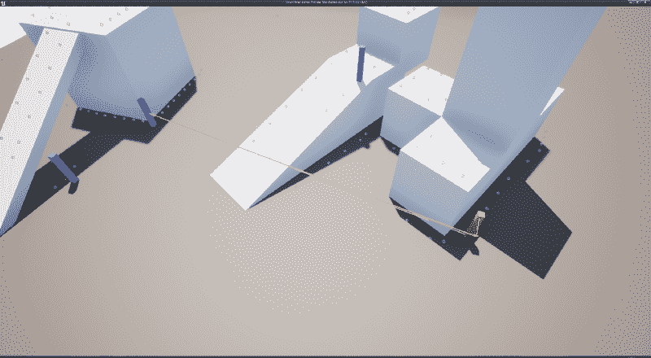

*Yellow occupies a safe cover position.*

检查装置的两侧要做两次:一次是从站立的位置，如果失败了，就从蹲着的位置。这导致了最坏情况下的 4 个光线投射——站立:左，站立:右，蹲下:左，蹲下:右。

对每个覆盖点重复相同的过程，直到找到好的覆盖点，导致 *<坏的覆盖点&g*t；总共 5 次光线投射。

有了力场，就有点不同了:唯一的要求是单位必须能够从掩护点直接打击敌人。换句话说，不执行倾斜/窥视检查，但有一个额外的检查是必要的:该单位必须穿透屏蔽。

为此，我们必须使用我们的自定义*非遮挡*碰撞预设，该预设使用我们的*遮挡*对象通道。因此，这导致总共 2 次光线投射:一次是针对*非骨节*的，另一次是针对*护盾*的，两次都必须成功，力场类型的覆盖才能被接受。

### 统计数据

封面系统有自己的统计组，恰当地命名为*统计组 _ 封面系统*。它收集以下信息:

*   寻找掩体花费的时间(循环计数器)
*   对 FindCover 的调用总数，等于生成的任务总数(dword)
*   在游戏中寻找掩护所花费的总时间(浮动)
*   生成 cover 花费的时间(周期计数器)
*   封面生成调用的总数(包括边走和 3d 对象扫描)
*   生成 cover 所花费的总时间(包括两种方法)
*   活动任务数(dword)

要查看它的运行情况，请在控制台中键入 *stat CoverSystem* 。

### 压型

因为自定义统计已经建立，所以很容易描述封面系统。只需在控制台中写入 *stat startfile* 和 *stat stopfile* ，并使用 *Window = > Developer 到* ols 下的*会话前端*查看生成的日志文件。

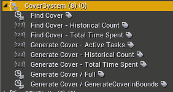

*Profiling stats.*

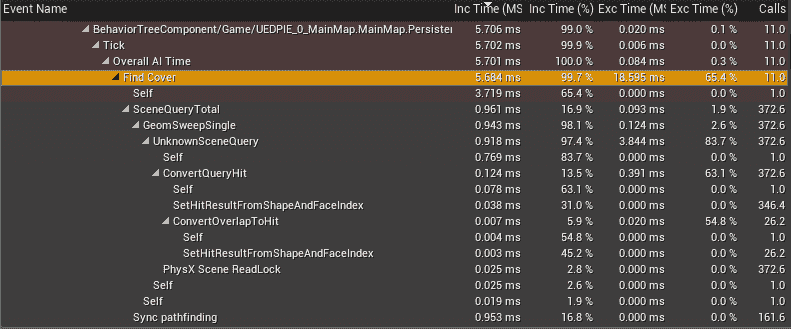

Profiling details.

### 结论

总之，健壮的覆盖系统使用两种独立的技术来生成覆盖:3D 对象扫描和 navmesh 边缘行走。前者最适合力场类型的掩护(静态护盾)，而后者适用于其他一切(风景、物体等等)。

对象扫描包括将演员分割成 3D 网格，而 navmesh 边缘行走则需要现有的 navmesh 多边形来遍历一个区域，并可选地支持边缘检测。

这两种技术都将数据存储在八叉树中，这提供了有效的空间查找工具。

通过订阅并对 Recast 的图块更新事件进行时间分片，可以实现实时动态更新。

通过为单元定义“扫视”或“倾斜”偏移，在运行时查找覆盖点变得更加通用。

您可以通过禁用边缘检测来提高封面生成性能，从而减少光线投射的数量。

你应该采取一些额外的步骤来使基于 navmesh 的技术更好的工作，比如在地图上任何有 nav mesh 的大物体的地方放置 nav 修改器体积。一些项目设置也是必要的，例如自定义对象通道、跟踪通道和碰撞。

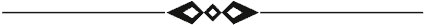

我相信您现在已经受够我了，所以为什么不下载演示项目并深入研究源代码，它包含了上面讨论的所有技术的全功能实现。如果有不清楚的地方或者你被卡住了，请在下面的评论区告诉我！

[**下载演示项目和源代码。**](https://horugame.com/real-time-dynamic-cover-system-for-unreal-engine-4/)

如果你喜欢这个教程， [**订阅我们的时事通讯**](https://horugame.com/#newsletter) ，获得新教程和文章的通知。