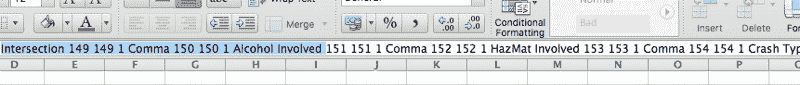
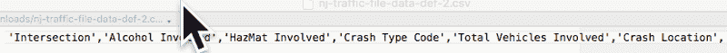
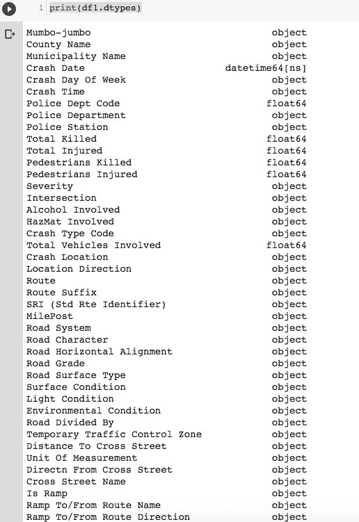
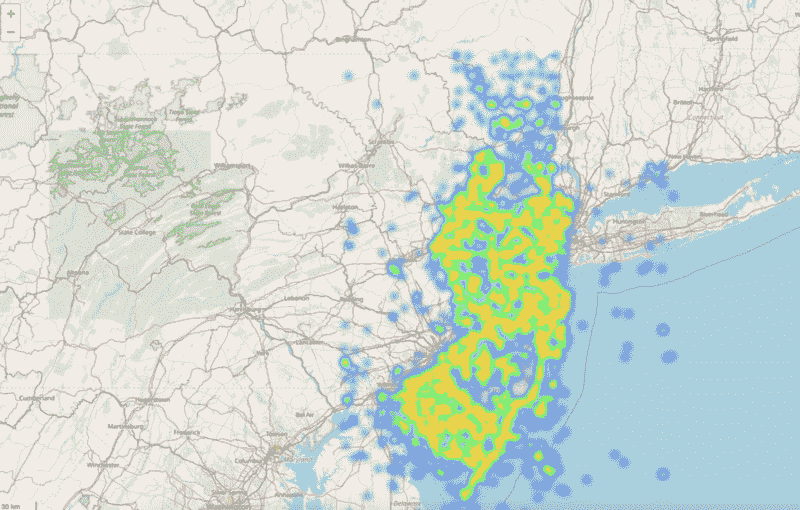
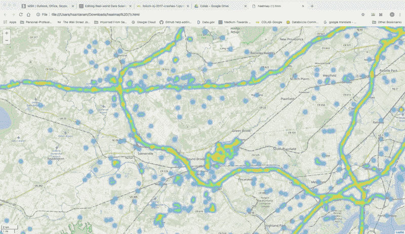
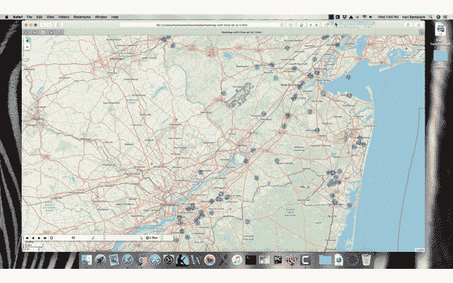
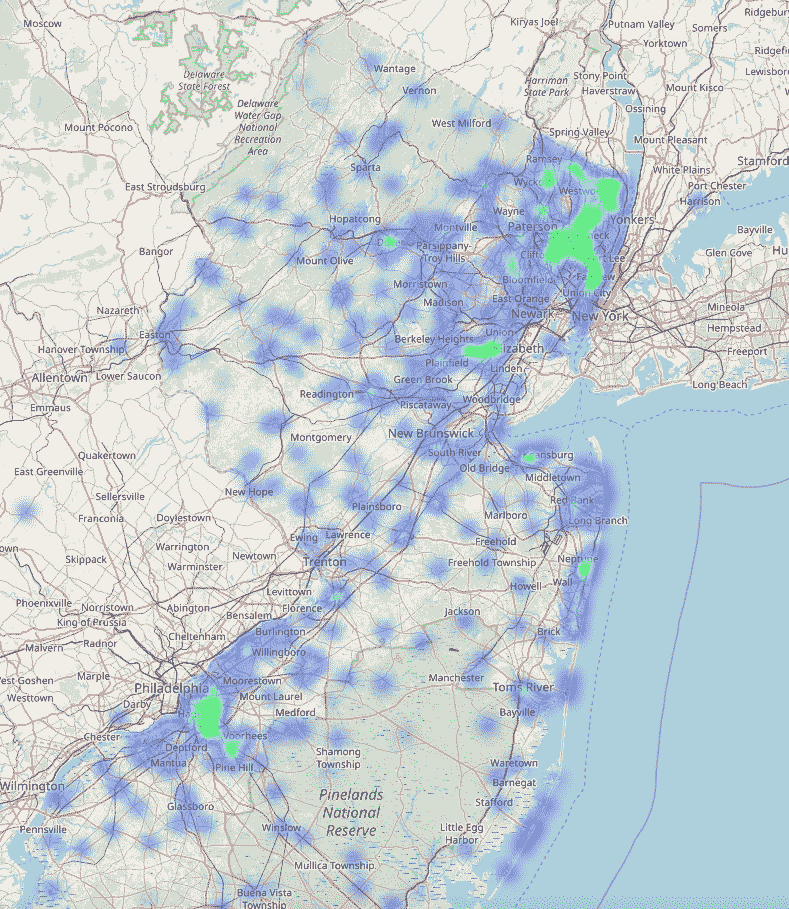

# 真实世界数据科学项目:交通事故分析

> 原文：<https://www.freecodecamp.org/news/real-world-data-science-project-traffic-accident-analysis-e5a36775ee11/>

作者:哈里·桑塔南

# 真实世界数据科学项目:交通事故分析

#### **利用 Python 和 yellow 对国家交通事故数据进行清理、分析和可视化**


Driving in the snow. GIF and source: mine :).

我热爱数据科学、数据可视化和分析。最近，我研究了一个引起我兴趣的项目——全州交通事故。

现实生活中的数据科学流程和任务是数据科学家(广义上)必须要做的事情。这包括收集、整理、清理、聚合、添加和删除部分数据。还包括决定如何分析数据。

而这只是第一部分！之后，他们必须决定如何呈现输出。

这就是我在最近的一个项目中所做的。

我收集了 2017 年美国新泽西州的交通事故数据。这是新泽西州政府网站上最近一年的数据。

我很高兴与市民共享数据的开放政策，尽管数据组织有些古怪(我的看法！)，而且不像预期的那样简单。

以下是我为这个项目采取的步骤:

*   我收集、整理和分析了这些数据。
*   数据必须分成两个子集。一组有精确的地理坐标，一组没有。
*   收集信息和准备数据。
*   创建了热图——静态的和有时间限制的，在新泽西州的地图上按地点显示一年内的事故，以便可视化。

在继续之前，我将向那些可能不熟悉该地区地理的人提供一些背景。

新泽西州位于纽约市的西部，向西部和南部(以及稍北一点)延伸。

基本上，开车从纽约市直接去美国其他地方(除了北部的新英格兰地区和加拿大)的司机必须经过新泽西州。这个州有很好的公路连接。它也有一个密集的郊区人口，一旦你经过数公里紧密结合的老镇，有郊区，牧区，甚至农村地区。

#### **数据准备和清理**

以下是我清理和准备数据集的步骤:

*   **搜索和研究数据。**我从新泽西州政府网站上获得了这些数据。纬度和经度(Lat，Long)是地理坐标点，可以映射地球上任何一点的位置。阅读[这里](https://en.wikipedia.org/wiki/Geographic_coordinate_system#Latitude_and_longitude)了解更多关于他们的信息。
*   我使用了 2017 年全州的汇总数据，这是有数据的最近一年。
*   有一个单独的文件列出了标题及其描述。我将头文件复制到 Excel 中，解析它，然后使用文本编辑器粘贴它。



The header file — I copied from the pdf into Excel then parsed it.



2nd step: Deleted some items, saved as csv file.

这些步骤发现了什么？

在大约 277，000 行中，只有 70，000 行具有纬度和经度坐标(或者大约 26%)。

这是一个挑战。毕竟，这个项目的目标是产生一个覆盖整个新泽西州的事故数据的可视化表示。我是这样做的:

我把没有经纬度坐标的行分成一个新的熊猫数据框。这些行确实有一个城镇名称，所以我决定为这些数据的城镇制作单独的热图。

因此有两套热图:一套用于具有精确纬度和经度坐标的数据集，另一套用于只有城镇信息的其他数据。

我写了一些代码来获取这个城镇的坐标。现在，这个数据集要大得多，占总数据的 74%!这是现实生活中的数据——通常不完整，需要清理和准备。

请参见下面的初始化代码片段。

```
#TSB - Import Tools, read the file, prep the data#the column names are in a different (pdf)file, so they need to be defined here
```

```
#tools below required for drawing the map with data overlayed on it 
```

```
import folium                    import folium.plugins as pluginsfrom folium.plugins import HeatMapWithTime
```

```
import pandas as pdcolumn_names =['Mumbo-jumbo','County Name','Municipality Name','Crash Date','Crash Day Of Week','Crash Time','Police Dept Code','Police Department','Police Station','Total Killed','Total Injured',              'Pedestrians Killed','Pedestrians Injured','Severity','Intersection','Alcohol Involved','HazMat Involved','Crash Type Code','Total Vehicles Involved','Crash Location','Location Direction',               'Route','Route Suffix','SRI (Std Rte Identifier)','MilePost','Road System','Road Character','Road Horizontal Alignment','Road Grade','Road Surface Type','Surface Condition','Light Condition',               'Environmental Condition','Road Divided By','Temporary Traffic Control Zone','Distance To Cross Street','Unit Of Measurement','Directn From Cross Street','Cross Street Name',               'Is Ramp','Ramp To/From Route Name','Ramp To/From Route Direction','Posted Speed','Posted Speed Cross Street','First Harmful Event','Latitude','Longitude',               'Cell Phone In Use Flag','Other Property Damage','Reporting Badge No']#read the file and load into a dataframedf1 = pd.read_csv('/content/drive/My Drive/Colab/NewJersey2017Accidents.txt', header=None)
```

第一步(定义数据集和加载内容)现在已经完成。

现在，真正的工作开始了。让我们看看有多少内容缺少使地图工作所需的纬度和经度值。

我们将在第一个数据帧`df1`中保留具有良好值的记录，并将没有 Lat、Long 值的记录放入不同的数据集`df2`，

为此，我将尝试获取城镇名称，这样我至少可以在不同的地图上识别那些没有具体街道位置的城镇的事故率。

下面的代码将实现这一点。

```
#convert 'Crash Date' field to python pandas readable month/ day/ year format df1['Crash Date'] = pd.to_datetime(df1['Crash Date'], format = '%m/%d/%Y')
```

```
#convert Latitude, Longitude columns from string to numericcols_to_convert = ['Latitude', 'Longitude']for col in cols_to_convert:  df1[col] = pd.to_numeric(df1[col], errors='coerce')
```

```
#Longitude values in the original data didn't have the negative (-) #sign - this code below fixes that by replacing all Lat values with #Lat * -1\.  Without this, the map displays a totally different part #of the world!df1['Longitude']=df1['Longitude']* -1
```

```
#put all records with no data(NaN) for Lat and Long in separate #dataframe (df2)df2 = df1.loc[df1.Latitude.isnull()]#df2 = df1.loc[df1.Latitude.isnull()] & df1.loc[df1.Longitude.isnull()]df2.shape#df2.head()
```

```
#drop records with NaN in Lat and Long from df1 (they are saved #above in df2)df1 = df1.dropna(subset=['Latitude','Longitude'])df1.shapeprint(df1.dtypes)
```



output of df1.dtypes shows each column type in dataframe

```
#run some queries on dataframe 1 (with Lat, Long available)#list accidents where one or more person killed — very serious ones#not showing the output here, too longprint(df1.loc[(df1['Total Killed'] >= 1.0), ['Municipality Name','Latitude','Longitude', 'Total Killed']])
```

```
#show accidents involving cell phone in useprint(df1.loc[(df1['Cell Phone In Use Flag'] == 'Y'),['Posted Speed','Police Station','Latitude','Longitude']])
```

```
#show crashes on Fridaysprint(df1.loc[(df1['Crash Day Of Week'] == 'FR'),['Municipality Name','Posted Speed','Police Station','Latitude','Longitude']])
```

```
#show crashes for specific town and speed limitprint(df1.loc[(df1['Municipality Name'] == 'WATCHUNG BORO'), ['Municipality Name','Posted Speed','Police Station','Latitude','Longitude']])
```

#### **创建一些热图**

让我们把位置覆盖在热图上。我们还可以制作一个热图来显示一段时间内的变化。

```
#define a base map generator function#-note - if folium doesn't work properly(it didn't, at first, for me #:) - in Google Colab - I uninstalled Folium, re-started kernel and #re-installed Folium#I also saved to file as pressing run didn't output results
```

```
def generateBaseMap(default_location=[40.5397293,-74.6273494], default_zoom_start=12):    base_map = folium.Map(location=default_location, control_scale=True, zoom_start=default_zoom_start)    return base_map
```

```
base_map = generateBaseMap()base_map
```

```
#apply the heat map to the base map from above, and save 'm'(output)  # to a file. As explained at the top of the code notes, Run didn't #work for me. I opened saved file in browser to see output
```

```
m = HeatMap(data=df_map[['Latitude', 'Longitude', 'count']].groupby(['Latitude','Longitude']).sum().reset_index().values.tolist(), radius=7, max_zoom=10).add_to(base_map)m.save('/content/drive/My Drive/Colab/heatmap.html')
```



Heatmap of traffic accidents for 2017 for all NJ, compressed view. A few have wrong coordinates (some are in the ocean, some are not in NJ), as you can see :) — real world data problem.



Heat map, expanded, for 2017 traffic accidents.

很好——现在让我们来看看一段时间内的热图。

```
from folium.plugins import HeatMap#first, copy all data [all 2017 county accidents] to our map #dataframedf_map = df1.copy()
```

```
#set count field to 1 initially.  Then, group by Lat, Long and count #how many are in each set of coordinates to create base map data
```

```
df_map['count']=1df_map[['Latitude', 'Longitude', 'count']].groupby(['Latitude', 'Longitude']).sum().sort_values('count', ascending=False).head(10)
```

```
base_map = generateBaseMap()base_mapm = HeatMap(data=df_map[['Latitude', 'Longitude', 'count']].groupby(['Latitude','Longitude']).sum().reset_index().values.tolist(), radius=7, max_zoom=10).add_to(base_map)m.save('/content/drive/My Drive/Colab/heatmap_with_time-1.html')
```



Heat map with time — edited and shown in GIF. Basically shows concentration of accidents by location and day for 2017\. Notice the controls, expanded below. Populated areas (Northern NJ, close to NYC, and Southern NJ, close to Philadelphia) and main transit corridors have higher accident rates, as expected.


Controls on the output file (rendered in browser) — control speed and play buttons. The ‘83’ is the day in this example.

### **第 2 部分—创建第二数据集的热图**

之前，我们分割了数据集，并为那些没有特定纬度和经度坐标的记录创建了数据集`df2`。

原因可能有很多。也许数据在被捕获时被污染了，或者警察忙于第一响应者的职责而没有时间输入准确的信息。

不管什么原因，让我们得到城镇的位置数据。这比我想象的要复杂得多。可能只是因为我没有想到一个最佳的方法。这是我做这件事的方法。

在实际工作中，很多时候你必须选择“最可行的解决方案”，这意味着在给定时间、环境限制和不完整数据的情况下，尽可能做到最好。

```
#create a list of unique town names from df2 for use later to make a #call to function to get Lat, Long - easy to read each value from a #listtown_names=[]df2.dropna(subset=['Municipality Name'])town_names = df2['Municipality Name'].unique()print(town_names)
```

这是我们在接下来的几个步骤中要做的。以我们刚刚创建的唯一城镇名称列表为例。然后用一个函数对`maps.google`进行 API 调用，得到经纬度坐标。

获取按城镇(分组)汇总的城镇事故率数据框，并将其与上面步骤中创建的具有经纬度坐标的列表合并。

然后，调用绘图函数创建一个热图，就像我们之前对第一个数据集所做的那样。

```
#call a previously created function (listed in the gist - link is #below this code box and output), then store google geo #coordinates #in a csv file.
```

```
#Ensure that you have API token:click link to find out how:# Google maps API tokenLat_Long=[]API_KEY = 'YOUR API KEY HERE'for address in town_names:    geocode_result = get_google_results(address, API_KEY, return_full_response=RETURN_FULL_RESULTS)    Lat_Long.append(geocode_result)
```

```
#now, convert the list with our geo coordinates into a csv file that #will be called by another program to overlay on a map.pd.DataFrame(Lat_Long).to_csv('../Colab/town_with_Lat_Long_output.csv', encoding='utf8')
```

```
#read the csv file that has the latitude and longitude for the #records in df2, which originally did NOT have lat and longdf6 = pd.read_csv('/content/drive/My Drive/Colab/town_with_Lat_Long_output.csv')df6.shape
```

```
#merge the two datasets - one has town names and geo coordinates, #the other has town names and aggregate accident info
```

```
df7 = pd.read_csv('/content/drive/My Drive/Colab/df5_output.csv')dfinal = df6.merge(df7, on="Municipality Name", how = 'inner')
```

```
#now we draw the heat map for the 2nd dataset finally!
```

```
from folium.plugins import HeatMapdef generateBaseMap(default_location=[40.5397293,-74.6273494], default_zoom_start=12):    base_map = folium.Map(location=default_location, control_scale=True, zoom_start=default_zoom_start)    return base_map
```

```
base_map = generateBaseMap()base_mapm = HeatMap(data=dfinal[['latitude', 'longitude', 'count']].groupby(['latitude','longitude']).sum().reset_index().values.tolist(), radius=7, max_zoom=10).add_to(base_map)m.save('/content/drive/My Drive/Colab/heatmap_town_total_accidents_2017.html')
```



Heat map for the 2nd dataset (towns). Similar to the other map, Northern and Southern suburbs with higher populations and proximity to large cities have higher accident rates.

代码的要点是这里的[和](https://gist.github.com/HariSan1/0245dca9ba3b32caf9b59ff81a4bd9b5)。

感谢您从头到尾的阅读。如果你是新手，每个数据科学项目都是一次冒险——坚持下去。意想不到的(和预期的)问题将会出现——但是你的独创性、天赋和对其他编码者经验的应用也会出现，以达到你所寻求的解决方案。

如果你喜欢这篇文章，请给我一个掌声！