# 真实世界的数据结构:JavaScript 中的表和图

> 原文：<https://www.freecodecamp.org/news/real-world-data-structures-tables-and-graphs-in-javascript-bcb70c929495/>

作者:梁荣立

# 真实世界的数据结构:JavaScript 中的表和图

Photo by Matt Donders on [Unsplash](https://unsplash.com/photos/fo3Obuy794g)

鸟瞰写有地址的盒子，每个盒子里都装着人和各种物品，展示了通过道路连接起来的街区。仔细观察，你可能会说我们有一个**散列表。但是，从远处看，你可能会看到一个 T2 图形。从 [**线性**](https://medium.com/@yunglleung1/linear-data-structures-linked-lists-stacks-queues-a13c7591ad87) **(** 链表、栈&队列 **)** 和 [**二进制**](https://medium.com/@yunglleung1/binary-data-structures-trees-heaps-962ab536cb42) **(** 二分搜索法树、二进制堆**)数据结构**、**散列表、**和**图形**向现实世界应用的更大多样性迈进。**

### 桌子

一个**散列表**表示由索引列表的数据(键值对)。

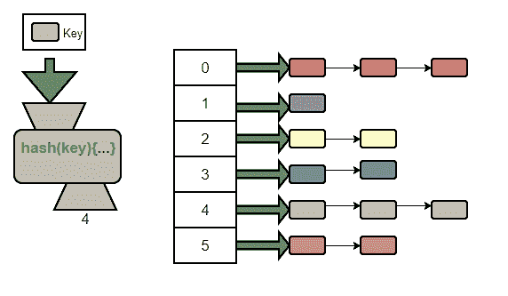

[source](https://www.geeksforgeeks.org/implementing-our-own-hash-table-with-separate-chaining-in-java/)

每个唯一键用于生成一个索引(哈希函数)。一个哈希函数可以为几个唯一键生成相同的索引(**冲突**)。这个问题的解决方案是将数据集存储在同一个索引下(**链接**)。

所以，你可以把一个**散列表**想象成一个将相似的条目放在一起的系统。只需将商品名称输入到**散列函数**中，所有绿色类型的商品将被分配一个货架空间，即 4。

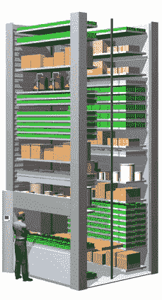

[source](http://verticalcarousel.com.au/wp-content/uploads/2015/05/003.gif)

一般来说，一个键-值对 **insert** 需要生成一个**索引**(货架号)，检查该货架是否存在，并将该商品(**数据**)放在货架上。假设我在最下面的架子上放了香蕉和苹果( **index 0** )，在最上面的架子上放了红酒( **index 2** )。

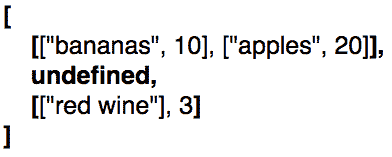

**Stock items of 10 bananas, 20 apples & 3 bottles of red wine**

如果我的索引生成器(**散列函数**)为我的两只“烤鸡”返回了一个**索引 2** ，那么插入该数据需要检查并创建货架空间。

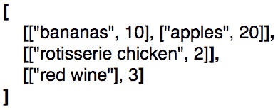

Added stock items of 2 rotisserie chickens

要获得一个**值**(物品)需要输入其名称(**键**)来生成其索引(货架号)并检索该货架上的所有物品。然后搜索确切的项(它的名称或键)并检索它(返回值)。因此，要找到库存中有多少苹果( **20** )需要遍历我的水果货架。

要获得所有**键**或**值**的列表，需要搜索每个现有的货架，将其记录到您的清单中(推入一个数组)，并提交文档(返回键或值数组)。

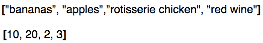

Keys (items) & Values (quantity) of Hash Table (shelves of stock items)

**插入**一个键-值对或者**访问**一个值的复杂度一般是一个常数时间( **O(1)** )。一个好的散列函数会将所有物品均匀地分配到所有可用的货架上。因此，**插入或访问**不需要遍历所有现有的“架子”来存储或检索数据。

因为编目(**键或值**)需要遍历所有的书架，所以它有一个复杂度 **O(n)** 。对于 **n** 个不同的数据集(针对 4 个不同的项目)，需要 **n 个步骤**来执行一个目录(需要查看所有 4 个项目以记录其名称或数量)。

### 图形

一个**图**是由它们的连接(**边**)相关的数据的节点(**顶点**)。由道路连接起来的城市的路线图是一种图表。另一个例子是社交媒体应用程序中的连接用户图。

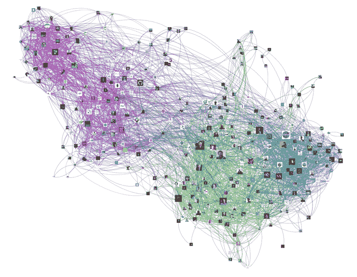

[source](http://allthingsgraphed.com/2014/11/02/twitter-friends-network/)

为了**添加一个顶点**和一条**边**需要将它们作为键值对存储在一个**邻接表**中。因此，通过将“纽约”作为包含“新泽西”、“宾夕法尼亚”的数组的关键字，顶点(纽约)可以连接到其他顶点(新泽西&宾夕法尼亚)

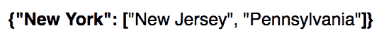

**List of All States Adjacent to New York**

还必须执行相反的操作，即:“新泽西州”指向一系列“纽约州”、“宾夕法尼亚州”等。因此，结果是键的邻接列表(“纽约州”、“新泽西州”、“宾夕法尼亚州”)，每个键都指向它们对应的连接数组。

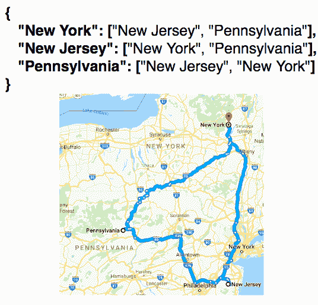

**Complete Adjacency List from Google Maps**

为了**移除边**需要移除顶点 1 到顶点 2 的连接，反之亦然。因此，消除纽约与新泽西的联系也需要消除新泽西与纽约的联系。

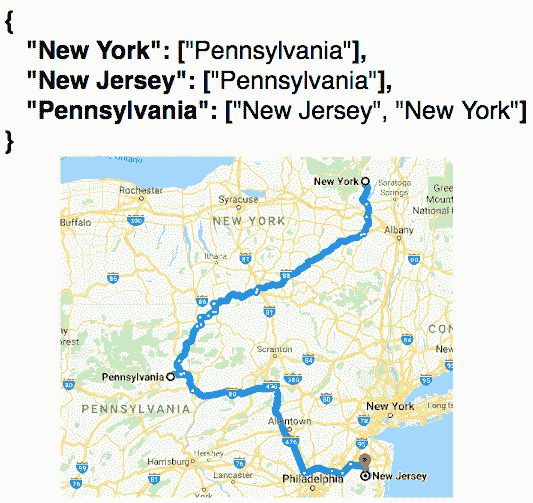

**Updated Adjacency List from Google Maps**

要删除一个顶点，需要遍历它的连接。在最终从邻接表中删除顶点之前，删除它的边。因此，要删除纽约，需要在从列表中删除之前，断开它与其邻居的连接。

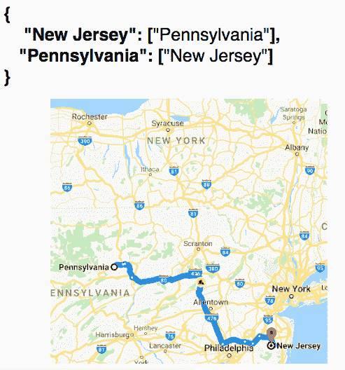

**Adjacency List without New York from Google Maps**

相对于起始点，**深度优先**遍历包括在继续下一个紧邻的邻居之前，访问一个邻居及其邻居。一个**广度优先**遍历包括在访问远邻居之前访问所有的近邻。

因此，对于以纽约、新泽西、宾夕法尼亚和弗吉尼亚为顶点的图，从新泽西开始的深度优先遍历将是["新泽西"、"宾夕法尼亚"、"弗吉尼亚"、"纽约]。

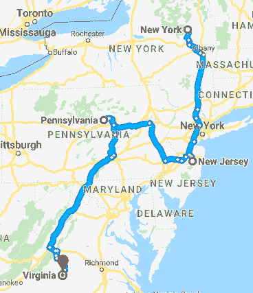

**Graph of New York, New Jersey, Pennsylvania & Virginia from Google Maps**

来自新泽西的广度优先的将会是[“新泽西”、“纽约”、“宾夕法尼亚”、“弗吉尼亚”]。

由于一个**图**是一组连接的节点，**&[**二元**](https://medium.com/@yunglleung1/binary-data-structures-trees-heaps-962ab536cb42) **数据结构**在某种意义上可以被视为简单的图。因为图可以采取许多不同的形式&形状，遍历图的**复杂度取决于用于遍历的算法，这个讨论最好留到下次讨论。****

### **参考资料:**

**[https://www . udemy . com/js-algorithms-and-data-structures-master class/](https://www.udemy.com/js-algorithms-and-data-structures-masterclass/)**