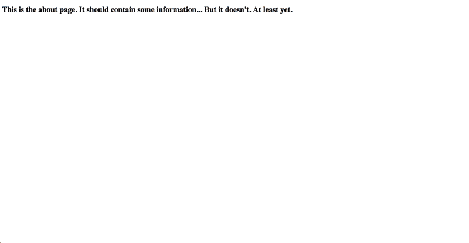

# 使用 Express 在 Node.js 中进行非常非常基本的路由

> 原文：<https://www.freecodecamp.org/news/really-really-basic-routing-in-nodejs-with-express-d7cad5e3f5d5/>

保罗·帕万

# 使用 Express 在 Node.js 中进行非常非常基本的路由


Photo by [Clément H](https://unsplash.com/@clemhlrdt?utm_source=medium&utm_medium=referral) on [Unsplash](https://unsplash.com?utm_source=medium&utm_medium=referral)

这个故事的目标是在构建一个简单的——非常简单的——节点应用程序的同时，简要解释路由在 Express 中是如何工作的。

我们还将使用 EJS，一个模板引擎，“让你用普通的 JavaScript 生成 HTML 标记”，根据他们的网站。基本上，它可以让我们创建 HTML 页面，这些页面可以根据客户的请求而变化。我们不会使用最后一个特性，但它是一个很棒的特性。在本文的最后，您将找到一些资源，从中您可以了解更多信息。

### 什么是路由？(大约两行)

首先，让我们快速(非常快速)地看一下什么是路由:

> somewebsite.com/someroute

它基本上将用户(或一些数据)从一个地方带到另一个地方。那个地方就是路线。我说过我会速战速决的。

### 创建项目

我们将建立一个奇特的网站来了解 Express 中路由的工作原理。看看这个:


很酷，对吧？但这是我们目前需要的一切。

首先，让我们创建项目并安装软件包。只需在命令行中运行以下命令:

> npm 快速安装

> npm 安装 EJ

您可以另外添加 *dash dash save* (我写为“*dash”*因为 Medium 自动格式化它，它看起来不太适合这个目的)以将其保存在您的 *package.json* 文件中。但这是如何工作的是另一个故事。

然后，我们将需要 Express，并在我们的 *app.js* 文件中将视图引擎设置为 EJS，如下所示:

```
var express = require('express');var app = express();app.set('view engine', 'ejs');
```

我们还将包括以下行，以便我们的应用程序监听请求:

```
app.listen(3000);
```

### 处理 GET 请求

恭喜，一切都准备好处理请求了！HTTP 中有几种类型的请求，但是我们将只处理 GET 请求，它用于从服务器检索数据。为了在 Express 中处理这种请求，我们使用以下方法:

```
app.get('/about', function(req, res) {  res.render('about');});
```

让我们来看看这里发生了什么。我们告诉我们的服务器，无论什么时候有人输入*somewebsite.com/about*，我们都要触发一个函数。该函数有两个参数， *req* (请求)和 *res* (响应)。使用响应对象，我们呈现关于页面的*。*

为此，我们必须用 HTML 创建一个名为 *about.ejs* 的页面。我们还会将它放在项目文件夹中一个名为*视图*的文件夹中。这是 Express 将在其中呈现视图的文件夹。这是我们将在本例中使用的超级复杂的“关于”页面:



不错！但是，如果用户不输入任何路线呢？就像我们大多数时候做的一样，*somewebsite.com*？嗯，很简单。把*/关于*改成 */，*，呈现你喜欢的任何页面:

```
app.get('/', function(req, res) {  res.render('home');});
```

### 处理不存在的路线

但是如果有人输入了一条不存在的路线呢？我们可能不希望显示默认的错误页面。相反，我们想要一个定制的、酷的错误页面。

好消息是用快递做一个非常容易。只需用星号替换 get 方法中的 route 参数，并呈现您自己的错误页面，如下所示:

```
app.get('*', function(req, res) {  res.render('error');});
```

### 尝试一下！

最后，让我们从命令行运行我们的服务器(假设服务器名为 *app.js* )

> 节点应用程序

看看有没有用！让我们在浏览器中键入服务器的名称( *localhost* ，因为它是运行在我们计算机上的本地服务器)和端口( *3000* ):

> 本地主机:3000


localhost:3000 or localhost:3000/


localhost:3000/about


localhost:3000/anythingthatwehaventsetaroutefor

太神奇了！

### 进一步阅读

你可以在[快速指南](http://expressjs.com/en/guide/routing.html)中了解你需要知道的关于路线的一切，在 [EJS 网站](http://ejs.co)中也有很多方便的东西！

我希望这篇文章对你有帮助。如果是，请留下评论并鼓掌！

快乐编码… ***或者快乐路由，我猜！***