# 用深度学习识别红绿灯

> 原文：<https://www.freecodecamp.org/news/recognizing-traffic-lights-with-deep-learning-23dae23287cc/>

大卫·布莱洛夫斯基

# 用深度学习识别红绿灯

#### 我是如何在 10 周内学会深度学习并赢得 5000 美元的

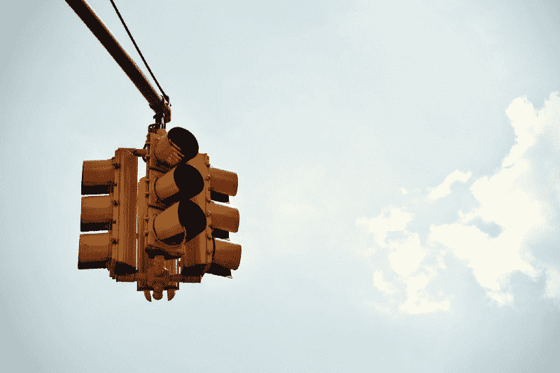

我最近在 Nexar 交通灯识别挑战赛中获得了第一名，这是由一家开发 AI dash cam 应用程序的公司组织的计算机视觉竞赛。

在这篇文章中，我将描述我使用的解决方案。我还将探索在我努力改进模型的过程中起作用和不起作用的方法。

不要担心——你不需要成为人工智能专家才能理解这篇文章。我将把重点放在我使用的思想和方法上，而不是技术实现上。

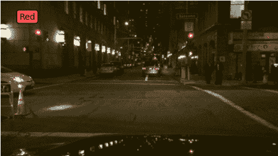

Demo of a deep learning based classifier for recognizing traffic lights

### 挑战

挑战的目标是识别司机使用 Nexar 应用程序拍摄的图像中的交通灯状态。在任何给定的图像中，分类器需要输出场景中是否有交通灯，以及它是红色还是绿色。更具体地说，它应该只识别行驶方向上的交通灯。

这里有几个例子可以使它更清楚:

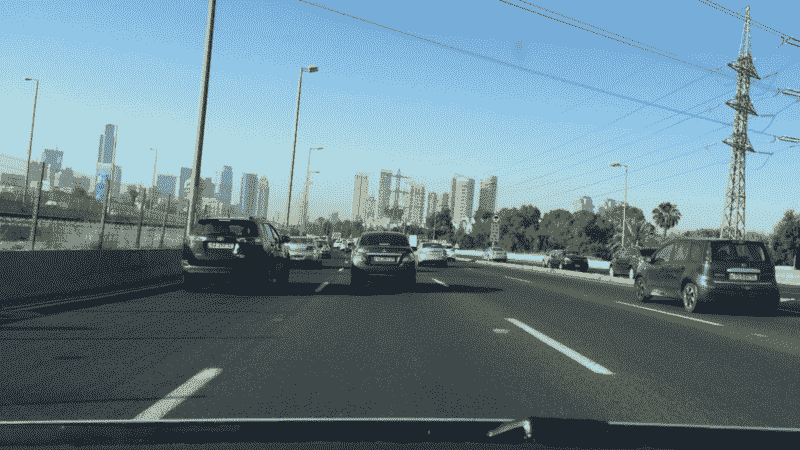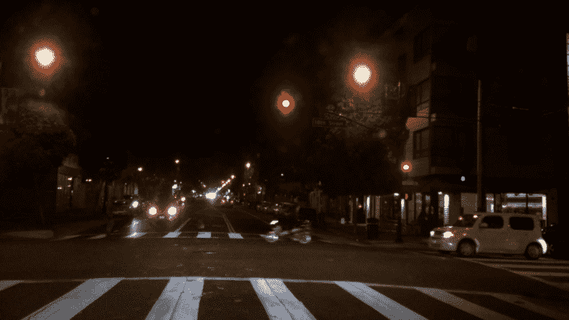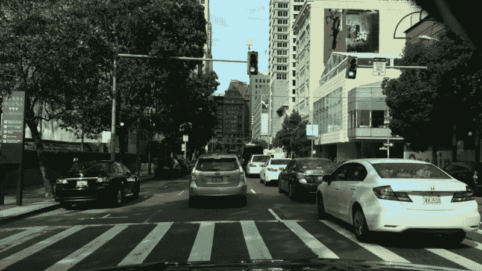

Source: [Nexar challenge](https://challenge.getnexar.com/challenge-1)

上面的图片是我需要预测的三个可能类别的例子:无交通灯(左)，红色交通灯(中)和绿色交通灯(右)。

挑战要求解决方案基于[卷积神经网络](https://en.wikipedia.org/wiki/Convolutional_neural_network)，这是一种非常流行的方法，用于深度神经网络的图像识别。根据模型的准确性以及模型的大小(以兆字节为单位)对提交的内容进行评分。较小的模型得分较高。此外，获胜所需的最低准确率为 95%。

Nexar 提供了 18，659 张标记图像作为训练数据。每张图片都标有上面提到的三个等级中的一个(无红绿灯/红色/绿色)。

### 软件和硬件

我用 [Caffe](http://caffe.berkeleyvision.org/) 训练模特。我选择 Caffe 的主要原因是因为预先训练的模型种类繁多。

Python、NumPy & Jupyter Notebook 用于分析结果、数据探索和特别脚本。

亚马逊的 GPU 实例(g2.2xlarge)用于训练模型。我的 AWS 账单最后变成了 **$263** (！).不便宜。？

我用来训练和运行模型的代码和文件都在 [GitHub](https://github.com/davidbrai/deep-learning-traffic-lights) 上。

### 最终分类器

最终的分类器在 Nexar 的测试集上取得了 **94.955%** 的准确率，模型大小为~ **7.84 MB** 。为了比较，[谷歌网](https://arxiv.org/abs/1409.4842)使用 41 MB 的模型大小， [VGG-16](http://www.robots.ox.ac.uk/~vgg/research/very_deep/) 使用 528 MB 的模型大小。

Nexar 好心接受 94.955%作为通过最低要求的 95%？。

获得更高精度的过程涉及大量的反复试验。其中一些有其背后的一些逻辑，而一些只是“也许这将工作”。我将描述我试图改进模型的一些事情，这些事情有帮助，也没有帮助。最后的分类器细节将在后面描述。

### 什么奏效了？

#### [迁移学习](http://cs231n.github.io/transfer-learning/)

我开始尝试对一个模型进行微调，这个模型已经在 ImageNet 上用 [GoogLeNet](https://github.com/BVLC/caffe/tree/master/models/bvlc_googlenet) 架构进行了预训练。这让我很快达到了> 90%的准确率！？

Nexar 在[挑战页面](https://challenge.getnexar.com/challenge-1)中提到，通过微调 GoogLeNet 应该可以达到 93%。不太确定我哪里做错了，我可能会调查一下。

#### [squeeze](https://arxiv.org/abs/1602.07360)

> SqueezeNet: AlexNet 级精度，参数少 50 倍，模型大小< 0.5MB。

因为竞赛奖励使用小模型的解决方案，所以早期我决定寻找一个参数尽可能少但仍能产生好结果的紧凑网络。大多数最近发表的网络都很有深度，并且有很多参数。 [SqueezeNet](https://arxiv.org/abs/1602.07360) 似乎非常适合，它也有一个在 ImageNet 上训练过的预训练模型，在[咖啡馆](http://caffe.berkeleyvision.org/)的[模型动物园](https://github.com/BVLC/caffe/wiki/Model-Zoo)里可以找到，这派上了用场。

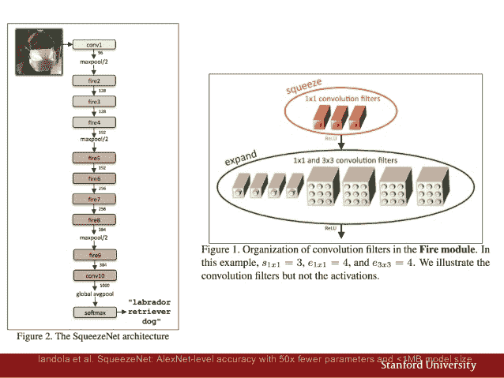

SqueezeNet network architecture. [Slides](http://www.slideshare.net/embeddedvision/techniques-for-efficient-implementation-of-deep-neural-networks-a-presentation-from-stanford)

该网络通过以下方式保持紧凑:

*   主要使用 1x1 卷积滤波器和一些 3x3 滤波器
*   减少 3×3 滤波器的输入通道数量

更多细节，我推荐阅读 Lab41 的这篇[博文](https://gab41.lab41.org/lab41-reading-group-squeezenet-9b9d1d754c75#.oprbydtxv)或者[的原创论文](https://arxiv.org/abs/1602.07360)。

在反复调整学习率之后，我能够微调预训练模型以及从头开始训练，结果准确率达到 92%！非常酷！？

#### 旋转图像

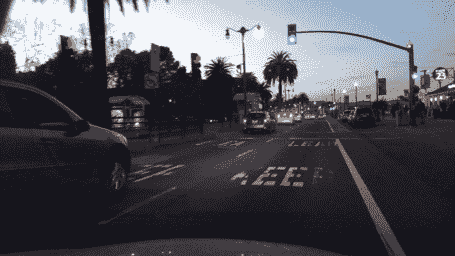

Source: Nexar

大多数图像是水平的，如上图所示，但大约 2.4%是垂直的，并且有各种“向上”的方向。见下文。

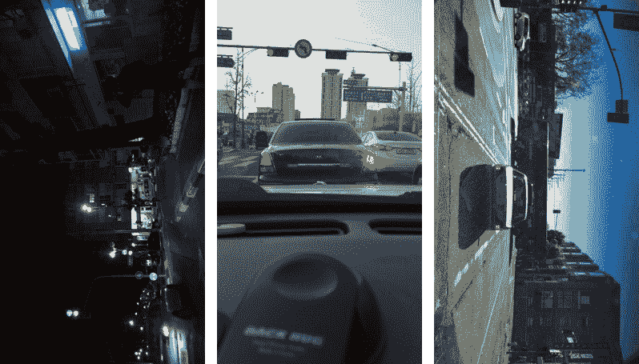

Different orientations of vertical images. Source: [Nexar challenge](https://challenge.getnexar.com/challenge-1)

虽然它不是数据集的主要部分，但我希望模型也能正确地对它们进行分类。

不幸的是，在 jpeg 图像中没有指定方向的 EXIF 数据。起初，我考虑做一些启发式识别天空，并相应地翻转图像，但这似乎并不简单。

相反，我试图使模型对旋转不变。我的第一次尝试是用 0，90，180，270 的随机旋转来训练网络。没用吗？。但是当平均每幅图像的 4 次旋转的预测时，有所改善！

92% → 92.6% ?

澄清一下:我说的“平均预测”是指平均模型在 4 种图像变化中产生的每一类的概率。

#### 过采样作物

在训练过程中，SqueezeNet 网络首先默认对输入图像进行随机裁剪，我没有改变它。这种类型的数据扩充使网络更好地泛化。

类似地，在生成预测时，我对输入图像进行了多次裁剪，并对结果进行了平均。我用了 5 种作物:4 个角和一个中心作物。为此，通过使用现有的 [caffe 代码](https://github.com/BVLC/caffe/blob/master/python/caffe/classifier.py)，实现是免费的。

92% → 92.46% ?

旋转图像和过采样作物显示出非常轻微的改善。

#### 学习率较低的额外培训

在某一点之后，所有的模型都开始过度拟合。我注意到了这一点，因为我看到验证集的损失在某个时候开始上升。

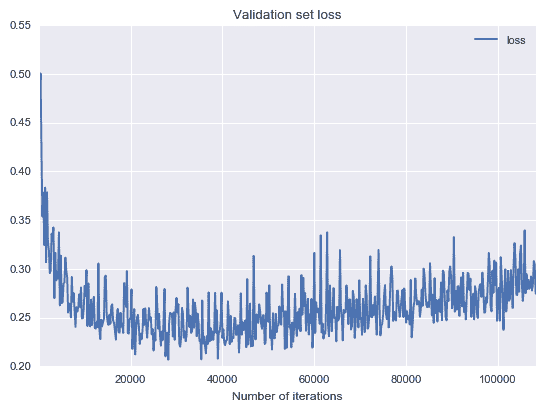

Validation loss rising from around iteration 40,000

我在那一点上停止了训练，因为这个模型可能不再通用了。这意味着学习率没有时间一路衰减到零。我尝试在模型以比原始模型低 10 倍的学习率开始过度拟合的地方恢复训练过程。这通常会将精确度提高 0-0.5%。

#### 更多训练数据

首先，我将我的数据分成 3 组:训练(64%)、验证(16%)和测试(20%)。过了几天，我觉得放弃 36%的数据可能太多了。我合并了训练和验证集，并使用测试集来检查我的结果。

我用“图像旋转”和“较低速率下的额外训练”重新训练了一个模型，看到了改进:

92.6% → 93.5% ?

#### 重新标记训练数据中的错误

当分析分类器在验证集上的错误时，我注意到一些错误有很高的可信度。换句话说，模型确定是一回事(例如绿灯)，而训练数据说的是另一回事(例如红灯)。

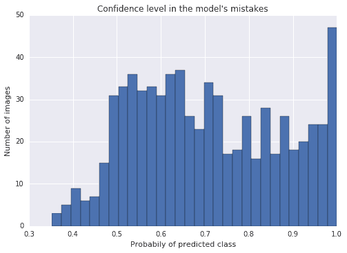

请注意，在上面的图中，最右边的条形相当高。这意味着有超过 95%置信度的大量错误。当近距离检查这些案例时，我发现这些错误通常是在训练集的基本事实中，而不是在训练模型中。

我决定在训练集中修复这些错误。原因是这些错误混淆了模型，使其更难推广。即使最终的测试集在基本事实上有错误，一个更一般化的模型有更好的机会在所有图像上获得高精度。

我手动标记了 709 张我的一个模型出错的图片。这改变了 709 张照片中 337 张的真相。用一个 [python 脚本](https://github.com/davidbrai/deep-learning-traffic-lights/blob/14749dacf75318842f45fc5a9900c300eb83755f/analysis/label_misses.py)花了大约一个小时的手工工作来帮助我提高效率。

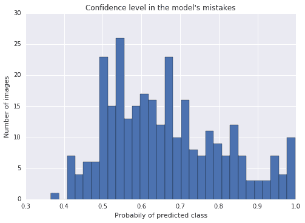

上面是重新标记和重新训练模型后的相同情节。看起来更好！

这通过以下方式改进了以前的模型:

93.5% → 94.1%

#### 模型集合

同时使用几个模型并对它们的结果进行平均也提高了精确度。我在参与集合的模型的训练过程中试验了不同种类的修改。通过使用从零开始训练的模型(即使该模型本身具有较低的准确性)以及在预训练模型上微调的模型，实现了显著的改进。也许这是因为这个模型学习了不同于那些在预训练模型上微调的特征。

集成使用了 3 个模型，准确率分别为 94.1%、94.2%和 92.9%，总准确率为 94.8%。？

### 什么没用？

很多东西！？希望这些想法中的一些可以在其他环境中有用。

#### 打击过度装配

在试图处理过度拟合时，我尝试了几种方法，但都没有产生显著的改善:

*   增加网络中的辍学率
*   更多数据扩充(随机移动、缩放、倾斜)
*   基于更多数据的培训:使用 90/10 分割而不是 80/20 分割

#### 平衡数据集

数据集不是很平衡:

*   19%的图像被标注为没有红绿灯
*   53%红光
*   28%绿光。

我试图通过对不常用的类进行过采样来平衡数据集，但没有发现任何改进。

#### 分离白天和黑夜

我的直觉是，白天和晚上识别交通灯是非常不同的。我想也许我可以通过把它分成两个更简单的问题来帮助这个模型。

通过观察图像的平均像素强度，很容易将图像分为白天和夜晚:

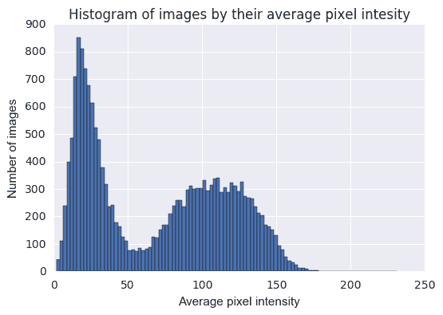

您可以看到具有低平均值的图像的非常自然的分离，即在夜间拍摄的暗图像和在白天拍摄的亮图像。

我尝试了两种方法，都没有改善结果:

*   为白天图像和夜晚图像训练两个独立的模型
*   训练网络预测 6 节课，而不是 3 节课，同时预测是白天还是晚上

#### 使用更好的 SqueezeNet 变体

我用 SqueezeNet 的两个改进版本做了一点试验。第一个使用[剩余连接](https://github.com/songhan/SqueezeNet-Residual)，第二个使用[密集→稀疏→密集](https://github.com/songhan/SqueezeNet-DSD-Training)训练进行训练(更多细节在论文中)。运气不好。？

#### 交通灯的本地化

在看了 deepsense.io 关于他们如何赢得鲸鱼识别挑战的一篇很棒的[帖子](http://deepsense.io/deep-learning-right-whale-recognition-kaggle/)后，我试图训练一个定位器，即首先识别图像中交通灯的位置，然后在图像的一小块区域上识别交通灯状态。

我用 [sloth](http://sloth.readthedocs.io/en/latest/) 注释了大约 2000 张图片，花了几个小时。当试图训练一个模型时，它很快就会过度拟合，可能是因为没有足够的标记数据。如果我给更多的图片添加注释，也许这能行得通。

#### 在困难情况下训练分类器

我选择了 30%的“较难”的图像，我的分类器对这些图像的置信度低于 97%。然后我试着在这些图像上训练分类器。没有改善。？

#### 不同优化算法

我很快就用 Caffe 的 Adam 解算器代替 SGD 进行了实验，学习速度线性下降，但没有看到任何改进。？

#### 向集合添加更多模型

由于合奏法被证明是有帮助的，我试着加倍下注。我试图改变不同的参数来产生不同的模型，并将它们添加到集合中:初始种子，辍学率，不同的训练数据(不同的分割)，训练中的不同检查点。这些都没有带来任何显著的改善。？

### 最终分类器详细信息

该分类器使用 3 个单独训练的网络的集合。他们给每个类别的概率的加权平均值被用作输出。所有三个网络都在使用 SqueezeNet 网络，但是每个网络都接受了不同的训练。

#### 模型# 1——预训练过采样网络

在重新标记的训练集上进行训练(在修复了基本事实错误之后)。该模型基于在 ImageNet 上训练的 SqueezeNet 的预训练模型进行微调。

训练期间的数据扩充；

*   随机水平镜像
*   在输入网络之前，随机裁剪大小为 227 x 227 的小块

在测试时，对每个图像的 10 个变化的预测进行平均，以计算最终预测。这 10 种变化包括:

*   5 个尺寸为 227 x 227 的裁剪:每个角一个，图像中心一个
*   对于每种作物，还使用了水平镜像版本

验证集上的模型准确率:94.21%
模型大小:~2.6 MB

#### 模型#2 —增加旋转不变性

非常类似于模型#1，增加了图像旋转。在训练期间，图像被随机旋转 90 度、180 度、270 度或者根本不旋转。在测试时，模型#1 中描述的 10 个变体中的每一个都通过将其旋转 90°、180°和 270°产生了另外三个变体。我们的模型对总共 40 个变量进行了分类，并一起进行了平均。

验证集上的模型准确率:94.1%
模型大小:~2.6 MB

#### 模型#3 —从零开始训练

这个模型没有微调，而是*从零开始训练*。其背后的基本原理是，尽管它实现了较低的准确性，但它在训练集上学习了与前两个模型不同的特征，这在用于集成时可能是有用的。

训练和测试期间的数据扩充与模型#1 相同:镜像和裁剪。

验证集上的模型准确率:92.92%
模型大小:~2.6 MB

#### 将模型结合在一起

每个模型输出三个值，代表图像属于三个类别中的每一个的概率。我们使用以下权重对他们的输出进行平均:

*   型号#1: 0.28
*   型号 2: 0.49
*   型号 3: 0.23

权重的值是通过对可能的值进行网格搜索并在验证集上进行测试而得到的。它们可能有点过度适应验证集，但可能不会太多，因为这是一个非常简单的操作。

验证集上的模型准确率:94.83%
模型大小:~ 7.84 MB
Nexar 的测试集上的模型准确率:94.955%？

#### 模型错误的例子

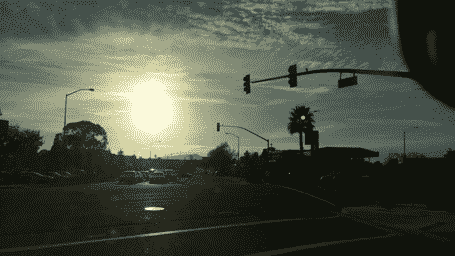

Source: Nexar

眩光在棕榈树上产生的绿点可能使模型错误地预测有绿灯。

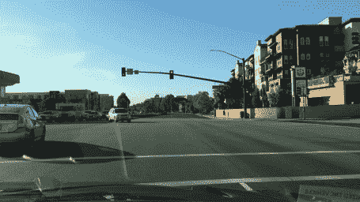

Source: Nexar

模型预测的是红色而不是绿色。当场景中有一个以上的交通灯时，这是一个棘手的问题。

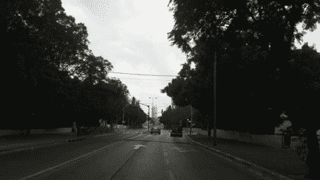

模型说没有红绿灯，而前面有绿灯。

### 结论

这是我第一次把深度学习应用在一个真实的问题上！我很高兴看到它工作得这么好。在这个过程中，我学到了很多东西，我可能会写另一篇文章，希望能帮助新人在我遇到的一些错误和技术挑战上浪费更少的时间。

我要感谢 Nexar 提供了这个巨大的挑战，并希望他们在未来组织更多这样的活动！？

*如果你喜欢阅读这篇文章，请**在社交媒体上分享它！***

*希望在下面得到您的反馈和问题！*