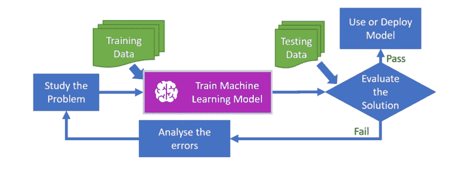

# 根据我的经验，如何在数据科学、人工智能或大数据领域工作

> 原文：<https://www.freecodecamp.org/news/recommendations-for-working-in-data-science-ai-and-big-data-based-on-my-personal-experience-8dbc24be368c/>

理查德·弗里曼博士

# 根据我的经验，如何在数据科学、人工智能或大数据领域工作

2013 年夏天，我面试了一家名为“技术换好”的公司 [JustGiving](https://www.justgiving.com/) 的数据科学和分析团队的领导职位。在采访中，我说我计划在内部和云中提供批处理机器学习、图形分析和流分析系统。

几年后，我以前的老板迈克·布格姆比和我都出现在国际会议上，赢得奖项并成为作家！

以下是我的故事，以及我在旅途中学到的东西——还有我给你的建议。

#### 为什么选择大数据工程和数据科学？

我一直对人工智能(AI)、机器学习(ML)和自然语言处理(NLP)感兴趣。特别是，我对可扩展系统感兴趣，让机器人更加智能，反应更加灵敏。

我对数据工程的兴趣来自于我作为解决方案架构师的背景。在这个职位上，我喜欢构建基于云的系统来存储和处理数据，以获得新的见解和知识。

我还开发大数据和 ML 管道，以自动化整个 ML 流程。这有助于数据科学家和分析师节省时间，为训练和测试他们的算法准备数据，运行指标并大规模导出关键性能指标。

资料准备尤为重要。数据科学家通常将 80%的时间花在这上面。以正确的方式访问数据让他们更有效率、更快乐。

#### 我以前的背景

我之前获得了计算机系统工程硕士学位，以及 ML 和 NLP 博士学位。我在曼彻斯特大学完成了这两个课程。

我没有加入我博士专业领域的专业供应商，而是决定通过加入凯捷来拓展我的技能并获得更多的客户接触。凯捷是一家大型全球咨询、技术和外包服务公司。

我从一名开发人员成长为一名解决方案架构师。在那里，我帮助《财富》全球 500 强公司交付大型项目，涉及保险、零售银行、金融服务和中央政府等领域。

然后我加入了 PageGroup。在那里，我在 34 个国家的全球转型项目中担任首席开发人员和架构师。我负责搜索、多渠道沟通、商业智能、文本分析、工作板集成和广告解决方案的技术交付。

#### 当前角色

现在我是 JustGiving 的首席大数据和机器学习工程师。JustGiving 是一家以技术换公益的公司，已经帮助 164 个国家的 2600 万用户为公益事业筹集了 50 亿美元。它于 2017 年被全球领先的社会公益软件公司 [Blackbaud](https://www.blackbaud.com/) 收购。

我目前负责我们内部数据科学平台 RAVEN 和生产 ML 系统的交付和架构。这些最初是用 Azure 部署的，但后来托管在 AWS 中。我还以数据科学家的身份深入研究可扩展流分析、ML 和 NLP 算法。

我在内部和外部分享与 AWS、流处理、无服务器堆栈、ML 和 NLP 相关的技术经验和知识。我还定期出席行业会议，[开源我的代码](https://github.com/astarwolf)，在[媒体](https://medium.com/@rfreeman)上写技术博客，并为[等 AWS 实时分析时间序列](https://aws.amazon.com/blogs/big-data/analyze-a-time-series-in-real-time-with-aws-lambda-amazon-kinesis-and-amazon-dynamodb-streams/)。

我也是 Starwolf 的独立自由职业顾问和咨询顾问，在云架构、无服务器计算和 ML 方面为组织提供帮助。

### 办公室里典型的一天

JustGiving 本质上仍是一家初创企业，因此没有典型的一天。我参与了各种任务，例如数据和报告需求捕获、设计新的数据管道、调查运营问题、运行数据实验、分析非结构化数据以寻找有用的模式、探索使用数据回答问题的新方法、展示数据故事以及分享我的知识和经验。这意味着我与营销、产品经理和产品分析师密切合作，了解他们的数据需求，以及哪些指标和预测对他们来说是重要的。

与你专业领域之外的人交谈有助于拓宽你的视野，给你一个新的视角，以及你可以运用技能的新领域。

在技术方面，我与工程师、数据分析师、开发人员、商业智能分析师、运营人员和数据科学家合作，支持他们的数据和平台需求。

### 我喜欢工作的事情

我热衷于处理庞大的数据集，因为你面临不同类型的性能、成本和运营问题，这些问题需要你以不同的方式思考，以便扩展你的数据仓库、ETL 流程和算法，以及你如何呈现你的结果。当您遇到数千亿行，并且需要迭代或执行复杂的连接来运行 ML 数据准备查询时，您所知道的关于具有数百万条记录的数据仓库的许多知识就会失去。

构建和运行大规模数据基础设施和分布式模型训练是学术界和工业界的活跃领域。它们正在快速发展，每隔几个月就会推出新的工具。我喜欢以创新的方式使用云解决方案来改进我们的内部数据科学平台，增强我们的业务流程，并使内部和外部用户能够获得数据洞察力。

我发现**许多公司通过使用第三方的网络分析解决方案，而不是建立他们自己的**来放弃他们的能力。然后，这些数据被存储在市场营销或销售部门，很难(如果不可能的话)以原始形式恢复，并且无法流回，例如，阻止您直接在您的产品中进行实时 ML 推荐或预测。

在 JustGiving，我们建立了一个名为 KOALA 的内部网络分析产品，并以 AWS 无服务器堆栈的形式实时提供这些数据。这使我们能够拥有一整套用于内部 ML 培训和分析的数据管道，以及像 MAGPIE 这样允许我们创建实时指标和 insighs 的工具，我们可以将这些指标和 insighs 反馈给用户。

例如，这是 2017 年 5 月曼彻斯特袭击受害者家庭[众筹活动的早期版本。](https://twitter.com/MENnewsdesk/status/867330719420428291)

此外，考拉允许我们从流数据中进行预测。与购买供应商产品相比，这是一个非常划算的解决方案。如果您将它与基于相同 web 流量的供应商解决方案相比较，KOALA 便宜 10 倍，对开发人员更友好，并且我们实时获得原始的流数据，而不是成批获得，或者必须使用一个临时锁定的查询或报告系统。

我也是 Python 的忠实粉丝，并成功地鼓励公司和更广泛的数据管道、ML 和无服务器计算社区采用 Python。为什么是 Python？它有丰富的 ML 库，可以与 pySpark 等扩展，并且易于读/写。

我也喜欢与不同的组织、慈善机构、大学合作，用我的经验和时间回报更广泛的技术社区，比如最近的 [AWS 和英国心脏基金会黑客马拉松](https://twitter.com/richardtfreeman/status/1092832770294984704)。

### 大数据、数据科学和人工智能的未来

我看到越来越多的人在他们的产品和应用程序中使用 ML、实时分析、图形分析和 NLP，而不仅仅是在他们的笔记本电脑上离线使用。随着云提供商提供 ML 和 NLP 应用程序接口(API ),这一趋势正在加速。

对于实时分析，越来越多的消费者对数据更加敏感，也越来越没有耐心。例如，他们想知道现在正在发生什么，看到他们行动的结果，并使用更智能的应用程序和网站来适应他们与他们的互动。

在基础设施方面，我认为 AWS 和 Azure 等公共云中的无服务器计算和平台即服务(PaaS)基础设施变得更加突出。我对无服务器计算中的功能特别感兴趣，因为它们可以在不到 100 毫秒的时间内自动伸缩，高度可用，并且成本低廉。它们的成本很低，因为您只需为代码执行的时间付费，而不是像更传统的云基础设施那样为一台永远在线的机器或容器付费。我甚至展示了您可以使用无服务器堆栈实现大多数现有的基于容器的[微服务模式。](https://www.packtpub.com/application-development/implementing-serverless-microservices-architecture-patterns-video)

与封闭的供应商特定的产品和语言相比，开源框架和编程语言也将继续增长，例如 Apache Spark framework、Python、R、SQL。数据存储和访问也是如此:云存储、数据仓库和数据湖将以更开放的格式存储数据，而不是专有格式，这将通过标准 API 或开放协议更容易访问。

分析非结构化和多媒体数据源的需求也将不断增长，云提供商也将扮演越来越重要的角色。

我们还将看到更多的公司进行转型，从使用由高层少数人凭直觉决定的战略，转向更加以实验为基础、以证据为基础和以数据为导向，正如我的前任首席运营官 Mike Bugembe 在他的书中所描述的那样。例如，新产品或新功能的测试、识别新机会和战略决策将越来越多地来自数据分析、洞察和预测。

**这将需要更多的工作人员参与数据采集、数据准备、使用算法进行实验、数据可视化和展示结果。**

因此，基于创建和培训数据模型的面向数据的新工作将会出现，扰乱一些现有的专业领域，如医疗保健、会计和法律。人工智能、物联网(IoT)和机器人也将取代一些现有的蓝领和白领工作，因此我们需要考虑培训和提高人们的技能，以适应不断变化的环境，并可能引入某种普遍的基本收入。

你可以把它与工业革命时期从农业时代或前工业时代的转变相提并论。要让人工智能起飞，我们需要做两件事:人类工人的成本变得高于人工智能替代品，以及人工智能以可扩展的方式部署。

从更长远来看，量子计算还将在我们如何处理、分析和存储数据方面再次颠覆这个领域，并将改变网络安全、银行和现有人工智能等领域。

### 如何激励人们从事数据科学职业

我认为，让人们对大数据和数据科学感兴趣比过去容易得多，这要感谢谷歌和脸书这样的公司，它们让聪明和在技术领域工作成为时尚。

此外，越来越多拥有公共云中基础架构的年轻灵活的初创公司正在成功地与大型成熟公司竞争并赢得市场份额。雇主需要愿意教育和提升现有员工或毕业生的技能，而不是只招聘拥有现有数据工程或数据科学技能的人。

为了激励现有员工，我们需要展示与他们最相关的好处、用例及数据源，这将使他们更有效率，工作也更轻松。随着更多的数据探索工具可用，IT 或财务以外的其他部门的员工，如客户支持、营销和产品经理，将可以自助获取数据和见解。

对于没有在工业界工作过的人，我认为我们需要从学校开始，然后是大学。非计算机科学学科的教师和讲师可以在各自的领域使数据更加直观和互动。

我认为几乎任何主题都可以受益——例如，即使在英国文学中，你也可以画出人物关系图，以及他们与主题、事件和地点的联系。在历史课中，你可以看到交互式的可视地图和关键事件及其相关性的时间演变图。

### 你会给考虑从事大数据和数据科学工作的人什么建议

无论你是毕业生，已经在一家机构工作，还是没有技术背景，你都可以从分析和理解数据中受益。例如，数据记者通常没有技术或科学背景，但能够进行简单的分析，并为公众创造有趣的数据故事。

这是关于自我激励:当事情进展如此之快时，你可以放眼整个行业，以获得一个总体的理解。但是你也需要把你的精力集中在一个特定的课程或项目上，并完成它。该行业还倾向于将一些改进的旧技术重新包装为新的趋势技术，如网络安全、认知计算、聊天机器人、虚拟现实和深度学习。所以我会跟随你的心去寻找你真正感兴趣的领域，而不是最新的趋势。

在每一个流行趋势的背后，通常都有早期的探索者在那个领域工作和奋斗了多年！

就获取知识而言，现在比过去容易多了。例如，在过去，您必须支付特定供应商的培训费用，还有产品本身的成本。您现在可以免费访问**学习资料**、**数据源**和**工具**，因此没有理由不从今天开始！

对于**学习材料**，大量内容可以在大规模开放在线课程、表格、博客和源代码库中免费获得。同样，你也可以使用许多免费的**数据源**，比如 ML 数据集、开放数据、新闻提要和社交媒体。

外面有许多工具。有些是图形化的，但在我看来，你应该学习用 SQL、Python 或 r 编程。由于 Apache Spark 这样的框架，这三种语言都有能力进行大规模的数据科学研究。我特别喜欢 Python，因为它是一种高效的开发语言，具有可靠的测试框架和众多的数据科学包。

作为一名 ML 工程师或数据科学家，预计会在数据准备上花费大量时间。这是一个需要掌握的重要过程，它涉及到数据的清理、解析、丰富和整形，以便可以在 ML 算法和实验中使用。总的来说，请记住，流程、工具和数据源总是在不断发展，因此没有一次性的独角兽培训课程。你将需要自我激励和开放，以不断学习和适应数据生态系统。

我建议你学习另一种语言，如普通话(11 亿人说)或西班牙语(5 亿人说)，以保持流动性，获得更多的职业机会，并在这个互联的世界中保持竞争力。这也将打开你的思维，让你深入了解其他文化和价值观，以及他们如何使用他们的数据。

云计算还意味着，你不再需要在一个国家有一个实体存在才能在那里运营，所以你需要对跨地区建立系统和分析来自许多国家的数据持开放态度。开始使用协作工具并参与 [tech for good communities](https://medium.com/@rfreeman/using-your-skills-to-get-involved-in-tech-for-good-c43f4e18a947) 。

一些工作和职业将被取代，一些人类的专业知识将被丢失，但我们仍将依赖于数据和算法。例如，一旦无人驾驶交通被广泛采用，并被认为比人类司机更安全、更便宜、更方便，未来几代人可能不希望开车，甚至不希望有驾驶执照。然而，人类仍将参与自动驾驶系统、遥测和物联网数据的创造性分析、生态系统的监督和监控，以及更广泛地参与运输行业和共享经济。

### 摘要

如果你想从事数据科学、ML 或数据工程，业务需求仍然推动着软件开发和分析。考虑您想要计算的将有利于您的业务决策的指标，或者您想要通过实验验证的假设。

你的观众会对你的结果采取什么行动？企业有哪些增长或节约成本的机会？然后再回头看看你需要什么样的数据、模型和基础设施来完成这项任务。我认为好奇、好奇和具有实验精神是重要的品质。

请随时在 LinkedIn 上与我联系，在 T2 Twitter 上关注我，或者给我发信息提出意见和问题。如果你想和我进行更个性化的聊天，根据你的要求，我可以提供 30 分钟的 Skype 通话，提供职业建议或指导，收取少量费用。我还做短期咨询，为在云中构建和运行大数据和数据科学平台的组织提供专家建议和审计服务。