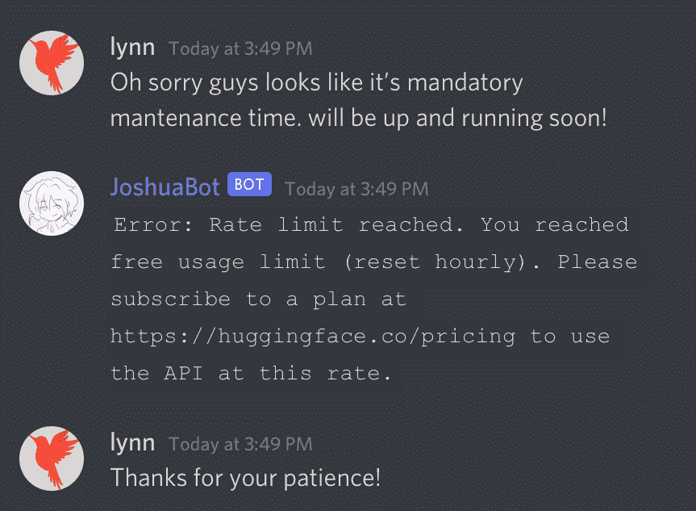
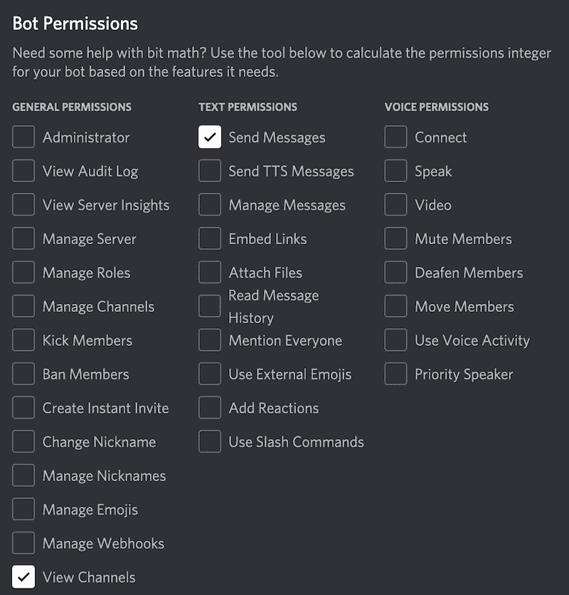
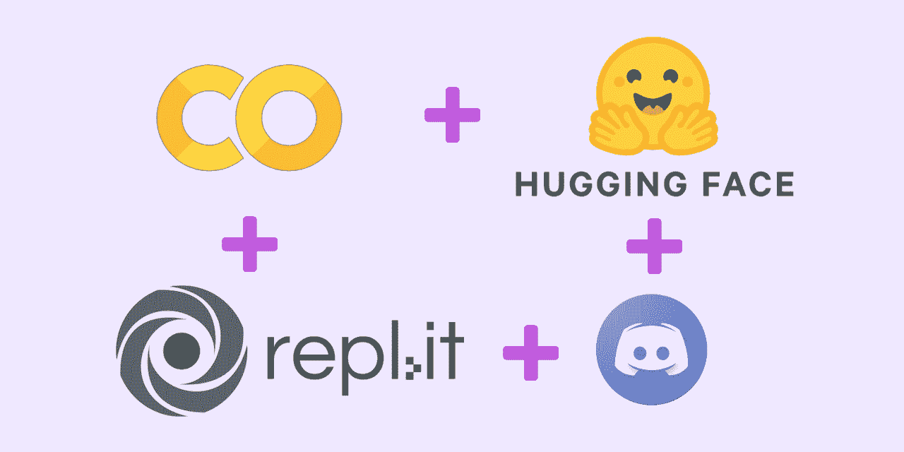

# 如何从部署地狱中恢复——我的 Discord Bot 在一个超过 1000 名用户的服务器上崩溃后学到了什么

> 原文：<https://www.freecodecamp.org/news/recovering-from-deployment-hell-what-i-learned-from-deploying-my-discord-bot-to-a-1000-user-server/>

在我的上一篇博文中，我构建了[一个 Discord AI 聊天机器人，然后，为了挑战自己，我在一个拥有 1000 多名用户的 Discord 服务器上对它进行了压力测试。](https://www.freecodecamp.org/news/discord-ai-chatbot/)

在第一个小时，部署地狱来袭，我不得不关闭机器人进行维护。又过了一个小时，我设法修补了我的机器人，并把它送了回来。

现在，我的机器人已经启动并运行，比以往任何时候都更有弹性。至于我，我幸存下来，甚至在部署地狱中茁壮成长🔥。在这个事后部署中，我将向您展示如何操作。

我在 6 月 2 日下午 2 点将我的 AI 聊天机器人发送到服务器，炒作开始围绕它聚集。聊天持续了一段时间，一切都很顺利。

下午 3:20，一切开始分崩离析:我的自由层 API 键达到了每小时的请求限制，我别无选择，只能关闭 bot 和服务器进行维护。



Never mind the typos in my message 😅 This incident caught me totally unprepared

尽管在我项目第一天的第一个小时就被部署地狱击中，我知道我需要坐下来，深呼吸，并从这个事件中恢复过来。

# 部署进行得顺利吗

作为第一步，我没有忘记祝贺自己，尽管发生了这一不幸，但一切都很顺利。很明显，人们对与我的聊天机器人聊天很热情，以至于我们超过了速率限制。

此外，在我观察人们与我的机器人实时交互的短暂时间里，我发现了几个我有意识、无意识或下意识做出的好的设计选择。

## 在开发过程中不惜一切代价避免特性蔓延

我最初是为一个教程开发我的代码的，所以我尽可能保持我的代码简单易读，没有复杂的功能，这些功能不会服务于我的机器人的主要用例:聊天。

也就是说，我在代码中记下了**todo 和 stretch 目标**，希望在必要时再回到这些目标上。例如:

```
 # TODO: cache chat history in DB and load
 # TODO: after each user input and bot input,
 # append them to conversation history for the next query
 ...
 # FIXME: better make this try-except block more fine-grained
```

当我观察用户与机器人交互时，我实际上松了一口气，因为我没有实现**内存缓存特性**。几个用户同时与机器人交谈，每个人都有自己不同的对话思路。如果我要跟踪对话历史，我必须为每个用户创建一个唯一的日志，这进一步增加了数据库操作的复杂性。

## 遵守最小特权原则

我在计算机安全课上学到的一件事是最小特权原则(PoLP)——授予应用程序完成工作所需的最小访问权限。

我的聊天机器人只需要两个低级别的安全权限:**查看频道**阅读用户消息，**发送短信**回复用户。

当然，我可以给它更多的权限，比如下图所示的权限，以防它需要。但那会违反 PoLP，而且谁知道当我的故障机器人失败时，它是否会带走其他任何东西？



Permission settings for Discord bots

## 部署我的机器人的其他观察

尽管它的寿命短暂，但我的机器人为我提供了一个在现实世界中进行用户研究的机会。这是一个拥有 1000 多名用户的服务器，而不是我和我的朋友们一起闲逛并轮流礼貌地与机器人交换线路的舒适的开发服务器。

在这里，我观察到了几个有趣的用户行为:

*   人们倾向于问机器人**开放式问题**而不是**事实性问题**。因为我基于一个视频游戏角色构建了我的机器人，所以在开发 AI 模型时，我热衷于确保模型学习关于角色的标准信息，如姓名、年龄和游戏中的角色。当我看到人们对机器人角色对冰淇淋口味的偏好比对他们的实际出生地更好奇时，我松了一口气。
*   人们使用很多表情符号:)，表情符号😃和 gif 图片。然而，在人工智能模型的记号赋予器中，这些很可能被当作`<UNKNOWN>`记号，这意味着我应该**净化**用户输入。

我也非常幸运地从服务器上友好的人那里收到了直接的反馈。我收到的一个功能请求是让机器人将其响应附加到用户的消息线程，而不是仅仅将其响应转储到通道中。

人们的热情让我兴奋不已，有了用户研究的深刻见解，我准备修补我的机器人并尽快送回。

# 我需要修复的是

作为一个良好的开发习惯，我保持代码组织良好和模块化，因此从生产机器人切换回开发机器人只需要复制粘贴开发机器人的 API 密钥。

当我在我的开发服务器上运行时，我坐下来确定我需要解决的问题类型。

## 致命的车祸

导致我关闭我的机器人的致命错误是我达到了每小时的 API 速率限制。我采取了在系统中保留冗余的明显方法:保留一个备用的 API 密钥，一旦主密钥用完，就切换到备用密钥，然后在关键时刻再切换回来。

撇开变通办法不谈，我注意到这是一个短期的解决方案。如果我需要适当地扩展我的系统，我应该估计一下每小时的请求数量，这一点我将在本节末尾讨论。

## 可用性的新特性

我决定增加几个新功能，让我的机器人更加用户友好。一些亮点是:

*   正如一些服务器人员建议的那样，我对机器人进行了重新编程，这样它就可以直接响应消息线程中的每个用户消息，而不是将对不同用户消息的响应转储到通道中。
*   我通过删除 Unicode 表情符号和不和谐标签来净化用户输入。这将限制我的 AI 模型将接收的`<UNKNOWN>`令牌，并帮助它生成更好的响应。
*   我实现了一个神奇的命令`$ignore [message]`,允许用户在不触发机器人响应的情况下向频道发送消息。这个特性来自我的观察，每当机器人说一些有趣或聪明的事情(或者两者都有！)，用户将通过向频道发送给他们的朋友(而不是机器人)的文本来评论这一点。对一个朋友说的话，仍然收到机器人的回复，这很烦人。因此，我希望这个神奇的命令能够解决这个用户痛点。
*   我为服务器管理员实现了与我的机器人交互的神奇命令(停止或重启)，这样他们就可以控制机器人，而不必访问我的 Repl.it 服务器。这让我的工作和他们的工作都更容易。

## 面向未来的日志记录

在我的 cozy dev 服务器中，复杂性很小，而在这个 1000 多个用户的服务器上，40%的用户在任何给定的时刻都在线，复杂性爆炸了。

除了我的 bot 专用的聊天通道之外还有多个通道，多个用户角色和权限级别，多个用户同时打字等等。

虽然我肯定不能防止所有可能的失败场景，但我可以做的是用一个 try-except 块保护我的代码的重要部分，并注销所有可能揭示失败原因的信息。由于实时系统的错误很微妙，很难重现，日志记录将省去我很多麻烦。

```
except Exception as e:
            print(e, 'Offending channel', message.channel, 
            'Offending message', message.content, 
            'Offending bot response', bot_response, 
            sep='\n', end='\n\n')
```

## 可量测性

在一些系统约束下进行估计是基本统计和启发式方法的用武之地。拥抱脸的模型推理 API 对我的系统的可伸缩性施加了两个限制:

1.  每小时 10k 令牌(字符)的速率限制，大约是 300 次查询。
2.  自由层帐户每月 30k 令牌配额，约为 900 次查询。

> 想知道我是怎么得到这些数字的吗？好玩的事实:1) [10k 字在 1430 到 2500 字之间](https://capitalizemytitle.com/character-count/10000-characters/)。我们将采取 2100，因为不和谐的信息通常使用简单，简短的话。2) T [一条短信的平均长度是 7 个字](https://crushhapp.com/texting-tidbits/the-average-text-message-length-is-around-7-words)。2100 / 7 = 300 条消息

处理完这些数字后，我在我的机器人首次亮相的第一个小时就达到了每小时的速度限制，这是一个相当了不起的壮举。人们显然对我机智的聊天机器人感到兴奋。🥳

假设炒作消退，生活继续，现在考虑一个假设的场景，20 个用户(服务器上 1000+的 2%)在晚饭后的两个小时内定期与我的机器人聊天，每个人 25 行。这在两个小时内总共产生了 500 个查询(或每小时 250 个)，这意味着我的 bot 不受每小时 300 个查询的限制。

但是，一个月下来，500 * 30 = 15000 次查询，比我的配额 900 多了 15 倍。如果我的机器人真的这么受欢迎，我需要换成更高级别的订阅计划，以确保它仍然可用。

## 从教程代码到产品代码

与我力求简单、易读、有教育意义的教程代码相比，我的产品代码更长、更复杂，但也更健壮。

# 什么是伟大的副业

像我的机器人一样，从部署地狱中走出来后，我比以往任何时候都更有弹性，并对现实世界软件工程中的原则和挑战有了新的见解。

作为最后的总结，我反思了是什么让我的不和谐 AI 聊天机器人如此受欢迎。(6 月 3 日，在它上线 24 小时的一天，它已经打破了我的账户和我从一个朋友那里借来的账户每月 30k 的限额，总计 2000 多条消息。🤓)

我已经完成并润色了各种得到积极反馈的副业项目，但没有一个像这个一样受欢迎。回想起来，不难看出为什么。

在我最引以为豪的项目中，我为[的视觉小说(VN)游戏开发引擎](https://renpy.org/)[开发了一个象棋引擎](https://github.com/RuolinZheng08/renpy-chess)，为[开发了一个节奏游戏引擎](https://github.com/RuolinZheng08/renpy-rhythm)。在发布独立游戏的热门平台 [itch.io](https://itch.io/) 上，两者都被评为 5 星级。

然而，这些项目是开源引擎，旨在让开发者将它们集成到他们的 VN 游戏中，而不仅仅是可以娱乐玩家几个小时的独立游戏。

相比之下，我的 Discord AI 聊天机器人成功地捕捉到了以下每个元素，这些元素将一个**伟大的**辅助项目与一个好项目区分开来:

*   观众:我很幸运拥有这个友好的服务器，有 1000 多名用户愿意尝试这个机器人，并为我提供有用的反馈。
*   可访问性:对于喜欢我的 chabot 的人来说，他们不需要在日常生活中添加任何特别的东西——甚至不需要打开一个新的网络应用程序——他们只是像往常一样登录 Discord，瞧，这个机器人来聊天了！
*   **交互性:**如果没有交互组件，即使是视觉上最惊人的游戏也无法留住玩家的注意力。不过，我的聊天机器人不用担心:就像一个忠实的朋友一样，每当你需要好好聊天的时候，它总是有话要说。

如果你想了解更多关于我从事业余项目的方法，可以看看我之前的博文:

[How I Built My One-Person Project: A Chess Engine for a Popular Game Dev EngineI recently finished one of my summer projects: a chess GUI engine[https://github.com/RuolinZheng08/renpy-chess] built using the Ren’Py VisualNovel Game Development Engine [http://renpy.org/…Lynn ZhengfreeCodeCamp.org](https://www.freecodecamp.org/news/how-i-built-my-one-person-open-source-project/)

也可以看看我的聊天机器人教程！

[How to Build a Discord AI Chatbot that Talks Like Your Favorite CharacterLet’s build an AI model that speaks just like your favorite character and deploy that model as a Discord chatbot. All the coding and deployment happen in the cloud (for free!), so you don’t even need a local IDE to follow along.Lynn ZhengfreeCodeCamp.org](https://www.freecodecamp.org/news/discord-ai-chatbot/)

[https://www.youtube.com/embed/UBwvFuTC1ZE?feature=oembed](https://www.youtube.com/embed/UBwvFuTC1ZE?feature=oembed)

您也可以在 JavaScript 中尝试一下:

[https://www.youtube.com/embed/XR6JFRLxe5A?feature=oembed](https://www.youtube.com/embed/XR6JFRLxe5A?feature=oembed)