# 递归去神秘化

> 原文：<https://www.freecodecamp.org/news/recursion-demystified-99a2105cb871/>

作者:Sachin Malhotra

# 递归去神秘化

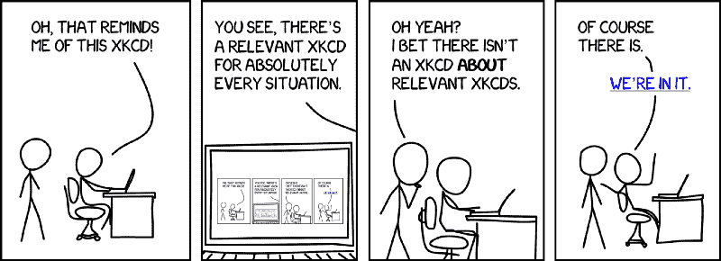

Source: [https://thomaspark.co/wp/wp-content/uploads/2017/01/xkcd.png](https://thomaspark.co/wp/wp-content/uploads/2017/01/xkcd.png)

> 为了理解递归，你必须首先理解递归。

很疯狂，不是吗？

好吧，我希望在这篇文章结束时，你会对什么是递归更有信心，主要是，我们如何提出一个问题的递归解决方案。

### 什么是递归？

你如何向一个 4 岁的孩子解释递归？这是一个非常著名的面试问题，网上有很多答案。这个问题太主流了，我们就不回答了。

如果你和我一样聪明？？你会向比你小一岁的人解释递归。让他们向比他们小一岁的人解释递归。继续下去，直到一个 5 岁的孩子向一个 4 岁的孩子解释递归。完成了。[来源:re [ddit]。](https://www.reddit.com/r/programmerchat/comments/3ua9ie/how_would_you_explain_recursion_to_a_6_year_old/)

用编程术语来说，递归就是

> 调用自身的函数。

上面的函数本身并没有做什么有用的工作，但是它演示了递归。上面的递归关系是

```
T(N) = T(N - 1) + O(1)
```

这仅仅意味着对`random_function(n)`的调用不能继续执行，直到对`random_function(n-1)`的调用完成为止，依此类推。

本质上，我们延迟函数当前状态的执行，直到对同一个函数的另一个调用完成并返回其结果。

编译器现在继续保存函数调用的状态，然后转移到下一个函数调用，依此类推。因此，编译器将函数状态保存到堆栈中，并将其用于计算和回溯。

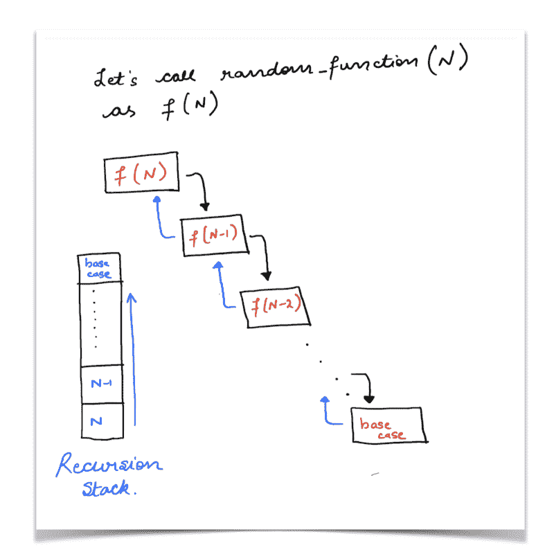

Recursion stack of a set of function calls.

本质上，如果一个问题可以被分解成相似的子问题，这些子问题可以被单独解决，并且它们的解可以被组合在一起得到整体解，那么我们说这个问题可能存在一个递归解。

我们不再拘泥于这个看似陈旧的递归定义，而是着眼于递归的一系列应用。希望事情会变得明朗。

### 数字的阶乘

让我们看看如何求出一个数的阶乘。在此之前，我们先来看看一个数的阶乘代表什么，是如何计算的。

```
factorial(N) = 1 * 2 * 3 * .... * N - 1 * N
```

简单地说，一个数的阶乘就是从 1 到数 N 的项彼此相乘的乘积。

我们可以简单地用一个从 1 到 N 的`for`循环，迭代地乘以所有的项，我们将得到给定数字的阶乘。

但是，如果你仔细观察，就会发现一个数的阶乘有一个固有的递归结构。

```
factorial(N) = N * factorial(N - 1)
```

这就像是将计算卸载到另一个函数调用中，对原始问题的一个较小版本进行操作。让我们看看这个关系如何展开，以验证这里的解是否与`for`循环提供的解匹配。

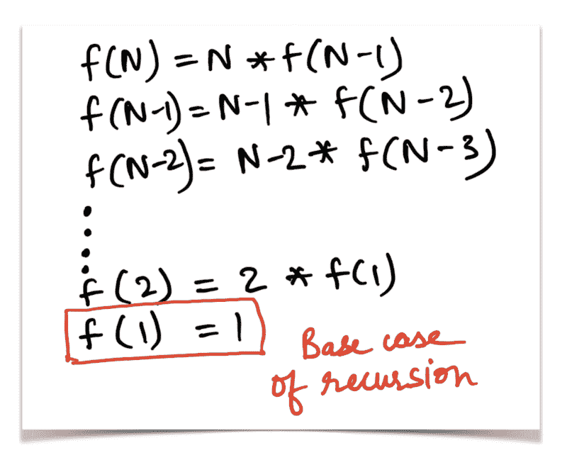

Showing the steps from top to bottom for the factorial recursive function

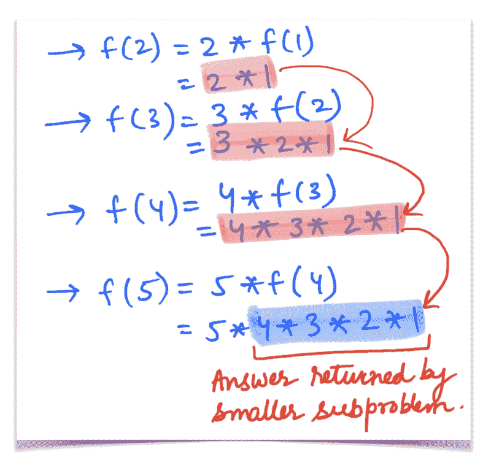

Verification that the recursive function defined produces the correct result

因此，从上面两张图中可以清楚地看出，我们之前定义的递归函数，

```
factorial(N) = N * factorial(N - 1)
```

确实是正确的。看看用于递归查找函数阶乘的 Python 代码片段。

这个例子非常简单。让我们考虑一个稍微大一点但标准的例子来演示递归的概念。

### 斐波那契数列

你一定已经熟悉了著名的斐波那契数列。对于那些以前没有听说过这个序列或者没有看过这个例子的人，让我们来看看。

```
1 1  2   3     5           8                       13 ..... 
```

让我们看看计算 n^th 斐波纳契数的公式。

```
F(n) = F(n - 1) + F(n - 2)where F(1) = F(2) = 1
```

显然，斐波纳契数列的这个定义在本质上是递归的，因为 n^th 斐波纳契数依赖于前两个斐波纳契数。这意味着将问题分成更小的子问题，因此就有了递归。看看这个的代码:

每个递归问题都必须具备两个必要条件:

1.  定义问题状态的递归关系，以及如何将主问题分解成更小的子问题。这也包括停止递归的基本情况。
2.  一个递归树，展示了对所考虑的函数的前几个(如果不是全部的话)调用。看看斐波那契数列递归关系的递归树。

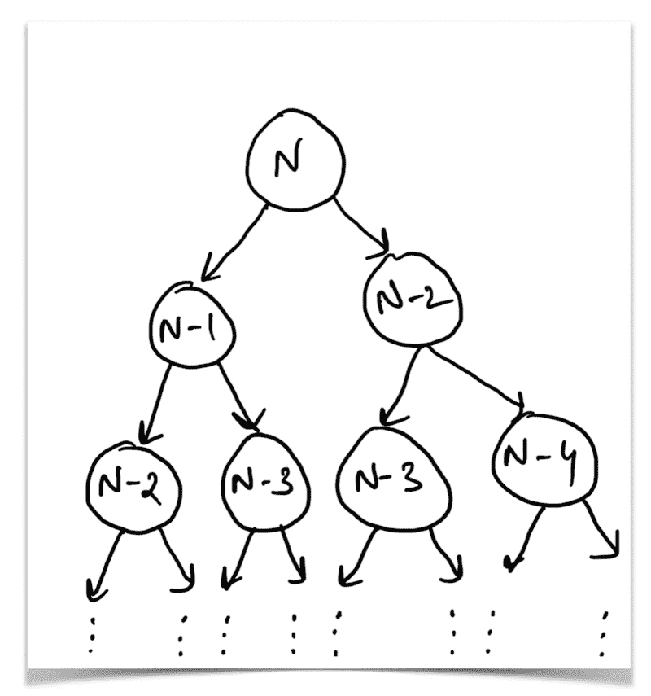

Recursion tree showing the sequence of calls for the fibonacci recurrence relation.

递归树向我们展示了从处理根 N 的两个子树中获得的结果可以用于计算以 N 为根的树的结果。

这个递归树的叶子是`fibonacci(1)`或`fibonacci(2)`，两者都代表这个递归的基本情况。

现在我们已经对递归有了非常基本的了解，什么是递归关系，递归树，让我们来看一些更有趣的东西。

例子！

我坚信，要想成为编程领域的大师，就必须解决大量关于任何给定主题的例子。我们考虑的两个例子(一个数的阶乘和斐波那契数列)有很好定义的递归关系。让我们看几个例子，在这些例子中，递归关系可能不那么明显。

### 树的高度

为了使这个例子简单，我们只考虑二叉树。因此，二叉树是一种树形数据结构，其中每个节点最多有两个子节点。树的一个节点被指定为树的根，例如:

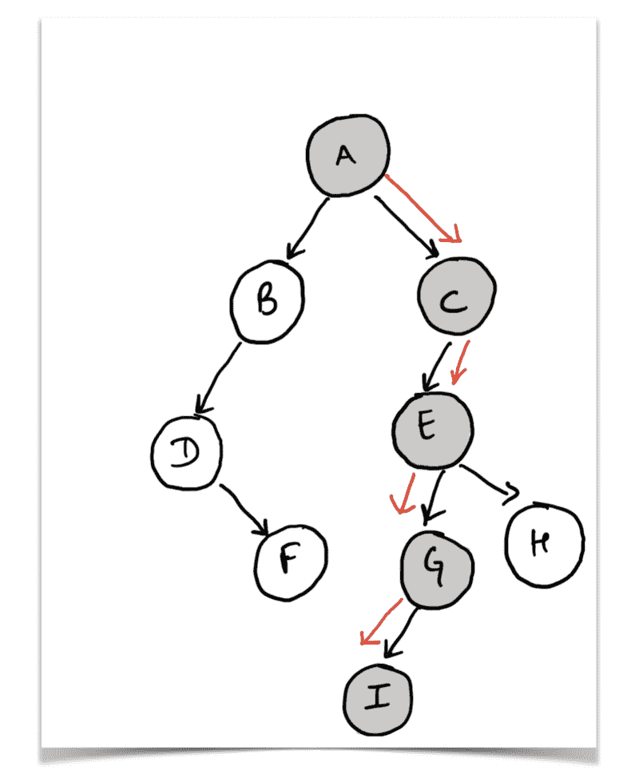

A Tree rooted at ‘A’ with its height and the corresponding path highlighted.

让我们定义二叉树的高度是什么意思。

> 树的高度将是树中最长的根到叶路径的长度。

因此，对于上面显示的示例图，考虑到标记为`A`的节点作为树的根，从根到叶的最长路径是`A → C → E → G → I` 。本质上，如果我们计算节点数，这棵树的高度是`5`，如果我们只计算最长路径上的边数，这棵树的高度是`4`。

现在，忘记整棵树，只关注下图中突出显示的部分。

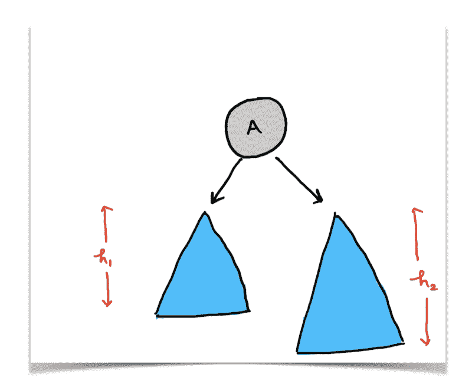

Tree rooted at node A and it’s two subtrees with their respective heights.

上图告诉我们，我们可以用树的子树的形式来表示树。本质上，节点 A 左边的结构和 A 右边的结构本身也是一个二叉树，只是更小，根节点不同。但是，它们仍然是二叉树。

从这两个子树中我们可以得到什么信息来帮助我们找到以 A 为根的主树的高度？

如果我们知道左边子树的高度，比如说`h1`，右边子树的高度，比如说`h2`，那么我们可以简单地说节点 A 的`maximum of the two + 1`将给出我们树的高度。对不对？

形式化这种递归关系，

```
height(root) = max(height(root.left), height(root.right)) + 1
```

这就是二叉树高度的递归定义。这里的重点是二进制，因为我们只使用了由`root.left` 和`root.right.`表示的节点`root` 的两个子节点，但是很容易将这种递归关系扩展到 n 元树。让我们用代码来看看这个。

这里的问题被大大简化了，因为我们让递归为我们做了所有繁重的工作。我们简单地使用子问题的**最优**答案来找到原始问题的解决方案。

让我们看另一个可以在类似行上解决的例子。

### 树中的节点数

这里，为了简单起见，我们将再次考虑二叉树，但是该算法和方法本质上可以扩展到任何种类的树。

这个问题本身是不言自明的。给定二叉树的根，我们需要确定树中节点的总数。这个问题和我们在这里提出的方法与上一个非常相似。我们只需要做很小的改变，我们就会有二叉树的节点数。

看看下面的图表。

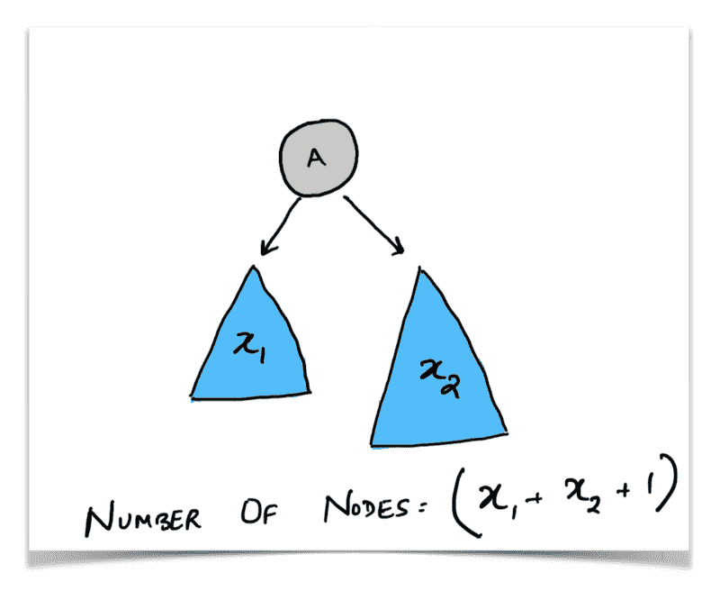

图表说明了一切。我们已经知道一棵树可以被分解成更小的子树。在这里，我们可以问自己，

> 我们能从这两个子树中得到什么信息来帮助我们找到以 A 为根的树中的节点数？

如果我们知道左子树中的节点数和右子树中的节点数，我们可以简单地将它们相加，并为根节点加一，这就给出了节点总数。

将这个形式化，

```
number_of_nodes(root) = number_of_nodes(root.left) +        number_of_nodes(right) + 1
```

如果你看看这个递归和上一个，你会发现它们极其相似。唯一不同的是我们如何处理从子问题中获得的信息，以及我们如何将它们结合起来得到一些答案。

现在我们已经看到了一些关于二叉树的简单例子，让我们来看一些不那么琐碎的事情。

### 合并排序

给定一组数字，比如

```
4 2 8 9 1 5 2
```

我们需要想出一种排序技术，以升序或降序对它们进行排序。有很多著名的排序技术，比如[快速排序](https://en.wikipedia.org/wiki/Quicksort)、[堆排序](https://en.wikipedia.org/wiki/Heapsort)、[基数排序](https://en.wikipedia.org/wiki/Radix_sort)等等。但是我们将特别关注一种叫做合并排序的技术。

可能你们很多人都熟悉[分而治之的范例](https://en.wikipedia.org/wiki/Divide_and_conquer_algorithm)，这可能会觉得多余。但是请容忍我，继续读下去！

这里的想法是把它分解成子问题。

这就是文章的内容，对吗？？

如果我们有两个排序后的原始数组。我们可以用它们来排序整个数组吗？

这是这里的主要思想。对数组进行排序的任务可以分解为两个更小的子任务:

*   对数组的两个不同部分进行排序
*   然后使用那些排序后的一半来获得原始排序后的数组

现在，递归的美妙之处在于，你不需要担心我们如何得到排序后的两半，以及其中的逻辑是什么。由于这是递归，对`merge_sort`的相同方法调用将为我们排序两半。我们所需要做的是，一旦我们有了分类后的收获，就专注于我们需要做的事情。

让我们看一下代码:

在这一点上，我们信任并依赖我们的好朋友递归，并假设`left_sorted_half`和`right_sorted_half`实际上将包含原始数组的两个排序的一半。

那么，接下来呢？

问题是如何以某种方式组合它们以给出整个数组。

现在问题简单地归结为将两个排序后的数组合并成一个。这是一个非常标准的问题，可以通过所谓的“两指方法”来解决。

看一下伪代码，以便更好地理解。

```
let L and R be our two sorted halves. let ans be the combined, sorted array
```

```
l = 0 // The pointer for the left halfr = 0 // The pointer for the right halfa = 0 // The pointer for the array ans
```

```
while l < L.length and r < R.length {      if L[l] < R[r] {           ans[a] = L[l]           l++       } else {           ans[a] = R[r]           r++      }}
```

```
copy remaining array portion of L or R, whichever was longer, into ans.
```

这里我们有两个指针(手指),我们把它们放在每一半的开始。我们检查哪个更小(也就是手指指向的哪个值更小)，我们将那个值添加到我们排序的组合数组中。然后，我们向前移动相应的指针(手指)。最后，我们复制较长数组的剩余部分，并将其添加到`ans`数组的后面。

因此，合并排序的组合代码如下:

我们将用递归来做最后一个问题，相信我，这是一个很难的问题，也是一个非常令人困惑的问题。但是在继续之前，每当我必须想到一个问题的递归解决方案时，我将重复我所遵循的步骤。

### 提出递归解决方案的步骤

1.  试着把这个问题分解成子问题。

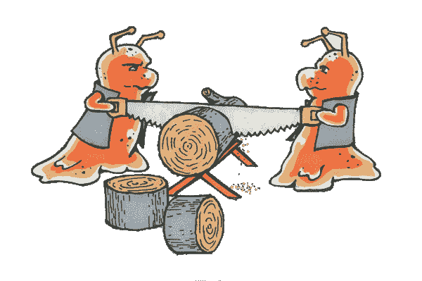

Source: [https://www.weheartswift.com/compute-2-power-n/](https://www.weheartswift.com/compute-2-power-n/)

2.一旦你弄清楚了子问题，想想从调用子问题中得到的什么信息可以用来解决手头的任务。比如`N — 1`的阶乘求`N`的阶乘，左右子树的高度求主树的高度等等。


3.保持冷静，相信递归！假设您对子问题的递归调用将以最佳方式返回您需要的信息。


Source: [https://neildanson.files.wordpress.com/2014/02/keep-calm-it-just-works.png](https://neildanson.files.wordpress.com/2014/02/keep-calm-it-just-works.png)

4.这个过程的最后一步实际上是使用我们刚刚从子问题中获得的信息来找到主问题的解决方案。一旦你有了这些，你就可以编写递归解决方案了。

现在我们已经准备好了所有的步骤，让我们继续讨论本文中的最后一个问题。它叫做[树中距离的总和。](https://leetcode.com/problems/sum-of-distances-in-tree/description/)

### 树中距离的和

让我们看看这个问题要求我们做什么。考虑下面的树。

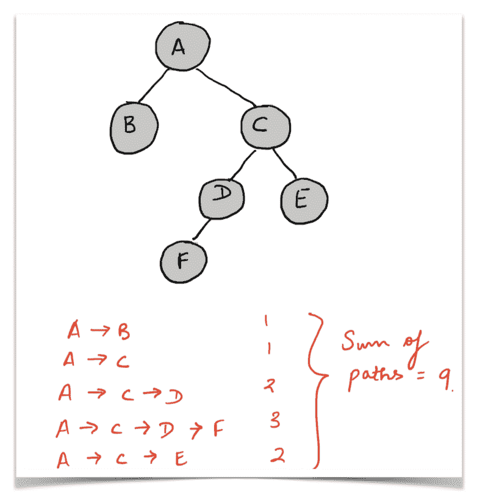

Example tree showing the expected output of our program for the various nodes.

在上面的例子中，节点 A 的路径总数(从`A`到树中每隔一个顶点的**每条路径**上的节点数)是 9。图中提到了各条路径及其各自的长度。

类似地，考虑节点 c 的距离之和。

```
C --> A --> B (Length 2)C --> A (Length 1)C --> D (Length 1)C --> E (Length 1)C --> D --> F (Length 2)Sum of distances (C) = 2 + 1 + 1 + 1 + 2 = 7
```

这就是为单个节点 A 或 c 定义的距离之和，我们需要为树中的每个节点计算这些距离。

在实际解决这个一般性的问题之前，让我们考虑同一问题的一个简化版本。它说我们只需要计算给定节点的距离之和，但我们将只考虑以给定节点为根的树进行计算。

因此，对于节点 C，这个问题的简化版本会要求我们计算:

```
C --> D (Length 1)C --> E (Length 1)C --> D --> F (Length 2)Simplified Sum of Distances (C) = 1 + 1 + 2 = 4
```

这是一个递归处理的简单得多的问题，并且将被证明对解决原始问题是有用的。

考虑下面这个简单的树。

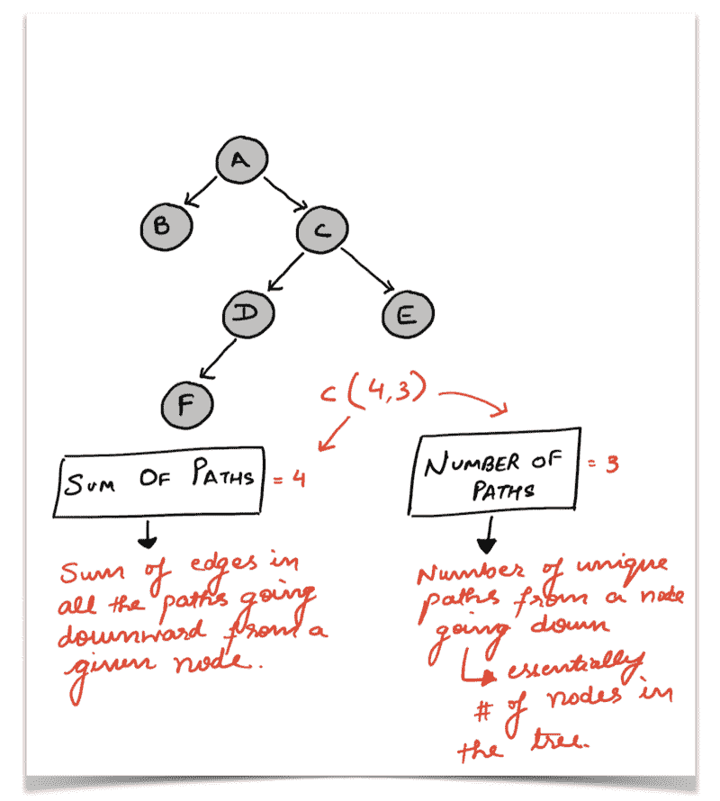

The simple tree we would consider for now. Also mentioned are two values we would be computing for every node.

节点 B 和 C 是根(即 A)的子节点。

我们正在尝试看看我们可以从子问题(子问题)中使用什么信息来计算根`A`的答案。

**注**:这里我们只想计算一个给定的节点 X 到它自己的子树(以节点 X 为根的树)中所有后继节点的路径之和。

没有从节点 B 向下的路径，因此对于该树中的节点`B`,路径的总和是 0。再来看节点`C`。所以这个节点在`F, D and E`有 3 个不同的继任者。距离的总和如下:

```
C --> D (Path containing just 1 edge, hence sum of distances = 1)C --> D --> F (Path containing 2 edges, hence sum of distances = 2)C --> E (Path containing just 1 edge, hence sum of distances = 1)
```

从节点`C`到其所有后代的所有路径之和是 4，并且向下的这种路径的数量是 3。

注意这里的区别。这里的`sum_of_distances`计算每条路径中的边的数量——每条边重复多次，可能是因为它们出现在不同的路径上——不像`number_of_paths`计算路径的数量？。

如果你仔细观察，你会发现向下的路径数总是我们考虑的树中的节点数(除了根)。因此，对于以 C 为根的树，我们有 3 条路径，一条到节点 D，一条到节点 E，一条到节点 f。这意味着从给定节点到后继节点的路径数就是后代节点的总数，因为这是一棵树。所以，没有循环或多条边。

现在，考虑节点 a。让我们看看由于节点 a 而引入的所有新路径。暂时忽略节点 B，只关注与节点 a 对应的子节点 C。我们拥有的新路径集是:

```
A --> C (Path containing just 1 edge, hence sum of distances = 1)A --> (C --> D)    (Path containing 2 edges, hence sum of distances = 2)A --> (C --> E)    (Path containing 2 edges, hence sum of distances = 2)A --> (C --> D --> F) (Path containing 3 edges, hence sum of distances = 3)
```

除了第一条路径`A → C`，所有其他路径都与节点 C 的路径相同，只是我们简单地改变了所有路径，并加入了一个额外的节点`A`。

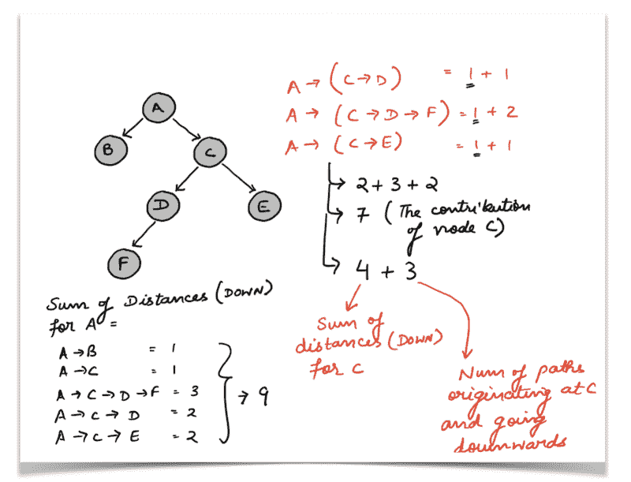

Sum of distances for the node A along with contribution from the node C.

如果你看上面的图表，你会在节点 A、B 和 c 旁边看到一组值。

```
(X, Y) where X is the number of paths originating at that node and going down to the decedents. Y is the sum of distances for the tree rooted at the given node. 
```

由于节点 B 没有任何进一步的子节点，它参与的唯一路径是路径`A -->`；上面 B `to` A 的(5，9)元组。所以我们来说说 c。

c 有三条路通向它的后继者。这三条路径(为 A 扩展了一个节点)也成为从 A 到其后继者的三条路径。

```
N-Paths[A] = (N-Paths[C] + 1) + (N-Paths[B] + 1)
```

就路径数而言，这正是我们正在寻找的确切关系。1 是因为从根到其子节点的新路径，即`A -->`；在我们的例子中。

```
N-Paths[A] = 3 + 1 + 0 + 1 = 5
```

就距离之和而言，看一下图表和我们刚刚写的方程。下面的公式变得非常清楚:

```
Sum-Dist[A] = (N-Paths[C] + 1 + Sum-Dist[C]) + (N-Paths[B] + 1 + Sum-Dist[B])
```

```
Sum-Dist[A] = (3 + 1 + 4 + 0 + 1 + 0) = 9
```

这里主要是`N-Paths[C] + Sum-Dist[C]`。我们总结这些是因为从 C 到它的后代的所有路径最终都成为从 A 到它的后代的路径——除了它们从 A 开始并经过 C，因此每条路径的长度都增加 1。从 C 出发总共有`N-Paths[C]`条路径，它们的总长度由`Sum-Dist[C]`给出。

因此元组对应于 A = (5，9)。我们上面讨论的算法的 Python 代码如下:

#### 被访问的字典的奇怪情况:/

如果仔细观察上面的代码，您会看到:

```
# Prevents the recursion from going into a cycle.        self.visited[vertex] = 1
```

评论说这个`visited`字典是为了防止递归进入循环。

如果你到现在还关注的话，你会知道我们正在处理一个`tree`问题。

树形数据结构的定义不允许循环存在。如果结构中存在循环，那么它就不再是树，而是图。在一棵树中，任何两对顶点之间都只有一条路径。一个循环意味着在一对顶点之间有不止一条路径。看下面的数字。

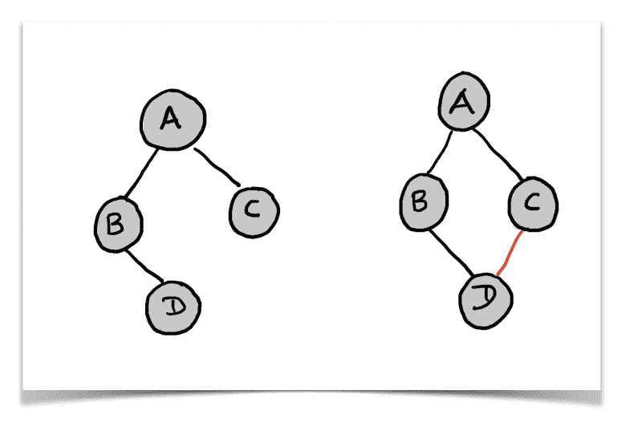

Tree vs Graph. Showing the cycle.

左边的结构是一棵树。它没有循环。任何两个顶点之间都有唯一的路径。

右边的结构是一个图，图中存在一个圈，因此任意一对顶点之间都有多条路径。对于这个图，碰巧任何一对顶点都有不止一条路径。这不是每个图形都需要的。

几乎总是给我们树的`root`节点。我们可以使用根节点来遍历整个树**，而不必担心任何像*这样的循环。***

然而，如果你已经清楚地阅读了问题陈述，它没有陈述任何关于树根的事情。

这意味着问题中给出的树没有指定的根。这可能意味着一棵给定的树可以根据我们所认为的根以许多不同的方式被可视化和处理。看看同一个树的多个结构，但是根节点不同。

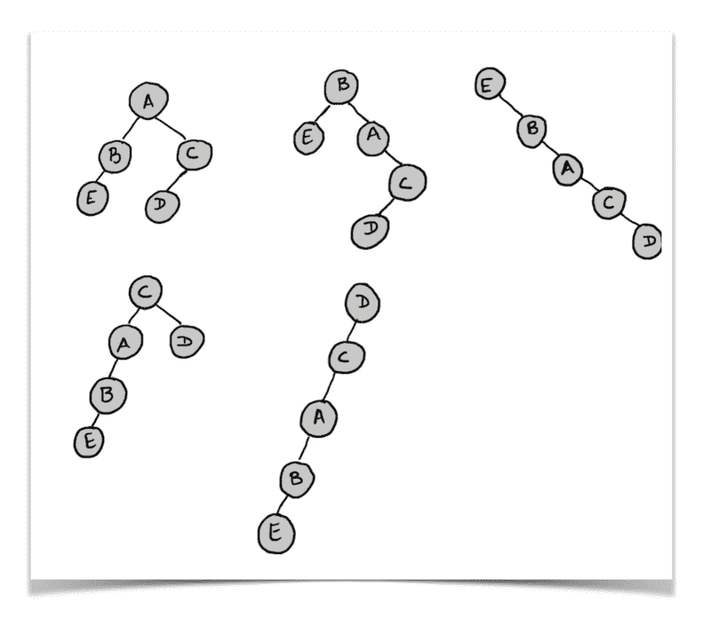

Multiple orientations of the same tree with different roots.

对于给定的**无根树*，可能有许多不同的解释和父子关系。***

因此，我们从节点`0`开始，对给定的结构进行 DFS 遍历。在这个过程中，我们修复了父子关系。给定问题中的边，我们构造一个无向图状结构，并将其转换为树结构。看一看代码应该可以消除您的一些疑虑:

每个节点都有一个父节点。根没有任何父节点，按照这种逻辑，节点`0`将成为我们树的根。请注意，我们不是单独执行这个过程，然后计算`sum of distances downwards`。给定一棵树，我们试图为每个节点找到以该节点为根的树的简化距离和。

因此，从图到树的转换发生在一次迭代中，同时找出每个节点向下距离的总和。

我再次发布了代码，这样`visited`字典现在更有意义了。所以，一个简单的递归就可以完成所有的工作。不错！

#### 将这一切结合在一起

现在我们已经定义了我们的树结构，也为我们定义了`sum of distances going downward`的值，我们可以使用所有这些信息来解决树中距离总和的原始问题[。](https://leetcode.com/problems/sum-of-distances-in-tree/description/)

我们如何做到这一点？最好借助一个例子来解释这个算法。因此，我们将考虑下面的树，我们将对单个节点运行该算法。让我们看看我们将要考虑的树。

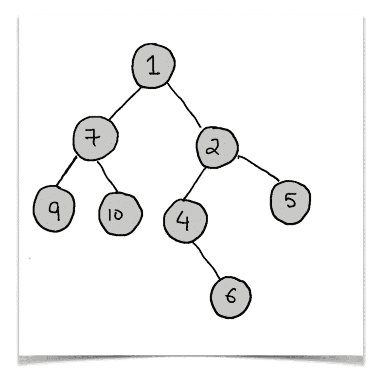

The tree we will be considering for our explanation moving on.

我们想要计算距离和的节点是`4`。现在，如果您记得我们之前试图解决的更简单的问题，您会知道我们已经有了两个与每个节点相关联的值:

1.  `distances_down`即仅考虑*下面的树时，该节点**的距离之和。***
2.  这是以所考虑的节点为根的树中的路径/节点的数量。

让我们看看上面树的注释版本。该树用元组`(distances_down, number_of_paths_down)`进行注释。


Example tree with annotated values for all nodes.

让我们将我们想要为每个节点计算的值称为`sod`，这意味着距离的总和，这是问题最初要求我们计算的。

假设我们已经计算了上图中父节点`4`的答案。因此，我们现在有了标记为`2`(父节点)的节点的以下可用信息:

`(sod, distances_down, number_of_paths_down)` = `(13, 4, 3)`

让我们旋转给定的树，并以一种方式可视化它，其中`2`本质上是树的根。

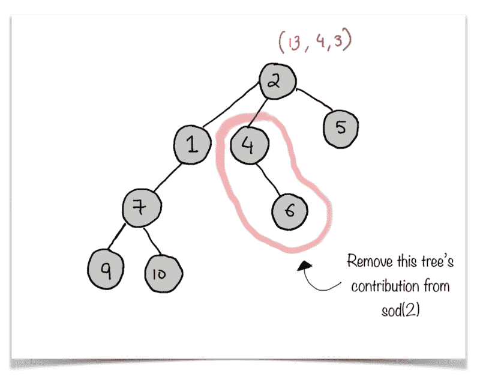

Rotated tree showing the tree rooted at 4 should be removed.

现在，我们想从`sod(2)`中移除根在`4`的树的贡献。让我们考虑从父节点`2`到所有其他节点的所有路径，除了以`4`为根的树中的路径。

```
2 --> 5 (1 edge)2 --> 1 (1 edge)2 --> 1 -->7 (2 edges)2 --> 1 --> 7 --> 9 (3 edges)2 --> 1 --> 7 --> 10 (3 edges)
```

```
Number of nodes considered = 6Sum of paths remaining i.e. sod(2) rem = 1 + 1 + 2 + 3 + 3 = 10
```

让我们看看如何使用我们已经计算过的值来获得这些更新的值。

```
* N = 8 (Total number of nodes in the tree. This will remain the same for every node. )* sod(2) = 13
```

```
* distances_down[4] = 1* number_of_paths_down[4] = 1
```

```
* (distances_down[4] does not include the node 4 itself)N - 1 - distances_down[4] = 8 - 1 - 1 = 6
```

```
* sod(2) - 1 - distances_down[4] - number_of_paths_down[4] = 13 - 1 - 1 - 1 = 10
```

如果你记得我们之前定义的函数，你会注意到一个`child`节点对两个值`distances_down and number_of_paths_down`的贡献分别是`n_paths + 1`和`n_paths + s_paths + 1`。自然，这就是我们减去获得剩余的树。

`sod(4)`表示从上面树中的节点`4`开始的所有路径的边的总和。让我们看看如何利用我们目前计算的信息来找出答案。

`distances_down[4]`代表以节点`4`为根的树的答案，但它只考虑到通向其后继者的路径，即以`4`为根的树中的所有节点。对于我们的例子来说，`4`的后继者是节点`6`。所以，那会直接加到最后的答案里。我们姑且称这个值为`own_answer`。现在，让我们考虑所有其他路径。

```
4 --> 2 (1 edge)4 --> 2 --> 5 (1 + 1 edge)4 --> 2 --> 1 (1 + 1 edge)4 --> 2 --> 1 -->7 (1 + 2 edges)4 --> 2 --> 1 --> 7 --> 9 (1 + 3 edges)4 --> 2 --> 1 --> 7 --> 10 (1 + 3 edges)own_answer = 1
```

```
sod(4) = 1 + 1 + 2 + 2 + 3 + 4 + 4 = 17
```

```
sod(4) = own_answer + (N - 1 - distances_down[4]) + (sod(2) - 1 - distances_down[4] - number_of_paths_down[4]) = 1 + 6 + 10 = 17
```

在你发疯并开始这样做之前，让我们看看代码，并把我们在上面的例子中讨论的所有东西放在一起。

这部分的递归关系如下:

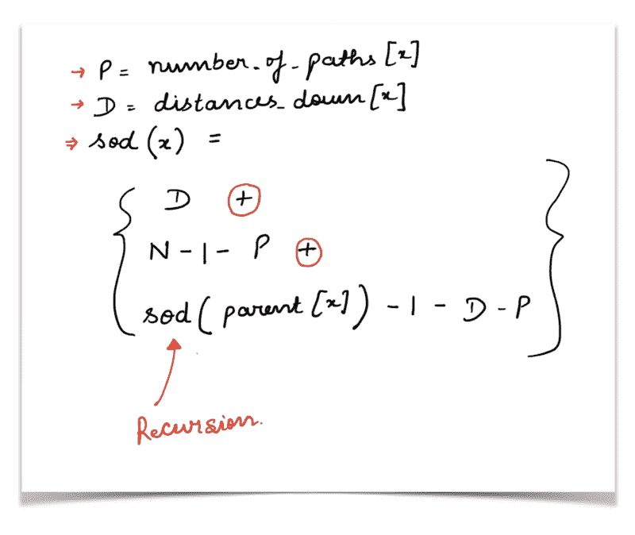

Recursive relation for Sum of Distances, in its totality.

### 我刚才在代码中看到的是“记忆化”吗？

是的，你确实做到了！

考虑以下示例树:

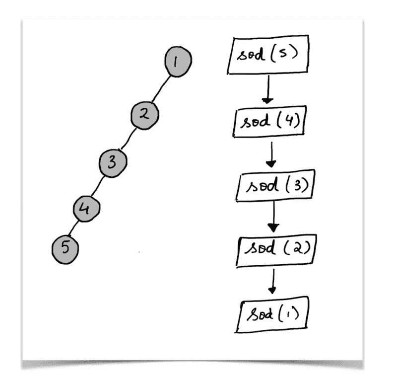

Example of a skewed tree, also recursive calls for the vertex 5

这个问题要求我们找出给定树中所有节点的距离之和。所以，我们会这样做:

```
for i in range(N):    ans.append(find_distances(N))
```

但是，如果您查看上面的树，对节点`5`的递归调用将最终计算树中所有节点的答案。所以，我们不需要一次又一次地重新计算其他节点的答案。

因此，我们最终将已经计算的值存储在一个字典中，并在进一步的计算中使用它。

本质上，递归基于节点的父节点，多个节点可以有相同的父节点。所以，父母的答案应该只计算一次，然后一次又一次地使用。

如果你已经设法读完了这篇文章(不一定一口气读完？)，你就牛逼了？。


Source: [http://doodlecats.com/youre-awesome](http://doodlecats.com/youre-awesome)

如果你觉得这篇文章很有帮助，尽可能多地分享并传播？。干杯！