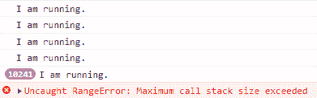
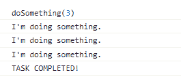

# JavaScript 中的递归是什么？

> 原文：<https://www.freecodecamp.org/news/recursion-in-javascript/>

递归是编程中的一种解决问题的技术。在本文中，您将学习如何在 JavaScript 中使用递归函数。

## 什么是递归函数？

递归函数是在函数体内某处调用自身的函数。下面是一个递归函数的基本例子。

```
function recursiveFunc() {
  // some code here... 
  recursiveFunc()
}
```

如您所见，`recursiveFunc`函数在函数体内调用自己。它将重复调用自己，直到获得所需的输出。

那么如何告诉函数什么时候停止调用自己呢？你可以用一个基本条件来做这件事。

## 递归函数的三个部分

每当你写一个递归函数时，必须有三个元素。它们是:

*   函数定义。
*   基本条件。
*   递归调用。

当这三个元素缺失时，你的递归函数不会像你预期的那样工作。让我们仔细看看每一个。

### 如何定义递归函数

定义递归函数的方式与定义常规 JavaScript 函数的方式相同。

```
function recursiveFunc() {
  // some code here...
} 
```

递归函数与常规 JavaScript 函数的区别在于基本条件和递归调用。

### 什么是基本条件？

当使用递归函数时，基本条件是让函数知道何时停止调用自己。一旦满足基本条件，递归就结束了。

```
function recursiveFunc() {
  if(base condition) {
    // stops recursion if condition is met
  }
  // else recursion continues
  recurse();
}
```

### 为什么需要一个基础条件？

如果没有基本条件，就会陷入无限递归。在这种情况下，您的函数继续不停地调用自己，就像这样:

```
function doSomething(action) {
  console.log(`I am ${action}.`)
  doSomething(action)
}

doSomething("running")
```

此外，如果没有基本条件，您的函数将超过最大调用堆栈。您将遇到如下所示的错误。



Maximum call stack exceeded when there's no base condition

调用堆栈跟踪当前正在运行的函数以及这些函数中的函数。

调用堆栈有限制。由于没有基本条件的递归函数将无限运行，它超出了调用堆栈的限制。

基本条件提供了一种在函数获得期望的输出时爆发的方法。

### 递归函数示例

让我们看一个递归函数的简单例子。

```
function doSomething(n) {
  if(n === 0) {
    console.log("TASK COMPLETED!")
    return
  }
  console.log("I'm doing something.")
  doSomething(n - 1)
}
doSomething(3)
```

下面是将数字`3`传递给`doSomething`函数时的结果。



`doSomething`功能的基本条件是`n === 0`。每当调用该函数时，它首先检查是否满足基本条件。

如果是，则打印`TASK COMPLETED!`。如果没有，它将继续执行函数中的其余代码。在这种情况下，它将打印`I'm doing something.`，然后再次调用该函数。

### 递归调用

递归调用是处理函数再次调用自身的过程。在`doSomething`函数中，递归调用的是下面一行。

```
doSomething(n-1)
```

请注意当函数调用自身时会发生什么。一个新的参数`n - 1`被传递给该函数。在递归调用的每次迭代中，参数将不同于前一次调用的参数。

该函数将一直调用自己，直到新参数满足基本条件。

## 递归与循环

递归和循环的工作方式相似。你写的每一个递归函数都有一个循环的替代解。

例如，您可以使用递归和循环创建一个函数来查找给定数字的阶乘。

### 如何用循环求阶乘:

```
function findFactorial(num) {
  let factorial = 1
  for (let i = num; i > 0; i--) {
    factorial *= i
  }
  return factorial
}

findFactorial(5) // 120
```

为了使用循环找到阶乘，首先用值`1`初始化变量`factorial`。

然后你用给定的数字`num`开始循环。循环将继续运行，直到`i > 0`。

对于每一次迭代，您都要将`factorial`的当前值乘以`i`。并且将`i`的值减 1，直到`i`不大于零。

最后，当循环结束运行时，返回阶乘的值。

### 如何用递归求阶乘:

您可以使用递归函数创建相同的解决方案。

```
function findFactorial(num) {
  if (num === 0) return 1
  let factorial = num * findFactorial(num - 1)
  return factorial;
}

findFactorial(5) // 120
```

首先，你需要一个基础条件`num === 0`。

您还需要递归调用`findFactorial(num - 1)`，以确保当您传递一个新参数`n-1`时，每次调用的数量都在减少。

然后将结果乘以之前的数字`num * findFactorial(num - 1)`，直到满足基本条件。

### 那么递归和循环哪个更好呢？

那么哪个更好呢？这个问题没有对错之分。由你决定。根据你要解决的问题，你可能会选择其中一个。

优化代码的可读性。有时候，就像阶乘的例子一样，递归导致代码更短，可读性更好。

但是递归函数并不总是直观的。如果是这样的话，你应该坚持使用循环。

## 结论

在本文中，您已经学习了什么是递归以及如何用 JavaScript 创建递归函数。

最初，读取和编写递归函数可能会令人困惑。但是请记住，递归函数与常规函数的不同之处在于**基条件**和**递归调用**。

感谢阅读。还有快乐编码！