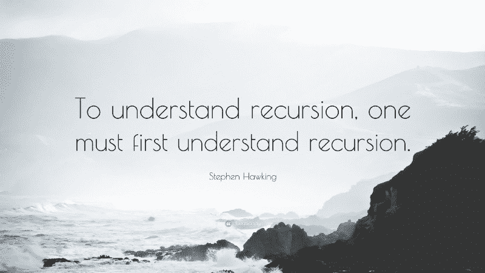
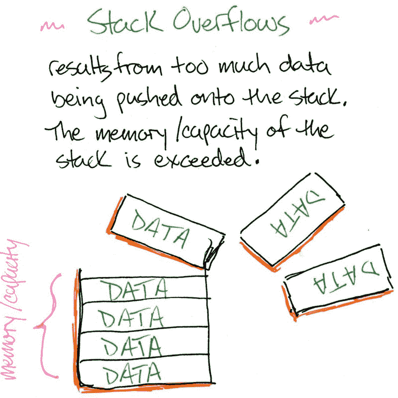
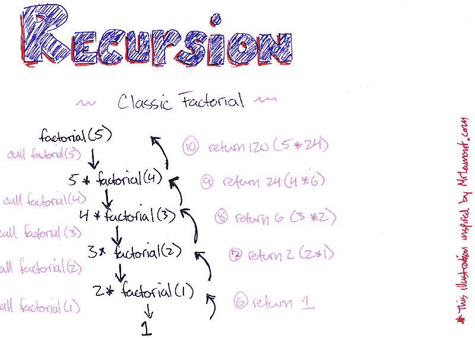

# 递归不难:这种有用的编程技术的逐步演练

> 原文：<https://www.freecodecamp.org/news/recursion-is-not-hard-858a48830d83/>

凯文·特尼

# 递归不难:这种有用的编程技术的逐步演练



我要马上说出来。您知道函数调用时发生的事件吗？没有吗？那我们就从这里开始。

#### 函数调用

当我们调用一个函数时，一个执行上下文被放在执行堆栈上。让我们再细分一下。

一、什么是栈？

堆栈是一种基于“后进先出”的数据结构。一个项被“推入”堆栈以添加到堆栈中，一个项被“弹出”堆栈以移除它。

使用堆栈是一种对特定操作的执行进行排序的方法。

现在，回到什么是执行上下文？执行上下文在函数调用时形成。这个上下文将自己放在一个执行堆栈上，这是一个操作顺序。这个堆栈中总是第一个项目是全局执行上下文。接下来是函数创建的上下文。

这些执行上下文具有属性、激活对象和“this”绑定。“this”绑定是对此执行上下文的引用。激活对象包括:传递的参数、声明的变量和函数声明。

所以每次我们在栈上放置一个新的上下文，我们通常就有了执行代码所需的一切。

为什么我说*通常是*？

对于递归，我们等待来自其他执行上下文的返回值。这些其他上下文位于堆栈的更高层。当堆栈上的最后一项执行完毕时，该上下文将生成一个返回值。这个返回值作为递归事例的返回值传递给下一项。然后，该执行上下文被弹出堆栈。

#### 递归

那么，什么是递归？

递归函数是一种调用自身直到“基本条件”为真并停止执行的函数。

如果为 false，我们将继续将执行上下文放在堆栈的顶部。这可能会发生，直到我们有一个“堆栈溢出”。堆栈溢出是指我们用尽内存来存放堆栈中的项目。



一般来说，递归函数至少有两部分:一个基本条件和至少一个递归事例。

我们来看一个经典的例子。

#### 阶乘

```
const factorial = function(num) {  debugger;  if (num === 0 || num === 1) {    return 1  } else {    return num * factorial(num - 1)  }}
```

```
factorial(5)
```

在这里，我们试图找到 5！(五阶乘)。[阶乘函数](http://mathworld.wolfram.com/Factorial.html)被定义为所有小于或等于其自变量的正整数的乘积。

第一个条件声明:“如果传递的参数等于 0 或 1，我们将退出并返回 1”。

接下来，递归情况说明:

如果参数不是 0 或 1，那么我们将传递值`num`乘以使用`num-1`作为参数再次调用此函数的返回值。

所以如果我们调用`factorial(0)`，函数返回 1，永远不会碰到递归的情况。

这同样适用于`factorial(1)`。

如果我们在代码中插入一个调试器语句，并使用 devtools 逐句通过它并观察调用堆栈，我们可以看到发生了什么。

1.  执行堆栈将 5 作为参数传递给`factorial()`。基本情况是假的，所以输入递归条件。
2.  执行堆栈以`num-1` = 4 作为参数第二次放置`factorial()`。基本情况为假，进入递归条件。
3.  执行堆栈第三次将`factorial()`放置为参数`num-1`(4–1)= 3。基本情况为假，进入递归条件。
4.  执行堆栈第四次放置`factorial()`，将`num-1`(3–1)= 2 作为参数。基本情况为假，进入递归条件。
5.  执行堆栈第五次放置`factorial()`，将`num-1`(2–1)= 1 作为参数。现在基本情况为真，所以返回 1。

此时，我们已经在每次函数调用时将参数减 1，直到达到返回 1 的条件。

6.从这里，最后一个执行上下文完成，`num === 1`，因此函数返回 1。

7.下一个`num === 2`，所以返回值是 2。(1×2).

8.下一个`num === 3`，所以返回值是 6，(2×3)。

到目前为止，我们有 1×2×3。

9.接下来，`num === 4`，(4×6)。24 是下一个上下文的返回值。

10.最后，`num === 5`，(5×24)我们把 120 作为最终值。



递归非常简洁，对吗？

我们可以用 for 或 while 循环做同样的事情。但是使用递归会产生一个可读性更好的优雅解决方案。

这就是为什么我们使用递归解决方案。

很多时候，将问题分解成更小的部分会更有效。把一个问题分成小部分有助于克服它。因此，递归是解决问题的分而治之的方法。

*   子问题比原问题更容易解决
*   子问题的解决方案被组合以解决原始问题

“分治”最常用于遍历或搜索数据结构，如二分搜索法树、图和堆。它也适用于许多排序算法，比如[快速排序](https://www.khanacademy.org/computing/computer-science/algorithms/quick-sort/a/overview-of-quicksort)和[堆排序](https://www.geeksforgeeks.org/heap-sort/)。

让我们来看下面的例子。使用 devtools 从概念上把握何时何地发生了什么。记住使用调试器语句并逐步完成每个进程。

#### 斐波纳契

```
const fibonacci = function(num) {  if (num <= 1) {    return num  } else {    return fibonacci(num - 1) + fibonacci(num - 2)  }}fibonacci(5);
```

#### 递归数组

```
function flatten(arr) {  var result = []  arr.forEach(function(element) {    if (!Array.isArray(element)) {      result.push(element)    } else {      result = result.concat(flatten(element))    }  })  return result}
```

```
flatten([1, [2], [3, [[4]]]]);
```

#### 反转字符串

```
function reverse(str) {  if (str.length === 0) return ''  return str[str.length - 1] + reverse(str.substr(0, str.length - 1))}
```

```
reverse('abcdefg');
```

#### 快速分类

```
function quickSort(arr, lo, hi) {  if (lo === undefined) lo = 0  if (hi === undefined) hi = arr.length - 1
```

```
 if (lo < hi) {    // partition the array    var p = partition(arr, lo, hi)    console.log('partition from, ' + lo + ' to ' + hi + '=> partition: ' + p)    // sort subarrays    quickSort(arr, lo, p - 1)    quickSort(arr, p + 1, hi)  }  // for initial call, return a sorted array  if (hi - lo === arr.length - 1) return arr}
```

```
function partition(arr, lo, hi) {  // choose last element as pivot  var pivot = arr[hi]  // keep track of index to put pivot at  var pivotLocation = lo  // loop through subarray and if element <= pivot, place element before pivot  for (var i = lo; i < hi; i++) {    if (arr[i] <= pivot) {      swap(arr, pivotLocation, i)      pivotLocation++    }  }  swap(arr, pivotLocation, hi)  return pivotLocation}
```

```
function swap(arr, index1, index2) {  if (index1 === index2) return  var temp = arr[index1]  arr[index1] = arr[index2]  arr[index2] = temp  console.log('swapped' + arr[index1], arr[index2], +' in ', arr)  return arr}
```

```
quickSort([1, 4, 3, 56, 9, 8, 7, 5])
```

练习递归技术很重要。对于像树、图和堆这样的嵌套数据结构，递归是无价的。

在以后的文章中，我将讨论与递归相关的尾调用优化和记忆化技术。感谢阅读！

#### 更多资源

[维基百科](https://en.wikipedia.org/wiki/Recursion)

[软件工程](https://softwareengineering.stackexchange.com/questions/25052/in-plain-english-what-is-recursion)

[又一篇好文章](https://www.topcoder.com/community/data-science/data-science-tutorials/an-introduction-to-recursion-part-2/)

[麻省理工学院开放课件](http://web.mit.edu/6.005/www/fa15/classes/10-recursion/)