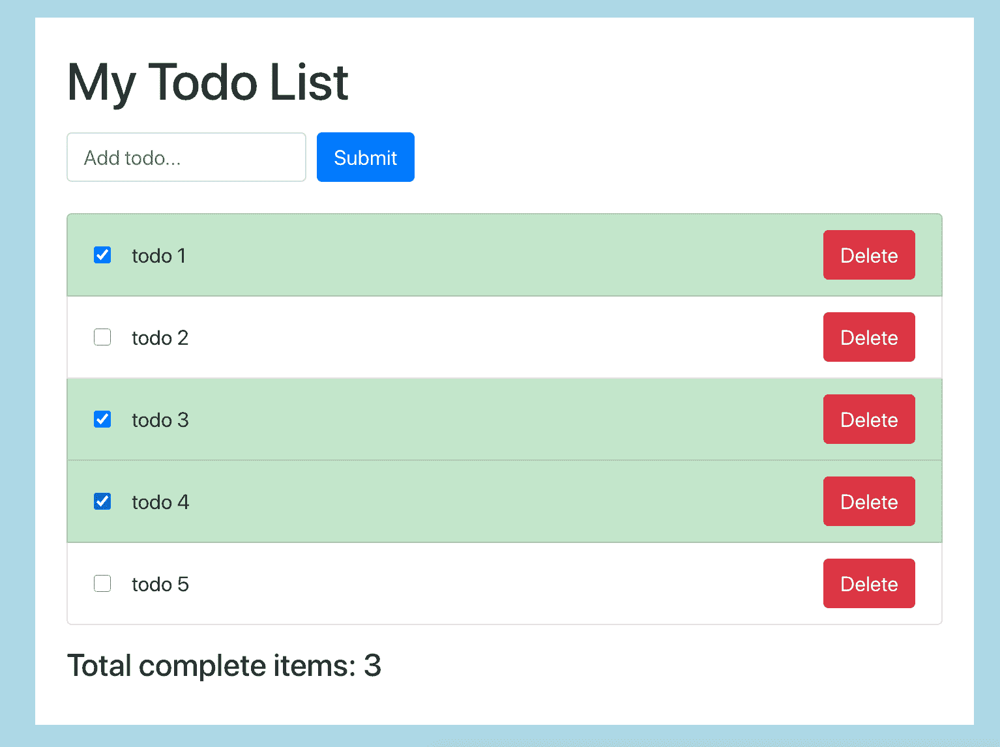
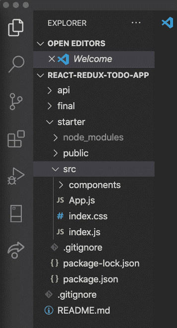
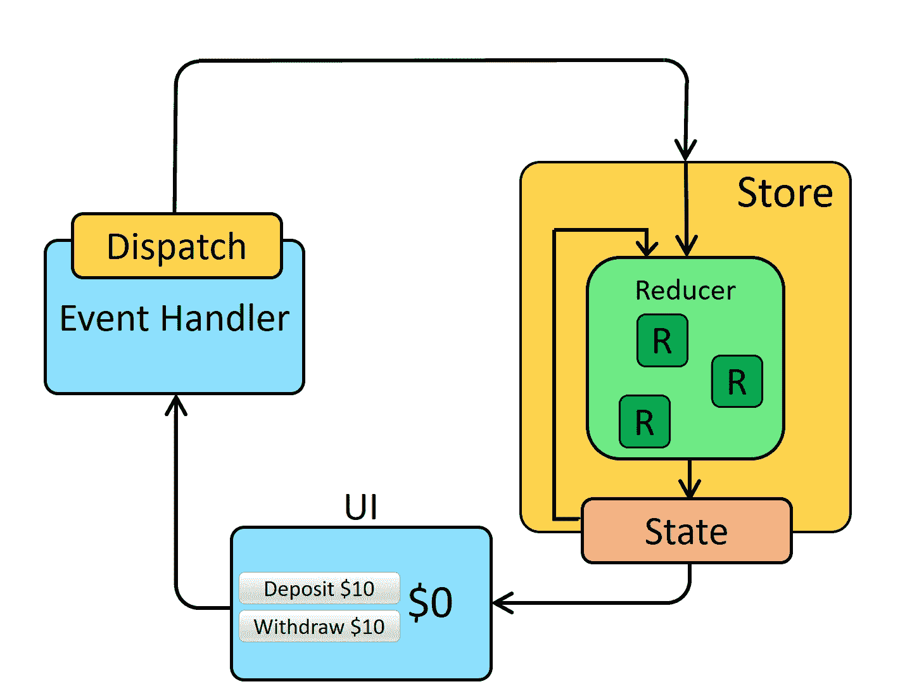
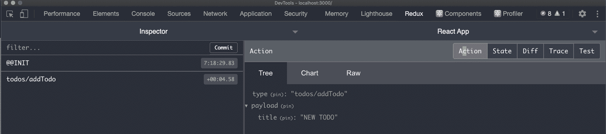
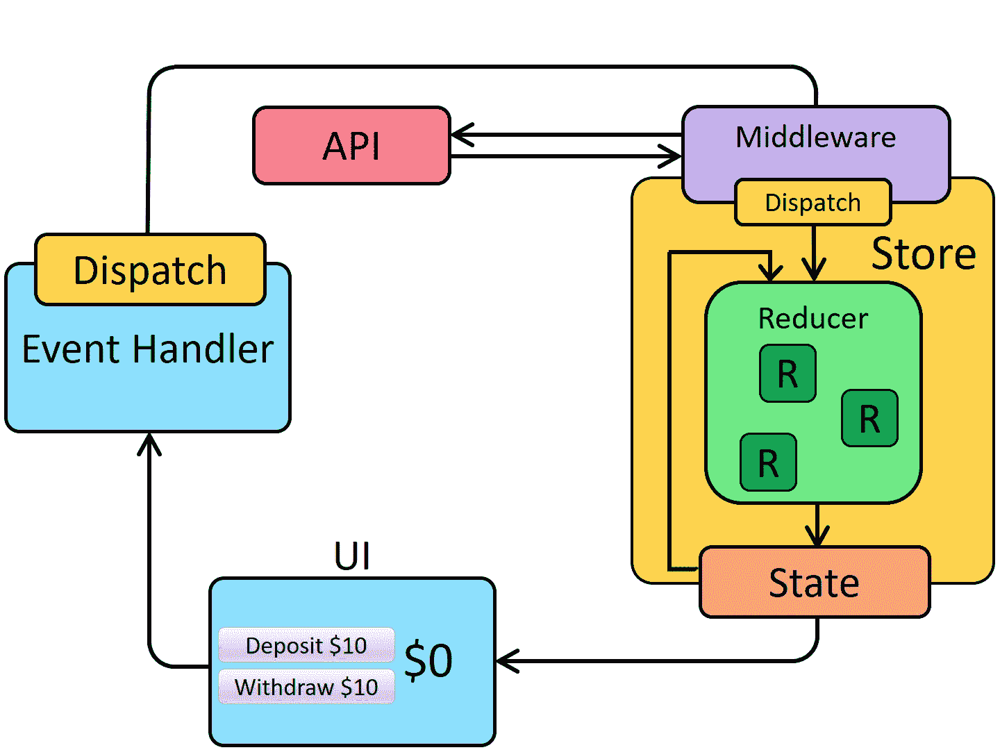
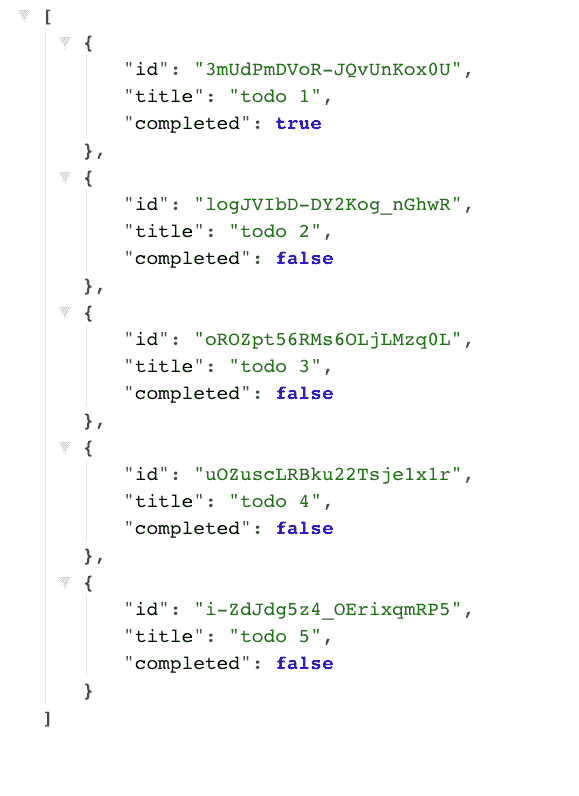

# 初学者的 Redux——学习 Redux 的大脑友好指南

> 原文：<https://www.freecodecamp.org/news/redux-for-beginners-the-brain-friendly-guide-to-redux/>

在这本面向初学者的 Redux 指南中，我们将:

*   了解 Redux 的不同部分以及它们如何协同工作
*   了解如何使用 Redux 从 API 获取数据
*   了解如何使用 Redux Toolkit，使用较少的代码来设置和使用 Redux

我会给你一些挑战，你可以在最后尝试。

## 这是我们要建造的



Yep, its a Todo List! But this one uses Redux which makes it a fancy todo list!

用户可以:

*   添加待办事项
*   移除待办事项
*   将待办事项标记为完成
*   查看已完成的待办事项数量

### 视频漫游

如果你想补充你的阅读(在 YouTube 上)，这里有一个[视频演示](https://www.youtube.com/watch?v=fiesH6WU63I)。

### 源代码

最后可以在这里(GitHub 上)抓取[完成的代码。](https://github.com/chrisblakely01/react-redux-todo-app)

## 获取启动代码

我提供了一些初始代码，为我们提供了一个基本的 React UI，所有组件都已就位。这让我们更加关注事物的冗余面，这也是我们聚集在这里的原因！

让我们从打开终端并运行以下命令开始:

```
git clone https://github.com/chrisblakely01/react-redux-todo-app.git
cd react-redux-todo-app/starter
npm install
npm start 
```

这应该会启动一个浏览器，并启动应用程序。

接下来，在 IDE 中打开`react-redux-todo-app`文件夹(我将使用 VS 代码)。项目树应该如下所示:



你会注意到这里有几个文件夹:

*   API :这是我们将在项目后期学习在 Redux 中使用 API 时使用的 API(多么令人兴奋！)
*   **最终**:这是完成的代码。注意，如果您运行这个，API 也需要启动。参见 GitHub repo 中的**自述文件**了解如何做到这一点
*   如果你决定跟随教程，这就是我们将要工作的文件夹

## Redux 概述

在我们进入代码之前，让我们看看 Redux 的不同部分以及它们是如何协同工作的。

Redux 由**动作**、**减速器**、**状态**和**存储器组成。每样东西都有一个特定的任务。让我们举一个例子:**



[image from redux.js.org](https://redux.js.org/tutorials/essentials/part-1-overview-concepts)

假设我们有一个组件，可以让我们点击一个按钮(上图中的“UI”框)存入一些钱。

当我们点击一个按钮时，我们通常会调用一个函数来处理这个事件。这是我们将分派一个动作的地方。

**调度**是 Redux 给我们的一个功能，让我们**触发动作**。

**动作**包含一个**型**，和一个**有效载荷**。该类型通常只是一个带有操作名称的字符串。有效载荷包含我们需要了解的数据。例如，我们不能在不知道金额的情况下存任何钱

**存储**接收动作，并负责保持状态。可以把它想象成一个数据库，在某种意义上，它把我们所有的数据保存在一个地方

商店还负责基于动作和当前状态更新状态，这是通过使用**reducer**来完成的。

一个**缩减器**听起来很奇特，但它只是一个从存储和动作中获取当前状态的函数。它将事物结合在一起并返回新的状态。

把它想象成一个传送带——它带走旧的状态和动作，做一些工作，然后吐出新的状态。

然后，存储保存这个从 reducer 返回的新状态，并将状态传递给组件。这将导致它们重新呈现，显示新数据。

### 为什么我们需要所有这些？

想象一下，一个应用程序有数百甚至数千个组件。传递状态并记住哪个组件正在改变状态，它是如何改变状态的，等等，这将变得很笨拙。

通过像这样分解事物，我们给不同的事物赋予不同的责任，我们把所有的状态保持在一个地方。

这让我们更容易理解，也更容易测试。例如，你可以单独测试 reducers，因为它们只是纯函数。我们可以测试我们的动作是否正确调度，以及我们的存储是否正确保存了状态。

## 如何配置我们的商店

我们将使用 Redux toolkit 来设置让 Redux 工作所需的所有东西，从商店开始。

在 **src** 文件夹中创建一个名为 **redux 的新文件夹。**在该文件夹中创建一个名为 **store.js、**的文件，并添加以下代码:

```
import { configureStore } from '@reduxjs/toolkit';

export default configureStore({
	reducer: {},
}); 
```

configure store 函数为我们完成了所有困难的工作。它创建了保存我们的状态的存储，合并了我们的 reducers，并且有一些内置的中间件，我们以后会用到。

configureStore 函数返回一个我们可以导出的存储(第 3 行)。这使我们能够将商店链接到我们的应用程序，我们马上就会这样做。

我们需要将我们的 reducers 传递给 configureStore 函数，这是通过传递一个对象来实现的。

我们还没有创建任何减速器，但是我们可以在这里创建任意数量的减速器。

### 如何将商店连接到应用程序

我们有一个商店，我们有一个应用程序，所以让我们把这两件事结合起来！

打开 **index.js** 并用以下内容更新它:

```
import React from 'react';
import ReactDOM from 'react-dom';
import './index.css';
import App from './App';
import store from './redux/store';
import { Provider } from 'react-redux';

ReactDOM.render(
	<React.StrictMode>
		<Provider store={store}>
			<App />
		</Provider>
	</React.StrictMode>,
	document.getElementById('root')
); 
```

我们导入**商店**和**提供商**(在顶部)，然后我们将**应用**组件包装在**提供商**组件中。需要给提供者一个商店来使用，所以我们传入刚刚创建的商店。这使得我们的组件可以访问存储中的状态。

## 如何创建切片

一个**片**给了我们一种存储一片或一片数据的方法，并给了我们改变和检索数据所需的所有东西。

你可以把它想象成一组数据，类似于数据库表。

在 **src/redux** 文件夹中，新建一个名为 **todoSlice.js** 的文件:

```
import { createSlice } from '@reduxjs/toolkit';

export const todoSlice = createSlice({
	name: 'todos',
	initialState: [
		{ id: 1, title: 'todo1', completed: false },
		{ id: 2, title: 'todo2', completed: false },
		{ id: 3, title: 'todo3', completed: true },
		{ id: 4, title: 'todo4', completed: false },
		{ id: 5, title: 'todo5', completed: false },
	],
	reducers: {
		addTodo: (state, action) => {
			const todo = {
				id: new Date(),
				title: action.payload.title,
				completed: false,
			};
			state.push(todo);
		},

	},
});

export const { addTodo } = todoSlice.actions;

export default todoSlice.reducer;
```

**createSlice** 函数将返回一些东西，并将其赋给 todoSlice 变量(第 3 行)

这是我们得到我们可以导出的动作和减速器的地方。

我们需要传递一些属性给这个函数，这样它就能返回正确的东西。我们用一个物体来做这个。

首先，我们给切片命名。我们在 todo 的切片中，所以我们称它为 todos。这也是我们将在 Redux 开发工具中看到的(第 4 行)。

接下来我们添加初始状态。我们现在要添加一些虚拟数据。这可以是空的，但是我们要添加一些东西，这样我们就可以看到发生了什么(第 5 行)

现在我们加入减速器。reducer 响应动作，获取当前状态，并基于动作有效负载创建新状态。我们添加的第一个是 **addTodo** 缩减器(第 13 行)

这只是一个普通的函数。Redux 通过**状态**和**动作**在幕后进行。状态是这个片的当前状态，动作包含类型和有效负载。

因此，当我们调度 **addTodo** 动作时，这是处理该动作的**缩减器**。

在 reducer 中，这是我们想要执行逻辑来更新状态的地方(第 14 行)。

因为我们要添加一个 to do，所以我们要做的第一件事是创建一个新的 todo 对象。这个物体将会和我们其他的 todos 有相同的属性。我们将基于日期生成一个新的 ID 以确保它是惟一的，从有效负载中提取标题，并将默认的 completed 设置为 false。

现在我们把它推给状态对象。此时，redux 将获得这个新状态并更新存储

这是我们需要的第一个，但是我们会在教程中添加更多的减速器

当我们像这样添加一个 reducer 对象时，createSlice 函数根据 reducer 名称创建动作。

### 如何导出我们的动作和减速器

我们使用析构来获取动作并导出它们，这样我们的组件就可以访问它们。

所以 todoSlice 根据我们的 reducer 名称为我们创建了一堆动作，我们只需使用析构来获得 addTodo 动作并导出它(第 26 行)。

我们导出这个缩减器，这样我们就可以将它添加到我们的商店中(第 28 行)。

## 如何将减速器添加到商店

现在我们需要将我们的减速器添加到商店中。在 **store.js** 中，添加以下内容:

```
import { configureStore } from '@reduxjs/toolkit';
import todoReducer from './todoSlice';

export default configureStore({
	reducer: {
		todos: todoReducer,
	},
}); 
```

请记住，商店拥有我们所有的减速器，并为我们管理它们。

例如，我们可以在这里有另一个名为 userReducer 的 reducer，商店将为我们处理一切。这使得我们的代码更易于维护。

## 如何添加新的待办事项

我们已经创建了 reducer 和添加 todo 的动作。这还没有做任何事情，因为我们还没有分派动作。

### 调度 addTodo 操作

我们希望发生的是，当用户点击提交时，我们希望调度 addTodo 操作。

在 **AddTodoForm.js** 中，当用户点击提交时，我们希望调度 addTodo 动作。

用以下内容更新 **AddTodoForm.js** 中的代码:

```
import React, { useState } from 'react';
import { useDispatch } from 'react-redux';
import { addTodo } from '../redux/todoSlice';

const AddTodoForm = () => {
	const [value, setValue] = useState('');
	const dispatch = useDispatch();

	const onSubmit = (event) => {
		event.preventDefault();
		if (value) {
			dispatch(
				addTodo({
					title: value,
				})
			);
		}
	};

	return (
		<form onSubmit={onSubmit} className='form-inline mt-3 mb-3'>
			<label className='sr-only'>Name</label>
			<input
				type='text'
				className='form-control mb-2 mr-sm-2'
				placeholder='Add todo...'
				value={value}
				onChange={(event) => setValue(event.target.value)}
			></input>

			<button type='submit' className='btn btn-primary mb-2'>
				Submit
			</button>
		</form>
	);
};

export default AddTodoForm; 
```

*   我们导入 useDispatch 钩子和 addTodo 动作(第 2/3 行)
*   现在，在表单提交时被调用的函数中，我们将添加一个调用来分派 addTodo 操作(第 12 行)
*   对于每个 todo，我们需要知道标题，所以我们将添加一个新对象并传入标题。这个对象将被映射到动作**有效负载**(第 13 行)

现在，如果我们尝试这样做，我们的 UI 不会发生任何变化，因为我们还没有更新 TodoList 来从 Redux 中提取数据，我们马上就会这样做。

如果我们打开 Redux dev 工具，您可以在 action 选项卡下看到我们的操作已经被分派，并且有效负载中有我们的标题:



The action is being dispatched with the correct payload

通过点击**状态**选项卡，您还可以看到状态已经更新为新的 todo。

## 如何显示待办事项列表

既然我们已经看了调度动作和更新状态，我们将看看如何从 Redux 检索数据

在我们的 TodoList 组件中，我们希望从 Redux 中获取 TODO，而不是使用虚拟列表

为此，我们使用了所谓的 **useSelector** 钩子。打开 todolist . js**T3，更新如下:**

```
import React, { useEffect } from 'react';
import TodoItem from './TodoItem';
import { useSelector } from 'react-redux';

const TodoList = () => {
	const todos = useSelector((state) => state.todos);

	return (
		<ul className='list-group'>
			{todos.map((todo) => (
				<TodoItem id={todo.id} title={todo.title} completed={todo.completed} />
			))}
		</ul>
	);
};

export default TodoList; 
```

**useSelector** 钩子接受一个函数，并根据该函数返回数据给我们。

因此，我们将传入我们的函数，在这种情况下，我们将做一个箭头函数。它接受 Redux 传入的状态。在这种情况下，我们希望执行 state.to dos 来获取所有 todo。

现在，它将转到商店，从 state 中挑选出所有 todos，并将其分配给我们自己定义的 todos 变量

因为我们已经完成了在我们的 JSX 中显示列表的艰苦工作，我们只需要用从 Redux 收到的任何内容替换虚拟列表。

如果我们尝试这样做，您可以看到 todos 现在正从 todosSlice 中被拉出！

传递给 useSelector 钩子函数的状态值是存储在 Redux 中的整个状态树。

所以如果你有多个状态片段，这将返回整个事件。这让我们可以做一些非常酷的事情——例如，如果我们想获得一个特定的待办事项，或者过滤列表，我们可以在这个函数中完成。

## 如何将待办事项标记为完成

### 创建减速器/动作

接下来，我们将了解如何将待办事项标记为完成。这很有趣，因为它涉及到更新现有状态。使用以下内容更新 todoSlice.js:

```
import { createSlice } from '@reduxjs/toolkit';

export const todoSlice = createSlice({
	name: 'todos',
	initialState: [
		{ id: 1, title: 'todo1', completed: false },
		{ id: 2, title: 'todo2', completed: false },
		{ id: 3, title: 'todo3', completed: true },
		{ id: 4, title: 'todo4', completed: false },
		{ id: 5, title: 'todo5', completed: false },
	],
	reducers: {
		addTodo: (state, action) => {
			const todo = {
				id: new Date(),
				title: action.payload.title,
				completed: false,
			};
			state.push(todo);
		},
		toggleComplete: (state, action) => {
			const index = state.findIndex((todo) => todo.id === action.payload.id);
			state[index].completed = action.payload.completed;
		},
	},
});

export const { addTodo, toggleComplete } = todoSlice.actions;

export default todoSlice.reducer; 
```

我们添加了新的减速器(第 21 行)。记住，每个 reducer 都接受当前状态和 Redux 传入的一个动作。

当我们的组件调度 **toggleComplete** 动作时，这个 reducer 将处理该动作。

现在我们有了缩减器，我们需要实现更新状态的逻辑(第 22 行)。

所以请记住，列表中的每个待办事项都有一个 **ID** 。我们的组件将把这个 ID 作为动作负载的一部分传递，我们将使用这个 ID 来确定我们需要更新数组中的哪个 todo。

我们将使用 ID 在数组中查找 todo 的索引，因此如果 ID 为 1，它将返回索引 0。

现在我们知道了索引，我们可以更新给定 todo 的“completed”属性。

我们将把该 todo 的完整属性设置为**有效负载**中的任何内容。

最后，我们导出动作，以便组件可以调度它(第 30 行)。请记住，createSlice 函数会根据我们的缩减器名称自动创建操作，所以既然我们有一个 toggleComplete 缩减器，这意味着我们有一个 toggleComplete 操作。

### 派遣行动

现在，当我们的复选框被单击时，我们希望触发 toggleComplete 操作。用以下内容更新 **TodoItem.js** :

```
import React from 'react';
import { useDispatch } from 'react-redux';
import { toggleComplete } from '../redux/todoSlice';

const TodoItem = ({ id, title, completed }) => {
	const dispatch = useDispatch();

	const handleCheckboxClick = () => {
		dispatch(toggleComplete({ id, completed: !completed }));
	};

	return (
		<li className={`list-group-item ${completed && 'list-group-item-success'}`}>
			<div className='d-flex justify-content-between'>
				<span className='d-flex align-items-center'>
					<input
						type='checkbox'
						className='mr-3'
						onClick={handleCheckboxClick}
						checked={completed}
					></input>
					{title}
				</span>
				<button className='btn btn-danger'>Delete</button>
			</div>
		</li>
	);
};

export default TodoItem; 
```

现在，当我们的复选框被单击时，我们希望触发 toggleComplete 操作。

在我们的 TodoItem 组件中，我们将创建一个点击句柄函数来调度一个动作。

首先，我们导入 toggle complete/used dispatch(第 2 行/第 3 行)

接下来，我们创建一个名为 handleCompleteClick 的点击处理函数(第 8 行)。这将是一个调度我们动作的箭头函数。

我们将调用 dispatch 函数，并传递我们想要调度的动作(第 9 行)。

记住，我们的 reducer 需要知道我们正在更改的 todo 项的 ID，以及新的 completed 值是什么，所以我们将把它作为我们的有效负载对象传入。

我们将传入 ID 并传入一个完成值，它与当前的完成值相反。所以如果当前值为真，新值将为假，反之亦然。

现在我们只从输入中调用这个函数(第 19 行)。

## 如何删除待办事项

我们将看看在我们的应用程序中使用这种模式删除待办事项的另一个例子。

### 创建减速器

跳转到 TodoSlice.js，用以下内容更新它:

```
import { createSlice } from '@reduxjs/toolkit';

export const todoSlice = createSlice({
	name: 'todos',
	initialState: [
		{ id: 1, title: 'todo1', completed: false },
		{ id: 2, title: 'todo2', completed: false },
		{ id: 3, title: 'todo3', completed: true },
		{ id: 4, title: 'todo4', completed: false },
		{ id: 5, title: 'todo5', completed: false },
	],
	reducers: {
		addTodo: (state, action) => {
			const todo = {
				id: new Date(),
				title: action.payload.title,
				completed: false,
			};
			state.push(todo);
		},
		toggleComplete: (state, action) => {
			const index = state.findIndex((todo) => todo.id === action.payload.id);
			state[index].completed = action.payload.completed;
		},
		deleteTodo: (state, action) => {
			return state.filter((todo) => todo.id !== action.payload.id);
		},
	},
});

export const { addTodo, toggleComplete, deleteTodo } = todoSlice.actions;

export default todoSlice.reducer; 
```

我们将创建我们的缩减器(第 25 行)。

当我们的动作被分派时，我们将发送被点击的 todo 的 ID，然后从状态的当前列表中过滤出这个 TODO。

使用 filter 函数获取所有不等于有效负载中 ID 的 todos(第 26 行)。我们必须返回这个，因为过滤函数给了我们一个新的数组。

最后，我们将导出为我们创建的操作(第 31 行)。

### 派遣行动

现在，我们需要在单击删除按钮时调度 deleteTodo 操作。跳转到 **TodoItem.js** 并用以下内容更新它:

```
import React from 'react';
import { useDispatch } from 'react-redux';
import { toggleComplete, deleteTodo } from '../redux/todoSlice';

const TodoItem = ({ id, title, completed }) => {
	const dispatch = useDispatch();

	const handleCheckboxClick = () => {
		dispatch(toggleComplete({ id, completed: !completed }));
	};

	const handleDeleteClick = () => {
		dispatch(deleteTodo({ id }));
	};

	return (
		<li className={`list-group-item ${completed && 'list-group-item-success'}`}>
			<div className='d-flex justify-content-between'>
				<span className='d-flex align-items-center'>
					<input
						type='checkbox'
						className='mr-3'
						onClick={handleCheckboxClick}
						checked={completed}
					></input>
					{title}
				</span>
				<button onClick={handleDeleteClick} className='btn btn-danger'>
					Delete
				</button>
			</div>
		</li>
	);
};

export default TodoItem; 
```

我们将创建 handleDeleteClick 函数(第 12 行),该函数将调度删除操作，并将 ID 作为有效负载中的一个对象进行传递。记住，reducer 需要知道要删除的 todo 的 ID。

## 如何显示已完成的项目总数

接下来，我们将看看如何显示已完成项目的数量。打开 **TotalCompleteItems.js** 并添加以下内容:

```
import React from 'react';
import { useSelector } from 'react-redux';

const TotalCompleteItems = () => {
	const todos = useSelector((state) =>
		state.todos.filter((todo) => todo.completed === true)
	);

	return <h4 className='mt-3'>Total complete items: {todos.length}</h4>;
};

export default TotalCompleteItems; 
```

首先，我们导入 useSelector 钩子(第 2 行)并将它赋给一个变量，这样我们就可以使用它了(第 5 行)。

现在我们可以通过一个函数来告诉 Redux 我们想要返回什么。我们将使用 filter 函数返回所有完整值为 true 的 todos(第 6 行)。

记住，传递给选择器的状态值是总状态树，这就是为什么我们需要在这里指定 todos。

现在我们函数的结果被传递给 todos 变量。因为我们使用了 filter 函数，所以结果是一个数组。

现在我们可以随意使用这个变量，所以我们将在 JSX 中输出长度(第 9 行)。

因此，每当这个组件安装时，它将获取已完成的 todos，并以 JSX 为单位输出 he 长度。

现在，如果您保存并运行代码，您会看到每次我们勾选 todo 时，底部的计数都会更新！

## 如何在 Redux 中使用 API

要在 Redux 中进行 API 调用，我们需要所谓的中间件。

我们没有分派一个直接指向缩减器的动作，而是分派一个调用 thunk 的动作，thunk 执行 API 调用。

这就产生了一个正常的动作，并把它送到减速器。让我们来看一个图表:



Image from redux.js.org

我们的组件不是分派一个普通的动作，而是分派一个调用 **thunk 的动作。**

这个动作被执行 API 调用的中间件截获。

一旦 API 完成了它的任务，我们得到了响应，中间件就接收数据并发送一个普通的动作。

所以这里的负载可以是从 API 返回的任何东西。

从这里开始，事情按照我们习惯的方式进行——一个 reducer 处理动作，接受当前状态和动作，并返回一些新的状态。

这个流程与我们目前所学的一样——我们只是在两者之间增加了一个额外的步骤来处理 API 调用。

这是进行此操作的逻辑位置，因为我们不能在组件中进行 API 调用，因为重用代码会很困难，我们也不能在缩减器中进行 API 调用，因为缩减器是一个纯粹的函数，只创建新的状态。

### 设置 API

现在我们要将我们的应用程序连接到一个 API，这样我们就可以在 Redux 中练习使用 API。

我已经包含了一个预构建的 API，我们将使用它。

如果您还没有克隆源代码，您可以通过打开终端并键入:

```
Git clone https://github.com/chrisblakely01/react-redux-todo-app.git
```

克隆代码后，运行以下命令:

```
cd react-redux-todo-app/api
npm install
npm run server
```

在浏览器中转到 **localhost:7000/todos** 进行测试，您应该会看到返回的 todos 数组:



注意如果您停止/启动服务器，您更改的任何数据都将丢失，因为它没有连接到数据库！

## 如何从 API 获得 Todos

让我们从从 API 获取 todos 开始。跳转到 **todoSlice.js** 并用以下内容更新它:

```
import { createAsyncThunk, createSlice } from '@reduxjs/toolkit';

export const getTodosAsync = createAsyncThunk(
	'todos/getTodosAsync',
	async () => {
		const resp = await fetch('http://localhost:7000/todos');
		if (resp.ok) {
			const todos = await resp.json();
			return { todos };
		}
	}
);

export const todoSlice = createSlice({
	name: 'todos',
	initialState: [
		{ id: 1, title: 'todo1', completed: false },
		{ id: 2, title: 'todo2', completed: false },
		{ id: 3, title: 'todo3', completed: true },
		{ id: 4, title: 'todo4', completed: false },
		{ id: 5, title: 'todo5', completed: false },
	],
	reducers: {
		addTodo: (state, action) => {
			const todo = {
				id: new Date(),
				title: action.payload.title,
				completed: false,
			};
			state.push(todo);
		},
		toggleComplete: (state, action) => {
			const index = state.findIndex((todo) => todo.id === action.payload.id);
			state[index].completed = action.payload.completed;
		},
		deleteTodo: (state, action) => {
			return state.filter((todo) => todo.id !== action.payload.id);
		},
	},
    	extraReducers: {
		[getTodosAsync.fulfilled]: (state, action) => {
			return action.payload.todos;
		},
	},
});

export const { addTodo, toggleComplete, deleteTodo } = todoSlice.actions;

export default todoSlice.reducer; 
```

### 创建 API 调用/Thunk

我们要做的第一件事是导入 createAsyncThunk 函数并创建我们的 Thunk(第 3 行)。thunk 是返回另一个函数的函数。

这个 thunk 是我们从组件发出的新动作。

当响应完成时，它将依次调度自己的操作，并将来自响应的数据作为有效负载。

我们需要向 createAsyncThunk 函数传递一些东西，所以我们给它一个名称，并传入一个使用 fetch API 获取数据的函数(第 4/5 行)。

如果响应良好，我们将把响应转换成 JSON。响应以字符串的形式返回，所以我们需要将它转换成一个对象(第 8 行)。

最后，我们将返回一个包含 todos 的对象。记住，API 返回一个 todos 数组。

一旦函数返回，它将分派一个动作。无论我们返回什么，在本例中是包含 todo 数组的对象，都将是动作的有效负载(第 9 行)。这一切都是在幕后完成的。

### 创建减速器

现在我们需要实现处理这个动作的 reducer 逻辑。

我们在 extraReducers 对象中完成这项工作(上面代码片段中的第 39 行)。这是我们指定 todoSlice 可以使用的附加减速器的地方。

语法有点不同，因为我们的 thunk 将分派许多操作。

我们现在关心的行动是完成的行动。当 thunk 调度这个动作时，这意味着我们的 thunk 中的 API 调用已经完成。

这些减速器的工作原理与普通减速器相同——它们只是一个接受当前状态和有效载荷的功能。

现在我们将返回有效载荷中的 todos，此时 Redux 将为我们更新状态。

现在我们有了新的动作和缩减器，我们只需要导出我们的 thunk(第 3 行)。

### 派遣行动

现在我们必须触发获取 todo 的动作。最好的地方是当 TodoList 组件第一次被加载的时候。

打开 TodoList.js，用以下内容更新它:

```
import React, { useEffect } from 'react';
import TodoItem from './TodoItem';
import { useSelector, useDispatch } from 'react-redux';
import { getTodosAsync } from '../redux/todoSlice';

const TodoList = () => {
	const dispatch = useDispatch();
	const todos = useSelector((state) => state.todos);

	useEffect(() => {
		dispatch(getTodosAsync());
	}, [dispatch]);

	return (
		<ul className='list-group'>
			{todos.map((todo) => (
				<TodoItem id={todo.id} title={todo.title} completed={todo.completed} />
			))}
		</ul>
	);
};

export default TodoList; 
```

首先，我们将导入 useDispatch 钩子，并将其赋给一个变量(第 7 行)。

接下来，我们导入想要分派的操作(第 4 行)。

我们希望组件一加载就获得 Todos，所以我们将添加 **useEffect 钩子**(第 10 行)。

从这里，我们分派我们的动作(第 11 行)。

当存储中的状态更新时，useSelector 钩子得到通知，并用新的 todos taken from 状态更新 todos 变量。

尝试一下，看看它的实际效果！

## 如何通过 API 添加待办事项

接下来，我们将看看如何创建一个 Todo 并在 API 上持久化它。这将与我们之前的类似，因此打开 **TodoSlice.js** 并用以下内容更新它:

```
import { createAsyncThunk, createSlice } from '@reduxjs/toolkit';

export const getTodosAsync = createAsyncThunk(
	'todos/getTodosAsync',
	async () => {
		const resp = await fetch('http://localhost:7000/todos');
		if (resp.ok) {
			const todos = await resp.json();
			return { todos };
		}
	}
);

export const addTodoAsync = createAsyncThunk(
	'todos/addTodoAsync',
	async (payload) => {
		const resp = await fetch('http://localhost:7000/todos', {
			method: 'POST',
			headers: {
				'Content-Type': 'application/json',
			},
			body: JSON.stringify({ title: payload.title }),
		});

		if (resp.ok) {
			const todo = await resp.json();
			return { todo };
		}
	}
);

export const todoSlice = createSlice({
	name: 'todos',
	initialState: [],
	reducers: {
		addTodo: (state, action) => {
			const todo = {
				id: new Date(),
				title: action.payload.title,
				completed: false,
			};
			state.push(todo);
		},
		toggleComplete: (state, action) => {
			const index = state.findIndex((todo) => todo.id === action.payload.id);
			state[index].completed = action.payload.completed;
		},
		deleteTodo: (state, action) => {
			return state.filter((todo) => todo.id !== action.payload.id);
		},
	},
	extraReducers: {
		[getTodosAsync.fulfilled]: (state, action) => {
			return action.payload.todos;
		},
		[addTodoAsync.fulfilled]: (state, action) => {
			state.push(action.payload.todo);
		},
	},
});

export const { addTodo, toggleComplete, deleteTodo } = todoSlice.actions;

export default todoSlice.reducer; 
```

### 创建 API 调用/Thunk

我们正在创建另一个 thunk，给它一个名字，并创建我们的异步函数。这次我们传递有效负载参数，因为我们需要知道 Todo 的标题。这个有效负载包含组件在调度动作时发送给我们的任何内容。

使用 fetch API，这一次我们需要传递一个带有某种配置的对象来指示 fetch 请求是一个 POST。我们将通过正文传递内容类型和字符串(第 17 行)。

现在，如果响应正常，API 将返回一个带有标题、ID 和完成值的 Todo 对象。

与之前类似，如果响应是 ok，我们将返回数据，在本例中是一个 todo 对象。

### 创建减速器

与之前类似，添加一个已实现的函数，通过将这个 todo 推送到 todos 数组来更新状态(第 56 行)。

### 派遣行动

现在打开 **AddTodoForm.js** 并添加以下内容:

```
import React, { useState } from 'react';
import { useDispatch } from 'react-redux';
import { addTodoAsync } from '../redux/todoSlice';

const AddTodoForm = () => {
	const [value, setValue] = useState('');
	const dispatch = useDispatch();

	const onSubmit = (event) => {
		event.preventDefault();
		if (value) {
			dispatch(
				addTodoAsync({
					title: value,
				})
			);
		}
	};

	return (
		<form onSubmit={onSubmit} className='form-inline mt-3 mb-3'>
			<label className='sr-only'>Name</label>
			<input
				type='text'
				className='form-control mb-2 mr-sm-2'
				placeholder='Add todo...'
				value={value}
				onChange={(event) => setValue(event.target.value)}
			></input>

			<button type='submit' className='btn btn-primary mb-2'>
				Submit
			</button>
		</form>
	);
};

export default AddTodoForm; 
```

注意，我们在这里真正做的是改变我们的 onSubmit 函数来调度 **addTodoAsync** 动作，而不是 **addTodo** 动作(第 13 行)。

现在，如果你在浏览器中尝试添加一个待办事项，你会注意到待办事项仍然存在——甚至在你刷新页面之后！

## 如何通过 API 将待办事项标记为完成

所以我希望你们开始明白这一切是如何工作的，但是我们将通过最后一个例子来确认一下。

当用户点击复选框时，我们需要调用 API 来更新“completed”属性。

跳转到 **TodoSlice.js** 并添加以下内容:

```
import { createAsyncThunk, createSlice } from '@reduxjs/toolkit';

export const getTodosAsync = createAsyncThunk(
	'todos/getTodosAsync',
	async () => {
		const resp = await fetch('http://localhost:7000/todos');
		if (resp.ok) {
			const todos = await resp.json();
			return { todos };
		}
	}
);

export const addTodoAsync = createAsyncThunk(
	'todos/addTodoAsync',
	async (payload) => {
		const resp = await fetch('http://localhost:7000/todos', {
			method: 'POST',
			headers: {
				'Content-Type': 'application/json',
			},
			body: JSON.stringify({ title: payload.title }),
		});

		if (resp.ok) {
			const todo = await resp.json();
			return { todo };
		}
	}
);

export const toggleCompleteAsync = createAsyncThunk(
	'todos/completeTodoAsync',
	async (payload) => {
		const resp = await fetch(`http://localhost:7000/todos/${payload.id}`, {
			method: 'PATCH',
			headers: {
				'Content-Type': 'application/json',
			},
			body: JSON.stringify({ completed: payload.completed }),
		});

		if (resp.ok) {
			const todo = await resp.json();
			return { todo };
		}
	}
);

export const todoSlice = createSlice({
	name: 'todos',
	initialState: [],
	reducers: {
		addTodo: (state, action) => {
			const todo = {
				id: new Date(),
				title: action.payload.title,
				completed: false,
			};
			state.push(todo);
		},
		toggleComplete: (state, action) => {
			const index = state.findIndex((todo) => todo.id === action.payload.id);
			state[index].completed = action.payload.completed;
		},
		deleteTodo: (state, action) => {
			return state.filter((todo) => todo.id !== action.payload.id);
		},
	},
	extraReducers: {
		[getTodosAsync.fulfilled]: (state, action) => {
			return action.payload.todos;
		},
		[addTodoAsync.fulfilled]: (state, action) => {
			state.push(action.payload.todo);
		},
		[toggleCompleteAsync.fulfilled]: (state, action) => {
			const index = state.findIndex(
				(todo) => todo.id === action.payload.todo.id
			);
			state[index].completed = action.payload.todo.completed;
		},
	},
});

export const { addTodo, toggleComplete, deleteTodo } = todoSlice.actions;

export default todoSlice.reducer; 
```

### 创建 API 调用/Thunk

我们照常创建我们的异步 thunk(第 32 行)。

这一次将是一个补丁，因为我们正在更新一个对象的一部分。我们将通过 URL 传递 ID，并传递从有效负载中获取的完整值。

响应将把更新后的 Todo 对象返回给我们，所以我们将把传递给 reducer 的对象作为操作的一部分返回。

### 创建减速器

现在我们将处理**togglecompleteasync . fulfilled**动作。

我们使用来自有效负载的 ID 来获取索引，并用新的完成值更新该位置的 todo(第 77 行)。

### 派遣行动

最后，我们只需要分派我们的新行动。跳转到 TodoItem.js，用以下内容更新它:

```
import React from 'react';
import { useDispatch } from 'react-redux';
import { toggleCompleteAsync, deleteTodo } from '../redux/todoSlice';

const TodoItem = ({ id, title, completed }) => {
	const dispatch = useDispatch();

	const handleCheckboxClick = () => {
		dispatch(toggleCompleteAsync({ id, completed: !completed }));
	};

	const handleDeleteClick = () => {
		dispatch(deleteTodo({ id }));
	};

	return (
		<li className={`list-group-item ${completed && 'list-group-item-success'}`}>
			<div className='d-flex justify-content-between'>
				<span className='d-flex align-items-center'>
					<input
						type='checkbox'
						className='mr-3'
						onClick={handleCheckboxClick}
						checked={completed}
					></input>
					{title}
				</span>
				<button onClick={handleDeleteClick} className='btn btn-danger'>
					Delete
				</button>
			</div>
		</li>
	);
};

export default TodoItem; 
```

同样，我们在这里所做的只是从我们的事件处理函数中分派 **toggleCompleteAsync** 动作(第 8 行)。

现在，如果您在浏览器中打开它，将几个待办事项切换为完成，您会注意到即使在您刷新页面后，状态仍会保存。

## 挑战-如何通过 API 删除待办事项

一个自我练习的方法是通过 API 删除 todo！我提供的 API 支持通过传递 ID 来删除 todos。一些开始的提示。

首先，您需要创建一个异步 thunk/API 调用，类似于我们之前所做的。删除 Todo 的请求如下所示:

```
const resp = await fetch(`http://localhost:7000/todos/${payload.id}`, {
	method: 'DELETE',
});
```

接下来，您需要添加一个**缩减器**，它在响应完成时更新状态

当点击按钮触发您在步骤 1 中创建的 thunk 时，您将需要**发送一个动作**。

你可以在 GitHub 上的 **final** 代码中找到解决方法！

## 感谢阅读！

[](https://www.reactheroes.com)