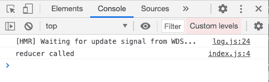
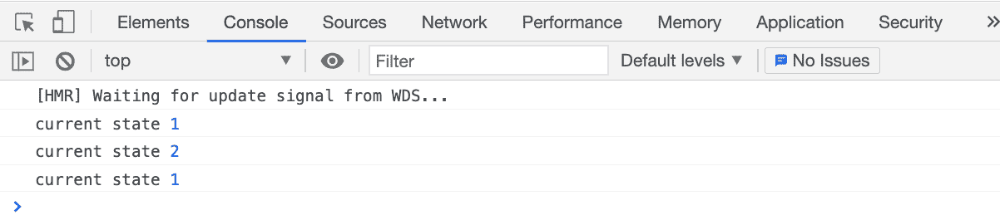
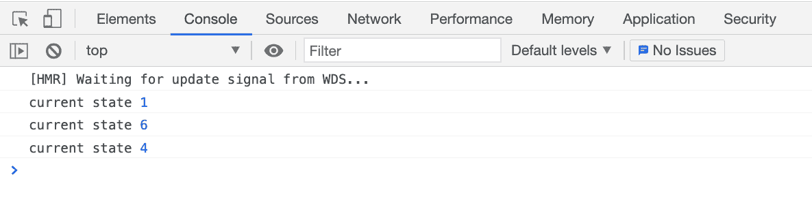

# 面向初学者的 Redux——通过代码示例学习 Redux 基础知识

> 原文：<https://www.freecodecamp.org/news/redux-for-beginners/>

Redux 对于初学者 React 开发人员来说很难理解。要正确使用它，你需要知道很多概念，比如 reducers、actions、store、纯函数、不变性等等。

但是每个 React 开发人员都应该知道如何使用 Redux 的基本知识，因为行业项目经常使用 Redux 来管理更大的项目。

因此在本文中，我们将探索 Redux 的基础知识以及如何使用它。

这是我们将在本文中构建的应用程序的预览。这是一个伟大的项目，你可以添加到你的投资组合和简历。

[https://www.youtube.com/embed/izSw74H08Bc?mute=1](https://www.youtube.com/embed/izSw74H08Bc?mute=1)

## Redux 是什么？

Redux 是一个状态管理库，帮助您更好地管理应用程序中的状态。

Redux 库不是特定于 React 的。这是一个可以在任何其他库或框架中使用的库，比如 Angular、Vue，甚至是普通的 JavaScript。

但是开发人员在使用 React 时大多使用 Redux。

Redux 提供了一个单一的存储，可以用来管理大量的数据。

## 如何开始使用 Redux

让我们创建一个新的 React 项目，以便学习 Redux 基础知识。

在终端/命令提示符下执行以下命令，使用 create-react-app 创建一个新的 React 项目:

```
npx create-react-app redux-demo 
```

> 在这种情况下,`npx`允许我们使用`create-react-app` npm 包来创建一个新的 React 项目，而无需在本地机器上安装它。

一旦你创建了项目，从`src`文件夹中删除所有文件，并在`src`文件夹中创建一个新文件`index.js`。

现在再次打开终端，从`redux-demo`文件夹执行以下命令:

```
npm install redux@4.1.0 
```

上面的命令将安装版本为`4.1.0`的 Redux 库，以便在您的项目中使用(这是撰写本文时的最新版本)。

## 如何创建 Redux 商店

在 Redux 中，您使用存储来管理和跟踪应用程序中正在变化的数据。

要创建一个商店，我们需要像这样导入`createStore`函数:

```
import { createStore } from 'redux'; 
```

`createStore`函数接受三个参数:

*   第一个参数是一个函数，通常称为 reducer(必需的)
*   第二个参数是状态的初始值(可选)
*   第三个参数是一个增强器，我们可以通过它传递中间件，如果有的话(可选)

看看下面的代码:

```
import { createStore } from 'redux';

const reducer = (state, action) => {
  console.log('reducer called');
  return state;
};

const store = createStore(reducer, 0); 
```

这里，我们首先使用 ES6 arrow 函数语法定义了一个 reducer 函数。如果愿意，可以使用普通函数代替箭头函数。

在 reducer 函数中，我们将一些文本记录到控制台，然后从函数返回状态值。

然后，我们将 reducer 函数传递给`createStore`函数作为第一个参数，将`0`作为状态的初始值作为第二个参数。

`createStore`函数返回一个我们可以用来管理应用程序数据的存储。

reducer 函数接收状态和动作作为参数。

我们作为`createStore`函数的`0`传递的状态初始值被自动作为`state`参数的值传递。

但是更常见的做法是在 reducer 内部初始化状态，而不是像下面这样将其作为第二个参数传递给`createStore`函数:

```
import { createStore } from 'redux';

const reducer = (state = 0, action) => {
  console.log('reducer called');
  return state;
};

const store = createStore(reducer); 
```

这里，我们使用 ES6 默认参数语法将状态参数初始化为值`0`。

一旦创建了商店，我们可以使用商店提供的`subscribe`方法来订阅商店中的更改，如下所示:

```
store.subscribe(() => {
  console.log('current state', store.getState());
}); 
```

这里，使用`subscribe`函数，我们注册了一个回调函数，一旦存储发生变化，这个函数就会被调用。

在回调函数中，我们调用`store.getState`方法来获取状态的当前值。

现在，打开`src/index.js`文件，在其中添加以下内容:

```
import { createStore } from 'redux';

const reducer = (state = 0, action) => {
  console.log('reducer called');
  return state;
};

const store = createStore(reducer);

store.subscribe(() => {
  console.log('current state', store.getState());
}); 
```

现在，如果您通过从终端执行`npm start`命令来运行应用程序，并访问 [http://localhost:3000/](http://localhost:3000/) ，您将看到控制台中打印的`reducer called`消息。



这是因为一旦我们将 reducer 传递给`createStore`函数，它就会被立即调用。

## 怎么换店

现在我们完成了商店的创建。但是商店现在对我们没什么用。这是因为存储是使用 reducer 函数连接的，但是我们没有在 reducer 中添加任何代码来管理存储。让我们开始吧。

改变商店的唯一方法是分派行动。

动作是发送到商店的对象，如下所示:

```
store.dispatch({
  type: 'INCREMENT'
}) 
```

这里，我们调用`store`上可用的 dispatch 函数，将类型为`INCREMENT`的动作发送到商店。

dispatch 函数将一个对象作为一个参数，这就是所谓的动作。

动作必须有一个如上所示的`type`属性。如果您没有传递`type`属性，那么您将得到一个错误。

> 这是一种常见的做法，建议用大写字母指定`type`值。

类型可以是您想要执行的任何操作，如`ADD_USER`、`DELETE_RECORD`、`GET_USERS`等。

如果你有多个单词，你可以用下划线把它们分开，就像这样`{ type: 'INCREMENT_NUMBER' }`。

现在，打开`index.js`文件并用以下代码替换其内容:

```
import { createStore } from 'redux';

const reducer = (state = 0, action) => {
  if (action.type === 'INCREMENT') {
    return state + 1;
  } else if (action.type === 'DECREMENT') {
    return state - 1;
  }

  return state;
};

const store = createStore(reducer);

store.subscribe(() => {
  console.log('current state', store.getState());
});

store.dispatch({
  type: 'INCREMENT'
});

store.dispatch({
  type: 'INCREMENT'
});

store.dispatch({
  type: 'DECREMENT'
}); 
```

现在，如果您通过从终端执行`npm start`命令来运行应用程序，您将在控制台中看到以下日志:



如您所见，对于发送到存储的每个操作，存储都会发生变化。因此，我们能够在控制台中看到不同的状态值。

在上面的代码中，我们的 reducer 函数如下所示:

```
const reducer = (state = 0, action) => {
  if (action.type === 'INCREMENT') {
    return state + 1;
  } else if (action.type === 'DECREMENT') {
    return state - 1;
  }

  return state;
}; 
```

每当我们调用`store.dispatch`函数时，就会调用 reducer 函数。还原器返回的任何东西都将成为商店的新价值。

因此，我们第一次像这样向商店分派操作时:

```
store.dispatch({
  type: 'INCREMENT'
}); 
```

将执行 reducer 函数中的第一个 if 条件。它将把`state`值增加到`1`，该值最初使用 ES6 默认参数语法初始化为`0`。然后从 reducer 函数返回。

**注意，我们使用`state`的值来计算新值，而不是像下面这样修改原来的`state`值:**

```
if (action.type === 'INCREMENT') {
   state = state + 1;
   return state;
} 
```

所以上面的代码是不正确的，因为在 reducer 中我们不应该修改原始状态。这样做会在应用程序中产生问题，所以不推荐这样做。

因为我们已经在`index.js`文件中添加了`store.subscribe`函数，所以当我们在控制台中看到日志时，我们会得到关于更改存储的通知。

因此，当我们再次调用类型为`INCREMENT`的 dispatch 时，第一个 if 条件将再次执行。所以它会在之前的状态值 1 上加 1，最终的状态值会变成 2。

然后，我们像这样将`DECREMENT`动作分派给商店:

```
store.dispatch({
  type: 'DECREMENT'
}); 
```

这将执行 reducer 中的 else 条件，并将状态值减 1(因此 2 - 1 将变为 1)。

注意，在减速器内部，我们也在最后返回状态。因此，如果没有一个条件匹配，函数将返回默认的先前状态。

通常的做法是在 reducer 中使用 switch 语句，而不是 if-else 条件，如下所示:

```
const reducer = (state = 0, action) => {
  switch (action.type) {
    case 'INCREMENT':
      return state + 1;
    case 'DECREMENT':
      return state - 1;
    default:
      return state;
  }
}; 
```

除了类型，我们还可以传递额外的信息作为动作的一部分。

用以下代码替换`index.js`文件的内容:

```
import { createStore } from 'redux';

const reducer = (state = 0, action) => {
  switch (action.type) {
    case 'INCREMENT':
      return state + action.payload;
    case 'DECREMENT':
      return state - action.payload;
    default:
      return state;
  }
};

const store = createStore(reducer);

store.subscribe(() => {
  console.log('current state', store.getState());
});

store.dispatch({
  type: 'INCREMENT',
  payload: 1
});

store.dispatch({
  type: 'INCREMENT',
  payload: 5
});

store.dispatch({
  type: 'DECREMENT',
  payload: 2
}); 
```

现在，如果您通过从终端执行`npm start`命令来运行应用程序，您将在控制台中看到以下日志:



在这里，当分派一个动作给存储时，我们传递一个带有某个值的`payload`,我们在 reducer 中使用它来增加或减少存储值。

这里，我们使用了`payload`作为属性名，但是您可以随意命名。

我们的减速器功能现在看起来像这样:

```
const reducer = (state = 0, action) => {
  switch (action.type) {
    case 'INCREMENT':
      return state + action.payload;
    case 'DECREMENT':
      return state - action.payload;
    default:
      return state;
  }
}; 
```

因此，当我们像这样调度类型为`INCREMENT`的动作时:

```
store.dispatch({
  type: 'INCREMENT',
  payload: 1
});

store.dispatch({
  type: 'INCREMENT',
  payload: 5
}); 
```

将执行缩减器中的以下代码:

```
return state + action.payload; 
```

这将首先在先前的状态值上加 1，然后加 5，所以我们从 1 到 6。并且由于`DECREMENT`动作类型:

```
store.dispatch({
  type: 'DECREMENT',
  payload: 2
}); 
```

我们从 6 点到 4 点。所以商店的最终价值会变成 4。

这里有一个[代码沙盒演示](https://codesandbox.io/s/goofy-hooks-y1w9s?file=/src/index.js)。

## 感谢阅读！

这是我在[精通 Redux](https://master-redux.yogeshchavan.dev/) 课程中对 Redux 的一个快速介绍。如果想详细学习 Redux，搭建一个完整的订餐 app，可以去看看。

在本课程中，您将学到:

*   基本和高级冗余
*   如何管理数组和对象的复杂状态
*   如何使用多个减速器管理复杂的冗余状态
*   如何调试 Redux 应用程序
*   如何在 React 中使用 Redux 使用 react-redux 库让你的 app 反应性。
*   如何使用 redux-thunk 库处理异步 API 调用

还有更多。

最后，我们将从头开始构建一个完整的[订餐应用](https://www.youtube.com/watch?v=izSw74H08Bc)，集成 stripe 以接受支付，并将其部署到生产中。

如果你在 2021 年 5 月 19 日之前购买，你只需 12 美元就可以获得这门课程，而不是原价的 19 美元，还可以免费获得我广受欢迎的《掌握现代 JavaScript》一书。

想要了解关于 JavaScript、React、Node.js 的最新常规内容吗？[在领英上关注我](https://www.linkedin.com/in/yogesh-chavan97/)。