# 如何用 Redux 在十分钟内让球滚动起来

> 原文：<https://www.freecodecamp.org/news/redux-get-the-ball-rolling-in-10min-9d9551ff4b3c/>

大家好，❤️

一段时间以来，我一直听到我的朋友和同事抱怨进入 Redux 有多难。

我在葡萄牙南部的 Faro 经营着一个自由代码营(freeCodeCamp)学习小组，所以每周我都试图激励和指导一些程序员同事，他们在尝试进入编程领域的过程中经历了很多成长的烦恼。

丹·阿布拉莫夫(Dan Abramov)为 Redux 打造了一个令人惊艳的入门课程，我有幸在 [egghead.io](https://egghead.io/courses/getting-started-with-redux) 看到了这个课程，涵盖了 Redux 的方方面面。还有 Redux 文档网站，[这里](https://redux.js.org/)，非常完整。

但是由于某些原因，许多人仍然不喜欢 Redux。

重点是 Redux 的入门学习曲线相当可观！

你必须理解很多抽象概念，你必须用更函数化的方法用 JavaScript 编程，了解很多 ES6 特性，还要非常好地理解很多 JavaScript 概念，比如不变性。

所以，这就是为什么对于那些几个月前才开始反应并非常热衷于将状态抽象成 Redux 存储的人来说可能非常困难。

你会听到围绕着咖啡机的闲聊，关于 Redux 是如何超越它的，关于干净的编程，单一的真理来源，以及驱动这个巨大的“小”(2kB)库的三个原则…

所以，别担心，你来对地方了！这篇文章送给你！我将向您展示应用第一的原则方法，让 Redux 发挥作用是多么容易。

围绕这个主题已经有很多笔墨了，但是让我们开始吧。让我试着在 React 上下文中尽快向您介绍 Redux 先生。

从这个艰巨的任务开始，我将向您展示如何用下面的用户故事制作一个非常简单的计数器应用程序:

1.  显示当前计数；
2.  为用户提供两个按钮，用于递增和递减计数。

好的，在这一点上你会想:我可以很快地用地方政府做到这一点。

真实故事！就是这样，伙计！我们将从一个使用本地状态的简单 React 示例开始，并将该应用程序转换为 React-Redux 应用程序。

但是，在此之前，让我先简单介绍一下 Redux 的基本概念和用途。

### 01.基本概念

Redux 是由 Dan Abramov 创建的，它被定义为“JavaScript 应用的可预测状态容器”

Dan 创建 Redux 的动机是 SPA 的复杂性增加了很多。我们被单独留下来管理我们的数据状态，用两个人类思维难以推理的概念:**突变**和**异步**。他称之为“**曼妥思和**可口可乐——两者分开可以很好，但合在一起会造成混乱”。

所以 Redux 建议把你的应用的整个状态描述成一个普通的对象。要改变某种状态，您需要分派动作。动作是普通的 Javascript 对象，描述你的应用程序发生了什么。

最后，为了将动作和状态联系在一起，我们编写了一个称为 reducer 的函数。reducer 只是一个 Javascript 函数，以状态和动作作为参数，返回应用的下一个状态。

#### **Redux 的三个原则:**

1.  事实的单一来源:整个应用程序的状态存储在一个单独的**存储**中的对象树中。
2.  状态为只读。这意味着改变状态的唯一方法是发出一个**动作**(一个描述发生了什么的对象)。
3.  使用**纯函数**进行更改。纯函数是仅根据其参数值返回值的函数。它们没有明显的副作用。当你用相同的参数调用相同的函数时，你总是得到相同的返回值。纯函数也不会修改它们接收到的参数。它们实际上返回了一个新的对象、数组或函数，并对其进行了更改。

### **02。计数器 App(与本地状态反应，此处不重复)**

好了，伙计们，回到我们来的地方，让我们制作一个只有本地状态的小计数器应用程序。

为了启动这类样板文件，我总是使用 create-react-app (CRA)和 bootstrap(只是为了让事情简单一点，但更花哨一点)。

我保留了调用<app>组件(扮演主应用程序视图的角色)的 src/index.js，并创建了一个名为 Counter 的小型有状态组件。</app>

如果你想玩这个代码，你可以从我的 GitHub repo [这里](https://github.com/evedes/counter-app/tree/LocalStateApp)克隆它(记住它在 LocalStateApp 分支上)。

那么，让我们来看看构建简单的应用程序需要什么。

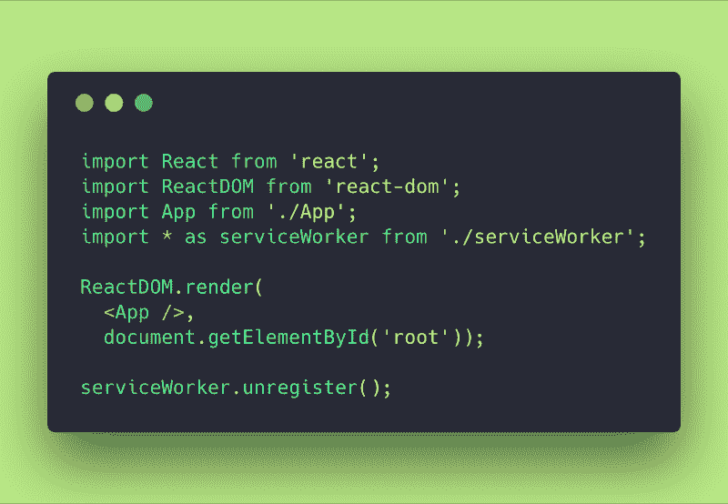

src/index.js

就像开箱即用一样简单。

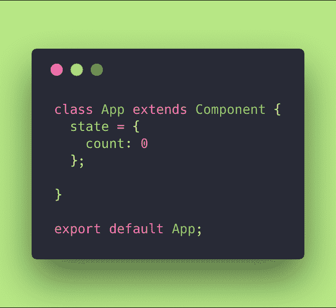

src/App.js

我用一个计数变量初始化我的应用程序组件的状态，这个变量默认设置为零。

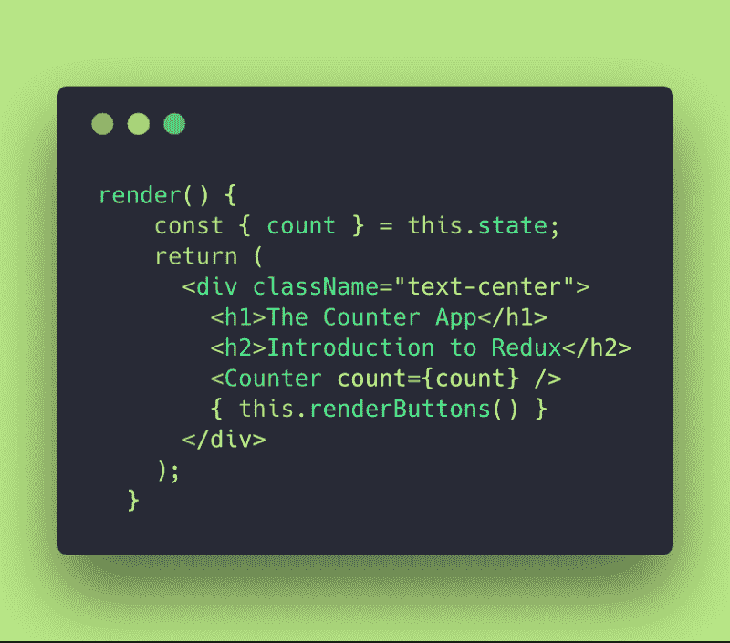

render() method

我构建了一个非常简单的呈现方法，它从 state 中析构 count 并显示一些文本。它还调用计数器有状态组件将计数值传递给它，并调用一个名为 renderButtons()的小方法来呈现递增/递减按钮。

Counter stateful component

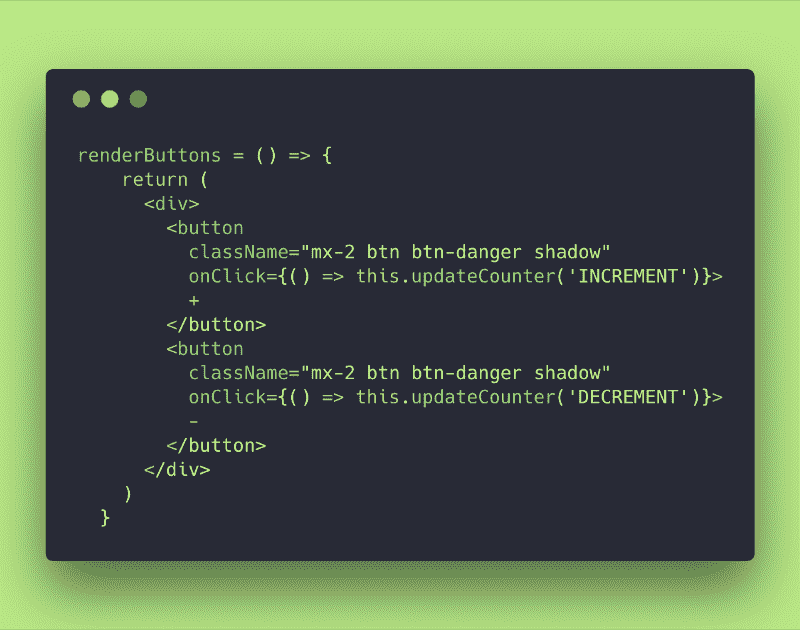

renderButtons method

按钮调用一个名为 updateCounter()的方法，并将我们需要的更新类型传递给它。

在这里，我们已经在构建自己的 Redux 之路。Redux 中动作的一个细节是，除了是由您决定的简单对象之外，它们还需要有一个未定义的类型属性。(现在请记住这一点。)

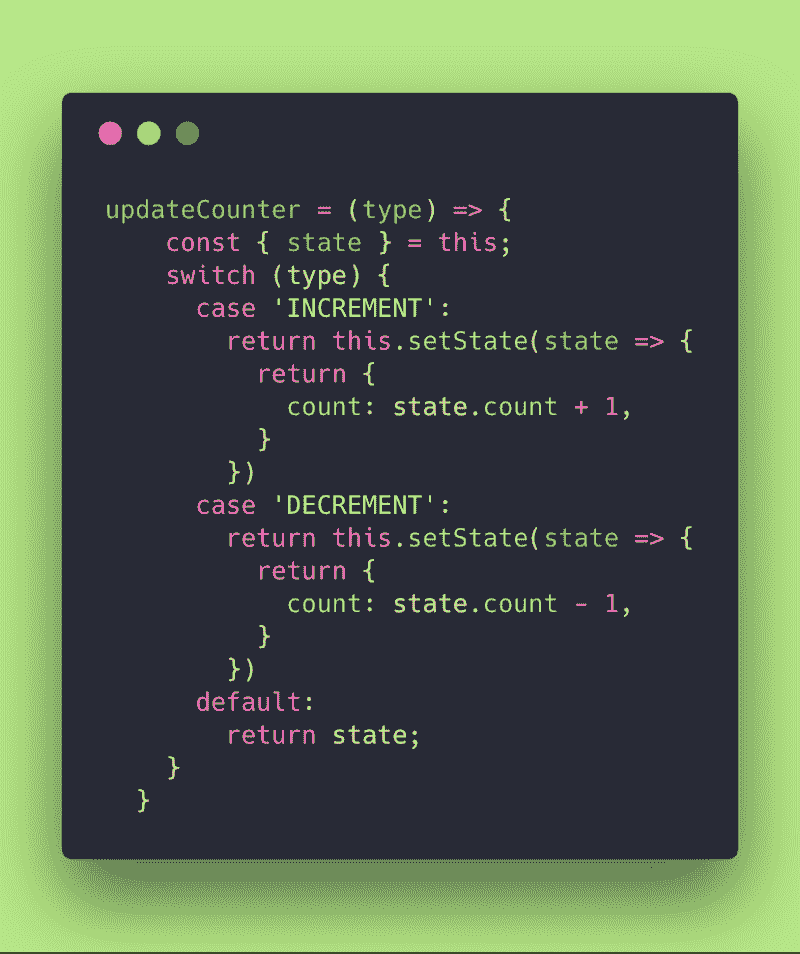

updateCounter method

这里我们有一个 updateCounter 方法，它非常类似于 Redux 中的 reducer。它获取应用程序的当前状态，获取所需的操作，最后返回应用程序的新状态。

一点魔法都没有！Redux 是如此自然和简单，你根本不会感觉到不同，因为你知道两三个小细节，使事情看起来非常复杂和难以琢磨。

这是我们应用程序的最终结果:

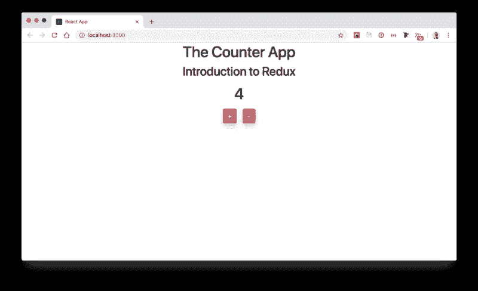

Result of the Counter App w/local state

### 03.计数器应用程序(带还原状态)

好的朋友们！让我们来分解一下我们到目前为止所做的事情。

要安装 Redux，您必须:

*npm 安装-保存还原反应-还原*

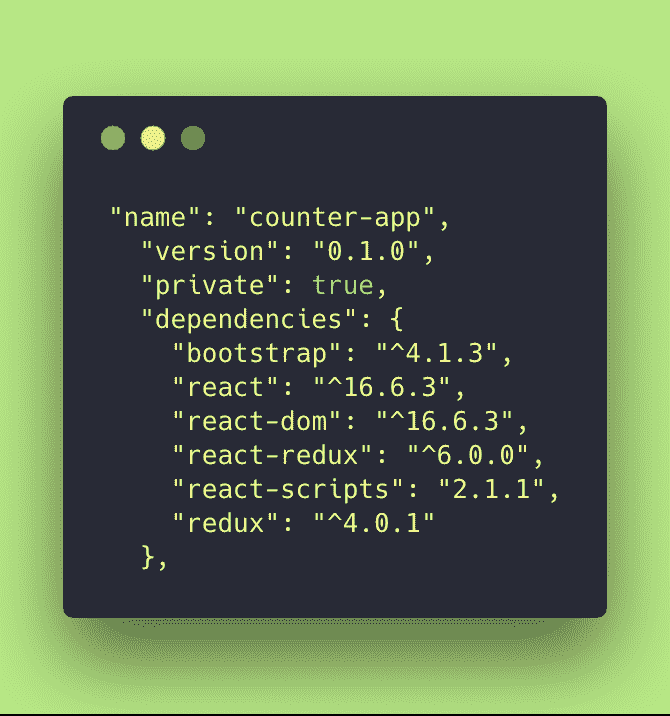

package.json after installing redux

所以在安装 Redux 之后，你的 package.json 依赖项应该是这样的？。

现在怎么办？

让我们打破我们的应用程序！但是不要太多！？

因此，我的第一步将是从 App 组件中删除状态，并在 index.js 上创建一个 Redux store:

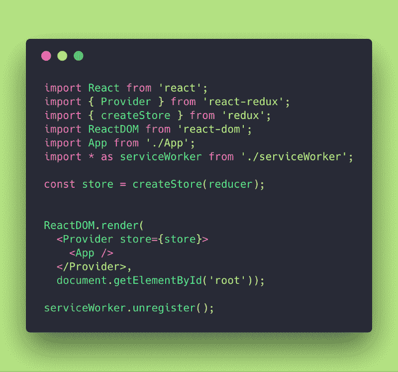

src/index.js: creating a store in Redux and passing info to our main App.

我们在这里做了什么？☕️

我们已经编辑了我们的主 index.js 文件来创建一个 Redux 存储，并将其作为道具传递给我们的<app>组件。</app>

您可能会注意到顶部的两个导入:Provider 和 createStore。

您还会注意到周围的特设<provider>的用法。它从外部工作，包含我们的主应用程序(它也可以包含路由器的东西)，以便将其 API 函数作为道具传递到我们的主应用程序中。</provider>

但是等等！

这个变量定义中的减速器是什么？

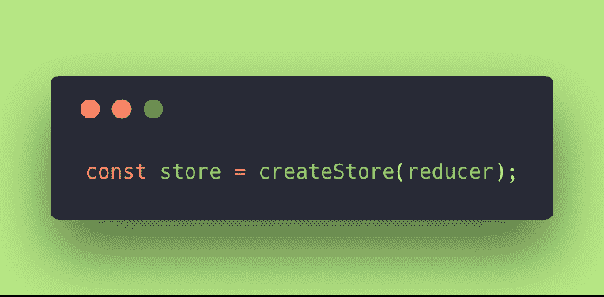

store creation

哦，我们错过了减速器！

因此，商店需要接收至少一个 reducer 函数，以实际了解状态更改是如何操作的。

我们开始吧！

在我们的旧应用程序中，我们有一个 updateCounter 方法，我们说它是一种缩减器。

因此，让我们将它移动到 index.js(您也可以将它提取到另一个文件并导入它，但现在让事情简单一些)。

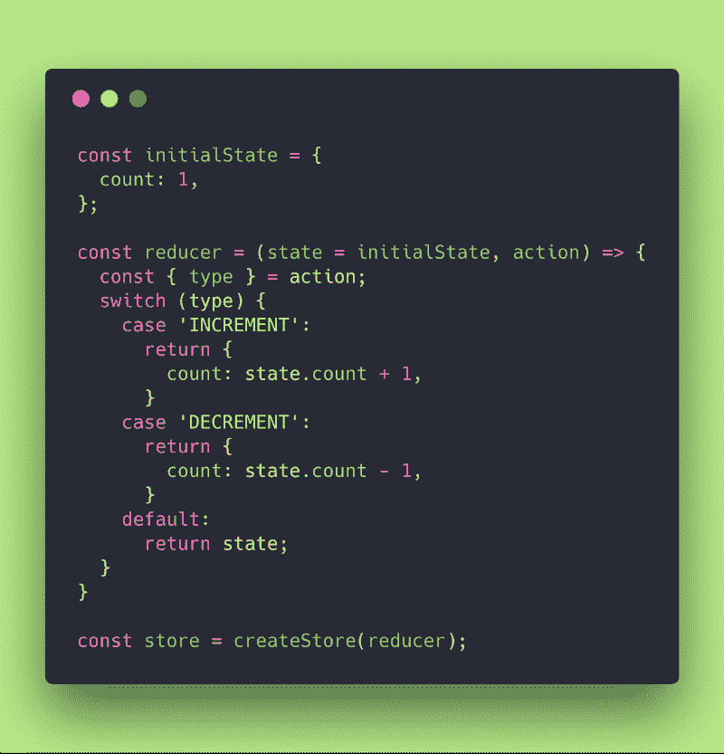

因此，我们从我们的应用程序组件中提取了 updateCounter 方法，并对其进行了一些调整，以提供更多的上下文。

我们称之为减速器。这是我们想要传递给 createStore 方法的缩减器。

我们还添加了 state 作为参数，因为当我们从<app>组件上下文中提取它时，它不再知道任何状态。我们还停止了使用 setState，并开始根据我们接收到的动作类型返回新的计数(从 action arg 析构它)。</app>

如果状态未定义，我们已经使用 ES6 特性默认定义了一个 initialState。还记得我上面跟你说的吗？那种状态不可能是未定义的。这是 Redux reducer 的条件之一。

除此之外，没有什么新的每个人！你猜怎么着？我们已经准备好了我们的减速器，并准备好做它的工作！

现在让我们注意动作！

在我们的旧应用程序中，它们是 updateCounter 调用。但是现在，正如您所记得的，我们需要使用 Redux 的 dispatch()方法来调度操作，因此我们需要将 API 的这一层添加到我们的应用程序中。

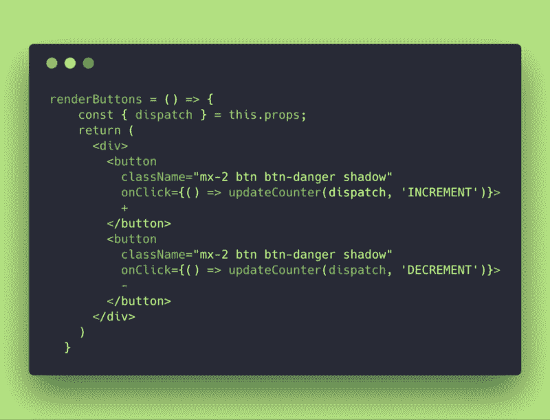

伙计们，我们只做了两件事！我们已经有了调度方法，从道具中析构它。还记得那个 <provider>HOC 吗？它的作用就是把这几个 Redux 方法引入你的主 app。</provider>

我们现在调用的不是 this.updateCounter，而是一个 updateCounter 分离函数，向它提供动作类型(就像我们在旧应用程序中一样)。

现在让我们看看新的 updateCounter 函数是什么:

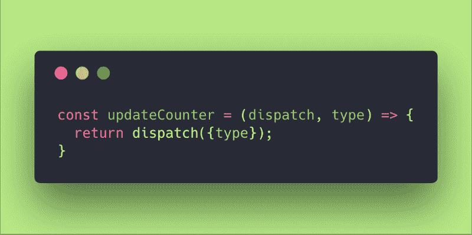

updateCounter action

好了，没什么新的了，我们只是接收了 dispatch 方法并返回了我们想要触发的动作类型。

此时，我们已经创建了商店。我们创建了 reducer 来获取应用程序和动作的先前状态，并返回新状态。我们构建了一个动作函数来调度我们的应用程序动作。

还有什么？这应该是现在的工作！为什么不是呢？

哦！我们的 App 组件必须连接 Redux！

所以这是我们的最后一步！？

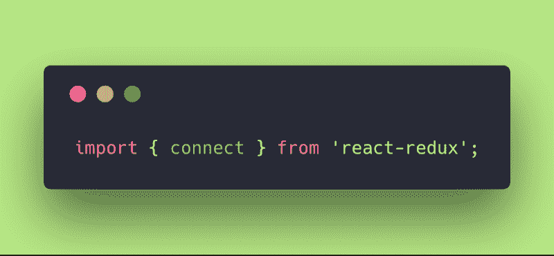

import connect from react-redux

我们首先从 react-redux 导入连接方法(到我们的 App.js 文件中)。

现在，在我们文件的最后，在我们导出组件的默认应用程序的地方，我们需要进行连接:

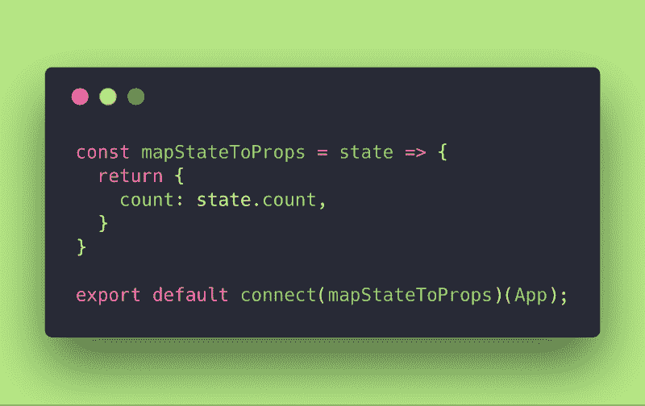

connect and mapStateToProps

好吧！还记得我们已经从应用程序组件中移除了本地状态吗？

那么…我们如何将商店的状态注入到组件中呢？

我们需要做一个“mapStateToProps”！习惯这一点，因为它总是需要的。App 组件将接收新状态作为道具。你再也没有这个国家了！！

mapStateToProps 从连接方法(HOC)获取状态，并将其绑定到应用程序组件。

就这样，各位！此时，您的应用程序应该正在运行。

随意看看我的 GitHub repo(branch ReduxStateApp)[里的代码这里](https://github.com/evedes/counter-app/tree/ReduxStateApp)。

当然，在这之后还有很多东西要学，但是这是你理解如何使用 Redux 的第一步。

现在我要求你做功课:检查这两个应用程序！确保你搜索了所有的步骤，并对它们进行了比较。放很多 *console.log* 来理解发生了什么，最重要的是接受 Redux 中有一个 API，它有一些严格的规则。对于入门级来说，并不是所有事情都像预期的那样合乎逻辑！但是对于 JavaScript 来说，这些只是成长的烦恼！

永远记得要坚强，对每个人都要有原则，❤️

用热腾腾的☕️ ️来控制你的疼痛

### 04.文献学

01.[还原文档](https://redux.js.org/)

02.egghead.io Dan Abramov 的课程【Redux 入门