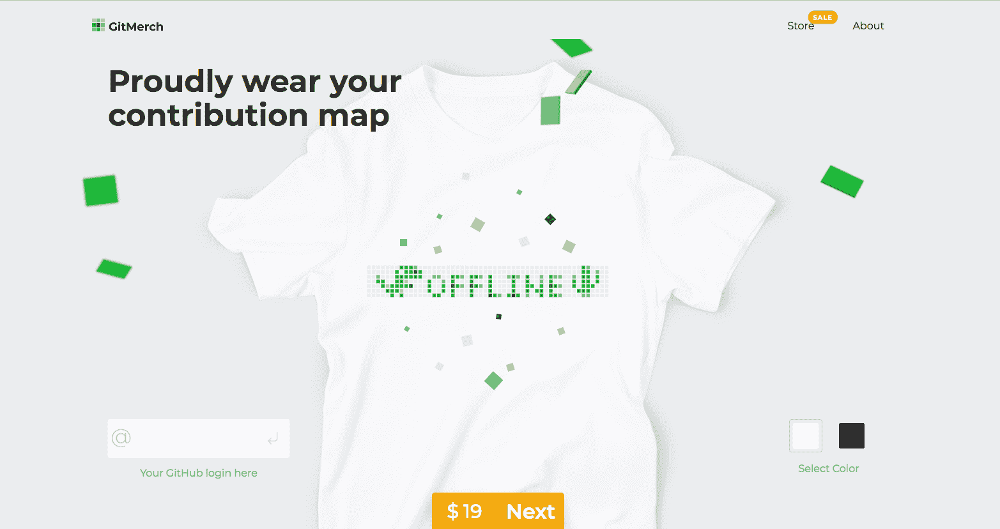
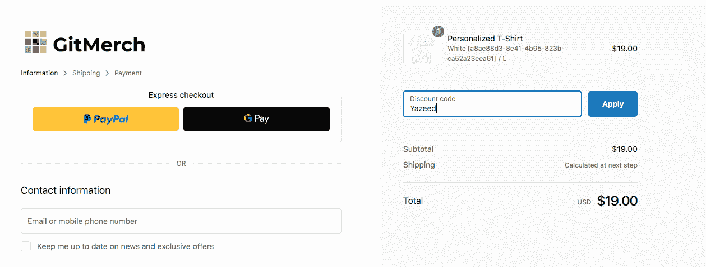

# 如何用 24 行 JavaScript 实现 Redux

> 原文：<https://www.freecodecamp.org/news/redux-in-24-lines-of-code/>

90%惯例，10%图书馆。

Redux 是有史以来最重要的 JavaScript 库之一。受现有技术如 [Flux](https://facebook.github.io/flux/) 和 [Elm](https://elm-lang.org) 的启发，Redux 通过引入由三个简单点组成的可扩展架构，将 JavaScript 函数式编程推上了地图。

如果你是 Redux 的新手，可以考虑先阅读官方文件。

## Redux 大多是约定俗成的

考虑这个使用 Redux 架构的简单计数器应用程序。如果你想提前了解，请查看 Github repo 。


### 国家生活在一棵树上

应用程序的状态如下所示。

```
const initialState = { count: 0 }; 
```

### 动作声明状态变化

根据 Redux 约定， **I 不直接修改(变异)状态。**

```
// DON'T do this in a Redux app
state.count = 1; 
```

相反，我创建用户可能在应用程序中利用的所有动作。

```
const actions = {
  increment: { type: 'INCREMENT' },
  decrement: { type: 'DECREMENT' }
}; 
```

### Reducer 解释动作并更新状态

最后一个架构部分需要一个 reducer，这是一个纯粹的函数，它基于先前的状态和动作返回您的状态的新副本。

*   如果`increment`被触发，增量`state.count`。
*   如果`decrement`被触发，则递减`state.count`。

```
const countReducer = (state = initialState, action) => {
  switch (action.type) {
    case actions.increment.type:
      return {
        count: state.count + 1
      };

    case actions.decrement.type:
      return {
        count: state.count - 1
      };

    default:
      return state;
  }
}; 
```

### 到目前为止还没有回复

你注意到我们还没有接触 Redux 库吗？我们刚刚创建了一些对象和一个函数。这就是我说的“大多约定俗成”的意思，90%的 Redux 都不需要 Redux！

## 让我们实现 Redux

要使用这种架构，我们必须将其插入商店。我们将只实现一个函数—`createStore`。

是这样用的。

```
import { createStore } from 'redux'

const store = createStore(countReducer);

store.subscribe(() => {
  console.log(store.getState());
});

store.dispatch(actions.increment);
// logs { count: 1 }

store.dispatch(actions.increment);
// logs { count: 2 }

store.dispatch(actions.decrement);
// logs { count: 1 } 
```

这是我们最初的样板。我们需要一个监听器列表和 reducer 提供的初始状态。

```
const createStore = (yourReducer) => {
    let listeners = [];
    let currentState = yourReducer(undefined, {});
} 
```

每当有人订阅我们的商店，他们就会被添加到`listeners`数组中。这很重要，因为每次有人调度一个动作时，必须循环通知所有的`listeners`。

用`undefined`和一个空对象调用`yourReducer`会返回我们在上面安装的`initialState`。这给了我们在调用`store.getState()`时返回一个合适的值。说到这里，让我们创建那个方法。

### store.getState()

这是一个从存储中返回最新状态的函数。每次用户点击按钮时，我们都需要它来更新我们的 UI。

```
const createStore = (yourReducer) => {
    let listeners = [];
    let currentState = yourReducer(undefined, {});

    return {
        getState: () => currentState
    };
} 
```

### store.dispatch(操作)

这是一个将`action`作为参数的函数。它将那个`action`和`currentState`馈送到`yourReducer`以获得一个新的状态。然后`dispatch`通知每个订阅了`store`的人。

```
const createStore = (yourReducer) => {
  let listeners = [];
  let currentState = yourReducer(undefined, {});

  return {
    getState: () => currentState,
    dispatch: (action) => {
      currentState = yourReducer(currentState, action);

      listeners.forEach((listener) => {
        listener();
      });
    }
  };
}; 
```

### store.subscribe(监听器)

这个功能可以让你在商店收到一个操作时得到通知，在这里使用`store.getState()`来获取你的最新状态并更新你的 UI 是很好的。

```
const createStore = (yourReducer) => {
  let listeners = [];
  let currentState = yourReducer(undefined, {});

  return {
    getState: () => currentState,
    dispatch: (action) => {
      currentState = yourReducer(currentState, action);

      listeners.forEach((listener) => {
        listener();
      });
    },
    subscribe: (newListener) => {
      listeners.push(newListener);

      const unsubscribe = () => {
        listeners = listeners.filter((l) => l !== newListener);
      };

      return unsubscribe;
    }
  };
}; 
```

`subscribe`返回一个名为`unsubscribe`的函数，当你对商店的更新不再感兴趣时，可以调用这个函数。

## 现在都在一起

让我们把它挂在我们的按钮上，并查看最终的源代码。

```
// simplified createStore function
const createStore = (yourReducer) => {
  let listeners = [];
  let currentState = yourReducer(undefined, {});

  return {
    getState: () => currentState,
    dispatch: (action) => {
      currentState = yourReducer(currentState, action);

      listeners.forEach((listener) => {
        listener();
      });
    },
    subscribe: (newListener) => {
      listeners.push(newListener);

      const unsubscribe = () => {
        listeners = listeners.filter((l) => l !== newListener);
      };

      return unsubscribe;
    }
  };
};

// Redux architecture pieces
const initialState = { count: 0 };

const actions = {
  increment: { type: 'INCREMENT' },
  decrement: { type: 'DECREMENT' }
};

const countReducer = (state = initialState, action) => {
  switch (action.type) {
    case actions.increment.type:
      return {
        count: state.count + 1
      };

    case actions.decrement.type:
      return {
        count: state.count - 1
      };

    default:
      return state;
  }
};

const store = createStore(countReducer);

// DOM elements
const incrementButton = document.querySelector('.increment');
const decrementButton = document.querySelector('.decrement');

// Wire click events to actions
incrementButton.addEventListener('click', () => {
  store.dispatch(actions.increment);
});

decrementButton.addEventListener('click', () => {
  store.dispatch(actions.decrement);
});

// Initialize UI display
const counterDisplay = document.querySelector('h1');
counterDisplay.innerHTML = parseInt(initialState.count);

// Update UI when an action fires
store.subscribe(() => {
  const state = store.getState();

  counterDisplay.innerHTML = parseInt(state.count);
}); 
```

这是我们最后的用户界面。


如果你对我使用的 HTML/CSS 感兴趣，这里有[GitHub repo](https://github.com/yazeedb/implement-redux-counter-app)再次！

## 想要免费辅导？

如果你想安排一个免费电话来讨论关于代码、面试、职业或任何其他方面的前端开发问题[请在 Twitter 上关注我，并给我发短信](https://twitter.com/yazeedBee)。

之后，如果你喜欢我们的第一次会议，我们可以讨论一个持续的辅导，以帮助你达到你的前端发展目标！

## 穿上你的贡献

如果你每天都在编码，特别是如果你致力于 GitHub，把贡献图展示给所有人看不是很酷吗？

[Gitmerch.com](https://gitmerch.com/)让你打印一件你的 GitHub 贡献图的 t 恤！在结账时使用代码 **Yazeed** 享受折扣。





## 感谢阅读

更多类似的内容，请查看[https://yazeedb.com！](https://yazeedb.com)

下次见！