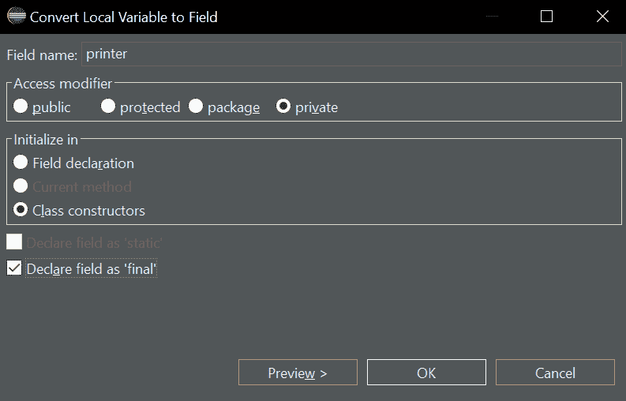
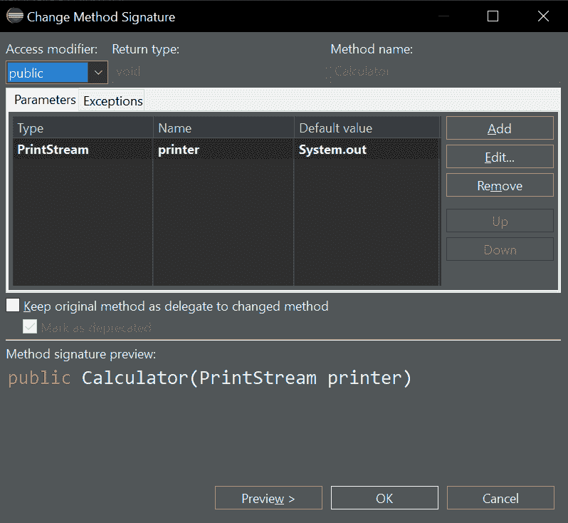

# 如何通过 5 个步骤重构可配置的依赖关系

> 原文：<https://www.freecodecamp.org/news/refactoring-to-configurable-dependency-in-5-steps/>

可配置依赖，也称为依赖注入，是一种模式，使您能够切换应用程序的依赖关系。术语是由阿利斯泰尔·考克伯恩创造的。

假设您的应用程序有一个 GUI。但是您的管理员希望通过控制台使用某些功能。或者您的生产代码调用外部服务。但是您的测试不应该调用该服务，因为它不提供可靠的结果。或者该服务并不总是可用。

这就是可配置的依赖关系有用的地方。根据上下文，您可以使用这种或那种依赖关系。

许多文章试图解释这种模式。但是他们把它嵌入到一个更广泛的环境中，比如端口和适配器架构。这使得理解变得不必要的困难。我知道，我自己也写过这样的文章。

除此之外，许多文章关注绿地应用。但是我们大多数人必须维护已经存在的应用程序。

让我们从一个简单的类开始，它有一个硬连接的依赖关系。然后我们将它重构为一个具有可配置依赖关系的类。

这个例子很简单，但是如果您处于类似的情况，重构步骤通常适用于您自己的应用程序。

我将在文章中引用一个例子 [GitHub 项目](https://github.com/bertilmuth/configurable-dependency)。它在其提交历史中显示了要执行的步骤。在文章的最后，有 IntelliJ IDEA 和 Eclipse 的附录。它们展示了如何在您的 IDE 中执行重构步骤。

# 计算器示例

假设您有一个名为`Calculator`的类。相当于“商业逻辑”。在每次计算结束时，它将结果打印到屏幕上。在现实世界的应用程序中，它可能会将一些内容保存到数据库中。

这里是代码:

```
package example;

public class Calculator {
	public Calculator(){
	}

	public long add(long one, long two) {
		long result = one + two;
		printResult(result);
		return result;
	}

	public long sub(long one, long two) {
		long result = one - two;
		printResult(result);
		return result;
	}

	private void printResult(long result) {
		System.out.println("The result is: " + result);
	}
}
```

现在，如果您想测试那个类，您的[测试代码](https://github.com/bertilmuth/configurable-dependency/blob/3d8540dd9566cb48f29902b9c9e10292cf8f7560/src/test/java/example/CalculatorTest.java)可能如下所示:

```
package example;

import static org.junit.jupiter.api.Assertions.*;
import org.junit.jupiter.api.*;

class CalculatorTest {
	private Calculator calculator;

	@BeforeEach
	void setup() {
		calculator = new Calculator();
	}

	@Test
	void addsToNumbers() {
		long result = calculator.add(1, 2);
		assertEquals(3, result);
	}

	@Test
	void subtractsToNumbers() {
		long result = calculator.sub(5, 1);
		assertEquals(4, result);
	}
} 
```

每次运行测试时，它都会将结果打印到屏幕上。没这个必要。它会减慢你的测试速度。

通过依赖注入，您仍然可以在测试中断言结果。但是要避免将结果打印到屏幕上(或者将结果保存到数据库、文件系统或其他地方)。

## 步骤 1:将依赖项创建转移到构造函数中

找出创建依赖类的实例的位置。通过将实例分配给一个字段，将创建转移到构造函数。在整个类中使用字段，以便只有构造函数创建依赖项。

示例代码有点不同。依赖关系是静态的。但是如上所述，重构后的代码将其分配给构造函数中的`printer`字段。

所以`Calculator` 类现在看起来像[这个](https://github.com/bertilmuth/configurable-dependency/blob/43ba441138edafdbca2f7f4a100f5e5b528235a2/src/main/java/example/Calculator.java):

```
package example;

import java.io.PrintStream;

public class Calculator {
	private final PrintStream printer;

	public Calculator(){
		printer = System.out;
	}

	public long add(long one, long two) {
		long result = one + two;
		printResult(result);
		return result;
	}

	public long sub(long one, long two) {
		long result = one - two;
		printResult(result);
		return result;
	}

	private void printResult(long result) {
		printer.println("The result is: " + result);
	}
}
```

运行测试。它仍然需要通过。

## 步骤 2:将依赖项作为构造函数参数传递

将实例作为构造函数参数传递，而不是在构造函数中创建它。[下面是](https://github.com/bertilmuth/configurable-dependency/blob/411cb1650ddfd209b12d0ebc9007fcd1f857d280/src/main/java/example/Calculator.java)重构后的示例代码:

```
package example;

import java.io.PrintStream;

public class Calculator {
	private final PrintStream printer;

	public Calculator(PrintStream printer){
		this.printer = printer;
	}

	public long add(long one, long two) {
		long result = one + two;
		printResult(result);
		return result;
	}

	public long sub(long one, long two) {
		long result = one - two;
		printResult(result);
		return result;
	}

	private void printResult(long result) {
		printer.println("The result is: " + result);
	}
}
```

为了让这个类工作，您需要修改创建一个`Calculator` 对象的每一行代码，以传递依赖关系。所以在[计算器测试](https://github.com/bertilmuth/configurable-dependency/blob/411cb1650ddfd209b12d0ebc9007fcd1f857d280/src/test/java/example/CalculatorTest.java)中创建`Calculator`的代码行现在看起来像这样:

`calculator = new Calculator(System.out);`

运行测试。它仍然需要通过。

## 步骤 3:创建接口和实现

创建一个[接口](https://github.com/bertilmuth/configurable-dependency/blob/d453d47d297eed94108f4b136e467fc66502fe84/src/main/java/example/PrintStream.java)，其名称与依赖项的类名完全相同。把它放在同一个包装里。将业务逻辑调用的方法放入其中。

```
package example;

public interface PrintStream {
	void println(String text);
}
```

在[计算器](https://github.com/bertilmuth/configurable-dependency/blob/d453d47d297eed94108f4b136e467fc66502fe84/src/main/java/example/Calculator.java)类中，删除依赖项`java.io.PrintStream`的导入语句，以使用新的接口。

这是该接口的一个实现。[控制台打印](https://github.com/bertilmuth/configurable-dependency/blob/d453d47d297eed94108f4b136e467fc66502fe84/src/main/java/example/ConsolePrinter.java)包含打印到屏幕的原始功能。

```
package example;

public class ConsolePrinter implements PrintStream{
	@Override
	public void println(String text) {
		System.out.println(text);
	}
}
```

在[测试类](https://github.com/bertilmuth/configurable-dependency/blob/d453d47d297eed94108f4b136e467fc66502fe84/src/test/java/example/CalculatorTest.java)中，传入`ConsolePrinter`。运行测试。它仍然需要通过，并将结果打印到屏幕上:

```
package example;

import static org.junit.jupiter.api.Assertions.*;
import org.junit.jupiter.api.*;

class CalculatorTest {
	private Calculator calculator;

	@BeforeEach
	void setup() {
		calculator = new Calculator(new ConsolePrinter());
	}

	@Test
	void addsToNumbers() {
		long result = calculator.add(1, 2);
		assertEquals(3, result);
	}

	@Test
	void subtractsToNumbers() {
		long result = calculator.sub(5, 1);
		assertEquals(4, result);
	}
} 
```

## 步骤 4:重命名并清理

这是一个可选步骤。您可以决定重命名该接口，给它一个更有意义的名称。比如把`PrintStream` 改名为[打印机](https://github.com/bertilmuth/configurable-dependency/blob/d453d47d297eed94108f4b136e467fc66502fe84/src/test/java/example/CalculatorTest.java)。

您也可以决定将该类移动到不同的包中，并重命名其方法。

运行测试。它仍然需要通过。

## 步骤 5:配置依赖关系

出于测试目的，创建另一个忽略文本参数的实现:

```
package example;

public class IdlePrinter implements Printer{
	@Override
	public void println(String text) {
		// This is empty, because we don't want to print in tests.
	}
}
```

现在，您可以更改 CalculatorTest 的一行来关闭打印:

`calculator = new Calculator(new IdlePrinter());`

从 Java 8 开始，你甚至不需要`IdlePrinter`。改为传入 Lambda 函数:

`calculator = new Calculator(text -> {});`

## 恭喜你！

您已经重构了一个可配置的依赖项。

查看一下 [GitHub 项目](https://github.com/bertilmuth/configurable-dependency)提交历史，看看我执行的代码中的变化。

如有任何问题，请留言或联系我。

推特:[https://twitter.com/BertilMuth](https://twitter.com/BertilMuth)

领英:[https://www.linkedin.com/in/bertilmuth/](https://www.linkedin.com/in/bertilmuth/)

以下附录解释了 IntelliJ IDEA 和 Eclipse 中的具体重构步骤。

# 附录 A——如何在 IntelliJ IDEA 中重构

## IntelliJ 步骤 1:将依赖项创建移到构造函数中

打开`Calculator`类。定位`System.out`。点击右键，选择`Refactor > Introduce Field`。选择`initialize in: constructor`。将字段命名为`printer`。点击回车。

## IntelliJ 步骤 2:将依赖项作为构造函数参数传递

将光标设置到构造函数中，`Calculator()`。标记对依赖关系的访问，`System.out`。点击右键，选择`Refactor > Introduce Parameter`。将字段命名为`printer`。点击回车。

## IntelliJ 步骤 3:创建接口和实现

在同一个包中创建接口和实现:

```
package example;

public interface PrintStream {
	void println(String text);
}
```

```
package example;

public class ConsolePrinter implements PrintStream{
	@Override
	public void println(String text) {
		System.out.println(text);
	}
}
```

转到业务逻辑类`Calculator`并删除导入语句`import java.io.PrintStream;`。保存文件。

在测试类`CalculatorTest`中，使用新的实现类。

改变这一点:

`calculator = new Calculator(System.out);`

对此:

`calculator = new Calculator(new ConsolePrinter());`

保存文件。运行测试并检查它是否仍然通过。

## IntelliJ 步骤 4:重命名并清理

进入界面`PrintStream`。右击`PrintStream`并选择`Refactor > Rename`。输入`Printer`并按回车键。运行测试并检查它是否仍然通过。

## IntelliJ 步骤 5:配置依赖关系

出于测试目的，创建另一个忽略文本参数的实现:

```
package example;

public class IdlePrinter implements Printer{
	@Override
	public void println(String text) {
		// This is empty, because we don't want to print in tests.
	}
}
```

转到`CalculatorTest`并进行更改:

`calculator = new Calculator(new ConsolePrinter());`

对此:

`calculator = new Calculator(new IdlePrinter());`

保存文件。运行测试并检查它是否仍然通过。

文本输出现在应该关闭了。干得好。

# 附录 B——如何在 Eclipse 中重构

## Eclipse 步骤 1:将依赖项创建转移到构造函数中

打开`Calculator`类。定位`System.out`。点击右键，选择`Refactor > Extract Local Variable`。点击`OK`。

标记新创建的局部变量`out`。点击右键，选择`Refactor > Convert Local Variable to Field`。将变量命名为`printer`。选择`Initialize in Class Constructors`。检查`Declare field as ‘final’`。点击`OK`。



运行测试并检查它是否仍然通过。

## Eclipse 步骤 2:将依赖项作为构造函数参数传递

将光标设置到构造函数中，`Calculator()`。标记对依赖项`System.out`的访问，并将其复制到剪贴板(CTRL-C)。

点击右键，选择`Refactor > Change Method Signature`。点击`Add`。在`Type`下输入`PrintStream`，在`Name`下输入`printer`，在`Default value.`下粘贴`System.out`，点击`OK`和`Continue.`



将构造函数更改为如下所示:

`public Calculator(PrintStream printer){`
`this.printer = printer;`


保存文件。运行测试并检查它是否仍然通过。

## Eclipse 步骤 3:创建接口和实现

在同一个包中创建接口和实现:

```
package example;

public interface PrintStream {
	void println(String text);
}
```

```
package example;

public class ConsolePrinter implements PrintStream{
	@Override
	public void println(String text) {
		System.out.println(text);
	}
}
```

转到业务逻辑类`Calculator`并删除导入语句`import java.io.PrintStream;`。保存文件。

在测试类`CalculatorTest`中，使用新的实现类。

改变这一点:

`calculator = new Calculator(System.out);`

对此:

`calculator = new Calculator(new ConsolePrinter());`

保存文件。运行测试并检查它是否仍然通过。

## Eclipse 步骤 4:重命名和清理

进入界面`PrintStream`。右击`PrintStream`并选择`Refactor > Rename`。输入`Printer`并按回车键。运行测试并检查它是否仍然通过。

## Eclipse 步骤 5:配置依赖性

出于测试目的，创建另一个忽略文本参数的实现:

```
package example;

public class IdlePrinter implements Printer{
	@Override
	public void println(String text) {
		// This is empty, because we don't want to print in tests.
	}
}
```

转到`CalculatorTest`并进行更改:

`calculator = new Calculator(new ConsolePrinter());`

对此:

`calculator = new Calculator(new IdlePrinter());`

保存文件。运行测试并检查它是否仍然通过。

文本输出现在应该关闭了。干得好。