# 我从 2017 年主持聚会中学到了什么，以及为什么我期待 2018 年。

> 原文：<https://www.freecodecamp.org/news/reflecting-on-hosting-meetups-in-2017-5d28d1db074d/>

丹尼尔·多伊奇

# 我从 2017 年主持聚会中学到了什么，以及为什么我期待 2018 年。

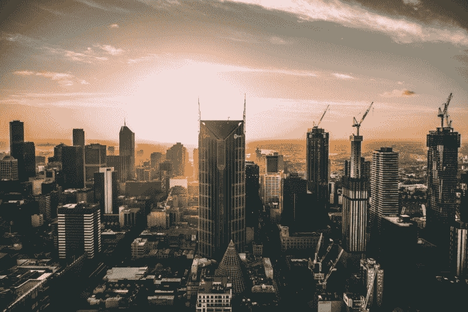

Photo by louis amal on Unsplash — [https://unsplash.com/photos/ic6CAdKfDZQ](https://unsplash.com/photos/ic6CAdKfDZQ)

2017 年即将结束，是时候反思一下自己做过的公益工作了。

在 [freeCodeCamp](https://www.freecodecamp.com/) 的帮助下，我一学会编程的基础，就渴望有所回报。我发现，通过加强组织的本地团队，我可能会发挥最大的作用。我想帮助走在同一条路上的人，并为这些群体提供一个交流的框架。

尽管我所做的不仅仅是组织聚会，但我想在这篇文章中重点介绍一下维也纳的 [freeCodeCamp 本地聚会。](https://www.meetup.com/Free-Code-Camp-Vienna)

> “消费文化永远不如生产文化有回报。”―米哈里·契克森米哈

### 我们聚会的简短介绍

Robert Axelsen 鼓起勇气，主动在维也纳成立了当地小组。罗伯特是一个了不起的人，我们很快就联系上了。自今年年初以来，我们都组织了聚会，并享受了组织的所有高潮和低谷。

meetup 本身目前专注于协作编码。我们谈论编程、项目的演示，以及来自开发世界的更新和新闻。

### 为什么组织活动很棒

我相信管理一个组织是你能做的最有回报的事情之一。不是因为你收到的反馈，而是因为任务本身的复杂性。

当组织聚会和活动时，人们不仅要处理特定活动的任务，如准备地点、赞助商、会谈和内容。你还必须与参与这个过程的所有人保持联系，并让自己参与到讨论的话题中去。

这种复杂性本身对组织者要求很高，并教会了他生活的许多方面。在我看来，这是创业的最佳准备。虽然很难适应每天的日程安排，但如果运用时间管理的基本原则，这是完全可行的。

组织活动很棒的另一个原因是，它迫使你增强自我意识，这是生活中的关键。了解你是谁，你的优势和劣势是什么，以及其他人如何看待你，这对发展更好的自己非常重要。

因为如果你对自己有妄想症，你怎么提升自己？

### 对非营利系统和实体的看法

在旅程中，似乎有必要通过一个非营利实体将工作正规化。我们在仔细尽职调查后做出了这个决定。建立一个类似企业的结构涉及组织中的许多新方面，例如与地方当局的通信，了解法律陷阱(特别是关于税法和竞争法)，以及对某些行动负责。

它引入并要求一个新的领域的能力和专业知识，但也允许额外的奖励。其中一些是:

*   免税
*   免费使用各种软件、产品和服务
*   官方补贴的可能性
*   设置之后:一种更有组织性的处理商业事务的方式

这里的要点是仔细审核可能的优势和劣势，并且[总是计算隐藏成本](https://en.wikipedia.org/wiki/Planning_fallacy)。

### 我在社交方面学到了什么，以及对小组工作的一些想法

我明白了，人真的是不一样的。我们有各种不同的人，来自不同的国家，不同的专业领域，不同的社会背景，当然还有不同的个性。

也就是说，我认为一个人可以拥有的最重要的能力之一是灵活和适应任何情况。这是组织聚会很棒的另一个原因——因为你学会了越来越灵活地与人相处。

我真正开始理解这一点是在我们的一次编码研讨会上。我们希望尽可能保持灵活性，为所有与会者提供良好的体验。尽管我们预料到这可能很困难，但我们目睹了惊人的结果。

在研讨会上，我们决定将与会者分成三个不同的小组，并鼓励他们合作开发一个项目。只有一个小组能够形成一个有能力进入流程并构建一个伟大项目的连贯单元。

我认为一个好的领导者应该能够识别自己的优势，给人们社交的界限，让他们发挥自己的潜力。每当一个团队无法启动工作流程时，要么是因为:

*   团体中没有领导权威，或者
*   领导权威不够。

随机组成群体忽视了每个人的个性特征，因此容易失败。必须有一个有能力承担领导责任的人，他也有足够的能力成功地完成这项工作。

在一个随机人群的集合中，增加一个成功结局的可能性的唯一方法就是尽量把群体的不均匀性安排得尽可能高，这样自然的分组就可以自由发生。

### 统计和印象

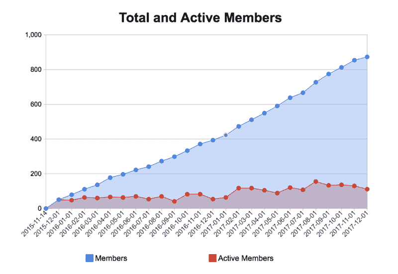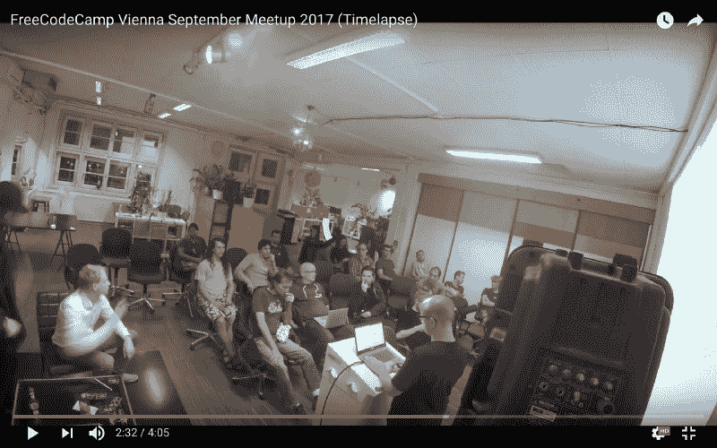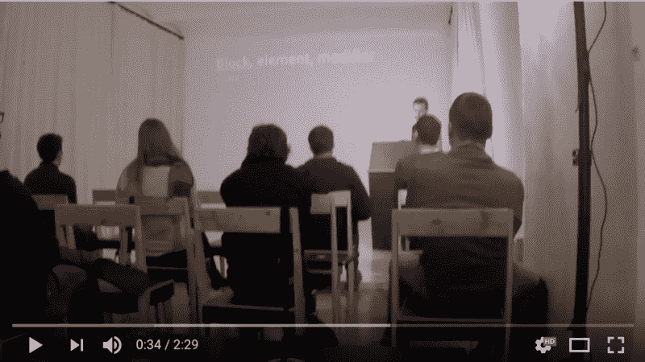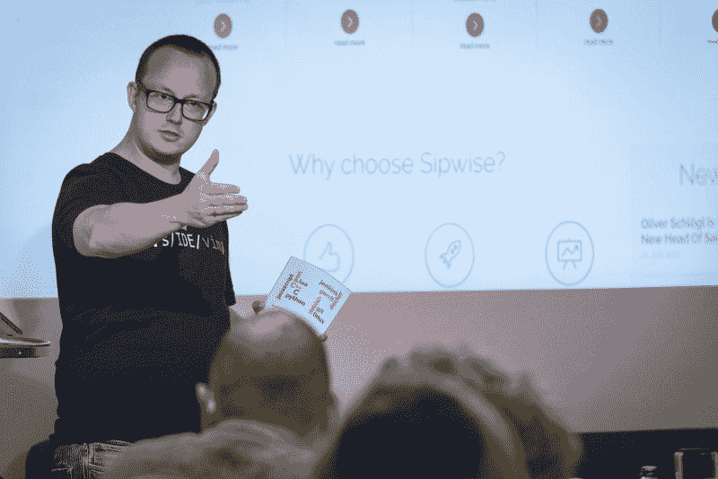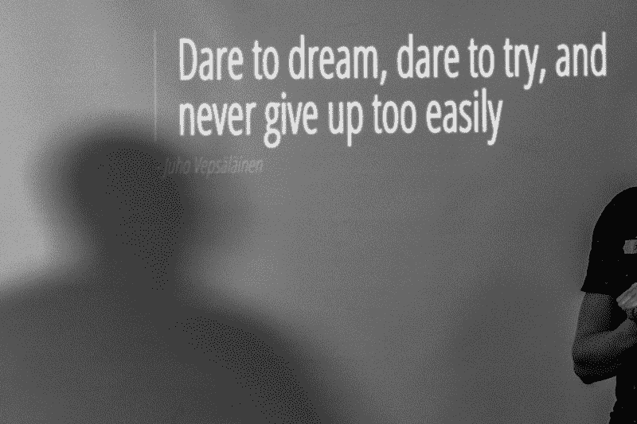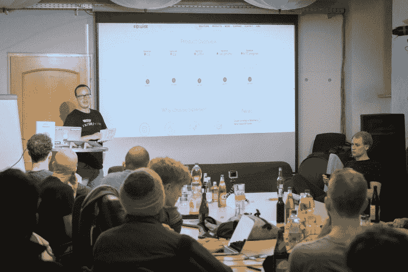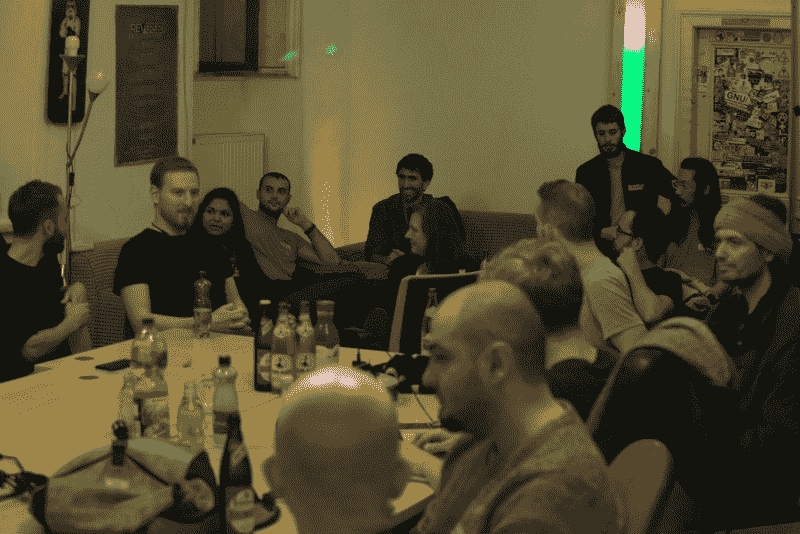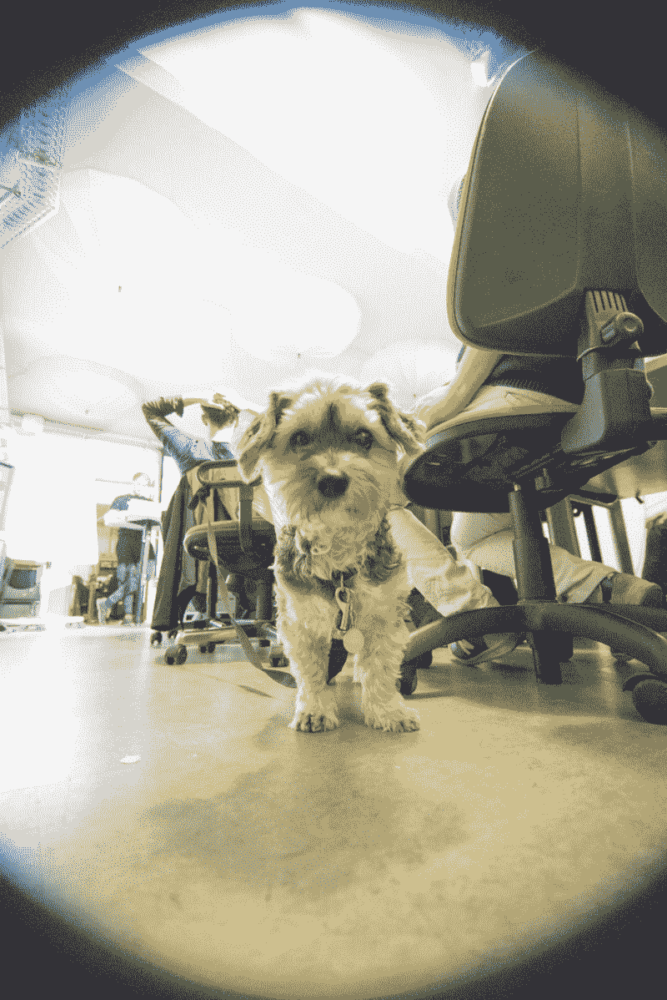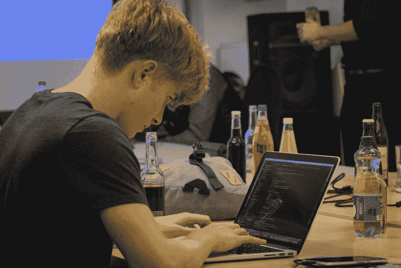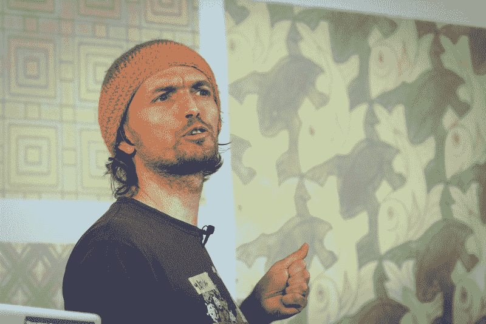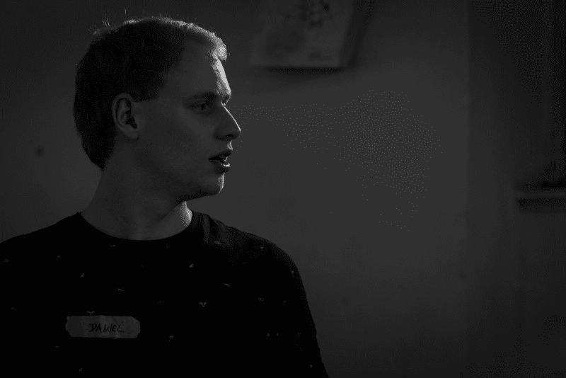

摄影:Slaven Fanfani

### 我组织的活动的未来

我对未来感到非常兴奋。为社会做贡献的方式有很多。当组织活动和聚会时，并不真的是炫耀技能或项目或提供娱乐。对我来说，这是发现人们的技能和潜力并赋予他们权力的一种方式。令人惊讶的是，许多人没有意识到自己的潜力。

因此，2018 年的目标将是提高人们的自我意识，帮助他们驾驭自己的力量。

我相信在未来会有非常大的对懂得编码的人的需求。未来属于那些能够控制最终将指导我们生活的机器的人。

保持动力！

### 关于活动和组织的更多信息

*   meetup 上的维也纳自由代码营
*   Github 及其[主页](https://fccvienna.github.io/)上的 freeCodeCamp Vienna
*   [Github](https://github.com/DevelopersRising/DevelopersRising)及其[主页](https://developersrising.herokuapp.com/)上的开发者

感谢阅读我的文章！请随时留下您的任何反馈。