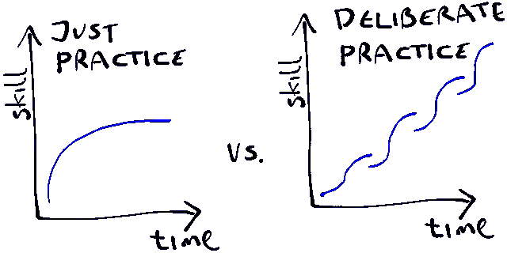

# 对我学习编程的第一个 1000 小时的反思

> 原文：<https://www.freecodecamp.org/news/reflections-on-my-first-1-000-hours-learning-to-code-17cd32e72f11/>

彼得·希金斯

# 对我学习编程的第一个 1000 小时的反思

“The mind, once stretched by a new idea, never returns to its original dimensions.” — Ralph Waldo Emerson

根据作者迈克尔·西蒙斯的说法，

> 学习是我们能做的最好的投资。

或者像本杰明·富兰克林说的，

> 对知识的投资回报最高。

今天是 2017 年 10 月 4 日，星期三，我即将踏上一段未知的学习和个人发现之旅，这段旅程将持续整整 513 天。在此期间，我将花大约 700 个小时自学，以及大约 500 个小时在编码训练营，共同的目标是过渡到软件开发人员的职业生涯。

快进到现在，我足够幸运地考虑各种工作机会，同时好奇地期待着我下一次旅程的开始。

这个故事是对过去 17 个月的反思，部分原因是这样做感觉既宣泄又及时，但主要是希望我可以为任何开始进入编程世界的人提供一些有用的见解。

考虑到这一点，让我们回到那个寒冷潮湿的星期三下午，回想当时的情景，我坐在咖啡店里开始 Codecademy 的[“从零开始建立网站”](https://www.codecademy.com/pro/intensive/build-websites-from-scratch)计划。在接下来的 13 个月里，我将完成近[40 门在线课程](https://1drv.ms/x/s!ArPSM5kzi_6FbxREfVnhMfMLJF0)，以及阅读四本书和无数媒体文章，所有这些都是为了一个单一的目的。

你可以说我成了一个辅导上瘾者，疯狂地从一个资源跳到下一个资源，寻找高级的学习，同时一丝不苟地记录我的进步。你们中的许多人可能会对这种行为产生共鸣，这让我想到了在整个过程中我学到的第一点，也可能是最基本的一点。

### 学习# 1——小心教程炼狱

我能够实现我的目标的一个主要原因与今天通过互联网可获得的广泛的高质量教育内容有关；通常是免费或费用相对较低。从平台如 [Udemy](https://www.udemy.com/) 、 [Pluralsight](https://www.pluralsight.com/) 和 [Frontend Masters](https://frontendmasters.com/) ，到个人贡献者如 [Tyler McGinnis](https://tylermcginnis.com/) 、 [Andrei Neagoie](https://medium.com/zerotomastery) 、 [Scott Tolinsky](https://www.scotttolinski.com/) 和 [Wes Bos](https://wesbos.com/) ，现在是成为一名有抱负的软件开发人员的最好时机。

然而，这种大量的简单学习有一个固有的问题。首先，它会鼓励被动消费，反过来给人一种学习的错觉，却没有带来很多好处。其次，它让你远离真正的课程，这些课程来自于*的艰苦学习*。你可能会问什么是*难学的东西。嗯，根据[将从](http://willsentance.com/)[铁匠](https://codesmith.io/)判决，*

> 学习任何新的东西都是困难的，也是精神上费力的——但是当你在理解中遇到必须克服的困难时，你会有最好的成长。克服这些障碍会给你解决问题的技巧和理解来处理新的问题。然而，正是在这些街区，你最有可能放弃。

我花了一年多一点的时间才完全理解 Will 在这里指的是什么，但当我理解时，它证明对我申请 Northcoders 开发者之路的决定有很大的影响。稍后会有更多关于这个编码训练营的内容，但是这里的要点是教程通常是一个新语言/框架/库的很好的起点。然而，不要让你自己依赖于仅仅被他们引导。你越早走出舒适区，着手构建实际的产品，你就会越早发现自己作为开发人员的能力和信心在增长。

### 学习# 2——高度选择性

第二个学习与我认为的我的*编码足迹*有关。这个比较关心的是*什么*，而不太关心*如何*。

对我来说，我想构建 web 和移动应用程序，所以我专注于学习 MERN 堆栈的基石；MongoDB，Express，React 和 Node.js，在 HTML，CSS 和 JavaScript 的坚实基础之上。你的志向可能不同，但是在技能的广度和知识的深度之间取得健康平衡的需要同样重要。

学习编程最具挑战性的一个方面是它是一个耗时的过程。在你达到合理的能力水平之前，需要数百个小时的刻意练习。

“Deliberate practice is not a comfortable activity. It requires sustained effort and concentration. The people who master the art of deliberate practice are committed to being lifelong learners — always exploring and experimenting and refining.” — James Clear

如果我再有一次机会，我会坦然接受这是一场马拉松而不是短跑的事实。例如，在探索流行的库和运行时(如 React 和 Node.js)之前，我会尝试更深入地了解 JavaScript。从一个热门话题跳到下一个热门话题太容易了，而实际上只是浏览了一下表面。

相反，在如何和在哪里投资时间方面要严格遵守纪律，要有足够的耐心，不要只看到眼前的回报。相信总有一天，你的知识会超过所有知识的总和；不仅提供了对更广阔的技术前景的更清晰的理解，而且增强了您在未来掌握新的库和框架的能力。对我来说，这是大约 800 小时，但里程将明显不同。

### 学习# 3——重复是所有学习之母

在我的旅程中，我常常面临着一个内在的困境，不知下一步该上哪门课(我知道，见学习#1？).例如，假设我对学习 React 感兴趣，我是通过官方的 t [utorial/](https://reactjs.org/tutorial/tutorial.html) d [文档，](https://reactjs.org/docs/getting-started.html)还是拿出一点钱去参加一个由[安德鲁·米德、](https://www.udemy.com/react-2nd-edition/) S [特芬·格里德、](https://www.udemy.com/react-redux/) T [泰勒·麦吉尼斯、](https://tylermcginnis.com/courses/react-fundamentals/) S [科特·托林克西](https://www.leveluptutorials.com/tutorials/react-16-for-everyone)或 W [es Bos、](https://reactforbeginners.com/)等等的课程。

我逐渐意识到，没有什么灵丹妙药，没有什么神奇的课程，甚至没有什么教学法可以让我快速学习。所以，我全都做了。

对许多人来说，这似乎是重复的，但正是通过这种重复，我的知识深度增长了。重要的是要记住，学习是一个旅程，而不是目的地。你永远不会真正到达目的地，所以要学会享受这个过程，并珍惜每隔一段时间重新走一遍的价值。

“The road is long, with many of winding turns.” — The Hollies

### 学习# 4——避免在真空中工作

我在 [Northcoders](https://northcoders.com/) 进行编码训练营的主要动机之一是，13 个月来，我几乎没有与任何人进行过技术对话，也没有接触过作为软件开发人员工作的其他基本方面，例如[敏捷原则](https://www.atlassian.com/agile)、[版本控制](https://git-scm.com/book/en/v2/Getting-Started-About-Version-Control)、[结对编程](https://en.wikipedia.org/wiki/Pair_programming)和[测试驱动开发](https://en.wikipedia.org/wiki/Test-driven_development)。随着我能力的增长，我从教程中获得的曾经强大的内啡肽效应开始减弱。

这也与我越来越渴望在真实项目中与其他人一起测试我新获得的技能形成了鲜明的对比。这不仅是一项非常有益的活动，而且对你的学习也有重大影响，因为它给你信心，让你作为一个集体解决更具挑战性的问题(见学习#1)。

虽然 Northcoders 的经历对我来说是一次非常积极的经历，但我意识到不是每个人都有机会参加编码训练营，不管是因为时间、经济还是地理上的限制。有鉴于此，我觉得有必要提一下 [freeCodeCamp](https://www.freecodecamp.org/) 。

在我开始编码之旅的六个月左右，我意识到了 freeCodeCamp，由于这个延迟的介绍，我不确定在丰富的课程中从哪里开始。我也必须承认，我发现他们以学生为中心的学习方式令人望而生畏，最终我被吸引回到我已经习惯的更简单的方式。

事后看来，我认为这是一个错误，因为正是在这种不明确、无组织和不舒服的环境中，学习效果最好。

freeCodeCamp 的另一个内在好处是，你可以接触到一个由志同道合的人组成的充满活力的社区，你可以与他们分享奋斗和快乐。我不能从个人经历来说，但如果我重新开始，我可能会从这里开始我的旅程。

### 学习# 5——记录你的进步

最后但同样重要的是，我强烈建议你记录下你投入这项工作的时间。我把这个策略提升到了一个全新的高度，感兴趣的人可以看看这里的。现在，我不相信你需要像我一样一丝不苟，但我能说什么呢，我坚信**如果你想改善什么，就从测量它开始**。

说到跟踪，我强烈建议你尽早熟悉 [Git](https://www.atlassian.com/git) /GitHub 的工作方式。如果你正在学习一个教程，把它当作一个迷你项目，少而频繁地提交你的修改。你不仅会发展肌肉记忆，这将在专业环境中为你提供很好的服务，而且未来的雇主经常会查看你的 GitHub 历史，所以从就业角度来看，留下你一直在做什么的有意义的线索只会是一件好事。

“We’ll be right back with Jerry’s final thought.” — The Jerry Springer Show

最后，正如我已经提到的，学习编码的最大挑战可以归结为时间。这不仅仅是找到它，更具体地说，是在体育专家所描述的专注而努力的训练中投入足够的时间。

记住这一点，在这个漫长的过程中保持你的动力是你成功的关键。乔·迪马吉奥，棒球历史上最伟大的击球手之一，[用一支粉笔在他地下室的墙上记录每一次练习挥杆。科比·布莱恩特，有史以来最成功的篮球运动员之一，](https://jamesclear.com/deliberate-practice-myth)[在训练中数着每一次跳投，以确保他投进了 800 个](https://jamesclear.com/deliberate-practice)。对我来说，我诚实而详细地记录了我投入的每一个**质量**小时，因为看着这个数字随着时间的推移而增长，我更容易在士气低落时重新调整我的注意力。

想想这个离别的想法:自从埃德蒙·希拉里爵士和夏尔巴人丹增·诺盖于 1953 年首次征服珠穆朗玛峰以来，已有超过 4000 人成功登顶。虽然他们各自的技能、资源和方法毫无疑问会有所不同，但一个共同的特点是他们都是一步一步地完成的。无论挑战有多高，如果你能成功地将它分解成更小的挑战并依次解决它们，你成功的机会将会大大增加。

毕竟，在最抽象的层面上，这是软件开发的根本所在。

[Breaking Down The Problem](https://www.cs.kent.ac.uk/people/staff/djb/ProblemSolving/doc1.n-S-3.html)

深呼吸…这篇文章已经变得比我最初打算的要长得多，所以对于那些已经读到这里的人，我感谢你们的时间，并希望你们带着一些有用的收获离开。对于那些有不耐烦倾向先看一本书最后一页的人，我给你们提供这个…

### TL；速度三角形定位法(dead reckoning)

*   在线教程是有效学习一门新语言/框架/库的基础的好方法，但是要尽快摆脱它们。
*   不要害怕奋斗甚至失败，因为最好的学习是在这种奋斗中完成的。
*   理解把一个复杂的问题分解成更小、更简单的问题，然后重新组合你的解决方案的价值。
*   让你的周围都是志同道合的人，可以参加聚会，参加训练营，或者只是网上聊天。
*   了解*常规练习*和[刻意练习 的区别。争取后者。](https://jamesclear.com/beginners-guide-deliberate-practice)
*   编码训练营是加速获得软件开发员工作的一个好方法。一个高质量的项目不仅会给你所需要的技术基础，还会帮助你在潜在雇主的眼中验证这些能力。
*   如果你确实选择了编码训练营，试着事先投入至少 150 小时的高质量自学。这不仅能保证编码对你来说是正确的，还能让你在一个密集的过程中受益匪浅。
*   记录你的进步。作为一名软件开发人员，每天都是学习的机会，这个过程永远不会结束。学会享受旅程，少担心到达一个特定的目的地。

最后…

*   编写高质量的代码不可避免地涉及到[站在巨人](https://en.wikipedia.org/wiki/Standing_on_the_shoulders_of_giants)的肩膀上。这有多种形式，可以是同事的作品、流行的框架/库或者语言本身。这是编程的一个美妙而固有的方面，但是要注意，伸出援手也是值得的。做贡献者，也做消费者。

### 有用的资源

*   对于 HTML 和 CSS，我推荐 Udemy 上的 [Jonas Schmedtmann 的课程](https://www.udemy.com/design-and-develop-a-killer-website-with-html5-and-css3/)。
*   对于 JavaScript，我**高度**推荐[将在前端大师上宣判的三门课程](https://frontendmasters.com/teachers/will-sentance/)。这些都是中级水平，所以我会在完成 JavaScript 入门课程后进行，比如[这个](https://tylermcginnis.com/courses/modern-javascript/)。
*   对于 React，我推荐泰勒·麦金尼斯的课程。泰勒非常了解被动学习的危险，并提供了高度吸引人的材料，包括阅读、观看和动手开发。对我来说是神圣的三位一体。
*   对于 Node.js，我推荐 Udemy 上的[安德鲁·米德的课程](https://www.udemy.com/the-complete-nodejs-developer-course-2/)。[Mosh hame dani 的这首](https://www.udemy.com/nodejs-master-class/)也很不错；尤其是如果您对构建 RESTful API 感兴趣的话。我两样都做？(参见上面的学习#3)。
*   对于 MongoDB，我推荐 Udemy 上的 [Stephen Griders 的课程](https://www.udemy.com/the-complete-developers-guide-to-mongodb/)。他有很多很好的课程，但由于数量太多，这些课程可能会有点过时。值得查看一下他最后一次刷新内容是什么时候。其实任何课程都可以这么说。
*   对于其他一切，有万事达卡。开个玩笑，试试 freeCodeCamp？

祝你在未来的旅途中好运，无论它会带你去哪里！请在下面的评论区随意提问。

编码快乐！

#### 如果你喜欢这个故事，请保持联系。你可以在[Medium](https://medium.com/@pahiggins)/[LinkedIn](https://www.linkedin.com/in/p3rh5s/)/[Twitter](https://twitter.com/pahiggins)上关注我，我会在那里分享更多未来学习编程的技巧。