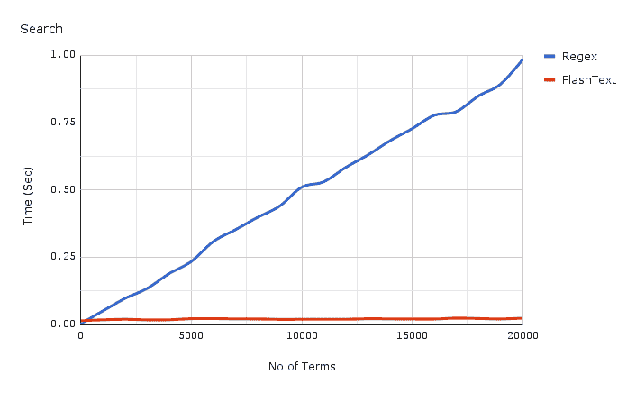
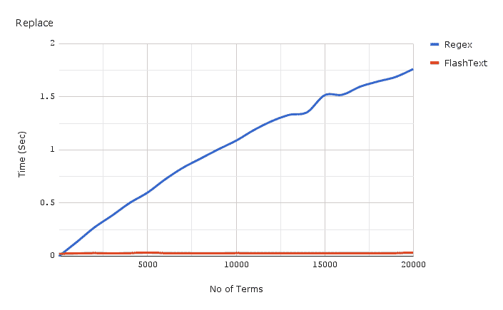
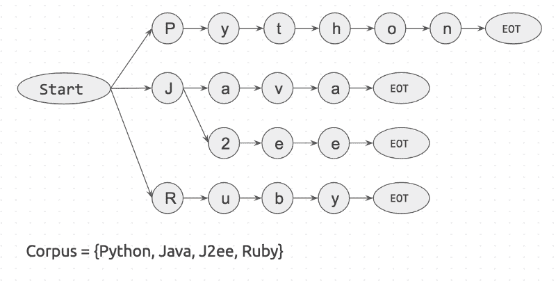
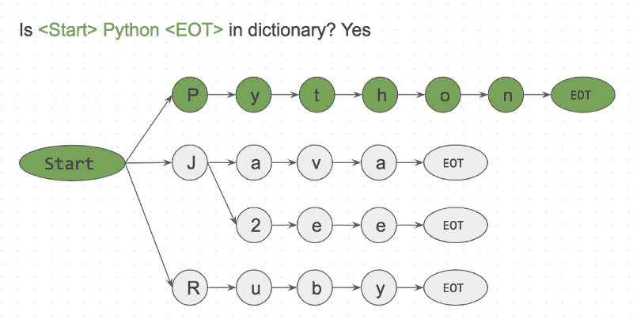
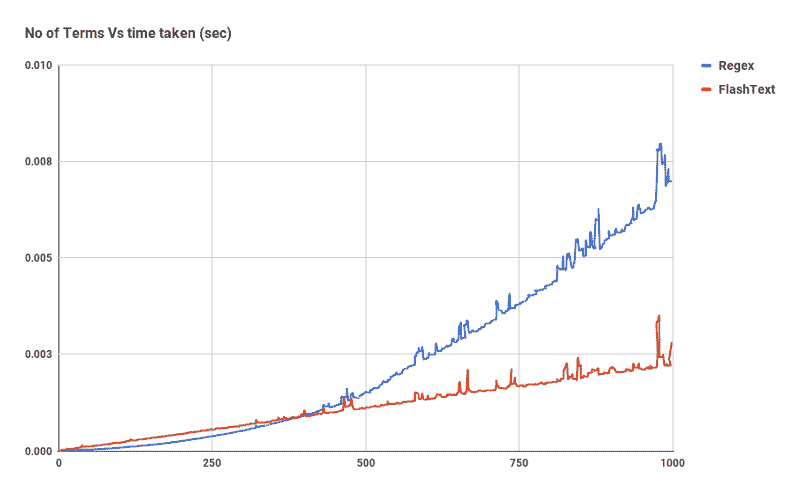

# Regex 花了 5 天时间运行。所以我做了一个工具，它能在 15 分钟内完成。

> 原文：<https://www.freecodecamp.org/news/regex-was-taking-5-days-flashtext-does-it-in-15-minutes-55f04411025f/>

维卡什·辛格

# Regex 花了 5 天时间运行。所以我做了一个工具，它能在 15 分钟内完成。


[dia057](https://unsplash.com/@dia057) | [Unsplash](http://unsplash.com/)

当开发人员处理文本时，他们通常需要首先清理文本。有时候是通过替换关键词。比如把“JavaScript”换成“Javascript”。其他时候，我们只是想知道文档中是否提到了“JavaScript”。

像这样的数据清理任务是大多数处理文本的数据科学项目的标准。

### **数据科学从数据清洗开始。**

我最近有一个非常相似的任务。我在 Belong.co 担任数据科学家，自然语言处理是我工作的一半。

当我在我们的文档语料库上训练一个 [Word2Vec](https://en.wikipedia.org/wiki/Word2vec) 模型时，它开始给出相似术语的同义词。“JavaScript”是一个类似于“JavaScript”的术语。

为了解决这个问题，我编写了一个正则表达式(Regex ),用标准化的名称替换所有已知的同义词。正则表达式用“JavaScript”替换了“JavaScript”**，解决了一个问题，但又产生了另一个问题。**

> **有些人在遇到问题时会想:“我知道，我会使用正则表达式。”现在他们有两个问题。**

**上面的引用来自这个[栈交换问题](https://softwareengineering.stackexchange.com/questions/223634/what-is-meant-by-now-you-have-two-problems)，它对我来说实现了。**

**事实证明，如果要搜索和替换的关键字数量在 100 个以内，Regex 是很快的。但是我的语料库有超过 2 万个关键词和 300 万个文档。**

**当我对我的正则表达式代码进行基准测试时，我发现完成一次运行需要 **5** **天**。**

**

oh the horror** 

**自然的解决方案是并行运行它。但是，当我们拥有数以万计的文档和数以万计的关键词时，这将无济于事。一定有更好的方法！我开始寻找它…**

**我在我的办公室和堆栈溢出上询问了一下——出现了一些建议。[维奈·潘迪](https://www.linkedin.com/in/vinay-pande-54810813/)、[苏雷什·拉克什马南](https://www.linkedin.com/in/suresh-lakshmanan/)和[栈溢出](https://stackoverflow.com/questions/44178449/regex-replace-is-taking-time-for-millions-of-documents-how-to-make-it-faster)指向了被称为[Aho-coraseck 算法](https://en.wikipedia.org/wiki/Aho%E2%80%93Corasick_algorithm)和 [Trie 数据结构](https://en.wikipedia.org/wiki/Trie)的漂亮算法方法。我寻找现有的解决方案，但没找到多少。**

**于是我写了自己的实现，于是 [FlashText](https://github.com/vi3k6i5/flashtext) 诞生了。**

**在我们深入了解什么是 FlashText 以及它是如何工作的之前，让我们先来看看它在搜索方面的表现:**

**

Red Line at the bottom is time taken by FlashText for Search** 

**上面显示的图表是一个文档的编译正则表达式和 FlashText 的比较。随着关键字数量的增加，Regex 所用的时间几乎呈线性增长。然而，有了 FlashText，这并不重要。**

#### **FlashText 将我们的运行时间从 5 天缩短到 15 分钟！！**

**

we are good now :)** 

**这是替换的 FlashText 计时:**

**

Red Line at the bottom is time taken by FlashText for Replace** 

**上面显示的用于基准测试的代码在这里链接[，结果在这里](https://gist.github.com/vi3k6i5/dc3335ee46ab9f650b19885e8ade6c7a)链接[。](https://goo.gl/wWCyyw)**

### ****那么什么是 FlashText 呢？****

**FlashText 是我在 GitHub 上开源的 Python 库。它在提取关键词和替换关键词方面都很有效。**

**要使用 FlashText，首先你必须给它传递一个关键字列表。该列表将在内部用于构建 Trie 字典。然后向它传递一个字符串，告诉它是否要执行替换或搜索。**

**对于`**replace**`,它会用替换的关键字创建一个新的字符串。对于`**search**`,它将返回在字符串中找到的关键字列表。这将在输入字符串的一次传递中完成。**

**以下是一位快乐的用户对该库的评价:**

### **为什么 FlashText 这么快？**

**让我们试着用一个例子来理解这一部分。假设我们有一个包含 3 个单词的句子`I like Python`，以及一个包含 4 个单词的语料库`{Python, Java, J2ee, Ruby}`。**

**如果我们从语料库中提取每个单词，并检查它是否出现在句子中，将需要 4 次尝试。**

```
`is 'Python' in sentence? is 'Java' in sentence?...`
```

**如果语料库中有`n`个单词，它就会产生`n`个循环。还每搜索一步`is <word> in sen`腾讯？会慢慢来。这是正则表达式匹配中发生的情况。**

**还有一种方法与第一种方法相反。对于句子中的每个单词，检查它是否存在于语料库中。**

```
`is 'I' in corpus?is 'like' in corpus?is 'python' in corpus?`
```

**如果这个句子有`m`个单词，它就会出现`m`个循环。在这种情况下，花费的时间仅仅取决于句子的字数。而这一步，`is <word> in c` orpus？可以通过字典查找快速完成。**

**FlashText 算法基于第二种方法。它的灵感来自 Aho-Corasick 算法和 Trie 数据结构。**

**它的工作方式是:
首先用语料库创建一个 Trie 字典。它看起来有点像这样:**

**

Trie dictionary of the corpus.** 

**Start 和 EOT(术语结束)代表单词边界，如`space`、 `period` 和 `new_line`。关键字只有在两边都有单词边界时才会匹配。这将防止匹配菠萝中的苹果。**

**接下来我们将获取一个输入字符串`I like Python`并逐字符搜索。**

```
`Step 1: is <start>I<EOT> in dictionary? NoStep 2: is <start>like<EOT> in dictionary? NoStep 3: is <start>Python<EOT> in dictionary? Yes`
```

**

<Start> Python <EOT> is present in dictionary.** 

**由于这是一个逐字符的匹配，我们可以很容易地跳过`<start>lik`e<T1 在< s `t` art > l，因为 l 是连接到 start 的 `not` 。这使得跳过遗漏的单词真的很快。**

**FlashText 算法只检查输入字符串“我喜欢 Python”的每个字符。这本字典很可能有一百万个关键字，对运行时没有任何影响。这就是 FlashText 算法的真正威力。**

### **那么什么时候应该使用 FlashText 呢？**

**简单回答:当关键词数量> 500 时**

**

For search FlashText starts outperforming Regex after ~ 500 keywords.** 

**复杂的回答:Regex 可以搜索基于特殊字符的关键字，比如 FlashText 中不支持的`^,$,*,\d,.`。**

**所以想匹配``word\dvec``这样的偏词是不行的。但是对于提取``word2vec``这样的完整单词是很优秀的。**

### **用于查找关键词的 flash 文本**

### ****替换关键字的 FlashText】****

**除了提取关键词，你还可以替换句子中的关键词。我们将此作为数据处理管道中的数据清理步骤。**

**如果你认识从事文本数据、实体识别、自然语言处理或 Word2vec 工作的人，请考虑与他们分享这个博客。**

**这个库对我们非常有用，我相信它对其他人也会有用。**

**再见，感谢所有的掌声？**