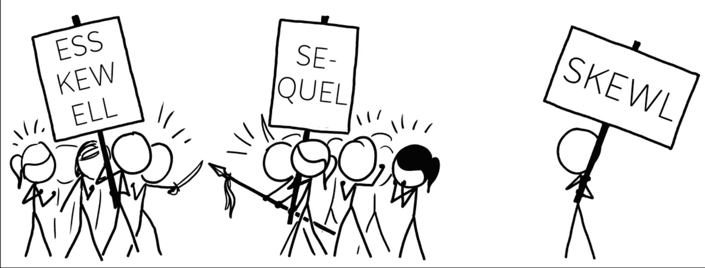

# 关系数据库和非关系数据库——SQL 数据库和 NoSQL 数据库的区别

> 原文：<https://www.freecodecamp.org/news/relational-vs-nonrelational-databases-difference-between-sql-db-and-nosql-db/>

本文概述了关系数据库和非关系数据库。

除了学习这两种类型的数据库之间的基本区别之外，您还将通过研究它们的优缺点来学习如何决定在您的下一个项目中使用哪一种。

以下是我们将要介绍的内容:

1.  [定义数据库](#definition)
    1.  [什么是 SQL？](#sql)
2.  [关系数据库](#relational)
    1.  [特性](#characteristics)
    2.  [酸性](#acid)
3.  [非关系数据库](#non-relational)
    1.  [类型](#types)
    2.  [基础属性](#base)
4.  [关系数据库与非关系数据库](#pick)
5.  [进一步学习](#extra)

## 什么是数据库？初学者的定义

就计算而言，数据是以不同形式出现的信息片段。数据可以是文本、数字、图像、音频片段或视频。

信息的集合需要被存储、处理和解释。

您需要一种方法，以便在需要时轻松搜索、访问、提取和检索保存的资源。

这使得计算机和人类都可以分析访问的数据，进行计算和比较，做出逻辑决策，并得出结论。

你可以使用 Excel 电子表格等软件程序将数据存储在某种文件中，这样就能完成工作。

但是，如果有大量的数据，并且您需要确保它们是准确的，该怎么办呢？

或者，如果您需要快速检索大型数据集，该怎么办？

或者，如果数据需要遵循预定义的结构，该怎么办？

数据库是一种更易访问、更高效、更有组织的长期存储和处理信息的方式。

逻辑地、系统地存储数据并在以后检索数据的能力使数据库成为所有 web 应用程序的关键部分。

数据库为所有应用提供动力。它们保存和存储用户信息，如用户名、电子邮件地址、加密密码和物理地址。

它们还存储用户行为。例如，在电子商务商店中，数据库保存并跟踪您标记为“收藏夹”的商品。

你需要一个数据库管理系统来管理你的数据库。

数据库管理系统是一个软件程序，作为最终用户和数据库本身之间的中介。

它允许用户创建和管理数据库。它还允许用户通过执行称为查询的操作来访问、修改和操作存储在数据库中的数据。

借助一些命令，用户可以轻松地存储、检索、更新和删除数据。

说到数据库管理系统，通常有两种类型可供选择:

*   **关系数据库**(也称为 **SQL 数据库**
*   **非关系数据库**(也称为 **NoSQL 数据库**)

### 什么是 SQL？

SQL 是结构化语言 **Q** 查询 **L** 的缩写。

你可能会听到它以两种方式发音-“*s . q . l .*”(ess-kew-ell)，或者“ *se-quel* ”(就像一部电影的续集)。



https://i.imgur.com/NtGaNA8.png

不管怎样，SQL 是一种用于处理数据库的语言。

具体来说，使用 SQL，您可以编写数据库查询来与数据库通信。这些可以是用于执行任何 CRUD(创建读取更新删除)操作的命令。

SQL 是关系数据库管理系统的首选语言，您将在下一节中了解这一点。

## 什么是关系数据库？

关系数据库(或 SQL 数据库)已经存在了一段时间。第一个关系数据库出现在 1970 年，它们至今仍然流行。一些最常用的是:

*   [PostgreSQL](https://www.postgresql.org/)
*   [微软 SQL 服务器](https://www.microsoft.com/en-us/sql-server/sql-server-downloads)
*   [MySQL](https://www.mysql.com/) 的实现
*   [甲骨文](https://www.oracle.com/index.html)
*   [SQLite](https://sqlite.org/index.html)

关系数据库以结构化和表格化的方式存储数据。也就是说，它将信息存储在**表**中，您可以将它视为数据的存储容器。例如，一家公司可以有一个`employees`表来存储其雇员的数据。

关系数据库有一个严格的、静态的、预定义的逻辑**模式**。您可以将数据库模式视为一个组织蓝图——一组规则，规定什么可以进入表中，什么不可以进入表中，以及如何配置数据的条件。

在每个表中，至少有一个**列**。这些列有特定的数据类型，比如`INTEGER`或`VARCHAR`。在`employees`表中，一些列可能是`employee_id`、`name`、`department`、`email`和`salary`。

列和每列中允许的数据类型构成了模式。

```
 EMPLOYEES

+-------------+------+------------+-------+--------+
| employee_id | name | department | email | salary |
+-------------+------+------------+-------+--------+ 
```

一个表还会有**行**，或者*记录*。记录是需要遵守预定义模式的单个数据值条目。本质上，它是一个单一的项目。

```
 EMPLOYEES
+-------------+------------------+------------+-----------------------+--------+
| employee_id |       name       | department |         email         | salary |
+-------------+------------------+------------+-----------------------+--------+
|           1 |  John Doe        | IT         | johndoe@company.com   |   3500 |
|           2 |  Kelly Kellinson | Marketing  | kelly@company.com     |   1500 |
|           3 |  Mike Manson     | Product    | mikekane@company.com  |   2300 |
+-------------+------------------+------------+-----------------------+--------+ 
```

由于关系数据库支持 SQL，您可以执行查询。例如，如果您想将月薪为`greater than 2000 dollars`的`employees`的`names`设为`view`，那么您将编写以下 SQL 查询:

```
SELECT name FROM employees
WHERE salary > 2000; 
```

从上面的查询中，您将获得以下输出:

```
+-------------+
|    name     |
+-------------+
| John Doe    |
| Mike Manson |
+-------------+ 
```

### 关系数据库的特征

到目前为止，您已经知道关系数据库:

*   是表格形式的，
*   非常有组织，存储的数据结构良好，
*   有一个严格的、僵化的、预先定义的模式，
*   使用 SQL 执行数据库查询和操作数据。

此外，一个关系数据库可以有不止一个表，正如这种类型的数据库管理系统的名字所暗示的，这些表是彼此相关的。

例如，一个电子商务公司可能有一个`products`表、一个`users`表、`emails`表和一个`orders`表。

由于表和表中存储的信息之间存在链接和联系，您甚至可以使用一些命令来连接表。

有一个*主键*，它作为一个标识符，确保表中的每一项都是唯一的，从而确保表中没有重复和冗余的数据。

并且有一个*外键*创建表之间的那些预先建立的关系。

不同表中的数据点可以有不同的关系:

*   **一对一的关系**。在这种情况下，一个表中的记录只与另一个表中的一个记录相关。电子商务商店中一对一关系的一个例子是，一个用户只能有一个电子邮件地址，并且一个电子邮件地址只能属于一个用户。
*   **一对多关系**。在这种情况下，一个表中的一条记录与另一个表中的许多其他记录相关。例如，在一个电子商务商店中，一个用户可以下许多订单，但是这些订单中的每一个都是由一个用户下的。
*   **多对多关系**。在这种情况下，一个表中的一条或多条记录可以与另一个表中的一条或多条记录相关。比如一个电商店铺，一个订单可以有很多产品，一个产品可以订很多次。

### 关系数据库中的 ACID 属性

关系数据库提供了 ACID 数据库一致性模型。

酸是一种物质的首字母缩略词，它代表一种物质，一种物质，一种物质，一种 T2，一种物质，一种物质，一种物质，一种物质，一种物质，一种物质，一种物质，一种物质，一种物质，一种物质。

**原子性**意味着事务是原子性的，并采取“全有或全无”的方法。

例如，要么整个操作成功并从头到尾完成，要么不成功，出现整个操作“回滚”。

所有操作都保证以成功或失败而告终，没有一个只是部分成功。

**一致性**是确保数据库结构从事务开始到结束保持不变的属性。它确保进入数据库的任何数据都遵循适当设置的规则和约束。它保护和维护关系数据库中数据的完整性。

**隔离**意味着不管在任何时刻发生的事务数量，每个事务都被视为一个原子的、独立的单元，并且事务似乎是按顺序发生的。

例如，如果两个事务同时发生，该属性确保一个事务以及其中发生的更改不会以任何方式影响另一个事务。

最后，**持久性**意味着来自事务的任何结果和更改都是提交的，因此是永久的，并且将持续下去，即使出现系统故障。

Tge ACID 模型确保了数据库的可靠性和安全性。

## 什么是非关系数据库？

非关系数据库也称为 NoSQL 数据库。你会经常看到 NoSQL 既代表“**N**ot**o**only**SQL**”也代表“非 SQL”。

不管怎样，非关系数据库指的是不使用关系数据模型的数据库。

虽然这个术语和这种类型的数据库已经存在了几十年，但 NoSQL 数据库在 20 世纪 90 年代后期开始获得发展势头，当时互联网越来越受欢迎。

单靠关系数据库无法应对互联网使用的增长和新开发的网络应用程序所要求的速度——以及大量和复杂的数据。

一些最流行的非关系数据库是:

*   [MongoDB](https://www.mongodb.com/) ，
*   [再说](https://redis.io/)，
*   阿帕奇卡珊德拉，
*   [Google Cloud Bigtable](https://cloud.google.com/bigtable) ，
*   [亚马逊 DynamoDB](https://aws.amazon.com/dynamodb/) 。

非关系数据库不以表格格式存储和组织数据。不同数据点之间没有表格、行、列或关系。

相反，数据存储在**集合**中。数据库通常是非结构化的，使用动态模式。

### 非关系数据库的类型

有四种主要类型的非关系数据库:

*   **面向列的数据库**，
*   **键值数据存储器**，
*   **面向文档的商店**，
*   **面向图形的数据库**。

**面向列的数据库**在概念上类似于关系数据库。但是它们使用组或列集(也称为列族)而不是行来逻辑组织相关数据。

通过使用与单个列相关联的唯一行键，可以独立访问列族。搜索特定数据要快得多，并且节省了大量时间，因为不需要在一排排不相关的信息中查找您要搜索的内容。

**键值存储**是最简单的非关系数据库类型之一。

数据以键值对集合的形式存储在字典或哈希表中。

这种类型的数据库具有需要唯一的键。

键充当指向特定值的指针，并与该值相关联。

分配给键的值可以是任何信息和数据类型。

要检索和访问该值，可以使用唯一键作为引用。

**面向文档的存储**也以键值对的方式存储数据。但是在这种情况下，值是一个以惟一键作为标识符的文档。

文档可以是任何格式，比如 XML、YAML 或二进制，但通常是 JSON 格式。

这种类型的数据库以半结构化的方式存储数据。

没有模式或预定义的结构。因此，如果项目的需求发生变化，它提供了重新安排和重新工作数据库结构的灵活性和能力。

它还提供了类似 SQL 类型的查询语言或 API 来对数据执行查询和 CRUD 操作。

**图数据库**是非关系数据库中最复杂的一种，它们可以处理大型数据集。

他们关注数据元素之间的联系和关系，并使用图论来存储、搜索和管理这些关系。

它们使用*节点*来存储数据，并表示一个单独的实体或一段数据。一个节点连接并链接到另一个节点。

为了表示实体之间的连接或关系，图形数据库使用*边*。

### 非关系数据库中的基本属性

非关系数据库提供了基本的数据库一致性模型。这种模型不像关系数据库的 ACID 模型那样严格。

BASE 是以下单词的首字母缩写:

*   **B** asic **A** 可用性。这个模型并不关注数据的即时一致性。然而，该系统似乎在持续工作，并保证数据随时可用。
*   **S** oft 状态。由于缺乏即时的一致性，系统的状态可能会随着时间而改变。软状态意味着系统不需要写一致性。
*   事实上的一致性。最重要的是数据的持续可用性，而不是数据的一致性。然而，最终在某个时候，你可以期望数据是一致的。当系统停止接收输入时，可能会出现这种情况。

## 如何在 SQL 和 NoSQL 数据库之间做出选择

在学习了 SQL 和 NoSQL 数据库的基础知识之后，您可能想知道在您的项目中应该选择哪一个。

这个问题没有明确的答案。

这两种数据库都有优点和缺点，这在很大程度上取决于您正在构建的应用程序的类型、您将处理的数据的种类以及您未来的目标。

对于公司来说，为他们的产品使用这两种类型的数据库是很常见的。

下面是他们的特点的快速总结，以帮助您决定哪一个可能适合您。

### 何时使用 SQL 数据库:

*   您需要分布在多个表中的高度结构化的数据。您需要您的数据遵循严格的、可预测的、预定义的和已经计划好的模式。
*   您的数据将保持相对不变。如果您不打算频繁更改数据库的结构，并且不需要定期更新项目，SQL 数据库是很方便的。请记住，它们提供的灵活性很小。
*   你需要一致的数据。
*   数据完整性和安全性是重中之重。
*   您需要复杂查询的准确结果。

SQL 数据库的一个缺点是它们是纵向扩展的。

当您收集和存储更多数据时，您将需要增加当前机器的硬件和计算能力。

这可能代价高昂。

需要增加处理能力和内存存储来应对负载的增加，从而提高性能。

### 何时使用 NoSQL 数据库:

*   您正在一个快速开发的环境中工作，该环境需要频繁地适应需求，并不断地更改数据库结构。
*   您正在处理大量不同性质的数据，但不需要太多的结构或准确性。
*   您正在处理需要频繁更新的数据。NoSQL 数据库提供了一个松散、灵活、动态的模式，允许定期更改数据。
*   您想要快速的查询结果和系统的持续可用性。
*   您不想对数据库进行任何前期规划、准备或设计，而是想立即开始构建。

NoSQL 数据库的一大优势是它们可以水平扩展。

它们被设计成可以在现有的机器上增加更多的机器(比如云服务器)。与需要额外 CPU(中央处理器)或 RAM(随机存取存储器)资源的垂直扩展相比，这种行为更可取。

当然，NoSQL 数据库的一个缺点是它们不能确保数据的完整性和一致性。

## 进一步学习

这篇文章只是触及了皮毛，最好的学习方法是通过实践。

以下是一些学习资源，可帮助您了解有关数据库和 SQL 的更多信息:

*   [学习面向初学者的免费关系数据库课程](https://www.freecodecamp.org/news/learn-sql-free-relational-database-courses-for-beginners/)。为这篇文章添加书签，获取免费的 SQL 课程列表。
*   [freeCodeCamp 的关系数据库认证](https://www.freecodecamp.org/learn/relational-database/)。在本课程中，您将学习必要的开发工具。然后您将学习如何使用代码编辑器、命令行和 Git。您还将学习使用 PostgreSQL(一种关系数据库管理系统)和它的查询语言 SQL。
*   [在这个 3 小时的课程中了解 NoSQL 数据库](https://www.freecodecamp.org/news/learn-nosql-in-3-hours/)。在本课程中，您将了解四种不同的 NoSQL 数据库类型。除了学习理论之外，您还将练习构建所有四个组件。

## 结论

你已经到文章结尾了！

希望它已经帮助您理解了关系数据库和非关系数据库之间的主要区别。你也有一些额外的资源来开始学习和实践你的新技能。

感谢您的阅读，祝您编码愉快！