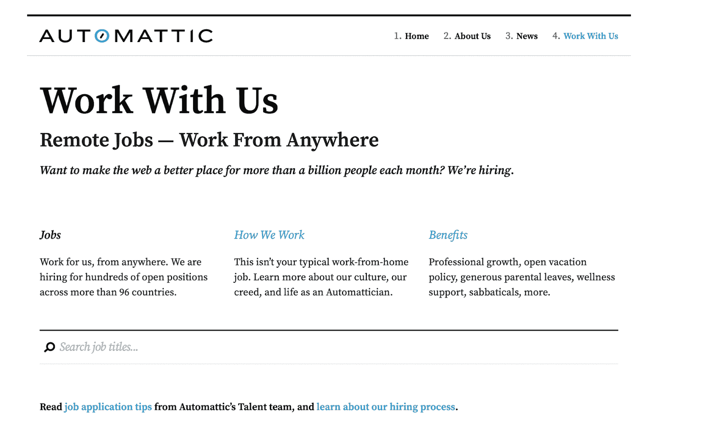
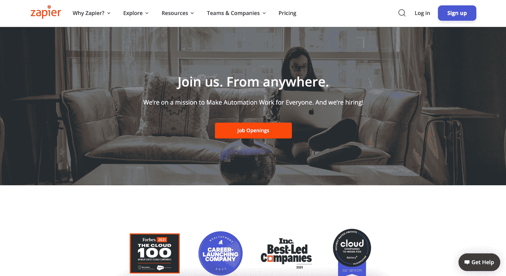
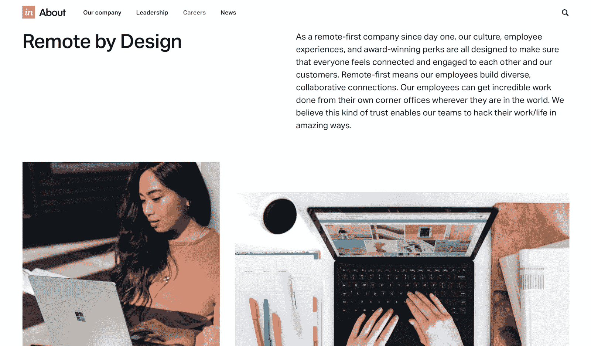
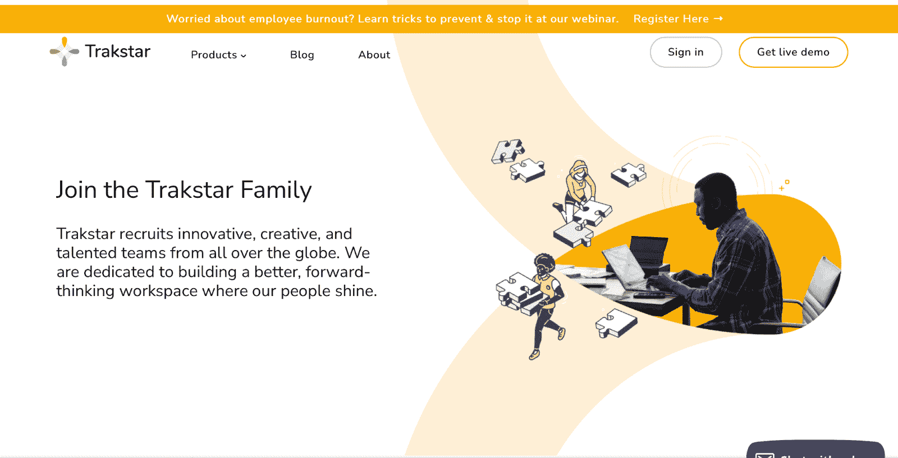
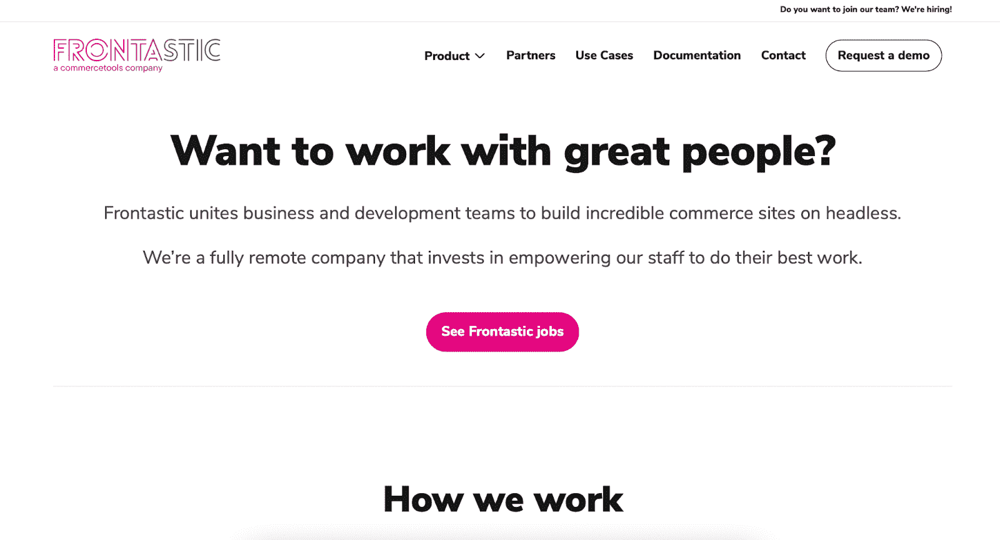
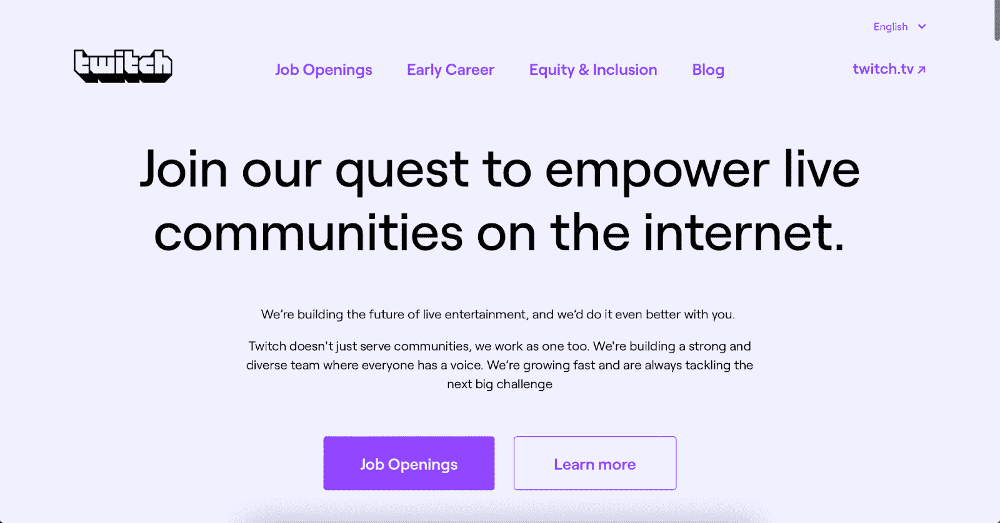

# 2022 年十大面向开发人员的远程工作公司

> 原文：<https://www.freecodecamp.org/news/remote-work-companies-for-developers/>

寻找一份远程开发工作可能会很棘手。你想为一家认可远程员工价值的公司工作，你想确保公司会支持和鼓励你的远程工作方式。

如果你是一名开发人员，正在寻找在家工作的机会，只有少数工作可以真正为你提供极大的灵活性、支持性的环境和可管理的工作量。

如果你正在读这篇文章，你可能想要一份提供远程工作的公司的名单。不幸的是，大部分的列表都已经过时了，或者充满了并非 100%远程的工作。

记住这一点，在本文中，您会发现一个以这样或那样的方式雇佣远程开发人员的真实公司列表。您还将了解这些公司是做什么的，以及它们是如何相互竞争的。

## 远程工作的好处是什么？

远程工作越来越受欢迎。它提供了在其他工作环境中找不到的灵活性、自主性和自由度。除此之外，远程工作还可以提高生产力和创造力。

Nicholas Bloom [进行了一项实验](https://hbr.org/2014/01/to-raise-productivity-let-more-employees-work-from-home),发现远程工作者比办公室同事工作时间长 9.5 %，工作效率高 13%。下面，我将分享远程工作的一些好处。

### 1.远程工作节省时间

远程工作的员工不需要花时间通勤上班，因此可以管理自己的时间表。

此外，有些人在一天的不同时间表现更好。例如，一个人可能是早起的人，而另一个人在晚上更有效率。

只要你能在截止日期前完成工作，一天中的什么时间工作都没关系。

### 2.远程工作时，您可以享受宁静

办公室可能会很吵，让人分心，而且通常会造成混乱。当然，它们可以是高效的空间，但是它们通常一点也不安静。

远程工作可以让你逃离日常的工作，去一个安静的地方，在那里你可以集中精力工作。

无论你是否选择在家工作，在工作日拥有和平和安静是提高生产力、增加动力和减少压力的关键。

### 3.远程工作可以带来健康和快乐

如果你每天通勤并在办公室工作，你的生活可能不会像你想象的那样健康。远程开发者通常更快乐、更健康、更有效率。

最近一份名为“[远程工程状态](https://terminal.io/state-of-remote-engineering)”的报告收集了软件开发人员对一系列主题的看法，包括远程工作、薪酬、倦怠、支出和生产力。

接受调查的开发人员中有高达 75%的人提到他们希望每周至少远程工作三天。

Photo by ThisIsEngineering from [Pexels](https://www.pexels.com/photo/woman-in-black-tank-top-using-laptop-3861961/) 

研究发现，68%的受访者能够在远程或在家工作时完成更有意义的工作。相比之下，只有 **32%** 的人报告说他们在办公室环境中工作效率更高。

出现这种情况的重要原因是，远程工作让人们可以自由地做出自己的决定，并对这些决定负责。

### 4.远程工作可以帮助你平衡工作和生活

良好的工作生活平衡的关键是有效地安排你的一天，确保你在工作和家庭任务上都花了足够的时间。

感觉自己有成就感的开发人员会更有效率。其他优势包括:

1.  需要休息的时候休息一下。
2.  花更多时间和家人在一起。
3.  不要急着赶火车或花时间坐在车流中。

### 5.远程工作让您的办公室个性化

远程工作的自由使您不仅可以在任何时间、任何方式、任何地点工作。它让你能够**打造自己的办公空间，并按照自己喜欢的方式**进行个性化设置。

[https://www.youtube.com/embed/cvV28xzjclA?feature=oembed](https://www.youtube.com/embed/cvV28xzjclA?feature=oembed)

你可以借助你最喜欢的照片、绘画、植物或任何能给你带来快乐的东西，打造一个真正鼓舞人心的工作空间。

这一切都是为了让你的工作区域完全属于你——一个完全鼓舞人心的环境。你喜欢什么，不喜欢什么，没人能判断。

## 开发者最好的远程公司有哪些？

远程工作革命正在如火如荼地进行，网上有很多关于远程工作最佳公司的讨论。

在本文中，您将找到一份为开发人员远程工作而编制的**十大公司列表**。这份清单绝非详尽无遗，但应该会给你一个寻找下一任雇主的好起点。

### 1.Intergiro

Screenshot from integiro website

[Intergiro](https://intergiro.com/) 是一个一体化平台，在整个欧洲提供多种货币的银行账户、发卡和收卡服务。他们的服务使任何人都可以将银行功能嵌入到他们的网站和应用程序中，为新的和创新的产品体验创造机会。

Intergiro 为其员工提供混合和完全远程选项。他们致力于建立一家远程友好型公司，让员工的工作更简单、更愉快、更有成就感。

虽然是一家远程优先的公司，但该公司在瑞典、西班牙、葡萄牙和波兰拥有豪华的联合办公空间。这些共同工作空间的可用性使 Intergiro 能够吸引那些喜欢与志同道合的同事并肩工作的人

### 2.自动的

Screenshot from Automattic Website

Automattic 公司是一家软件公司，其最著名的产品无疑是 WordPress。他们的总部设在加利福尼亚州的旧金山。

Automattic 是 WordPress、WooCommerce、Tumblr 和其他几个网络应用的母公司。

Automattic 长期以来一直有一个远程优先的工作环境，这甚至是各种文章的主题。

Automattic 在 96 个国家拥有员工，强调灵活性、自主性和工作与生活的最佳平衡，提供开放的假期、每五年一次的带薪休假和慷慨的育儿假。

### 3.扎皮尔

Screenshot from Zapier website

Zapier 是一个 web 应用程序，它创建并自动连接应用程序。使用 Zapier，用户可以轻松地创建工作流并实现自定义自动化，以简化他们的工作

自 2011 年成立以来，Zapier 一直是一家 100%远程的公司，现在在 24 个以上的国家拥有 200 多名队友。

该公司高度重视自主权和员工对自己工作的所有权，并以灵活的休假政策和利润分享制度奖励员工。

为了建立团队精神，该公司还每年举行两次全公司务虚会。

### 4.视觉

Screenshot from Invision website

作为一家专注于协作设计工具的软件公司， [InVision](https://www.invisionapp.com/) 自成立以来一直致力于成为远程工作领域的知名人士。

InVision 通过每月工作津贴和自我保健活动、年度自我发展基金、为新员工提供充足的预算以全面装备其家庭办公室以及每两年为现有员工提供办公室更新预算来激励其遍布全球的员工。

### 5.摘要

screenshot from Abstract website

[摘要](https://www.abstract.com/)是一个为设计者和开发者设计的网络应用程序，帮助他们在网络和移动项目上进行协作。他们目前有超过 7000 个设计团队注册了该平台。

Abstract 公司 80%的员工都在远程办公，因此它是一家“远程优先”的公司，尽管他们目前的总部完全在美国。

该公司通过建立四天工作周，以及无限带薪休假和一系列其他福利，包括宠物保险和护理人员的可调工作时间，展示了对员工工作生活平衡的投资。

### 6.Trakstar

Screenshot from Trackstar website

Trakstar 是一个软件套件，它使公司的人力资源能够从招聘阶段到留住员工的整个过程中最好地管理和跟踪他们的员工。

Trakstar 是一家远程优先的公司，在全球范围内招聘员工，并为其全球员工提供大量丰厚的福利。

这些福利包括为员工提供灵活的休假时间，为员工提供充足的员工发展资源，以及奖金和财务补偿(取决于具体的雇佣国家)。

### 7\. Doist

Screenshot from Doist website

Doist 是一家专注于生产力应用和工具的软件公司，目标是提供软件解决方案，帮助人们实现他们的目标。

Doist 在远程基础上工作，对员工的位置没有限制。为了确保更容易入职，Doist 还为新入职的员工指派一名导师，并提供飞往导师所在地一周的可能性，以便在入职之初与同事并肩工作。

该公司还支付员工选择的共同工作空间的费用，并有与工作相关的服务、个人发展和工作相关硬件的预算。

### 8.正面的

Frontastic 是一家为电子商务、品牌和专注于移动的初创公司提供平台以创造移动优先体验的公司，专注于为移动优先的电子商务提供完整的平台。

Frontastic 团队是远程优先的，分布在世界各地。对于团队建设，该公司提供额外津贴，比如一年三次公司会议和一年一次为期五天的休假。

在这些聚会之外，Frontastic 提供灵活的工作时间和丰厚的工作津贴。

### 9.种类

Screenshot from Stripe website

[Stripe](https://stripe.com/en-se) 是公司用来收集和处理支付的平台。它允许企业主创建一个带有结账流程的应用程序或网站，连接到他们的 Stripe 帐户并处理与客户的交易。这可用于定期计费，例如订阅或一次性付款。

Stripe 在实施远程和混合工作模式方面走在了前面，早在 2013 年就雇佣了第一批远程工程师。

该公司提供灵活的工作时间，看护假，以及每月员工福利津贴。

### 10.推趣

Screenshot from Twitch website

[Twitch](https://www.twitch.tv/) 是直播和视频游戏流媒体的全球领导者，每月活跃用户超过 500 万。该公司总部位于加利福尼亚州旧金山，在九个国家设有办事处。

Twitch 是远程友好的，尽管员工仍然必须在它的办公室附近工作。它提供通勤福利、灵活的带薪休假，以及每月对员工健康的贡献。

## 包扎

如果你想作为一名开发人员远程工作，但是不知道从哪里开始，我希望这篇文章能帮助你。

远程工作是科技行业的一个增长趋势，有很多很好的资源可以帮助你开始。另外，希望这能让你找到适合自己性格和生活方式的工作。

如果你学到了新的东西或者喜欢阅读这篇文章，请分享给其他人看。在那之前，下期帖子再见！

你也可以在 Twitter 上找到我 [@Davis_McDavid](https://twitter.com/Davis_McDavid) 。

而且你可以在这里阅读更多类似这样的文章[。](https://hackernoon.com/u/davisdavid)