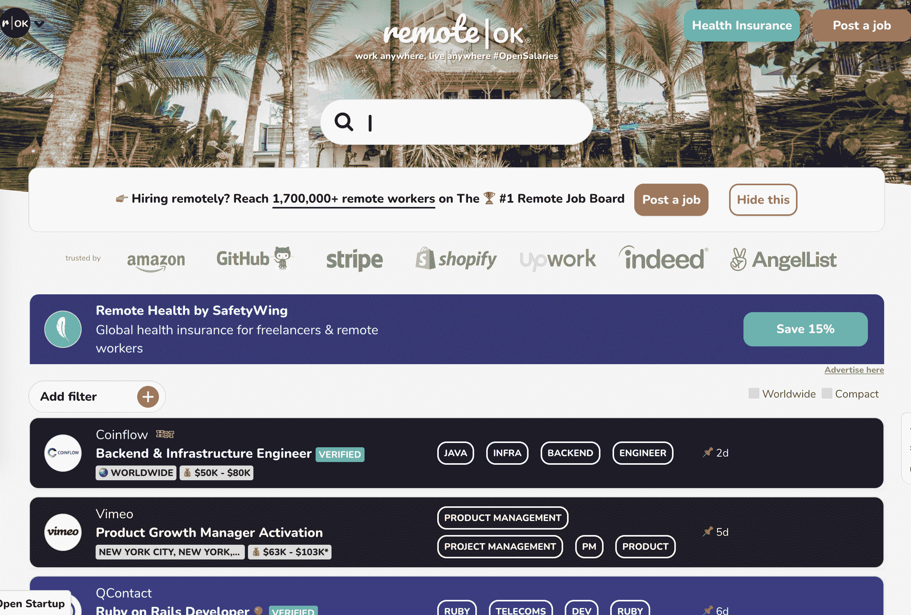
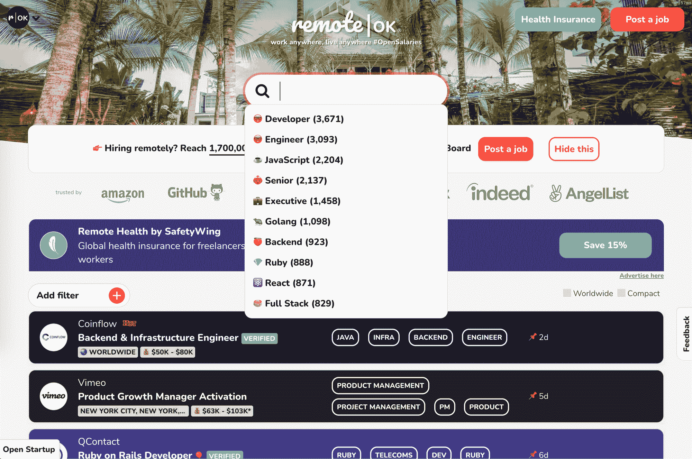
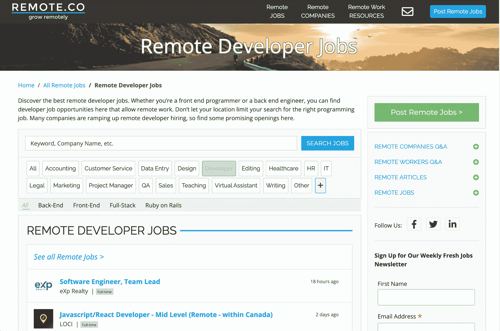
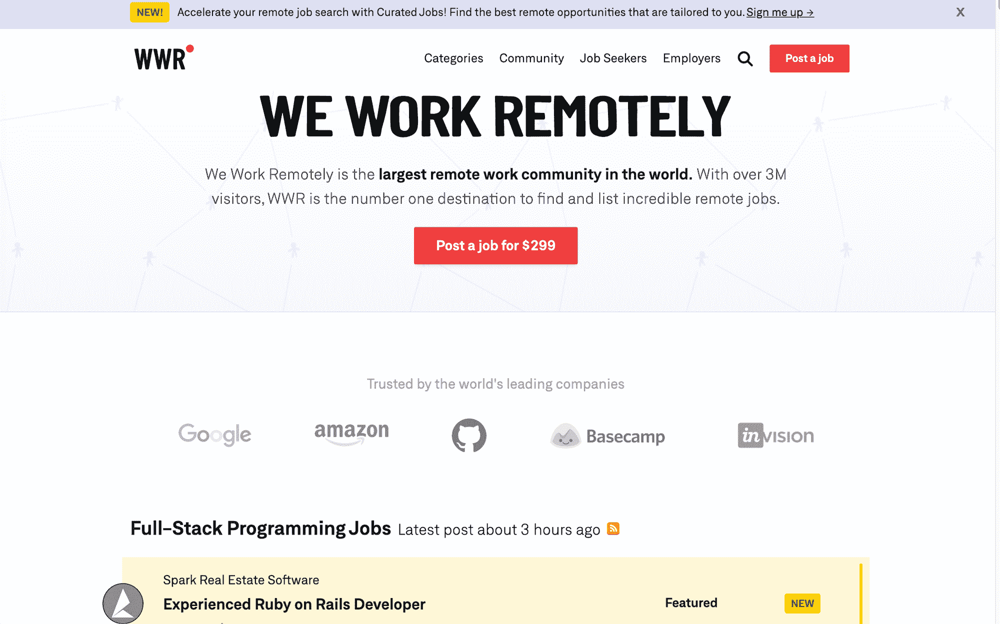
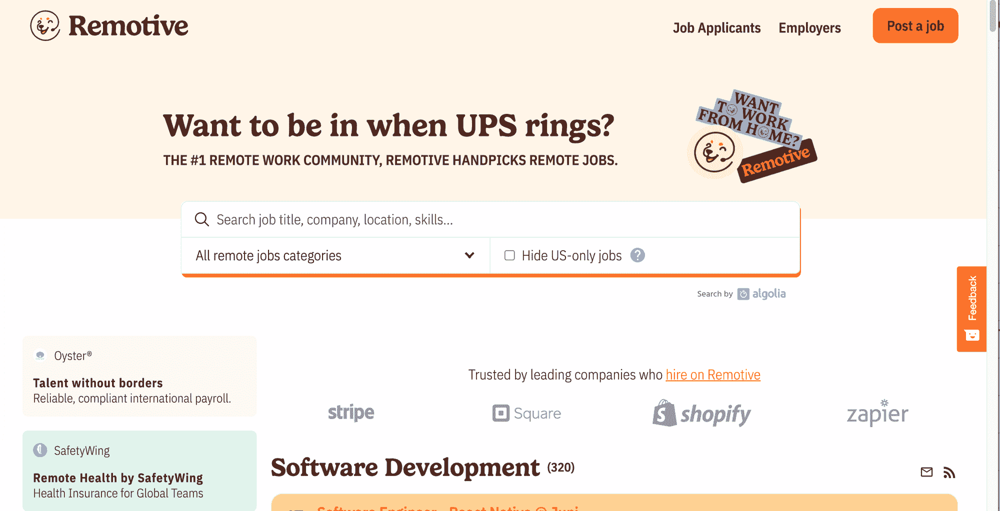
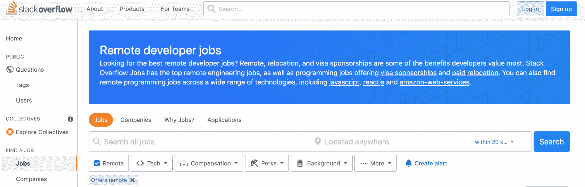

# 远程工作——如何在家找到远程工作

> 原文：<https://www.freecodecamp.org/news/remote-work-how-to-find-remote-working-jobs-from-home/>

随着越来越多的人希望拥有灵活的工作时间表，远程工作变得越来越普遍和流行。

没有比现在更好的时机去找一份远程工作，在家工作。

有很多角色可以远程完成，尤其是在技术领域。

从产品设计和产品管理，到平面设计、市场营销、销售和网页开发，网页开发工作是最受欢迎和最受欢迎的工作之一。

在这篇文章中，你将看到一些方法，当你还在职业生涯的早期，你可以找到一个远程**开发人员**的角色。

我们将首先回顾一下近几年来向远程工作的转变，以及远程工作的利弊。

然后，我们将看到一些帮助你获得远程开发人员职位的策略，以及一些让你在未来雇主面前脱颖而出的方法。

如果您只想查看一些最受欢迎的远程工作公告板，请跳到[这一部分](#jobs)。

## 向远程工作的转变

2020 年初，新冠肺炎疫情让世界大吃一惊。

随着一切开始关闭，许多工人被要求和鼓励在家工作，使许多公司一夜之间变得遥远。

可以肯定地说，疫情彻底改变了职业生活。最初被迫转向的是一个新世界和一种新的工作方式，这种方式很可能会持续下去。

人们与工作的关系开始发生变化。自工业革命以来，人们一直认为固定工作空间和员工需要聚集在同一间办公室是一种常态，但这种观点已经开始改变。

随着电子邮件和聊天服务等电子通信方式的普及，以及通信平台和共享文档的出现，似乎不再迫切需要多种类型的员工在同一栋大楼中办公。

许多人现在也在重新考虑在固定的日期和时间上下班打卡的想法，并越来越意识到他们的时间和对他们最重要的事情。毕竟，有些人可能在周末更有效率，在那几天完成更多的工作，而不仅仅是在严格的周一到周五和朝九晚五的时间表中。

## 远程工作的利与弊

远程工作的利弊与每个人都有关系。

但总的来说，远程工作的一些优点对公司和在公司工作的人都有好处，如下所示:

*   灵活的工作时间表和地点通常会提高生产率和绩效。
*   上述观点导致员工拥有更多的自主权和独立性，这反过来又会带来更快乐的员工队伍。感到被雇主信任并拥有这种自由的员工对他们的工作更满意，对他们的时间更有效率，更有动力完成他们的工作。
*   远程工作允许你在地球的任何地方旅行和工作，成为一个数字流浪者，制定你自己的工作时间表。特别是在技术领域工作时，你需要的只是一个良好的互联网连接、一台笔记本电脑和良好的技能。
*   在远程工作中，你也强调生产高质量的工作，在你工作的一段时间内，你高度专注于任务。在朝九晚五的工作中，一天的大部分工作可能会在 5 点之前完成，但你仍然需要留在办公室，并且可能不会像你在剩余时间里那样富有成效。
*   办公空间很贵，公司每年要为每个员工支付数千美元的办公空间。远程工作将降低这些成本，节省大量资金。
*   远程工作也意味着不再需要每天长途通勤去上班。通勤通常意味着每天花大量时间堵车、花钱买汽油或使用拥挤的公共交通系统。人们会花很多时间在通勤上——通勤者每天花两个多小时去办公室和回家并不少见。这通常是主要压力的原因。不上下班可以节省大量的时间和金钱。
*   有了远程工作，就有机会组建分散的团队，从全球各地雇佣员工。这更能代表世界的现状。拥有不同观点和背景的人，每个人都有丰富的不同经验可以借鉴，这反过来会创造出更好的产品和服务。
*   有了远程工作，你也可以花更多的时间与家人和爱人在一起。
*   “自由越大，责任越大”这句话适用于远程工作。通常，远程办公的员工与公司的使命有着更紧密的联系，这会带来更大的动力和目标感。如果你与公司的价值观不一致，并且不觉得工作有回报，那么当没有人看着你的时候，就像传统的朝九晚五的办公室工作一样，你可能会不努力。

远程工作也有一些潜在的缺点:

*   人们对生产率有所担忧。例如，你家里缺少一个可以舒适安静工作的专用空间，这可能会导致生产力下降。
*   缺乏良好的 Wifi 连接、网速和像样的语音质量可能会导致通信方面的问题。当一个连接不稳定并且频繁断开时，与团队成员的交流就变得困难。同样，声音质量差、麦克风工作不正常或大量的背景噪音会分散他人的注意力，并使会议交流更加困难。
*   对于远程工作，一些员工可能比其他人更容易拖延，容易分心，并有效地管理他们的时间。一个很好的答案可能是番茄工作法和时间阻塞任务。
*   对于需要经常照顾家人和家人的员工来说，远程工作可能是一项挑战。
*   对于远程工作，工作与生活的平衡有时会很棘手。出于这个原因，一些工人可能喜欢通勤、上班和离家，因为他们认为这是工作和社会生活之间的物理隔离。这可以是一种将工作和个人生活以及与之相关的任何问题区分开来的方式。
*   另一个潜在的问题是难以建立联系和网络。这可能是一个挑战，尤其是对初级员工和处于职业生涯早期的人来说，对那些已经发展了多年人际关系网的高级员工来说就没那么大了。办公室可能是一个交流的好地方，但现在有很多在线社区，新的社区经常被创建，可以帮助你在行业内建立联系。
*   团队成员之间沟通技巧的差异也具有挑战性。用清晰简洁的方式传达你的想法，有时通过电子邮件或电话是很棘手的。分解问题、解释你的思维过程，以及用简单的语言向团队中的技术和非技术成员解释复杂的技术主题也是很困难的。远程工作时，所有这些都是必要的。远程工作需要大量的协作，所以清楚地传达信息是至关重要的，否则会经常出现误解。

## 作为开发者如何吸引远程公司

不是所有的工作都可以远程完成。

毫不奇怪，科技公司正在铺平道路，引领这种向远程工作的转变。

也就是说，这些技术角色需要很高的技能，也就是所谓的“知识工作”。

大多数公司都要求有几年的工作经验，但是当你没有工作经验，也没有人会因为你缺乏重要的工作经验而雇佣你时，你是如何获得工作经验的呢？

这就像是一个先有鸡还是先有蛋的问题，当你申请一个偏远的职位时，这个问题会更加严重。

当你还处于职业生涯的早期，你如何以一种有情感的方式展示你的技能？

公司想知道你是否具备所需的技能，是否有能力胜任这份工作。

不仅如此，获得一个远程角色需要更多的竞争。与传统办公室工作相比，挑选候选人的人才库比以往任何时候都大。

有很多人从世界各地申请一个职位，因为有很多人希望远程工作，并有灵活的时间表。

下面列出了一些你可以做的事情，这些事情可能会帮助你在远程求职中脱颖而出，成为一名早期职业发展者。

运气在每一次求职中都扮演着重要的角色，但当你没有太多经验时，这几点可以帮助你向未来的雇主展示你的技能。

### 为这项工作准备你的 GitHub 帐户

包括你引以为豪和最感兴趣的项目。

此外，通过展示与你申请的职位相关的项目，你可以讨论你面临的不同挑战，出现的问题，你是如何解决这些问题的，以及你总体学到了什么。

通过为每个项目创建[自述文件](https://www.freecodecamp.org/news/how-to-write-a-good-readme-file/),确保您的项目都有良好的文档记录。

这样你可以记录你的思考过程和意图，同时展示你的书面沟通技巧，这在科技行业工作时很重要。

### 为开源做贡献

作为一个初学者，为开源做贡献可能会令人生畏，但这是值得的，而且在申请工作时确实会有所不同。这是许多雇主所欣赏的。

你可以从小额捐款开始。例如，您可以纠正语法错误和打字错误，并为缺少文档的项目创建足够的文档。

这表明您能够与其他开发人员进行远程和异步的良好沟通和协作来解决问题。所有这些都是公开进行的。

开始投稿的一个好地方是查看 [freeCodeCamp 仓库](https://github.com/freeCodeCamp/freeCodeCamp/issues)中带有“仅第一计时器”标签的问题。

下面是一些资源，可以帮助你了解更多关于开源的内容:

*   [开源终极指南](https://www.freecodecamp.org/news/the-ultimate-guide-to-open-source/)
*   [为开源做贡献的权威指南](https://www.freecodecamp.org/news/the-definitive-guide-to-contributing-to-open-source-900d5f9f2282/)
*   [如何为开源项目做出贡献——初学者指南](https://www.freecodecamp.org/news/how-to-contribute-to-open-source-projects-beginners-guide/)

### 创建个人网站

个人网站是你在互联网上的个人天地，也是在更私人的层面上向世界——包括潜在雇主——展示你的一种方式。

包括一些关于你自己和你最自豪的项目的信息。确保所有链接都正常工作，没有错别字。

雇主寻找的重要信息需要在第一眼就清晰而容易地突出出来。

包括一份最新的简历和联系方式——最好是专业的电子邮件地址。

以下是一些帮助你创建作品集网站的资源:

*   使用 HTML、CSS、JavaScript 和 Bootstrap 创建一个作品集网站
*   [用 HTML、CSS 和 JavaScript 构建自己的开发者组合网站](https://www.freecodecamp.org/news/how-to-build-a-developer-portfolio-website/)
*   [创建作品集网站——初学者开发指南](https://www.freecodecamp.org/news/beginners-guide-to-creating-a-portfolio-website/)

### 公开学习

公开学习和参与开发者社区可以加速你的职业生涯，并帮助你建立有价值的联系。

这是展示你拥有雇主所需要的沟通技巧的一种方式。

无论是写博客，写你的编码之旅，记录你正在学习的东西，还是在当地集会上演讲，都有助于创建你自己的个人品牌。人们在更私人的层面上了解你是谁。

包括你在公共场合学习和参与社区活动的所有方式的链接，显示了你的奉献精神和对进入科技行业的认真态度。

你可以分享你的发现，在博客中解释你是如何解决一个具体问题的，或者列出一些有用的资源来分享。这些活动不仅能帮助你更好地理解一切，还能帮助其他也在学习的人。

下面是一些帮助你开始写技术文章的资源:

*   [软件开发人员的写作技巧——如何成为更好的科技作家](https://www.freecodecamp.org/news/writing-tips-software-developers/)
*   [新手技术写作——技术博客基础 A-Z 指南](https://www.freecodecamp.org/news/technical-writing-for-beginners/)
*   [如何成为一名技术作家](https://www.freecodecamp.org/news/how-to-become-a-technical-writer/)

### 获得远程工作的经验

与没有远程工作经验和技能的人相比，有远程工作经验的人可能会增加你获得另一份远程工作的机会。

这表明你在远程环境下是高效的。

即使你在一个不同的领域工作，不是远程工作者，但想转换到一个远程技术角色，你可以在你目前的公司协商一个混合角色。你可以每周远程工作 1 - 2 天，其余时间在办公室工作。

### 获得开发人员的工作经验

如果你想获得一份远程开发人员的工作作为你的第一份技术工作，这可能比获得一份传统的办公室工作更困难。除了偏远的方面，作为一个大三学生进入这个领域已经够难了。

尽管这并不是不可能实现的，但拥有几年的工作经验可能更现实。这使得远程工作的可能性更大。

与那些在技术领域寻找第一份工作的人相比，中高级开发人员更容易获得远程职位。

让团队中的初级成员远程入职并对他们进行培训可能会很有挑战性。当你没有太多的直接监督和指导，他们最终会花很多时间独处时，这一点尤其如此。

专注于学习所需的技能，并把它们提高到你可以很好地推销自己并脱颖而出的程度。你的技能越发达，机会就越大。

### 对你申请的远程公司表现出真正的兴趣

花额外的时间和精力来制作一份高质量的申请将会帮助你脱颖而出。确保你的申请是根据你要申请的公司量身定做的，列出你能提供的东西，以及为什么你是合适的人选。

招聘经理可以看出你什么时候把你的申请复制粘贴到了其他几个职位上，什么时候它不是为那个公司量身定做的。

因此，确保你为这个职位定制了你的申请，并表明你已经研究了公司的网站和/或博客，了解他们在做什么，他们的使命是什么。这会给人留下更好的印象，让你更加突出。

## 哪里可以找到远程招聘的公司？

这里有很多远程招聘平台，你可以浏览数百个招聘信息，并申请任何你认为合适的职位。

这一部分展示了一些最受欢迎的招聘广告，宣传远程友好的职位。

要查看远程友好公司的完整列表，[查看这个全面的 GitHub 知识库](https://github.com/remoteintech/remote-jobs)

### 远程正常

在 [Remote Ok](https://remoteok.com/) 上，你会发现列出了不同种类的工作，比如产品设计师、产品经理、文案和文字编辑等等。

然而，大多数工作是软件开发工作。

该网站包含数百份招聘信息，并且每天更新。

它很容易使用，不需要在任何地方注册或上传简历来提交申请。

你可以点击页面顶部的搜索栏。当你这样做的时候，你会看到一个下拉菜单，其中有一个过滤器，可以选择不同的工作类别，以及每个类别中可用的工作数量。

当你点击一个职位发布的链接时，你会看到完整的职位描述，然后是一个写着“立即申请”的按钮。

当你点击那个按钮申请工作时，你会被重定向到该公司的网站。

这个职位公告板更像是一个查看世界上不同的远程职位的地方。这并不意味着创建自己的个人资料或直接从求职公告板提交申请。

这也是最没有人情味的求职公告板之一，因为没有任何信息或方法来了解更多关于 Remote Ok 公司的信息，也没有联系客户服务的方法。

### Remote.co

Remote.co 是另一个远程工作平台，提供各种工作列表。有编辑工作，客户服务和营销工作，等等。

前端开发、后端开发、全栈开发的工作选择也很广泛。

在页面顶部的搜索栏中，输入您要搜索的职位类型或您想要工作的公司名称。

你也可以注册他们的时事通讯来接收每天的工作提醒，但是除此之外，你不需要在任何地方注册来查看工作或者申请工作。

当你申请工作时，你会被重定向到该公司的网站，直接从那里申请。

与 Remote Ok 相比，这个远程作业更人性化，因为它有更多的信息和不同的可用资源。

这里有关于远程工作、远程工作者权利的文章，甚至还有你可以参加的不同在线课程。

### 我们远程工作

在[我们远程工作](https://weworkremotely.com/)你会发现销售、营销、软件开发等领域的工作列表。

前端开发、后端开发、全栈开发、DevOps 和系统管理都有工作。

您可以通过提供您的电子邮件地址并设置密码来创建帐户。通过这种方式，你会得到新职位空缺的通知，特别是针对你感兴趣领域的职位。

该网站还提供了高级搜索过滤器，您可以在其中输入职位名称、您希望工作的地区、您所在的时区以及您正在寻找的工作类型。从那里你可以选择合同工或全职工作。

当你申请一个职位时，你会被重定向到你申请的公司网站。

### 雷莫蒂

在[remove](https://remotive.io/)上，有各种不同的远程技术角色可供选择。

有开发人员角色、客户支持、客户服务、销售、管理、产品设计、产品管理等列表。

这个工作板也侧重于技术，有过滤器，您可以查看不同的工作类别。

他们的一个新功能是能够隐藏要求申请人在美国的工作，并从美国时区远程工作。

你也可以使用关键词，比如特定的技能或者职位，来过滤所有不同的文章。

它还有一个邮件列表，你可以在那里接收每日的工作更新。

### 天使列表

AngelList 列出了大部分科技初创公司的工作。

在那里，你可以创建你自己的个人资料，在那里你可以包括你的技能和关于你自己的信息。

你也可以设定你想要的薪水和你希望公司拥有的文化。

然后，一旦你的个人资料建立起来，你就可以直接从 AngelList 申请工作，而不需要重定向到该公司的网站。

公司可以通过你的个人资料找到你并与你联系。

有高级搜索过滤器，可以过滤不同的工作。

在 AngelList 上浏览职位时，你还可以查看职位的工资和股票期权。

### 堆栈溢出

[堆栈溢出远程开发人员作业](https://stackoverflow.com/jobs/remote-developer-jobs)仅列出远程完成的开发人员角色。

它包括一个高级过滤器，帮助您真正定制您的搜索，以最大限度地满足您的需求和您正在寻找的东西。

以下是高级过滤器的一些可用示例:

*   您最多可以包含十个您喜欢使用的技术标签和十个您不喜欢使用的技术标签。
*   你可以把你喜欢的公司和你想避开和排除在求职范围之外的公司包括进来。
*   你可以包括你期望得到的最低工资范围。
*   你可以输入你的资历和经验。
*   您可以选择是否需要签证担保，并希望重新安置到不同的国家。
*   此外，你可以选择你想找的工作类型，是合同工、全职还是实习。

您不需要创建个人资料。当你申请一个职位时，你会被重定向到该公司的网站。

### LinkedIn 工作

在 LinkedIn 上，你可以创建自己的个人资料，包括你的工作经历，突出你的技能，并写一个总结你的成就和过去工作经历的标题。

脱颖而出的一个好方法是分享你写的任何文章，并分享其他有趣和有益的内容。

LinkedIn 是一种通过接触招聘人员直接与公司联系的方式。

你也可以让招聘人员知道你可以应聘。具体来说，你可以告诉他们你想要什么样的职位，以及你是否喜欢远程工作。

您可以将此功能添加到您的个人资料中，但这是隐私，只有他们可以看到。

通常，如果你的简历令人印象深刻，招聘人员会主动联系你，并直接通知你。

这里有一些资源可以让你创建一个出色的 LinkedIn 个人资料:

*   [如何建立令人惊叹的 LinkedIn 个人资料 15+行之有效的技巧](https://www.freecodecamp.org/news/how-to-build-an-amazing-linkedin-profile-15-proven-tips/)
*   [如何使用 LinkedIn 获得你的第一份开发工作——一步一步的指导](https://www.freecodecamp.org/news/linkedin-handbook-get-your-first-dev-job/)

## 结论

工作环境开始改变，远程工作越来越受欢迎，需求也越来越大。

在本文中，您看到了作为一名早期职业发展者在远程公司脱颖而出的一些方法。

您还看到了一些最受欢迎的招聘信息板，上面有一些远程友好型公司的信息。

感谢您的阅读，祝您远程求职好运！