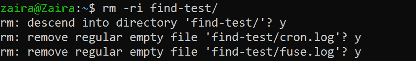

# 在 Linux 中删除目录——如何从命令行删除文件夹

> 原文：<https://www.freecodecamp.org/news/remove-directory-in-linux-from-the-command-line/>

Linux 是一个功能强大的操作系统，具有各种命令行实用程序来帮助您完成日常任务。

移除文件夹是一个非常常见的操作，它允许您移除单个文件夹或递归地移除它们(文件夹中的文件夹)。

在本教程中，我们将了解如何从命令行删除文件夹。

### 但是难道 GUI 还不足以删除文件夹吗？

从文件浏览器中删除文件夹非常简单。我们只需要使用键盘上的删除按钮，或者右键单击并删除文件夹。但是使用 CLI(命令行界面)您可以更有创造性。

使用命令行，您可以创建一个脚本来定期删除文件。您还可以删除符合特定条件(如修改时间或大小)的文件。

内务脚本还利用命令删除不需要的文件夹，以将磁盘空间保持在最佳水平。

简而言之，您可以使用命令行自动化您的日常任务。

从 CLI 中删除时要小心。使用 CLI 删除文件夹后，它将被永久删除，因为没有回收站。恢复的唯一方法是通过备份。

## 如何使用`rmdir`删除空文件夹

使用`rmdir`命令删除一个空目录。它不适用于非空目录。

**命令的语法:**

```
rmdir [OPTION] DIRECTORY_NAME
```

我们可以提供以下选项:

*   `-v`:显示每个被处理目录的详细输出。
*   `--ignore-fail-on-non-empty`:如果目录非空，则忽略。
*   `-p, --parents`:删除一个目录及其祖先。例如，`'rmdir -p a/b/c`将首先删除文件夹`c`，然后是`b`，然后是`a`

## 如何使用`rm`删除非空文件夹

我们不能在非空文件夹上使用`rmdir`。我们对此有另一个命令—`rm`。

**命令的语法:**

```
 rm [OPTION] [FILE]
```

我们可以使用以下选项:

*   `-r`、`-R`、`--recursive`:递归删除目录及其内容。
*   `-d`、`--dir`:删除空目录。所以我们也可以使用`rm`来删除空目录，就像`rmdir`命令一样。
*   `-v`、`--verbose`:通过提及正在处理的文件夹细节来解释正在做什么。
*   `-i`:每次移除前提示。

因此，删除非空文件夹的命令应该是:

```
rm -r folder-name
```

## 如何强制删除目录

如果您没有`write`权限，您将无法删除该文件夹。如果你想删除它，使用`-f`标志。`-f`旗不显示任何提示。

## 如何在 Linux 中安全删除文件夹

为防止意外删除，使用`-i`交互标志。这样，在删除文件夹及其内容之前，系统会提示您。

如果您想继续，只需输入`y`来回答提示。另一方面，输入`n`跳过该文件。

在下面的例子中，请注意我们是如何进入文件夹并逐个检查每个文件的。



Interactively deleting a folder named `find-test`

## 结论

当您需要在归档文件夹后删除文件夹、删除重复项、删除未使用的文件夹等等时，删除目录非常有用。

所有这些任务都旨在创建更多的磁盘空间。我希望这篇教程对你有所帮助。

你在这里学到的最喜欢的东西是什么？在 [Twitter](https://twitter.com/hira_zaira) 上告诉我！

在这里阅读我的其他帖子。