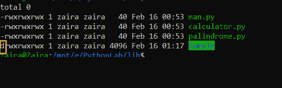
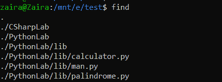
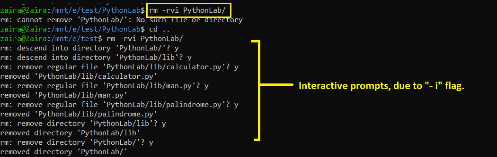
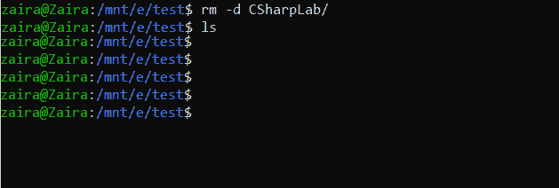
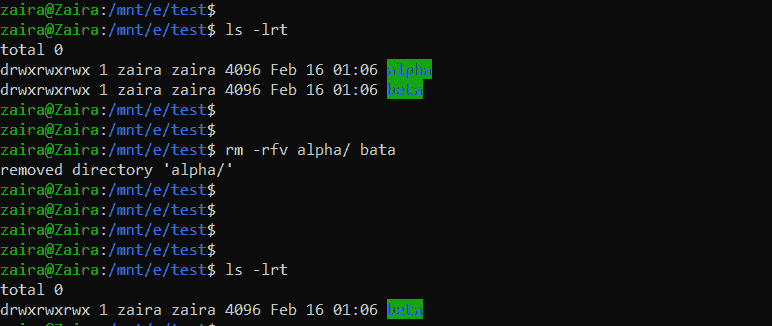

# 在 Linux 中删除目录——如何从命令行删除文件夹

> 原文：<https://www.freecodecamp.org/news/remove-directory-in-linux-how-to-delete-a-folder-from-the-command-line/>

Linux CLI 是一个强大的工具，可以帮助您完成复杂的任务。

您需要执行的一个常见操作是删除内容。就像创建文件和文件夹一样，从 Linux 命令行删除它们是您经常要做的事情。

在这篇文章中，我们将讨论如何从命令行删除目录。我们将讨论语法和一些例子。我在这些例子中使用的是 Ubuntu。

## Linux `rm`命令的语法

在 Linux 中，您使用`rm`命令从命令行删除一些东西。`rm`命令的语法如下所示:

```
rm [flags] directory name
```

删除目录时需要使用的一些重要标志如下:

*   `-r`、`-R`、`--recursive` [“递归”]-递归删除目录及其内容。
*   `-v`、`--verbose`[" Verbose "]–此选项输出 CLI 上正在执行的操作的详细信息。
*   `-f`、`--force`[" Force "]–该选项忽略不存在的文件，并且从不提示您。
*   `-i`[" Interactive "]–如果您想在每次删除前得到提示，请使用此标志。
*   `-d` ["目录]–这仅在目录为空时有效。

⚠:使用 command️时要小心，并确保任何重要的数据都有备份。

## 如何识别要删除的文件夹

当我们讨论如何删除文件夹时，我们需要非常确定我们确实在删除一个文件夹。我们可以用第一列中的`d`标志来标识文件夹/目录。注意，文件的第一个标志是`-`。



## Linux `rm`命令的例子

在我们当前的文件夹中，我们有两个文件夹`CSharpLab`和`PythonLab`。它们的内容如下所示。



注意`CSharpLab`是一个空目录。

### 如何删除非空文件夹

我们先删除`PythonLab`文件夹。

```
rm -rvi PythonLab/
```

在哪里，

*   递归删除所有文件和文件夹。注意在下面的输出中，所有的文件(`man.py, calculator.py, palindrome.py`)和文件夹(`/lib`)都被删除了。
*   `-v`股票详情。
*   使删除成为交互式的，这意味着它在删除任何东西之前都会询问。



### 如何删除空文件夹

让我们试着删除`CSharpLab`文件夹。由于这个文件夹是空的，我们可以使用`-d`标志。

```
rm -d CSharpLab/
```



CSharpLab directory is removed

### 如何使用`-f`“强制”标志

现在让我们看看`-f`标志是如何工作的。这将在没有任何提示或警告的情况下强制删除文件夹。如果出现错误，`-v`仍然会忽略并删除有效的文件。

在下面的示例中，文件夹名称中有一处输入错误。请注意，错别字被忽略。原始文件完好无损。



## 包扎

当您需要在归档文件夹后删除文件夹、删除重复项、删除未使用的文件夹等等时，删除目录非常有用。

所有这些任务都旨在创建更多的磁盘空间。我希望这篇博客对你有所帮助。

我们在[推特](https://twitter.com/hira_zaira)上连线吧！

在这里阅读我的其他帖子[。](https://www.freecodecamp.org/news/author/zaira/)

让我们来聊聊不和谐的话题。