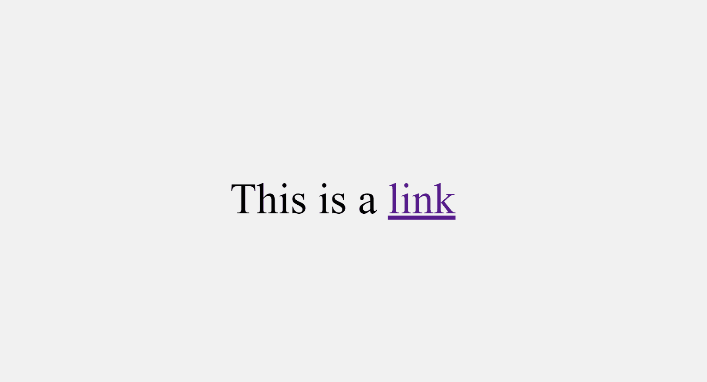
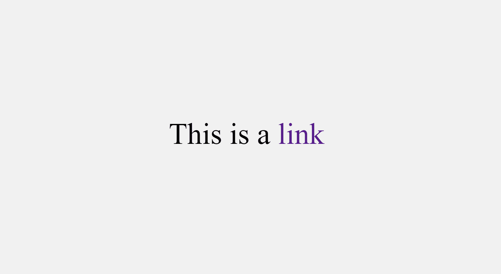
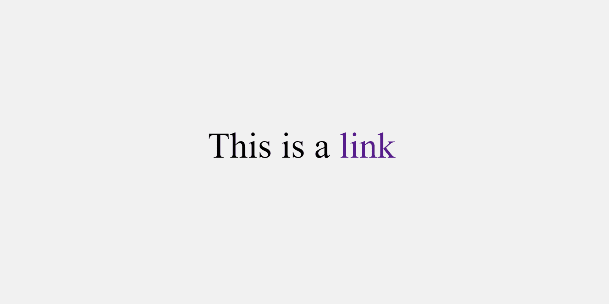

# 如何在 CSS-HTML 样式指南中删除链接的下划线

> 原文：<https://www.freecodecamp.org/news/remove-underline-from-link-in-css/>

如果你是一个网站开发人员，你可能想要去掉当你添加一个链接到一个页面时出现的默认下划线。

幸运的是，就像网页上的其他元素一样，您可以设置负责显示链接的锚标记的样式。

在这篇文章中，我将向你展示如何用 CSS 去除链接中的下划线。我还将向您展示链接可能处于的四种状态，以及如何为每种状态去掉下划线。

## 如何删除 CSS 中链接的下划线

默认情况下，链接标签在浏览器中的显示方式如下:


首先，重要的是要知道链接标签(锚标签)可以处于 4 种不同的状态，称为伪类:

*   `a:link`:当链接不活动、未被访问或悬停时的常规状态
*   `a:visited`:当链接被用户点击，即被访问
*   `a:hover`:当用户悬停在链接上时
*   `a:active`:当用户点击链接时

**注意:**由于 CSS 的层叠性质，状态(伪类)必须按照上面列出的顺序出现。

为了最终**移除链接的默认下划线**，您可以将所有伪类作为目标，并为它们分配一个`none`的`text-decoration`属性。

```
<p>This is a <a href="#">link</a></p> 
```

```
 a:link {
      text-decoration: none;
}

a:visited {
      text-decoration: none;
}

a:hover {
      text-decoration: none;
}

a:active {
      text-decoration: none;
} 
```



您也可以使用锚定元素选择器移除默认的 all in one 下划线:

```
 a {
       text-decoration: none;
} 
```



您可以用这支笔来处理 link 标签的 4 个伪类:

[https://codepen.io/koladechris/embed/preview/bGLPzXr?default-tabs=css%2Cresult&height=300&host=https%3A%2F%2Fcodepen.io&slug-hash=bGLPzXr](https://codepen.io/koladechris/embed/preview/bGLPzXr?default-tabs=css%2Cresult&height=300&host=https%3A%2F%2Fcodepen.io&slug-hash=bGLPzXr)

Anchor tag states

## 结论

我希望这篇文章能帮助你学习如何在 CSS 中移除链接的默认下划线。

如果你觉得这篇文章有帮助，不要犹豫，与你的朋友和家人分享。

感谢阅读。