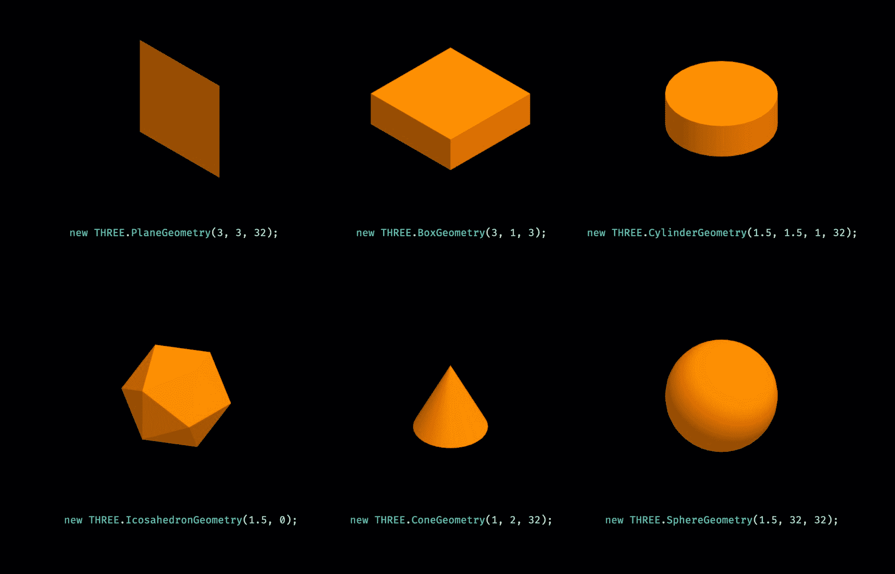
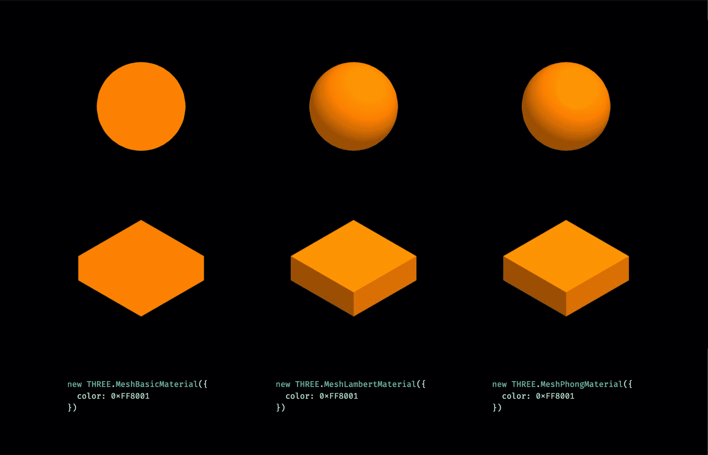
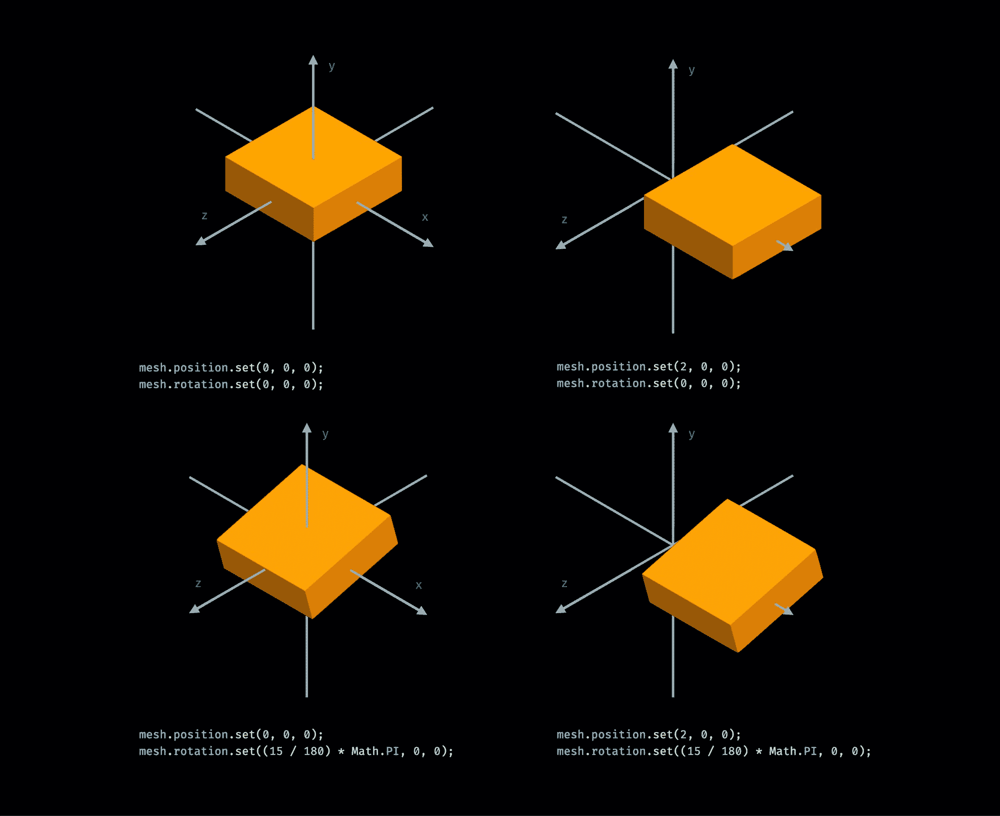
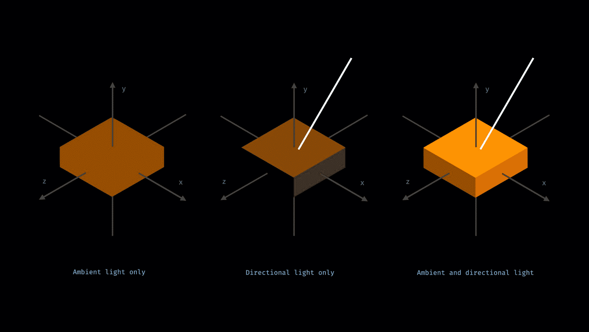
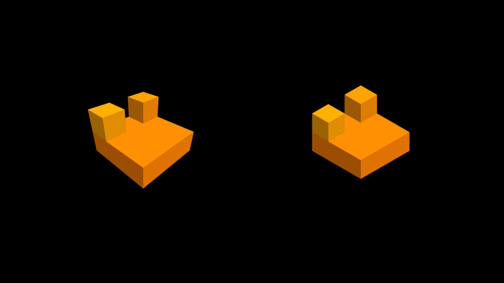
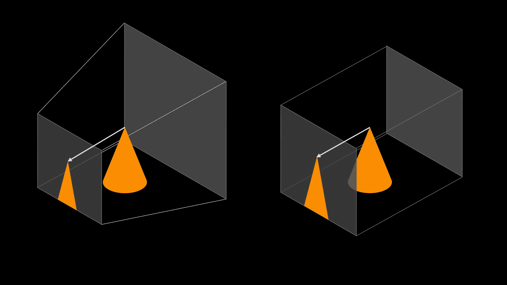

# Three.js 教程–如何在浏览器中渲染 3D 对象

> 原文：<https://www.freecodecamp.org/news/render-3d-objects-in-browser-drawing-a-box-with-threejs/>

如果你曾经想用 JavaScript 构建一个游戏，你可能会遇到 Three.js。

Three.js 是一个我们可以用来在浏览器中渲染 3D 图形的库。整个过程都是用 JavaScript 编写的，所以通过一些逻辑，你可以添加动画、互动，甚至把它变成一个游戏。

在本教程中，我们将通过一个非常简单的例子。我们将渲染一个 3D 盒子，同时我们将学习 Three.js 的基础知识。

Three.js 在引擎盖下使用 WebGL 渲染 3D 图形。我们可以使用普通的 WebGL，但是它非常复杂，而且层次很低。另一方面，Three.js 就像玩乐高一样。

在本文中，我们将介绍如何在场景中放置 3D 对象，设置灯光和摄像机，并在画布上渲染场景。所以让我们来看看我们如何做到这一切。

## 定义场景对象

首先，我们要定义一个场景。这将是一个我们放置 3D 物体和灯光的容器。场景对象也有一些属性，比如背景颜色。虽然设置是可选的。如果不设置，默认为黑色。

```
import * as THREE from "three";

const scene = new THREE.Scene();
scene.background = new THREE.Color(0x000000); // Optional, black is default

...
```

## 几何体+材质=网格

然后我们将 3D 盒子作为网格添加到场景中。网格是几何体和材质的组合。

```
...

// Add a cube to the scene
const geometry = new THREE.BoxGeometry(3, 1, 3); // width, height, depth
const material = new THREE.MeshLambertMaterial({ color: 0xfb8e00 });
const mesh = new THREE.Mesh(geometry, material);
mesh.position.set(0, 0, 0); // Optional, 0,0,0 is the default
scene.add(mesh);

...
```

### 什么是几何？

几何体是我们正在构建的渲染形状——就像一个盒子。几何图形可以从顶点构建，或者我们可以使用预定义的顶点。

BoxGeometry 是最基本的预定义选项。我们只需要设置盒子的宽度、高度和深度就可以了。

你可能认为我们不能通过定义盒子走得太远，但许多极简设计的游戏只使用盒子的组合。

还有其他预定义的几何图形。我们可以很容易地定义一个平面，一个圆柱体，一个球体，甚至一个二十面体。



### 如何使用材料

然后我们定义一种材料。材质描述了物体的外观。在这里，我们可以定义诸如纹理、颜色或不透明度之类的东西。

在这个例子中，我们将只设置一种颜色。材料还是有不同的选择。它们之间的主要区别是它们对光的反应。

最简单的是 MeshBasicMaterial。这种材质根本不在乎光，每一面都会有一样的颜色。不过，这可能不是最佳选择，因为您看不到盒子的边缘。

最简单的关心光的材料是 MeshLambertMaterial。这将计算每个顶点的颜色，实际上是每个边。但并没有超出这个范围。



如果需要更精密的，还有更高级的材料。MeshPhongMaterial 不仅按顶点计算颜色，还按每个像素计算颜色。颜色可以在一面内改变。这可能有助于真实感，但也会影响性能。

这也取决于灯光设置和几何图形，如果它有任何真正的效果。如果我们渲染盒子并使用平行光，结果不会改变太多。但是如果我们渲染一个球体，区别就更明显了。

### 如何定位网格

一旦我们有了一个网格，我们也可以在场景中定位它，并设置每个轴的旋转。稍后，如果我们想要在 3D 空间中制作动画，我们将主要调整这些值。

对于定位，我们使用与设置尺寸相同的单位。不管你用的是小数字还是大数字，你只需要在自己的世界里保持一致。

对于旋转，我们以弧度设置值。所以如果你有度数，你必须把它们除以 180，然后乘以圆周率。



## 怎么加光

那我们来加灯吧。具有基本材质的网格不需要任何灯光，因为无论灯光设置如何，网格都将具有设置的颜色。

但是 Lambert 材质和 Phong 材质需要光线。如果没有任何光线，网格将保持在黑暗中。

```
...

// Set up lights
const ambientLight = new THREE.AmbientLight(0xffffff, 0.6);
scene.add(ambientLight);

...
```

我们将添加两个灯光-一个环境光和一个平行光。

首先，我们添加环境光。环境光从各个方向照射过来，为我们的几何图形提供了一个基色。

要设置环境光，我们需要设置颜色和强度。颜色通常为白色，但您可以设置任何颜色。强度是一个介于 0 和 1 之间的数字。我们定义的两个灯光以累积的方式工作，所以在这种情况下，我们希望每个灯光的强度都在 0.5 左右。



平行光有类似的设置，但是它也有一个位置。这里的位置这个词有点误导，因为它并不意味着光是从一个确切的位置发出来的。

平行光从很远的地方发出，许多平行光线都有一个固定的角度。但是我们不是定义角度，而是定义单一光线的方向。

在这种情况下，它从 10，20，0 位置的方向向 0，0，0 坐标照射。但是当然，平行光不仅仅是一条光线，而是无限多条平行光线。

把它想象成太阳。在较小的尺度上，太阳的光线也是平行的，太阳的位置并不重要，重要的是它的方向。

这就是平行光的作用。它用平行光线从很远的地方照在所有东西上。

```
...

const dirLight = new THREE.DirectionalLight(0xffffff, 0.6);
dirLight.position.set(10, 20, 0); // x, y, z
scene.add(dirLight);

...
```

在这里，我们将灯光的位置设置为从上方(用 Y 值),并沿着 X 轴移动一点。Y 轴具有最高值。这意味着盒子的顶部接收最多的光线，它将是盒子最闪亮的一面。

光线也沿着 X 轴移动了一点，所以盒子的右侧也会接收到一些光线，但是会少一些。

因为我们没有沿着 Z 轴移动灯光位置，所以盒子的正面不会接收到来自这个光源的任何光线。如果没有环境光，正面将保持黑暗。

还有其他类型的光。例如，点光源可以用来模拟灯泡。它有一个固定的位置，向四面八方发光。聚光灯可以用来模拟汽车的聚光灯。它从一个点沿着一个圆锥体向一个方向发射光线。

## 如何安装照相机

到目前为止，我们已经用几何体和材质创建了一个网格。我们还设置了灯光，增加了场景。我们仍然需要一个摄像机来定义我们如何看待这个场景。

这里有两个选项:透视相机和正交相机。



视频游戏大多使用透视相机，因为它们的工作方式与你在现实生活中看到的东西类似。远处的东西看起来更小，而你正前方的东西看起来更大。

使用正交投影，无论物体离相机多远，它们都将具有相同的大小。正交相机有一个更小的，几何外观。它们不会扭曲几何图形——平行线会平行出现。

对于这两个摄像机，我们必须定义一个视图截锥。这是 3D 空间中将要投影到屏幕上的区域。该区域之外的任何内容都不会出现在屏幕上。这是因为它要么太近，要么太远，或者因为相机没有对准它。



使用透视投影，视图截锥内的所有内容都以直线的方式向视点投影。离相机越远的东西在屏幕上看起来就越小，因为从这个角度看，你可以在更小的角度下看到它们。

```
...

// Perspective camera
const aspect = window.innerWidth / window.innerHeight;
const camera = new THREE.PerspectiveCamera(
  45, // field of view in degrees
  aspect, // aspect ratio
  1, // near plane
  100 // far plane
);

...
```

要定义透视相机，您需要设置一个视野，这是从视点的垂直角度。然后定义框架的宽度和高度的纵横比。如果你填满了整个浏览器窗口，你想保持它的长宽比，那么你可以这样做。

然后，最后两个参数定义了近平面和远平面离视点有多远。离相机太近的东西会被忽略，太远的东西也会被忽略。

```
...

// Orthographic camera
const width = 10;
const height = width * (window.innerHeight / window.innerWidth);
const camera = new THREE.OrthographicCamera(
  width / -2, // left
  width / 2, // right
  height / 2, // top
  height / -2, // bottom
  1, // near
  100 // far
);

...
```

然后是正投影相机。这里我们不是将事物投射到一个点上，而是投射到一个面上。每条投影线都是平行的。这就是为什么物体离相机有多远并不重要，这就是为什么它不会扭曲几何图形。

对于正交相机，我们必须定义每个平面离视点有多远。因此，左平面向左五个单位，右平面向右五个单位，依此类推。

```
...

camera.position.set(4, 4, 4);
camera.lookAt(0, 0, 0);

...
```

不管我们用的是哪台相机，我们还需要定位它，并设置它的方向。如果我们使用正交相机，这里的实际数字就没那么重要了。无论物体离摄像机有多远，它们看起来都是一样的大小。然而，重要的是他们的比例。

在整个教程中，我们通过同一个摄像机看到了所有的例子。这个相机沿着每个轴移动了相同的单位，它看起来朝向 0，0，0 坐标。定位正交摄影机就像定位平行光一样。重要的不是实际位置，而是它的方向。

## 如何渲染场景

所以我们设法把场景和摄像机组合在一起。现在，只缺少将图像渲染到浏览器中的最后一部分。

我们需要定义一个 WebGLRenderer。当我们提供一个场景和一个摄像机时，它能够将实际的图像渲染到 HTML 画布中。这也是我们可以设置画布实际大小的地方——画布在浏览器中显示的宽度和高度(以像素为单位)。

```
import * as THREE from "three";

// Scene
const scene = new THREE.Scene();

// Add a cube to the scene
const geometry = new THREE.BoxGeometry(3, 1, 3); // width, height, depth
const material = new THREE.MeshLambertMaterial({ color: 0xfb8e00 });
const mesh = new THREE.Mesh(geometry, material);
mesh.position.set(0, 0, 0);
scene.add(mesh);

// Set up lights
const ambientLight = new THREE.AmbientLight(0xffffff, 0.6);
scene.add(ambientLight);

const directionalLight = new THREE.DirectionalLight(0xffffff, 0.6);
directionalLight.position.set(10, 20, 0); // x, y, z
scene.add(directionalLight);

// Camera
const width = 10;
const height = width * (window.innerHeight / window.innerWidth);
const camera = new THREE.OrthographicCamera(
  width / -2, // left
  width / 2, // right
  height / 2, // top
  height / -2, // bottom
  1, // near
  100 // far
);

camera.position.set(4, 4, 4);
camera.lookAt(0, 0, 0);

// Renderer
const renderer = new THREE.WebGLRenderer({ antialias: true });
renderer.setSize(window.innerWidth, window.innerHeight);
renderer.render(scene, camera);

// Add it to HTML
document.body.appendChild(renderer.domElement);
```

最后，这里的最后一行将这个渲染过的画布添加到我们的 HTML 文档中。这就是你渲染一个盒子所需要的。对于一个盒子来说，这似乎有点太多了，但是大多数东西我们只需要设置一次。

如果你想推进这个项目，那么看看我在 YouTube 上的视频，看看如何把它变成一个简单的游戏。在视频中，我们创建了一个堆砌游戏。我们用 Cannon.js 添加了游戏逻辑、事件处理程序和动画，甚至一些物理。

[https://www.youtube.com/embed/hBiGFpBle7E?feature=oembed](https://www.youtube.com/embed/hBiGFpBle7E?feature=oembed)

如果你对本教程有任何反馈或问题，欢迎给我发推特[@ hunorbely](https://twitter.com/HunorBorbely)或在 [YouTube](https://www.youtube.com/channel/UCxhgW0Q5XLvIoXHAfQXg9oQ) 上留言。