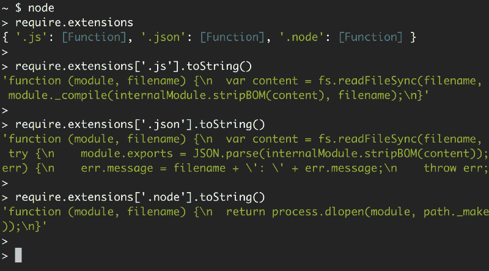
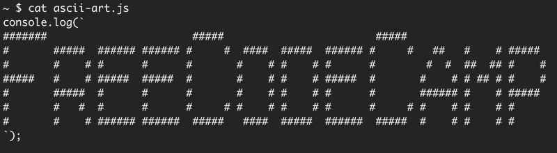

# Node.js 中需要的模块:您需要知道的一切

> 原文：<https://www.freecodecamp.org/news/requiring-modules-in-node-js-everything-you-need-to-know-e7fbd119be8/>

> **更新:**这篇文章现在是我的书《Node.js Beyond The Basics》的一部分。
> 
> 阅读本内容更新版本更多关于节点在【jscomplete.com/node-beyond-basics】**。**

**节点使用两个核心模块来管理模块依赖性:**

*   **`require`模块，似乎在全局范围内可用——不需要`require('require')`。**
*   **`module`模块，似乎也在全局范围内可用——不需要`require('module')`。**

**您可以将`require`模块视为命令，将`module`模块视为所有必需模块的组织者。**

**在 Node 中需要一个模块并不是一个复杂的概念。**

```
`const config = require('/path/to/file');`
```

**由`require`模块导出的主对象是一个函数(如上面的例子中所使用的)。当 Node 使用本地文件路径作为函数的唯一参数来调用那个`require()`函数时，Node 会经历以下一系列步骤:**

*   ****解析**:找到文件的绝对路径。**
*   ****加载**:确定文件内容的类型。**
*   ****包装**:给文件一个私有范围。这使得`require`和`module`对象对于我们需要的每个文件都是本地的。**
*   ****评估**:这是 VM 最终对加载的代码所做的事情。**
*   ****缓存**:这样当我们再次需要这个文件的时候，我们就不用再重复所有的步骤了。**

**在本文中，我将尝试用例子解释这些不同的阶段，以及它们如何影响我们在 Node 中编写模块的方式。**

**让我首先创建一个目录来存放使用我的终端的所有示例:**

```
`mkdir ~/learn-node && cd ~/learn-node`
```

**本文剩余部分中的所有命令都将从`~/learn-node`中运行。**

#### **解析本地路径**

**我来给你介绍一下`module`对象。您可以在一个简单的 REPL 会话中查看它:**

```
`~/learn-node $ node
> module
Module {
  id: '<repl>',
  exports: {},
  parent: undefined,
  filename: null,
  loaded: false,
  children: [],
  paths: [ ... ] }`
```

**每个模块对象都有一个`id`属性来标识它。这个`id`通常是文件的完整路径，但是在 REPL 会话中，它只是`<repl>.`**

**节点模块与文件系统中的文件有一对一的关系。我们需要一个模块，将文件的内容加载到内存中。**

**然而，由于 Node 允许以多种方式请求文件(例如，使用相对路径或预先配置的路径)，所以在我们可以将文件的内容加载到内存之前，我们需要找到该文件的绝对位置。**

**当我们需要一个`'find-me'`模块，而没有指定路径时:**

```
`require('find-me');`
```

**节点将按顺序在由`module.paths`指定的所有路径中寻找`find-me.js`。**

```
`~/learn-node $ node
> module.paths
[ '/Users/samer/learn-node/repl/node_modules',
  '/Users/samer/learn-node/node_modules',
  '/Users/samer/node_modules',
  '/Users/node_modules',
  '/node_modules',
  '/Users/samer/.node_modules',
  '/Users/samer/.node_libraries',
  '/usr/local/Cellar/node/7.7.1/lib/node' ]`
```

**路径列表基本上是从当前目录到根目录的每个目录下的 node_modules 目录列表。它还包括一些不推荐使用的旧目录。**

**如果 Node 在这些路径中找不到`find-me.js`，它将抛出“找不到模块错误”**

```
`~/learn-node $ node
> require('find-me')
Error: Cannot find module 'find-me'
    at Function.Module._resolveFilename (module.js:470:15)
    at Function.Module._load (module.js:418:25)
    at Module.require (module.js:498:17)
    at require (internal/module.js:20:19)
    at repl:1:1
    at ContextifyScript.Script.runInThisContext (vm.js:23:33)
    at REPLServer.defaultEval (repl.js:336:29)
    at bound (domain.js:280:14)
    at REPLServer.runBound [as eval] (domain.js:293:12)
    at REPLServer.onLine (repl.js:533:10)`
```

**如果你现在创建一个本地的`node_modules`目录并在那里放一个`find-me.js`，`require('find-me')`行将会找到它。**

```
`~/learn-node $ mkdir node_modules 

~/learn-node $ echo "console.log('I am not lost');" > node_modules/find-me.js

~/learn-node $ node
> require('find-me');
I am not lost
{}
>`
```

**如果另一个`find-me.js`文件存在于任何其他路径中，例如，如果我们在主目录下有一个`node_modules`目录，并且我们在那里有一个不同的`find-me.js`文件:**

```
`$ mkdir ~/node_modules
$ echo "console.log('I am the root of all problems');" > ~/node_modules/find-me.js`
```

**当我们从有自己的`node_modules/find-me.js`的`learn-node`目录中`require('find-me')`时，主目录下的`find-me.js`文件根本不会被加载:**

```
`~/learn-node $ node
> require('find-me')
I am not lost
{}
>`
```

**如果我们删除本地`~/learn-node`下的`node_modules`目录，并尝试再次请求`find-me`，将使用主目录下的`node_modules`目录下的文件:**

```
`~/learn-node $ rm -r node_modules/
~/learn-node $ node
> require('find-me')
I am the root of all problems
{}
>`
```

#### **需要文件夹**

**模块不一定是文件。我们还可以在`node_modules`下创建一个`find-me`文件夹，并在其中放置一个`index.js`文件。同一`require('find-me')`行将使用该文件夹的`index.js`文件:**

```
`~/learn-node $ mkdir -p node_modules/find-me

~/learn-node $ echo "console.log('Found again.');" > node_modules/find-me/index.js

~/learn-node $ node
> require('find-me');
Found again.
{}
>`
```

**请注意它是如何再次忽略主目录的`node_modules`路径的，因为我们现在有了一个本地路径。**

**当我们需要一个文件夹时，默认情况下会使用一个`index.js`文件，但是我们可以使用`package.json`中的`main`属性来控制文件夹下的文件名。例如，要让`require('find-me')`行解析到`find-me`文件夹下的另一个文件，我们需要做的就是在那里添加一个`package.json`文件，并指定应该使用哪个文件来解析这个文件夹:**

```
`~/learn-node $ echo "console.log('I rule');" > node_modules/find-me/start.js

~/learn-node $ echo '{ "name": "find-me-folder", "main": "start.js" }' > node_modules/find-me/package.json

~/learn-node $ node
> require('find-me');
I rule
{}
>`
```

#### **要求.解决**

**如果只想解析模块而不想执行，可以使用`require.resolve`函数。这与主`require`函数的行为完全相同，但是不加载文件。如果文件不存在，它仍然会抛出一个错误，当找到文件时，它将返回文件的完整路径。**

```
`> require.resolve('find-me');
'/Users/samer/learn-node/node_modules/find-me/start.js'
> require.resolve('not-there');
Error: Cannot find module 'not-there'
    at Function.Module._resolveFilename (module.js:470:15)
    at Function.resolve (internal/module.js:27:19)
    at repl:1:9
    at ContextifyScript.Script.runInThisContext (vm.js:23:33)
    at REPLServer.defaultEval (repl.js:336:29)
    at bound (domain.js:280:14)
    at REPLServer.runBound [as eval] (domain.js:293:12)
    at REPLServer.onLine (repl.js:533:10)
    at emitOne (events.js:101:20)
    at REPLServer.emit (events.js:191:7)
>`
```

**例如，这可以用来检查是否安装了可选的软件包，并且只在它可用时才使用它。**

#### **相对和绝对路径**

**除了从`node_modules`目录中解析模块之外，我们还可以将模块放在我们想要的任何地方，并要求它具有相对路径(`./`和`../`)或以`/`开始的绝对路径。**

**例如，如果`find-me.js`文件在`lib`文件夹下，而不是在`node_modules`文件夹下，我们可以用以下命令来要求它:**

```
`require('./lib/find-me');`
```

#### **文件之间的父子关系**

**创建一个`lib/util.js`文件，并在那里添加一个`console.log`行来标识它。同样，`console.log`这个`module`物体本身:**

```
`~/learn-node $ mkdir lib
~/learn-node $ echo "console.log('In util', module);" > lib/util.js`
```

**对一个`index.js`文件做同样的操作，这就是我们将使用 node 命令执行的内容。制作这个`index.js`文件需要`lib/util.js`:**

```
`~/learn-node $ echo "console.log('In index', module); require('./lib/util');" > index.js`
```

**现在执行带有节点的`index.js`文件:**

```
`~/learn-node $ node index.js
In index Module {
  id: '.',
  exports: {},
  parent: null,
  filename: '/Users/samer/learn-node/index.js',
  loaded: false,
  children: [],
  paths: [ ... ] }
In util Module {
  id: '/Users/samer/learn-node/lib/util.js',
  exports: {},
  parent:
   Module {
     id: '.',
     exports: {},
     parent: null,
     filename: '/Users/samer/learn-node/index.js',
     loaded: false,
     children: [ [Circular] ],
     paths: [...] },
  filename: '/Users/samer/learn-node/lib/util.js',
  loaded: false,
  children: [],
  paths: [...] }`
```

**注意主`index`模块`(id: '.')`现在如何被列为`lib/util`模块的父模块。然而，`lib/util`模块没有被列为`index`模块的子模块。取而代之的是，`[Circular]`值，因为这是一个循环引用。如果 Node 打印了`lib/util`模块对象，它将进入一个无限循环。这就是为什么它简单地用`[Circular]`代替了`lib/util`引用。**

**现在更重要的是，如果`lib/util`模块需要主`index`模块会发生什么？这就是我们进入所谓的循环模块依赖的地方，这在 Node 中是允许的。**

**为了更好地理解它，我们先来理解一下 module 对象上的其他几个概念。**

#### **模块的导出、模块导出和同步加载**

**在任何模块中，导出都是一个特殊的对象。如果你已经注意到了，每次我们打印一个模块对象，它都有一个 exports 属性，这个属性到目前为止是一个空的对象。我们可以向这个特殊的导出对象添加任何属性。例如，让我们导出`index.js`和`lib/util.js`的 id 属性:**

```
`// Add the following line at the top of lib/util.js
exports.id = 'lib/util';

// Add the following line at the top of index.js
exports.id = 'index';`
```

**当我们现在执行`index.js`时，我们将看到这些属性在每个文件的`module`对象上被管理:**

```
`~/learn-node $ node index.js
In index Module {
  id: '.',
  exports: { id: 'index' },
  loaded: false,
  ... }
In util Module {
  id: '/Users/samer/learn-node/lib/util.js',
  exports: { id: 'lib/util' },
  parent:
   Module {
     id: '.',
     exports: { id: 'index' },
     loaded: false,
     ... },
  loaded: false,
  ... }`
```

**为了保持简洁，我删除了上面输出中的一些属性，但是请注意`exports`对象现在如何拥有我们在每个模块中定义的属性。您可以在 exports 对象上添加任意多的属性，并且您实际上可以将整个对象更改为其他对象。例如，要将 exports 对象更改为函数而不是对象，我们需要执行以下操作:**

```
`// Add the following line in index.js before the console.log

module.exports = function() {};`
```

**当您现在运行`index.js`时，您将看到`exports`对象是一个怎样的函数:**

```
`~/learn-node $ node index.js
In index Module {
  id: '.',
  exports: [Function],
  loaded: false,
  ... }`
```

**请注意，我们没有使用`exports = function() {}`将`exports`对象转换成函数。我们实际上不能这样做，因为每个模块中的`exports`变量只是对管理导出属性的`module.exports`的引用。当我们重新分配`exports`变量时，引用丢失了，我们将引入一个新的变量，而不是改变`module.exports`对象。**

**当我们需要模块时，每个模块中的`module.exports`对象就是`require`函数返回的内容。例如，将`index.js`中的`require('./lib/util')`行改为:**

```
`const UTIL = require('./lib/util');

console.log('UTIL:', UTIL);`
```

**上面的代码将把在`lib/util`中导出的属性捕获到`UTIL`常量中。当我们现在运行`index.js`时，最后一行将输出:**

```
`UTIL: { id: 'lib/util' }`
```

**我们也来谈谈每个模块上的`loaded`属性。到目前为止，每当我们打印一个模块对象时，我们都会在该对象上看到一个值为`false`的`loaded`属性。**

**`module`模块使用`loaded`属性来跟踪哪些模块已经被加载(真值)以及哪些模块仍在被加载(假值)。例如，如果我们使用一个`setImmediate`调用在事件循环的下一个周期打印`module`对象，我们可以看到`index.js`模块被完全加载:**

```
`// In index.js
setImmediate(() => {
  console.log('The index.js module object is now loaded!', module)
});`
```

**其输出将是:**

```
`The index.js module object is now loaded! Module {
  id: '.',
  exports: [Function],
  parent: null,
  filename: '/Users/samer/learn-node/index.js',
  loaded: true,
  children:
   [ Module {
       id: '/Users/samer/learn-node/lib/util.js',
       exports: [Object],
       parent: [Circular],
       filename: '/Users/samer/learn-node/lib/util.js',
       loaded: true,
       children: [],
       paths: [Object] } ],
  paths:
   [ '/Users/samer/learn-node/node_modules',
     '/Users/samer/node_modules',
     '/Users/node_modules',
     '/node_modules' ] }`
```

**注意在这个延迟的`console.log`输出中`lib/util.js`和`index.js`是如何满载的。**

**当 Node 完成加载模块时,`exports`对象变得完整(并给它贴上标签)。请求/加载一个模块的整个过程是*同步的。*这就是为什么我们能够在事件循环的一个周期后看到模块被完全加载。**

**这也意味着我们不能异步改变`exports`对象。例如，我们不能在任何模块中执行以下操作:**

```
`fs.readFile('/etc/passwd', (err, data) => {
  if (err) throw err;

  exports.data = data; // Will not work.
});`
```

#### **循环模块依赖**

**现在让我们试着回答关于节点中循环依赖的重要问题:当模块 1 需要模块 2，模块 2 需要模块 1 时会发生什么？**

**为了找到答案，让我们在`lib/`、`module1.js`和`module2.js`下创建以下两个文件，并让它们相互要求:**

```
`// lib/module1.js

exports.a = 1;

require('./module2');

exports.b = 2;
exports.c = 3;

// lib/module2.js

const Module1 = require('./module1');
console.log('Module1 is partially loaded here', Module1);`
```

**当我们运行`module1.js`时，我们会看到以下内容:**

```
`~/learn-node $ node lib/module1.js
Module1 is partially loaded here { a: 1 }`
```

**在`module1`完全加载之前，我们需要`module2`,由于`module2`需要`module1`,而它并没有完全加载，我们从`exports`对象那里得到的是在循环依赖之前导出的所有属性。只报告了`a`属性，因为`b`和`c`都是在需要`module2`并打印`module1`之后导出的。**

**Node 让这变得非常简单。在模块加载期间，它构建`exports`对象。您可以在模块完成加载之前请求它，您将得到一个部分导出对象，其中包含目前为止定义的任何内容。**

#### **JSON 和 C/C++插件**

**我们可以通过 require 函数来本地要求 JSON 文件和 C++插件文件。你甚至不需要指定文件扩展名。**

**如果没有指定文件扩展名，Node 将首先尝试解析一个`.js`文件。如果它找不到一个`.js`文件，它将尝试一个`.json`文件，如果找到一个 JSON 文本文件，它将解析`.json`文件。在那之后，它会试图找到一个二进制的`.node`文件。然而，为了消除歧义，当需要除了`.js`文件之外的任何文件时，您可能应该指定一个文件扩展名。**

**例如，如果您需要在 JSON 文件中管理的所有东西都是一些静态配置值，或者您定期从外部源读取的一些值，那么需要 JSON 文件就很有用。例如，如果我们有下面的`config.json`文件:**

```
`{
  "host": "localhost",
  "port": 8080
}`
```

**我们可以这样直接要求它:**

```
`const { host, port } = require('./config');

console.log(`Server will run at http://${host}:${port}`);`
```

**运行上述代码将得到以下输出:**

```
`Server will run at http://localhost:8080`
```

**如果 Node 找不到一个`.js`或`.json`文件，它将寻找一个`.node`文件，并将该文件解释为一个编译过的插件模块。**

**节点文档站点有一个用 C++编写的[示例插件文件](https://nodejs.org/api/addons.html#addons_hello_world)。这是一个简单的模块，它公开了一个`hello()`函数，hello 函数输出“world”**

**您可以使用`node-gyp`包将`.cc`文件编译并构建成`.node`文件。你只需要配置一个 [binding.gyp](https://nodejs.org/api/addons.html#addons_building) 文件告诉`node-gyp`做什么。**

**一旦您有了`addon.node`文件(或者您在`binding.gyp`中指定的任何名称),那么您就可以像任何其他模块一样直接需要它:**

```
`const addon = require('./addon');

console.log(addon.hello());`
```

**我们其实看一下`require.extensions`就能看出三个扩展的支持。**

****

**查看每个扩展的函数，您可以清楚地看到 Node 将对每个扩展做什么。使用`module._compile`表示`.js`文件，`JSON.parse`表示`.json`文件，`process.dlopen`表示`.node`文件。**

#### **您在 Node 中编写的所有代码都将被包装在函数中**

**节点对模块的包装经常被误解。为了理解它，让我提醒你一下`exports` / `module.exports`的关系。**

**我们可以使用`exports`对象导出属性，但是我们不能直接替换`exports`对象，因为它只是对`module.exports`的引用**

```
`exports.id = 42; // This is ok.

exports = { id: 42 }; // This will not work.

module.exports = { id: 42 }; // This is ok.`
```

**这个看起来对每个模块都是全局的`exports`对象是如何被定义为对`module`对象的引用的呢？**

**在解释 Node 的包装过程之前，我再问一个问题。**

**在浏览器中，当我们像这样在脚本中声明一个变量时:**

```
`var answer = 42;`
```

**该`answer`变量将在定义它的脚本之后的所有脚本中全局可用。**

**Node 不是这样的。当我们在一个模块中定义一个变量时，程序中的其他模块将无法访问该变量。那么，Node 中的变量是如何神奇地确定作用域的呢？**

**答案很简单。在编译模块之前，Node 将模块代码包装在一个函数中，我们可以使用`module`模块的`wrapper`属性来检查这个函数。**

```
`~ $ node
> require('module').wrapper
[ '(function (exports, require, module, __filename, __dirname) { ',
  '\n});' ]
>`
```

**节点不直接执行您在文件中编写的任何代码。它执行这个包装函数，这个函数的主体中有你的代码。这使得在任何模块中定义的顶级变量都限定在该模块的范围内。**

**这个包装函数有 5 个参数:`exports`、`require`、`module`、`__filename`和`__dirname`。这使得它们看起来是全局的，而实际上它们是特定于每个模块的。**

**当 Node 执行包装器函数时，所有这些参数都得到它们的值。`exports`被定义为对之前`module.exports`的引用。`require`和`module`都特定于要执行的函数，`__filename` / `__dirname`变量将包含被包装模块的绝对文件名和目录路径。**

**如果您运行一个第一行就有问题的脚本，您可以看到这种换行的效果:**

```
`~/learn-node $ echo "euaohseu" > bad.js

~/learn-node $ node bad.js
~/bad.js:1
(function (exports, require, module, __filename, __dirname) { euaohseu
                                                              ^
ReferenceError: euaohseu is not defined`
```

**注意上面报告的脚本的第一行是包装函数，而不是错误的引用。**

**此外，由于每个模块都被包装在一个函数中，我们实际上可以用关键字`arguments`访问该函数的参数:**

```
`~/learn-node $ echo "console.log(arguments)" > index.js

~/learn-node $ node index.js
{ '0': {},
  '1':
   { [Function: require]
     resolve: [Function: resolve],
     main:
      Module {
        id: '.',
        exports: {},
        parent: null,
        filename: '/Users/samer/index.js',
        loaded: false,
        children: [],
        paths: [Object] },
     extensions: { ... },
     cache: { '/Users/samer/index.js': [Object] } },
  '2':
   Module {
     id: '.',
     exports: {},
     parent: null,
     filename: '/Users/samer/index.js',
     loaded: false,
     children: [],
     paths: [ ... ] },
  '3': '/Users/samer/index.js',
  '4': '/Users/samer' }`
```

**第一个参数是`exports`对象，它从空开始。然后我们有了`require` / `module`对象，它们都是与我们正在执行的`index.js`文件相关联的实例。它们不是全局变量。最后两个参数是文件的路径及其目录路径。**

**包装函数的返回值是`module.exports`。在包装的函数中，我们可以使用`exports`对象来改变`module.exports`的属性，但是我们不能重新分配导出本身，因为它只是一个引用。**

**发生的情况大致相当于:**

```
`function (require, module, __filename, __dirname) {
  let exports = module.exports;

  // Your Code...

  return module.exports;
}`
```

**如果我们改变整个`exports`对象，它将不再是对`module.exports`的引用。这是 JavaScript 引用对象在任何地方工作的方式，而不仅仅是在这个上下文中。**

#### **所需对象**

**`require`没什么特别的。它是一个对象，主要充当一个函数，接受模块名或路径并返回`module.exports`对象。如果我们愿意，我们可以简单地用我们自己的逻辑覆盖`require`对象。**

**例如，可能出于测试的目的，我们希望每个`require`调用都被默认模仿，并且只返回一个假的对象，而不是所需的模块导出对象。这个简单的 require 的重新分配将达到目的:**

```
`require = function() {

  return { mocked: true };

}`
```

**在对`require`做了上面的重新分配后，脚本中的每个`require('something')` 调用都会返回被嘲笑的对象。**

**所需对象也有自己的属性。我们已经看到了`resolve`属性，它是一个只执行 require 流程的解析步骤的函数。我们在上面也看到了`require.extensions`。**

**还有`require.main`可以帮助确定脚本是需要的还是直接运行的。**

**比方说，我们在`print-in-frame.js`中有一个简单的`printInFrame`函数:**

```
`// In print-in-frame.js

const printInFrame = (size, header) => {
  console.log('*'.repeat(size));
  console.log(header);
  console.log('*'.repeat(size));
};`
```

**该函数接受一个数字参数`size`和一个字符串参数`header`，并在一个由我们指定的大小控制的星号框架中打印该标头。**

**我们希望以两种方式使用该文件:**

1.  **从命令行直接这样:**

```
`~/learn-node $ node print-in-frame 8 Hello`
```

**传递 8 和 Hello 作为命令行参数，在 8 颗星的框架中打印“Hello”。**

**2.用`require`。假设所需的模块将导出`printInFrame`函数，我们可以直接调用它:**

```
`const print = require('./print-in-frame');

print(5, 'Hey');`
```

**在 5 颗星的框架中打印标题“嘿”。**

**那是两种不同的用法。我们需要一种方法来确定该文件是作为独立脚本运行，还是被其他脚本所需要。**

**这就是我们可以使用这个简单 if 语句的地方:**

```
`if (require.main === module) {
  // The file is being executed directly (not with require)
}`
```

**因此，我们可以通过不同的方式调用 printInFrame 函数来使用这个条件来满足上面的使用要求:**

```
`// In print-in-frame.js

const printInFrame = (size, header) => {
  console.log('*'.repeat(size));
  console.log(header);
  console.log('*'.repeat(size));
};

if (require.main === module) {
  printInFrame(process.argv[2], process.argv[3]);
} else {
  module.exports = printInFrame;
}`
```

**当不需要该文件时，我们只需用`process.argv`元素调用`printInFrame`函数。否则，我们只需将`module.exports`对象改为`printInFrame`函数本身。**

#### **所有模块都将被缓存**

**理解缓存很重要。我用一个简单的例子来演示一下。**

**假设您有下面的`ascii-art.js`文件，它打印了一个看起来很酷的标题:**

****

**我们想在每次*需要*文件时显示这个标题。所以当我们需要文件两次时，我们希望文件头出现两次。**

```
`require('./ascii-art') // will show the header.
require('./ascii-art') // will not show the header.`
```

**由于模块的缓存，第二个需求将不显示标题。节点缓存第一次调用，第二次调用时不加载文件。**

**我们可以通过在第一次请求后打印`require.cache`来查看这个缓存。缓存注册表只是一个对象，对于每个必需的模块都有一个属性。那些属性值是用于每个模块的`module`对象。我们可以简单地从`require.cache`对象中删除一个属性来使缓存无效。如果我们这样做，节点将重新加载模块，重新缓存它。**

**然而，对于这种情况，这不是最有效的解决方案。简单的解决方案是用函数包装`ascii-art.js`中的日志行，并导出该函数。这样，当我们需要`ascii-art.js`文件时，我们可以得到一个函数，每次都可以执行该函数来调用日志行:**

```
`require('./ascii-art')() // will show the header.
require('./ascii-art')() // will also show the header.`
```

**这个题目我就说这么多。感谢阅读。下次见！**

**学习 React 还是 Node？签出我的图书:**

*   **[通过构建游戏学习 react . js](http://amzn.to/2peYJZj)**
*   **[Node.js 超越基础](http://amzn.to/2FYfYru)**