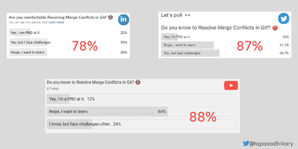
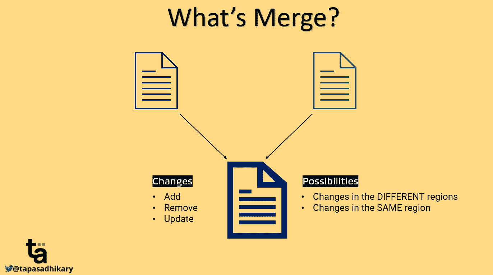
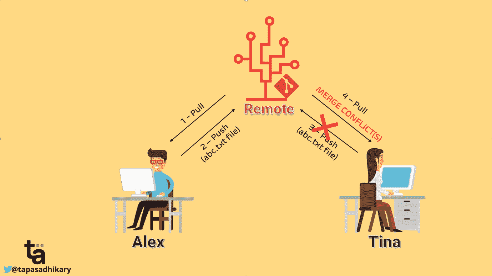
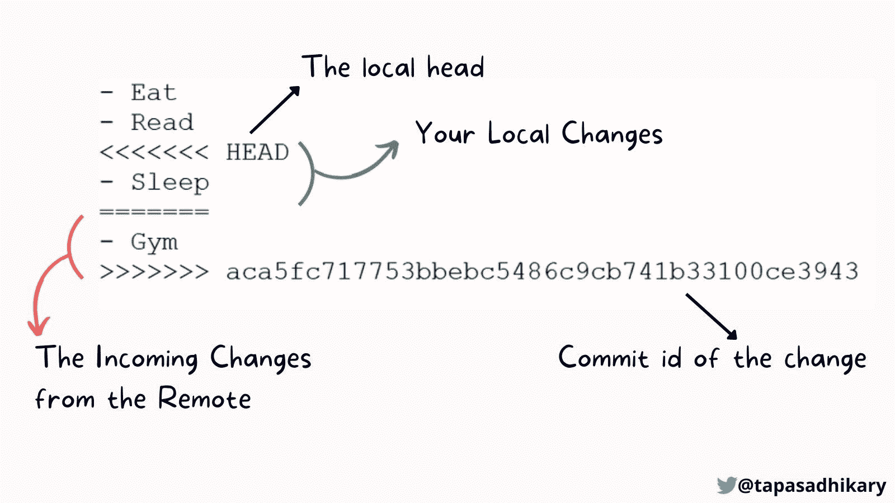

# 如何解决 Git 中的合并冲突——带示例的实用指南

> 原文：<https://www.freecodecamp.org/news/resolve-merge-conflicts-in-git-a-practical-guide/>

`Git`是一个开源的分布式版本控制系统。它帮助您使用本地分支、暂存和工作流轻松管理项目文件。

如今，许多开发人员都在使用 Git。他们通常熟悉基本的 Git 概念，比如:

*   如何启动存储库。
*   如何创建分支？
*   如何准备/取消准备变更。
*   如何提交更改。
*   如何将提交推送到远程？

然而，许多开发人员对类似于`merging`和`resolving merge conflicts`的概念感到困惑。在本文中，我们将学习如何以一种实用的方式解决合并冲突。这意味着你将在阅读这篇文章的同时阅读、理解并尝试它。

如果您也喜欢从视频内容中学习，本文也可以作为视频教程在此处获得:🙂

[https://www.youtube.com/embed/OulZeVtZhZQ?feature=oembed](https://www.youtube.com/embed/OulZeVtZhZQ?feature=oembed)

如果你是 Git 新手，想要学习所有的基本概念，[这里有一个有用的速成课程](https://www.youtube.com/watch?v=vWtu4mzUgQo)。

## Devs 对“合并冲突”有什么看法？

最近，我在 Twitter、LinkedIn 和 YouTube 上进行了一项调查，询问开发人员是否愿意在 Git 中解决合并冲突。猜猜我发现了什么？

70%-80%的开发人员表示，他们发现在 Git 中解决合并冲突很有挑战性。所以这意味着“解决合并冲突”是一个重要的讨论话题。



Poll Results - Are you comfortable resolving merge conflicts in Git?

## 什么是 Git 合并，什么是合并冲突？

是一个版本控制系统，可以保存所有文件版本的历史记录。您可以在任何时候返回到任何版本并检索旧版本。

假设您已经创建了一个名为`abc.txt`的文件，并将其推送到 Git 存储库。此时，该文件具有与其相关联的当前版本。现在，如果您的同事更改了同一个文件并将其推回存储库，该文件就会有一个关联的新版本。

`Git Merge`是一项允许您将文件的当前内容与其他先前版本保持同步的功能。这是非常重要的，因为任何人在任何时间点都应该处理文件的最新内容，而不覆盖以前版本的任何更改。

Git `merge`帮助您在将一个新的变更推送到同一个文件之前，合并来自其他开发人员的变更。



在 Git 合并的情况下，我们需要注意两件事:

1.  **变更**:文件的两个版本之间发生了什么类型的操作？添加或删除新内容，或者更新现有内容。
2.  **可能性**:有两种可能性。文件的`different regions`发生了变化或者文件的`same region`发生了变化。相同区域意味着开发人员在文件的相同位置(例如，段落、行等)进行了更改。

幸运的是，Git 使用`auto-merge`策略自动处理大部分情况。但是当文件的`same region`发生变化时，Git 不会执行自动合并。相反，它让你去`Resolve the Merge Conflicts`。

## Git 合并冲突:一个恐怖的故事

我们用两个开发者 Alex 和 Tina 的故事来理解以上情况。

一个晴朗的日子，

*   Alex 将变更从远程存储库转移到他的本地存储库。
*   他更改了名为`abc.txt`的文件，暂存它，提交它，最后将它推回到远程存储库。
*   与此同时，Tina 并不知道 Alex 在`abc.txt`文件中的更改，而是在文件的`same region`中做了一些更改，并试图将其推送到远程存储库。
*   是一个版本控制系统，所以它警告 Tina 她已经更改了比遥控器中的版本旧的版本(因为 Alex 的更改已经在遥控器中)。
*   现在，Tina 需要首先从远程获取更改，更新文件，然后再次尝试推送。
*   蒂娜干的。然而，在她最疯狂的噩梦中，她得到了`auto-merge`失败的警告，所以她现在需要`Resolve the merge conflicts`。



这个故事让你想起什么了吗？上面的故事和你有关系吗？你过去有可能处于蒂娜的地位。如果没有，你最终会到达那里！那么，让我们来了解一下 Tina 必须如何高效地处理这种情况。

## 如何解决 Git 中的合并冲突

解决合并冲突并不像听起来那么棘手。在 90%的情况下，一旦你对变化有了清晰的理解和平和的心态，事情就会变得更容易。

### 思维过程

一旦 Tina 提取了更改，Tina 的本地文件就包含了她的更改和 Alex 的更改。现在蒂娜可以做以下四件事之一:

*   她可以保留 Alex 的更改并删除她的更改。
*   她可以删除 Alex 的更改并保留她的更改。
*   她可以保留 Alex 和她的更改。
*   她可以删除 Alex 和她的更改。

好吧，但是她应该做哪一个？这完全取决于项目的需求和用例。蒂娜会理解这些变化，并做任何与情况相关的事情。

那么，什么是`incoming`变化呢？蒂娜要怎么识别呢？蒂娜是如何做出改变的？我知道你有很多这样的问题。让我们通过下面的几个现实生活中的例子来得到所有这些问题的答案。

## 解决 Git 中合并冲突的步骤

让我们举几个现实生活中的合并冲突的例子，并学习如何解决它们。

在任何时间点，如果你想交互式地学习这些概念，请查看我在本文开头提到的视频的[这一段。](https://www.youtube.com/watch?v=OulZeVtZhZQ&t=397s)

### 示例 1:更改位于文件的同一区域

当 Git 因为更改在同一个区域中而无法执行自动合并时，它用特殊字符指示冲突区域。字符序列是这样的:

*   `<<<<<<<`
*   `=======`
*   `>>>>>>>`

`<<<<<<<`和`=======`之间的一切都是你的局部变化。这些变更还不在远程存储库中。在`=======`和`>>>>>>>`之间的所有行都是来自远程存储库或另一个分支的变更。现在，您需要研究这两个部分并做出决定。

下图显示了一个文件的内容，表明自动合并没有发生并且存在冲突。冲突发生在我们通过添加一行`- Sleep`在本地修改文件的那一行。但与此同时，其他人通过在同一区域添加线`- Gym`推动了一项更改。

因此，行`- Sleep`被标记为本地变更，而`- Gym`被标记为来自远程存储库或另一个分支的传入变更。



Merge Conflict due to Changes in the Same Region

基于您的用例和项目需求，您将打电话解决冲突。如果您只需要保留带有`- Sleep`的那一行，那么您将保留该行并删除其余的冲突文本。在这种情况下，文件内容变成:

```
- Eat
- Read
- Sleep
```

相反，你可以保留线`- Gym`并去掉`- Sleep`的变化:

```
- Eat
- Read
- Gym
```

如果需要保留这两行，请删除与冲突指示器相关的行:

```
- Eat
- Read
- Sleep
- Gym
```

如果您认为不需要任何更改，请将它们全部删除。

```
- Eat
- Read
```

这完全取决于你来决定什么样的改变与这种情况相关。更改之后，您需要确保文件中不存在任何表示冲突的字符(<<<<<<> > > > > >)。一旦您接受了这些更改，请执行以下操作:

阶段变化:

```
git add <files>
```

用消息提交更改:

```
git commit -m "Message"
```

最后，将更改推送到遥控器:

```
git push
```

这就是在这个场景中解决合并冲突的全部内容。

### 示例 2:文件在远程/其他分支被删除

在移除文件合并冲突中，一个 dev 删除一个分支中的文件，而另一个 dev 编辑另一个分支中的相同文件。在这种情况下，您需要决定是否要保留该文件，或者删除它是否正确。

要将删除的文件添加回分支，请执行以下操作:

```
git add <file-name>
```

要继续删除文件，请执行以下操作:

```
git rm <file-name>
```

然后用一条消息提交您的更改:

```
git commit -m "Message"
```

最后，推一下:

```
git push
```

## 下一步是什么？

如果您从上面的两个例子中学习并实践它们，您将能够处理大多数场景并解决您的合并冲突。所以，我建议练习几次。

如果你面临任何新的情况或在解决合并冲突时陷入困境，请在本视频的[评论部分发表评论。我会尽力回应的！](https://www.youtube.com/watch?v=OulZeVtZhZQ)

在我们结束之前，给你一些提示:

*   本文中展示的所有示例都假设您正在使用 GitBash 或任何其他 Git CLI 来解决合并冲突。您可以使用任何其他 GUI 工具来做同样的事情。
*   在代码上开始任何新的逻辑工作之前，总是从远程/其他相关分支中提取。这将使您的分支尽可能保持最新，并减少冲突的机会。
*   总是先拉后推，以确保你不会面临来自 Git 的任何拒绝。
*   当你无法决定保留什么还是删除什么的时候，和你的同事/合作开发者谈谈。结对解决任何困难的合并冲突。

目前就这些。我希望这篇文章对您有所启发，有助于您解决 Git 中的合并冲突。

我们来连线。

*   如果你不想错过每天的 Web 开发和编程技巧，就在 Twitter 上关注一下吧。
*   在 GitHub 上查看我的开源项目。
*   如果你想以实用的方式学习 JavaScript、ReactJS、Node.js、Git 以及所有关于 Web 开发的知识，你可以[订阅](https://www.youtube.com/tapasadhikary?sub_confirmation=1)我的 YouTube 频道。

我的下一篇文章再见。在那之前，请照顾好自己，保持快乐。