# 如果您是一名痴迷于学习的开发人员，请查看这些资源。

> 原文：<https://www.freecodecamp.org/news/resources-for-software-developers-who-are-obsessed-with-learning-94dd26ed5dbd/>

作者吉米·张

# 如果您是一名痴迷于学习的开发人员，请查看这些资源。

Photo by [Janko Ferlič](https://unsplash.com/photos/sfL_QOnmy00?utm_source=unsplash&utm_medium=referral&utm_content=creditCopyText) on [Unsplash](https://unsplash.com/search/photos/learning?utm_source=unsplash&utm_medium=referral&utm_content=creditCopyText)

软件开发的很多内容都围绕着学习。这个行业发展很快，新的语言、框架和系统似乎一夜之间就涌现出来。

但是除了学习这些技术如何工作，软件开发人员还需要学习软件开发的哪个领域最适合他们。这是我最近一直关注的事情，我想分享一些在这一过程中对我有所帮助的资源。

以下是资源列表，包括:策划的每日文摘，编程论坛，书籍和播客。每种资源(除了书籍之外)都涵盖了软件开发的一般内容，而不是专注于某个特定的领域。

只要有可能，我就收集所涉及主题类型的数据，并在每个资源旁边列出。

尽情享受吧！

### 策划文摘

在这个列表中最重要的是三个精选的每日文摘，这是我最喜欢的，因为它们有很高的“命中率”(信噪比)。

#### **发现者号**

“全网最佳工程博客每日文摘”， [DiscoverDev](https://www.discoverdev.io/) 是我每个工作日早上首先访问的网站之一。它向我介绍了许多高质量的博客文章，否则我永远也不会发现。

DiscoverDev 为每个特色帖子提供了一些主题标签，这些标签突出了所涵盖的各种主题和机器学习的受欢迎程度。

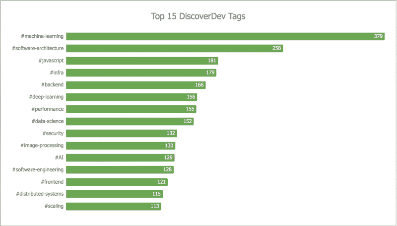

Data from 2017–06–26 to 2018–07–20

#### **晨报**

每周日早上， [Adrian Colyer](https://blog.acolyer.org/) 都会总结一篇“来自 CS 世界的有趣/有影响力/重要的论文”——自 2014 年 10 月以来，他基本上每天都在总结！

他的总结使用简单的语言来描述关键的发现，他让研究论文变得更容易理解，这一点值得称赞。

科尔耶的博客不仅是阅读材料的宝库，也是数据的宝库。它向我们表明，尽管总体而言，分布式系统是最受欢迎的研究主题:

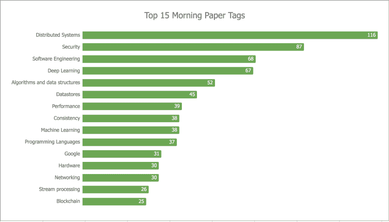

Data from 2014–10–10 to 2018–07–20

在过去的三年里，深度学习变得更加流行:

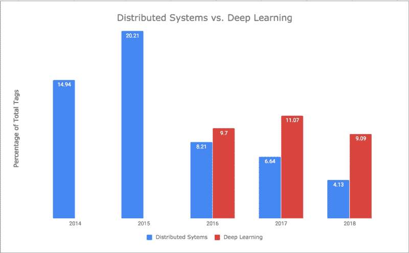

#### **晨杯编码**

类似于的 DiscoverDev、[的 Morning Cup Coding](https://www.humanreadablemag.com/morningcupofcoding/)**也是一个从网络上收集技术文章的每日简讯。**

**然而，Morning Cup of Coding 更倾向于以编程语言为中心(“用 Y 编程语言做 X”)。它还包括一个“有趣”的部分，以一篇有趣的文章和一种深奥的编程语言为特色。**

**晨杯编码只是最近才开始标记每个职位。个别编程语言比较突出。深度学习仍然无处不在。**

**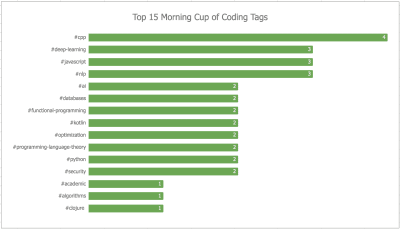

Data from 2018–07–09 to 2018–07–20** 

### **论坛**

**论坛是与其他程序员讨论文章和想法的好地方。有些评论是多余的，有些则是彻头彻尾的刻薄。但每隔一段时间，我都会读到一段比文章本身更有见地的评论。**

#### ****黑客新闻****

**很可能是在互联网上讨论编程的最佳场所。我从[黑客新闻](https://news.ycombinator.com/)中发现的有趣内容比其他任何网站都多。**

#### ****龙虾****

**类似于黑客新闻，但没有流量的水平。Lobstre.rs 确实有一些[的优势](https://lobste.rs/about)——也就是标签系统。**

**对首页的快速分析揭示了“黑客”倾向，有多个安全、unix 和 linux 提交。值得注意的遗漏:深度学习，机器学习。**

**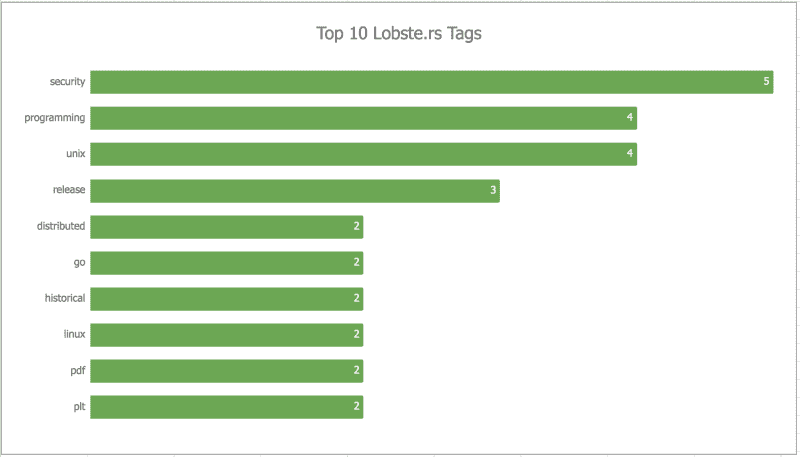

Data taken from Lobste.rs Front Page on 2018–07–22** 

#### ****r/编程****

**[这个子 reddit](https://www.reddit.com/r/programming/) 讨论了许多在 Hacker News 和 Lobste.rs 上分享的相同文章。**

### **书**

**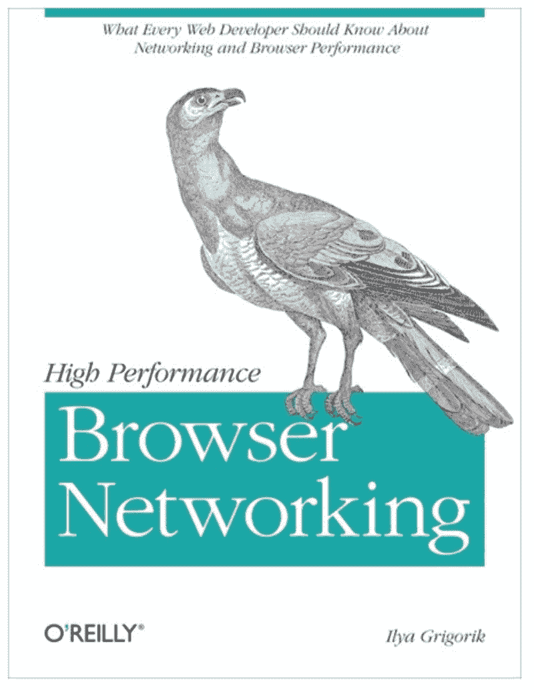****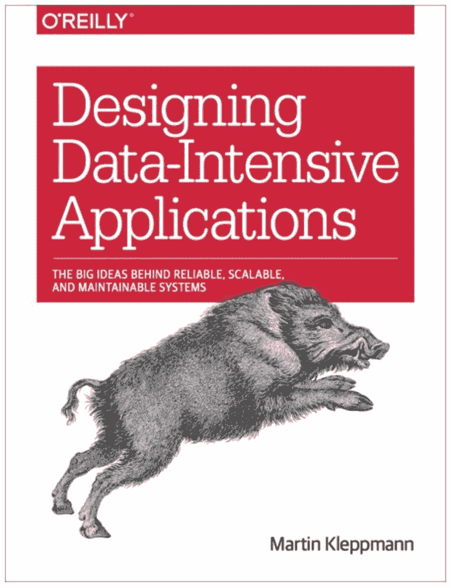****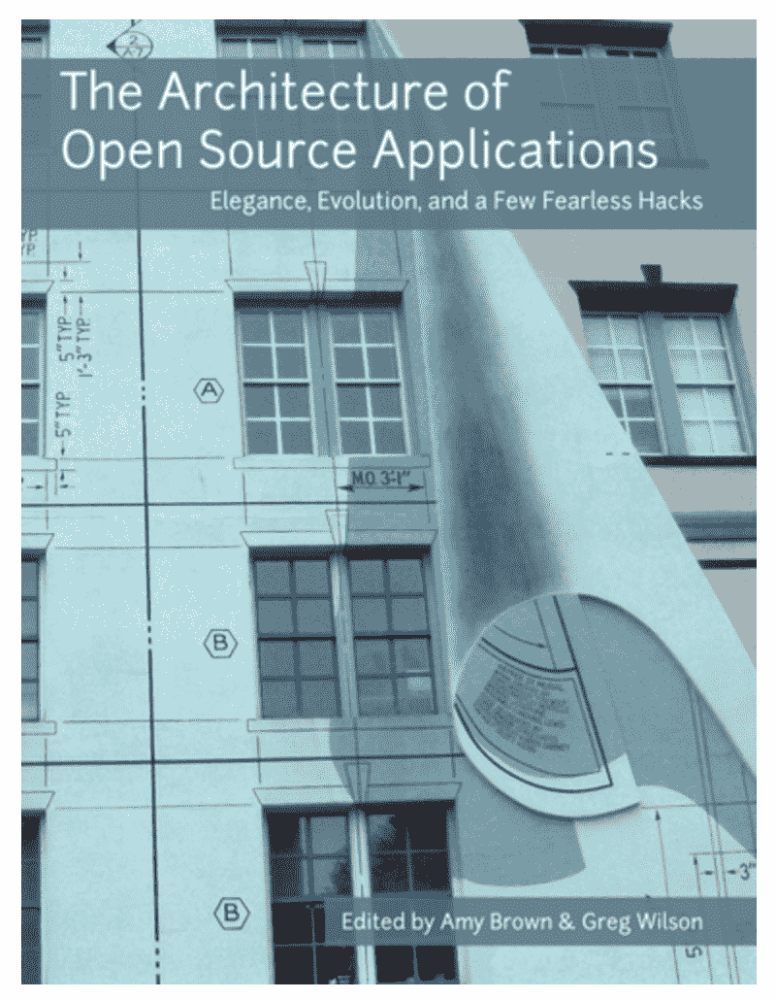**

**虽然技术书籍是提升某一特定领域的可靠途径，但它们可能很难读懂。对于技术书籍，我发现它有助于:**

1.  **跳过一遍，而不是试图从头到尾阅读这本书。**
2.  **作为小组的一员阅读，保持动力，澄清困惑。**

**有许多有价值的技术书籍，选择这 6 本书是因为它们涵盖了软件开发的不同方面。(前三本书的免费版本也有帮助)。**

#### **伊利亚·格里戈利克的高性能浏览器网络(免费)**

**主题:性能、网络、Web 开发**

**涵盖了与互联网和 web 开发相关的网络基础知识，在技术细节上非常容易理解。我发现[关于 TCP](https://hpbn.co/building-blocks-of-tcp/)的那一章信息量特别大。**

**[免费链接](https://hpbn.co/)**

#### ****开源应用的架构**(免费)**

**主题:各种**

**以各种领域的软件设计为特色的文章,《开源应用程序的体系结构》是一个被低估的系列。我喜欢阅读为什么会做出某些决定，以及这些决定是如何经受住时间考验的。**

**我最喜欢的文章是 [Graphite](http://aosabook.org/en/graphite.html) 和 [Selenium WebDriver](http://aosabook.org/en/selenium.html) ，前者记录了一个系统在面对不断增长的规模时的演变，后者包含了一个为了建立一个更大的生态系统而有意吸收复杂性的花絮。**

**[免费链接](http://aosabook.org/en/index.html)**

**Eric S. Raymond 的 Unix 编程艺术(免费)**

**主题:Unix，软件设计，操作系统**

**Unix 经受住了时间的考验，我和许多其他人一样，欣赏其核心思想的优雅。这本书更多的是关于驱动这些想法的哲学的论文，而不是“如何做”的手册(为此，[您的 UNIX/Linux](https://www.amazon.com/Your-UNIX-Linux-Ultimate-Guide/dp/0073376205) 是一个合适的资源)。**

**[免费链接](http://aosabook.org/en/index.html)**

#### ****设计数据密集型应用**作者 Martin Kleppmann**

**主题:数据库、分布式系统、可伸缩性**

**如果有免费版本，这将是这个列表中的第一本书。设计数据密集型应用程序是现代计算机系统基础的综合指南。它会变得很密集，和一群同事一起阅读帮助很大。**

**关于编码的那一章对我目前的工作帮助比我读过的任何其他东西都大。**

#### ****商业数据科学**福斯特教务长&汤姆·福西特**

**主题:数据科学，数据挖掘**

**我最初不打算包括这本书，因为我只读过前几章。但是，我是在看到深度学习和机器学习流行的数据后才收录的。虽然这本书没有涉及深度学习，但它仍然是预测数据建模的一个有价值的介绍。**

#### **乔恩·斯托克斯的《机器内部》**

**主题:计算机体系结构，微处理器**

**作为软件开发人员，我们很少需要考虑 CPU 和寄存器。然而，当编写性能关键的代码时，计算机体系结构内部(如 CPU 缓存)的知识是关键。**

**我是从一篇[黑客新闻评论](https://news.ycombinator.com/item?id=3919787)中发现这本书的，这篇评论是关于著名论文[每个程序员都应该知道的关于内存的知识](https://people.freebsd.org/~lstewart/articles/cpumemory.pdf)。机内的评论推荐“更平易近人的东西”，我全心全意赞同。**

### **播客**

**播客对于接触新思想和跟上行业的新发展都很有帮助。涵盖各种软件主题的两个播客是:**

*   **[软件工程日报](https://softwareengineeringdaily.com/) (SE Daily)，更关注当今趋势(区块链、机器学习、Kubernetes)**
*   **和[软件工程广播](http://www.se-radio.net/) (SE 广播)，它更关注编程的日常细节(测试、语言、设计模式)**

**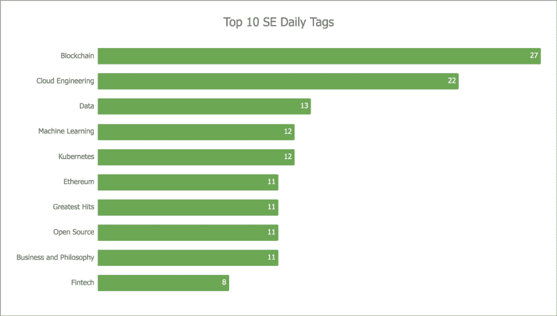****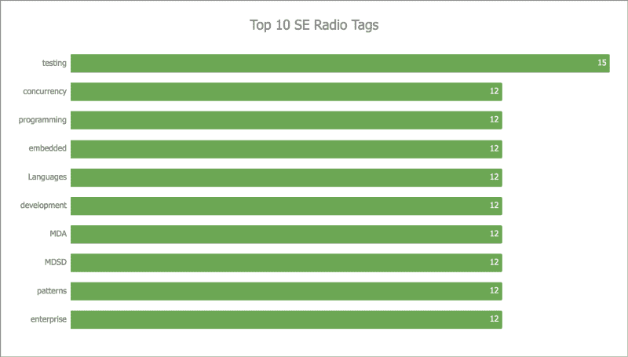

Data from 2018–03–08 to 2018–07–23** 

**SE Daily 是我最喜欢的，因为他们确实名副其实地拥有“每日”的绰号(尽管公平地说，SE Radio 早在 2006 年就有剧集):**

**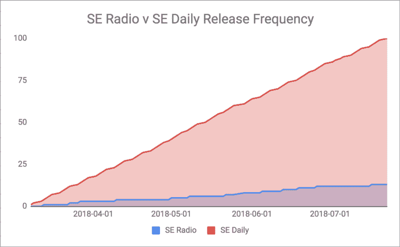

Data from 2018–03–08 to 2018–07–23** 

### **结论**

**我希望这篇文章中提到的资源能够帮助你成为一名更好的软件开发人员。如果有任何对你有帮助的资源，我也很乐意听到。**

**感谢阅读！**