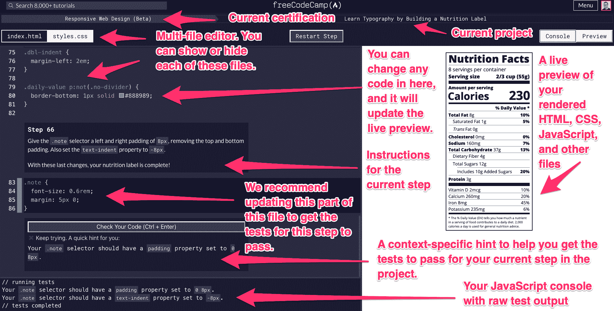
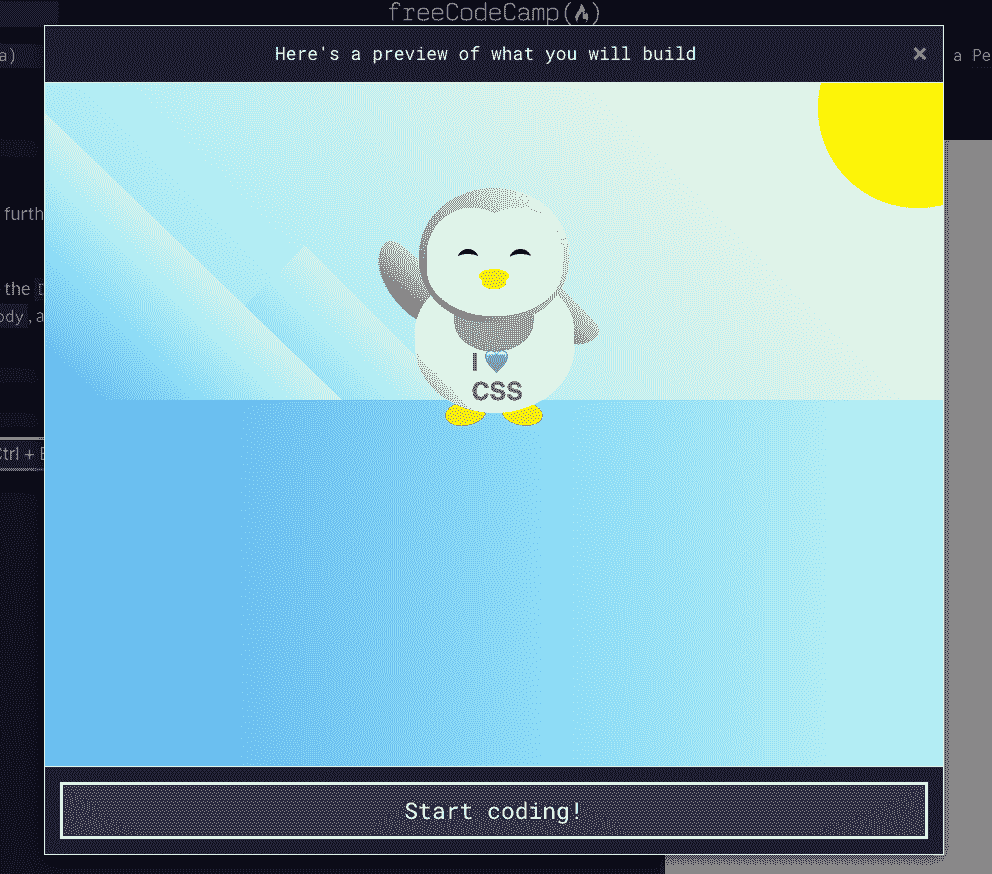
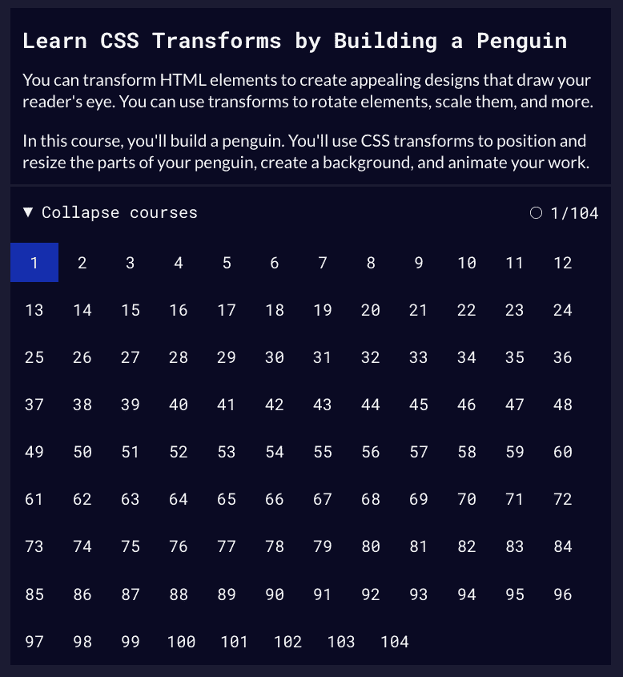
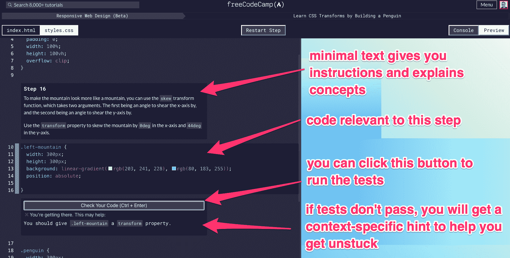
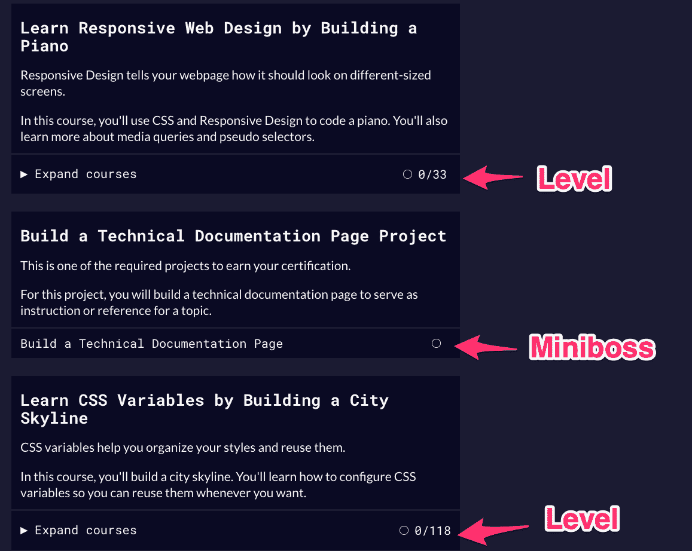

# 通过构建 20 个项目来学习响应式网页设计——这是 freeCodeCamp 的主要课程更新

> 原文：<https://www.freecodecamp.org/news/responsive-web-design-certification-redesigned/>

我们刚刚发布了对响应式网页设计认证的重大改革(freeCodeCamp 目前 10 个认证中的第一个)。我们还更新了代码编辑器。

你将通过 15 个实践项目+ 5 个认证项目来学习概念和语法，而不是学习编码课程。

下面是完整的认证，我们估计大多数 web 开发初学者需要大约 300 个小时才能完成:

1.  通过构建一个猫照片应用程序来学习 HTML
2.  通过建立一个咖啡馆菜单学习基本的 CSS
3.  通过创建标记集了解 CSS 颜色
4.  通过构建注册表单来学习 HTML 表单
5.  **认证项目:建立调查表**
6.  通过构建 Rothko 绘画来学习 CSS 盒子模型
7.  通过建立一个图片库来学习 CSS Flexbox
8.  通过制作营养标签来学习排版
9.  通过建立测验来了解可访问性
10.  **认证项目:**建立致敬页面
11.  通过构建资产负债表了解更多关于 CSS 伪选择器的信息
12.  通过构建一幅毕加索的画来学习中级 CSS
13.  通过建造一架钢琴来学习响应式网页设计
14.  **认证项目:建立技术文档页面**
15.  通过构建城市天际线学习 CSS 变量
16.  通过建立一个杂志来学习 CSS 网格
17.  **认证项目:建立产品登陆页面**
18.  通过构建企鹅来学习 CSS 转换
19.  通过建造摩天轮学习 CSS 动画
20.  **认证项目:建立个人作品集网页**

请注意，为了获得响应式 Web 设计认证，您只需构建粗体的 5 个认证项目**，并通过它们的测试套件。本课程的其余部分是可选的。**

我们将这些认证项目贯穿始终。它们是开放式的。您从空白代码编辑器开始，逐行构建项目，最终通过整个测试套件。请注意，目前我们仍然在这些项目中使用 CodePen，但在 2022 年 1 月初，我们将把这些转移到我们自己的代码编辑器中。

另请注意，这 5 个认证项目与该认证的旧版本相同。一切都是完全向后兼容的，如果你已经做了这些项目，你不需要重新做这些项目。

另请注意，您获得的任何旧认证将继续有效。你不必担心简历或 LinkedIn 个人资料上的链接会被破坏。

## 新实践项目如何工作:我们的新代码编辑器

I manually annotated some of the features of the new code editor. This is where you will build the practice projects line-by-line, getting tests to pass along the way.

我最初在 2017 年有了这个设计的想法。这就是我们一直在构建和迭代的时间。但我对这个结果感到很激动。

实践项目中的每一步都有自己的测试。我们也有上下文相关的提示。这些将有助于巧妙地为你指出正确的方向，而不会完全给出答案。

一旦您通过了该步骤的测试，您将无缝地转移到下一步，我们会将您滚动到您需要添加下一行代码的代码库部分。

我们的目标是让你能够进入心流状态并停留在那里。我们希望你在一次编码会议中完成几十个这样的步骤——或者整个项目。

我们已经建立了一个多文件编辑器，您将能够在其中编写相当复杂的前端项目。

很快，我们将推出我们的完整沙盒，您将能够使用它来构建您的各种认证项目。不再需要使用 CodePen 或 JSBin——一切都可以在 freeCodeCamp.org 上正常运行。

## 我们整合了多年来获得的大量反馈和用户体验经验。

除了新的代码编辑器，我们增加的主要改进包括:

### 多练习

该课程现在有更多的项目，这些项目将引导你编写成千上万行代码。

这将让你一直处于一个紧密的反馈循环中——失败的测试、错误信息和提示。

在每个项目开始的时候，我们也会给你一个你将要构建的预览。

A preview of one of the projects you'll build – a CSS penguin.

### 更多的重复有助于记忆

我们最初的目标是让人们广泛、快速地接触到关键的编程概念。但是我们收到的很多反馈是我们进展太快了。

大多数人似乎更喜欢慢一点，并对这些技术进行更多的练习。

这个新更新的课程会给你更多的练习，帮助你更好地记住关键概念和编程语法。

Each project has a table of steps. Completed steps are highlighted in blue. You can skip to any step at any time, but we recommend doing them in order.

### 少读书。更多编码。

这花费了令人难以置信的大量工作，但是我们能够重新组织课程来“及时”地教你，一次只用几句解释。以下是课程的一般“核心游戏循环”:

读几个句子->找出你的下一行代码应该是什么样子并输入->运行测试并让它们通过->重复这个过程 1000 次

下面是一个典型的步骤:

Each step will take you to the part of your code where you need to add a new line of code or change existing code. And it will have lots of tests. Depending on which tests fail, it will give you a context-specific hint to help you get unstuck and keep moving forward.

### 散布在各层的“迷你巴士”

我们还做了另一项重大改进。以前，在你完成所有课程后，你会在最后完成认证的所有 5 个大项目。

现在，随着您学习新技术，您将定期处理这些认证项目。所以在 3 或 4 个有更多引导测试的实践项目之后，你将面对一个空白的代码编辑器和 10 个或更多的“用户故事”测试。你必须利用你刚刚学到的技能，找出如何通过每一项测试。

我们乐观地认为，这将消除与获得这些认证相关的困难。这将有助于进一步强化你的技能和记忆力，缩短你学习技能和回忆并运用技能之间的时间。

You can see how many steps will be in each project and how many of them you have completed. The certifications – "minibosses" – are a single step. These are essentially an empty code editor with a test suite. You have to code the entire project yourself get all of its tests to pass.

## 您现在可以尝试新的响应式网页设计认证

它仍处于测试阶段。如果你遇到困难，我鼓励你在 freeCodeCamp 论坛上寻求帮助。谁知道呢——你可能会发现一个错误。这将是积极的发展。

我们将在 2022 年完成更新的 JavaScript 算法和数据结构认证。之后，我们将发布更新的前端库认证。

如果你准备好了，你可以直接进入新的[响应式网页设计认证](https://www.freecodecamp.org/learn/2022/responsive-web-design/)。

快乐编码。