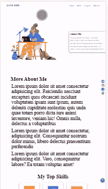
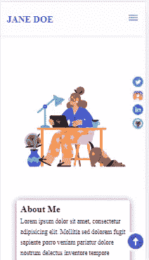
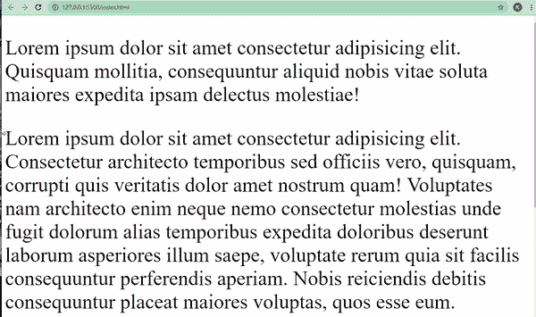
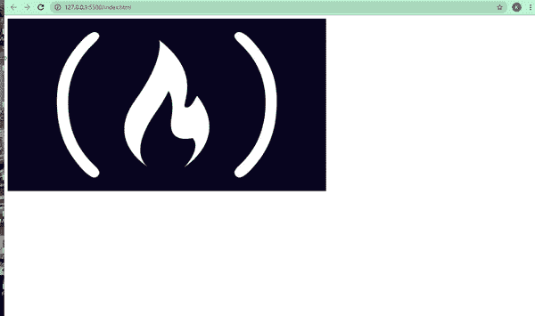
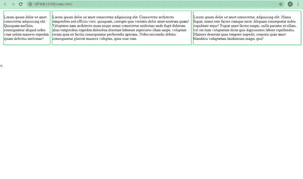
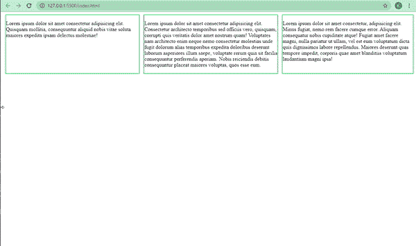

# 响应式网页设计——适合初学者的现代网站代码

> 原文：<https://www.freecodecamp.org/news/responsive-web-design-modern-website-code-for-beginners/>

当互联网还很年轻的时候，网站访问者使用台式机，然后是宽屏笔记本电脑来访问网站。

然后，当智能手机被开发出来时，手机用户不得不无休止地缩放和滚动来访问和查看这些相同网站的不同部分。

值得庆幸的是，由于响应式网页设计的革命性引入，这种情况已经不复存在了。

在本文中，我将带您了解响应式 Web 设计的发展，使其成为可能的各种集成，以及如何在您的编码项目中使用它来获得更好的用户体验。

## 什么是响应式网页设计？

响应式网页设计使网页能够在各种设备屏幕尺寸上正确呈现，而不会缩短或扭曲内容。

例如，这并不意味着一个网站在手机和笔记本电脑上的显示方式完全相同。相反，它意味着网页的内容适应不同的屏幕尺寸——从大屏幕(台式机和笔记本电脑)到中等屏幕(平板电脑)再到移动屏幕(各种屏幕尺寸的手机)。

它在做这些事情的同时保留了相同的内容(可能只是为了适应每个屏幕而进行了不同的排列)。

## 响应式网页设计的演变

过去，人们大多使用台式机和笔记本电脑在线浏览内容，因为网站只针对这些屏幕进行了优化。

但是随着越来越多的人开始使用手机上网，人们开始抱怨他们看到的糟糕的显示和布局。

这对网页设计者和开发者来说意味着一件事:网站也需要针对移动设备进行优化！

最近十年，移动端的网站用户数量开始首次超过台式机和笔记本电脑。因此，从科技巨头到小型企业，每个人都开始采用响应式网页设计方法。

开发人员和设计师也创造了闪亮的新的移动优先设计。这意味着开发者首先为移动设备制作网站，然后才是桌面网站。

这通常意味着为移动设备和更大的屏幕建立一个单独的网站，使用相同的服务器系统，但不同的域。

例如，最初的网站可能是`examplewebsite.com`，移动版本可能是`examplewebsite.mobi`，或者是`m.examplewebsite.com`。

用户的设备将被现成的脚本检测到，然后呈现适当的域。这种做法今天仍然存在。

除了双域方法之外，网站设计者和开发者可以首先为特定的屏幕尺寸创建一个网站(可以是桌面、平板或移动)，然后添加所谓的媒体查询，使网站适应不同的屏幕尺寸。这是移动优先的方法。

## 如何让你的网站响应迅速

将响应式 web 设计方法集成到一个项目中包括代码的每个部分——HTML`<head>`元素、HTML 结构、CSS 甚至 JavaScript。

我将尽可能清晰详细地描述这些过程。

### 在头部设置视口

```
<meta name="viewport" content="width=device-width, initial-scale=1.0"> 
```

既然 HTML 在定义网页结构方面起着巨大的作用，那么它肯定与使网站响应(适应)不同的屏幕尺寸有关。

您需要将 meta viewport empty 元素包含在任何想要针对不同屏幕尺寸进行优化的 web 页面的 head 部分中。

这告诉浏览器将网页的宽度呈现为设备的精确宽度。因此，如果设备宽度为 1200 像素，网页宽度将为 1200 像素。如果设备的宽度为 720 像素，则网页宽度将为 720 像素，依此类推。

这避免了手机用户过去经历的恼人的放大和缩小，这对用户体验不好。

下面是一个网站在没有`<meta>`视窗元素的小型手机上的外观:



下面是带有`<meta>`视窗元素的同一个网站在小型手机上的外观:



如果你想知道这是哪个网站，这是我为初学者制作的免费作品集网站模板。我将很快向所有 freeCodeCamp 的读者开放——敬请期待。:)

但是`<meta>` viewport 元素并不是让网站适应不同屏幕尺寸所需要的全部。还有更多。

### CSS 媒体查询

让你的网站响应迅速的最重要的工具是 CSS3 媒体查询。媒体查询允许您为多个屏幕以不同的方式编写相同的 CSS 代码。

对于媒体查询，您告诉浏览器在特定的屏幕上以特定的方式显示内容。

媒体查询的基本语法如下所示:

```
@media screen and (max-width: 720px) {
  /*CSS codes go here*/
} 
```

这告诉浏览器在屏幕宽度低于 720 像素断点时执行媒体查询中编写的 CSS 代码。断点通常可以是 1200 像素到 320 像素之间的任何值。

在下面的代码片段中，当屏幕宽度低于 768 像素时，我指示浏览器将`background-color`改为深灰色，将`color`改为蓝色。

```
<body>
    <p>
      Lorem ipsum dolor sit amet consectetur adipisicing elit. Quisquam
      mollitia, consequuntur aliquid nobis vitae soluta maiores expedita ipsam
      delectus molestiae!
    </p>

    <p>
      Lorem ipsum dolor sit amet consectetur adipisicing elit. Consectetur
      architecto temporibus sed officiis vero, quisquam, corrupti quis veritatis
      dolor amet nostrum quam! Voluptates nam architecto enim neque nemo
      consectetur molestias unde fugit dolorum alias temporibus expedita
      doloribus deserunt laborum asperiores illum saepe, voluptate rerum quia
      sit facilis consequuntur perferendis aperiam. Nobis reiciendis debitis
      consequuntur placeat maiores voluptas, quos esse eum.
    </p>

    <p>
      Lorem ipsum dolor sit amet consectetur, adipisicing elit. Minus fugiat,
      nemo rem facere cumque error. Aliquam consequatur nobis cupiditate atque!
      Fugiat amet facere magni, nulla pariatur ut ullam, vel est eum voluptatum
      dicta quis dignissimos labore repellendus. Maiores deserunt quas tempore
      impedit, corporis quae amet blanditiis voluptatum laudantium magni ipsa!
    </p>
</body> 
```

```
 @media screen and (max-width: 768px) {
        body {
          background-color: #333;
          color: #3498db;
        }
     } 
```


对于不同的设备，还存在其他几个断点。

*   320-480 像素，适用于 iPhone 6、7 和 5 等小型手机

*   平板电脑和 iPads 的 478 - 768px

*   1025-1200 像素，适用于台式机和大屏幕

有些超大屏幕和电视可以拍 1200px 以上。

### 响应文本

因为手机上的文本大小和桌面上的不一样，所以文本必须随着设备屏幕宽度的减小而缩小。

您可以在每个屏幕的媒体查询中执行此操作。其中一个简单的方法是使用相对单位(%)，rem 和 em，而不是像 px 这样的绝对单位。

在下面的 HTML 和 CSS 代码片段中，我指示浏览器在大屏幕上设置文本的字体大小为 3 雷姆，在宽度低于 768 像素的屏幕上设置为 1.5 雷姆:

```
<p>
   Lorem ipsum dolor sit amet consectetur adipisicing elit. Quisquam
   mollitia, consequuntur aliquid nobis vitae soluta maiores expedita ipsam
   delectus molestiae!
</p>

<p>
   Lorem ipsum dolor sit amet consectetur adipisicing elit. Consectetur
   architecto temporibus sed officiis vero, quisquam, corrupti quis veritatis
   dolor amet nostrum quam! Voluptates nam architecto enim neque nemo
   consectetur molestias unde fugit dolorum alias temporibus expedita
   doloribus deserunt laborum asperiores illum saepe, voluptate rerum quia
   sit facilis consequuntur perferendis aperiam. Nobis reiciendis debitis
   consequuntur placeat maiores voluptas, quos esse eum.
</p>

<p>
   Lorem ipsum dolor sit amet consectetur, adipisicing elit. Minus fugiat,
   nemo rem facere cumque error. Aliquam consequatur nobis cupiditate atque!
   Fugiat amet facere magni, nulla pariatur ut ullam, vel est eum voluptatum
   dicta quis dignissimos labore repellendus. Maiores deserunt quas tempore
   impedit, corporis quae amet blanditiis voluptatum laudantium magni ipsa!
</p> 
```

```
@media screen and (max-width: 768px) {
        p {
          font-size: 1.5rem;
        }
      } 
```



### 响应图像

就像文本一样，图像也必须随着屏幕宽度的减小而缩小。

图像具有固定的宽度和高度，因此当它们大于视口宽度(屏幕宽度)时，用户通常必须滚动才能看到整个图像，这造成了糟糕的用户体验。

开发人员通过为所有图像设置 100%的最大宽度并将它们显示为块级元素(默认情况下图像是内联元素)来解决这个问题。

您可以为代码中的图像单独设置这个，但是为了培养 DRY(不要重复)原则，您应该在所有图像的重置中这样做。

```
 img {
        display: block;
        max-width: 100%;
      } 
```

另一种使图像具有响应性的方法是在 HTML 中使用图片元素。使用这个元素，您可以告诉浏览器在不同的设备上显示与宽度相关的不同图像。

```
<picture>
      <source
        media="(max-width: 1100px)"
        srcset="freecodecamp-large-logo.jpg"
      />
      <source
        media="(max-width: 900px)"
        srcset="freecodecamp-medium-logo.jpg"
      />
      <source media="(max-width: 760px)" srcset="freecodecamp-small-logo.jpg" />
      
</picture> 
```

*   在宽度为 1100 像素及以下的屏幕上，将显示 freecodecamp-large-logo
*   在宽度为 900 像素及以下的屏幕上，将显示 freecodecamp-medium-logo
*   在宽度为 760 像素及以下的屏幕上，将显示 freecodecamp-small-logo

如果屏幕宽度不满足任何条件，将显示 freecodecamp-large-logo。



### 响应式布局

任何网页的布局决定了内容在浏览器中的显示方式。

以前开发者要用表格，不太好控制。然后是`float`和`clearfix`，也很难管理。

CSS Grid 和 Flexbox 的引入革新了布局，并赋予了响应式设计更多的相关性。

#### flex box(flex box)的缩写形式

有了 CSS flexbox，响应式设计获得了更多的相关性，因为有了它，您不必像在布局中使用浮动那样添加太多的媒体查询。

默认情况下，当 flex 的显示被分配给包含元素时，元素方向会立即呈现在该行上。

您可以稍后使用媒体查询通过 flex-direction 属性为较小的屏幕设置列的方向。flex-direction 属性值必须显式设置为列。

您还可以使用 flex-grow 和 flex-shrink 等属性，按照您希望的方式来布局网页上的内容。这两个属性使它们包含的元素随着屏幕视口(宽度)的增加而增大，随着视口的减小而缩小。多酷啊。

在下面的代码片段中，不同文本片段在各自容器中的方向将是屏幕上宽度大于 768 像素的一行，当宽度小于 768 像素时是一列。

我可以通过将 body 元素中的所有项目显示为 flex 来实现。

```
<body>
    <div class="container-one">
        <p>
            Lorem ipsum dolor sit amet consectetur adipisicing elit. Quisquam
            mollitia, consequuntur aliquid nobis vitae soluta maiores expedita ipsam
            delectus molestiae!
        </p>
    </div>

    <div class="container-two">
        <p>
        Lorem ipsum dolor sit amet consectetur adipisicing elit. Consectetur
        architecto temporibus sed officiis vero, quisquam, corrupti quis veritatis
        dolor amet nostrum quam! Voluptates nam architecto enim neque nemo
        consectetur molestias unde fugit dolorum alias temporibus expedita
        doloribus deserunt laborum asperiores illum saepe, voluptate rerum quia
        sit facilis consequuntur perferendis aperiam. Nobis reiciendis debitis
        consequuntur placeat maiores voluptas, quos esse eum.
        </p>
    </div>

    <div class="container-three">
        <p>
        Lorem ipsum dolor sit amet consectetur, adipisicing elit. Minus fugiat,
        nemo rem facere cumque error. Aliquam consequatur nobis cupiditate atque!
        Fugiat amet facere magni, nulla pariatur ut ullam, vel est eum voluptatum
        dicta quis dignissimos labore repellendus. Maiores deserunt quas tempore
        impedit, corporis quae amet blanditiis voluptatum laudantium magni ipsa!
        </p>
    </div> 
</body> 
```

```
body {
          display: flex;
      }

      div {
          border: 2px solid #2ecc71;
          margin-left: 6px;
      }

      @media screen and (max-width: 768px) {
        body {
          flex-direction: column;
        }
    } 
```



#### CSS 网格

CSS grid 或多或少是 flexbox 的一种混合和更强大的形式。许多人认为，无论你用 Flexbox 做什么，用 Grid 都可以用更少的代码来完成。

使用 CSS grid，您可以更直接地创建灵活的网格，因为您可以通过将 grid-auto-flow 属性设置为 column 或 row 来定义所需的列和行。

您可以像我们在 Flexbox 示例中那样使用 Grid:

```
body {
          display: grid;
          grid-auto-flow: column;
          gap: 6px;
      }

      div {
          border: 2px solid #2ecc71;
          margin-left: 6px;
      }

      @media screen and (max-width: 768px) {
        body {
            grid-auto-flow: row;
        } 
     } 
```



你可以在 freeCodeCamp CSS 课程中了解更多关于 Flexbox 和 Grid 的知识。

## 结论

随着互联网用户现在更多地通过手机而不是台式机和笔记本电脑访问网站，响应式设计是制作现代网站的必由之路。

了解响应式设计的最佳实践将使你从其他开发人员中脱颖而出，因为你将能够在相同的 HTML、CSS 和 JavaScript 文件中制作适应不同屏幕大小的网站。

我希望这篇文章已经给了你制作响应性真实网站所需要的洞察力。

感谢阅读，继续编码。