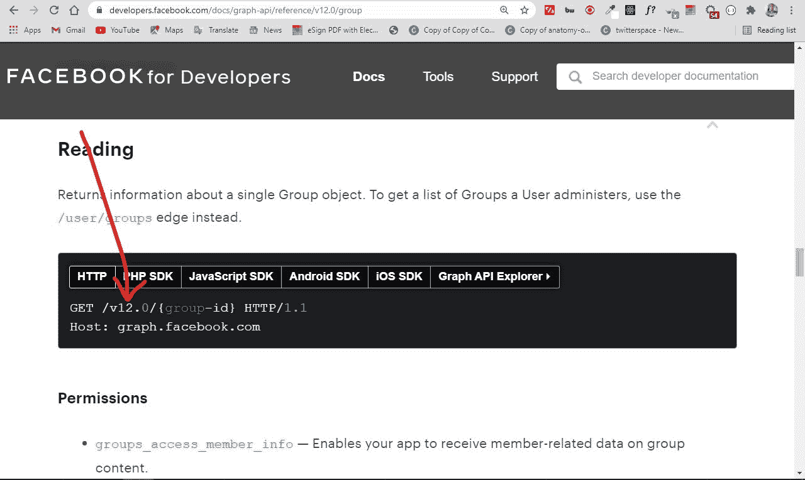
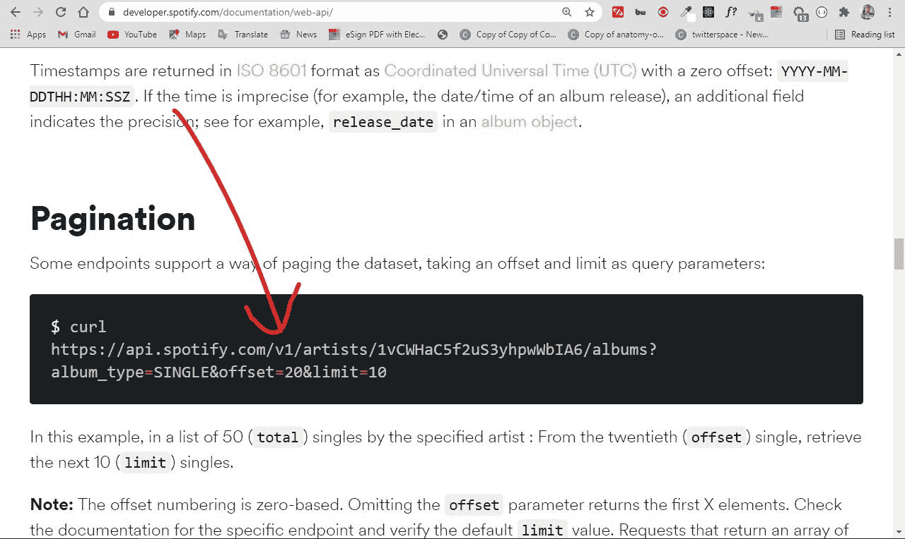

# REST API 最佳实践——REST 端点设计示例

> 原文：<https://www.freecodecamp.org/news/rest-api-best-practices-rest-endpoint-design-examples/>

在 Web 开发中，REST APIs 在确保客户机和服务器之间的顺畅通信方面起着重要的作用。

你可以把客户端想象成前端，把服务器想象成后端。

客户机(前端)和服务器(后端)之间的通信通常不是非常直接的。因此，我们使用一个称为应用程序编程接口(或 API)的接口作为客户端和服务器之间的中介。

因为 API 在这种客户机-服务器通信中起着至关重要的作用，所以我们在设计 API 时应该始终牢记最佳实践。这有助于维护它们的开发人员以及使用它们的人员在履行这些职责时不会遇到问题。

在本文中，我将带您了解制作 REST APIs 时需要遵循的 9 个最佳实践。这将有助于您尽可能地开发出最好的 API，并使 API 消费者的生活更加轻松。

## 首先，什么是 REST API？

REST 代表代表性状态转移。它是一种软件架构风格，由 Roy Fielding 在 2000 年创建，用于指导 web 架构的设计。

任何遵循 REST 设计原则的 API(应用程序编程接口)都被称为 RESTful。

简单地说，REST API 是两台计算机通过 HTTP(超文本传输协议)进行通信的媒介，与客户端和服务器通信的方式相同。

## REST API 设计最佳实践

### 1.使用 JSON 作为发送和接收数据的格式

在过去，接受和响应 API 请求大多是用 XML 甚至 HTML 来完成的。但是现在，JSON (JavaScript Object Notation)在很大程度上已经成为发送和接收 API 数据的事实上的格式。

这是因为，以 XML 为例，解码和编码数据通常有点麻烦——所以 XML 不再受到框架的广泛支持。

例如，JavaScript 有一个内置的方法来通过 fetch API 解析 JSON 数据，因为 JSON 主要是为它而生的。但是如果您使用任何其他编程语言，比如 Python 或 PHP，它们现在都有解析和操作 JSON 数据的方法。

例如，Python 提供了用于处理 JSON 数据的`json.loads()`和`json.dumps()`。

为了确保客户机正确解释 JSON 数据，您应该在发出请求时将响应头中的`Content-Type`类型设置为`application/json`。

另一方面，对于服务器端框架，它们中的许多会自动设置`Content-Type`。例如，Express 现在有了用于此目的的`express.json()`中间件。`body-parser` NPM 的一揽子计划仍然是为了同样的目的。

### 2.在端点使用名词而不是动词

当您设计 REST API 时，您不应该在端点路径中使用动词。端点应该使用名词，表示每个端点做什么。

这是因为 HTTP 方法如`GET`、`POST`、`PUT`、`PATCH`和`DELETE`已经以动词的形式执行基本的 CRUD(创建、读取、更新、删除)操作。

`GET`、`POST`、`PUT`、`PATCH`和`DELETE`是最常见的 HTTP 动词。还有其他的比如`COPY`、`PURGE`、`LINK`、`UNLINK`等等。

例如，端点不应该是这样的:

`https://mysite.com/getPosts or https://mysite.com/createPost`

而是应该是这样的:`https://mysite.com/posts`

简而言之，您应该让 HTTP 动词处理端点所做的事情。因此，`GET`将检索数据，`POST`将创建数据，`PUT`将更新数据，`DELETE`将删除数据。

### 3.用复数名词命名集合

您可以将您的 API 的数据视为来自您的消费者的不同资源的集合。

如果你有一个像`https://mysite.com/post/123`这样的端点，删除一个带有`DELETE`请求的帖子或者更新一个带有`PUT`或`PATCH`请求的帖子可能是没问题的，但是它不会告诉用户集合中可能还有其他一些帖子。这就是为什么你的收藏应该使用复数名词。

所以，不是`https://mysite.com/post/123`，应该是`https://mysite.com/posts/123`。

### 4.在错误处理中使用状态代码

在响应对 API 的请求时，应该总是使用常规的 HTTP 状态代码。这将有助于您的用户了解正在发生的事情——请求是成功了，还是失败了，还是其他什么。

下表显示了不同的 HTTP 状态代码范围及其含义:

| 状态代码范围 | 意义 |
| --- | --- |
| 100 – 199 | 信息反应。例如，102 表示资源正在被处理 |
| 300 – 399 | 重定向
例如，301 意味着永久移动 |
| 400 – 499 | 客户端错误
400 表示错误的请求，404 表示未找到资源 |
| 500 – 599 | 服务器端错误
例如，500 表示内部服务器错误 |

### 5.使用端点上的嵌套来显示关系

通常，不同的端点可以相互连接，因此您应该嵌套它们，以便更容易理解它们。

例如，在多用户博客平台的情况下，不同的帖子可能由不同的作者撰写，因此在这种情况下，端点如`https://mysite.com/posts/author`将构成有效的嵌套。

同样，文章可能有自己的评论，所以要检索评论，像`https://mysite.com/posts/postId/comments`这样的端点是有意义的。

你应该避免嵌套超过 3 层，因为这会降低 API 的优雅性和可读性。

### 6.使用筛选、排序和分页来检索所请求的数据

有时候，一个 API 的数据库会变得非常大。如果发生这种情况，从这样的数据库中检索数据可能会非常慢。

过滤、排序和分页都是可以在 REST API 集合上执行的操作。这使得它只检索、排序和安排必要的数据到页面中，这样服务器就不会被请求占用太多时间。

过滤端点的一个例子如下:
`https://mysite.com/posts?tags=javascript`
这个端点将获取任何带有 JavaScript 标签的帖子。

### 7.使用 SSL 实现安全性

SSL 代表安全套接字层。这对于 REST API 设计中的安全性至关重要。这将保护您的 API，使其不容易受到恶意攻击。

您应该考虑的其他安全措施包括:使服务器和客户端之间的通信保密，并确保任何使用该 API 的人不会得到超过他们所请求的内容。

SSL 证书不难加载到服务器上，而且在第一年大部分时间都是免费的。在不能免费获得的情况下，购买它们并不昂贵。

运行在 SSL 上的 REST API 和不运行在 SSL 上的 REST API 之间的明显区别是 HTTP:
`https://mysite.com/posts`中的“s”运行在 SSL 上。
`http://mysite.com/posts`不在 SSL 上运行。

### 8.明确版本控制

REST APIs 应该有不同的版本，所以不要强迫客户端(用户)迁移到新版本。如果不小心的话，这甚至可能会破坏应用程序。

web 开发中最常见的版本控制系统之一是语义版本控制。

语义版本化的一个例子是 1.0.0、2.1.2 和 3.3.4。第一个数字代表主要版本，第二个数字代表次要版本，第三个数字代表修补版本。

许多来自科技巨头和个人的 RESTful APIs 通常是这样的:版本 1 的
`https://mysite.com/v1/`版本 2 的
`https://mysite.com/v2`

脸书的 API 版本是这样的:

Spotify 以同样的方式进行版本控制:

并非每个 API 都是如此。Mailchimp 版本不同的 API:

当您以这种方式使 REST APIs 可用时，如果客户选择不迁移到新版本，您并没有强迫他们迁移到新版本。

### 9.提供准确的 API 文档

当您制作 REST API 时，您需要帮助客户(消费者)学习并弄清楚如何正确使用它。最好的方法是为 API 提供好的文档。

文件应包含:

*   API 的相关端点
*   端点的示例请求
*   用几种编程语言实现
*   针对不同错误及其状态代码列出的消息

可以用于 API 文档的最常用工具之一是 Swagger。您还可以使用 Postman(软件开发中最常见的 API 测试工具之一)来记录您的 API。

## 结论

在本文中，您了解了在构建 REST APIs 时需要牢记的几个最佳实践。

将这些最佳实践和约定付诸实践是很重要的，这样您就可以构建功能强大的应用程序，这些应用程序运行良好、安全，并最终使您的 API 消费者的生活更加轻松。

感谢您的阅读。现在，用这些最佳实践制作一些 API。