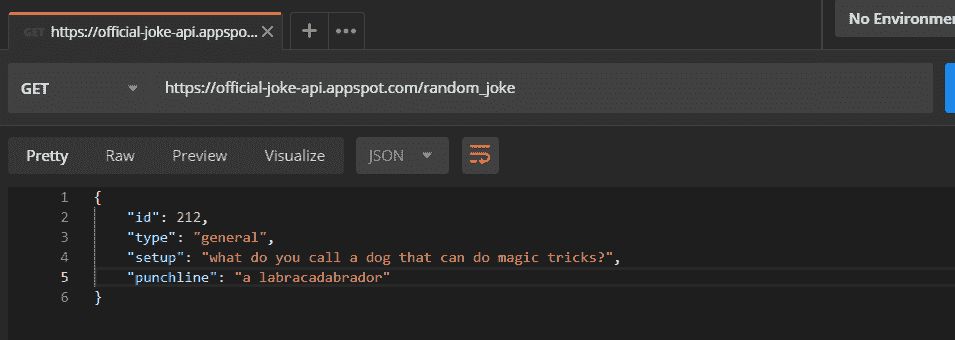
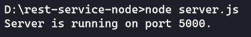
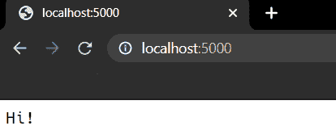
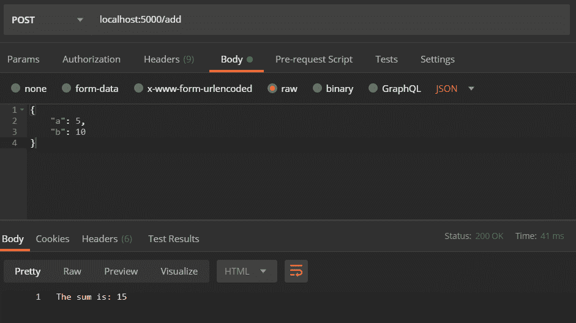

# REST API 教程——用代码示例解释 REST 客户端、REST 服务和 API 调用

> 原文：<https://www.freecodecamp.org/news/rest-api-tutorial-rest-client-rest-service-and-api-calls-explained-with-code-examples/>

想知道网站的登录/注册是如何在后台进行的吗？或者，当你在 YouTube 上搜索“可爱的小猫”时，你会得到一堆结果，并能够从远程机器上下载？

在这本初学者友好的指南中，我将带你完成设置 RESTful API 的过程。我们将解密一些术语，看看如何用 NodeJS 编写服务器。让我们更深入地研究一下 JavaScript 吧！

## 把行话拿开

那么，什么是休息？根据维基百科:

> 代表性状态转移是一种软件架构风格，它定义了一组用于创建 Web 服务的约束。RESTful Web 服务允许请求系统通过使用一组统一的、预定义的无状态操作来访问和操作 Web 资源的文本表示

让我们来揭开这是什么意思(希望你拿到了完整的表格)。REST 基本上是客户机和服务器之间的一组通信规则。REST 的定义有一些限制:

1.  **客户端-服务器架构**:网站/app 的用户界面应该与数据请求/存储分离，这样每个部分都可以单独伸缩。
2.  **无状态**:通信不应该在服务器上存储客户端上下文。这意味着对服务器的每个请求都应该使用所有需要的数据，如果服务器有来自以前请求的任何数据，则不应该做出任何假设。
3.  **分层系统**:客户端应该无法判断它是直接与服务器通信还是与某个中介通信。这些中间服务器(代理服务器或负载平衡器)考虑到了底层服务器的可伸缩性和安全性。

好了，现在你知道什么是 RESTful 服务了，下面是标题中使用的一些术语:

1.  **REST 客户端**:可以访问这些 REST 服务的代码或者 app。你现在正在使用一个！是的，浏览器可以充当不受控制的 REST 客户端(网站处理浏览器请求)。在很长一段时间里，浏览器对所有 REST 请求都使用一个名为 XMLHttpRequest 的内置函数。但是，这被 [FetchAPI](https://developer.mozilla.org/en-US/docs/Web/API/Fetch_API) 所取代，这是一种基于[承诺](https://developer.mozilla.org/en-US/docs/Web/JavaScript/Reference/Global_Objects/Promise)的现代请求方法。其他例子还有代码库，如 [axios](https://github.com/axios/axios) 、 [superagent](https://github.com/visionmedia/superagent) 和 [got](https://github.com/sindresorhus/got) 或一些专用应用程序，如 [Postman](https://www.postman.com/) (或在线版本，[Postman](https://postwoman.io/)！)，或者像 [cURL](https://curl.haxx.se/) 这样的命令行工具！。
2.  **休息服务**:服务器。有许多流行的库使得创建这些服务器变得轻而易举，比如 NodeJS 的 [ExpressJS](https://expressjs.com/) 和 Python 的 [Django](https://www.djangoproject.com/) 。
3.  **REST API** :它定义了允许访问/提交数据到服务器的端点和方法。我们将在下面详细讨论这一点。其他替代方案有:GraphQL、JSON-Pure 和 oData。

## 告诉我，休息怎么样？

从广义上讲，你向服务器请求某个数据或者请求它保存一些数据，服务器对请求做出响应。

在编程术语中，有一个端点(URL ),服务器正在等待获取请求。我们连接到那个端点并发送一些关于我们的数据(记住，REST 是无状态的，没有关于请求的数据被存储)，服务器用正确的响应来响应。

话说的没意思，我给你演示一下。我将使用 Postman 向您展示请求和响应:



postman: setting up request

返回的数据是 JSON (JavaScript 对象表示法)格式的，可以直接访问。

这里，`https://official-joke-api.appspot.com/random_joke`被称为一个 API 的端点。将会有一个服务器在该端点上监听类似我们发出的请求。

## 休息的解剖学:

好了，现在我们知道客户端可以请求数据，服务器会做出适当的响应。让我们更深入地看看请求是如何形成的。

1.  **端点**:这个我已经跟你说过了。提醒一下，这是 REST 服务器监听的 URL。
2.  **方法**:前面我写了，你既可以请求数据，也可以修改数据，但是服务器怎么会知道客户端想要执行什么样的操作呢？REST 为不同类型的请求实现了多种“方法”，下面是最流行的:
    - **GET** :从服务器获取资源。
    - **POST** :创建资源到服务器。
    - **打补丁**或**放**:更新服务器上的现有资源。
    - **删除**:从服务器上删除现有资源。

3.  **Headers** :为客户机和服务器之间的通信提供的附加细节(记住，REST 是无状态的)。一些常见的头有:
    **请求:**
    - *主机*:客户端的 IP(或来自请求发起的地方)
    - *接受——语言*:客户端可理解的语言
    - *用户代理*:关于客户端、操作系统和厂商的数据
    **响应** :
    - *状态*:请求或 HTTP 代码的状态。
    - *内容类型*:服务器发送的资源类型。
    - *设置 cookie* :按服务器设置 cookie
4.  **数据**:(也称为主体或消息)包含您要发送到服务器的信息。

## 细节说够了，给我看看代码。

让我们开始在 Node 中编写一个 REST 服务。我们将实施我们在上面学到的所有东西。我们还将使用 ES6+来编写我们的服务。

确保您有节点。JS 已安装，并且`node`和`npm`在您的路径中可用。我将使用节点 12.16.2 和 NPM 6.14.4。

创建一个目录`rest-service-node`并放入 cd:

```
mkdir rest-service-node
cd rest-service-node
```

初始化节点项目:

```
npm init -y
```

`-y`标志跳过所有问题。如果你想填写整个问卷，只需运行`npm init`。

让我们安装一些软件包。我们将使用 ExpressJS 框架来开发 REST 服务器。运行以下命令进行安装:

```
npm install --save express body-parser
```

那里有什么用？默认情况下，Express 不能将通过 POST 请求发送的数据作为 JSON 来处理。`body-parser`允许 Express 克服这一点。

创建一个名为`server.js`的文件，并添加以下代码:

```
const express = require("express");
const bodyParser = require("body-parser");

const app = express();

app.use(bodyParser.json());

app.listen(5000, () => {
  console.log(`Server is running on port 5000.`);
}); 
```

前两行是 importing Express 和 body-parser。

第三行初始化 Express 服务器，并将其设置为一个名为`app`的变量。

行`app.use(bodyParser.json());`初始化 body-parser 插件。

最后，我们设置我们的服务器在端口`5000`上监听请求。

### 从 REST 服务器获取数据:

为了从服务器获取数据，我们需要一个`GET`请求。在`app.listen`前添加以下代码:

```
const sayHi = (req, res) => {
  res.send("Hi!");
};

app.get("/", sayHi);
```

我们创建了一个函数`sayHi`，它有两个参数`req`和`res`(我稍后会解释)并发送一个‘嗨！’作为回应。

`app.get()`接受两个参数，路由路径和当客户端请求路径时调用的函数。因此，最后一行翻译成:嘿，服务器，监听“/”(想想主页)上的请求，如果有请求，就调用`sayHi`函数。

`app.get`也给了我们一个包含客户端发送的所有数据的`request`对象和一个包含我们可以用来响应客户端的所有方法的`response`对象。虽然这些可以作为函数参数访问，但是一般的命名约定建议我们将它们命名为`response`的`res`和`request`的`req`。

聊够了。让我们启动服务器吧！运行以下服务器:

```
node server.js
```

如果一切顺利，您应该会在控制台上看到一条消息，说:*服务器正在端口 5000 上运行。*

*注意:您可以将端口更改为您想要的任何数字。*



打开浏览器，导航到`http://localhost:5000/`，您应该会看到类似这样的内容:



这就对了。您的第一个`GET`请求成功了！

### 向 REST 服务器发送数据:

正如我们之前所讨论的，让我们设置如何在我们的服务器中实现一个`POST`请求。我们将发送两个数字，服务器将返回这两个数字的总和。在`app.get`下面添加这个新方法:

```
app.post("/add", (req, res) => {
  const { a, b } = req.body;
  res.send(`The sum is: ${a + b}`);
});
```

这里，我们将以 JSON 格式发送数据，如下所示:

```
{
    "a":5,
    "b":10
}
```

让我们看一下代码:

在第 1 行，我们调用。ExpressJS 的`post()`方法，它允许服务器监听`POST`请求。该函数接受与`.get()`方法相同的参数。我们正在通过的路线是`/add`，所以我们可以通过`http://your-ip-address:port/add`或`localhost:5000/add`访问端点。我们正在内联我们的函数，而不是在别处写函数。

在第 2 行，我们使用了一点 ES6 语法，即对象析构。我们通过请求发送的任何数据都会被存储起来，并在`req`对象的`body`中可用。所以本质上，我们可以把第二行替换成:

```
const num1 = req.body.a;
const num2 = req.body.b;
```

在第 3 行，我们使用`res`对象的`send()`函数来发送求和的结果。同样，我们使用 ES6 中的模板文字。现在测试它(使用 Postman):



因此，我们将数据 5 和 10 作为`a`和`b`发送，并将它们用作主体。Postman 将这些数据附加到请求中并发送出去。当服务器收到请求时，它可以解析来自`req.body`的数据，就像我们在上面的代码中所做的那样。结果如下所示。

好吧，最后的密码是:

```
const express = require("express");
const bodyParser = require("body-parser");

const app = express();

app.use(bodyParser.json());

const sayHi = (req, res) => {
  res.send("Hi!");
};

app.get("/", sayHi);

app.post("/add", (req, res) => {
  const { a, b } = req.body;
  res.send(`The sum is: ${a + b}`);
});

app.listen(5000, () => {
  console.log(`Server is running on port 5000.`);
}); 
```

## REST 客户端:

好了，我们已经创建了一个服务器，但是我们如何从我们的网站或 webapp 访问它呢？在这里，REST 客户端库将派上用场。

我们将建立一个网页，其中将包含一个表格，你可以输入两个数字，我们将显示结果。我们开始吧。

首先，让我们稍微改变一下`server.js`:

```
const path = require("path");
const express = require("express");
const bodyParser = require("body-parser");

const app = express();

app.use(bodyParser.json());

app.get("/", (req, res) => {
  res.sendFile(path.join(__dirname, "index.html"));
});

app.post("/add", (req, res) => {
  const { a, b } = req.body;
  res.send({
    result: parseInt(a) + parseInt(b)
  });
});

app.listen(5000, () => {
  console.log(`Server is running on port 5000.`);
}); 
```

我们导入了一个新的包`path`，它是由 Node 提供的，用于跨平台操作路径。接下来我们改变了'/'上的`GET`请求，并使用了`res`中的另一个可用函数，即。`sendFile`，允许我们发送任何类型的文件作为响应。因此，每当有人试图导航到“/”时，他们就会得到我们的`index.html`页面。

最后，我们修改了我们的`app.post`函数，以 JSON 的形式返回总和，并将`a`和`b`都转换为整数。

让我们创建一个 html 页面，我称之为`index.html`，带有一些基本的样式:

```
<!DOCTYPE html>
<html lang="en">
  <head>
    <meta charset="UTF-8" />
    <meta name="viewport" content="width=device-width, initial-scale=1.0" />
    <title>REST Client</title>
  </head>
  <style>
    * {
      margin: 0;
      padding: 0;
      box-sizing: border-box;
    }
    .container {
      height: 100vh;
      font-family: -apple-system, BlinkMacSystemFont, "Segoe UI", Roboto, Helvetica, Arial, sans-serif, "Apple Color Emoji", "Segoe UI Emoji", "Segoe UI Symbol";
      display: flex;
      flex-direction: column;
      justify-content: center;
      align-items: center;
    }
    form {
      display: flex;
      flex-direction: column;
      margin-bottom: 20px;
    }
    label,
    input[type="submit"] {
      margin-top: 20px;
    }
  </style>
  <body>
    <div class="container">
      <h1>Simple POST Form</h1>
      </h1>
      <form>
        <label>Number 1:</label>
        <input id="num1" type="number" />
        <label>Number 2:</label>
        <input id="num2" type="number" />
        <input type="submit" value="Add"/>
      </form>
      <div class="result">Click Add!</div>
    </div>
  </body>
</html>
```

让我们在结束 body 标签之前添加一个`script`标签，这样我们就不需要维护一个`.js`文件。我们将从监听`submit`事件开始，并相应地调用一个函数:

```
<script>
	document.addEventListener("submit", sendData);
</script>
```

首先，我们需要防止点击“添加”按钮时页面刷新。这可以使用`preventDefault()`功能来完成。然后，我们将获得该时刻的输入值:

```
function sendData(e) {
    e.preventDefault();
    const a = document.querySelector("#num1").value;
    const b = document.querySelector("#num2").value;
}
```

现在我们将用这些值`a`和`b`调用服务器。为此，我们将使用内置于每个浏览器的[获取 API](https://developer.mozilla.org/en-US/docs/Web/API/Fetch_API) 。

Fetch 接受两个输入，URL 端点和 JSON 请求对象，并返回一个[承诺](https://developer.mozilla.org/en-US/docs/Web/JavaScript/Reference/Global_Objects/Promise)。在这里解释它们超出了范围，所以我把这个留给你。

继续进入`sendData()`功能:

```
fetch("/add", {
        method: "POST",
        headers: {
            Accept: "application/json",
            "Content-Type": "application/json"
        },
        body: JSON.stringify({
            a: parseInt(a),
            b: parseInt(b)
        })
    })
    .then(res => res.json())
    .then(data => {
        const {
            result
        } = data;
        document.querySelector(
            ".result"
        ).innerText = `The sum is: ${result}`;
    })
    .catch(err => console.log(err));
```

首先，我们将端点的相对 URL 作为第一个参数传递给`fetch`。接下来，我们传递一个对象，该对象包含我们希望 Fetch 用于请求的方法，在本例中是`POST`。

我们还将传递`headers`，它将提供关于我们正在发送的数据类型(`content-type`)和我们接受作为响应的数据类型(`accept`)的信息。

接下来我们经过`body`。还记得我们在使用 Postman 时将数据输入为 JSON 吗？我们正在做类似的事情。由于 express 将字符串作为输入进行处理，并根据提供的内容类型对其进行处理，因此我们需要将 JSON 有效负载转换为字符串。我们用`JSON.stringify()`来做这件事。我们非常小心地将输入解析成整数，这样就不会搞乱我们的服务器(因为我们还没有实现任何数据类型检查)。

最后，如果 promise(由 fetch 返回)解析，我们将获得响应并将其转换为 JSON。之后，我们将从响应返回的`data`键得到结果。然后我们只是在屏幕上显示结果。

最后，如果承诺被拒绝，我们将在控制台上显示错误消息。

下面是`index.html`的最终代码:

```
<!DOCTYPE html>
<html lang="en">
  <head>
    <meta charset="UTF-8" />
    <meta name="viewport" content="width=device-width, initial-scale=1.0" />
    <title>REST Client</title>
  </head>
  <style>
    * {
      margin: 0;
      padding: 0;
      box-sizing: border-box;
    }
    .container {
      height: 100vh;
      font-family: -apple-system, BlinkMacSystemFont, "Segoe UI", Roboto, Helvetica, Arial, sans-serif, "Apple Color Emoji", "Segoe UI Emoji", "Segoe UI Symbol";
      display: flex;
      flex-direction: column;
      justify-content: center;
      align-items: center;
    }
    form {
      display: flex;
      flex-direction: column;
      margin-bottom: 20px;
    }
    label,
    input[type="submit"] {
      margin-top: 20px;
    }
  </style>
  <body>
    <div class="container">
      <h1>Simple POST Form</h1>
      </h1>
      <form>
        <label>Number 1:</label>
        <input id="num1" type="number" />
        <label>Number 2:</label>
        <input id="num2" type="number" />
        <input type="submit" value="Add"/>
      </form>
      <div class="result">Click Add!</div>
    </div>
    <script>
      document.addEventListener("submit", sendData);
      function sendData(e) {
        e.preventDefault();
        const a = document.querySelector("#num1").value;
        const b = document.querySelector("#num2").value;

        fetch("/add", {
          method: "POST",
          headers: {
            Accept: "application/json",
            "Content-Type": "application/json"
          },
          body: JSON.stringify({
            a: parseInt(a),
            b: parseInt(b)
          })
        })
          .then(res => res.json())
          .then(data => {
            const { result } = data;
            document.querySelector(
              ".result"
            ).innerText = `The sum is: ${result}`;
          })
          .catch(err => console.log(err));
      }
    </script>
  </body>
</html> 
```

我在 glitch 上做了一个[小应用供你测试。](https://habitual-serious-boater.glitch.me/)

## 结论:

所以在这篇文章中，我们学习了 REST 架构和 REST 请求的剖析。我们创建了一个简单的 REST 服务器来服务于`GET`和`POST`请求，并构建了一个简单的网页，使用 REST 客户端来显示两个数字的和。

您可以对其余类型的请求进行扩展，甚至实现一个全功能的后端 CRUD 应用程序。

我希望你从这件事中学到了一些东西。如果您有任何问题，请随时通过 twitter 联系我！编码快乐！