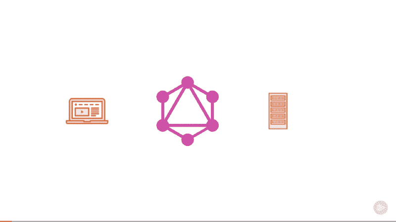
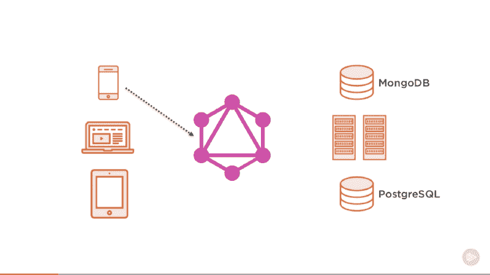

# REST APIs 是安息 API。GraphQL 万岁。

> 原文：<https://www.freecodecamp.org/news/rest-apis-are-rest-in-peace-apis-long-live-graphql-d412e559d8e4/>

> **更新:**这篇文章现在是我的“GraphQL 完整介绍”的一部分。

> 在[](https://jscomplete.com/g/rest-in-peace-apis)**阅读此内容的更新版本和关于 GraphQL 的更多信息。**

**在与 REST APIs 打交道多年之后，当我第一次了解 GraphQL 及其试图解决的问题时，我忍不住发了一篇文章的确切标题。**

**当然，在那时，这只是我的一次搞笑尝试，但是今天我相信这个有趣的预言真的发生了。**

**请不要把这个解读错了。我不打算指责 GraphQL“扼杀”REST 或类似的东西。REST 可能永远不会消亡，就像 XML 永远不会消亡一样。我只是认为 GraphQL 将会像 JSON 对 XML 所做的那样做。**

**这篇文章实际上并不是 100%支持 GraphQL。关于 GraphQL 灵活性的成本，有一个非常重要的部分。灵活性越大，成本越高。**

**我是“总是从为什么开始”的忠实粉丝，所以让我们开始吧。**

### **总之:为什么选择 GraphQL？**

**GraphQL 完美地解决了 3 个最重要的问题:**

*   ****需要多次往返以获取视图所需的数据**:使用 GraphQL，您总是可以通过与服务器的*单次*往返来获取视图所需的所有初始数据。为了用 REST API 做同样的事情，我们需要引入难以管理和扩展的非结构化参数和条件。**
*   ****客户端对服务器的依赖**:使用 GraphQL，客户端使用一种请求语言:1)无需服务器硬编码数据的形状或大小，2)将客户端与服务器分离。这意味着我们可以独立于服务器来维护和改进客户端。**
*   ****糟糕的前端开发者体验**:有了 GraphQL，开发者用声明性语言来表达他们用户界面的数据需求。他们表达*他们需要什么*，而不是*如何*提供。UI 需要哪些数据与开发人员在 GraphQL 中表达这些数据的方式之间有着紧密的联系。**

**本文将详细解释 GraphQL 如何解决所有这些问题。**

**在我们开始之前，对于那些还不熟悉 GraphQL 的人，让我们从简单的定义开始。**

### **GraphQL 是什么？**

**GraphQL 是一种*语言*。如果我们将 GraphQL 教授给一个软件应用程序，该应用程序将能够以声明的方式*将任何数据需求传达给一个也使用 GraphQL 的后端数据服务。***

> ***就像一个孩子可以很快学会一门新语言——而一个成年人将很难学会它——使用 GraphQL 从头开始一个新的应用程序将比将 GraphQL 引入一个成熟的应用程序容易得多。***

***为了教会数据服务使用 GraphQL，我们需要实现一个*运行时*层，并将其暴露给想要与服务通信的客户端。可以将服务器端的这一层简单地看作是 GraphQL 语言的翻译器，或者是代表数据服务的 GraphQL 代理。GraphQL 不是一个存储引擎，所以它本身不能成为一个解决方案。这就是为什么我们不能有一个只说 GraphQL 的服务器，而是需要实现一个翻译运行时。***

***这一层可以用任何语言编写，它定义了一个通用的基于图形的模式来发布它所代表的数据服务的*功能*。使用 GraphQL 的客户端应用程序可以在其能力范围内查询该模式。这种方法将客户机和服务器分离，允许它们独立发展和扩展。***

***GraphQL 请求可以是一个**查询**(读操作)或一个**变异**(写操作)。对于这两种情况，请求都是一个简单的字符串，GraphQL 服务可以解释、执行和解析指定格式的数据。通常用于移动和网络应用的流行响应格式是 *JSON* 。***

### ***GraphQL 是什么？(解释一下我是谁的版本)***

***GraphQL 完全是关于数据通信的。您有一个客户端和一个服务器，它们都需要相互通信。客户机需要告诉服务器它需要什么数据，而服务器需要用实际数据来满足客户机的数据需求。GraphQL 介入了这种交流。***

***

Screenshot captured from my Pluralsight course — Building Scalable APIs with GraphQL*** 

***你可能会问，为什么客户机不能直接与服务器通信呢？当然可以。***

***考虑在客户机和服务器之间使用 GraphQL 层有几个原因。其中一个原因，也许是最受欢迎的一个，是效率。客户端通常需要向服务器询问*多个*资源，服务器通常明白如何用单个资源回复。因此，客户机最终需要多次往返服务器以收集它需要的所有数据。***

***有了 GraphQL，我们基本上可以将这种多请求的复杂性转移到服务器端，让 GraphQL 层来处理。客户端向 GraphQL 层提出一个问题，并得到一个完全符合客户端需求的响应。***

***使用 GraphQL 层有很多好处。例如，另一个很大的好处是与多个服务通信。当多个客户端从多个服务请求数据时，中间的 GraphQL 层可以简化和标准化这种通信。尽管这并不是反对 REST APIss 的真正原因——因为在 REST API 中很容易做到这一点——但 GraphQL 运行时提供了一种结构化和标准化的方法来实现这一点。***

***

Screenshot captured from my Pluralsight course — Building Scalable APIs with GraphQL*** 

***我们可以让客户端与 GraphQL 层进行通信，而不是让客户端直接访问两个不同的数据服务(在上面的幻灯片中)。然后，GraphQL 层将与两个不同的数据服务进行通信。这就是 GraphQL 如何首先隔离需要用多种语言进行通信的客户端，并使用不同的语言将单个请求翻译成对多个服务的多个请求。***

> ***想象一下，你有三个人，他们说三种不同的语言，拥有不同类型的知识。然后想象你有一个问题，只有把三个人的知识结合在一起才能回答。如果你有一个会说这三种语言的翻译，回答你的问题就变得容易了。这正是 GraphQL 运行时所做的。***

***计算机还不够聪明，不能回答任何问题(至少现在还不能)，所以它们必须遵循某种算法。这就是为什么我们需要在 GraphQL 运行时定义一个模式，并且这个模式被客户端使用。***

***该模式基本上是一个功能文档，其中列出了客户端可以向 GraphQL 层提出的所有问题。在如何使用模式方面有一些灵活性，因为我们在这里讨论的是节点图。该模式主要表示 GraphQL 层所能回答的限制。***

***还不清楚？让我们简单地称 GraphQL 为 REST APIs 的替代品。让我来回答你现在最有可能问的问题。***

### ***REST APIs 有什么问题？***

***REST APIs 的最大问题是多端点的性质。这些要求客户端进行多次往返以获取数据。***

***REST APIs 通常是端点的集合，其中每个端点代表一种资源。因此，当一个客户机需要来自多个资源的数据时，它需要多次往返于 REST API 来组合它需要的数据。***

***在 REST API 中，没有客户端请求语言。客户端无法控制服务器将返回什么数据。没有语言可以让他们这样做。更准确地说，可供客户使用的语言非常有限。***

***例如， *READ* REST API 端点是:***

*   ***GET `/ResourceName` -从该资源中获取所有记录的列表，或者***
*   ***GET `/ResourceName/ResourceID` -获取由该 ID 标识的单个记录。***

***例如，客户端不能指定为该资源中的记录选择哪些*字段*。该信息在 REST API 服务本身中，REST API 服务将总是返回所有字段，而不管客户端实际需要哪些字段。GraphQL 对这个问题的术语是*抓取*不需要的信息。对于客户端和服务器来说，这是对网络和内存资源的浪费。***

***REST APIs 的另一个大问题是版本控制。如果您需要支持多个版本，这通常意味着新的端点。这在使用和维护这些端点时会导致更多的问题，并且可能是服务器上代码重复的原因。***

***上面提到的 REST APIs 问题是 GraphQL 试图解决的特定问题。它们当然不是 REST API 的全部问题，我也不想深入讨论 REST API 是什么，不是什么。我主要谈论的是流行的基于资源的 HTTP 端点 API。这些 API 中的每一个最终都变成了一个混合体，具有常规的 REST 端点+出于性能原因而定制的专用端点。这就是 GraphQL 提供更好的选择的地方。***

### ***GraphQL 是如何施展魔力的？***

***GraphQL 背后有许多概念和设计决策，但可能最重要的是:***

*   ***GraphQL 模式是一种强类型模式。为了创建一个 GraphQL 模式，我们定义了具有*类型*的*字段*。这些类型可以是基本的，也可以是自定义的，模式中的其他所有内容都需要类型。这个富类型系统允许丰富的特性，比如拥有一个自省的 API，并且能够为客户机和服务器构建强大的工具。***
*   ***GraphQL 以图形的形式与数据对话，数据自然也是图形。如果需要表示任何数据，正确的结构是图。GraphQL 运行时允许我们用与数据的自然图形形状相匹配的图形 API 来表示我们的数据。***
*   ***GraphQL 具有表达数据需求的声明性。GraphQL 为客户提供了一种声明性语言来表达他们的数据需求。这种声明性质创建了一个关于使用 GraphQL 语言的心理模型，这种模型接近于我们用英语思考数据需求的方式，并且它使得使用 GraphQL API 比其他方法容易得多。***

***最后一个概念是为什么我个人认为 GraphQL 是一个游戏改变者。***

***那些都是高层次的概念。让我们进入一些更多的细节。***

***为了解决多次往返的问题，GraphQL 让响应服务器只是一个端点。基本上，GraphQL 将定制端点的思想发挥到了极致，它将整个服务器变成了一个可以回答所有数据问题的定制端点。***

***与这个单一端点概念相伴随的另一个重要概念是与自定义单一端点一起工作所需的富客户端请求语言。如果没有客户端请求语言，单个端点是没有用的。它需要一种语言来处理定制请求，并用数据来响应定制请求。***

***拥有客户端请求语言意味着客户端将处于控制之中。他们可以确切地询问他们需要什么，服务器将准确地回答他们所要求的。这解决了过度提取的问题。***

***谈到版本控制，GraphQL 对此有一个有趣的理解。可以完全避免版本控制。基本上，我们可以只添加新的*字段*而不删除旧的字段，因为我们有一个图，并且我们可以通过添加更多节点来灵活地扩展该图。因此，我们可以在图上为旧的 API 留下路径，并引入新的 API，而不会将它们标记为新版本。API 只是增长。***

***这对于移动客户端尤其重要，因为我们无法控制他们使用的 API 版本。一旦安装，移动应用程序可能会继续使用相同的旧版本的 API 数年。在网络上，很容易控制 API 的版本，因为我们只是推送新代码。对于移动应用程序来说，这要难得多。***

***还没有完全被说服？我们用一个实际的例子对 GraphQL 和 REST 做一个一对一的比较怎么样？***

### ***RESTful APIs 与 GraphQL APIs 示例***

***让我们想象一下，我们是负责构建一个闪亮的新用户界面来代表《星球大战》电影和角色的开发人员。***

***我们负责构建的第一个 UI 很简单:一个显示单个《星球大战》人物信息的视图。比如达斯·维德，以及这个人出演的所有电影。这个视图应该显示这个人的姓名、出生年份、星球名称以及他们出现的所有电影的名称。***

***听起来很简单，我们实际上在处理 3 种不同的资源:人、星球和电影。这些资源之间的关系很简单，任何人都可以猜出这里数据的形状。一个人对象属于一个行星对象，它将有一个或多个电影对象。***

***这个 UI 的 JSON 数据可能是这样的:***

```
*`{
   "data":{
      "person":{
         "name":"Darth Vader",
         "birthYear":"41.9BBY",
         "planet":{
            "name":"Tatooine"
         },
         "films":[
            {
               "title":"A New Hope"
            },
            {
               "title":"The Empire Strikes Back"
            },
            {
               "title":"Return of the Jedi"
            },
            {
               "title":"Revenge of the Sith"
            }
         ]
      }
   }
}`*
```

***假设数据服务为我们提供了这种精确的数据结构，下面是用 React.js 表示其视图的一种可能方式:***

```
*`// The Container Component:<PersonProfile person={data.person} ></PersonProfile>`*
```

```
*`// The PersonProfile Component:Name: {person.name}Birth Year: {person.birthYear}Planet: {person.planet.name}Films: {person.films.map(film => film.title)}`*
```

***这是一个简单的例子，虽然我们在《星球大战》中的经验可能对我们有所帮助，但是用户界面和数据之间的关系非常清楚。UI 使用了我们想象的 JSON 数据对象中的所有“键”。***

***现在让我们看看如何使用 RESTful API 请求这些数据。***

***我们需要一个人的信息，假设我们知道这个人的 ID，RESTful API 会将该信息公开为:***

```
*`GET - /people/{id}`*
```

***这个请求将为我们提供这个人的姓名、出生年份和其他信息。一个好的 RESTful API 还会给我们这个人所在星球的 ID，以及这个人出演的所有电影的 ID 数组。***

***对此请求的 JSON 响应可能类似于:***

```
*`{  "name": "Darth Vader",  "birthYear": "41.9BBY",  "planetId": 1  "filmIds": [1, 2, 3, 6],  *** other information we do not need ***}`*
```

***然后为了读出行星的名字，我们问:***

```
*`GET - /planets/1`*
```

***为了阅读电影的片名，我们会问:***

```
*`GET - /films/1GET - /films/2GET - /films/3GET - /films/6`*
```

***一旦我们从服务器获得了所有 6 个响应，我们就可以组合它们来满足我们的视图所需的数据。***

***除了我们必须做 6 次往返以满足简单 UI 的简单数据需求之外，我们这里的方法也是必不可少的。我们给了*如何*获取数据和*如何*处理数据使其为视图做好准备的指令。***

***如果你想明白我的意思，你可以自己试试。《星球大战》数据有一个 RESTful API，目前托管在 http://swapi.co/。继续尝试在那里构造我们的数据人对象。这些键可能有一点不同，但是 API 端点是相同的。您将需要进行 6 次 API 调用。此外，您必须获取视图不需要的信息。***

***当然，这只是这个数据的 RESTful API 的一个实现。可能会有更好的实现使这个视图更容易实现。例如，如果 API 服务器实现了嵌套资源，并且理解了一个人和一部电影之间的关系，那么我们可以用以下方式读取电影数据:***

```
*`GET - /people/{id}/films`*
```

***然而，一个纯 RESTful API 服务器很可能不会实现这一点，我们需要让我们的后端工程师为我们创建这个自定义端点。这就是扩展 RESTful API 的现实——我们只是添加自定义端点来有效满足不断增长的客户需求。管理这样的自定义端点很难。***

***现在让我们看看 GraphQL 方法。服务器上的 GraphQL 包含了自定义端点的思想，并将其发挥到了极致。服务器将只是一个端点，通道并不重要。如果我们通过 HTTP 来做这件事，HTTP 方法当然也没关系。让我们假设我们在`/graphql`有一个通过 HTTP 暴露的 GraphQL 端点。***

***因为我们想在一次往返中请求我们需要的数据，所以我们需要一种方式来表达我们对服务器的完整数据需求。我们通过一个 GraphQL 查询来实现这一点:***

```
*`GET or POST - /graphql?query={...}`*
```

***GraphQL 查询只是一个字符串，但是它必须包含我们需要的所有数据。这就是声明性力量的来源。***

***在英语中，我们是这样声明我们的数据需求的:*我们需要一个人的姓名、出生年份、星球名称以及他们所有电影的片名*。在 GraphQL 中，这转化为:***

```
*`{  person(ID: ...) {    name,    birthYear,    planet {      name    },    films {      title    }  }}`*
```

***再次阅读用英语表达的需求，并将其与 GraphQL 查询进行比较。已经尽可能接近了。现在，将这个 GraphQL 查询与我们开始时使用的原始 JSON 数据进行比较。GraphQL 查询是 JSON 数据的精确结构，除了没有所有的“值”部分。如果我们从问答关系的角度来考虑这个问题，问题就是没有答案部分的答案陈述。***

***如果答案陈述是:***

> ***离太阳最近的行星是水星。***

***这个问题的一个很好的表述是没有答案部分的相同陈述:***

> ****(什么是)离太阳最近的行星？****

***同样的关系也适用于 GraphQL 查询。以一个 JSON 响应为例，删除所有“答案”部分(即值)，最终得到一个非常适合表示关于该 JSON 响应的问题的 GraphQL 查询。***

***现在，将 GraphQL 查询与我们为数据定义的声明性 React UI 进行比较。GraphQL 查询中的一切都在 UI 中使用，UI 中使用的一切都出现在 GraphQL 查询中。***

***这是 GraphQL 的伟大心智模型。UI 知道它需要的确切数据，提取需求相当容易。提出 GraphQL 查询只是直接从 UI 中提取变量的任务。***

***如果我们倒转这个模型，它仍然保持能量。如果我们有一个 GraphQL 查询，我们确切地知道如何在 UI 中使用它的响应，因为查询将与响应具有相同的“结构”。我们不需要检查响应来知道如何使用它，也不需要任何关于 API 的文档。都是内置的。***

***星球大战数据公司在 https://github.com/graphql/swapi-graphql 有一个 GraphQL API。继续尝试在那里构造我们的数据人对象。有一些小的区别，我们将在后面解释，但这里有一个正式的查询，您可以使用这个 API 来读取我们对视图的数据要求(以达斯·维德为例):***

```
*`{  person(personID: 4) {    name,    birthYear,    homeworld {      name    },    filmConnection {      films {        title      }    }  }}`*
```

***这个请求给了我们一个非常接近我们的视图所使用的响应结构，请记住，我们是在一次往返中获得所有这些数据的。***

### ***GraphQL 灵活性的成本***

***完美的解决方案是童话。有了 GraphQL 引入的灵活性，一些明显的问题和顾虑就迎刃而解了。***

***GraphQL 简化的一个重要威胁是资源耗尽攻击(又名拒绝服务攻击)。GraphQL 服务器可能会受到非常复杂的查询的攻击，这些查询会消耗服务器的所有资源。深度嵌套关系的查询(用户->好友->好友…)，或者使用字段别名多次查询同一个字段，非常简单。资源耗尽攻击并不是 GraphQL 特有的，但是在使用 GraphQL 时，我们必须格外小心。***

***这里我们可以做一些缓解措施。我们可以提前对查询进行成本分析，并对可以使用的数据量进行某种限制。我们还可以实现一个超时来终止需要很长时间才能解决的请求。此外，由于 GraphQL 只是一个解析层，我们可以在 GraphQL 下的较低级别处理速率限制实施。***

***如果我们试图保护的 GraphQL API 端点不是公共的，而是供我们自己的客户端(web 或移动)内部使用，我们可以使用白名单方法，并预先批准服务器可以执行的查询。客户端可以只要求服务器使用查询唯一标识符来执行预先批准的查询。脸书似乎正在使用这种方法。***

***身份验证和授权是我们在使用 GraphQL 时需要考虑的其他问题。我们是在 GraphQL 解析过程之前、之后还是过程中处理它们？***

***要回答这个问题，请将 GraphQL 想象成一种 DSL(领域特定语言),它位于您自己的后端数据获取逻辑之上。它只是我们可以放在客户端和实际数据服务(或多个服务)之间的一个层。***

***将身份验证和授权视为另一层。GraphQL 不会帮助验证或授权逻辑的实际实现。不是为了那个。但是如果我们想把这些层放在 GraphQL 后面，我们可以使用 GraphQL 在客户端和执行逻辑之间传递访问令牌。这与我们使用 RESTful APIs 进行身份验证和授权的方式非常相似。***

***GraphQL 让另一项任务变得更具挑战性，那就是客户端数据缓存。RESTful APIs 更容易缓存，因为它们具有字典的性质。这个位置给出了数据。我们可以使用位置本身作为缓存键。***

***使用 GraphQL，我们可以采用类似的基本方法，并将查询文本用作缓存其响应的键。但是这种方法有局限性，效率不高，并且会导致数据一致性问题。多个 GraphQL 查询的结果很容易重叠，这种基本的缓存方法无法解决重叠问题。***

***不过，这个问题有一个绝妙的解决方案。图形查询意味着一个*图形缓存*。如果我们将 GraphQL 查询响应规范化为记录的平面集合，给每个记录一个全局惟一 ID，我们可以缓存这些记录，而不是缓存完整的响应。***

***然而这并不是一个简单的过程。将会有引用其他记录的记录，我们将在那里管理一个循环图。填充和读取缓存将需要查询遍历。我们需要编写一个层来处理缓存逻辑。但是这种方法总的来说要比基于响应的缓存有效得多。Relay.js 是一个采用这种缓存策略并在内部自动管理它的框架。***

***对于 GraphQL，我们应该关心的最重要的问题可能是通常被称为 N+1 SQL 查询的问题。GraphQL 查询字段被设计为独立的函数，使用数据库中的数据解析这些字段可能会导致每个已解析字段都有一个新的数据库请求。***

***对于一个简单的 RESTful API 端点逻辑，通过增强构造的 SQL 查询，很容易分析、检测和解决 N+1 问题。对于 GraphQL 动态解析的字段，就没那么简单了。幸运的是，脸书正在为这个问题开创一个可能的解决方案:[数据加载器](https://github.com/facebook/dataloader)。***

***顾名思义，DataLoader 是一个可以用来从数据库中读取数据并将其提供给 GraphQL 解析器函数的实用程序。我们可以使用 DataLoader，而不是用 SQL 查询直接从数据库读取数据，DataLoader 将作为我们的代理来减少我们发送到数据库的实际 SQL 查询。***

***DataLoader 结合使用批处理和缓存来实现这一点。如果同一个客户端请求导致需要向数据库询问多个问题，可以使用 DataLoader 合并这些问题，并从数据库中批量加载它们的答案。DataLoader 还将缓存答案，并使它们可用于关于相同资源的后续问题。***

***感谢阅读。***

***学习 React 还是 Node？签出我的图书:***

*   ***[通过构建游戏学习 react . js](http://amzn.to/2peYJZj)***
*   ***[Node.js 超越基础](http://amzn.to/2FYfYru)***