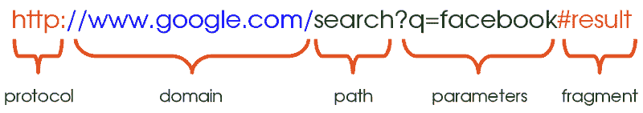
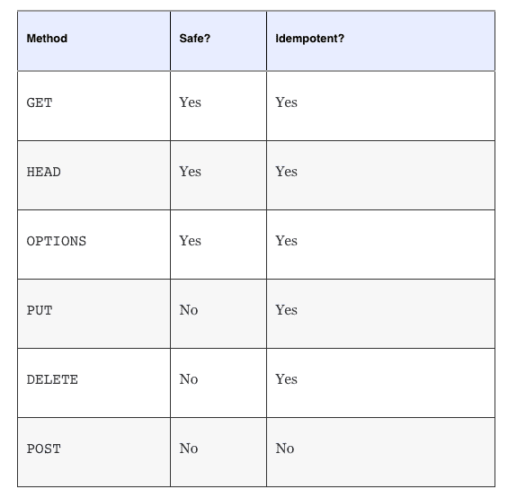

# RESTful 服务第一部分:HTTP 概述

> 原文：<https://www.freecodecamp.org/news/restful-services-part-i-http-in-a-nutshell-aab3bfedd131/>

由 sanchitgear

# RESTful 服务第一部分:HTTP 概述

从一开始，网络就围绕着资源的概念而构建。在早期，web 仅仅是一个共享简单的基于文本/HTML 的文件、文档、图像等的平台。从这个意义上来说，网络可以被认为是资源的集合，通常被认为是面向资源的。

从那以后，网络已经发展成为一个更加复杂的互联应用网络，充斥着丰富的内容。应用程序本身也变得越来越复杂，包含了越来越多的功能。

服务提供了一种向客户端公开该功能的方式。通常，大型应用程序可能希望向其他开发人员提供对其平台的编程访问，并且可能通过利用服务来实现这一点。

或者，服务可用于将应用程序分解成不同的逻辑单元，它们之间相互作用以产生某种最终结果。在这种情况下，服务充当其他服务的消费者。

随着服务成为 web 应用程序的关键组成部分，开发人员自然会尝试并确保它们的设计方式是可伸缩的、高性能的，并尽可能减少技术和其他方面的开销。

进入休息！REST 是表述性状态转移的缩写，是一种架构风格，旨在利用过去几十年来允许 Web 发展的所有相同结构。它将这些作为设计 web 服务的指导原则。

由于 Web 上的所有通信都是通过 HTTP 进行的，REST 与它紧密相关，并且使用了许多相同的思想。因此，理解 REST 需要理解 HTTP 的基本概念。这是这篇文章剩余部分的主题。:)

### 简单来说就是 HTTP

大多数 web 应用程序都是围绕客户机-服务器模型构建的。客户端可以是显示普通 HTML 的 web 浏览器、获取和创建数据的移动应用程序，甚至是其他 web 服务。

类似地，服务器可以用多种方式实现，使用不同的技术栈、语言，并提供不同类型的数据。

为了适应这种多样性，客户机和服务器必须就一组约定——*协议—* 达成一致，该协议规定了它们之间的所有通信。该协议允许 web 服务器接收由任意客户端发送的信息— *请求—* ，对它们进行处理，并做出适当的响应。

现代 web 应用程序使用超文本传输协议，通常缩写为 HTTP **、**来交换信息。

本质上，这为网络上的信息交换提供了一种结构化的格式。正如我们将看到的，HTTP 制定了一套广泛的准则来描述被交换的数据的类型——以及它的格式、有效性和其他属性。

过去，应用程序通常只依赖 HTTP 作为传输机制。客户端和服务器使用 HTTP 交换数据*。然后必须开发其他约定来理解这些数据。这种范例的一个例子是 SOAP，它是 REST 最常见的反对者之一。*

然而，HTTP 的奇妙之处在于，它已经有了指定动作和被动作的资源所需的结构(*客户机请求*，以及这些动作的结果(*服务器响应)*，这防止了传输信息的额外开销。让我们来看看其中的一些吧！

#### 1.资源定位符

URL 是网络中最重要和最有用的概念之一。这也可能是大多数用户已经熟悉的概念，即使只是顺便提及。URL 是统一资源定位器的缩写，用于标识 Web 上资源的地址。

URL 通常由以下部分组成:

*协议* : 这是服务请求的协议。这通常只是 HTTP(或其安全版本，HTTPS)。存在其他协议，如 SMTP 和 FTP，也可以使用，但是在这里我们只讨论 HTTP。

*域* : 这是向其请求资源的服务器的主机名。该域可以等效地由 IP 地址代替，这通常由 DNS 在幕后完成。

*路径* : 这是资源在服务器上的位置。这可能对应于资源在文件系统中的位置(即/search/files/myFile.txt)，尽管这种做法现在很少使用。对于 web 服务来说，更常见的是基于资源(即我的博客/博客/评论)之间的关系来嵌套路径，其中*博客*和*评论*代表两种不同的资源。这将在本系列的第二部分[中进一步探讨。](https://medium.com/@sanchit.gera/restful-services-part-ii-constraints-and-goals-530b8f6298b9#.pk4tsd6oz)

*参数* :

**片段* : 片段指的是被返回的资源内的位置*，通常应用于文档。这可以被认为是返回的文档中的书签，并指示浏览器定位书签点处的内容并显示它。例如，对于 HTML 文档，浏览器直接滚动到由锚标识的元素。片段也被称为*锚。***

#### ***2。HTTP 方法***

*HTTP 定义了一些方法，也称为“动词”，客户端可以使用这些方法来描述请求的类型。在前面讨论的资源环境中，这一点最容易理解。*

*每个请求都可以被建模为对资源执行特定的操作。例如，客户端可以请求创建、删除、更新或简单地读取资源。在 HTTP 中，这分别对应于发出 POST、DELETE、PUT 或 GET 请求。POST 和 PUT 请求接受与正在创建或更新的数据相对应的有效负载。我们将在下一部分讨论 REST 时详细探讨这些方法。*

*另外两个不常用的方法是 OPTIONS 和 HEAD 方法。*

*简单地说，OPTIONS 请求的目的是向客户端提供关于可以使用哪些其他方法来与所讨论的资源进行交互的信息。*

*另一方面，HEAD 请求更有用一些。HEAD 请求类似于 GET 请求，只是它省略了响应的主体。从本质上讲，客户机收到的响应与 GET 请求收到的响应相同，具有相同的元数据，但没有响应体。这很有用，因为它提供了一种快速检查响应头和资源是否存在的方法。*

*HTTP 规定的一个重要区别是一个方法是**安全的**还是**不安全的。**如果一个方法不修改资源，那么它就是安全的。换句话说，请求可以被认为是“只读的”例如，从服务器发出 GET(或 HEAD)资源请求不应该以任何方式修改它。默认情况下，所有其他方法都是不安全的。*

*最后，还有一个幂等的概念。如果一个请求的重复调用导致相同的结果，那么这个 HTTP 方法就是等幂的。只要请求的参数保持不变，请求可以被发出任意次，并且资源将仍然保持相同的状态，就好像请求只被发出一次一样。这非常符合资源导向思维的概念。*

*GET、OPTIONS 和 HEAD 都是自然幂等方法，因为它们是只读操作。此外，PUT 和 DELETE 方法也被描述为幂等的。这是因为用同一组参数反复更新任何资源都会导致相同的最终结果。*

*对于一些人来说，理解为什么删除也是幂等的可能有点不直观。考虑当多个删除请求同时发出时，系统会发生什么情况。第一个删除请求导致资源的删除。此时发出更多的删除请求不会修改系统的状态。系统继续保持第一次执行删除后的状态。*

*总结一下…*

**

#### ***3。状态代码***

*状态代码是一种有用的 HTTP 构造，它向使用者提供了关于请求结果以及如何解释请求的信息。例如，如果我请求从 web 服务器检索一个文件，我希望看到一个响应，其中包含描述我的请求是否成功完成的状态代码。如果没有，状态代码会给我进一步的提示，告诉我为什么我的请求失败了。*

*HTTP 定义了几个状态代码，每个都与特定的场景相关。下面列出了您可能会遇到的一些常见代码系列:*

***2xx:**2xx 系列中的状态代码表示请求成功完成，没有错误。代码 200 是典型的例子。*

***3xx:**3xx 系列中的代码暗示重定向。这意味着服务器在收到请求时重定向到另一个位置。*

***4xx:**4xx 错误，即 400、403、404 等。当请求中有错误时使用。这可能是由多种原因造成的，例如对资源的未授权访问、试图使用实际上不存在的资源、无效参数等等。*

***5xx:** 最后，当服务器端出现错误时，使用 5xx 响应。这意味着服务器知道这个错误，并且不能处理这个请求。通常，响应会附带一个简短的错误原因描述。*

#### ***4。HTTP 报头***

*报头是 HTTP 通信的重要组成部分。它们为处理请求和响应提供额外的信息。请注意，标头与正在被操作的资源的标识无关。它们通常以键值对的形式出现，并提供大量信息，如响应的缓存策略、客户端强制执行的可接受的响应类型、响应的首选语言、编码等。*

*身份验证和授权的凭证(如访问令牌)也通常使用 *Authorization* 头来传递。*

*类似地，服务器也可以利用响应头在客户机上设置 cookies，并用相同的机制类似地检索它们。*

*

Headers for a GET request made to *medium.com/bookmarks** 

***关于 HTTPS *:*** 为了避免混淆，了解什么是 HTTPS 以及它与常规 HTTP 有何不同也很重要。HTTP 和 HTTPS 都使用相同的底层机制来传输信息，尽管 HTTPS 要安全得多。通过 HTTPS 传输的数据是完全加密的。当所讨论的信息是机密时，例如财务数据或用户的个人信息，这是一个重要的考虑因素。*

*在本文的下一部分，我将讨论 REST 在 HTTP 之上设置的约束，以及它如何利用 web 基于资源的特性来设计简单且可伸缩的 Web 服务。在这里找到它！*

*最后，在本系列的第三和最后一部分，您将了解 Richardson 成熟度模型，这是一种量化衡量服务是否 RESTful 的方法。[来看看](https://medium.com/@sanchit.gera/restful-services-part-iii-hateoas-and-the-richardson-maturity-model-48d4e4c79b8d#.a8x1sscv5)！:-)*

**其他推荐阅读:**

*   *[Mozilla 开发者网络— HTTP](https://developer.mozilla.org/en-US/docs/Web/HTTP)*
*   *[Mozilla 开发者网络—网址](https://developer.mozilla.org/en-US/Learn/Common_questions/What_is_a_URL)*
*   *[HTTP —权威指南](https://www.amazon.ca/HTTP-Definitive-Guide-David-Gourley/dp/1565925092/ref=sr_1_1?ie=UTF8&qid=1468209162&sr=8-1&keywords=http+the+definitive+guide)*
*   *[TutsPlus](http://code.tutsplus.com/tutorials/http-the-protocol-every-web-developer-must-know-part-1--net-31177)*