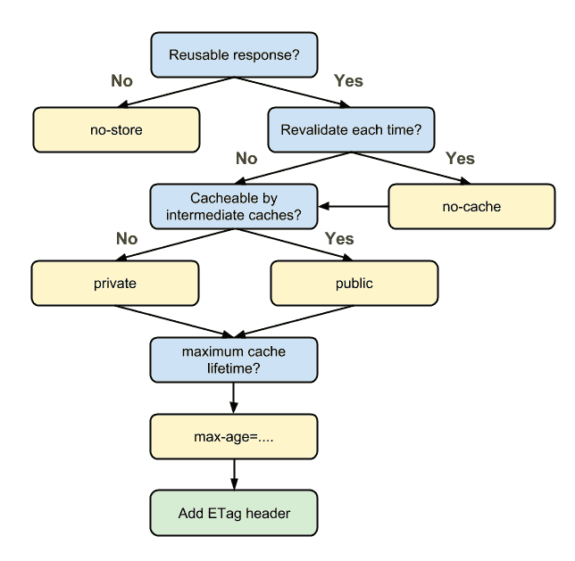
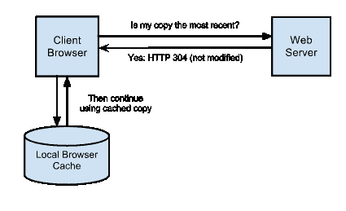

# RESTful 服务第二部分:约束和目标

> 原文：<https://www.freecodecamp.org/news/restful-services-part-ii-constraints-and-goals-530b8f6298b9/>

由 sanchitgear


[Photo credit](http://imgur.com/7Wq6IAg)

# RESTful 服务第二部分:约束和目标

在本系列的第一部分中，我写了 HTTP 及其应用于 web 服务设计的结构。

HTTP 只是编写现代 web 服务的一小部分。

这篇文章是关于你如何*应用*这些构造来创建可维护的、健壮的服务。

### 定义休息

REST 代表 **RE** 表象 **S** 状态 **T** 转移。这是一种*建筑风格。这意味着 REST 没有强加一个正式的标准来决定一个 web 服务是否是 RESTful 的。相反，它有一套宽泛的约束，每个约束都有一个明确的目标。*

这些约束首先由 Roy Fielding 提出，他是 2000 年 HTTP 规范的合著者之一。

### 现场约束

Fielding 创建这些约束的最终目标是使应用程序更快、更可靠、更易于扩展。

作为一名 web 服务设计者，您的服务应该尽可能地遵守这些约束，以便从中获益。所以让我们深入探讨一下。

#### 约束#1:客户端-服务器架构

REST 提出的第一个约束是服务器与客户机的分离。您应该尽可能地鼓励服务器和客户机之间的关注点分离。你的目标应该是将两者之间的分工最大化，重叠最小化。

服务器，或称*后端，*通常负责存储应用程序的持久数据，以及与之交互所需的所有业务逻辑。这可能包括用户身份验证、授权、数据验证等等。

客户端或前端负责向服务发出请求，然后对收到的响应做一些有意义的事情。

客户端本身可能是一个 web 服务，在这种情况下，它只是使用数据。或者，它可以是面向用户的。这方面的一个例子是 web 或移动应用程序。在这里，它还负责将数据呈现给用户，并为用户提供一个与数据交互的 T2 界面。

您应该能够将这两个组件中的每一个都视为一个相对于彼此的[黑盒](https://en.wikipedia.org/wiki/Black_box)。这样，它们可以被独立地修改。这鼓励了应用程序内的模块化。

这个概念不是 RESTFul 应用程序，甚至不是 web 应用程序所独有的。无论如何，大多数开发人员都试图将他们的项目分解成独立的部分。但是通过将这一点作为 RESTful 设计的显式约束，Fielding 进一步鼓励了这种实践。

最后，减少服务器负责的事情的数量也减少了必要的逻辑数量。这反过来允许更好的可伸缩性和更高的性能。

#### 约束#2:无国籍状态

REST 提出的下一个重要约束是无国籍性。

概括地说，无状态服务的主要目标是使传入的请求自给自足，并完全隔离地执行它们。

每个请求必须包含服务器正确处理和响应请求所需的所有信息。换句话说，服务器不需要使用以前请求的信息。因此，维护客户端应用程序状态的责任就交给了客户端本身。

为了理解这一点，考虑一个非常简单的负责响应用户搜索查询的 web 服务。被搜索的实体的确切表示是不相关的。重要的是，服务器不再一次返回数百个搜索结果，而是采用*分页*:从任意大的结果集中一次只返回 10 个结果。

在传统的“有状态”开发模型中，服务器可能被设计成跟踪所有的客户机以及它们已经访问过的所有页面。

因此，当请求新页面时，服务器能够在其系统中查找客户机，并确定它收到的最新页面。

然后，服务器可以继续用下一个页面的*进行响应，并更新其系统以反映这一点。随着客户端继续在结果集中导航，这种情况会继续下去。*

在另一种无状态方法中，维护其状态的责任被分散并转移到客户端。然后，客户端必须指定他们想要的结果的实际页码，而不是要求下一页。例如:

```
GET http://my-awesome-web-service.com/pages/1GET http://my-awesome-web-service.com/pages/3
```

无状态方法带来了几个主要优点。首先，随着客户机数量的增加，跟踪客户机状态对服务器来说变得越来越繁重。

其次，也是更重要的一点，无状态服务也很容易分发。如果一个服务器负责维护一个应用程序的状态信息，那么将来的请求被路由到*存储*这个信息的服务器也是必要的。

如果有数百个服务器负责处理传入的请求，那么必须有某种机制来确保来自特定客户机的请求总是最终到达特定的服务器实例。

如果某个服务器实例停止运行，存储在该服务器上的有关客户端状态的所有信息也会随之停止运行。

当然，您可以提出一种架构，其中服务器实例可以在它们之间共享数据。但是这增加了相当多的复杂性。

相比之下，无状态服务使得临时添加和删除服务器实例变得简单得多。然后，您可以根据需要进一步平衡它们之间的负载。

由于服务器对于传入的请求是不可知的，因此向上扩展只是向负载均衡器添加更多服务器的问题。类似地，有意或无意地关闭服务器不会影响服务的可靠性。

当然，这种简单是有代价的。让客户端为每个请求附加相同的数据是冗余的潜在来源。带宽不是免费的，所以任何额外的信息传输都会增加一些开销。

#### 约束#3:缓存

第三个约束是显式可缓存性。其思想是将服务返回的消息显式标记为可缓存或不可缓存。如果它们是可缓存的，服务器应该计算出响应有效的持续时间。

如果客户端可以访问给定请求的有效缓存响应，它会避免重复相同的请求。相反，它使用其缓存副本。这有助于减轻服务器的一些工作，从而有助于提高可伸缩性和性能。

这是一种形式的*乐观复制—* 也称为*惰性复制—* 在这种情况下，除非绝对关键，否则服务不会试图保证自身与其客户端之间的 100%一致性。相反，它做出这种牺牲来换取感知性能的提高。

例如，对应于博客平台的 API 可以选择使博客帖子列表可缓存几分钟，如果它知道人们试图**访问**帖子的频率远远超过新帖子被创建的频率。结果，用户可能偶尔会**得到陈旧的数据，但是系统作为一个整体表现得更好。**

当然，资源的可缓存性及其持续时间并不是通用的，需要考虑一些因素。如果你选择错误，这可能会让你的用户感到沮丧。

Web 服务通常使用标准的**缓存控制**头来实现可缓存性。有时它们与 HTTP 指定的其他头一起使用。

Cache-Control 标头实际上充当了一个开关，决定浏览器是否应该缓存相关的响应。

标记为*私有*的资源仅由客户端缓存，因此仅限于该客户端。

另一方面，标记为 *public、*的资源可以由服务和客户机之间的一个或多个中间代理缓存。

结果，这些资源可能被提供给多个用户。或者，可以传入参数 *no-cache* 并完全停止对资源的任何缓存。

下面是其中一个缓存控制头的样子:

```
Cache-Control: public;max-age=3431901
```

该标题还允许您指定资源有效的持续时间。这让客户端知道何时应该停止使用其缓存的副本并请求新的副本。

这背后的逻辑是:



[Image credit](https://developers.google.com/web/fundamentals/performance/optimizing-content-efficiency/http-caching?hl=en)

除此之外，HTTP 还有执行所谓的*条件请求的机制。*这里的目标是服务器仅在满足特定条件时将某些资源返回给客户端***。***

**

[Image credit](https://devcenter.heroku.com/articles/increasing-application-performance-with-http-cache-headers)** 

**假设客户端在其缓存中保存了资源的副本，它可以向服务器发出请求，以确定是否存在同一资源的更新副本。如果有，服务器返回新的副本。否则，它告诉客户端继续使用其本地副本。**

**这有助于防止数据在网络上的冗余传输，同时还确保客户端可以随时访问新数据。**

**HTTP 有几种方法可以让您实现这一点:**

#### ****缓存方法# 1:If-Modified-Since/Last-modify****

**随着服务器发回的每个响应，它可以选择附加一个最后修改的时间戳。这表示上次更改资源的时间。**

**当客户机将来需要再次请求资源时，它像平常一样向服务器发出请求，但是带有相关的 *If-Modified-Since* 头。这告诉服务器返回资源的新副本(如果存在的话)。**

**否则，服务器返回状态码 **304，**，其中指示客户端继续使用其已经拥有的副本。**

#### ****缓存方法#2: If-None-Match/ETag****

**除了识别资源的方式之外，这个方案的工作方式与前一个相似。服务器不使用时间戳，而是随每个响应发回一个唯一的散列，解释资源在该时间点的状态(称为 ETag)。**

**对于将来的请求，客户机将相关的 ETag 发送给服务器。如果存在具有相同 ETag 的资源，服务器会告诉客户端继续使用缓存的副本。否则，服务器向客户端发回一个新的。**

**缓存很复杂。随着您的服务开始添加更多的用户，您会希望了解更多关于缓存的知识，以及如何利用缓存来获得优势。**

#### **约束#4:统一接口**

***统一接口*(或*统一契约*)告诉一个RESTful 服务提供什么，以文档、图像、非虚拟对象等形式。**

**然而，REST 并没有规定*你选择如何*与这些资源交互，只要它们是一致的并且被很好地理解。**

**一般来说，在客户端可以与 RESTful 服务交互之前，需要就以下问题达成一致:**

1.  ****标识:**必须有一种方法来唯一地标识服务必须提供的每一种资源。**
2.  **操作:必须有一套标准的操作，可以在任何给定的资源上执行，并有可预测的结果。这些操作的结果也必须是自我描述的和唯一理解的。**

**例如，HTTP 利用 URL 来识别资源。它还使用了一些动作动词和记录良好的状态代码来促进与资源的交互。(关于 HTTP 构造的更深入的详细解释，您可以回过头来阅读本系列的第一部分。)**

**到目前为止，我们一直认为 RESTful 服务与 HTTP 紧密相关。对于 web 服务，这几乎总是准确的。**

**但是理论上，REST 可以在任何协议上实现，只要该协议提供了一种体面的方式来实现我上面描述的两个条件。出于这个原因，REST 有时也被称为 HTTP 上的 REST，以表明它是在 web 上使用的。**

#### **约束#5:分层系统**

**分层系统建立在我们前面讨论的客户机-服务器约束的基础上，并加强了关注点的分离。您的服务的整体架构可以分成单独的*层，*层分别服务于特定的功能。**

**更重要的是，每一层必须独立行动，并且只与紧邻的层相互作用。这迫使请求以可预测的方式传播，而不绕过层。**

**例如，为了扩展，您可以使用一个行为类似负载平衡器的代理。代理的唯一目的是将传入的请求转发到适当的服务器实例。**

**另一方面，客户不需要知道这种划分。它只是继续向同一个 URL 发出请求，而不关心请求是如何被处理的细节。**

**类似地，在体系结构中可能有另一层负责缓存响应，以便最小化服务器需要完成的工作。**

**另一层可能表现得像一个网关，将 HTTP 请求转换成其他协议。**

**使用它的一种方法是实现一个 FTP 服务器。客户机将继续向它认为是 HTTP 服务器的设备发出请求，而实际上是 FTP 服务器在幕后做这项工作。**

**就像客户机-服务器的区别一样，这种分层的系统约束最小化了服务中耦合功能的风险，但代价是系统的额外开销。**

### **结论**

**总而言之，我们已经看到了在设计 RESTful web 服务时应该记住的重要约束。我还想强调的是，尽管这些是技术上的硬性要求，服务必须满足这些要求才能被认为是 RESTful 的，但在实践中这并不总是发生。**

**构建真正的服务更多的是解决手头的问题，而不是满足技术定义。因此，这些约束通常被开发人员和架构师用作指导方针，然后他们决定在满足他们自己的特定目标的过程中遵循哪些规则。**

**这就是术语*部分 restful* 和*完全 restful 的来源。*事实上，你在网上遇到的大多数服务在技术上并不是完全 RESTful 的。**

**在本系列的下一部分，也是最后一部分，我将讨论 HATEOAS 的原则，以及 Richardson 成熟度模型。这提供了一种更加量化的方法来确定 web 服务到底有多 RESTful。在这里找到它！**

**我希望这是对构建 RESTful 应用程序的有用介绍。当您使用大量第三方 API 时，理解 REST 的原则肯定会对您有所帮助。甚至当你在网上、手机上或任何其他地方构建自己的应用程序时。**

**作为奖励，我还上传了一个与这个主题相关的演示文稿[到这里](http://www.slideshare.net/SanchitGera/impact-of-restful-web-architecture-on-performance-and-scalability)。幻灯片是从几个月前我在大学发表的题为“RESTful 架构对应用程序性能和可伸缩性的影响”的演讲中借来的希望你觉得有用:)**

**如果你有任何反馈，请在评论中告诉我，或者随时通过我的 LinkedIn 联系我。**

****这里有一些关于 REST 的进一步阅读资料:****

**[软件架构的关键原则— MSDN](https://msdn.microsoft.com/en-us/library/ee658124.aspx?f=255&MSPPError=-2147217396)**

**[休息讲解，演示文稿](http://www.slideshare.net/dnene/rest-representational-state-transfer-explained?from_action=save)**

**Restful Web 服务— Sam Ruby**

**[WhatIsRest.com](http://whatisrest.com)**

**[在练习中休息](https://www.amazon.com/REST-Practice-Hypermedia-Systems-Architecture/dp/0596805829)**