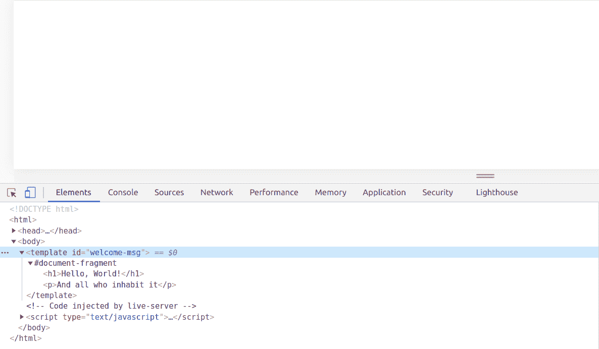
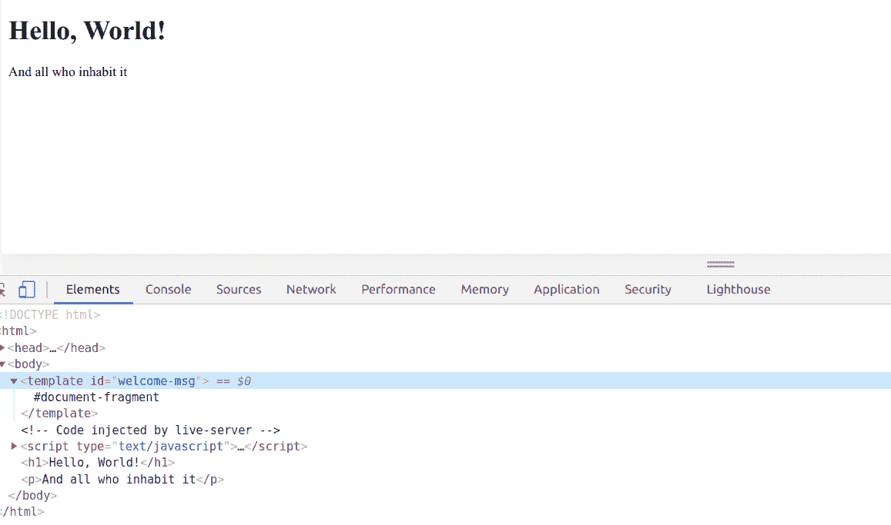
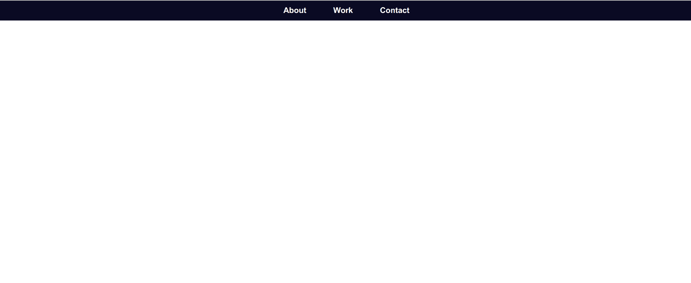
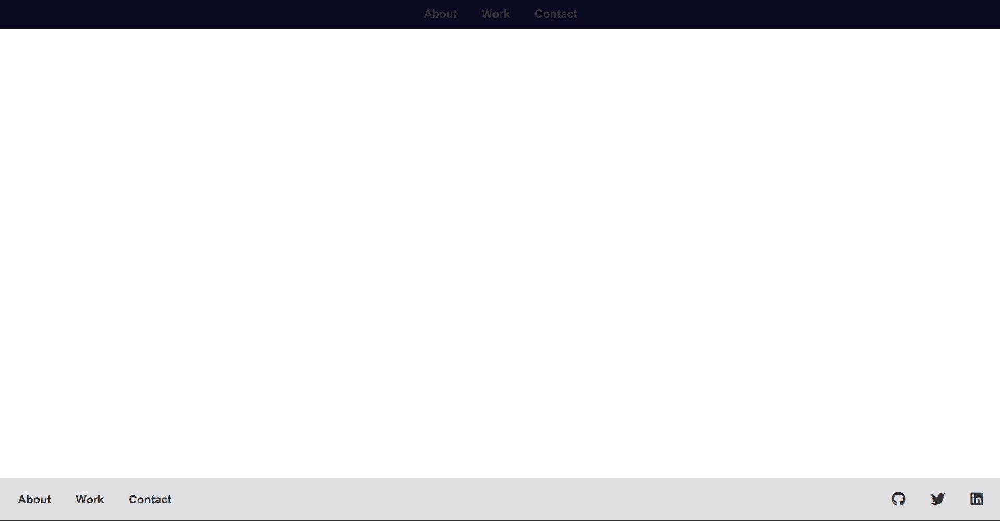
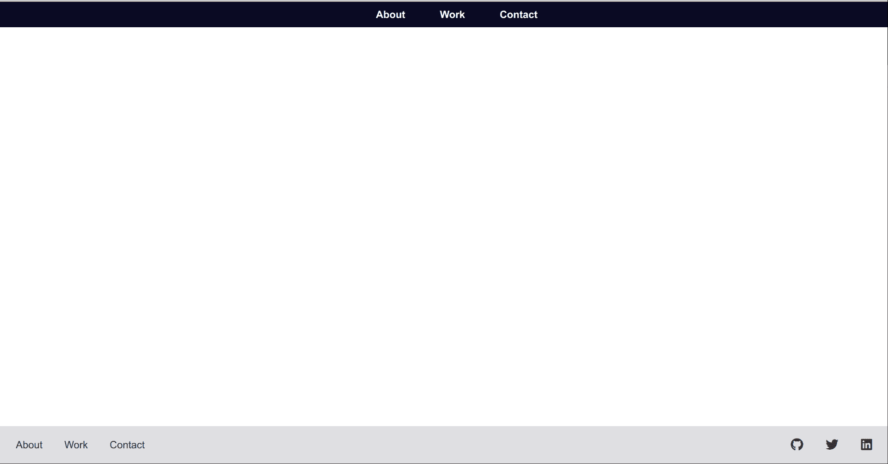
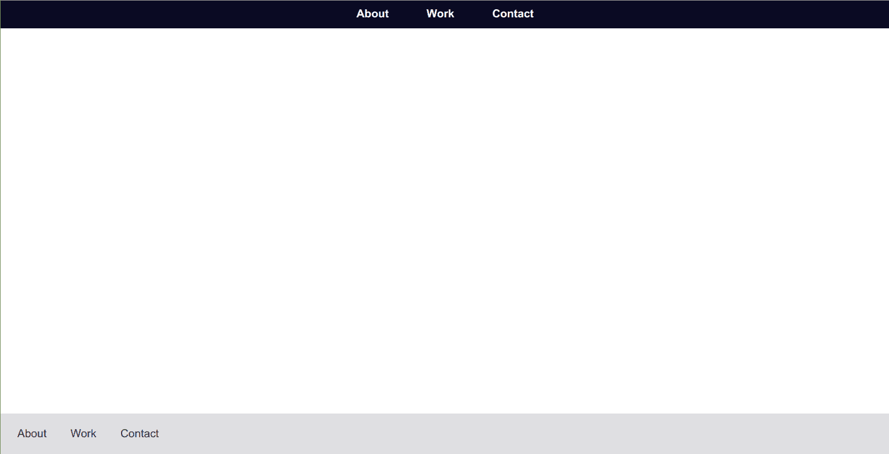
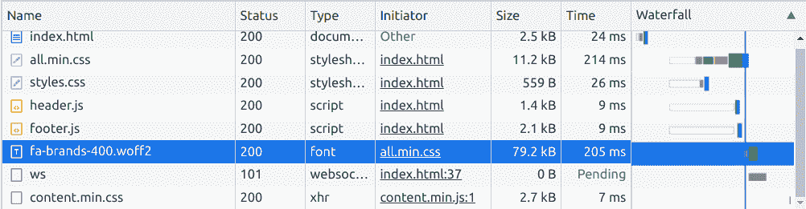

# 可重用的 HTML 组件——如何在网站上重用页眉和页脚

> 原文：<https://www.freecodecamp.org/news/reusable-html-components-how-to-reuse-a-header-and-footer-on-a-website/>

假设你正在为一个客户建立一个网站，一个只有两页的小型夫妻店。

那不是很多。因此，当您完成登录页面的工作并开始联系页面时，您只需创建一个新的 HTML 文件并复制第一页的所有代码。

页眉和页脚看起来已经很好了，你需要做的就是改变其余的内容。

但是如果你的客户想要 10 页呢？还是 20？并且他们要求在整个开发过程中对页眉和页脚进行微小的修改。

突然之间，任何改变，不管多小，都必须在所有这些文件中重复。

这是 React 或 Handlebars.js 解决的主要问题之一:任何代码，尤其是像页眉或页脚这样的结构性内容，都可以编写一次，并在整个项目中轻松重用。

直到最近，在普通的 HTML 和 JavaScript 中使用组件还是不可能的。但是随着 Web 组件的引入，不使用 React 之类的东西就可以创建可重用的组件。

## 什么是 Web 组件？

Web 组件实际上是允许您创建自定义 HTML 元素的几种不同技术的集合。

这些技术是:

*   **[HTML 模板](https://developer.mozilla.org/en-US/docs/Web/Web_Components/Using_templates_and_slots)** :使用`<template>`元素的 HTML 标记片段，在用 JavaScript 将它们附加到页面之前不会被呈现。
*   **[自定义元素](https://developer.mozilla.org/en-US/docs/Web/Web_Components/Using_custom_elements)** :广泛支持的 JavaScript APIs，允许您创建新的 DOM 元素。一旦使用这些 API 创建并注册了一个定制元素，就可以像使用 React 组件一样使用它。
*   **[阴影 DOM](https://developer.mozilla.org/en-US/docs/Web/Web_Components/Using_shadow_DOM)** :一个较小的封装 DOM，与主 DOM 分离，单独呈现。在影子 DOM 中为定制组件创建的任何样式和脚本都不会影响主 DOM 中的其他元素。

在整个教程中，我们将深入探讨每一个问题。

## 如何使用 HTML 模板

难题的第一部分是学习如何使用 HTML 模板来创建可重用的 HTML markdown。

让我们看一个简单的欢迎消息示例:

```
<!DOCTYPE html>
<html>
  <head>
    <meta charset="UTF-8">
    <meta name="viewport" content="width=device-width, initial-scale=1.0">
    <meta http-equiv="X-UA-Compatible" content="ie=edge">
    <link href="style.css" rel="stylesheet" type="text/css" />
    <script src="index.js" type="text/javascript" defer></script>
  </head>
  <body>
    <template id="welcome-msg">
      <h1>Hello, World!</h1>
      <p>And all who inhabit it</p>
    </template>
  </body>
<html> 
```

index.html

如果您查看页面，则不会呈现`<h1>`或`<p>`元素。但是如果您打开 dev 控制台，您会看到两个元素都已被解析:



要实际呈现欢迎消息，您需要使用一点 JavaScript:

```
const template = document.getElementById('welcome-msg');

document.body.appendChild(template.content); 
```

index.js



尽管这是一个非常简单的例子，但是您已经可以看到使用模板是如何使在整个页面中重用代码变得容易的。

主要问题是，至少在当前的例子中，欢迎消息代码与页面的其余内容混合在一起。如果您想稍后更改欢迎消息，您需要更改多个文件的代码。

相反，您可以将 HTML 模板放入 JavaScript 文件中，这样包含 JavaScript 的任何页面都将呈现欢迎消息:

```
<!DOCTYPE html>
<html>
  <head>
    <meta charset="UTF-8">
    <meta name="viewport" content="width=device-width, initial-scale=1.0">
    <meta http-equiv="X-UA-Compatible" content="ie=edge">
    <link href="style.css" rel="stylesheet" type="text/css" />
    <script src="index.js" type="text/javascript" defer></script>
  </head>
  <body>

  </body>
<html> 
```

index.html

```
const template = document.createElement('template');

template.innerHTML = `
  <h1>Hello, World!</h1>
  <p>And all who inhabit it</p>
`;

document.body.appendChild(template.content); 
```

index.js

现在一切都在 JavaScript 文件中了，您不需要创建一个`<template>`元素——您可以轻松地创建一个`<div>`或`<span>`。

然而，`<template>`元素可以与一个`<slot>`元素配对，这允许您做一些事情，比如在`<template>`中改变元素的文本。这超出了本教程的范围，所以你可以在 MDN 上阅读更多关于`<slot>`元素[的内容。](https://developer.mozilla.org/en-US/docs/Web/Web_Components/Using_templates_and_slots#Adding_flexibility_with_slots)

## 如何创建自定义元素

你可能已经注意到 HTML 模板的一点是，在正确的地方插入代码是很棘手的。前面的欢迎消息示例只是附加到页面上。

如果页面上已经有内容，比如一个横幅图像，欢迎信息就会出现在它的下面。

作为一个自定义元素，您的欢迎消息可能如下所示:

```
<welcome-message></welcome-message> 
```

你可以把它放在页面上任何你想放的地方。

记住这一点，让我们看看自定义元素，并创建我们自己的 React-like header 和 footer 元素。

### 设置

对于一个投资组合网站，您可能有一些样板代码，如下所示:

```
<!DOCTYPE html>
<html>
  <head>
    <meta charset="UTF-8">
    <meta name="viewport" content="width=device-width, initial-scale=1.0">
    <meta http-equiv="X-UA-Compatible" content="ie=edge">
    <link href="style.css" rel="stylesheet" type="text/css" />
  </head>
  <body>
    <main>
      <!-- Your page's content -->
    </main>
  </body>
<html> 
```

index.html

```
* {
  margin: 0;
  padding: 0;
  box-sizing: border-box;
}

html, body {
  height: 100%;
}

body {
  color: #333;
  font-family: sans-serif;
  display: flex;
  flex-direction: column;
}

main {
  flex: 1 0 auto;
} 
```

style.css

每个页面都有相同的页眉和页脚，所以为每个页面创建一个自定义元素是有意义的。

让我们从标题开始。

### 定义自定义元素

首先，创建一个名为`components`的目录，在该目录中，使用以下代码创建一个名为`header.js`的新文件:

```
class Header extends HTMLElement {
  constructor() {
    super();
  }
} 
```

components/header.js

这只是一个简单的 ES5 `Class`声明您的定制`Header`组件，使用`constructor`方法和特殊的`super`关键字。你可以在 MDN 上阅读更多关于那些[的内容。](https://developer.mozilla.org/en-US/docs/Web/JavaScript/Reference/Classes)

通过扩展泛型`[HTMLElement](https://developer.mozilla.org/en-US/docs/Web/API/HTMLElement)`类，您可以创建任何想要的元素。也可以扩展像`[HTMLParagraphElement](https://developer.mozilla.org/en-US/docs/Web/API/HTMLParagraphElement)`这样的特定元素。

### 注册您的自定义元素

在开始使用定制元素之前，您需要用`customElements.define()`方法注册它:

```
class Header extends HTMLElement {
  constructor() {
    super();
  }
}

customElements.define('header-component', Header); 
```

components/header.js

这个方法至少需要两个参数。

第一个是将组件添加到页面时使用的`DOMString`，在本例中是`<header-component></header-component>`。

下一个是您之前创建的组件的类，这里是`Header`类。

可选的第三个参数描述您的定制元素从哪个现有的 HTML 元素继承属性，例如，`{extends: 'p'}`。但是我们不会在本教程中使用这个特性。

### 使用生命周期回调将页眉添加到页面

对于定制元素，有四个特殊的生命周期回调函数，我们可以用来将 header markdown 追加到页面:`connectedCallback`、`attributeChangeCallback`、`disconnectedCallback`和`adoptedCallback`。

在这些回调函数中，`connectedCallback`是最常用的一个。`connectedCallback`每次将定制元素插入 DOM 时运行。

你可以在这里阅读更多关于其他试镜[的内容。](https://developer.mozilla.org/en-US/docs/Web/Web_Components/Using_custom_elements#Using_the_lifecycle_callbacks)

对于我们这个简单的例子，`connectedCallback`足以向页面添加一个标题:

```
class Header extends HTMLElement {
  constructor() {
    super();
  }

  connectedCallback() {
    this.innerHTML = `
      <style>
        nav {
          height: 40px;
          display: flex;
          align-items: center;
          justify-content: center;
          background-color:  #0a0a23;
        }

        ul {
          padding: 0;
        }

        a {
          font-weight: 700;
          margin: 0 25px;
          color: #fff;
          text-decoration: none;
        }

        a:hover {
          padding-bottom: 5px;
          box-shadow: inset 0 -2px 0 0 #fff;
        }
      </style>
      <header>
        <nav>
          <ul>
            <li><a href="about.html">About</a></li>
            <li><a href="work.html">Work</a></li>
            <li><a href="contact.html">Contact</a></li>
          </ul>
        </nav>
      </header>
    `;
  }
}

customElements.define('header-component', Header); 
```

components/header.js

然后在`index.html`中，将`components/header.js`脚本和`<header-component></header-component>`添加到`<main>`元素的正上方:

```
<!DOCTYPE html>
<html>
  <head>
    <meta charset="UTF-8">
    <meta name="viewport" content="width=device-width, initial-scale=1.0">
    <meta http-equiv="X-UA-Compatible" content="ie=edge">
    <link href="style.css" rel="stylesheet" type="text/css" />
    <script src="components/header.js" type="text/javascript" defer></script>
  </head>
  <body>
    <header-component></header-component>
    <main>
      <!-- Your page's content -->
    </main>
  </body>
<html> 
```

index.html

并且您的可重用标题组件应该呈现在页面上:



现在，给页面添加一个标题就像添加一个指向`components/header.js`的`<script>`标签一样简单，并且在你想要的任何地方添加`<header-component></header-component>`。

注意，由于头及其样式被直接插入到主 DOM 中，所以可以在`style.css`文件中对其进行样式化。

但是如果你看看包含在`connectedCallback`中的标题样式，它们是非常通用的，并且会影响页面上的其他样式。

例如，如果我们给`index.html`添加字体 Awesome 和页脚组件:

```
<!DOCTYPE html>
<html>
  <head>
    <meta charset="UTF-8">
    <meta name="viewport" content="width=device-width, initial-scale=1.0">
    <meta http-equiv="X-UA-Compatible" content="ie=edge">
    <link rel="stylesheet" href="https://cdnjs.cloudflare.com/ajax/libs/font-awesome/5.15.1/css/all.min.css" integrity="sha512-+4zCK9k+qNFUR5X+cKL9EIR+ZOhtIloNl9GIKS57V1MyNsYpYcUrUeQc9vNfzsWfV28IaLL3i96P9sdNyeRssA==" crossorigin="anonymous" />
    <link href="style.css" rel="stylesheet" type="text/css" />
    <script src="components/header.js" type="text/javascript" defer></script>
    <script src="components/footer.js" type="text/javascript" defer></script>
  </head>
  <body>
    <header-component></header-component>
    <main>
      <!-- Your page's content -->
    </main>
    <footer-component></footer-component>
  </body>
<html> 
```

index.html

```
class Footer extends HTMLElement {
  constructor() {
    super();
  }

  connectedCallback() {
    this.innerHTML = `
      <style>
        footer {
          height: 60px;
          padding: 0 10px;
          list-style: none;
          display: flex;
          justify-content: space-between;
          align-items: center;
          background-color: #dfdfe2;
        }

        ul li {
          list-style: none;
          display: inline;
        }

        a {
          margin: 0 15px;
          color: inherit;
          text-decoration: none;
        }

        a:hover {
          padding-bottom: 5px;
          box-shadow: inset 0 -2px 0 0 #333;
        }

        .social-row {
          font-size: 20px;
        }

        .social-row li a {
          margin: 0 15px;
        }
      </style>
      <footer>
        <ul>
          <li><a href="about.html">About</a></li>
          <li><a href="work.html">Work</a></li>
          <li><a href="contact.html">Contact</a></li>
        </ul>
        <ul class="social-row">
          <li><a href="https://github.com/my-github-profile"><i class="fab fa-github"></i></a></li>
          <li><a href="https://twitter.com/my-twitter-profile"><i class="fab fa-twitter"></i></a></li>
          <li><a href="https://www.linkedin.com/in/my-linkedin-profile"><i class="fab fa-linkedin"></i></a></li>
        </ul>
      </footer>
    `;
  }
}

customElements.define('footer-component', Footer); 
```

components/footer.js

以下是该页面的外观:



页脚组件的样式会覆盖页眉的样式，从而改变链接的颜色。这是 CSS 的预期行为，但如果每个组件的样式都局限于该组件，并且不会影响页面上的其他内容，那就更好了。

嗯，那正是阴影 DOM 发光的地方。还是墨镜？反正暗影 DOM 可以做到。

### 如何使用自定义元素的阴影 Dom

影子 DOM 充当主 DOM 的一个独立的、较小的实例。影子 DOM 更像是自定义元素的子树，而不是主 DOM 的副本。添加到 Shadow DOM 中的任何东西，尤其是样式，都在特定的自定义元素范围内。

在某种程度上，这就像使用`const`和`let`而不是`var`。

让我们从重构 header 组件开始:

```
const headerTemplate = document.createElement('template');

headerTemplate.innerHTML = `
  <style>
    nav {
      height: 40px;
      display: flex;
      align-items: center;
      justify-content: center;
      background-color:  #0a0a23;
    }

    ul {
      padding: 0;
    }

    ul li {
      list-style: none;
      display: inline;
    }

    a {
      font-weight: 700;
      margin: 0 25px;
      color: #fff;
      text-decoration: none;
    }

    a:hover {
      padding-bottom: 5px;
      box-shadow: inset 0 -2px 0 0 #fff;
    }
  </style>
  <header>
    <nav>
      <ul>
        <li><a href="about.html">About</a></li>
        <li><a href="work.html">Work</a></li>
        <li><a href="contact.html">Contact</a></li>
      </ul>
    </nav>
  </header>
`;

class Header extends HTMLElement {
  constructor() {
    super();
  }

  connectedCallback() {

  }
}

customElements.define('header-component', Header); 
```

components/header.js

您需要做的第一件事是使用`.attachShadow()`方法将一个影子根附加到您的自定义 header 组件元素上。在`connectedCallback`中，添加以下代码:

```
...
class Header extends HTMLElement {
  constructor() {
    super();
  }

  connectedCallback() {
    const shadowRoot = this.attachShadow({ mode: 'closed' });
  }
}

customElements.define('header-component', Header); 
```

components/header.js

注意，我们将一个对象传递给带有选项`mode: 'closed'`的`.attachShadow()`。这仅仅意味着外部 JavaScript 无法访问 header 组件的影子 DOM。

如果您想稍后用 JavaScript 在`components/header.js`文件之外操作 header 组件的影子 DOM，只需将选项更改为`mode: 'open'`。

最后，用`.appendChild()`方法将`shadowRoot`追加到页面:

```
...

class Header extends HTMLElement {
  constructor() {
    super();
  }

  connectedCallback() {
    const shadowRoot = this.attachShadow({ mode: 'closed' });

    shadowRoot.appendChild(headerTemplate.content);
  }
}

customElements.define('header-component', Header); 
```

components/header.js

现在，由于 header 组件的样式封装在它的 Shadow DOM 中，页面应该如下所示:



下面是为了使用影子 DOM 而重构的页脚组件:

```
const footerTemplate = document.createElement('template');

footerTemplate.innerHTML = `
  <style>
    footer {
      height: 60px;
      padding: 0 10px;
      list-style: none;
      display: flex;
      flex-shrink: 0;
      justify-content: space-between;
      align-items: center;
      background-color: #dfdfe2;
    }

    ul {
      padding: 0;
    }

    ul li {
      list-style: none;
      display: inline;
    }

    a {
      margin: 0 15px;
      color: inherit;
      text-decoration: none;
    }

    a:hover {
      padding-bottom: 5px;
      box-shadow: inset 0 -2px 0 0 #333;
    }

    .social-row {
      font-size: 20px;
    }

    .social-row li a {
      margin: 0 15px;
    }
  </style>
  <footer>
    <ul>
      <li><a href="about.html">About</a></li>
      <li><a href="work.html">Work</a></li>
      <li><a href="contact.html">Contact</a></li>
    </ul>
    <ul class="social-row">
      <li><a href="https://github.com/my-github-profile"><i class="fab fa-github"></i></a></li>
      <li><a href="https://twitter.com/my-twitter-profile"><i class="fab fa-twitter"></i></a></li>
      <li><a href="https://www.linkedin.com/in/my-linkedin-profile"><i class="fab fa-linkedin"></i></a></li>
    </ul>
  </footer>
`;

class Footer extends HTMLElement {
  constructor() {
    super();
  }

  connectedCallback() {
    const shadowRoot = this.attachShadow({ mode: 'closed' });

    shadowRoot.appendChild(footerTemplate.content);
  }
}

customElements.define('footer-component', Footer); 
```

components/footer.js

但是如果你在页面上查看，你会注意到字体牛逼图标现在不见了:



现在 footer 组件被封装在自己的 Shadow DOM 中，它不再能够访问`index.html`中的 Font Awesome CDN 链接。

让我们快速看看这是为什么，以及如何让字体真棒再次工作。

## 封装和影子 DOM

虽然 Shadow DOM 确实可以防止组件的样式影响页面的其他部分，但是一些全局样式仍然会泄漏到组件中。

在上面的例子中，这是一个有用的特性。例如，页脚组件继承了在`style.css`中设置的`color: #333`声明。这是因为`color`和`font`、`font-family`、`direction`等等都是少数可继承的财产之一。

如果您想防止这种行为，并完全从头开始设计每个组件的样式，只需几行 CSS 就可以做到:

```
:host {
  all: initial;
  display: block;
}
```

`:host`是一个伪选择器，它选择托管影子 DOM 的元素。在这种情况下，这是您的自定义组件。

然后,`all: initial`声明将所有 CSS 属性设置回初始值。而`display: block`对`display`属性做同样的事情，并将其设置回浏览器默认值`block`。

要获得 CSS 可继承属性的完整列表，请查看这个关于堆栈溢出的答案。

## 如何在阴影 DOM 中使用字体 Awesome

现在你可能会想，如果`font`、`font-family`等字体相关的 CSS 属性都是可继承的属性，为什么现在 footer 组件在使用 Shadow DOM，Font Awesome 却不加载呢？

事实证明，对于像字体和其他资产这样的东西，它们需要在主 DOM 和影子 DOM 中都被引用才能正常工作。

幸运的是，有一些简单的方法可以解决这个问题。

注意:所有这些方法仍然要求字体 Awesome 包含在带有`link`元素的`index.html`中，就像上面的代码片段一样。

### #1:在你的组件中链接到字体 Awesome

让 Font Awesome 在 Shadow DOM 组件中工作的最直接的方法是在组件本身中包含一个`link`:

```
const footerTemplate = document.createElement('template');

footerTemplate.innerHTML = `
  <link rel="stylesheet" href="https://cdnjs.cloudflare.com/ajax/libs/font-awesome/5.15.1/css/all.min.css" integrity="sha512-+4zCK9k+qNFUR5X+cKL9EIR+ZOhtIloNl9GIKS57V1MyNsYpYcUrUeQc9vNfzsWfV28IaLL3i96P9sdNyeRssA==" crossorigin="anonymous" />
  <style>
    footer {
      height: 60px;
      padding: 0 10px;
      list-style: none;
...
```

components/footer.js

需要注意的一点是，虽然您似乎让浏览器加载了两次字体 Awesome(一次用于主 DOM，另一次用于组件)，但浏览器足够聪明，不会再次获取相同的资源。

这是网络标签，显示 Chrome 只读取字体 Awesome 一次:



### #2:在组件中导入字体 Awesome

接下来，您可以使用`@import`和`url()`将字体 Awesome 加载到您的组件中:

```
const footerTemplate = document.createElement('template');

footerTemplate.innerHTML = `
  <style>
    @import url("https://cdnjs.cloudflare.com/ajax/libs/font-awesome/5.15.1/css/all.min.css");

    footer {
      height: 60px;
      padding: 0 10px;
      list-style: none;
...
```

请注意，该 URL 应该与您在`index.html`中使用的 URL 相同。

### #3:使用 JavaScript 将字体 Awesome 动态加载到组件中

最后，在组件中加载字体 Awesome 最枯燥的方法是使用一点 JavaScript:

```
...
class Footer extends HTMLElement {
  constructor() {
    super();
  }

  connectedCallback() {
    // Query the main DOM for FA
    const fontAwesome = document.querySelector('link[href*="font-awesome"]');
    const shadowRoot = this.attachShadow({ mode: 'closed' });

    // Conditionally load FA to the component
    if (fontAwesome) {
      shadowRoot.appendChild(fontAwesome.cloneNode());
    }

    shadowRoot.appendChild(footerTemplate.content);
  }
}

customElements.define('footer-component', Footer);
```

components/footer.js

这种方法是基于[这个关于堆栈溢出](https://stackoverflow.com/a/55360574)的答案，并且非常简单。当组件加载时，如果存在一个指向字体 Awesome 的`link`元素，那么它将被克隆并附加到组件的 Shadow DOM:


## 最终代码

下面是跨所有文件的最终代码，使用方法#3 将字体 Awesome 加载到页脚组件中:

```
<!DOCTYPE html>
<html>
  <head>
    <meta charset="UTF-8">
    <meta name="viewport" content="width=device-width, initial-scale=1.0">
    <meta http-equiv="X-UA-Compatible" content="ie=edge">
    <link rel="stylesheet" href="https://cdnjs.cloudflare.com/ajax/libs/font-awesome/5.15.1/css/all.min.css" integrity="sha512-+4zCK9k+qNFUR5X+cKL9EIR+ZOhtIloNl9GIKS57V1MyNsYpYcUrUeQc9vNfzsWfV28IaLL3i96P9sdNyeRssA==" crossorigin="anonymous" />
    <link href="style.css" rel="stylesheet" type="text/css" />
    <script src="components/header.js" type="text/javascript" defer></script>
    <script src="components/footer.js" type="text/javascript" defer></script>
  </head>
  <body>
    <header-component></header-component>
    <main>
      <!-- Your page's content -->
    </main>
    <footer-component></footer-component>
  </body>
<html> 
```

index.html

```
* {
  margin: 0;
  padding: 0;
  box-sizing: border-box;
}

html,
body {
  height: 100%;
}

body {
  color: #333;
  font-family: sans-serif;
  display: flex;
  flex-direction: column;
}

main {
  flex: 1 0 auto;
} 
```

style.css

```
const headerTemplate = document.createElement('template');

headerTemplate.innerHTML = `
  <style>
    nav {
      height: 40px;
      display: flex;
      align-items: center;
      justify-content: center;
      background-color:  #0a0a23;
    }

    ul {
      padding: 0;
    }

    ul li {
      list-style: none;
      display: inline;
    }

    a {
      font-weight: 700;
      margin: 0 25px;
      color: #fff;
      text-decoration: none;
    }

    a:hover {
      padding-bottom: 5px;
      box-shadow: inset 0 -2px 0 0 #fff;
    }
  </style>
  <header>
    <nav>
      <ul>
        <li><a href="about.html">About</a></li>
        <li><a href="work.html">Work</a></li>
        <li><a href="contact.html">Contact</a></li>
      </ul>
    </nav>
  </header>
`;

class Header extends HTMLElement {
  constructor() {
    super();
  }

  connectedCallback() {
    const shadowRoot = this.attachShadow({ mode: 'closed' });

    shadowRoot.appendChild(headerTemplate.content);
  }
}

customElements.define('header-component', Header); 
```

components/header.js

```
const footerTemplate = document.createElement('template');

footerTemplate.innerHTML = `
  <style>
    footer {
      height: 60px;
      padding: 0 10px;
      list-style: none;
      display: flex;
      flex-shrink: 0;
      justify-content: space-between;
      align-items: center;
      background-color: #dfdfe2;
    }

    ul {
      padding: 0;
    }

    ul li {
      list-style: none;
      display: inline;
    }

    a {
      margin: 0 15px;
      color: inherit;
      text-decoration: none;
    }

    a:hover {
      padding-bottom: 5px;
      box-shadow: inset 0 -2px 0 0 #333;
    }

    .social-row {
      font-size: 20px;
    }

    .social-row li a {
      margin: 0 15px;
    }
  </style>
  <footer>
    <ul>
      <li><a href="about.html">About</a></li>
      <li><a href="work.html">Work</a></li>
      <li><a href="contact.html">Contact</a></li>
    </ul>
    <ul class="social-row">
      <li><a href="https://github.com/my-github-profile"><i class="fab fa-github"></i></a></li>
      <li><a href="https://twitter.com/my-twitter-profile"><i class="fab fa-twitter"></i></a></li>
      <li><a href="https://www.linkedin.com/in/my-linkedin-profile"><i class="fab fa-linkedin"></i></a></li>
    </ul>
  </footer>
`;

class Footer extends HTMLElement {
  constructor() {
    super();
  }

  connectedCallback() {
    const fontAwesome = document.querySelector('link[href*="font-awesome"]');
    const shadowRoot = this.attachShadow({ mode: 'closed' });

    if (fontAwesome) {
      shadowRoot.appendChild(fontAwesome.cloneNode());
    }

    shadowRoot.appendChild(footerTemplate.content);
  }
}

customElements.define('footer-component', Footer); 
```

components/footer.js

## 最后

我们在这里已经介绍了很多，您可能已经决定只使用 React 或 Handlebars.js。

这些都是很好的选择！

尽管如此，对于一个较小的项目，你只需要几个可重用的组件，一个完整的库或模板语言可能是多余的。

希望现在你有信心创建自己的可重用 HTML 组件。现在，走出去，创造一些伟大的(和可重用的)东西。